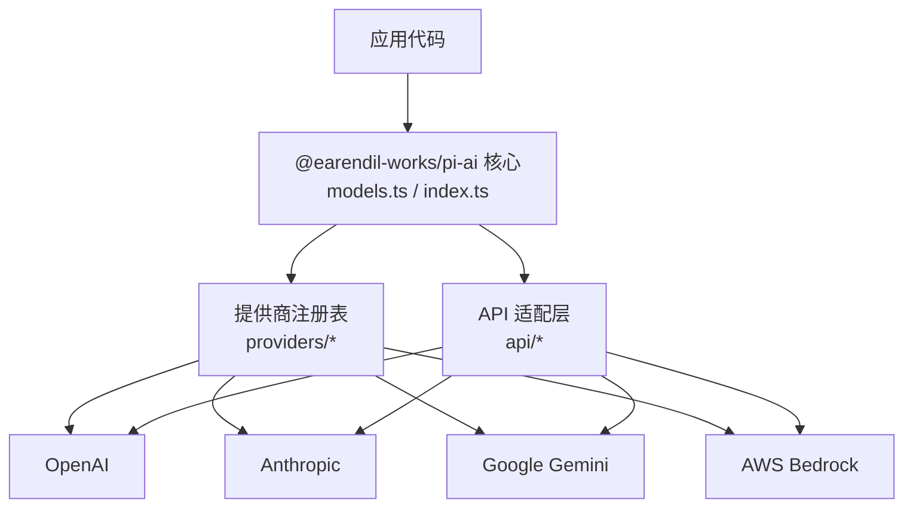
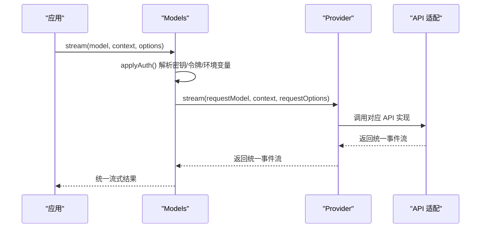
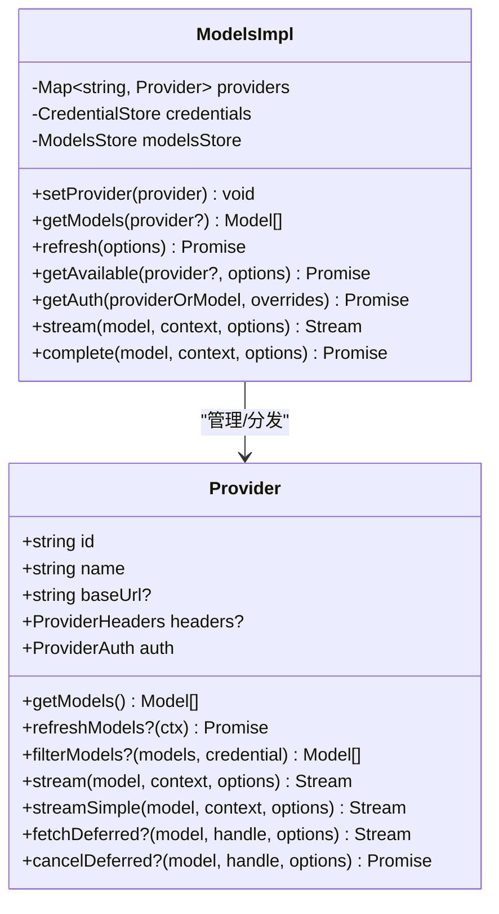
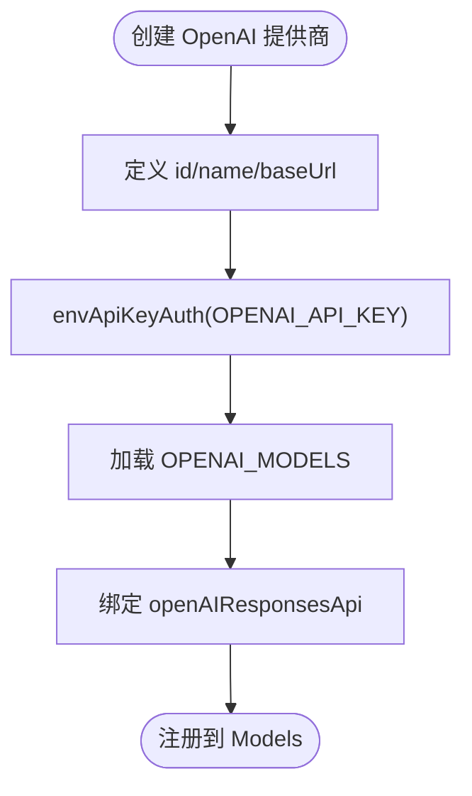
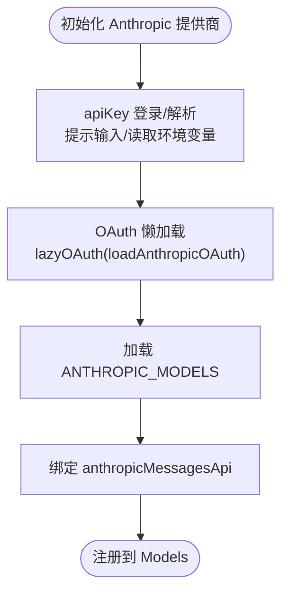
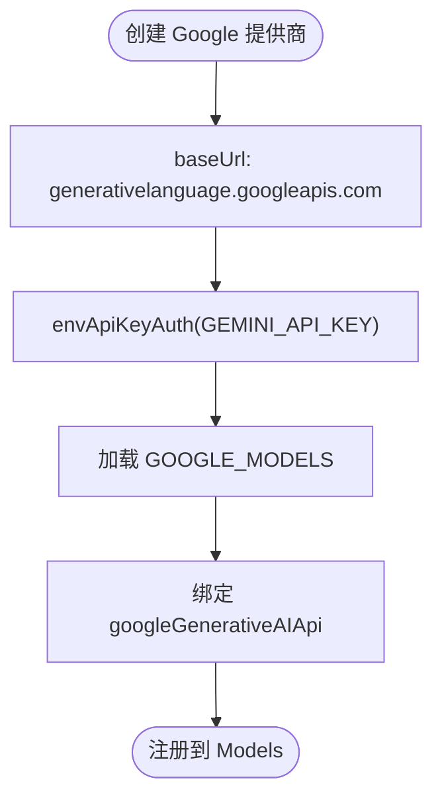
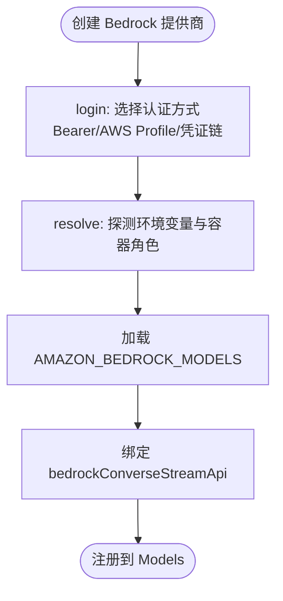
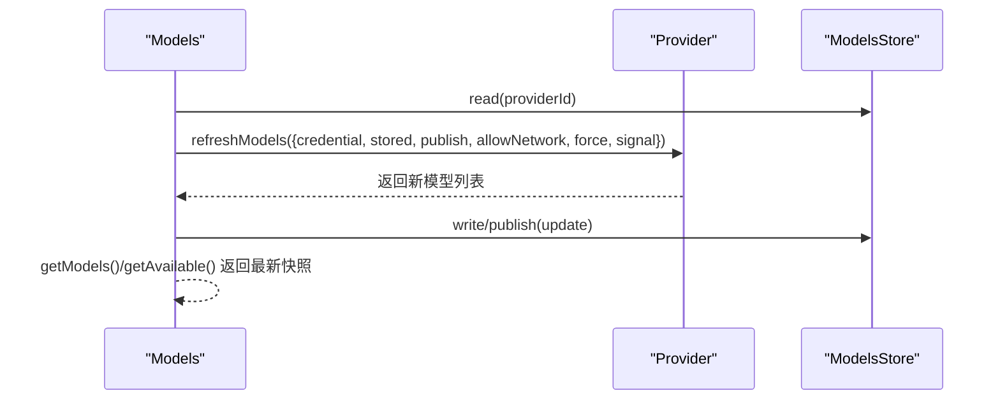
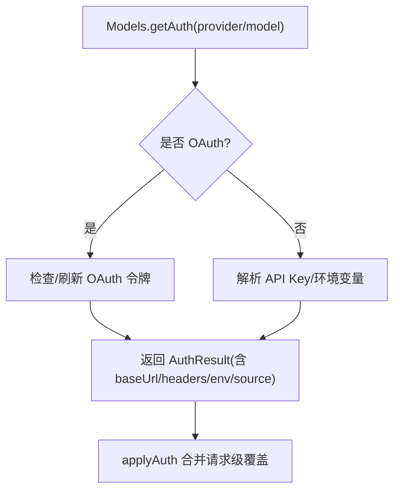
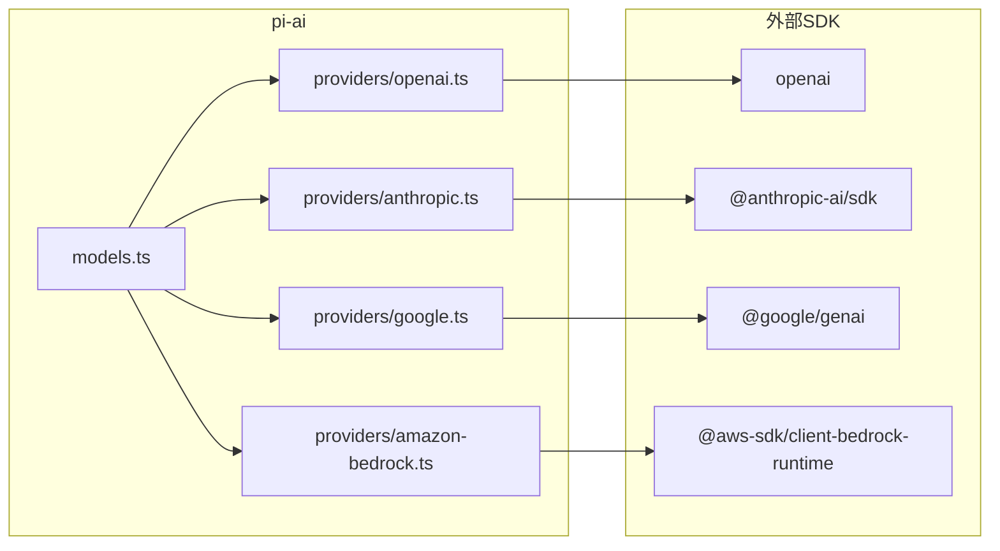

# AI 抽象层

<cite>
**本文引用的文件**
- [README.md](file://README.md)
- [package.json](file://packages/ai/package.json)
- [index.ts](file://packages/ai/src/index.ts)
- [models.ts](file://packages/ai/src/models.ts)
- [openai.ts](file://packages/ai/src/providers/openai.ts)
- [anthropic.ts](file://packages/ai/src/providers/anthropic.ts)
- [google.ts](file://packages/ai/src/providers/google.ts)
- [amazon-bedrock.ts](file://packages/ai/src/providers/amazon-bedrock.ts)
</cite>

## 目录
1. [简介](#简介)
2. [项目结构](#项目结构)
3. [核心组件](#核心组件)
4. [架构总览](#架构总览)
5. [详细组件分析](#详细组件分析)
6. [依赖关系分析](#依赖关系分析)
7. [性能与可靠性](#性能与可靠性)
8. [故障排查指南](#故障排查指南)
9. [结论](#结论)
10. [附录：新提供商集成指南](#附录：新提供商集成指南)

## 简介
本仓库中的 @earendil-works/pi-ai 提供统一的 LLM API，屏蔽不同 AI 提供商（OpenAI、Anthropic、Google Gemini、AWS Bedrock 等）的差异。通过“适配器模式 + 模型发现 + 认证管理”的设计，上层应用只需面向统一接口进行调用，即可在多种后端之间切换或组合使用。该抽象层支持流式响应、延迟响应、请求头转换、重试与超时控制、成本与用量统计等能力，并提供多账户与 OAuth 的认证管理能力。

## 项目结构
- 顶层 README 将 pi-ai 定位为“统一多提供商 LLM API”，并说明构建与测试方式。
- packages/ai 为统一 LLM 抽象层包，导出核心类型、工具、认证上下文、模型集合与提供商工厂；各提供商实现位于 src/providers/*，API 适配实现位于 src/api/*。
- 包 exports 暴露了兼容层、OAuth、Bedrock 扩展入口以及 providers/*、api/* 子模块，便于按需引入。

图表来源
- [index.ts:1-48](file://packages/ai/src/index.ts#L1-L48)
- [models.ts:88-149](file://packages/ai/src/models.ts#L88-L149)

章节来源
- [README.md:13-35](file://README.md#L13-L35)
- [package.json:1-101](file://packages/ai/package.json#L1-L101)
- [index.ts:1-48](file://packages/ai/src/index.ts#L1-L48)

## 核心组件
- Provider（提供商）：封装 id/name/baseUrl/auth/getModels/stream 等能力，是具体后端的运行时单元。
- Models（模型集合）：维护 Provider 集合，负责认证解析、模型刷新、可用模型过滤、流式/完整响应调度。
- 认证系统：支持 API Key、OAuth、环境注入、多账户存储与刷新；提供 login/logout/checkAuth 等能力。
- 模型发现：静态模型清单 + 动态刷新（可缓存/持久化），支持按 provider 并发刷新与失败隔离。
- API 适配：针对不同提供商的消息格式、流协议、错误码等进行统一封装，向上暴露一致的流式事件。

章节来源
- [models.ts:88-149](file://packages/ai/src/models.ts#L88-L149)
- [models.ts:151-230](file://packages/ai/src/models.ts#L151-L230)
- [models.ts:254-737](file://packages/ai/src/models.ts#L254-L737)
- [index.ts:1-48](file://packages/ai/src/index.ts#L1-L48)

## 架构总览
统一 LLM API 采用“Provider + API 适配”的适配器模式：
- 每个提供商通过 createProvider 声明其元数据、认证方式、模型列表与 API 实现。
- ModelsImpl 集中处理认证解析、模型刷新、请求头合并与分发，屏蔽底层差异。
- 上层仅依赖 Model 与统一流式接口，无需关心具体提供商细节。

图表来源
- [models.ts:667-679](file://packages/ai/src/models.ts#L667-L679)
- [models.ts:636-665](file://packages/ai/src/models.ts#L636-L665)

## 详细组件分析

### 提供商抽象与创建
- Provider 接口定义了 id/name/baseUrl/auth/getModels/stream/fetchDeferred/cancelDeferred 等能力，要求至少具备 auth 语义（即使无密钥也可检测配置）。
- createProvider 将静态模型与可选的动态模型合并，并按 model.api 分派到对应的 ProviderStreams 实现。

图表来源
- [models.ts:88-149](file://packages/ai/src/models.ts#L88-L149)
- [models.ts:254-737](file://packages/ai/src/models.ts#L254-L737)

章节来源
- [models.ts:88-149](file://packages/ai/src/models.ts#L88-L149)
- [models.ts:739-800](file://packages/ai/src/models.ts#L739-L800)

### OpenAI 提供商集成
- 通过 openaiProvider 声明 id/name/baseUrl/auth/models/api，auth 使用 envApiKeyAuth 从环境变量读取 API Key。
- 使用 openAIResponsesApi 作为 API 适配，屏蔽 OpenAI Responses/Completions 等差异。

图表来源
- [openai.ts:1-16](file://packages/ai/src/providers/openai.ts#L1-L16)

章节来源
- [openai.ts:1-16](file://packages/ai/src/providers/openai.ts#L1-L16)

### Anthropic 提供商集成
- 支持 API Key 与 OAuth 两种认证：apiKey 支持交互式输入与多环境变量回退；oauth 通过 lazyOAuth 加载订阅型凭证。
- 使用 anthropicMessagesApi 作为 API 适配。

图表来源
- [anthropic.ts:1-60](file://packages/ai/src/providers/anthropic.ts#L1-L60)

章节来源
- [anthropic.ts:1-60](file://packages/ai/src/providers/anthropic.ts#L1-L60)

### Google Gemini 提供商集成
- 通过 googleProvider 声明 base URL 与 apiKey，使用 envApiKeyAuth 读取 GEMINI_API_KEY。
- 使用 googleGenerativeAIApi 作为 API 适配。

图表来源
- [google.ts:1-16](file://packages/ai/src/providers/google.ts#L1-L16)

章节来源
- [google.ts:1-16](file://packages/ai/src/providers/google.ts#L1-L16)

### AWS Bedrock 提供商集成
- 支持 bearer token、AWS profile、默认凭证链等多种方式；login 流程提供交互选择，resolve 自动探测环境变量与容器角色。
- 使用 bedrockConverseStreamApi 作为 API 适配。

图表来源
- [amazon-bedrock.ts:1-91](file://packages/ai/src/providers/amazon-bedrock.ts#L1-L91)

章节来源
- [amazon-bedrock.ts:1-91](file://packages/ai/src/providers/amazon-bedrock.ts#L1-L91)

### 模型发现机制
- 静态模型：由 providers/*.models.ts 提供基线清单。
- 动态刷新：Provider 可实现 refreshModels，ModelsImpl 会并发刷新、恢复缓存、持久化更新，并在失败时保留上次已知列表。
- 可用模型过滤：Provider 可提供 filterModels，结合当前凭证进一步筛选可见模型。

图表来源
- [models.ts:338-446](file://packages/ai/src/models.ts#L338-L446)
- [models.ts:448-542](file://packages/ai/src/models.ts#L448-L542)

章节来源
- [models.ts:338-446](file://packages/ai/src/models.ts#L338-L446)
- [models.ts:448-542](file://packages/ai/src/models.ts#L448-L542)

### 认证管理
- API Key：通过 envApiKeyAuth 或自定义 apiKey.resolve/login 实现，支持多环境变量回退与交互式输入。
- OAuth：通过 lazyOAuth 与 load* 函数加载订阅型凭证，支持过期刷新与存储。
- 多账户：CredentialStore 支持按 provider 维度读写凭证；Models.login/logout/checkAuth 提供生命周期管理。
- 请求级覆盖：applyAuth 允许在单次请求中覆盖 apiKey/env/headers，并合并 Provider 级别头部。

图表来源
- [models.ts:544-665](file://packages/ai/src/models.ts#L544-L665)
- [anthropic.ts:9-41](file://packages/ai/src/providers/anthropic.ts#L9-L41)

章节来源
- [models.ts:544-665](file://packages/ai/src/models.ts#L544-L665)
- [anthropic.ts:9-41](file://packages/ai/src/providers/anthropic.ts#L9-L41)

### 消息格式标准化
- 各提供商的 API 适配（如 openAIResponsesApi、anthropicMessagesApi、googleGenerativeAIApi、bedrockConverseStreamApi）将不同消息结构与流协议转换为统一的 AssistantMessageEventStream。
- 上层通过 Models.stream/complete/streamSimple/completeSimple 获取统一结果，无需感知底层差异。

章节来源
- [models.ts:667-704](file://packages/ai/src/models.ts#L667-L704)

### 错误处理、速率限制与成本优化
- 错误处理：Models 将认证/刷新/流式过程中的异常包装为 ModelsError，区分 oauth/auth/provider/stream 等错误码，便于上层分类处理。
- 速率限制：可通过 Provider 级别的 retry/timeout 策略（由各 API 适配实现）与 Models 的请求级选项配合，避免瞬时风暴。
- 成本优化：通过模型清单中的成本信息（由生成数据提供）与 usage 统计，在上层做路由与预算控制。

章节来源
- [models.ts:37-81](file://packages/ai/src/models.ts#L37-L81)
- [models.ts:420-446](file://packages/ai/src/models.ts#L420-L446)

## 依赖关系分析
- 包依赖包括官方 SDK（openai、@anthropic-ai/sdk、@google/genai、@aws-sdk/client-bedrock-runtime）与通用工具（typebox、http-proxy-agent 等）。
- 内部依赖：providers/* 依赖 api/* 与 auth/*；models.ts 作为中枢协调 Provider 与认证、模型存储。

图表来源
- [package.json:62-74](file://packages/ai/package.json#L62-L74)
- [openai.ts:1-16](file://packages/ai/src/providers/openai.ts#L1-L16)
- [anthropic.ts:1-60](file://packages/ai/src/providers/anthropic.ts#L1-L60)
- [google.ts:1-16](file://packages/ai/src/providers/google.ts#L1-L16)
- [amazon-bedrock.ts:1-91](file://packages/ai/src/providers/amazon-bedrock.ts#L1-L91)

章节来源
- [package.json:62-74](file://packages/ai/package.json#L62-L74)

## 性能与可靠性
- 并发刷新：Models.refresh 对多个 Provider 并发执行，提升模型发现效率。
- 取消与超时：通过 AbortSignal 贯穿刷新与认证流程，避免阻塞与资源泄漏。
- 缓存与持久化：刷新前恢复 stored 快照，成功后再写入 ModelsStore，保证一致性。
- 最佳实践建议：
  - 合理设置刷新频率与 force 参数，避免频繁网络请求。
  - 在高频场景下启用连接复用与请求级超时。
  - 对关键路径增加重试与退避策略，降低抖动影响。

[本节为通用指导，不直接分析具体文件]

## 故障排查指南
- 认证失败：检查 provider 的 apiKey/oauth 是否已配置；使用 checkAuth 验证状态；查看 ModelsError 的错误码定位问题来源。
- 模型不可用：确认已通过 refresh 刷新模型列表；必要时传入 force 强制刷新；检查 filterModels 是否过滤掉了目标模型。
- 流式中断：关注 AbortSignal 是否被触发；检查网络代理与超时配置；核对提供商限流与配额。
- 多账户冲突：确保 CredentialStore 中按 provider 维度正确隔离；必要时 logout 后重新 login。

章节来源
- [models.ts:420-446](file://packages/ai/src/models.ts#L420-L446)
- [models.ts:511-542](file://packages/ai/src/models.ts#L511-L542)

## 结论
pi-ai 通过 Provider + API 适配的统一抽象，屏蔽了多家 AI 提供商的差异，提供了健壮的认证管理、模型发现、流式通信与错误处理能力。借助 createProvider 与 createModels，开发者可以以最小成本接入新提供商，并在多账户、多模型、多环境的复杂场景中保持稳定的上层体验。

[本节为总结性内容，不直接分析具体文件]

## 附录：新提供商集成指南
- 步骤概览
  1) 新建 providers/<your>.ts，使用 createProvider 声明 id/name/baseUrl/auth/models/api。
  2) 在 auth 中实现 apiKey 或 oauth（参考 anthropic.ts 的多源解析与交互登录）。
  3) 提供模型清单（静态或动态），并通过 fetchModels 实现动态发现（参考 models.ts 刷新流程）。
  4) 绑定 API 适配（参考 openai.ts/anthropic.ts/google.ts/amazon-bedrock.ts）。
  5) 在应用侧通过 createModels().setProvider(...) 注册，并使用 Models.stream/complete 调用。

- 认证要点
  - API Key：优先从环境变量读取，支持交互式输入与多键回退。
  - OAuth：使用 lazyOAuth 与 load* 函数，支持过期刷新与存储。
  - 多账户：CredentialStore 按 provider 隔离；提供 login/logout/checkAuth。

- 模型发现要点
  - 静态清单：在 models.ts 中声明基线模型。
  - 动态刷新：实现 refreshModels，利用 context.publish 持久化更新。
  - 可用过滤：实现 filterModels，基于凭证裁剪可见模型。

- 错误与性能
  - 使用 ModelsError 分类错误，便于上层处理。
  - 合理使用 AbortSignal 与超时，避免长时间阻塞。
  - 在高并发场景下考虑重试与退避策略。

章节来源
- [models.ts:739-800](file://packages/ai/src/models.ts#L739-L800)
- [anthropic.ts:9-60](file://packages/ai/src/providers/anthropic.ts#L9-L60)
- [openai.ts:1-16](file://packages/ai/src/providers/openai.ts#L1-L16)
- [google.ts:1-16](file://packages/ai/src/providers/google.ts#L1-L16)
- [amazon-bedrock.ts:1-91](file://packages/ai/src/providers/amazon-bedrock.ts#L1-L91)