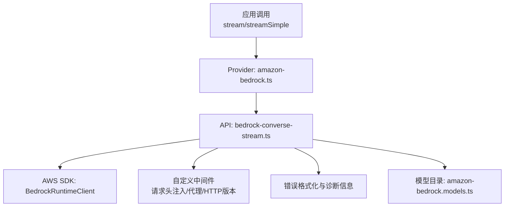
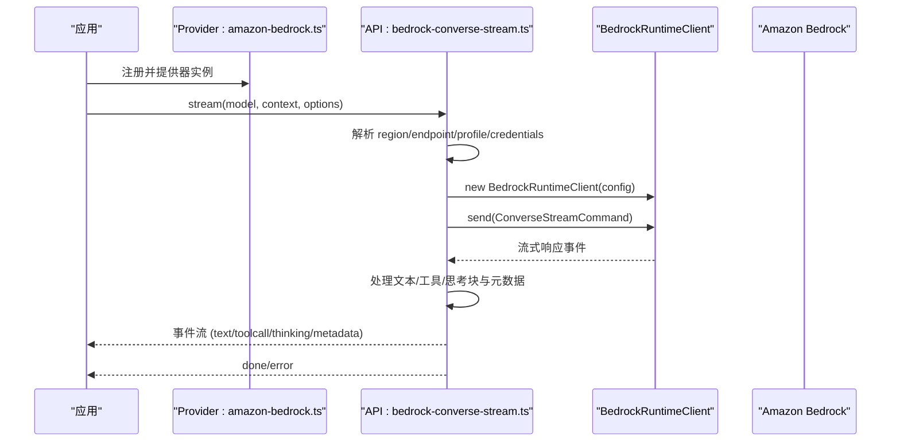
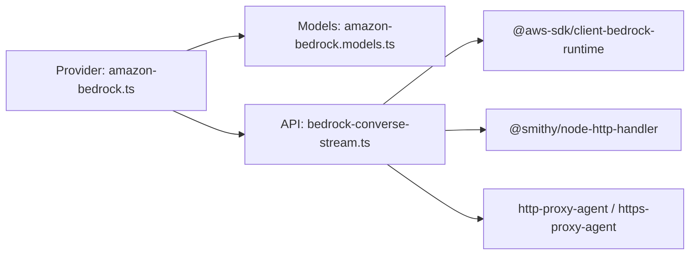

# AWS Bedrock 集成

<cite>
**本文引用的文件**
- [packages/ai/src/providers/amazon-bedrock.ts](file://packages/ai/src/providers/amazon-bedrock.ts)
- [packages/ai/src/providers/amazon-bedrock.models.ts](file://packages/ai/src/providers/amazon-bedrock.models.ts)
- [packages/ai/src/api/bedrock-converse-stream.ts](file://packages/ai/src/api/bedrock-converse-stream.ts)
- [packages/ai/src/api/bedrock-converse-stream.lazy.ts](file://packages/ai/src/api/bedrock-converse-stream.lazy.ts)
- [packages/ai/test/bedrock-credentials.test.ts](file://packages/ai/test/bedrock-credentials.test.ts)
- [packages/ai/test/bedrock-endpoint-resolution.test.ts](file://packages/ai/test/bedrock-endpoint-resolution.test.ts)
- [packages/ai/README.md](file://packages/ai/README.md)
</cite>

## 目录
1. [简介](#简介)
2. [项目结构](#项目结构)
3. [核心组件](#核心组件)
4. [架构总览](#架构总览)
5. [详细组件分析](#详细组件分析)
6. [依赖关系分析](#依赖关系分析)
7. [性能与成本优化](#性能与成本优化)
8. [故障排除指南](#故障排除指南)
9. [结论](#结论)
10. [附录](#附录)

## 简介
本文件面向企业级用户，系统化说明如何在项目中集成 Amazon Bedrock 提供商，覆盖认证配置、区域选择、模型访问权限、数据隐私与合规、网络隔离（含 VPC 端点）、企业部署（负载均衡、故障转移、监控）、成本优化（缓存、预算控制）以及常见问题排查。文档基于仓库中 Bedrock 提供者的实现与测试用例进行提炼，确保内容与实际代码行为一致。

## 项目结构
Bedrock 集成主要位于 packages/ai 模块内：
- 提供者注册与认证流程：amazon-bedrock.ts
- 模型目录与扁平化：amazon-bedrock.models.ts
- Converse Stream API 实现与流式处理：bedrock-converse-stream.ts
- Node-only 懒加载入口，避免浏览器打包引入 AWS SDK：bedrock-converse-stream.lazy.ts
- 认证优先级与端点解析的单元测试：bedrock-credentials.test.ts、bedrock-endpoint-resolution.test.ts
- 使用与兼容性说明：packages/ai/README.md

图表来源
- [packages/ai/src/providers/amazon-bedrock.ts:1-91](file://packages/ai/src/providers/amazon-bedrock.ts#L1-L91)
- [packages/ai/src/api/bedrock-converse-stream.ts:107-327](file://packages/ai/src/api/bedrock-converse-stream.ts#L107-L327)
- [packages/ai/src/providers/amazon-bedrock.models.ts:1-9](file://packages/ai/src/providers/amazon-bedrock.models.ts#L1-L9)

章节来源
- [packages/ai/src/providers/amazon-bedrock.ts:1-91](file://packages/ai/src/providers/amazon-bedrock.ts#L1-L91)
- [packages/ai/src/api/bedrock-converse-stream.ts:107-327](file://packages/ai/src/api/bedrock-converse-stream.ts#L107-L327)
- [packages/ai/src/providers/amazon-bedrock.models.ts:1-9](file://packages/ai/src/providers/amazon-bedrock.models.ts#L1-L9)

## 核心组件
- 提供者与认证
  - 支持三种认证方式：Bearer Token、AWS Profile、默认凭证链（IAM 角色/环境变量/Web Identity）。
  - 登录交互可引导选择认证方法；resolve 阶段按优先级检测并返回 auth/env/source。
- 模型目录
  - 通过自动生成的模型目录扁平化导出，便于统一注册到 Provider。
- Converse Stream API
  - 负责构建请求、流式事件处理、工具调用、思考模式（thinking）、提示缓存、代理与 HTTP/1.1 强制、自定义请求头等。
  - 错误分类与诊断信息附加，便于重试与问题定位。

章节来源
- [packages/ai/src/providers/amazon-bedrock.ts:6-79](file://packages/ai/src/providers/amazon-bedrock.ts#L6-L79)
- [packages/ai/src/providers/amazon-bedrock.models.ts:1-9](file://packages/ai/src/providers/amazon-bedrock.models.ts#L1-L9)
- [packages/ai/src/api/bedrock-converse-stream.ts:69-101](file://packages/ai/src/api/bedrock-converse-stream.ts#L69-L101)

## 架构总览
下图展示了从应用层到 AWS Bedrock 的完整调用链路，包括认证、区域与端点解析、代理与 HTTP 版本控制、流式事件处理与错误诊断。

图表来源
- [packages/ai/src/providers/amazon-bedrock.ts:82-89](file://packages/ai/src/providers/amazon-bedrock.ts#L82-L89)
- [packages/ai/src/api/bedrock-converse-stream.ts:107-327](file://packages/ai/src/api/bedrock-converse-stream.ts#L107-L327)

## 详细组件分析

### 认证与鉴权
- 支持的认证方式
  - Bearer Token：通过 AWS_BEARER_TOKEN_BEDROCK 或 apiKey/bearerToken 传入，启用 httpBearerAuth。
  - AWS Profile：通过 profile 选项或环境变量 AWS_PROFILE 指定。
  - 默认凭证链：环境变量（AK/SK）、ECS 任务角色、Web Identity Token 等。
- 认证优先级与行为
  - 显式 profile 或作用域内的 AWS_PROFILE 优先于环境中的 AK/SK。
  - 当未配置 profile 且存在 AK/SK 时，直接注入 credentials。
  - 可通过 AWS_BEDROCK_SKIP_AUTH=1 跳过签名（仅用于无需鉴权的代理场景）。
- 安全建议
  - 生产环境推荐使用 IAM 角色或 ECS 任务角色，避免硬编码密钥。
  - 使用 Bearer Token 时需确保身份具备 bedrock:CallWithBearerToken 权限。

章节来源
- [packages/ai/src/providers/amazon-bedrock.ts:11-79](file://packages/ai/src/providers/amazon-bedrock.ts#L11-L79)
- [packages/ai/src/api/bedrock-converse-stream.ts:160-221](file://packages/ai/src/api/bedrock-converse-stream.ts#L160-L221)
- [packages/ai/test/bedrock-credentials.test.ts:66-115](file://packages/ai/test/bedrock-credentials.test.ts#L66-L115)

### 区域选择与端点解析
- 区域解析优先级
  - ARN 嵌入区域 > 显式 region > 内置端点推导区域 > 无 profile 时回退 us-east-1。
  - 若设置了 AWS_REGION/AWS_DEFAULT_REGION，则不强制固定标准端点，尊重环境配置。
- 端点策略
  - 对于内置 EU 推理档案，会绑定 eu-central-1 运行时 URL。
  - 自定义 baseUrl（如 VPC 端点）将透传给 SDK，不受内置端点覆盖。
- 实践要点
  - 在跨区部署时，建议使用 ARN 或明确设置 region，避免与其他服务共用 AWS_REGION 产生冲突。

章节来源
- [packages/ai/src/api/bedrock-converse-stream.ts:140-216](file://packages/ai/src/api/bedrock-converse-stream.ts#L140-L216)
- [packages/ai/test/bedrock-endpoint-resolution.test.ts:96-208](file://packages/ai/test/bedrock-endpoint-resolution.test.ts#L96-L208)

### 模型支持与家族配置
- 模型目录
  - 通过 amazon-bedrock.models.ts 自动生成的目录扁平化导出，供 Provider 注册。
- 模型家族与特性
  - Claude：支持 thinking（自适应思考）、prompt caching、thinking display 控制。
  - Llama/Titan 等：通过模型目录注册，具体能力取决于模型元数据与 Bedrock 支持。
- 配置项
  - reasoning/thinkingBudgets：控制思考级别与预算。
  - interleavedThinking：部分 Claude 4.x 支持。
  - requestMetadata：请求级标签，用于成本分摊与审计。
  - toolChoice：工具调用策略。

章节来源
- [packages/ai/src/providers/amazon-bedrock.models.ts:1-9](file://packages/ai/src/providers/amazon-bedrock.models.ts#L1-L9)
- [packages/ai/src/api/bedrock-converse-stream.ts:69-101](file://packages/ai/src/api/bedrock-converse-stream.ts#L69-L101)

### 流式处理与事件模型
- 事件类型
  - text_start/delta/end、toolcall_start/delta/end、thinking_start/delta/end、metadata、stop。
- 工具调用
  - 增量解析 JSON 参数，结束时固化 arguments。
- 思考模式
  - 对 Claude 模型支持 thinking signature；其他模型不支持该字段。
- 提示缓存
  - 对支持的 Claude 模型插入 cachePoint，支持 short/long TTL。

章节来源
- [packages/ai/src/api/bedrock-converse-stream.ts:263-327](file://packages/ai/src/api/bedrock-converse-stream.ts#L263-L327)
- [packages/ai/src/api/bedrock-converse-stream.ts:508-630](file://packages/ai/src/api/bedrock-converse-stream.ts#L508-L630)
- [packages/ai/src/api/bedrock-converse-stream.ts:769-787](file://packages/ai/src/api/bedrock-converse-stream.ts#L769-L787)

### 网络与代理
- HTTP/HTTPS 代理
  - 通过 resolveHttpProxyUrlForTarget 获取代理地址，并使用 NodeHttpHandler 注入代理 Agent。
- HTTP/1.1 强制
  - 某些自定义端点需要 HTTP/1.1，可通过 AWS_BEDROCK_FORCE_HTTP1=1 切换。
- 自定义请求头
  - 通过 Smithy build 中间件注入非保留头（authorization/host/x-amz-* 被保护）。

章节来源
- [packages/ai/src/api/bedrock-converse-stream.ts:198-210](file://packages/ai/src/api/bedrock-converse-stream.ts#L198-L210)
- [packages/ai/src/api/bedrock-converse-stream.ts:424-458](file://packages/ai/src/api/bedrock-converse-stream.ts#L424-L458)

### 错误处理与诊断
- 错误分类
  - InternalServerException、ModelStreamErrorException、ValidationException、ThrottlingException、ServiceUnavailableException。
- 诊断信息
  - 附加状态码、错误码、requestId 等，便于追踪与重试。
- 数据保留模式
  - 当出现数据保留模式相关错误时，提示参考 AWS 文档。

章节来源
- [packages/ai/src/api/bedrock-converse-stream.ts:335-422](file://packages/ai/src/api/bedrock-converse-stream.ts#L335-L422)

### 懒加载与打包
- Node-only 懒加载
  - 通过 bedrock-converse-stream.lazy.ts 动态导入，避免浏览器环境引入 AWS SDK。
- Bun/单文件打包
  - 可通过 setBedrockProviderModule 显式注册实现，确保运行时可用。

章节来源
- [packages/ai/src/api/bedrock-converse-stream.lazy.ts:1-31](file://packages/ai/src/api/bedrock-converse-stream.lazy.ts#L1-L31)
- [packages/ai/README.md:1432-1455](file://packages/ai/README.md#L1432-L1455)

## 依赖关系分析
- 模块耦合
  - Provider 仅暴露 createProvider 与 models，API 层负责具体实现，解耦良好。
- 外部依赖
  - @aws-sdk/client-bedrock-runtime：核心 SDK。
  - @smithy/node-http-handler：HTTP 处理器，支持代理与 HTTP 版本控制。
  - http-proxy-agent/https-proxy-agent：代理支持。
- 潜在循环依赖
  - 通过 lazyApi 与 .lazy.ts 规避循环与浏览器打包问题。

图表来源
- [packages/ai/src/providers/amazon-bedrock.ts:1-91](file://packages/ai/src/providers/amazon-bedrock.ts#L1-L91)
- [packages/ai/src/api/bedrock-converse-stream.ts:1-66](file://packages/ai/src/api/bedrock-converse-stream.ts#L1-L66)

章节来源
- [packages/ai/src/providers/amazon-bedrock.ts:1-91](file://packages/ai/src/providers/amazon-bedrock.ts#L1-L91)
- [packages/ai/src/api/bedrock-converse-stream.ts:1-66](file://packages/ai/src/api/bedrock-converse-stream.ts#L1-L66)

## 性能与成本优化
- 提示缓存（Prompt Caching）
  - 对支持的 Claude 模型插入 cachePoint，short 默认，long 可设置 TTL。
  - 通过 supportsPromptCaching 判断是否启用，或通过 AWS_BEDROCK_FORCE_CACHE=1 强制。
- 思考预算与上下文限制
  - adjustMaxTokensForThinking 与 clampMaxTokensToContext 控制 maxTokens 与思考预算。
- 请求元数据
  - requestMetadata 可用于成本分摊标签，便于 Cost Explorer 拆分。
- 代理与 HTTP 版本
  - 在某些自定义端点下强制 HTTP/1.1，减少兼容性问题。
- 缓存机制
  - 结合 PI_CACHE_RETENTION 控制缓存保留策略。

章节来源
- [packages/ai/src/api/bedrock-converse-stream.ts:693-705](file://packages/ai/src/api/bedrock-converse-stream.ts#L693-L705)
- [packages/ai/src/api/bedrock-converse-stream.ts:736-787](file://packages/ai/src/api/bedrock-converse-stream.ts#L736-L787)
- [packages/ai/src/api/bedrock-converse-stream.ts:460-506](file://packages/ai/src/api/bedrock-converse-stream.ts#L460-L506)

## 故障排除指南
- 认证失败
  - 检查 AWS_BEARER_TOKEN_BEDROCK、AWS_PROFILE、AK/SK 是否正确设置。
  - 确认 IAM 角色或 Web Identity Token 有效。
- 区域/端点错误
  - 若使用 ARN，确保区域正确；若使用自定义 baseUrl，确保网络可达。
  - 注意 AWS_REGION 与内置端点的优先级差异。
- 代理与网络
  - 确认代理地址与认证配置；必要时启用 AWS_BEDROCK_FORCE_HTTP1=1。
- 错误分类与重试
  - ThrottlingException/ServiceUnavailableException 适合指数退避重试。
  - ValidationException 需检查输入格式与模型能力。
- 数据保留模式
  - 遇到数据保留模式相关错误，参考 AWS 文档调整账户/模型的保留策略。

章节来源
- [packages/ai/test/bedrock-credentials.test.ts:66-115](file://packages/ai/test/bedrock-credentials.test.ts#L66-L115)
- [packages/ai/test/bedrock-endpoint-resolution.test.ts:96-208](file://packages/ai/test/bedrock-endpoint-resolution.test.ts#L96-L208)
- [packages/ai/src/api/bedrock-converse-stream.ts:335-422](file://packages/ai/src/api/bedrock-converse-stream.ts#L335-L422)

## 结论
本项目对 Amazon Bedrock 的集成提供了完整的认证、区域与端点解析、流式处理、错误诊断与性能优化能力。通过 Provider 与 API 层的清晰分层、懒加载与代理支持，能够满足企业级部署对安全、合规、可观测性与成本控制的诉求。建议在生产环境中采用 IAM 角色或任务角色、合理配置缓存与思考预算，并结合监控与日志完善可观测性。

## 附录
- 企业级部署建议
  - 负载均衡：在应用层横向扩展，Bedrock 为托管服务，无需额外负载均衡。
  - 故障转移：利用错误分类与重试策略，针对 Throttling/Unavailable 做弹性恢复。
  - 监控集成：记录 requestMetadata、错误码与 requestId，接入集中式日志与指标系统。
- 合规与审计
  - 使用 requestMetadata 进行成本分摊与审计标记。
  - 遵循 AWS 数据保留策略，必要时调整账户/模型配置。
- 常见配置清单
  - 认证：AWS_BEARER_TOKEN_BEDROCK、AWS_PROFILE、AK/SK、ECS 角色、Web Identity。
  - 区域：region、ARN 区域、AWS_REGION/AWS_DEFAULT_REGION。
  - 网络：代理地址、AWS_BEDROCK_FORCE_HTTP1。
  - 性能：PI_CACHE_RETENTION、AWS_BEDROCK_FORCE_CACHE、thinkingBudgets。