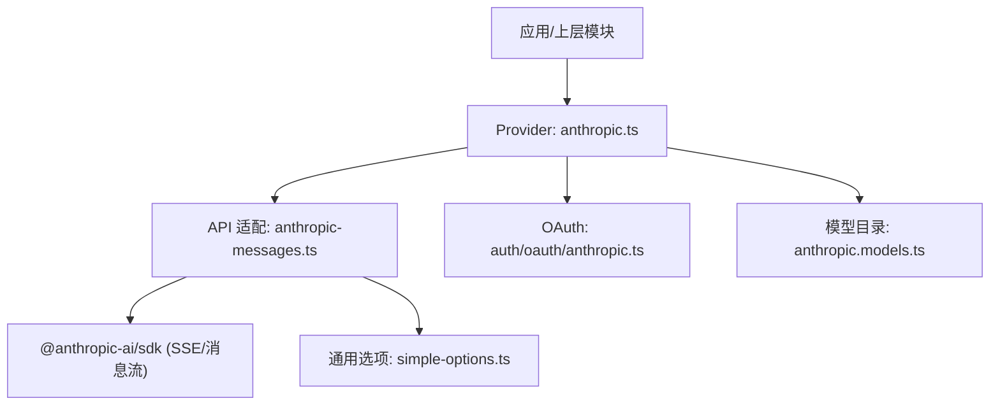
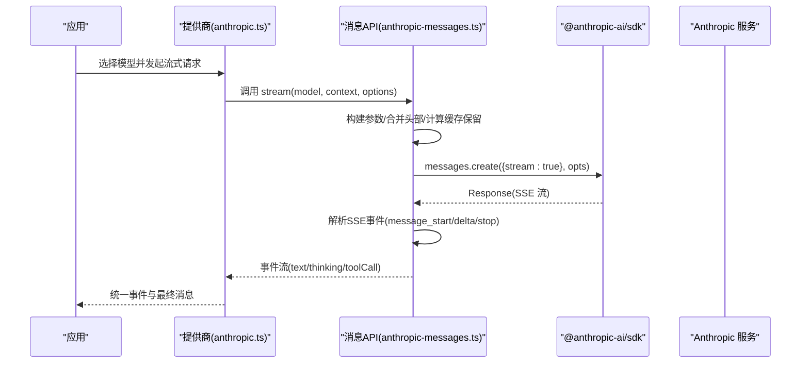
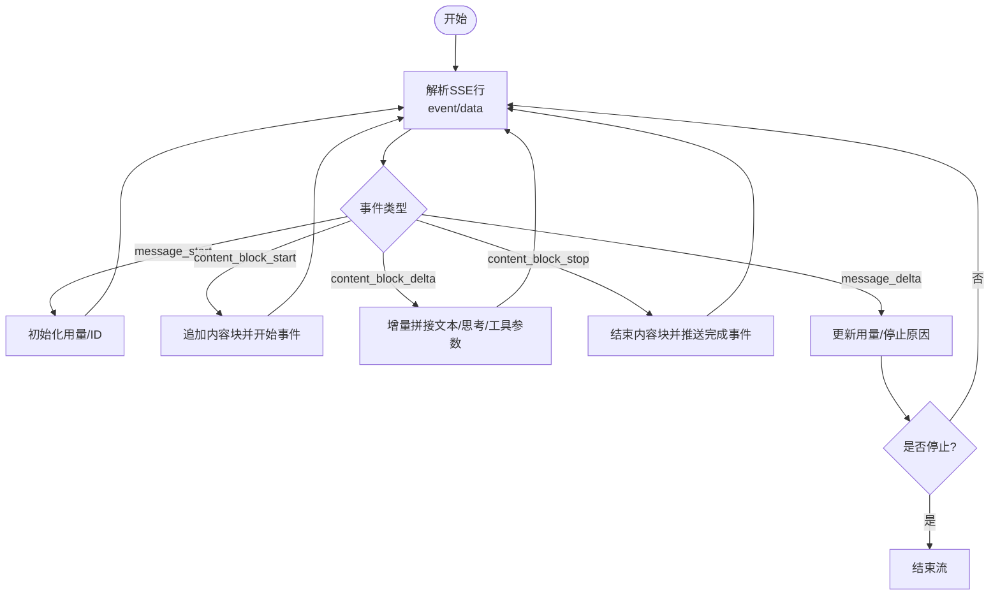
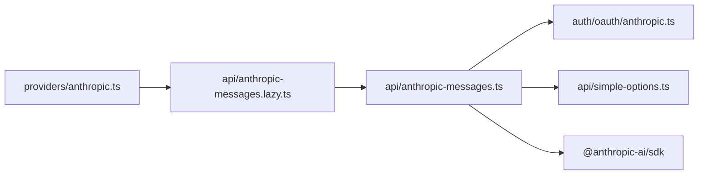

# Anthropic Claude 集成

<cite>
**本文引用的文件**
- [packages/ai/src/providers/anthropic.ts](file://packages/ai/src/providers/anthropic.ts)
- [packages/ai/src/providers/anthropic.models.ts](file://packages/ai/src/providers/anthropic.models.ts)
- [packages/ai/src/api/anthropic-messages.lazy.ts](file://packages/ai/src/api/anthropic-messages.lazy.ts)
- [packages/ai/src/api/anthropic-messages.ts](file://packages/ai/src/api/anthropic-messages.ts)
- [packages/ai/src/auth/oauth/anthropic.ts](file://packages/ai/src/auth/oauth/anthropic.ts)
- [packages/ai/src/api/simple-options.ts](file://packages/ai/src/api/simple-options.ts)
- [packages/ai/README.md](file://packages/ai/README.md)
</cite>

## 目录
1. [简介](#简介)
2. [项目结构](#项目结构)
3. [核心组件](#核心组件)
4. [架构总览](#架构总览)
5. [详细组件分析](#详细组件分析)
6. [依赖关系分析](#依赖关系分析)
7. [性能考虑](#性能考虑)
8. [故障排查指南](#故障排查指南)
9. [结论](#结论)
10. [附录](#附录)

## 简介
本文件面向在项目中集成 Anthropic Claude 的开发者，系统说明认证配置、消息格式与请求结构、支持的模型版本与差异、系统提示词、工具调用、长上下文处理机制、安全与合规要点、对话历史管理、流式输出与错误恢复、第三方代理框架集成方式与最佳实践，以及性能优化与成本估算方法。内容基于仓库中 Anthropic 提供商与 API 实现的具体代码进行分析与归纳。

## 项目结构
Anthropic 相关能力集中在 packages/ai 子包内：
- 提供商注册与认证：providers/anthropic.ts
- 模型目录：providers/anthropic.models.ts（由脚本生成）
- API 适配层：api/anthropic-messages.ts（消息协议、流式解析、工具调用、缓存控制等）
- 懒加载入口：api/anthropic-messages.lazy.ts
- OAuth 流程：auth/oauth/anthropic.ts（Claude Pro/Max 订阅登录与刷新）
- 通用选项与上下文裁剪：api/simple-options.ts
- 使用文档与示例：README.md

图表来源
- [packages/ai/src/providers/anthropic.ts:43-58](file://packages/ai/src/providers/anthropic.ts#L43-L58)
- [packages/ai/src/api/anthropic-messages.ts:1-44](file://packages/ai/src/api/anthropic-messages.ts#L1-L44)
- [packages/ai/src/auth/oauth/anthropic.ts:234-312](file://packages/ai/src/auth/oauth/anthropic.ts#L234-L312)
- [packages/ai/src/providers/anthropic.models.ts:4-8](file://packages/ai/src/providers/anthropic.models.ts#L4-L8)
- [packages/ai/src/api/simple-options.ts:21-52](file://packages/ai/src/api/simple-options.ts#L21-L52)

章节来源
- [packages/ai/src/providers/anthropic.ts:43-58](file://packages/ai/src/providers/anthropic.ts#L43-L58)
- [packages/ai/src/api/anthropic-messages.ts:1-44](file://packages/ai/src/api/anthropic-messages.ts#L1-L44)
- [packages/ai/src/auth/oauth/anthropic.ts:234-312](file://packages/ai/src/auth/oauth/anthropic.ts#L234-L312)
- [packages/ai/src/providers/anthropic.models.ts:4-8](file://packages/ai/src/providers/anthropic.models.ts#L4-L8)
- [packages/ai/src/api/simple-options.ts:21-52](file://packages/ai/src/api/simple-options.ts#L21-L52)

## 核心组件
- 提供商工厂：创建并注册 Anthropic 提供商，绑定 baseUrl、鉴权策略、模型目录与 API 实现。
- 模型目录：由脚本生成的扁平化模型清单，包含各模型的元数据与兼容性标志。
- 消息 API 适配：封装 @anthropic-ai/sdk，统一消息构建、流式事件解析、工具调用、缓存控制、成本统计与错误映射。
- OAuth：支持 Claude Pro/Max 订阅的授权码+PKCE 流程，含本地回调服务器、手动粘贴授权码、令牌刷新。
- 通用选项：上下文窗口裁剪、思考预算与 maxTokens 调整、采样参数合并等。

章节来源
- [packages/ai/src/providers/anthropic.ts:9-58](file://packages/ai/src/providers/anthropic.ts#L9-L58)
- [packages/ai/src/providers/anthropic.models.ts:4-8](file://packages/ai/src/providers/anthropic.models.ts#L4-L8)
- [packages/ai/src/api/anthropic-messages.ts:487-774](file://packages/ai/src/api/anthropic-messages.ts#L487-L774)
- [packages/ai/src/auth/oauth/anthropic.ts:234-312](file://packages/ai/src/auth/oauth/anthropic.ts#L234-L312)
- [packages/ai/src/api/simple-options.ts:15-87](file://packages/ai/src/api/simple-options.ts#L15-L87)

## 架构总览
下图展示了从应用调用到 Anthropic 服务端的一次完整流式请求路径，包括认证、参数构建、SSE 事件解析与结果聚合。

图表来源
- [packages/ai/src/providers/anthropic.ts:43-58](file://packages/ai/src/providers/anthropic.ts#L43-L58)
- [packages/ai/src/api/anthropic-messages.ts:487-774](file://packages/ai/src/api/anthropic-messages.ts#L487-L774)
- [packages/ai/src/api/anthropic-messages.ts:387-485](file://packages/ai/src/api/anthropic-messages.ts#L387-L485)

## 详细组件分析

### 提供商与认证配置
- 提供商注册：设置 id、name、baseUrl、auth、models、api。
- 认证优先级与来源：
  - 支持交互式输入 API Key；
  - 优先读取特定环境变量（如授权令牌），再回退到 API Key；
  - 支持 OAuth（Claude Pro/Max），通过 lazyOAuth 加载。
- 环境键：
  - 支持 ANTHROPIC_API_KEY、ANTHROPIC_OAUTH_TOKEN 等环境变量解析。

章节来源
- [packages/ai/src/providers/anthropic.ts:9-58](file://packages/ai/src/providers/anthropic.ts#L9-L58)
- [packages/ai/README.md:409-456](file://packages/ai/README.md#L409-L456)

### 模型目录与特性
- 模型清单由脚本生成，提供统一的 ModelCatalog，便于查询与类型推断。
- 兼容性标志用于决定是否启用某些特性（如严格工具、工具引用、温度、缓存保留等）。
- 默认对“工具引用”的支持根据模型 ID 规则判断（排除 Haiku 及早期模型）。

章节来源
- [packages/ai/src/providers/anthropic.models.ts:4-8](file://packages/ai/src/providers/anthropic.models.ts#L4-L8)
- [packages/ai/src/api/anthropic-messages.ts:173-200](file://packages/ai/src/api/anthropic-messages.ts#L173-L200)

### 消息格式与请求结构
- 内容块转换：纯文本直接拼接；含图片时转为 content blocks 数组，必要时插入占位文本。
- 系统提示词：通过 Context.systemPrompt 传入（由上层统一构建）。
- 工具定义与调用：
  - 支持工具名称规范化（兼容 Claude Code 命名）；
  - 支持 toolChoice 行为（auto/any/none/强制指定）；
  - 支持细粒度工具流式参数增量解析。
- 缓存控制：
  - 支持 short/long/none 三种保留策略；
  - long 模式可设置 TTL=1h（受模型兼容性限制）。
- 思考/推理：
  - 自适应思考（effort 级别）与旧版预算型思考（thinkingBudgetTokens）；
  - thinkingDisplay 控制返回内容（summarized/omitted）；
  - 可选 interleavedThinking 头以启用交错思考。

章节来源
- [packages/ai/src/api/anthropic-messages.ts:114-164](file://packages/ai/src/api/anthropic-messages.ts#L114-L164)
- [packages/ai/src/api/anthropic-messages.ts:49-73](file://packages/ai/src/api/anthropic-messages.ts#L49-L73)
- [packages/ai/src/api/anthropic-messages.ts:202-262](file://packages/ai/src/api/anthropic-messages.ts#L202-L262)
- [packages/ai/src/api/anthropic-messages.ts:776-799](file://packages/ai/src/api/anthropic-messages.ts#L776-L799)

### 流式输出与事件处理
- SSE 解码器：按行消费、事件聚合、异常保护与结束校验。
- 事件类型：message_start/message_delta/message_stop/content_block_* 等。
- 输出聚合：
  - 文本块、思考块、工具调用块的分段增量推送；
  - 用量统计在 message_start 与 message_delta 中更新，totalTokens 由组件累加；
  - 停止原因映射与错误信息透传。
- 终止与错误：
  - 未收到 message_stop 会抛错；
  - 中止或错误时清理临时字段并抛出统一错误事件。

图表来源
- [packages/ai/src/api/anthropic-messages.ts:387-485](file://packages/ai/src/api/anthropic-messages.ts#L387-L485)
- [packages/ai/src/api/anthropic-messages.ts:573-744](file://packages/ai/src/api/anthropic-messages.ts#L573-L744)

章节来源
- [packages/ai/src/api/anthropic-messages.ts:387-485](file://packages/ai/src/api/anthropic-messages.ts#L387-L485)
- [packages/ai/src/api/anthropic-messages.ts:573-744](file://packages/ai/src/api/anthropic-messages.ts#L573-L744)

### 对话历史管理与工具调用闭环
- 对话历史：
  - 用户消息与助手回复（含文本、思考、工具调用）统一为消息列表；
  - 工具执行后以 toolResult 形式追加，支持文本与图片。
- 工具调用闭环：
  - 流式接收 toolcall_start/delta/end；
  - 增量解析 JSON 参数，UI 可实时预览；
  - 执行工具后将结果写回上下文，继续多轮对话。

章节来源
- [packages/ai/README.md:130-226](file://packages/ai/README.md#L130-L226)
- [packages/ai/README.md:526-607](file://packages/ai/README.md#L526-L607)

### 长上下文与缓存
- 上下文窗口裁剪：根据模型上下文窗口与估计 token 数，自动限制 maxTokens，避免溢出。
- 缓存保留策略：short/long/none，long 模式在兼容模型上可设置 1h TTL，降低重复输入成本。
- 会话亲和：部分模型可通过头部携带会话亲和信息（由模型兼容性标志控制）。

章节来源
- [packages/ai/src/api/simple-options.ts:15-19](file://packages/ai/src/api/simple-options.ts#L15-L19)
- [packages/ai/src/api/anthropic-messages.ts:49-73](file://packages/ai/src/api/anthropic-messages.ts#L49-L73)
- [packages/ai/src/api/anthropic-messages.ts:173-186](file://packages/ai/src/api/anthropic-messages.ts#L173-L186)

### 安全考虑、内容过滤与合规性
- 认证安全：
  - 支持 API Key 与 OAuth（PKCE）两种模式；
  - 本地回调服务器仅用于 CLI 场景，非浏览器环境；
  - 支持手动粘贴授权码/重定向 URL 的容错处理。
- 请求安全：
  - 缺失密钥时显式报错；
  - 支持自定义 headers 注入（如网关标识、追踪 ID）。
- 内容安全：
  - 文本中的非法代理字符会被清洗；
  - 思考内容可选择摘要或省略以减少敏感信息暴露面。
- 合规性：
  - 遵循 Anthropic 官方 API 规范与速率限制；
  - 通过缓存与上下文裁剪减少不必要的数据传输。

章节来源
- [packages/ai/src/auth/oauth/anthropic.ts:234-312](file://packages/ai/src/auth/oauth/anthropic.ts#L234-L312)
- [packages/ai/src/api/anthropic-messages.ts:283-293](file://packages/ai/src/api/anthropic-messages.ts#L283-L293)
- [packages/ai/src/api/anthropic-messages.ts:114-164](file://packages/ai/src/api/anthropic-messages.ts#L114-L164)
- [packages/ai/src/api/anthropic-messages.ts:230-242](file://packages/ai/src/api/anthropic-messages.ts#L230-L242)

### 与第三方代理框架的集成方式与最佳实践
- 集成点：
  - 通过 Provider 工厂将 Anthropic 加入 Models 集合；
  - 使用 models.stream/complete 进行统一调用，屏蔽底层差异；
  - 利用 transformHeaders 注入网关/追踪头；
  - 借助 validateToolCall 做参数校验与错误回传。
- 最佳实践：
  - 明确设置 maxTokens 与 thinking 预算，避免超出上下文；
  - 使用缓存保留策略降低重复输入成本；
  - 对工具调用进行严格校验与幂等设计；
  - 合理处理流式事件，确保 UI 响应与状态一致。

章节来源
- [packages/ai/README.md:230-322](file://packages/ai/README.md#L230-L322)
- [packages/ai/README.md:324-395](file://packages/ai/README.md#L324-L395)
- [packages/ai/README.md:458-607](file://packages/ai/README.md#L458-L607)

## 依赖关系分析
- 提供商依赖：
  - anthropic.ts 依赖 anthropic.messages.lazy.ts 与模型目录；
  - 通过 createProvider 绑定 baseUrl、auth、models、api。
- API 适配依赖：
  - anthropic-messages.ts 依赖 @anthropic-ai/sdk、工具拆分、JSON 解析、重试、Unicode 清洗等工具；
  - 依赖 simple-options.ts 进行上下文与采样参数处理。
- OAuth 依赖：
  - 使用 Node http 模块建立回调服务器；
  - 通过 PKCE 与授权码交换访问令牌，支持刷新。

图表来源
- [packages/ai/src/providers/anthropic.ts:43-58](file://packages/ai/src/providers/anthropic.ts#L43-L58)
- [packages/ai/src/api/anthropic-messages.lazy.ts:1-5](file://packages/ai/src/api/anthropic-messages.lazy.ts#L1-L5)
- [packages/ai/src/api/anthropic-messages.ts:1-44](file://packages/ai/src/api/anthropic-messages.ts#L1-L44)
- [packages/ai/src/auth/oauth/anthropic.ts:234-312](file://packages/ai/src/auth/oauth/anthropic.ts#L234-L312)
- [packages/ai/src/api/simple-options.ts:21-52](file://packages/ai/src/api/simple-options.ts#L21-L52)

章节来源
- [packages/ai/src/providers/anthropic.ts:43-58](file://packages/ai/src/providers/anthropic.ts#L43-L58)
- [packages/ai/src/api/anthropic-messages.lazy.ts:1-5](file://packages/ai/src/api/anthropic-messages.lazy.ts#L1-L5)
- [packages/ai/src/api/anthropic-messages.ts:1-44](file://packages/ai/src/api/anthropic-messages.ts#L1-L44)
- [packages/ai/src/auth/oauth/anthropic.ts:234-312](file://packages/ai/src/auth/oauth/anthropic.ts#L234-L312)
- [packages/ai/src/api/simple-options.ts:21-52](file://packages/ai/src/api/simple-options.ts#L21-L52)

## 性能考虑
- 流式处理：
  - 使用 SSE 增量解析，首字延迟低；
  - 工具参数增量解析，提升交互体验。
- 上下文与缓存：
  - 自动裁剪 maxTokens，避免超限；
  - 启用 long 缓存保留（TTL=1h）以降低重复输入成本。
- 思考预算：
  - 自适应思考 effort 与预算型 thinking 可调优；
  - 根据任务复杂度选择合适的 effort 级别。
- 重试与超时：
  - 支持最大重试次数与延迟；
  - 可配置请求超时与信号中止。

章节来源
- [packages/ai/src/api/anthropic-messages.ts:387-485](file://packages/ai/src/api/anthropic-messages.ts#L387-L485)
- [packages/ai/src/api/anthropic-messages.ts:487-774](file://packages/ai/src/api/anthropic-messages.ts#L487-L774)
- [packages/ai/src/api/simple-options.ts:15-87](file://packages/ai/src/api/simple-options.ts#L15-L87)

## 故障排查指南
- 常见错误：
  - 缺少 API Key：显式报错，需检查环境变量或存储凭据；
  - SSE 流提前结束：未收到 message_stop 会抛错；
  - 解析失败：SSE 事件 JSON 解析失败会附带原始数据以便定位。
- 调试建议：
  - 使用 onPayload/onResponse 捕获请求与响应；
  - 开启 thinkingDisplay=omitted 可减少响应体积；
  - 检查工具名称规范化与参数校验。
- 恢复策略：
  - 合理设置 maxRetries 与超时；
  - 对工具调用进行幂等设计与错误回传；
  - 使用缓存保留策略减少重复输入。

章节来源
- [packages/ai/src/api/anthropic-messages.ts:283-293](file://packages/ai/src/api/anthropic-messages.ts#L283-L293)
- [packages/ai/src/api/anthropic-messages.ts:446-485](file://packages/ai/src/api/anthropic-messages.ts#L446-L485)
- [packages/ai/src/api/anthropic-messages.ts:747-774](file://packages/ai/src/api/anthropic-messages.ts#L747-L774)

## 结论
本项目对 Anthropic Claude 的集成提供了完整的提供商注册、认证、消息协议适配、流式事件处理、工具调用与缓存控制能力。通过统一的 Models 抽象，可与多种第三方代理框架无缝集成。结合上下文裁剪、思考预算与缓存策略，可在保证性能的同时有效控制成本。建议在工程中启用严格的工具参数校验与合理的重试策略，以提升稳定性与用户体验。

## 附录

### 认证与环境变量
- 环境变量：
  - ANTHROPIC_API_KEY、ANTHROPIC_OAUTH_TOKEN 等；
  - 支持 OAuth（Claude Pro/Max）的授权码流程与令牌刷新。
- 认证优先级：
  - 显式 apiKey > 存储凭据 > 环境变量 > OAuth。

章节来源
- [packages/ai/README.md:409-456](file://packages/ai/README.md#L409-L456)
- [packages/ai/src/providers/anthropic.ts:9-58](file://packages/ai/src/providers/anthropic.ts#L9-L58)
- [packages/ai/src/auth/oauth/anthropic.ts:234-312](file://packages/ai/src/auth/oauth/anthropic.ts#L234-L312)

### 模型版本与特性差异
- 模型目录由脚本生成，包含各模型元数据与兼容性标志；
- 工具引用、温度、缓存保留、会话亲和等特性由模型兼容性标志控制；
- 对工具名称进行规范化以兼容 Claude Code 风格。

章节来源
- [packages/ai/src/providers/anthropic.models.ts:4-8](file://packages/ai/src/providers/anthropic.models.ts#L4-L8)
- [packages/ai/src/api/anthropic-messages.ts:173-200](file://packages/ai/src/api/anthropic-messages.ts#L173-L200)

### 成本估算方法
- 用量统计：
  - input/output/cacheRead/cacheWrite 等字段在 message_start 与 message_delta 中更新；
  - totalTokens 由组件累加计算；
  - 成本通过 calculateCost 计算并写入 usage.cost。
- 优化建议：
  - 启用缓存保留策略（long/TTL=1h）降低重复输入成本；
  - 合理设置 thinking 预算与 effort，避免过度思考；
  - 使用上下文裁剪避免不必要的 token 消耗。

章节来源
- [packages/ai/src/api/anthropic-messages.ts:573-744](file://packages/ai/src/api/anthropic-messages.ts#L573-L744)
- [packages/ai/src/api/anthropic-messages.ts:49-73](file://packages/ai/src/api/anthropic-messages.ts#L49-L73)
- [packages/ai/src/api/simple-options.ts:15-19](file://packages/ai/src/api/simple-options.ts#L15-L19)