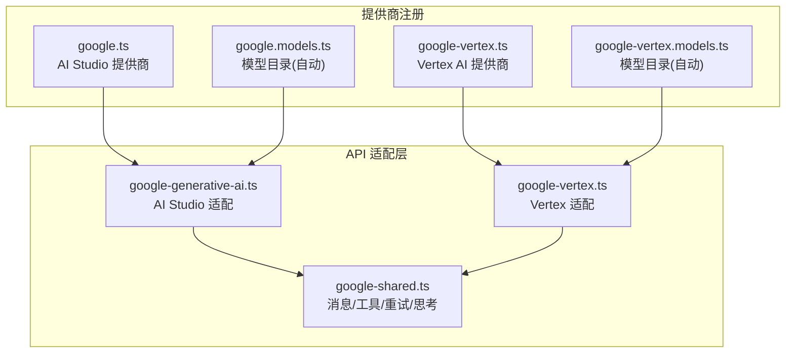
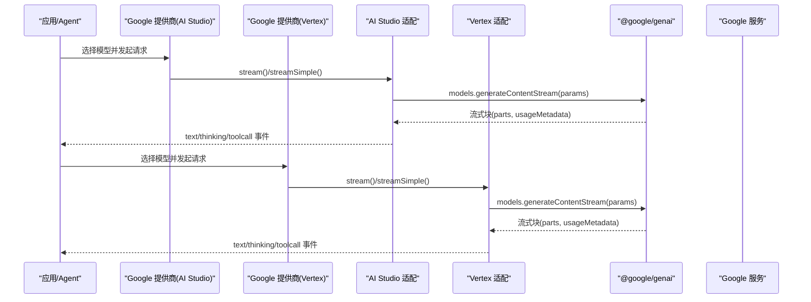
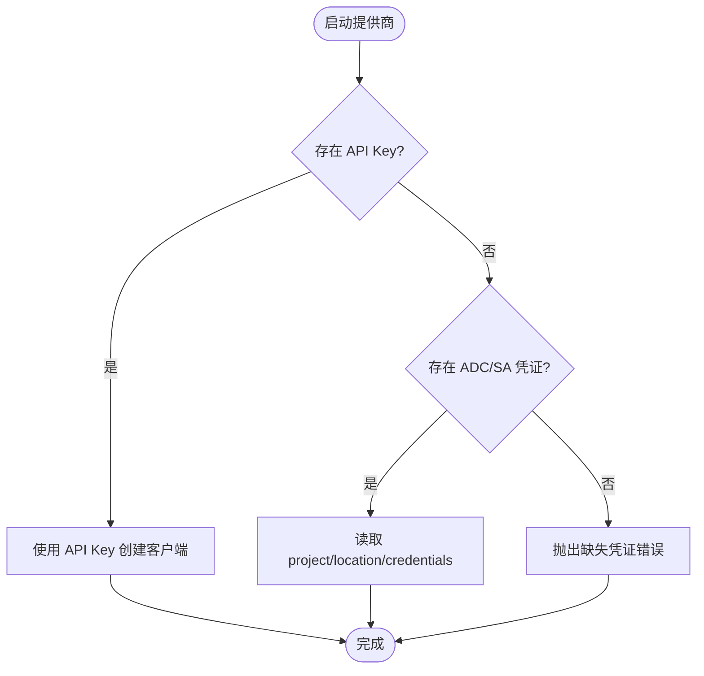
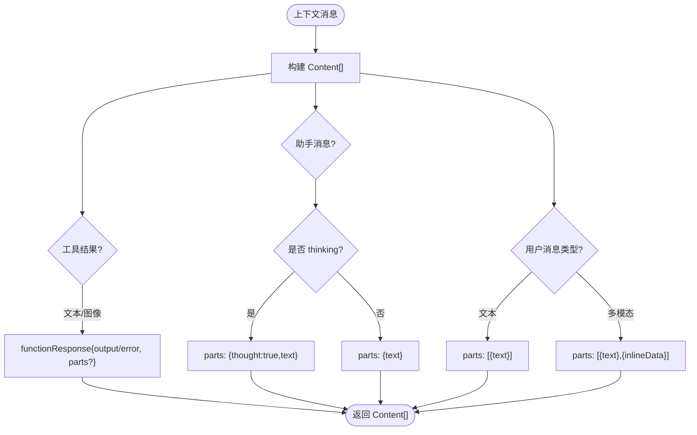
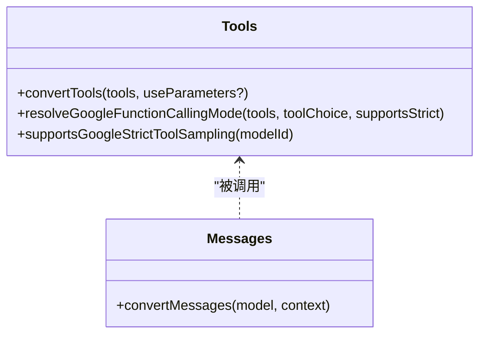
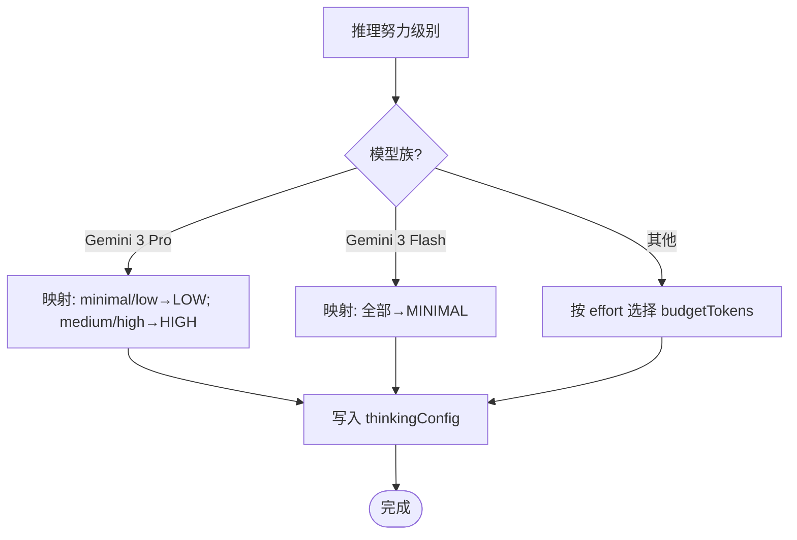
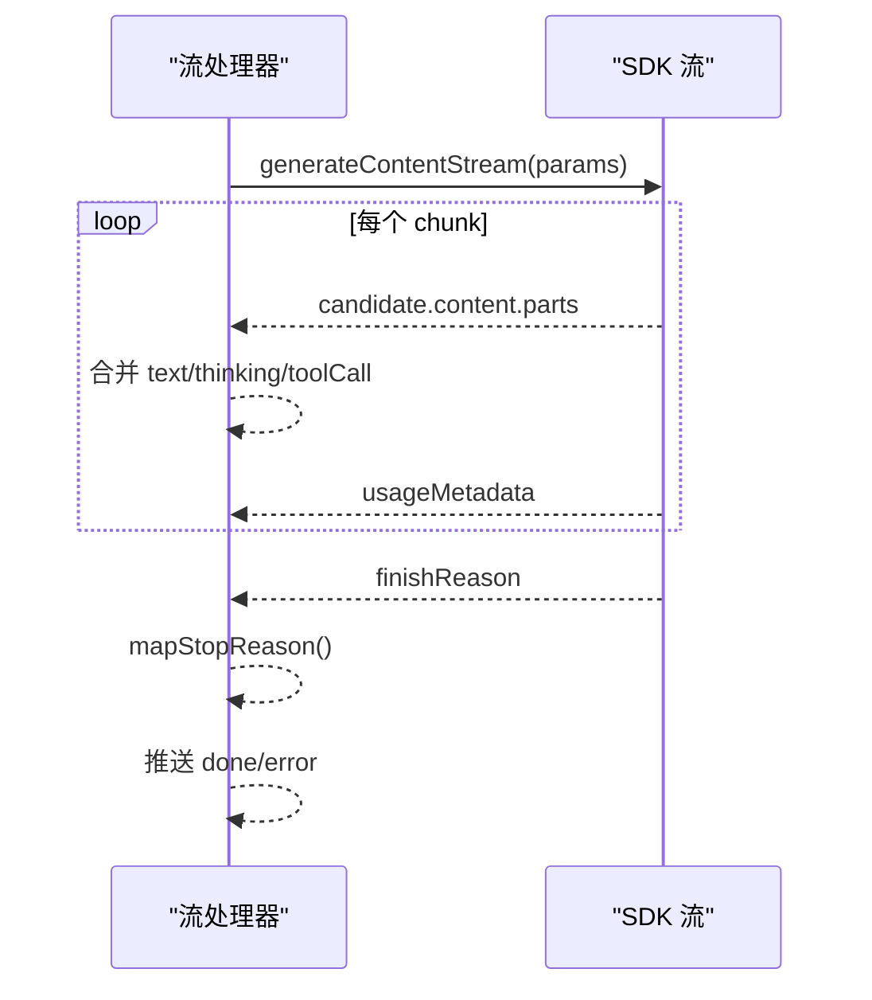
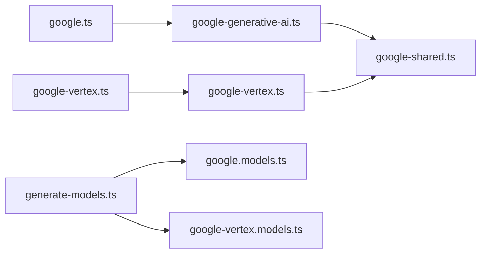

# Google Gemini 集成

<cite>
**本文引用的文件**
- [packages/ai/src/providers/google.ts](file://packages/ai/src/providers/google.ts)
- [packages/ai/src/providers/google-vertex.ts](file://packages/ai/src/providers/google-vertex.ts)
- [packages/ai/src/providers/google.models.ts](file://packages/ai/src/providers/google.models.ts)
- [packages/ai/src/providers/google-vertex.models.ts](file://packages/ai/src/providers/google-vertex.models.ts)
- [packages/ai/src/api/google-generative-ai.ts](file://packages/ai/src/api/google-generative-ai.ts)
- [packages/ai/src/api/google-vertex.ts](file://packages/ai/src/api/google-vertex.ts)
- [packages/ai/src/api/google-shared.ts](file://packages/ai/src/api/google-shared.ts)
- [packages/ai/scripts/generate-models.ts](file://packages/ai/scripts/generate-models.ts)
</cite>

## 目录
1. [简介](#简介)
2. [项目结构](#项目结构)
3. [核心组件](#核心组件)
4. [架构总览](#架构总览)
5. [详细组件分析](#详细组件分析)
6. [依赖关系分析](#依赖关系分析)
7. [性能与配额管理](#性能与配额管理)
8. [故障排查指南](#故障排查指南)
9. [结论](#结论)
10. [附录：配置与示例路径](#附录配置与示例路径)

## 简介
本文件面向在项目中集成 Google Gemini 提供商的使用者与工程师，系统性说明以下主题：
- 两种部署方式：Google AI Studio（Generative AI）与 Vertex AI 的配置差异、认证与环境要求。
- 模型家族与能力：Gemini Pro/Ultra/Flash 等模型的思考模式、多模态输入支持、工具调用与输出格式。
- 项目配置：API Key 管理、环境变量、权限与安全。
- 使用场景与代码示例路径：文本生成、图像理解、数据分析（函数调用）。
- 配额与成本：用量统计、缓存命中、成本计算与调优建议。
- 企业级网络与安全：自定义 baseUrl、代理、重试策略与错误处理。

## 项目结构
本项目将 Google Gemini 的接入拆分为“提供商注册”和“API 适配层”两部分：
- 提供商注册：定义 provider id、名称、baseUrl、鉴权方式与可用模型列表。
- API 适配层：封装 @google/genai SDK，统一消息转换、流式响应、工具调用、思考模式、停止原因映射与重试。

图表来源
- [packages/ai/src/providers/google.ts:6-14](file://packages/ai/src/providers/google.ts#L6-L14)
- [packages/ai/src/providers/google-vertex.ts:92-100](file://packages/ai/src/providers/google-vertex.ts#L92-L100)
- [packages/ai/src/providers/google.models.ts:7-8](file://packages/ai/src/providers/google.models.ts#L7-L8)
- [packages/ai/src/providers/google-vertex.models.ts:7-8](file://packages/ai/src/providers/google-vertex.models.ts#L7-L8)
- [packages/ai/src/api/google-generative-ai.ts:52-93](file://packages/ai/src/api/google-generative-ai.ts#L52-L93)
- [packages/ai/src/api/google-vertex.ts:70-111](file://packages/ai/src/api/google-vertex.ts#L70-L111)
- [packages/ai/src/api/google-shared.ts:98-248](file://packages/ai/src/api/google-shared.ts#L98-L248)

章节来源
- [packages/ai/src/providers/google.ts:6-14](file://packages/ai/src/providers/google.ts#L6-L14)
- [packages/ai/src/providers/google-vertex.ts:92-100](file://packages/ai/src/providers/google-vertex.ts#L92-L100)
- [packages/ai/src/providers/google.models.ts:7-8](file://packages/ai/src/providers/google.models.ts#L7-L8)
- [packages/ai/src/providers/google-vertex.models.ts:7-8](file://packages/ai/src/providers/google-vertex.models.ts#L7-L8)

## 核心组件
- 提供商注册
  - Google AI Studio：通过 Provider id 为 google，baseUrl 指向 generativelanguage.googleapis.com/v1beta，鉴权使用环境变量 GEMINI_API_KEY。
  - Google Vertex AI：Provider id 为 google-vertex，支持 API Key 或 ADC（gcloud application-default），需要 GOOGLE_CLOUD_PROJECT/GCLOUD_PROJECT 与 GOOGLE_CLOUD_LOCATION。
- API 适配
  - 两者均基于 @google/genai SDK，提供流式 generateContentStream，统一消息转换、工具调用、思考模式、停止原因映射、用量统计与成本计算。
  - 共享逻辑集中在 google-shared.ts，包括消息到 Content[] 的转换、工具声明、函数调用 ID 规则、多模态函数响应、重试策略等。

章节来源
- [packages/ai/src/providers/google.ts:6-14](file://packages/ai/src/providers/google.ts#L6-L14)
- [packages/ai/src/providers/google-vertex.ts:13-90](file://packages/ai/src/providers/google-vertex.ts#L13-L90)
- [packages/ai/src/api/google-generative-ai.ts:52-93](file://packages/ai/src/api/google-generative-ai.ts#L52-L93)
- [packages/ai/src/api/google-vertex.ts:70-111](file://packages/ai/src/api/google-vertex.ts#L70-L111)
- [packages/ai/src/api/google-shared.ts:98-248](file://packages/ai/src/api/google-shared.ts#L98-L248)

## 架构总览
下图展示从上层调用到下游 SDK 的完整流程，涵盖 AI Studio 与 Vertex 两条路径。

图表来源
- [packages/ai/src/providers/google.ts:6-14](file://packages/ai/src/providers/google.ts#L6-L14)
- [packages/ai/src/providers/google-vertex.ts:92-100](file://packages/ai/src/providers/google-vertex.ts#L92-L100)
- [packages/ai/src/api/google-generative-ai.ts:52-93](file://packages/ai/src/api/google-generative-ai.ts#L52-L93)
- [packages/ai/src/api/google-vertex.ts:70-111](file://packages/ai/src/api/google-vertex.ts#L70-L111)

## 详细组件分析

### 提供商注册与鉴权
- Google AI Studio
  - 鉴权：读取环境变量 GEMINI_API_KEY。
  - baseUrl：generativelanguage.googleapis.com/v1beta。
  - 模型：由 google.models.ts 自动生成的模型目录注入。
- Google Vertex AI
  - 鉴权：优先使用 API Key；否则使用 ADC（gcloud application-default login），需设置 project/location，可选 service account 文件路径。
  - 模型：由 google-vertex.models.ts 自动生成的模型目录注入。
  - 环境变量：GOOGLE_CLOUD_PROJECT/GCLOUD_PROJECT、GOOGLE_CLOUD_LOCATION、GOOGLE_APPLICATION_CREDENTIALS。

图表来源
- [packages/ai/src/providers/google.ts:6-14](file://packages/ai/src/providers/google.ts#L6-L14)
- [packages/ai/src/providers/google-vertex.ts:13-90](file://packages/ai/src/providers/google-vertex.ts#L13-L90)

章节来源
- [packages/ai/src/providers/google.ts:6-14](file://packages/ai/src/providers/google.ts#L6-L14)
- [packages/ai/src/providers/google-vertex.ts:13-90](file://packages/ai/src/providers/google-vertex.ts#L13-L90)

### 消息与多模态处理
- 文本：用户消息可为纯文本或多部分（text + inlineData）。
- 图像：以 inlineData 形式传入，mimeType 与 base64 data。
- 工具结果：支持文本与图像返回；Gemini 3+ 可在 functionResponse.parts 中嵌入图像，低版本需在独立 user turn 中附加图像。
- 思考内容：标记 thought=true 的部分作为 thinking block；跨 provider/model 时降级为普通文本。

图表来源
- [packages/ai/src/api/google-shared.ts:98-248](file://packages/ai/src/api/google-shared.ts#L98-L248)

章节来源
- [packages/ai/src/api/google-shared.ts:98-248](file://packages/ai/src/api/google-shared.ts#L98-L248)

### 工具调用与函数声明
- 工具声明：默认使用 parametersJsonSchema（完整 JSON Schema），必要时可切换为 parameters（OpenAPI 3.0.3）。
- 严格采样：Gemini 3+ 启用 VALIDATED 模式，强制参数校验。
- 函数调用 ID：Gemini 3+ 要求显式 tool call id，并在 functionCall/functionResponse 中回传。

图表来源
- [packages/ai/src/api/google-shared.ts:285-336](file://packages/ai/src/api/google-shared.ts#L285-L336)
- [packages/ai/src/api/google-shared.ts:98-248](file://packages/ai/src/api/google-shared.ts#L98-L248)

章节来源
- [packages/ai/src/api/google-shared.ts:285-336](file://packages/ai/src/api/google-shared.ts#L285-L336)
- [packages/ai/src/api/google-shared.ts:98-248](file://packages/ai/src/api/google-shared.ts#L98-L248)

### 思考模式与预算控制
- 模型识别：脚本根据 model.id 识别 Gemini 3 Pro/Flash 与 Gemma 4，并设置对应的思考级别映射。
- 行为差异：
  - Gemini 3 Pro：不支持完全关闭思考，最低可用 LOW。
  - Gemini 3 Flash/Lite：最低可用 MINIMAL。
  - Gemini 2.x：可通过 thinkingBudget=0 关闭思考。
- 预算映射：不同模型族在不同 effort 下对应不同的默认 budgetTokens。

图表来源
- [packages/ai/scripts/generate-models.ts:786-879](file://packages/ai/scripts/generate-models.ts#L786-L879)
- [packages/ai/src/api/google-generative-ai.ts:426-517](file://packages/ai/src/api/google-generative-ai.ts#L426-L517)
- [packages/ai/src/api/google-vertex.ts:520-592](file://packages/ai/src/api/google-vertex.ts#L520-L592)

章节来源
- [packages/ai/scripts/generate-models.ts:786-879](file://packages/ai/scripts/generate-models.ts#L786-L879)
- [packages/ai/src/api/google-generative-ai.ts:426-517](file://packages/ai/src/api/google-generative-ai.ts#L426-L517)
- [packages/ai/src/api/google-vertex.ts:520-592](file://packages/ai/src/api/google-vertex.ts#L520-L592)

### 流式响应与停止原因
- 流式事件：text_start/text_delta/text_end、thinking_start/thinking_delta/thinking_end、toolcall_start/toolcall_delta/toolcall_end、done、error。
- 停止原因：FinishReason 映射为 stop/length/error；若包含 toolUse 则覆盖为 toolUse。
- 异常处理：无 finish reason 结束、aborted、error 分支统一包装为错误事件。

图表来源
- [packages/ai/src/api/google-generative-ai.ts:98-278](file://packages/ai/src/api/google-generative-ai.ts#L98-L278)
- [packages/ai/src/api/google-vertex.ts:116-295](file://packages/ai/src/api/google-vertex.ts#L116-L295)
- [packages/ai/src/api/google-shared.ts:341-382](file://packages/ai/src/api/google-shared.ts#L341-L382)

章节来源
- [packages/ai/src/api/google-generative-ai.ts:98-278](file://packages/ai/src/api/google-generative-ai.ts#L98-L278)
- [packages/ai/src/api/google-vertex.ts:116-295](file://packages/ai/src/api/google-vertex.ts#L116-L295)
- [packages/ai/src/api/google-shared.ts:341-382](file://packages/ai/src/api/google-shared.ts#L341-L382)

### 用量统计与成本计算
- 用量字段：input/output/cacheRead/reasoning/totalTokens。
- 成本：calculateCost 依据模型定价表计算各分项与总计。
- 缓存：promptTokenCount 减去 cachedContentTokenCount 得到实际 input。

章节来源
- [packages/ai/src/api/google-generative-ai.ts:223-242](file://packages/ai/src/api/google-generative-ai.ts#L223-L242)
- [packages/ai/src/api/google-vertex.ts:240-259](file://packages/ai/src/api/google-vertex.ts#L240-L259)

## 依赖关系分析
- 提供商与 API 适配的耦合：
  - google.ts → google-generative-ai.ts
  - google-vertex.ts → google-vertex.ts
- 共享模块解耦：
  - 两个适配层共同依赖 google-shared.ts，复用消息转换、工具、重试、停止原因映射等。
- 模型目录自动生成：
  - scripts/generate-models.ts 产出 google.json / google-vertex.json，再由 models.ts 扁平化为模型目录。

图表来源
- [packages/ai/src/providers/google.ts:6-14](file://packages/ai/src/providers/google.ts#L6-L14)
- [packages/ai/src/providers/google-vertex.ts:92-100](file://packages/ai/src/providers/google-vertex.ts#L92-L100)
- [packages/ai/src/api/google-generative-ai.ts:52-93](file://packages/ai/src/api/google-generative-ai.ts#L52-L93)
- [packages/ai/src/api/google-vertex.ts:70-111](file://packages/ai/src/api/google-vertex.ts#L70-L111)
- [packages/ai/src/api/google-shared.ts:98-248](file://packages/ai/src/api/google-shared.ts#L98-L248)
- [packages/ai/scripts/generate-models.ts:786-879](file://packages/ai/scripts/generate-models.ts#L786-L879)

章节来源
- [packages/ai/src/providers/google.ts:6-14](file://packages/ai/src/providers/google.ts#L6-L14)
- [packages/ai/src/providers/google-vertex.ts:92-100](file://packages/ai/src/providers/google-vertex.ts#L92-L100)
- [packages/ai/src/api/google-generative-ai.ts:52-93](file://packages/ai/src/api/google-generative-ai.ts#L52-L93)
- [packages/ai/src/api/google-vertex.ts:70-111](file://packages/ai/src/api/google-vertex.ts#L70-L111)
- [packages/ai/src/api/google-shared.ts:98-248](file://packages/ai/src/api/google-shared.ts#L98-L248)
- [packages/ai/scripts/generate-models.ts:786-879](file://packages/ai/scripts/generate-models.ts#L786-L879)

## 性能与配额管理
- 重试策略：对 408/409/429/5xx 进行指数退避重试，尊重 Retry-After。
- 超时与中止：支持 AbortSignal，及时中断长耗时请求。
- 思考预算：为不同模型族设置合理的 thinkingBudget，避免过度消耗 token。
- 缓存命中：利用 cachedContentTokenCount 降低重复 prompt 的成本。
- 工具调用优化：启用严格采样减少无效调用；合理拆分工具粒度提升成功率。
- 并发与限流：结合上游网关或队列控制并发，避免触发速率限制。

章节来源
- [packages/ai/src/api/google-shared.ts:393-414](file://packages/ai/src/api/google-shared.ts#L393-L414)
- [packages/ai/src/api/google-generative-ai.ts:395-400](file://packages/ai/src/api/google-generative-ai.ts#L395-L400)
- [packages/ai/src/api/google-vertex.ts:493-498](file://packages/ai/src/api/google-vertex.ts#L493-L498)
- [packages/ai/src/api/google-generative-ai.ts:477-517](file://packages/ai/src/api/google-generative-ai.ts#L477-L517)
- [packages/ai/src/api/google-vertex.ts:562-592](file://packages/ai/src/api/google-vertex.ts#L562-L592)

## 故障排查指南
- 常见错误
  - 缺少 API Key：AI Studio 必须设置 GEMINI_API_KEY；Vertex 需设置 API Key 或 ADC 相关环境变量。
  - 缺少 Project/Location：Vertex 未设置 GOOGLE_CLOUD_PROJECT/GCLOUD_PROJECT 或 GOOGLE_CLOUD_LOCATION 会报错。
  - 流结束无 finish reason：检查服务端状态码与日志，确认非网络中断。
  - 工具调用失败：确认 Gemini 3+ 已传递 tool call id；检查参数 schema 与严格模式。
- 定位步骤
  - 查看 onPayload 输出，核对构造的 GenerateContentParameters。
  - 检查 usageMetadata 与 cost 计算，确认 token 计数是否符合预期。
  - 捕获 error 事件中的 errorMessage，结合 normalizeProviderError 信息定位。
- 恢复策略
  - 调整 thinkingBudget 或关闭思考以降低负载。
  - 增加 maxRetries 或延长 maxRetryDelayMs。
  - 使用更合适的模型族（如 Flash 系列）平衡延迟与质量。

章节来源
- [packages/ai/src/providers/google-vertex.ts:433-451](file://packages/ai/src/providers/google-vertex.ts#L433-L451)
- [packages/ai/src/api/google-generative-ai.ts:267-289](file://packages/ai/src/api/google-generative-ai.ts#L267-L289)
- [packages/ai/src/api/google-vertex.ts:284-306](file://packages/ai/src/api/google-vertex.ts#L284-L306)
- [packages/ai/src/api/google-shared.ts:341-382](file://packages/ai/src/api/google-shared.ts#L341-L382)

## 结论
本项目为 Google Gemini 提供了统一的提供商抽象与稳定的 API 适配层，覆盖 AI Studio 与 Vertex AI 两种部署方式。通过共享的消息转换、工具调用、思考模式与重试机制，开发者可以以一致的方式实现文本生成、图像理解与数据分析等功能，并在企业环境中灵活配置鉴权、网络与安全策略。

## 附录：配置与示例路径
- 配置项与环境变量
  - AI Studio：GEMINI_API_KEY
  - Vertex：GOOGLE_CLOUD_PROJECT/GCLOUD_PROJECT、GOOGLE_CLOUD_LOCATION、GOOGLE_APPLICATION_CREDENTIALS、可选 GOOGLE_CLOUD_API_KEY
- 模型与能力参考
  - Gemini 3 Pro/Flash：思考级别映射与预算策略
  - Gemini 2.x：通过 thinkingBudget 控制思考
- 代码示例路径（不直接粘贴代码，仅给出位置）
  - 文本生成（流式）：[packages/ai/src/api/google-generative-ai.ts:52-93](file://packages/ai/src/api/google-generative-ai.ts#L52-L93)、[packages/ai/src/api/google-vertex.ts:70-111](file://packages/ai/src/api/google-vertex.ts#L70-L111)
  - 图像理解（多模态输入）：[packages/ai/src/api/google-shared.ts:108-132](file://packages/ai/src/api/google-shared.ts#L108-L132)
  - 数据分析（函数调用）：[packages/ai/src/api/google-shared.ts:285-336](file://packages/ai/src/api/google-shared.ts#L285-L336)
  - 思考模式配置：[packages/ai/scripts/generate-models.ts:786-879](file://packages/ai/scripts/generate-models.ts#L786-L879)、[packages/ai/src/api/google-generative-ai.ts:426-517](file://packages/ai/src/api/google-generative-ai.ts#L426-L517)、[packages/ai/src/api/google-vertex.ts:520-592](file://packages/ai/src/api/google-vertex.ts#L520-L592)
  - 用量与成本：[packages/ai/src/api/google-generative-ai.ts:223-242](file://packages/ai/src/api/google-generative-ai.ts#L223-L242)、[packages/ai/src/api/google-vertex.ts:240-259](file://packages/ai/src/api/google-vertex.ts#L240-L259)
  - 重试与错误：[packages/ai/src/api/google-shared.ts:393-414](file://packages/ai/src/api/google-shared.ts#L393-L414)、[packages/ai/src/api/google-generative-ai.ts:267-289](file://packages/ai/src/api/google-generative-ai.ts#L267-L289)、[packages/ai/src/api/google-vertex.ts:284-306](file://packages/ai/src/api/google-vertex.ts#L284-L306)