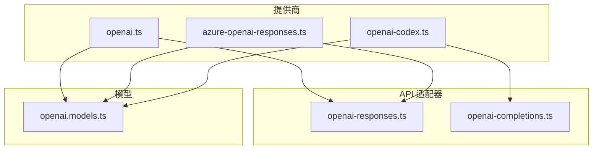
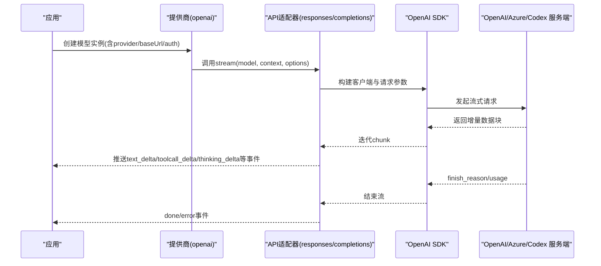
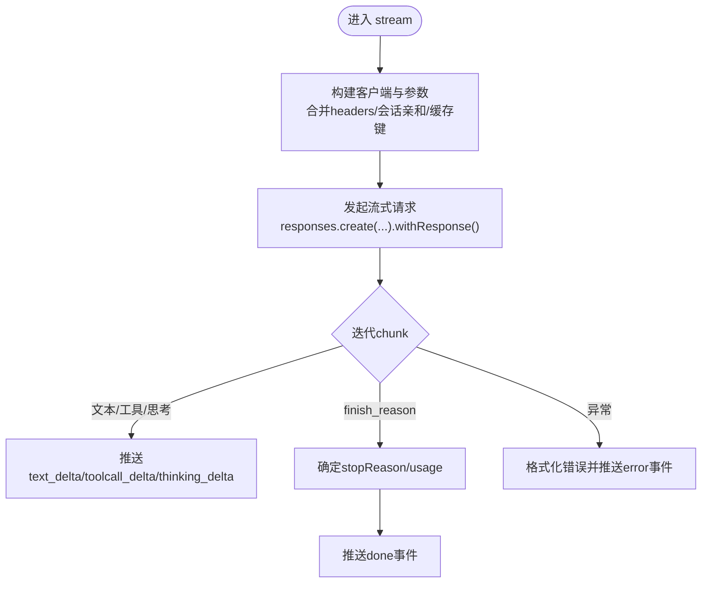
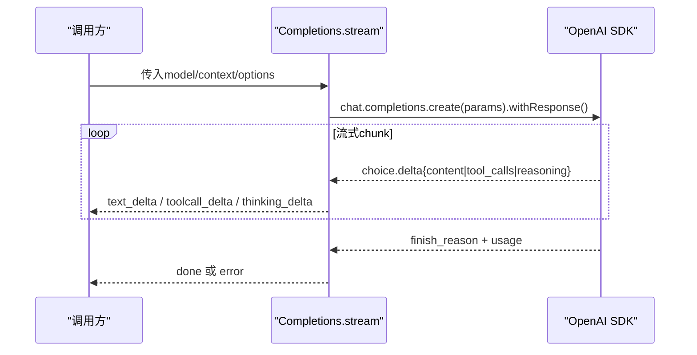
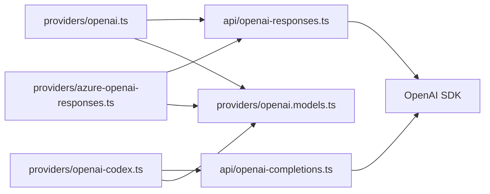

# OpenAI 集成

<cite>
**本文引用的文件**
- [packages/ai/src/providers/openai.ts](file://packages/ai/src/providers/openai.ts)
- [packages/ai/src/providers/openai.models.ts](file://packages/ai/src/providers/openai.models.ts)
- [packages/ai/src/api/openai-responses.ts](file://packages/ai/src/api/openai-responses.ts)
- [packages/ai/src/api/openai-completions.ts](file://packages/ai/src/api/openai-completions.ts)
- [packages/ai/src/providers/azure-openai-responses.ts](file://packages/ai/src/providers/azure-openai-responses.ts)
- [packages/ai/src/providers/openai-codex.ts](file://packages/ai/src/providers/openai-codex.ts)
</cite>

## 目录
1. [简介](#简介)
2. [项目结构](#项目结构)
3. [核心组件](#核心组件)
4. [架构总览](#架构总览)
5. [详细组件分析](#详细组件分析)
6. [依赖关系分析](#依赖关系分析)
7. [性能与速率限制](#性能与速率限制)
8. [故障排查指南](#故障排查指南)
9. [结论](#结论)
10. [附录：配置与使用要点](#附录：配置与使用要点)

## 简介
本文件面向在项目中集成 OpenAI 提供商的开发者，系统说明如何配置 API Key、基础 URL、请求参数，以及如何使用流式响应、函数调用和图像能力。同时覆盖错误处理、重试机制、速率限制策略，并给出文本生成、代码补全与图像处理的使用指引。最后说明与 Azure OpenAI 服务的集成方式及差异点。

## 项目结构
OpenAI 相关实现集中在 ai 包中，采用“提供商 + API 适配”的分层组织：
- 提供商定义：负责声明 provider id、名称、baseUrl、鉴权方式、可用模型集合，并绑定具体 API 适配器。
- API 适配器：封装对 OpenAI 官方 Responses/Completions/Codex 等接口的调用、流式解析、工具调用、缓存与会话亲和等细节。
- 模型清单：由脚本生成的模型目录，供提供商注册时加载。

图表来源
- [packages/ai/src/providers/openai.ts:1-16](file://packages/ai/src/providers/openai.ts#L1-L16)
- [packages/ai/src/providers/azure-openai-responses.ts:1-15](file://packages/ai/src/providers/azure-openai-responses.ts#L1-L15)
- [packages/ai/src/providers/openai-codex.ts:1-23](file://packages/ai/src/providers/openai-codex.ts#L1-L23)
- [packages/ai/src/api/openai-responses.ts:1-30](file://packages/ai/src/api/openai-responses.ts#L1-L30)
- [packages/ai/src/api/openai-completions.ts:1-60](file://packages/ai/src/api/openai-completions.ts#L1-L60)
- [packages/ai/src/providers/openai.models.ts:1-9](file://packages/ai/src/providers/openai.models.ts#L1-L9)

章节来源
- [packages/ai/src/providers/openai.ts:1-16](file://packages/ai/src/providers/openai.ts#L1-L16)
- [packages/ai/src/providers/openai.models.ts:1-9](file://packages/ai/src/providers/openai.models.ts#L1-L9)

## 核心组件
- OpenAI 提供商（Responses）：通过 createProvider 注册 provider id 为 openai，设置 baseUrl 为 https://api.openai.com/v1，鉴权读取 OPENAI_API_KEY，并绑定 openAIResponsesApi。
- OpenAI Completions 适配器：提供基于 Chat Completions 的流式接口，支持工具调用、思考内容、提示词缓存、会话亲和等。
- OpenAI Responses 适配器：提供基于 Responses 的流式接口，统一消息/工具转换与流式事件处理，支持服务等级、推理摘要、加密推理内容等。
- Azure OpenAI 提供商：以 azure-openai-responses 形式接入，鉴权读取 AZURE_OPENAI_API_KEY，并绑定 Azure 专用 API 适配器。
- OpenAI Codex 提供商：用于 chatgpt.com 后端 API，使用 OAuth 认证，绑定 Codex Responses 适配器。

章节来源
- [packages/ai/src/providers/openai.ts:1-16](file://packages/ai/src/providers/openai.ts#L1-L16)
- [packages/ai/src/api/openai-completions.ts:1-80](file://packages/ai/src/api/openai-completions.ts#L1-L80)
- [packages/ai/src/api/openai-responses.ts:1-30](file://packages/ai/src/api/openai-responses.ts#L1-L30)
- [packages/ai/src/providers/azure-openai-responses.ts:1-15](file://packages/ai/src/providers/azure-openai-responses.ts#L1-L15)
- [packages/ai/src/providers/openai-codex.ts:1-23](file://packages/ai/src/providers/openai-codex.ts#L1-L23)

## 架构总览
下图展示了从应用侧到 OpenAI 各 API 的调用路径，包括流式事件、工具调用、错误与重试。

图表来源
- [packages/ai/src/api/openai-responses.ts:102-195](file://packages/ai/src/api/openai-responses.ts#L102-L195)
- [packages/ai/src/api/openai-completions.ts:200-614](file://packages/ai/src/api/openai-completions.ts#L200-L614)

## 详细组件分析

### OpenAI 提供商（Responses）
- 作用：注册 openai 提供商，指定 baseUrl、鉴权、模型集与 API 适配器。
- 关键点：
  - baseUrl 固定为 https://api.openai.com/v1。
  - 鉴权通过环境变量 OPENAI_API_KEY 注入。
  - 模型清单来自自动生成的 catalog。

章节来源
- [packages/ai/src/providers/openai.ts:1-16](file://packages/ai/src/providers/openai.ts#L1-L16)
- [packages/ai/src/providers/openai.models.ts:1-9](file://packages/ai/src/providers/openai.models.ts#L1-L9)

### OpenAI Responses API 适配器
- 流式处理：构造 AssistantMessageEventStream，按 chunk 推送到上层；支持 reasoning.encrypted_content、service_tier、prompt_cache_key/retention 等。
- 工具调用：将内部工具转换为 Responses 工具格式，支持严格模式与语法工具。
- 错误与重试：统一格式化错误，并通过重试包装器执行请求；异常时输出 error 事件。
- 成本计算：根据 service_tier 调整用量成本。

图表来源
- [packages/ai/src/api/openai-responses.ts:102-195](file://packages/ai/src/api/openai-responses.ts#L102-L195)
- [packages/ai/src/api/openai-responses.ts:258-343](file://packages/ai/src/api/openai-responses.ts#L258-L343)

章节来源
- [packages/ai/src/api/openai-responses.ts:1-373](file://packages/ai/src/api/openai-responses.ts#L1-L373)

### OpenAI Completions API 适配器
- 流式处理：基于 Chat Completions 流，维护 text/thinking/toolCall 三类内容块，逐步拼接并推送增量事件。
- 工具调用：支持 function arguments 流式拼装、自定义输入属性（语法工具）、延迟工具等。
- 提示词缓存与会话亲和：根据兼容标志与环境变量设置 prompt_cache_key/retention 与 session 相关头。
- 错误与重试：统一错误格式化，异常时清理临时字段并推送 error 事件。

图表来源
- [packages/ai/src/api/openai-completions.ts:200-614](file://packages/ai/src/api/openai-completions.ts#L200-L614)

章节来源
- [packages/ai/src/api/openai-completions.ts:1-800](file://packages/ai/src/api/openai-completions.ts#L1-L800)

### Azure OpenAI 集成
- 提供商：以 azure-openai-responses 形式接入，鉴权读取 AZURE_OPENAI_API_KEY，并绑定 Azure 专用 API 适配器。
- 差异点：
  - 鉴权键名不同（AZURE_OPENAI_API_KEY）。
  - 通常需配合不同的 baseUrl（由模型或网关配置），此处通过对应 API 适配器完成对接。
  - 功能特性受限于 Azure 提供的 Responses 能力与模型支持。

章节来源
- [packages/ai/src/providers/azure-openai-responses.ts:1-15](file://packages/ai/src/providers/azure-openai-responses.ts#L1-L15)

### OpenAI Codex 集成
- 提供商：id 为 openai-codex，baseUrl 指向 chatgpt.com/backend-api，使用 OAuth 认证（lazyOAuth + loadOpenAICodexOAuth）。
- 用途：访问 ChatGPT Plus/Pro 的后端能力，绑定 Codex Responses 适配器。

章节来源
- [packages/ai/src/providers/openai-codex.ts:1-23](file://packages/ai/src/providers/openai-codex.ts#L1-L23)

## 依赖关系分析
- 提供商依赖 API 适配器：openai.ts 依赖 openai-responses.lazy；azure-openai-responses.ts 依赖 azure-openai-responses.lazy；openai-codex.ts 依赖 openai-codex-responses.lazy。
- API 适配器依赖 OpenAI SDK 与通用工具：如重试、错误格式化、消息/工具转换、提示词缓存等。
- 模型清单由脚本生成，提供商通过 flattenModelCatalog 加载。

图表来源
- [packages/ai/src/providers/openai.ts:1-16](file://packages/ai/src/providers/openai.ts#L1-L16)
- [packages/ai/src/providers/azure-openai-responses.ts:1-15](file://packages/ai/src/providers/azure-openai-responses.ts#L1-L15)
- [packages/ai/src/providers/openai-codex.ts:1-23](file://packages/ai/src/providers/openai-codex.ts#L1-L23)
- [packages/ai/src/api/openai-responses.ts:1-30](file://packages/ai/src/api/openai-responses.ts#L1-L30)
- [packages/ai/src/api/openai-completions.ts:1-60](file://packages/ai/src/api/openai-completions.ts#L1-L60)
- [packages/ai/src/providers/openai.models.ts:1-9](file://packages/ai/src/providers/openai.models.ts#L1-L9)

章节来源
- [packages/ai/src/providers/openai.ts:1-16](file://packages/ai/src/providers/openai.ts#L1-L16)
- [packages/ai/src/api/openai-responses.ts:1-30](file://packages/ai/src/api/openai-responses.ts#L1-L30)
- [packages/ai/src/api/openai-completions.ts:1-60](file://packages/ai/src/api/openai-completions.ts#L1-L60)

## 性能与速率限制
- 重试机制：API 适配器通过重试包装器执行请求，支持 maxRetries、maxRetryDelayMs 与信号中止。Completions 与 Responses 均内置此机制。
- 速率限制：建议在上层结合指数退避与令牌桶进行限流；当收到 429 等状态码时，利用重试包装器的退避策略降低失败率。
- 流式优化：尽量使用流式接口，减少内存占用并提升首字节时间；合理使用 prompt_cache_key/retention 降低重复请求成本。
- 服务等级：Responses 支持 service_tier，可按需选择 flex/priority 以平衡延迟与成本。

章节来源
- [packages/ai/src/api/openai-responses.ts:145-158](file://packages/ai/src/api/openai-responses.ts#L145-L158)
- [packages/ai/src/api/openai-completions.ts:241-253](file://packages/ai/src/api/openai-completions.ts#L241-L253)
- [packages/ai/src/api/openai-responses.ts:345-373](file://packages/ai/src/api/openai-responses.ts#L345-L373)

## 故障排查指南
- 缺少 API Key：若未提供 apiKey 且 headers 中无授权头，会抛出“无 API key”的错误。请检查环境变量或请求头。
- 流结束无 finish_reason：Completions/Responses 在流结束时若未检测到 finish_reason，会抛出相应错误。请检查上游返回与兼容标志。
- 请求被中止：当 signal.aborted 触发时，会抛出中止错误并输出 aborted 停止原因。
- 错误信息增强：错误会被标准化并格式化，必要时附加原始元数据以便定位问题。

章节来源
- [packages/ai/src/api/openai-completions.ts:72-76](file://packages/ai/src/api/openai-completions.ts#L72-L76)
- [packages/ai/src/api/openai-completions.ts:571-586](file://packages/ai/src/api/openai-completions.ts#L571-L586)
- [packages/ai/src/api/openai-responses.ts:43-47](file://packages/ai/src/api/openai-responses.ts#L43-L47)
- [packages/ai/src/api/openai-responses.ts:167-176](file://packages/ai/src/api/openai-responses.ts#L167-L176)

## 结论
本项目通过清晰的提供商与 API 适配器分层，实现了对 OpenAI Responses、Completions 与 Codex 的统一接入，并提供流式响应、工具调用、提示词缓存、服务等级与错误重试等关键能力。Azure OpenAI 通过独立提供商与适配器无缝接入。遵循本文的配置与最佳实践，可快速稳定地集成各类 OpenAI 能力。

## 附录：配置与使用要点

### 配置项速查
- API Key
  - OpenAI：通过环境变量 OPENAI_API_KEY 注入。
  - Azure OpenAI：通过环境变量 AZURE_OPENAI_API_KEY 注入。
- 基础 URL
  - OpenAI：默认 https://api.openai.com/v1。
  - Azure OpenAI：由对应模型/适配器决定（通常为 Azure 专属 endpoint）。
  - Codex：baseUrl 指向 chatgpt.com/backend-api。
- 请求参数
  - 通用：temperature、maxTokens、signal、timeoutMs、onPayload、onResponse、sessionId、env。
  - Responses：service_tier、reasoningEffort、reasoningSummary、toolChoice、samplingParams。
  - Completions：toolChoice、thinkingBudgets、reasoningEffort。

章节来源
- [packages/ai/src/providers/openai.ts:1-16](file://packages/ai/src/providers/openai.ts#L1-L16)
- [packages/ai/src/providers/azure-openai-responses.ts:1-15](file://packages/ai/src/providers/azure-openai-responses.ts#L1-L15)
- [packages/ai/src/providers/openai-codex.ts:1-23](file://packages/ai/src/providers/openai-codex.ts#L1-L23)
- [packages/ai/src/api/openai-responses.ts:91-97](file://packages/ai/src/api/openai-responses.ts#L91-L97)
- [packages/ai/src/api/openai-completions.ts:142-147](file://packages/ai/src/api/openai-completions.ts#L142-L147)

### 支持的模型类型与用法
- GPT-4/GPT-3.5-turbo 等：通过 openai 提供商与 Responses/Completions 适配器调用，依据模型目录动态加载。
- Codex：通过 openai-codex 提供商访问 ChatGPT Plus/Pro 后端能力，适合代码补全与对话场景。
- 使用方法：创建模型实例后，调用对应的 stream/streamSimple 接口获取流式事件。

章节来源
- [packages/ai/src/providers/openai.models.ts:1-9](file://packages/ai/src/providers/openai.models.ts#L1-L9)
- [packages/ai/src/providers/openai-codex.ts:1-23](file://packages/ai/src/providers/openai-codex.ts#L1-L23)

### 流式响应处理
- 事件类型：start、text_start/text_delta/text_end、thinking_start/thinking_delta/thinking_end、toolcall_start/toolcall_delta/toolcall_end、done、error。
- 处理建议：按事件顺序累积内容，遇到 toolcall_delta 时解析 JSON 片段，最终在 toolcall_end 时提交工具调用结果。

章节来源
- [packages/ai/src/api/openai-completions.ts:257-349](file://packages/ai/src/api/openai-completions.ts#L257-L349)
- [packages/ai/src/api/openai-responses.ts:102-195](file://packages/ai/src/api/openai-responses.ts#L102-L195)

### 函数调用支持
- Completions：支持 function arguments 流式拼装与自定义输入属性（语法工具），并在结束时解析完整参数。
- Responses：将工具转换为 Responses 工具格式，支持严格模式与语法工具，并可延迟工具下发。

章节来源
- [packages/ai/src/api/openai-completions.ts:521-549](file://packages/ai/src/api/openai-completions.ts#L521-L549)
- [packages/ai/src/api/openai-responses.ts:268-317](file://packages/ai/src/api/openai-responses.ts#L268-L317)

### 图像生成能力
- 当前实现的提供商与适配器主要聚焦于文本与工具调用的流式处理。图像生成能力可通过外部图像提供商或扩展适配器接入，不在本次范围。

[本节为概念性说明，不直接分析具体文件]

### 错误处理与重试
- 错误格式化：统一标准化并格式化错误信息，必要时附加原始元数据。
- 重试策略：通过重试包装器执行请求，支持最大重试次数、延迟上限与信号中止。
- 中止处理：当请求被中止时，输出 aborted 停止原因并终止流。

章节来源
- [packages/ai/src/api/openai-completions.ts:590-610](file://packages/ai/src/api/openai-completions.ts#L590-L610)
- [packages/ai/src/api/openai-responses.ts:180-191](file://packages/ai/src/api/openai-responses.ts#L180-L191)

### 与 Azure OpenAI 的差异
- 鉴权键名：Azure 使用 AZURE_OPENAI_API_KEY。
- 基础 URL：Azure 通常使用专属 endpoint，由模型/适配器配置。
- 能力边界：具体能力取决于 Azure 提供的 Responses 与模型支持。

章节来源
- [packages/ai/src/providers/azure-openai-responses.ts:1-15](file://packages/ai/src/providers/azure-openai-responses.ts#L1-L15)