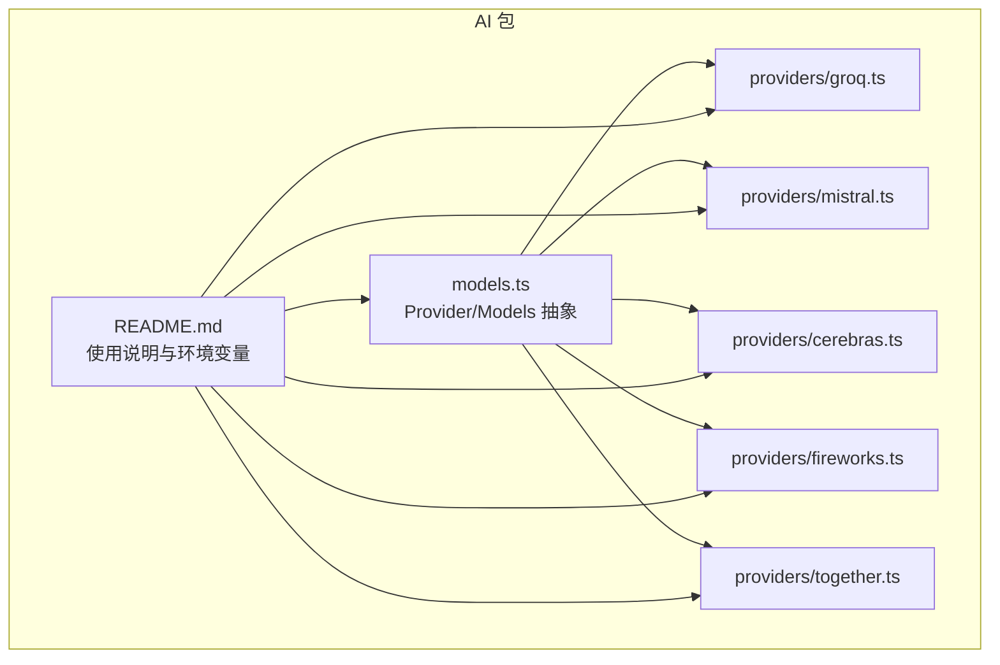
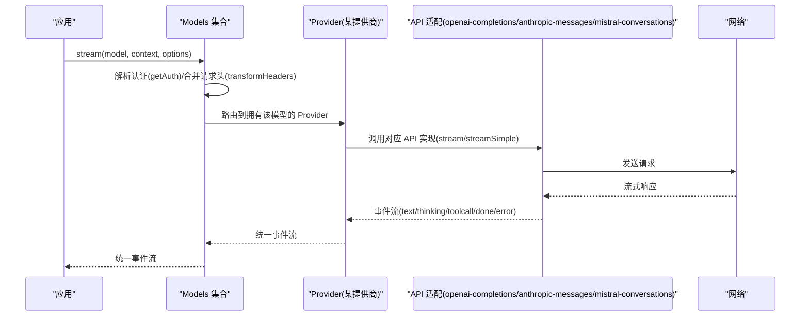
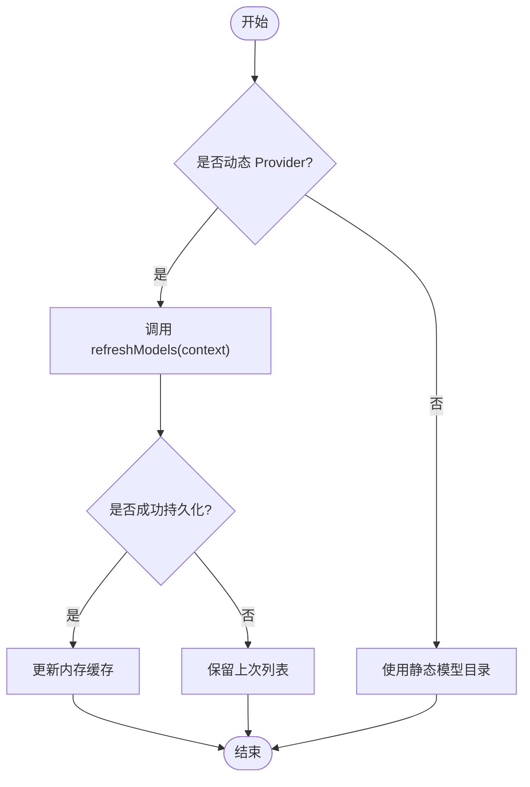
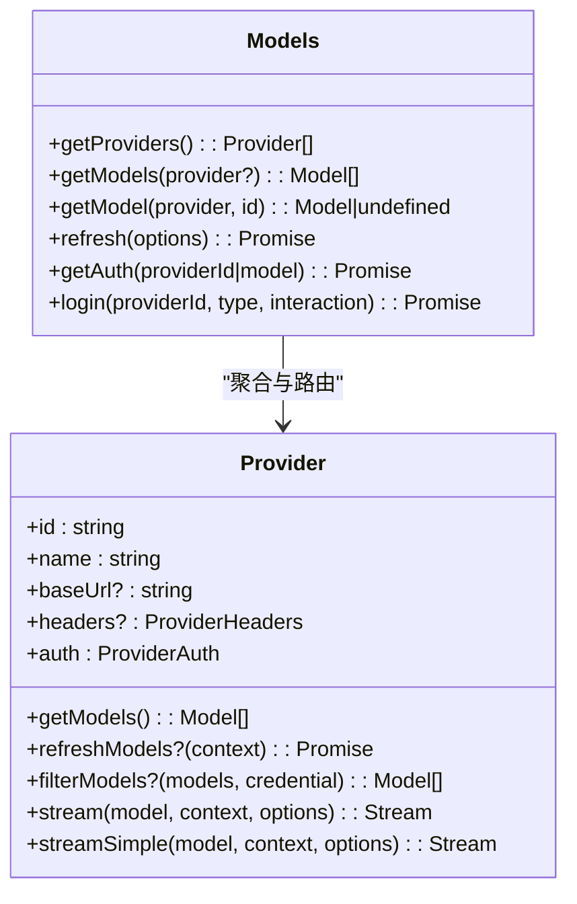
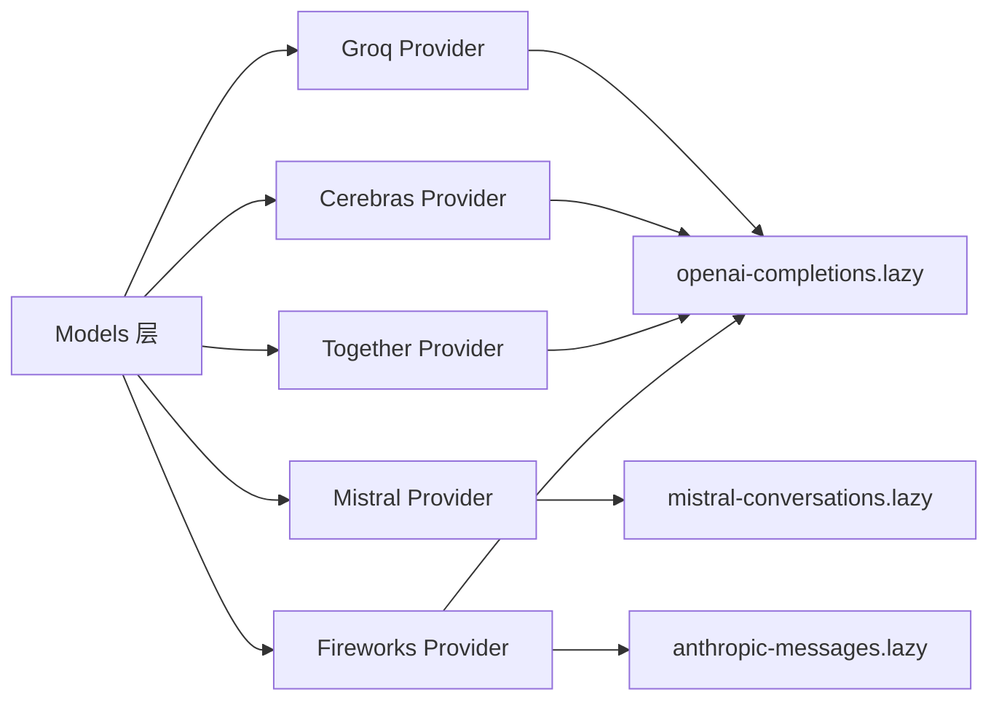

# 其他提供商集成

<cite>
**本文引用的文件**
- [groq.ts](file://packages/ai/src/providers/groq.ts)
- [mistral.ts](file://packages/ai/src/providers/mistral.ts)
- [cerebras.ts](file://packages/ai/src/providers/cerebras.ts)
- [fireworks.ts](file://packages/ai/src/providers/fireworks.ts)
- [together.ts](file://packages/ai/src/providers/together.ts)
- [models.ts](file://packages/ai/src/models.ts)
- [README.md](file://packages/ai/README.md)
</cite>

## 目录
1. [简介](#简介)
2. [项目结构](#项目结构)
3. [核心组件](#核心组件)
4. [架构总览](#架构总览)
5. [详细组件分析](#详细组件分析)
6. [依赖关系分析](#依赖关系分析)
7. [性能考量](#性能考量)
8. [故障排查指南](#故障排查指南)
9. [结论](#结论)
10. [附录](#附录)

## 简介
本文件面向“其他 AI 提供商”的集成与使用，覆盖 Groq、Mistral、Cerebras、Fireworks、Together AI 等。文档说明各提供商的独特特性与适用场景，解释模型目录管理机制（静态目录与动态刷新）、统一接口抽象层设计（Provider/Models），以及如何为新提供商快速创建适配器。同时提供提供商选择策略、负载均衡与故障转移思路，以及测试、调试与性能基准方法，并给出社区贡献与发布流程指引。

## 项目结构
该仓库采用多包结构，AI 能力集中在 packages/ai。其中：
- providers 目录按提供商划分，每个提供商一个工厂函数，返回 Provider 实例，声明其 baseUrl、鉴权方式、模型目录与 API 实现。
- models.ts 定义 Provider 与 Models 的统一抽象，负责认证解析、模型集合、流式调用与请求头转换等。
- README.md 提供完整的使用说明、环境变量、工具调用、图像生成、思考/推理、错误处理与自定义 Provider 等。

图表来源
- [models.ts:88-149](file://packages/ai/src/models.ts#L88-L149)
- [groq.ts:1-16](file://packages/ai/src/providers/groq.ts#L1-L16)
- [mistral.ts:1-16](file://packages/ai/src/providers/mistral.ts#L1-L16)
- [cerebras.ts:1-16](file://packages/ai/src/providers/cerebras.ts#L1-L16)
- [fireworks.ts:1-20](file://packages/ai/src/providers/fireworks.ts#L1-L20)
- [together.ts:1-16](file://packages/ai/src/providers/together.ts#L1-L16)

章节来源
- [models.ts:88-149](file://packages/ai/src/models.ts#L88-L149)
- [README.md:57-90](file://packages/ai/README.md#L57-L90)

## 核心组件
- Provider 抽象：每个提供商通过 createProvider 暴露 id、name、baseUrl、auth、getModels、stream/streamSimple/fetchDeferred/cancelDeferred 等能力。Provider 拥有自己的模型目录与鉴权逻辑。
- Models 集合：聚合多个 Provider，提供 getModels/getModel/refresh/getAuth/login/logout 等能力，并在请求时解析认证、合并请求头、路由到对应 Provider。
- 统一 API 适配：不同提供商可能使用不同的 wire protocol（如 openai-completions、anthropic-messages、mistral-conversations），Provider 可绑定一种或多种 API 实现。

章节来源
- [models.ts:88-149](file://packages/ai/src/models.ts#L88-L149)
- [models.ts:156-200](file://packages/ai/src/models.ts#L156-L200)

## 架构总览
下图展示了从应用调用到具体提供商的端到端流程，包括认证解析、模型路由、API 适配与流式响应。

图表来源
- [models.ts:88-149](file://packages/ai/src/models.ts#L88-L149)
- [groq.ts:1-16](file://packages/ai/src/providers/groq.ts#L1-L16)
- [mistral.ts:1-16](file://packages/ai/src/providers/mistral.ts#L1-L16)
- [cerebras.ts:1-16](file://packages/ai/src/providers/cerebras.ts#L1-L16)
- [fireworks.ts:1-20](file://packages/ai/src/providers/fireworks.ts#L1-L20)
- [together.ts:1-16](file://packages/ai/src/providers/together.ts#L1-L16)

## 详细组件分析

### Groq 集成
- 特点与适用场景：基于 OpenAI Completions 协议，低延迟推理，适合对实时性要求高的对话与工具调用场景。
- 配置要点：设置 GROQ_API_KEY；baseUrl 指向 Groq 官方端点；使用 openai-completions API 适配。
- 模型目录：由 groq.models.ts 提供静态模型列表。

章节来源
- [groq.ts:1-16](file://packages/ai/src/providers/groq.ts#L1-L16)
- [README.md:409-450](file://packages/ai/README.md#L409-L450)

### Mistral 集成
- 特点与适用场景：原生 Conversations 协议，支持丰富的对话与工具调用能力，适合需要深度对话与结构化输出的场景。
- 配置要点：设置 MISTRAL_API_KEY；baseUrl 指向 Mistral 官方端点；使用 mistral-conversations API 适配。
- 模型目录：由 mistral.models.ts 提供静态模型列表。

章节来源
- [mistral.ts:1-16](file://packages/ai/src/providers/mistral.ts#L1-L16)
- [README.md:409-450](file://packages/ai/README.md#L409-L450)

### Cerebras 集成
- 特点与适用场景：基于 OpenAI Completions 协议，强调高吞吐与并行推理，适合批量生成与大规模并发任务。
- 配置要点：设置 CEREBRAS_API_KEY；baseUrl 指向 Cerebras 官方端点；使用 openai-completions API 适配。
- 模型目录：由 cerebras.models.ts 提供静态模型列表。

章节来源
- [cerebras.ts:1-16](file://packages/ai/src/providers/cerebras.ts#L1-L16)
- [README.md:409-450](file://packages/ai/README.md#L409-L450)

### Fireworks 集成
- 特点与适用场景：同时支持 Anthropic Messages 与 OpenAI Completions 两种协议，可按模型自动选择合适 API，适合混合生态与跨协议兼容需求。
- 配置要点：设置 FIREWORKS_API_KEY；baseUrl 指向 Fireworks 推断端点；在 Provider 中注册多 API 映射。
- 模型目录：由 fireworks.models.ts 提供静态模型列表。

章节来源
- [fireworks.ts:1-20](file://packages/ai/src/providers/fireworks.ts#L1-L20)
- [README.md:409-450](file://packages/ai/README.md#L409-L450)

### Together AI 集成
- 特点与适用场景：基于 OpenAI Completions 协议，开源模型托管丰富，适合多样化模型实验与成本敏感场景。
- 配置要点：设置 TOGETHER_API_KEY；baseUrl 指向 Together 官方端点；使用 openai-completions API 适配。
- 模型目录：由 together.models.ts 提供静态模型列表。

章节来源
- [together.ts:1-16](file://packages/ai/src/providers/together.ts#L1-L16)
- [README.md:409-450](file://packages/ai/README.md#L409-L450)

### 模型目录管理与动态发现
- 静态目录：内置提供商通常通过各自的 *.models.ts 提供静态模型清单，Provider 直接挂载为 models。
- 动态刷新：Provider 可实现 refreshModels(context)，结合持久化存储与信号控制进行异步刷新；Models.refresh() 会并发刷新已配置的动态 Provider，失败不抛错，仅记录错误。
- 可用模型过滤：Provider 可提供 filterModels(models, credential) 以根据凭证裁剪可见模型；Models.getAvailable() 会在确认鉴权后应用此过滤。

图表来源
- [models.ts:46-76](file://packages/ai/src/models.ts#L46-L76)
- [models.ts:113-134](file://packages/ai/src/models.ts#L113-L134)

章节来源
- [models.ts:46-76](file://packages/ai/src/models.ts#L46-L76)
- [models.ts:113-134](file://packages/ai/src/models.ts#L113-L134)

### 统一接口抽象层与新提供商适配器
- 新提供商适配器步骤：
  1) 新建 provider 文件，导出工厂函数，调用 createProvider 声明 id/name/baseUrl/auth/models/api。
  2) 若提供商遵循 OpenAI Completions 协议，复用 openai-completions.lazy 适配；否则引入对应 API 适配（如 anthropic-messages、mistral-conversations）。
  3) 将模型清单放入 *.models.ts，并通过 Object.values(...) 注入 Provider。
  4) 在应用侧通过 createModels().setProvider(providerFactory()) 注册，或使用 builtinModels() 一次性注册所有内置 Provider。
- 认证与环境变量：通过 envApiKeyAuth 读取环境变量，或在 CredentialStore 中持久化密钥；鉴权优先级：显式 apiKey > 存储凭证 > 环境变量。

图表来源
- [models.ts:88-149](file://packages/ai/src/models.ts#L88-L149)
- [models.ts:156-200](file://packages/ai/src/models.ts#L156-L200)

章节来源
- [models.ts:88-149](file://packages/ai/src/models.ts#L88-L149)
- [models.ts:156-200](file://packages/ai/src/models.ts#L156-L200)

### 提供商选择策略、负载均衡与故障转移
- 选择策略：
  - 基于模型能力：vision、reasoning、tool calling、上下文窗口等元数据。
  - 基于协议兼容性：openai-completions 与 anthropic-messages/mistral-conversations 的差异。
  - 基于成本与延迟：结合 usage.cost 与首 token 时间进行权衡。
- 负载均衡：
  - 多 Provider 同模型名路由：可在 Models 层维护权重表，按权重轮询或按延迟自适应选择。
  - 请求级分流：通过 transformHeaders 注入追踪标识，便于观测与回滚。
- 故障转移：
  - 捕获 Provider 错误事件，切换到备选 Provider 重试。
  - 使用 Models.refresh() 的 errors 映射定位失败 Provider，临时降级。
  - 对动态 Provider 的 refresh 失败保持旧目录可用，避免雪崩。

[本节为概念性指导，无需代码来源]

### 开发指南：测试、调试与性能基准
- 测试：
  - 使用 Faux Provider 构造确定性输入输出，验证工具调用、流式事件与错误分支。
  - 针对鉴权路径，使用 getAuth/checkAuth 验证环境/存储凭证是否生效。
- 调试：
  - 使用 transformHeaders 注入 X-Request-ID 等追踪头，配合服务端日志定位问题。
  - 关注 onPayload/onResponse 回调（如适用）观察请求/响应体。
- 性能基准：
  - 统计首 token 时间、总耗时、token 用量与成本（usage.input/output/cost.total）。
  - 对比不同 Provider 在同模型/同提示下的吞吐与稳定性。

章节来源
- [README.md:100-226](file://packages/ai/README.md#L100-L226)
- [README.md:324-380](file://packages/ai/README.md#L324-L380)
- [README.md:652-671](file://packages/ai/README.md#L652-L671)

### 社区贡献流程与发布流程
- 贡献流程：
  - 新增 Provider：参照现有 providers/*.ts 模式，补充 *.models.ts 与 README 中的环境变量说明。
  - 提交 PR：确保类型检查、单元测试与文档更新通过。
- 发布流程：
  - 脚本位于 scripts/ 下，包含版本同步、打包、发布与公告等步骤。
  - 发布前执行本地发布脚本与变更日志校验，确保依赖锁定与版本号一致。

章节来源
- [README.md:54-55](file://packages/ai/README.md#L54-L55)
- [scripts/publish.mjs](file://scripts/publish.mjs)
- [scripts/release.mjs](file://scripts/release.mjs)
- [scripts/sync-versions.js](file://scripts/sync-versions.js)

## 依赖关系分析
- Provider 与 API 适配：
  - Groq/Cerebras/Together：依赖 openai-completions.lazy。
  - Mistral：依赖 mistral-conversations.lazy。
  - Fireworks：同时依赖 anthropic-messages.lazy 与 openai-completions.lazy。
- 认证与模型目录：
  - 鉴权通过 envApiKeyAuth 读取环境变量；模型目录来自各自 *.models.ts。
- Models 层：
  - 负责认证解析、请求头转换、Provider 路由与流式事件统一。

图表来源
- [groq.ts:1-16](file://packages/ai/src/providers/groq.ts#L1-L16)
- [cerebras.ts:1-16](file://packages/ai/src/providers/cerebras.ts#L1-L16)
- [together.ts:1-16](file://packages/ai/src/providers/together.ts#L1-L16)
- [mistral.ts:1-16](file://packages/ai/src/providers/mistral.ts#L1-L16)
- [fireworks.ts:1-20](file://packages/ai/src/providers/fireworks.ts#L1-L20)
- [models.ts:88-149](file://packages/ai/src/models.ts#L88-L149)

章节来源
- [groq.ts:1-16](file://packages/ai/src/providers/groq.ts#L1-L16)
- [cerebras.ts:1-16](file://packages/ai/src/providers/cerebras.ts#L1-L16)
- [together.ts:1-16](file://packages/ai/src/providers/together.ts#L1-L16)
- [mistral.ts:1-16](file://packages/ai/src/providers/mistral.ts#L1-L16)
- [fireworks.ts:1-20](file://packages/ai/src/providers/fireworks.ts#L1-L20)
- [models.ts:88-149](file://packages/ai/src/models.ts#L88-L149)

## 性能考量
- 协议选择：OpenAI Completions 协议在多数提供商上具备良好生态与工具链；Mistral 原生协议在某些场景下提供更细粒度的控制。
- 流式处理：优先使用流式接口以降低首字节延迟，提升交互体验。
- 资源限制：注意上下文窗口与最大生成长度，合理拆分长文本与工具调用。
- 成本优化：监控 usage.cost 与 token 用量，结合模型能力选择性价比最优方案。
- 并发与限流：在高并发场景下，结合 Provider 配额与速率限制进行节流与退避。

[本节为通用指导，无需代码来源]

## 故障排查指南
- 鉴权失败：
  - 检查环境变量是否正确设置（参考 README 的环境变量表）。
  - 使用 getAuth/checkAuth 诊断凭证来源与状态。
- 模型不可用：
  - 对于动态 Provider，调用 refresh() 获取最新目录；查看返回的 errors 映射。
  - 使用 getAvailable() 过滤出当前凭证可用的模型。
- 请求异常：
  - 通过 transformHeaders 注入追踪头，定位上游错误。
  - 捕获 error 事件，区分 abort 与 network/provider 错误。
- 工具调用问题：
  - 使用 validateToolCall 校验参数；在 toolcall_end 后执行工具并回填结果。

章节来源
- [README.md:324-380](file://packages/ai/README.md#L324-L380)
- [README.md:652-671](file://packages/ai/README.md#L652-L671)
- [models.ts:172-195](file://packages/ai/src/models.ts#L172-L195)

## 结论
通过统一的 Provider/Models 抽象，本项目实现了跨多家 AI 提供商的一致接入与调用。Groq、Mistral、Cerebras、Fireworks、Together AI 等均以最小配置即可启用，且支持动态模型目录、认证解析、流式事件与工具调用。借助选择策略、负载均衡与故障转移机制，可在生产环境中构建高可用、高性能的多提供商 LLM 服务。

## 附录
- 环境变量速查（节选）：
  - Groq: GROQ_API_KEY
  - Mistral: MISTRAL_API_KEY
  - Cerebras: CEREBRAS_API_KEY
  - Fireworks: FIREWORKS_API_KEY
  - Together AI: TOGETHER_API_KEY
- 相关入口：
  - 内置 Provider 集合：builtinModels()
  - 单 Provider 工厂：各 providers/*.ts 导出的工厂函数

章节来源
- [README.md:409-450](file://packages/ai/README.md#L409-L450)
- [README.md:236-264](file://packages/ai/README.md#L236-L264)