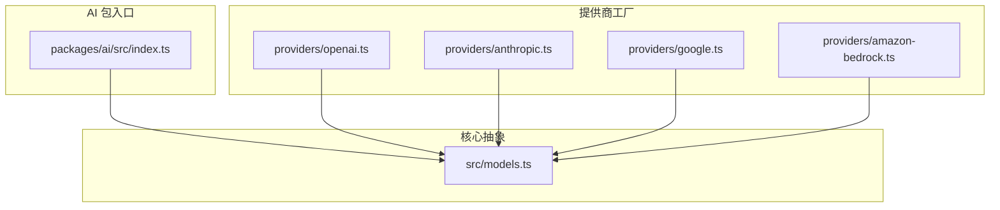
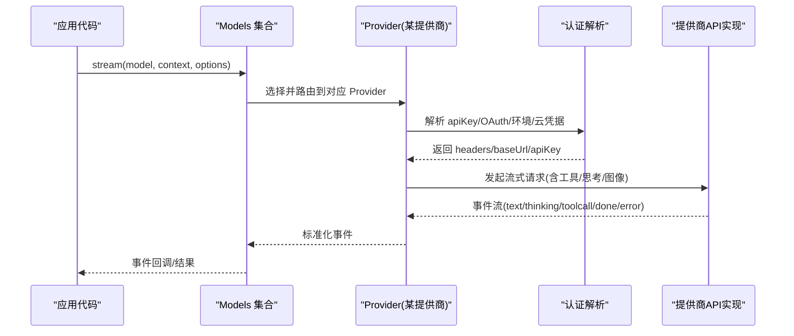
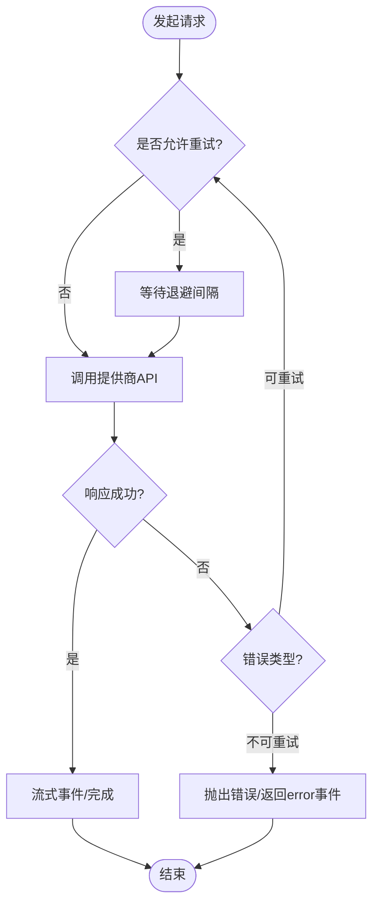
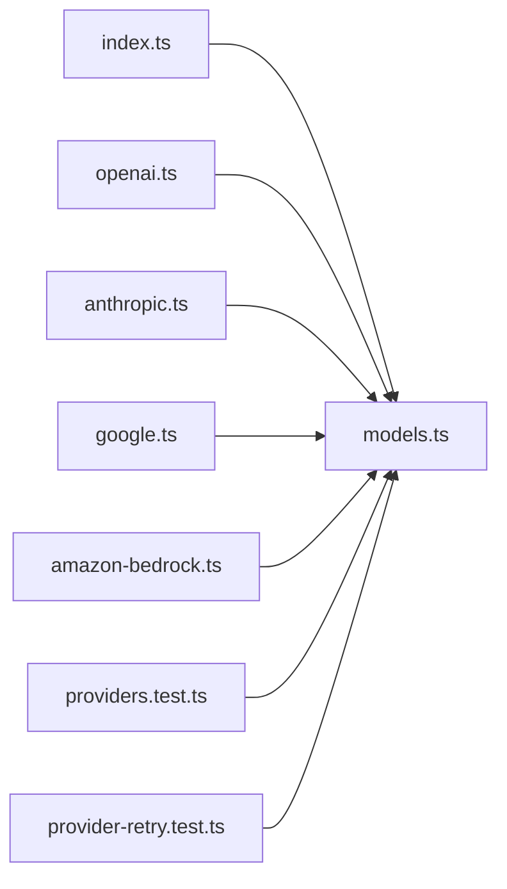

# 提供商集成

<cite>
**本文引用的文件**
- [README.md](file://packages/ai/README.md)
- [index.ts](file://packages/ai/src/index.ts)
- [openai.ts](file://packages/ai/src/providers/openai.ts)
- [anthropic.ts](file://packages/ai/src/providers/anthropic.ts)
- [google.ts](file://packages/ai/src/providers/google.ts)
- [amazon-bedrock.ts](file://packages/ai/src/providers/amazon-bedrock.ts)
- [models.ts](file://packages/ai/src/models.ts)
- [provider-env.ts](file://packages/ai/src/utils/provider-env.ts)
- [provider-retry.ts](file://packages/ai/src/utils/provider-retry.ts)
- [providers.test.ts](file://packages/ai/test/providers.test.ts)
- [provider-retry.test.ts](file://packages/ai/test/provider-retry.test.ts)
</cite>

## 目录
1. [简介](#简介)
2. [项目结构](#项目结构)
3. [核心组件](#核心组件)
4. [架构总览](#架构总览)
5. [详细组件分析](#详细组件分析)
6. [依赖关系分析](#依赖关系分析)
7. [性能与成本考量](#性能与成本考量)
8. [故障排除指南](#故障排除指南)
9. [结论](#结论)
10. [附录](#附录)

## 简介
本文件面向需要在应用中集成多家 AI 提供商（OpenAI、Anthropic Claude、Google Gemini、AWS Bedrock 等）的开发者，提供从配置、认证、模型目录管理到高级特性（连接池、重试、错误映射）与最佳实践的系统性说明。文档基于仓库中的统一 LLM API 包实现，强调“按提供商工厂注册”、“自动认证解析”、“流式事件”、“工具调用”和“跨提供商上下文传递”。

## 项目结构
该仓库采用多包 monorepo 组织，AI 能力集中在 packages/ai。其入口导出类型、模型集合、认证与工具相关能力；各提供商以独立模块暴露工厂函数，并通过统一的 Provider/Models 抽象进行路由与调度。

图表来源
- [index.ts:1-48](file://packages/ai/src/index.ts#L1-L48)
- [openai.ts:1-16](file://packages/ai/src/providers/openai.ts#L1-L16)
- [anthropic.ts:1-60](file://packages/ai/src/providers/anthropic.ts#L1-L60)
- [google.ts:1-16](file://packages/ai/src/providers/google.ts#L1-L16)
- [amazon-bedrock.ts:1-91](file://packages/ai/src/providers/amazon-bedrock.ts#L1-L91)
- [models.ts](file://packages/ai/src/models.ts)

章节来源
- [index.ts:1-48](file://packages/ai/src/index.ts#L1-L48)
- [README.md:57-90](file://packages/ai/README.md#L57-L90)

## 核心组件
- 提供商工厂：每个提供商通过 createProvider 创建 Provider 实例，声明 id、name、baseUrl、auth、models、api 等元数据与实现。
- 模型集合 Models：持有多个 Provider，负责按 provider/model 标识路由请求、合并认证、处理流式事件与工具调用。
- 认证系统：支持环境变量、存储凭证、OAuth、云原生凭据链（如 AWS）。
- 工具与思考：统一的事件流接口，支持工具调用、思维过程输出、图像输入/生成等。

章节来源
- [openai.ts:1-16](file://packages/ai/src/providers/openai.ts#L1-L16)
- [anthropic.ts:1-60](file://packages/ai/src/providers/anthropic.ts#L1-L60)
- [google.ts:1-16](file://packages/ai/src/providers/google.ts#L1-L16)
- [amazon-bedrock.ts:1-91](file://packages/ai/src/providers/amazon-bedrock.ts#L1-L91)
- [README.md:230-322](file://packages/ai/README.md#L230-L322)

## 架构总览
下图展示了请求从 Models 集合到具体提供商 API 的实现路径，以及认证、模型目录、事件流的交互。

图表来源
- [openai.ts:1-16](file://packages/ai/src/providers/openai.ts#L1-L16)
- [anthropic.ts:1-60](file://packages/ai/src/providers/anthropic.ts#L1-L60)
- [google.ts:1-16](file://packages/ai/src/providers/google.ts#L1-L16)
- [amazon-bedrock.ts:1-91](file://packages/ai/src/providers/amazon-bedrock.ts#L1-L91)
- [models.ts](file://packages/ai/src/models.ts)

## 详细组件分析

### OpenAI 提供商
- 工厂与基础信息：id=openai，baseUrl=https://api.openai.com/v1，使用 openai-responses API。
- 认证：通过 envApiKeyAuth 读取 OPENAI_API_KEY。
- 模型目录：静态模型列表来自 openai.models.ts。
- 典型用法：在 Models 集合中注册后，即可按 model.id 路由到 OpenAI。

章节来源
- [openai.ts:1-16](file://packages/ai/src/providers/openai.ts#L1-L16)
- [README.md:409-456](file://packages/ai/README.md#L409-L456)

### Anthropic Claude 提供商
- 工厂与基础信息：id=anthropic，baseUrl=https://api.anthropic.com，使用 anthropic-messages API。
- 认证：支持 API Key、Bearer Token、OAuth（Claude Pro/Max），优先级为存储凭证 > 环境变量 > OAuth。
- 模型目录：静态模型列表来自 anthropic.models.ts。
- 特殊能力：支持 thinking/reasoning 与工具调用。

章节来源
- [anthropic.ts:1-60](file://packages/ai/src/providers/anthropic.ts#L1-L60)
- [README.md:409-456](file://packages/ai/README.md#L409-L456)

### Google Gemini 提供商
- 工厂与基础信息：id=google，baseUrl=https://generativelanguage.googleapis.com/v1beta，使用 google-generative-ai API。
- 认证：通过 GEMINI_API_KEY 环境变量。
- 模型目录：静态模型列表来自 google.models.ts。
- 注意：部分功能（如函数调用流式参数）在不同版本/端点存在差异。

章节来源
- [google.ts:1-16](file://packages/ai/src/providers/google.ts#L1-L16)
- [README.md:409-456](file://packages/ai/README.md#L409-L456)

### Amazon Bedrock 提供商
- 工厂与基础信息：id=amazon-bedrock，使用 bedrock-converse-stream API。
- 认证：支持 Bearer Token、AWS Profile、默认凭据链（IAM/ECS/Web Identity 等），不将凭据复制到本地存储。
- 模型目录：静态模型列表来自 amazon-bedrock.models.ts。
- 登录流程：交互式选择认证方式，便于首次配置。

章节来源
- [amazon-bedrock.ts:1-91](file://packages/ai/src/providers/amazon-bedrock.ts#L1-L91)
- [README.md:409-456](file://packages/ai/README.md#L409-L456)

### 模型目录管理与动态发现
- 静态目录：各提供商 models.ts 提供已验证模型清单，包含能力标记（vision、reasoning 等）。
- 动态刷新：对支持动态列表的提供商，可通过 models.refresh() 并发刷新，读取仍为同步。
- 查询接口：getProviders/getModel/getModels 等用于同步查询当前已知模型。

章节来源
- [README.md:266-322](file://packages/ai/README.md#L266-L322)

### 认证与头转换
- 解析顺序：Provider 认证 -> model.headers -> 显式 options.headers -> transformHeaders -> 实际 Provider.stream*。
- 可插拔：CredentialStore 支持持久化存储；OAuth 刷新在 modify 内原子执行，避免并发重复刷新。
- 调试：getAuth(model/provider) 可检查最终合并后的 headers 与来源。

章节来源
- [README.md:324-395](file://packages/ai/README.md#L324-L395)

### 工具调用与思考
- 工具定义：使用 TypeBox 模式，支持受限采样（JSON Schema/Grammar）。
- 流式工具：toolcall_delta 携带部分 JSON，toolcall_end 提供完整参数；Google 不支持函数调用流式参数。
- 思考输出：thinking_start/delta/end 事件，非推理模型会忽略相关选项。

章节来源
- [README.md:458-671](file://packages/ai/README.md#L458-L671)

### 自定义提供商适配器规范
- 使用 createProvider 构造 Provider，需声明 id/name/baseUrl/auth/models/api。
- auth 支持 apiKey/oauth/login/resolve；models 可为静态或动态；api 指向具体协议实现。
- 建议：保持懒加载 SDK 实现，按需引入以降低打包体积。

章节来源
- [openai.ts:1-16](file://packages/ai/src/providers/openai.ts#L1-L16)
- [anthropic.ts:1-60](file://packages/ai/src/providers/anthropic.ts#L1-L60)
- [google.ts:1-16](file://packages/ai/src/providers/google.ts#L1-L16)
- [amazon-bedrock.ts:1-91](file://packages/ai/src/providers/amazon-bedrock.ts#L1-L91)

### 连接池、请求重试与错误映射
- 重试：utils/provider-retry.ts 提供通用重试策略；测试覆盖常见场景。
- 环境变量：utils/provider-env.ts 辅助读取与校验环境变量。
- 错误：stream 事件包含 error 类型，stopReason 区分 abort/error；可结合 onPayload/onResponse 调试。

图表来源
- [provider-retry.ts](file://packages/ai/src/utils/provider-retry.ts)
- [provider-env.ts](file://packages/ai/src/utils/provider-env.ts)
- [README.md:652-671](file://packages/ai/README.md#L652-L671)

章节来源
- [provider-retry.ts](file://packages/ai/src/utils/provider-retry.ts)
- [provider-env.ts](file://packages/ai/src/utils/provider-env.ts)
- [provider-retry.test.ts](file://packages/ai/test/provider-retry.test.ts)
- [README.md:652-671](file://packages/ai/README.md#L652-L671)

## 依赖关系分析
- 入口 index.ts 仅导出类型与核心能力，避免副作用；各提供商通过子路径导入，利于 tree-shaking。
- 提供商工厂依赖各自 models 与 api 实现，彼此解耦。
- 测试用例验证 providers 行为与重试逻辑。

图表来源
- [index.ts:1-48](file://packages/ai/src/index.ts#L1-L48)
- [openai.ts:1-16](file://packages/ai/src/providers/openai.ts#L1-L16)
- [anthropic.ts:1-60](file://packages/ai/src/providers/anthropic.ts#L1-L60)
- [google.ts:1-16](file://packages/ai/src/providers/google.ts#L1-L16)
- [amazon-bedrock.ts:1-91](file://packages/ai/src/providers/amazon-bedrock.ts#L1-L91)
- [providers.test.ts](file://packages/ai/test/providers.test.ts)
- [provider-retry.test.ts](file://packages/ai/test/provider-retry.test.ts)

章节来源
- [index.ts:1-48](file://packages/ai/src/index.ts#L1-L48)
- [providers.test.ts](file://packages/ai/test/providers.test.ts)
- [provider-retry.test.ts](file://packages/ai/test/provider-retry.test.ts)

## 性能与成本考量
- 流式传输：优先使用 stream 接口以获得更低首字延迟与更好的用户体验。
- 工具与思考：开启 thinking 会增加 token 消耗，但可提升复杂任务质量；按需启用。
- 图像输入/生成：单独 ImagesModels 接口，避免与聊天流混用。
- 成本追踪：响应中包含 usage 与 cost，可用于监控与预算控制。
- 打包体积：按需引入单个 provider 工厂，减少无关 SDK 体积。

章节来源
- [README.md:100-228](file://packages/ai/README.md#L100-L228)
- [README.md:709-784](file://packages/ai/README.md#L709-L784)
- [README.md:786-800](file://packages/ai/README.md#L786-L800)

## 故障排除指南
- 认证失败
  - 检查环境变量是否正确设置（参考各提供商的环境变量表）。
  - 使用 getAuth(model/provider) 查看最终 headers 与来源。
  - 对于 OAuth，确认登录流程已完成且未过期。
- 请求超时/限流
  - 利用内置重试策略与退避；必要时调整业务侧超时与并发。
  - 观察错误事件 reason，区分 abort 与 error。
- 工具调用异常
  - 在 toolcall_end 后使用 validateToolCall 校验参数。
  - 对 Google 等不支持函数调用流式的提供商，注意参数一次性到达。
- 调试
  - 使用 onPayload/onResponse 捕获原始载荷与响应。
  - 通过 transformHeaders 注入追踪 ID，便于链路排查。

章节来源
- [README.md:324-395](file://packages/ai/README.md#L324-L395)
- [README.md:652-671](file://packages/ai/README.md#L652-L671)
- [provider-retry.test.ts](file://packages/ai/test/provider-retry.test.ts)

## 结论
本仓库提供了统一的多提供商 LLM 接入层，通过 Provider 工厂与 Models 集合实现解耦与可扩展。借助自动认证、流式事件、工具调用与思考能力，开发者可以以一致的方式对接 OpenAI、Anthropic、Google、Bedrock 等主流服务，并在生产环境中获得良好的可观测性与可维护性。

## 附录
- 快速开始与示例：参见 README 中的 Quick Start 与 Tools/Thinking/Image 章节。
- 迁移与兼容：旧全局 API 仍可通过 compat 入口访问，便于渐进迁移。
- 开发建议：按需引入 provider 工厂，配合懒加载 SDK 降低包体；在生产环境使用持久化 CredentialStore 与日志/遥测。