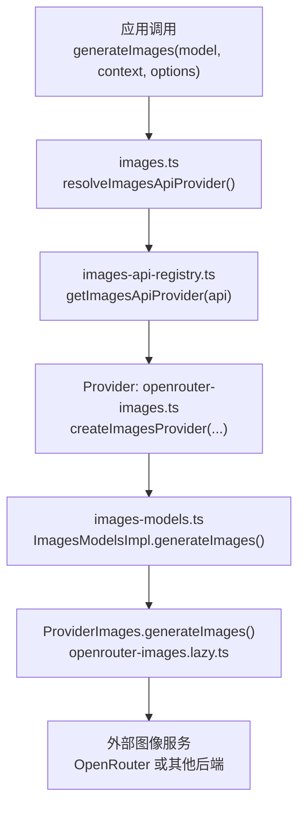
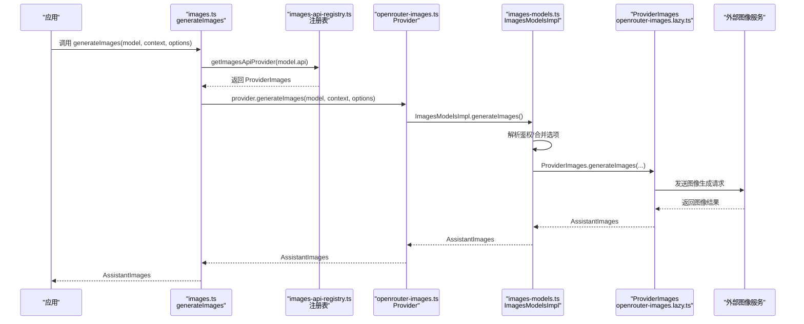
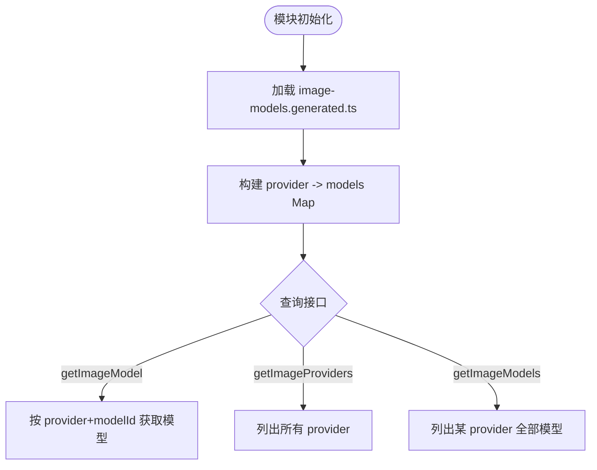
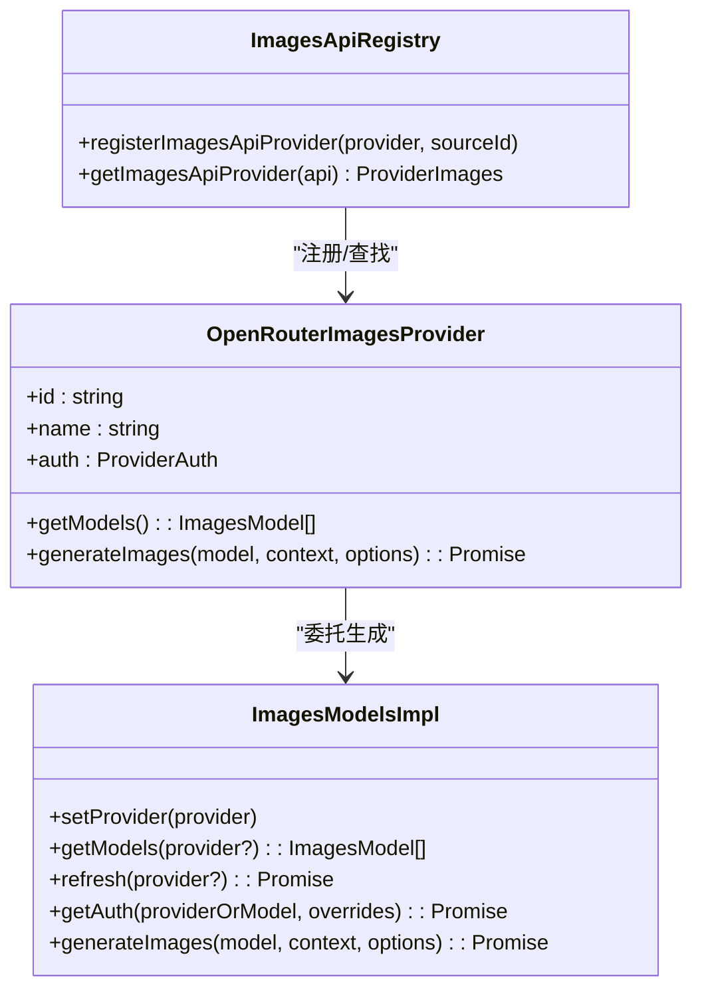
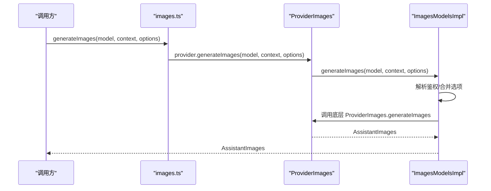
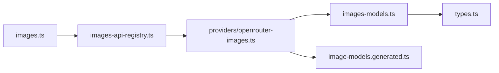

# 图像模型管理

<cite>
**本文引用的文件**
- [images.ts](file://packages/ai/src/images.ts)
- [images-api-registry.ts](file://packages/ai/src/images-api-registry.ts)
- [image-models.ts](file://packages/ai/src/image-models.ts)
- [images-models.ts](file://packages/ai/src/images-models.ts)
- [image-models.generated.ts](file://packages/ai/src/image-models.generated.ts)
- [openrouter-images.ts](file://packages/ai/src/providers/openrouter-images.ts)
- [register-builtins.ts](file://packages/ai/src/providers/images/register-builtins.ts)
- [types.ts](file://packages/ai/src/types.ts)
</cite>

## 目录
1. [简介](#简介)
2. [项目结构](#项目结构)
3. [核心组件](#核心组件)
4. [架构总览](#架构总览)
5. [详细组件分析](#详细组件分析)
6. [依赖关系分析](#依赖关系分析)
7. [性能与优化](#性能与优化)
8. [故障排查指南](#故障排查指南)
9. [结论](#结论)
10. [附录](#附录)

## 简介
本文件面向“图像模型管理”能力，系统性说明代码库中图像生成模型的注册、发现、调用与计费机制。当前仓库实现了统一的图像模型抽象层与提供者适配层，已内置 OpenRouter 图像模型目录，并通过 API 注册表动态加载具体实现。文档将覆盖：
- 支持的图像模型与提供方（如通过 OpenRouter 接入的多家厂商模型）
- 图像模型能力描述（输入/输出类型、成本等）
- 图像 API 注册表的工作机制与动态加载流程
- 图像生成参数配置（提示词、负提示词、采样设置等）
- 价格计算与资源消耗
- 任务队列与并发控制（基于运行时提供的并发原语）
- 性能优化与缓存策略

## 项目结构
图像相关代码集中在 packages/ai/src 下，关键模块如下：
- images.ts：对外暴露 generateImages 入口，解析并路由到对应 API 提供者
- images-api-registry.ts：图像 API 提供者的注册表，支持按 api 标识查找并提供 generateImages
- image-models.ts：构建并维护图像模型目录索引（provider -> model），提供查询接口
- images-models.ts：图像模型运行时集合 ImagesModelsImpl，负责鉴权、合并选项、调用 provider.generateImages
- image-models.generated.ts：自动生成的图像模型目录（包含各模型元数据与成本）
- providers/openrouter-images.ts：OpenRouter 图像提供者工厂，装配鉴权、模型列表与 API 实现
- providers/images/register-builtins.ts：注册内置图像 API 提供者（由 images.ts 引入触发）
- types.ts：统一类型定义，包括 ImagesApi、ImagesModel、ProviderImages、ImagesOptions 等

图表来源
- [images.ts:14-21](file://packages/ai/src/images.ts#L14-L21)
- [images-api-registry.ts:38-53](file://packages/ai/src/images-api-registry.ts#L38-L53)
- [openrouter-images.ts:7-22](file://packages/ai/src/providers/openrouter-images.ts#L7-L22)
- [images-models.ts:183-224](file://packages/ai/src/images-models.ts#L183-L224)

章节来源
- [images.ts:1-22](file://packages/ai/src/images.ts#L1-L22)
- [images-api-registry.ts:1-54](file://packages/ai/src/images-api-registry.ts#L1-L54)
- [image-models.ts:1-43](file://packages/ai/src/image-models.ts#L1-L43)
- [images-models.ts:1-276](file://packages/ai/src/images-models.ts#L1-L276)
- [image-models.generated.ts:1-640](file://packages/ai/src/image-models.generated.ts#L1-L640)
- [openrouter-images.ts:1-23](file://packages/ai/src/providers/openrouter-images.ts#L1-L23)
- [types.ts:280-330](file://packages/ai/src/types.ts#L280-L330)

## 核心组件
- 图像模型目录与索引
  - 自动生成目录 image-models.generated.ts 集中声明所有可用图像模型及其元数据（id、name、api、provider、baseUrl、input/output、cost）。
  - image-models.ts 在启动时将该目录装载为内存映射，提供 getImageModel/getImageProviders/getImageModels 等查询方法。
- 图像提供者与运行时
  - images-models.ts 定义了 ImagesProvider 与 ImagesModelsImpl，封装了模型列表获取、刷新、鉴权解析、请求选项合并与调用。
  - 每个 provider 通过 createImagesProvider 组装 id/name/auth/models/api，并暴露 generateImages。
- 图像 API 注册表
  - images-api-registry.ts 维护一个 Map<api, provider>，用于根据 model.api 查找对应的 ProviderImages 实现。
  - registerImagesApiProvider 允许扩展新的图像 API 实现；getImagesApiProvider 用于运行时查找。
- 对外入口
  - images.ts 暴露 generateImages，内部通过 resolveImagesApiProvider 找到对应 provider 并调用其 generateImages。

章节来源
- [image-models.generated.ts:6-640](file://packages/ai/src/image-models.generated.ts#L6-L640)
- [image-models.ts:1-43](file://packages/ai/src/image-models.ts#L1-L43)
- [images-models.ts:8-88](file://packages/ai/src/images-models.ts#L8-L88)
- [images-models.ts:97-229](file://packages/ai/src/images-models.ts#L97-L229)
- [images-api-registry.ts:1-54](file://packages/ai/src/images-api-registry.ts#L1-L54)
- [images.ts:1-22](file://packages/ai/src/images.ts#L1-L22)

## 架构总览
下图展示了从应用调用到最终图像生成的完整链路，以及各组件的职责边界。

图表来源
- [images.ts:14-21](file://packages/ai/src/images.ts#L14-L21)
- [images-api-registry.ts:38-53](file://packages/ai/src/images-api-registry.ts#L38-L53)
- [openrouter-images.ts:7-22](file://packages/ai/src/providers/openrouter-images.ts#L7-L22)
- [images-models.ts:183-224](file://packages/ai/src/images-models.ts#L183-L224)

## 详细组件分析

### 图像模型目录与发现
- 自动生成目录 image-models.generated.ts 提供按 provider 分组的模型清单，每个模型包含：
  - id/name：唯一标识与显示名
  - api/provider/baseUrl：目标 API 与提供方、基础地址
  - input/output：支持的输入/输出模态（如 text、image）
  - cost：输入/输出/缓存读取/写入的单位成本
- image-models.ts 在模块初始化时将目录装载为内存 Map，便于快速查询。

图表来源
- [image-models.generated.ts:6-640](file://packages/ai/src/image-models.generated.ts#L6-L640)
- [image-models.ts:1-43](file://packages/ai/src/image-models.ts#L1-L43)

章节来源
- [image-models.generated.ts:6-640](file://packages/ai/src/image-models.generated.ts#L6-L640)
- [image-models.ts:1-43](file://packages/ai/src/image-models.ts#L1-L43)

### 图像 API 注册表与动态加载
- 注册表 images-api-registry.ts 使用 Map 存储 api -> provider 的映射，支持：
  - registerImagesApiProvider：注册新的图像 API 实现
  - getImagesApiProvider：根据 model.api 查找对应实现
- 内置提供者 openrouter-images.ts 通过 createImagesProvider 装配鉴权、模型列表与 API 实现，并在 providers/images/register-builtins.ts 中被引入以完成注册。
- images.ts 在入口处通过 resolveImagesApiProvider 定位 provider，再调用其 generateImages。

图表来源
- [images-api-registry.ts:1-54](file://packages/ai/src/images-api-registry.ts#L1-L54)
- [openrouter-images.ts:7-22](file://packages/ai/src/providers/openrouter-images.ts#L7-L22)
- [images-models.ts:97-229](file://packages/ai/src/images-models.ts#L97-L229)

章节来源
- [images-api-registry.ts:1-54](file://packages/ai/src/images-api-registry.ts#L1-L54)
- [openrouter-images.ts:1-23](file://packages/ai/src/providers/openrouter-images.ts#L1-L23)
- [images.ts:1-22](file://packages/ai/src/images.ts#L1-L22)

### 图像生成流程与参数处理
- 入口 images.ts 的 generateImages 会：
  - 根据 model.api 解析出 ProviderImages
  - 调用 provider.generateImages(model, context, options)
- ImagesModelsImpl.generateImages 负责：
  - 校验 provider 是否存在
  - 解析鉴权（apiKey/oauth/env/headers）
  - 合并请求选项（显式选项优先）
  - 调用 ProviderImages.generateImages
  - 捕获异常并返回带 stopReason="error" 的结果对象

图表来源
- [images.ts:14-21](file://packages/ai/src/images.ts#L14-L21)
- [images-models.ts:183-224](file://packages/ai/src/images-models.ts#L183-L224)

章节来源
- [images.ts:14-21](file://packages/ai/src/images.ts#L14-L21)
- [images-models.ts:183-224](file://packages/ai/src/images-models.ts#L183-L224)

### 图像模型能力与定价
- 能力描述
  - 每个模型在 image-models.generated.ts 中声明 input/output 数组，表示支持的输入/输出模态（例如 text、image）。
  - baseUrl 指向实际的服务端点（如 OpenRouter 的 v1 接口）。
- 定价与成本
  - cost 字段包含 input/output/cacheRead/cacheWrite 的单位成本，可用于统计单次请求费用。
  - 某些模型（如 Auto Router）使用特殊值标记不计费或占位。
- 示例范围
  - 当前目录包含来自多家厂商的图像模型（如 Black Forest Labs FLUX、Google Gemini 图像系列、Microsoft MAI、OpenAI GPT Image 系列、Recraft、Sourceful Riverflow、Qwen、X-AI Grok Imagine 等），均通过 OpenRouter 聚合。

章节来源
- [image-models.generated.ts:6-640](file://packages/ai/src/image-models.generated.ts#L6-L640)

### 图像生成参数配置
- 通用请求选项
  - 通过 ImagesOptions 继承自 ProviderRequestOptions，支持 signal、telemetryContext、apiKey、fetch、env、onPayload、onResponse、headers、timeoutMs、maxRetries、maxRetryDelayMs 等。
  - 可附加 metadata 供提供商识别。
- 提示词与负提示词
  - 提示词/负提示词属于上下文内容的一部分，通常由上层业务在 ImagesContext 中组织后传入。具体字段由具体 ProviderImages 实现决定。
- 采样设置
  - 采样参数（如 temperature、top_p 等）在文本流式接口中有明确位置；图像生成接口的采样参数取决于具体 ProviderImages 实现，可通过 options 透传。
- 选项合并策略
  - ImagesModelsImpl 对 apiKey、headers、env 进行合并，显式传入的选项优先级高于鉴权解析出的默认值。

章节来源
- [types.ts:119-173](file://packages/ai/src/types.ts#L119-L173)
- [types.ts:280-330](file://packages/ai/src/types.ts#L280-L330)
- [images-models.ts:194-212](file://packages/ai/src/images-models.ts#L194-L212)

### 价格计算与资源消耗
- 成本字段
  - 每个模型的 cost 包含 input/output/cacheRead/cacheWrite，可用于估算请求成本。
- 使用量统计
  - 返回结果中的 Usage 包含 input/output/cacheRead/cacheWrite/reasoning/totalTokens/cost.total 等字段，便于汇总统计。
- 计费策略
  - 不同提供商可能采用不同的计费粒度（按输入/输出 token、按图片数量、按分辨率等），此处以模型声明的 cost 为准进行估算。

章节来源
- [image-models.generated.ts:6-640](file://packages/ai/src/image-models.generated.ts#L6-L640)
- [types.ts:370-391](file://packages/ai/src/types.ts#L370-L391)

### 任务队列与并发控制
- 并发刷新
  - ImagesModels.refresh 在无指定 provider 时，使用 Promise.allSettled 并发刷新所有提供者的模型列表，保证健壮性。
- 请求级并发
  - 通过 ProviderRequestOptions.signal 支持取消；通过 timeoutMs/maxRetries/maxRetryDelayMs 控制超时与重试。
- 建议
  - 在高并发场景下，结合业务侧的任务队列与限流策略，避免对上游服务的瞬时压力过大。

章节来源
- [images-models.ts:153-169](file://packages/ai/src/images-models.ts#L153-L169)
- [types.ts:119-173](file://packages/ai/src/types.ts#L119-L173)

## 依赖关系分析
- 模块耦合
  - images.ts 依赖 images-api-registry.ts 与 ProviderImages 实现
  - images-api-registry.ts 依赖 ProviderImages 的注册
  - images-models.ts 依赖鉴权解析与 ProviderImages
  - openrouter-images.ts 依赖自动生成的模型目录与 lazy API 实现
- 外部依赖
  - 通过 ProviderImages 对接外部图像服务（如 OpenRouter），具体协议与鉴权由各自实现处理

图表来源
- [images.ts:1-22](file://packages/ai/src/images.ts#L1-L22)
- [images-api-registry.ts:1-54](file://packages/ai/src/images-api-registry.ts#L1-L54)
- [openrouter-images.ts:1-23](file://packages/ai/src/providers/openrouter-images.ts#L1-L23)
- [images-models.ts:1-276](file://packages/ai/src/images-models.ts#L1-L276)
- [image-models.generated.ts:1-640](file://packages/ai/src/image-models.generated.ts#L1-L640)
- [types.ts:280-330](file://packages/ai/src/types.ts#L280-L330)

章节来源
- [images.ts:1-22](file://packages/ai/src/images.ts#L1-L22)
- [images-api-registry.ts:1-54](file://packages/ai/src/images-api-registry.ts#L1-L54)
- [openrouter-images.ts:1-23](file://packages/ai/src/providers/openrouter-images.ts#L1-L23)
- [images-models.ts:1-276](file://packages/ai/src/images-models.ts#L1-L276)
- [image-models.generated.ts:1-640](file://packages/ai/src/image-models.generated.ts#L1-L640)
- [types.ts:280-330](file://packages/ai/src/types.ts#L280-L330)

## 性能与优化
- 模型列表缓存
  - ImagesModelsImpl.getModels 同步返回最近一次已知模型列表；动态 provider 可通过 refreshModels 更新。
- 并发刷新
  - refresh 使用 Promise.allSettled 并发刷新多个 provider，提升整体可用性。
- 请求优化
  - 利用 headers/env 合并减少重复配置；通过 timeoutMs/maxRetries 控制网络行为。
- 缓存策略
  - 模型 cost 中包含 cacheRead/cacheWrite，可结合提供商的缓存能力降低重复请求成本。
- 建议
  - 对高频请求启用缓存；合理设置超时与重试；对批量任务使用队列与限流。

[本节为通用指导，不直接分析具体文件]

## 故障排查指南
- 未注册 API 提供者
  - 现象：调用 generateImages 时报错“无注册的 API 提供者”
  - 排查：确认已在 providers/images/register-builtins.ts 中引入并注册所需 provider
- 模型与 API 不匹配
  - 现象：抛出“api 不匹配”错误
  - 排查：确保 model.api 与注册表的 key 一致
- 未知 provider
  - 现象：报“未知 provider”错误
  - 排查：检查 ImagesModelsImpl.providers 是否包含该 provider
- 鉴权失败
  - 现象：鉴权解析失败或返回 undefined
  - 排查：检查环境变量、OAuth 配置与密钥是否正确注入

章节来源
- [images.ts:6-12](file://packages/ai/src/images.ts#L6-L12)
- [images-api-registry.ts:26-36](file://packages/ai/src/images-api-registry.ts#L26-L36)
- [images-models.ts:183-224](file://packages/ai/src/images-models.ts#L183-L224)

## 结论
本仓库提供了完整的图像模型管理能力：统一的模型目录与发现机制、灵活的 API 注册表与提供者适配、健壮的鉴权与选项合并、以及可扩展的 ProviderImages 实现。当前已内置 OpenRouter 图像模型目录，涵盖多家厂商的图像生成模型。通过合理的并发控制、缓存与重试策略，可在生产环境中稳定高效地运行图像生成任务。

[本节为总结，不直接分析具体文件]

## 附录
- 支持的图像模型与提供方
  - 通过 image-models.generated.ts 可查看当前支持的模型清单与能力（input/output）、成本（cost）与服务端点（baseUrl）。
- 如何新增图像模型
  - 在 image-models.generated.ts 中添加新模型条目（或通过脚本重新生成）
  - 如需新增 API 实现，使用 registerImagesApiProvider 注册到 images-api-registry.ts
- 如何新增图像提供者
  - 参考 openrouter-images.ts 创建 Provider，并通过 createImagesProvider 装配 auth/models/api
  - 在 providers/images/register-builtins.ts 中引入以完成内置注册

[本节为补充信息，不直接分析具体文件]