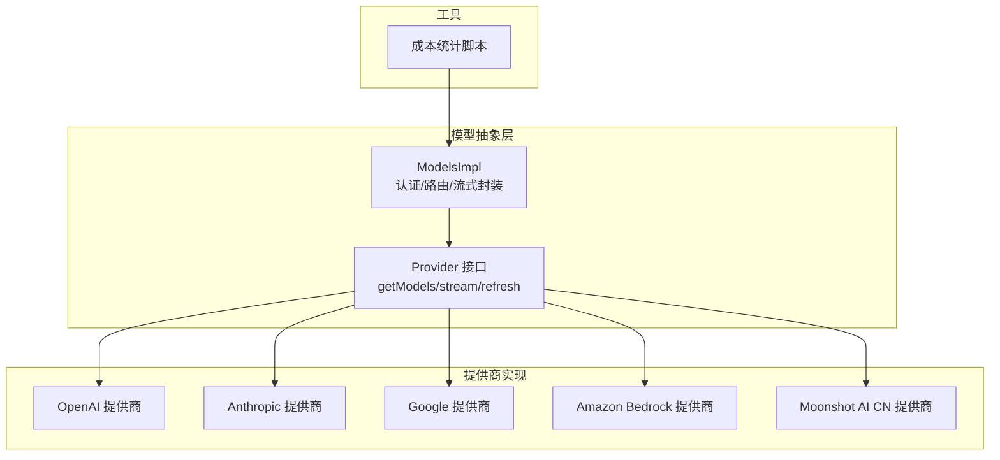
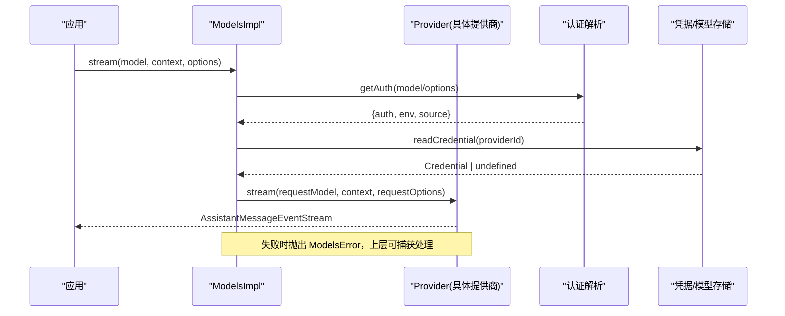
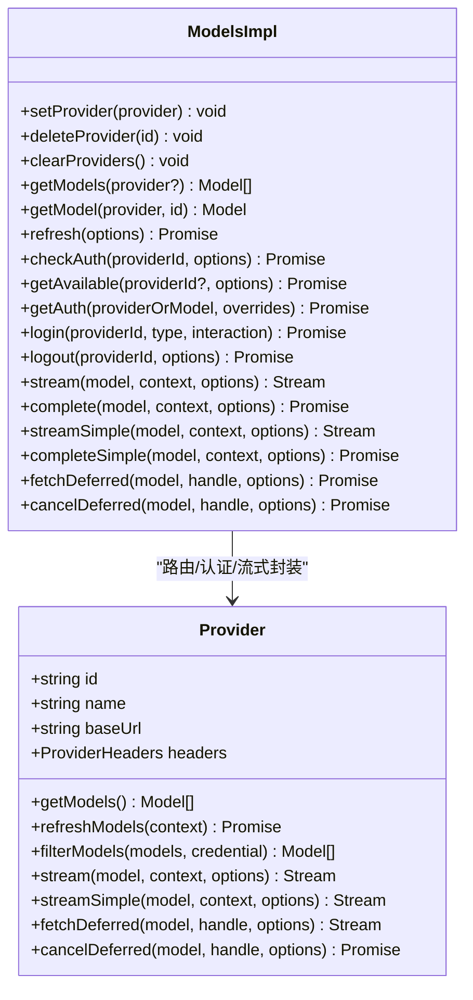
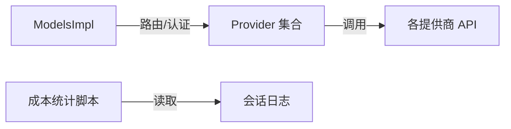

# 文本模型管理

<cite>
**本文引用的文件**
- [models.ts](file://packages/ai/src/models.ts)
- [openai.ts](file://packages/ai/src/providers/openai.ts)
- [anthropic.ts](file://packages/ai/src/providers/anthropic.ts)
- [google.ts](file://packages/ai/src/providers/google.ts)
- [amazon-bedrock.ts](file://packages/ai/src/providers/amazon-bedrock.ts)
- [moonshotai-cn.ts](file://packages/ai/src/providers/moonshotai-cn.ts)
- [cost.ts](file://scripts/cost.ts)
</cite>

## 目录
1. [简介](#简介)
2. [项目结构](#项目结构)
3. [核心组件](#核心组件)
4. [架构总览](#架构总览)
5. [详细组件分析](#详细组件分析)
6. [依赖关系分析](#依赖关系分析)
7. [性能与成本](#性能与成本)
8. [故障排查指南](#故障排查指南)
9. [结论](#结论)
10. [附录](#附录)

## 简介
本文件面向“文本模型管理”能力，系统性说明如何统一接入与管理多种文本模型提供商（如 OpenAI、Anthropic、Google、AWS Bedrock 等），涵盖：
- 支持的提供商与模型注册方式
- 模型能力描述与参数配置
- 模型选择策略（按任务类型自动匹配）
- 价格计算与成本跟踪机制
- 模型版本管理与向后兼容
- 自定义文本模型的注册与使用
- 模型使用统计与分析

该文档基于仓库中的模型抽象层与各提供商实现进行梳理，帮助读者在不深入源码的情况下理解整体设计与使用方法。

## 项目结构
代码库围绕统一的“模型抽象层 + 多提供商适配”的组织方式构建：
- 模型抽象层：定义 Provider、Model、Models 等核心接口与实现，负责认证、流式调用、刷新模型列表、可用模型过滤等。
- 提供商实现：每个提供商一个模块，声明 id/name/baseUrl/auth/models/api，并通过 createProvider 组装为 Provider。
- 工具脚本：提供成本统计与分析脚本，用于从会话日志中汇总各提供商的用量与费用。

图表来源
- [models.ts:254-737](file://packages/ai/src/models.ts#L254-L737)
- [openai.ts:1-16](file://packages/ai/src/providers/openai.ts#L1-L16)
- [anthropic.ts:1-60](file://packages/ai/src/providers/anthropic.ts#L1-L60)
- [google.ts:1-16](file://packages/ai/src/providers/google.ts#L1-L16)
- [amazon-bedrock.ts:1-91](file://packages/ai/src/providers/amazon-bedrock.ts#L1-L91)
- [moonshotai-cn.ts:1-15](file://packages/ai/src/providers/moonshotai-cn.ts#L1-L15)
- [cost.ts:1-184](file://scripts/cost.ts#L1-L184)

章节来源
- [models.ts:254-737](file://packages/ai/src/models.ts#L254-L737)
- [openai.ts:1-16](file://packages/ai/src/providers/openai.ts#L1-L16)
- [anthropic.ts:1-60](file://packages/ai/src/providers/anthropic.ts#L1-L60)
- [google.ts:1-16](file://packages/ai/src/providers/google.ts#L1-L16)
- [amazon-bedrock.ts:1-91](file://packages/ai/src/providers/amazon-bedrock.ts#L1-L91)
- [moonshotai-cn.ts:1-15](file://packages/ai/src/providers/moonshotai-cn.ts#L1-L15)
- [cost.ts:1-184](file://scripts/cost.ts#L1-L184)

## 核心组件
- Provider（提供商）
  - 标识与元数据：id、name、baseUrl、headers
  - 认证：apiKey/oauth，支持登录、解析、检查
  - 模型清单：getModels() 同步返回已知模型；refreshModels() 动态刷新并持久化
  - 流式接口：stream/streamSimple/fetchDeferred/cancelDeferred
- Models（模型集合）
  - 注册/删除/清空提供商
  - 获取模型、刷新模型、检查认证、获取可用模型
  - 统一流式/完成调用入口，内部完成鉴权、请求头合并、环境注入、转发到具体 Provider
- createProvider（提供商工厂）
  - 将 id/name/baseUrl/auth/models/api 组合成 Provider
  - 支持静态模型清单与动态覆盖，按 model.api 分发到不同 API 实现

章节来源
- [models.ts:88-149](file://packages/ai/src/models.ts#L88-L149)
- [models.ts:156-230](file://packages/ai/src/models.ts#L156-L230)
- [models.ts:739-800](file://packages/ai/src/models.ts#L739-L800)

## 架构总览
下图展示了从应用侧调用到具体提供商的完整流程，包括认证解析、请求头合并、流式响应与错误处理。

图表来源
- [models.ts:667-688](file://packages/ai/src/models.ts#L667-L688)
- [models.ts:544-563](file://packages/ai/src/models.ts#L544-L563)
- [models.ts:477-483](file://packages/ai/src/models.ts#L477-L483)

## 详细组件分析

### 提供商与模型注册
- OpenAI
  - 通过 createProvider 注册，指定 id/name/baseUrl/auth/models/api
  - 使用 openAIResponsesApi 作为底层 API 实现
- Anthropic
  - 支持 API Key 与 OAuth（Claude Pro/Max）
  - 自定义 apiKey 解析逻辑，优先读取存储密钥或环境变量
- Google
  - 使用 Gemini API Key 认证
  - 通过 googleGenerativeAIApi 调用
- Amazon Bedrock
  - 支持 Bearer Token、AWS Profile、默认凭证链等多种方式
  - 通过 bedrockConverseStreamApi 调用
- Moonshot AI CN
  - 复用 OpenAI Completions API 风格
  - 通过 openAICompletionsApi 调用

图表来源
- [models.ts:88-149](file://packages/ai/src/models.ts#L88-L149)
- [models.ts:254-737](file://packages/ai/src/models.ts#L254-L737)

章节来源
- [openai.ts:1-16](file://packages/ai/src/providers/openai.ts#L1-L16)
- [anthropic.ts:1-60](file://packages/ai/src/providers/anthropic.ts#L1-L60)
- [google.ts:1-16](file://packages/ai/src/providers/google.ts#L1-L16)
- [amazon-bedrock.ts:1-91](file://packages/ai/src/providers/amazon-bedrock.ts#L1-L91)
- [moonshotai-cn.ts:1-15](file://packages/ai/src/providers/moonshotai-cn.ts#L1-L15)
- [models.ts:739-800](file://packages/ai/src/models.ts#L739-L800)

### 模型能力描述与参数配置
- 模型清单由提供商维护，包含基础信息与能力标签（例如支持的 API 类型）。可通过 getModels() 获取，或通过 refreshModels() 动态更新并持久化。
- 请求参数在 Models.applyAuth 阶段合并：
  - 认证信息（apiKey、headers、env）
  - 可选的 per-request transformHeaders
  - baseUrl 可由 auth 结果覆盖
- 流式接口支持延迟执行与取消，便于长任务控制与资源回收。

章节来源
- [models.ts:636-665](file://packages/ai/src/models.ts#L636-L665)
- [models.ts:338-384](file://packages/ai/src/models.ts#L338-L384)

### 模型选择策略（按任务类型自动匹配）
- 可用模型筛选：getAvailable() 会先校验提供商认证状态，再调用 provider.filterModels() 按凭据过滤可用模型。
- 任务类型匹配建议：
  - 根据模型清单中的能力标签（如是否支持特定 API、思考级别、图像/编码等）选择合适模型。
  - 结合业务需求（速度、质量、成本）在可用模型中排序选择。
- 动态刷新：refresh() 支持并发刷新多个提供商的模型列表，并在失败时记录错误而不中断其他刷新。

章节来源
- [models.ts:522-542](file://packages/ai/src/models.ts#L522-L542)
- [models.ts:386-446](file://packages/ai/src/models.ts#L386-L446)

### 价格计算与成本跟踪机制
- 会话级用量与成本：助手消息中包含 usage.cost 字段，包含 total/input/output/cacheRead/cacheWrite 等细分项。
- 成本统计脚本：
  - 扫描本地会话目录，按天聚合各提供商的请求数与费用
  - 输出每日明细与总计，便于成本分析与优化
- 集成建议：
  - 在应用层记录每次调用的 usage 与 cost，以便后续审计与预算控制
  - 结合 filterModels 与模型定价策略，选择性价比最优模型

章节来源
- [cost.ts:69-123](file://scripts/cost.ts#L69-L123)
- [cost.ts:140-184](file://scripts/cost.ts#L140-L184)

### 模型版本管理与向后兼容性
- 模型清单持久化：refreshModels() 可将最新模型清单写入存储，并提供 update() 回调以同步内存状态。
- 向后兼容：
  - 动态模型覆盖静态清单，新增/更新模型不会破坏已有调用
  - 若某模型不再可用，可通过 filterModels 或移除清单避免误用
- 刷新控制：
  - refresh() 支持 allowNetwork 与 force 选项，便于离线初始化与强制刷新
  - 并发刷新与 AbortSignal 保证操作可取消与幂等

章节来源
- [models.ts:338-384](file://packages/ai/src/models.ts#L338-L384)
- [models.ts:386-446](file://packages/ai/src/models.ts#L386-L446)

### 自定义文本模型的注册与使用
- 注册步骤：
  - 创建 Provider：使用 createProvider 定义 id/name/baseUrl/auth/models/api
  - 将 Provider 加入 Models：通过 setProvider 注册
  - 如需动态模型：实现 refreshModels 并返回 ModelsPublication 以持久化
- 使用步骤：
  - 通过 getModels/getModel 获取模型
  - 调用 stream/complete 发起请求，或在需要时启用 transformHeaders 定制请求头
- 示例参考：
  - OpenAI、Anthropic、Google、Bedrock、Moonshot AI CN 均遵循相同模式

章节来源
- [models.ts:739-800](file://packages/ai/src/models.ts#L739-L800)
- [openai.ts:1-16](file://packages/ai/src/providers/openai.ts#L1-L16)
- [anthropic.ts:1-60](file://packages/ai/src/providers/anthropic.ts#L1-L60)
- [google.ts:1-16](file://packages/ai/src/providers/google.ts#L1-L16)
- [amazon-bedrock.ts:1-91](file://packages/ai/src/providers/amazon-bedrock.ts#L1-L91)
- [moonshotai-cn.ts:1-15](file://packages/ai/src/providers/moonshotai-cn.ts#L1-L15)

### 模型使用统计与分析功能
- 会话日志：每条助手消息包含 provider、usage.cost 等字段，可用于统计
- 成本脚本：
  - 按天聚合各提供商的请求数与费用
  - 输出每日明细与总计，支持最近 N 天的查询
- 分析建议：
  - 结合业务指标（成功率、延迟、成本）评估模型表现
  - 定期导出报表，识别高成本场景与优化机会

章节来源
- [cost.ts:69-123](file://scripts/cost.ts#L69-L123)
- [cost.ts:140-184](file://scripts/cost.ts#L140-L184)

## 依赖关系分析
- 模型抽象层对提供商解耦：所有调用通过 Provider 接口，便于替换与扩展
- 认证与环境注入：ModelsImpl 统一处理，屏蔽差异
- 流式接口：Provider 负责实际网络 I/O，ModelsImpl 负责生命周期与错误传播
- 成本统计：独立脚本，依赖会话日志格式，不耦合运行时

图表来源
- [models.ts:254-737](file://packages/ai/src/models.ts#L254-L737)
- [cost.ts:69-123](file://scripts/cost.ts#L69-L123)

章节来源
- [models.ts:254-737](file://packages/ai/src/models.ts#L254-L737)
- [cost.ts:69-123](file://scripts/cost.ts#L69-L123)

## 性能与成本
- 性能
  - 流式响应降低首字节延迟，适合交互场景
  - 并发刷新与 AbortSignal 提升可靠性与可控性
- 成本
  - 通过 usage.cost 细粒度统计输入/输出/缓存读写成本
  - 结合模型选择策略与批量/缓存优化降低成本
- 监控
  - 定期运行成本脚本，生成日报/周报
  - 结合业务指标建立告警阈值

[本节为通用指导，无需特定文件引用]

## 故障排查指南
- 认证失败
  - 检查提供商是否已配置（getAuth/checkAuth）
  - 确认环境变量或存储凭据正确
  - 对于 OAuth，确保令牌有效或刷新成功
- 模型不可用
  - 使用 getAvailable 获取已认证且可用的模型
  - 检查 provider.filterModels 是否过滤了目标模型
- 刷新异常
  - refresh() 返回 errors Map，定位具体提供商错误
  - 使用 allowNetwork=false 进行离线初始化，再逐步恢复网络
- 成本统计无数据
  - 确认会话目录存在且包含 .jsonl 文件
  - 检查 entry.message.usage.cost 是否存在

章节来源
- [models.ts:511-542](file://packages/ai/src/models.ts#L511-L542)
- [models.ts:386-446](file://packages/ai/src/models.ts#L386-L446)
- [cost.ts:69-123](file://scripts/cost.ts#L69-L123)

## 结论
本系统通过统一的模型抽象层与多提供商适配，实现了文本模型的集中管理、灵活选择与成本可控。借助认证解析、流式调用、动态刷新与成本统计，开发者可以快速集成多家提供商，并根据任务类型与成本约束选择最优模型。未来可进一步扩展模型能力标签、引入更精细的计费策略与自动化选型算法。

[本节为总结性内容，无需特定文件引用]

## 附录
- 快速上手
  - 注册提供商：createProvider + setProvider
  - 获取可用模型：getAvailable
  - 发起调用：stream/complete
  - 统计成本：运行 cost.ts 脚本
- 最佳实践
  - 使用 filterModels 按凭据与任务类型筛选模型
  - 利用 refresh() 保持模型清单最新
  - 结合 usage.cost 进行成本优化与预算控制

[本节为补充说明，无需特定文件引用]