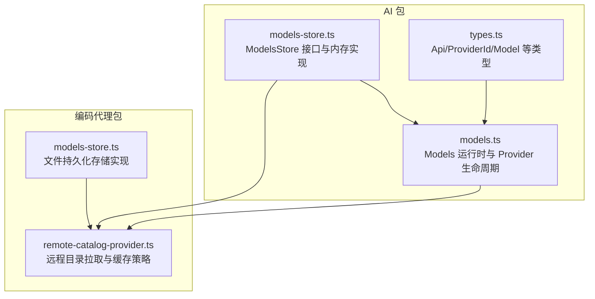
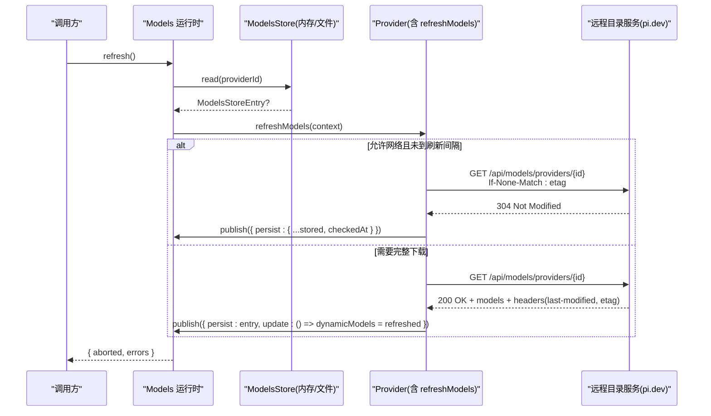
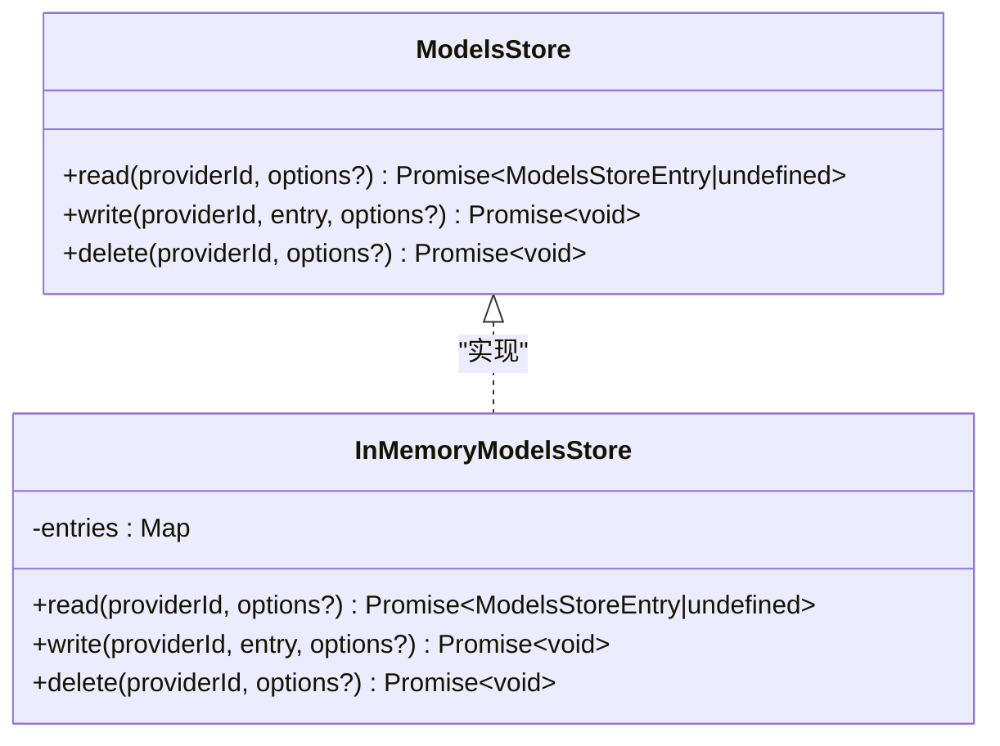
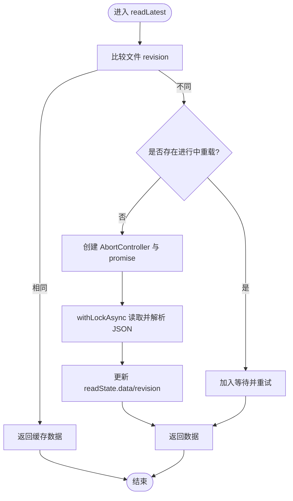
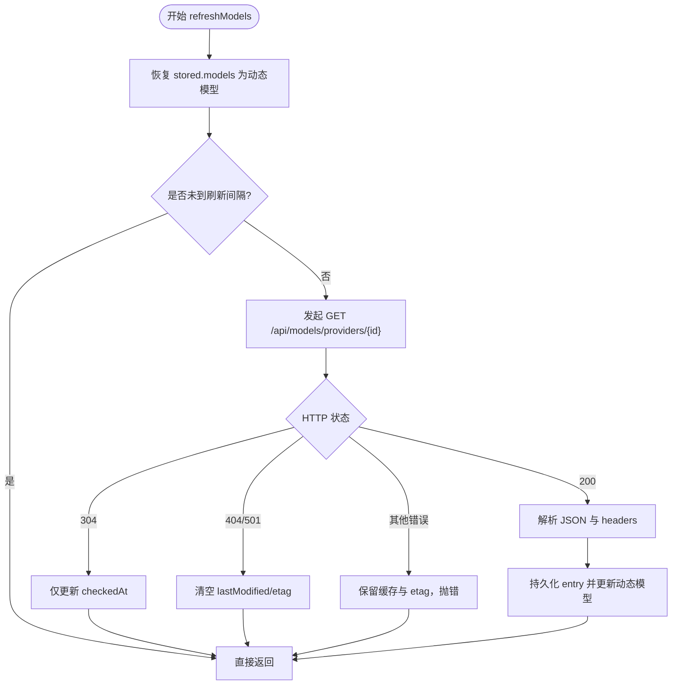
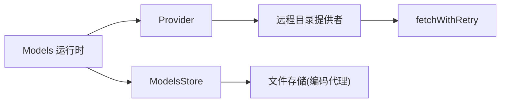

# 模型发现机制

<cite>
**本文引用的文件**
- [models-store.ts](file://packages/ai/src/models-store.ts)
- [models.ts](file://packages/ai/src/models.ts)
- [remote-catalog-provider.ts](file://packages/coding-agent/src/core/remote-catalog-provider.ts)
- [types.ts](file://packages/ai/src/types.ts)
- [models-store.ts（编码代理）](file://packages/coding-agent/src/core/models-store.ts)
</cite>

## 目录
1. [简介](#简介)
2. [项目结构](#项目结构)
3. [核心组件](#核心组件)
4. [架构总览](#架构总览)
5. [详细组件分析](#详细组件分析)
6. [依赖关系分析](#依赖关系分析)
7. [性能考虑](#性能考虑)
8. [故障排查指南](#故障排查指南)
9. [结论](#结论)
10. [附录](#附录)

## 简介
本文件系统性阐述模型发现机制，覆盖远程模型目录的获取与缓存策略、ModelsStore 接口及其内存实现、模型元数据结构、版本控制与更新检测、自定义存储后端扩展、错误处理与重试逻辑，以及同步最佳实践与性能优化建议。目标是帮助读者在不深入源码的情况下理解并正确使用该机制。

## 项目结构
围绕模型发现的关键代码分布在以下位置：
- AI 包提供 ModelsStore 接口与 InMemoryModelsStore 实现，以及 Models 运行时编排能力
- 编码代理包提供基于文件的持久化存储实现与远程目录提供者封装
- 类型定义集中管理 Api、ProviderId、Model 等基础类型

图表来源
- [models-store.ts:1-46](file://packages/ai/src/models-store.ts#L1-L46)
- [models.ts:254-446](file://packages/ai/src/models.ts#L254-L446)
- [remote-catalog-provider.ts:1-133](file://packages/coding-agent/src/core/remote-catalog-provider.ts#L1-L133)
- [types.ts:17-76](file://packages/ai/src/types.ts#L17-L76)
- [models-store.ts（编码代理）:25-147](file://packages/coding-agent/src/core/models-store.ts#L25-L147)

章节来源
- [models-store.ts:1-46](file://packages/ai/src/models-store.ts#L1-L46)
- [models.ts:254-446](file://packages/ai/src/models.ts#L254-L446)
- [remote-catalog-provider.ts:1-133](file://packages/coding-agent/src/core/remote-catalog-provider.ts#L1-L133)
- [types.ts:17-76](file://packages/ai/src/types.ts#L17-L76)
- [models-store.ts（编码代理）:25-147](file://packages/coding-agent/src/core/models-store.ts#L25-L147)

## 核心组件
- ModelsStore 接口与 InMemoryModelsStore：定义跨实现的统一读写删除契约，并提供进程内内存实现，支持 AbortSignal 中断与结构化克隆隔离
- Models 运行时：负责 Provider 注册、并发刷新、认证解析、发布持久化与状态同步
- 远程目录提供者：封装从 pi.dev 拉取模型目录，使用 Last-Modified 与 ETag 进行条件请求与增量更新
- 文件型 ModelsStore：为编码代理提供带锁的文件 JSON 存储，支持并发读合并与写时原子更新
- 类型系统：Api、ProviderId、Model 等类型约束模型与 API 的匹配关系

章节来源
- [models-store.ts:1-46](file://packages/ai/src/models-store.ts#L1-L46)
- [models.ts:254-446](file://packages/ai/src/models.ts#L254-L446)
- [remote-catalog-provider.ts:1-133](file://packages/coding-agent/src/core/remote-catalog-provider.ts#L1-L133)
- [models-store.ts（编码代理）:25-147](file://packages/coding-agent/src/core/models-store.ts#L25-L147)
- [types.ts:17-76](file://packages/ai/src/types.ts#L17-L76)

## 架构总览
模型发现的整体流程如下：
- 启动或触发刷新时，Models 读取已持久化的 ModelsStoreEntry
- 若允许网络且满足刷新间隔，则调用 Provider.refreshModels
- 远程目录提供者根据 stored.etag 发送 If-None-Match；服务器返回 304 时仅更新 checkedAt
- 成功下载后解析模型列表，计算 lastModified 与 etag，并通过 context.publish 持久化并同步内存动态模型
- 失败时保留缓存与校验器，避免空目录暴露给上层

图表来源
- [models.ts:386-446](file://packages/ai/src/models.ts#L386-L446)
- [remote-catalog-provider.ts:55-130](file://packages/coding-agent/src/core/remote-catalog-provider.ts#L55-L130)
- [models-store.ts:20-45](file://packages/ai/src/models-store.ts#L20-L45)

## 详细组件分析

### ModelsStore 接口与内存实现
- 接口职责
  - read/write/delete 以 providerId 为键存取 ModelsStoreEntry
  - 支持可选 AbortSignal，便于取消长时间操作
- 内存实现特性
  - 使用 Map 存储条目，read/write 均返回结构化克隆副本，避免外部修改影响内部状态
  - 所有方法在开始前检查信号是否已中止

图表来源
- [models-store.ts:20-45](file://packages/ai/src/models-store.ts#L20-L45)

章节来源
- [models-store.ts:1-46](file://packages/ai/src/models-store.ts#L1-L46)

### 文件型 ModelsStore（编码代理）
- 设计目标
  - 将模型目录缓存落盘为 JSON，支持多进程/多线程并发访问
- 关键机制
  - 通过带锁的存储后端 withLockAsync 保证写入原子性
  - 读路径维护共享 readState，按文件 revision 判断是否需要重新加载
  - 并发读时复用同一 reload promise，完成后清理控制器与引用
  - 写/删后即时更新内存中的 readState，减少下次 IO

图表来源
- [models-store.ts（编码代理）:61-117](file://packages/coding-agent/src/core/models-store.ts#L61-L117)

章节来源
- [models-store.ts（编码代理）:25-147](file://packages/coding-agent/src/core/models-store.ts#L25-L147)

### 远程目录提供者与缓存策略
- 缓存字段
  - models：当前生效的动态模型列表
  - lastModified：来自响应头 Last-Modified 的时间戳
  - checkedAt：最近一次完成检查的时间戳
  - etag：来自响应头 ETag 的原始值，用于下一次 If-None-Match
- 刷新策略
  - 首次恢复：将 stored.models 作为动态模型注入 getModels
  - 刷新节流：若 stored.checkedAt 与 stored.lastModified 存在且距现在小于固定间隔，则跳过网络请求
  - 条件请求：当 stored.models 非空时使用 stored.etag 作为 validator
  - 304 未修改：仅更新 checkedAt，保持现有动态模型不变
  - 404/501：清空 lastModified 与 etag，保留已有 models
  - 其他错误：保留 cached body 与 etag，抛出错误由上层处理
  - 成功下载：解析模型列表，计算 lastModified 与 etag，持久化并更新动态模型

图表来源
- [remote-catalog-provider.ts:55-130](file://packages/coding-agent/src/core/remote-catalog-provider.ts#L55-L130)

章节来源
- [remote-catalog-provider.ts:1-133](file://packages/coding-agent/src/core/remote-catalog-provider.ts#L1-L133)

### 模型元数据结构与类型
- Api：已知 API 集合与字符串扩展，用于区分不同协议（如 openai-completions、anthropic-messages 等）
- ProviderId：已知提供商 ID 与字符串扩展
- Model：每个模型包含 id、provider、api 等标识信息，具体字段由各 API 适配器约定
- ModelsStoreEntry：保存 models、lastModified、checkedAt、etag，用于版本控制与条件请求

章节来源
- [types.ts:17-76](file://packages/ai/src/types.ts#L17-L76)
- [models-store.ts:3-14](file://packages/ai/src/models-store.ts#L3-L14)

### 版本控制与更新检测机制
- 本地生成时间优先：当本地生成的模型列表晚于远端 lastModified 时，不应用远端覆盖
- 刷新间隔：通过 checkedAt 与 lastModified 共同决定是否需要网络校验
- 条件请求：使用 stored.etag 作为 If-None-Match，服务端返回 304 时仅推进 checkedAt
- 失效处理：404/501 时清除 lastModified 与 etag，防止后续误用旧校验器

章节来源
- [remote-catalog-provider.ts:33-42](file://packages/coding-agent/src/core/remote-catalog-provider.ts#L33-L42)
- [remote-catalog-provider.ts:68-112](file://packages/coding-agent/src/core/remote-catalog-provider.ts#L68-L112)

### 自定义模型存储后端扩展
- 实现 ModelsStore 接口即可替换默认存储
- 推荐要点
  - 线程/进程安全：确保并发读写一致性（参考文件实现的 withLockAsync 模式）
  - 信号支持：在 read/write/delete 中检查 AbortSignal，及时中止
  - 数据隔离：对外返回结构化克隆，避免外部修改影响内部状态
  - 幂等与容错：写操作失败应回滚或保持一致性；读操作可降级到缓存
- 集成方式
  - 在创建 Models 实例时传入自定义 modelsStore
  - 在 Provider 的 refreshModels 中通过 context.publish 持久化 ModelsStoreEntry

章节来源
- [models.ts:232-236](file://packages/ai/src/models.ts#L232-L236)
- [models-store.ts:20-45](file://packages/ai/src/models-store.ts#L20-L45)

### 错误处理与重试逻辑
- 刷新阶段
  - 并发刷新多个 Provider，单个 Provider 的错误被收集到结果 errors 中，不会中断整体刷新
  - 网络层使用 fetchWithRetry 进行重试（由远程目录提供者调用）
- 认证阶段
  - OAuth 过期自动刷新；API Key 解析失败会抛出 ModelsError
- 目录请求
  - 304：视为成功，仅更新 checkedAt
  - 404/501：清空 lastModified/etag，保留 models
  - 其他错误：保留缓存与 etag，抛出错误供上层重试或降级
- 取消与中断
  - 所有 I/O 与长耗时操作均支持 AbortSignal，避免资源泄漏

章节来源
- [models.ts:386-446](file://packages/ai/src/models.ts#L386-L446)
- [remote-catalog-provider.ts:81-112](file://packages/coding-agent/src/core/remote-catalog-provider.ts#L81-L112)

## 依赖关系分析
- Models 运行时依赖
  - ModelsStore：持久化模型目录与校验信息
  - Provider：声明式模型列表与刷新策略
  - 认证上下文：解析与刷新凭据
- 远程目录提供者依赖
  - fetchWithRetry：网络重试
  - getPiUserAgent：设置用户代理
  - VERSION：构建版本号
- 文件存储依赖
  - FileAuthStorageBackend：带锁的底层存储
  - 路径工具：规范化路径与文件修订号

图表来源
- [models.ts:254-446](file://packages/ai/src/models.ts#L254-L446)
- [remote-catalog-provider.ts:1-133](file://packages/coding-agent/src/core/remote-catalog-provider.ts#L1-L133)
- [models-store.ts（编码代理）:45-147](file://packages/coding-agent/src/core/models-store.ts#L45-L147)

章节来源
- [models.ts:254-446](file://packages/ai/src/models.ts#L254-L446)
- [remote-catalog-provider.ts:1-133](file://packages/coding-agent/src/core/remote-catalog-provider.ts#L1-L133)
- [models-store.ts（编码代理）:45-147](file://packages/coding-agent/src/core/models-store.ts#L45-L147)

## 性能考虑
- 刷新节流
  - 使用 REMOTE_CATALOG_REFRESH_INTERVAL_MS 限制频繁网络请求
  - 仅在 stored.models 非空时使用 etag 进行条件请求，降低带宽
- 并发与取消
  - 并发刷新多个 Provider，利用 AbortSignal 快速终止过时任务
  - 文件存储读路径合并并发请求，避免重复 IO
- 内存与序列化
  - 结构化克隆避免共享可变状态导致的竞态
  - 文件存储写时最小化变更范围，仅更新受影响 provider 条目
- 缓存命中
  - 304 场景下不重建动态模型，仅推进 checkedAt，减少 UI 重渲染

[本节为通用指导，无需特定文件来源]

## 故障排查指南
- 症状：模型列表不更新
  - 检查 stored.checkedAt 与 lastModified 是否满足刷新间隔
  - 确认是否传入了 force=true 强制刷新
  - 查看网络请求是否携带 If-None-Match，服务端是否返回 304
- 症状：模型列表为空
  - 检查 404/501 分支是否清除了 lastModified/etag
  - 确认本地生成的模型列表是否晚于远端 lastModified
- 症状：刷新失败但仍有旧模型
  - 这是预期行为：错误时保留缓存与 etag，等待下次重试
  - 检查上层是否正确处理 ModelsRefreshResult.errors
- 症状：并发写入冲突
  - 确认使用文件存储的 withLockAsync 进行写操作
  - 检查 readState 的 revision 是否一致

章节来源
- [remote-catalog-provider.ts:68-112](file://packages/coding-agent/src/core/remote-catalog-provider.ts#L68-L112)
- [models-store.ts（编码代理）:70-117](file://packages/coding-agent/src/core/models-store.ts#L70-L117)

## 结论
该模型发现机制通过统一的 ModelsStore 抽象、健壮的远程目录缓存策略（Last-Modified 与 ETag）、以及完善的并发与取消支持，实现了高效、可靠、可扩展的模型目录管理与更新。结合文件型存储与内存实现，既适合开发调试也适用于生产部署。遵循本文的最佳实践与故障排查建议，可在复杂环境中稳定运行。

[本节为总结性内容，无需特定文件来源]

## 附录
- 关键配置项
  - REMOTE_CATALOG_REFRESH_INTERVAL_MS：远程目录刷新间隔
  - DEFAULT_CATALOG_BASE_URL：远程目录基地址
- 最佳实践
  - 在生产环境启用文件型 ModelsStore，确保进程重启后仍可使用缓存
  - 合理设置 allowNetwork 与 force，平衡实时性与网络开销
  - 对 Provider 的 refreshModels 实现增加超时与重试保护
  - 监控 ModelsRefreshResult.errors，及时发现上游异常

[本节为补充说明，无需特定文件来源]