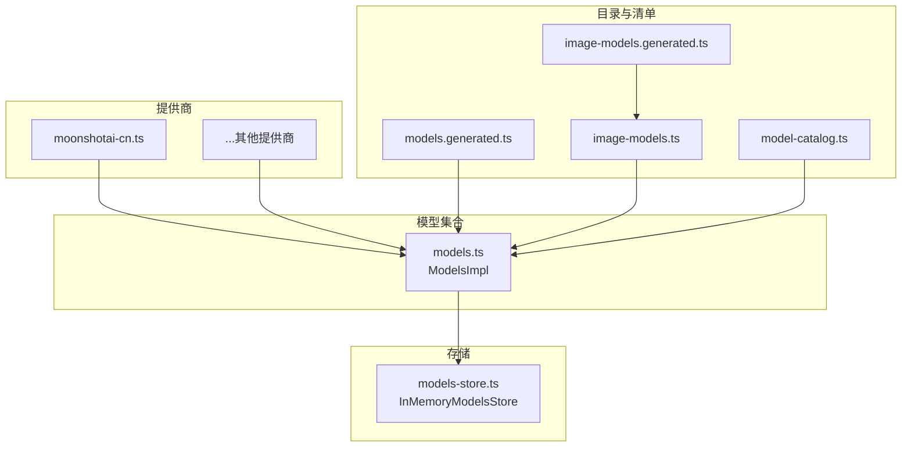
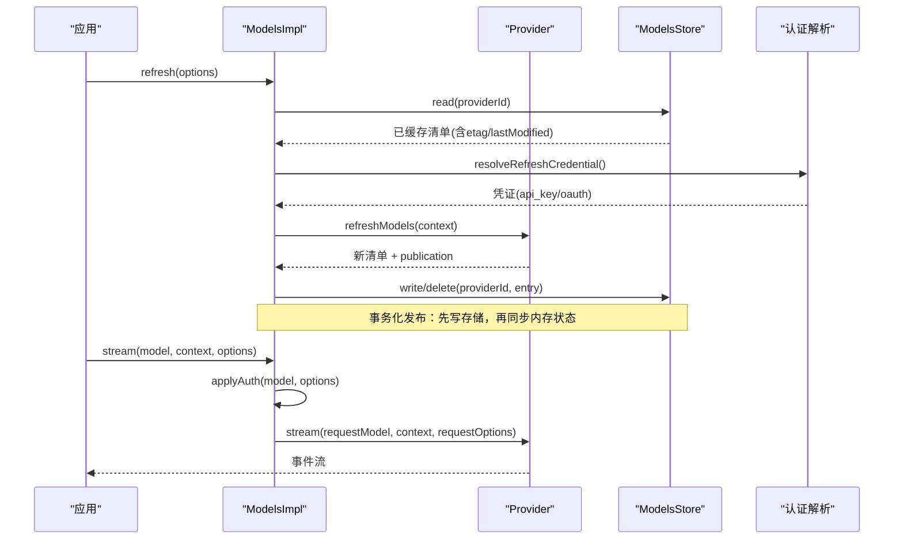
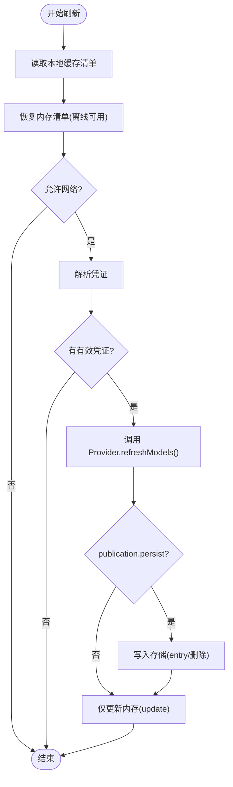
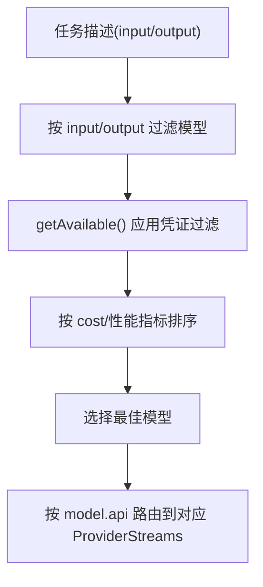
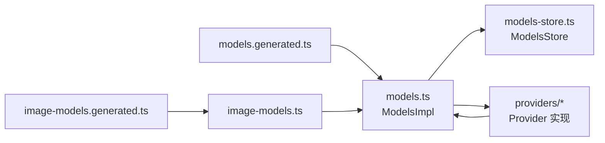

# 模型管理

<cite>
**本文引用的文件**
- [models.ts](file://packages/ai/src/models.ts)
- [models-store.ts](file://packages/ai/src/models-store.ts)
- [model-catalog.ts](file://packages/ai/src/model-catalog.ts)
- [image-models.ts](file://packages/ai/src/image-models.ts)
- [image-models.generated.ts](file://packages/ai/src/image-models.generated.ts)
- [models.generated.ts](file://packages/ai/src/models.generated.ts)
- [moonshotai-cn.ts](file://packages/ai/src/providers/moonshotai-cn.ts)
</cite>

## 目录
1. [简介](#简介)
2. [项目结构](#项目结构)
3. [核心组件](#核心组件)
4. [架构总览](#架构总览)
5. [详细组件分析](#详细组件分析)
6. [依赖关系分析](#依赖关系分析)
7. [性能考量](#性能考量)
8. [故障排查指南](#故障排查指南)
9. [结论](#结论)
10. [附录](#附录)

## 简介
本文件面向“模型管理”子系统，系统性说明以下能力：
- 模型发现与动态更新：如何从提供商获取并刷新可用模型列表。
- 文本与图像模型的分类管理：统一抽象、注册与查询。
- 模型元数据管理：能力描述、价格信息、性能指标等。
- 模型选择策略：按任务类型自动匹配模型。
- 模型缓存机制：提升加载与刷新性能。
- 版本管理与向后兼容：通过存储条目与过滤策略保障兼容性。
- 扩展方法：注册自定义提供商与模型。
- 使用统计与成本跟踪：基于模型成本字段进行用量与费用估算。

## 项目结构
该子系统位于 packages/ai/src 下，围绕 Provider/Models/Store 三层组织：
- 提供商层（Provider）：封装认证、模型清单、流式接口实现。
- 模型集合层（Models）：聚合多个 Provider，负责鉴权、刷新、分发请求。
- 存储层（ModelsStore）：持久化各 Provider 的模型清单与校验信息。
- 目录与生成文件：集中声明文本/图像模型清单，便于构建期生成与发布。

图表来源
- [models.ts:735-762](file://packages/ai/src/models.ts#L735-L762)
- [models-store.ts:20-45](file://packages/ai/src/models-store.ts#L20-L45)
- [models.generated.ts:44-124](file://packages/ai/src/models.generated.ts#L44-L124)
- [image-models.ts:1-43](file://packages/ai/src/image-models.ts#L1-L43)
- [image-models.generated.ts:1-200](file://packages/ai/src/image-models.generated.ts#L1-L200)

章节来源
- [models.ts:735-762](file://packages/ai/src/models.ts#L735-L762)
- [models-store.ts:20-45](file://packages/ai/src/models-store.ts#L20-L45)
- [models.generated.ts:44-124](file://packages/ai/src/models.generated.ts#L44-L124)
- [image-models.ts:1-43](file://packages/ai/src/image-models.ts#L1-L43)
- [image-models.generated.ts:1-200](file://packages/ai/src/image-models.generated.ts#L1-L200)

## 核心组件
- Provider：定义提供商标识、名称、基础地址、认证方式、模型清单、可选的动态刷新、模型过滤以及流式 API 实现。
- Models/MutableModels：聚合多个 Provider，提供统一的模型查询、鉴权解析、刷新、登录/登出、流式/非流式调用入口。
- ModelsStore：以 Provider 为键持久化模型清单及 ETag/Last-Modified 等校验信息；内置内存实现用于开发测试。
- 模型目录：集中声明文本与图像模型清单，支持按提供商分组与扁平化导出。

章节来源
- [models.ts:97-149](file://packages/ai/src/models.ts#L97-L149)
- [models.ts:156-230](file://packages/ai/src/models.ts#L156-L230)
- [models-store.ts:3-25](file://packages/ai/src/models-store.ts#L3-L25)
- [model-catalog.ts:3-27](file://packages/ai/src/model-catalog.ts#L3-L27)

## 架构总览
下图展示从应用侧到提供商的完整调用链，包括鉴权、刷新、缓存与分发。

图表来源
- [models.ts:386-446](file://packages/ai/src/models.ts#L386-L446)
- [models.ts:636-679](file://packages/ai/src/models.ts#L636-L679)
- [models-store.ts:20-45](file://packages/ai/src/models-store.ts#L20-L45)

## 详细组件分析

### 模型发现与动态更新
- 静态清单：Provider 在创建时提供 baseline models，getModels() 始终返回最新合并结果。
- 动态刷新：Provider 可选择实现 refreshModels(context)，由 Models.refresh() 并发触发。
- 缓存与一致性：
  - 首次离线恢复：读取 ModelsStore 中上次成功刷新的清单，立即恢复 UI 与运行态。
  - 网络访问：若允许网络，则解析凭证后再次拉取，并通过 publication 原子写入存储并更新内存。
  - 并发控制：每个 Provider 维护 generation 与 AbortController，避免重复刷新与竞态。
- 错误处理：刷新失败不会抛给调用方，而是收集到 errors Map 中返回。

图表来源
- [models.ts:367-446](file://packages/ai/src/models.ts#L367-L446)
- [models-store.ts:20-45](file://packages/ai/src/models-store.ts#L20-L45)

章节来源
- [models.ts:386-446](file://packages/ai/src/models.ts#L386-L446)
- [models-store.ts:20-45](file://packages/ai/src/models-store.ts#L20-L45)

### 文本模型与图像模型的分类管理
- 文本模型：通过 models.generated.ts 汇总各提供商的模型清单，配合 Provider 工厂（如 moonshotai-cn.ts）注入到 Models 中。
- 图像模型：通过 image-models.generated.ts 集中声明，image-models.ts 提供按提供商查询与枚举能力。
- 统一抽象：两者均遵循 Model/ImagesModel 类型约束，具备 id/name/provider/baseUrl/input/output/cost 等元数据。

章节来源
- [models.generated.ts:44-124](file://packages/ai/src/models.generated.ts#L44-L124)
- [image-models.generated.ts:1-200](file://packages/ai/src/image-models.generated.ts#L1-L200)
- [image-models.ts:1-43](file://packages/ai/src/image-models.ts#L1-L43)
- [moonshotai-cn.ts:1-15](file://packages/ai/src/providers/moonshotai-cn.ts#L1-L15)

### 模型元数据管理（能力、价格、性能）
- 能力描述：input/output 数组描述输入输出模态（如 text/image），api 字段指明使用的 API 协议。
- 价格信息：cost 字段包含 input/output/cacheRead/cacheWrite 单价，可用于成本估算。
- 性能指标：可通过 provider 或模型扩展字段承载（例如 thinking level、延迟预算等），并在选择策略中使用。
- 目录工具：model-catalog.ts 提供将分组模型扁平化为 typed catalog 的能力，便于类型安全消费。

章节来源
- [image-models.generated.ts:1-200](file://packages/ai/src/image-models.generated.ts#L1-L200)
- [model-catalog.ts:3-27](file://packages/ai/src/model-catalog.ts#L3-L27)

### 模型选择策略（按任务类型自动匹配）
- 输入/输出匹配：根据任务的 input/output 需求筛选候选模型。
- 能力过滤：利用 provider.filterModels(models, credential) 按凭证能力裁剪可用模型。
- 优先级与成本：结合 cost 与性能指标（如推理级别、延迟预算）排序，选择性价比最优模型。
- 多 API 路由：createProvider 支持按 model.api 分派不同 ProviderStreams，确保正确路由。

图表来源
- [models.ts:522-542](file://packages/ai/src/models.ts#L522-L542)
- [models.ts:775-792](file://packages/ai/src/models.ts#L775-L792)

章节来源
- [models.ts:522-542](file://packages/ai/src/models.ts#L522-L542)
- [models.ts:775-792](file://packages/ai/src/models.ts#L775-L792)

### 模型缓存机制（提升加载性能）
- 存储条目：ModelsStoreEntry 包含 models、lastModified、checkedAt、etag，支持条件请求与增量更新。
- 离线优先：刷新流程先恢复本地缓存，保证 UI 快速可用。
- 幂等发布：publication 链串行执行，确保写存储与内存更新的一致性。
- 并发安全：generation 与 AbortController 防止旧刷新覆盖新结果。

章节来源
- [models-store.ts:3-45](file://packages/ai/src/models-store.ts#L3-L45)
- [models.ts:338-365](file://packages/ai/src/models.ts#L338-L365)
- [models.ts:386-446](file://packages/ai/src/models.ts#L386-L446)

### 版本管理与向后兼容
- 版本标记：通过 lastModified/checkedAt/etag 追踪远程清单变更。
- 兼容策略：filterModels 可按凭证或环境裁剪模型，屏蔽不兼容项。
- 平滑回滚：当刷新失败时保留上次成功缓存，避免服务中断。

章节来源
- [models-store.ts:3-25](file://packages/ai/src/models-store.ts#L3-L25)
- [models.ts:130-134](file://packages/ai/src/models.ts#L130-L134)
- [models.ts:386-446](file://packages/ai/src/models.ts#L386-L446)

### 模型注册与自定义扩展
- 注册提供商：通过 createProvider 构造 Provider，注入 id/name/auth/models/api 等。
- 动态模型：提供 fetchModels(context) 实现动态清单拉取，并由 Models 统一管理刷新与发布。
- 图像模型扩展：在 image-models.generated.ts 中新增模型条目，或通过 registry 扩展查询。
- 示例参考：moonshotai-cn.ts 展示了最小可用的提供商注册方式。

章节来源
- [models.ts:735-762](file://packages/ai/src/models.ts#L735-L762)
- [moonshotai-cn.ts:1-15](file://packages/ai/src/providers/moonshotai-cn.ts#L1-L15)
- [image-models.ts:1-43](file://packages/ai/src/image-models.ts#L1-L43)

### 使用统计与成本跟踪
- 成本字段：模型 cost 包含输入/输出/缓存读写单价，可结合 Usage 计算单次调用成本。
- 统计建议：在调用链路中记录 token 数、图片尺寸、缓存命中情况，累计至成本中心。
- 优化方向：优先命中 cacheRead、选择更低 cost 的模型或更短上下文长度。

章节来源
- [image-models.generated.ts:1-200](file://packages/ai/src/image-models.generated.ts#L1-L200)

## 依赖关系分析
- ModelsImpl 依赖：
  - Provider：提供模型清单、流式实现、可选刷新。
  - ModelsStore：读写持久化清单。
  - 认证解析：resolveProviderAuth 与 credentials store。
- 目录与生成文件：
  - models.generated.ts 汇总文本模型清单。
  - image-models.generated.ts 汇总图像模型清单，image-models.ts 提供查询 API。
- 提供商实现：
  - 如 moonshotai-cn.ts 通过 createProvider 接入系统。

图表来源
- [models.ts:254-737](file://packages/ai/src/models.ts#L254-L737)
- [models-store.ts:20-45](file://packages/ai/src/models-store.ts#L20-L45)
- [models.generated.ts:44-124](file://packages/ai/src/models.generated.ts#L44-L124)
- [image-models.ts:1-43](file://packages/ai/src/image-models.ts#L1-L43)

章节来源
- [models.ts:254-737](file://packages/ai/src/models.ts#L254-L737)
- [models-store.ts:20-45](file://packages/ai/src/models-store.ts#L20-L45)
- [models.generated.ts:44-124](file://packages/ai/src/models.generated.ts#L44-L124)
- [image-models.ts:1-43](file://packages/ai/src/image-models.ts#L1-L43)

## 性能考量
- 并发刷新：refresh() 对多个 Provider 并行刷新，缩短整体等待时间。
- 离线优先：先恢复本地缓存，再尝试网络更新，降低首屏延迟。
- 串行发布：publication 链串行写存储与更新内存，避免竞争。
- 流式传输：stream/streamSimple/fetchDeferred 支持按需消费，减少内存占用。
- 缓存命中：利用 etag/lastModified 减少无效网络请求。

[本节为通用指导，无需特定文件引用]

## 故障排查指南
- 刷新失败：检查 refresh() 返回的 errors Map，定位具体 Provider 的错误原因。
- 认证问题：getAuth/checkAuth 抛出 ModelsError，常见于未配置密钥或 OAuth 刷新失败。
- 未知提供商：getModel/getProvider 返回 undefined 或抛出 provider 错误，确认是否已注册。
- 流式错误：若 Provider 未实现对应 API，会返回流错误，需检查 api 映射。

章节来源
- [models.ts:386-446](file://packages/ai/src/models.ts#L386-L446)
- [models.ts:511-520](file://packages/ai/src/models.ts#L511-L520)
- [models.ts:628-634](file://packages/ai/src/models.ts#L628-L634)
- [models.ts:775-792](file://packages/ai/src/models.ts#L775-L792)

## 结论
本模型管理系统以 Provider/Models/Store 为核心，实现了：
- 统一的模型发现与动态刷新机制，支持离线优先与并发更新。
- 文本与图像模型的分类管理与类型安全的目录组织。
- 完善的元数据与成本字段，支撑选择策略与成本跟踪。
- 可扩展的注册机制，便于引入自定义提供商与模型。
- 健壮的缓存与错误处理，保障稳定性与性能。

[本节为总结性内容，无需特定文件引用]

## 附录
- 关键接口速览：
  - Provider：id/name/auth/getModels/refreshModels/filterModels/stream 等。
  - Models：getProviders/getModels/getAvailable/refresh/stream/complete 等。
  - ModelsStore：read/write/delete 操作 ModelsStoreEntry。
- 常用模式：
  - 动态提供商：实现 refreshModels 并使用 publication 原子更新存储与内存。
  - 图像模型：通过 image-models.ts 的 getImageModels/getImageProviders 查询。
  - 成本估算：基于模型 cost 与 Usage 计算单次调用费用。

[本节为补充说明，无需特定文件引用]