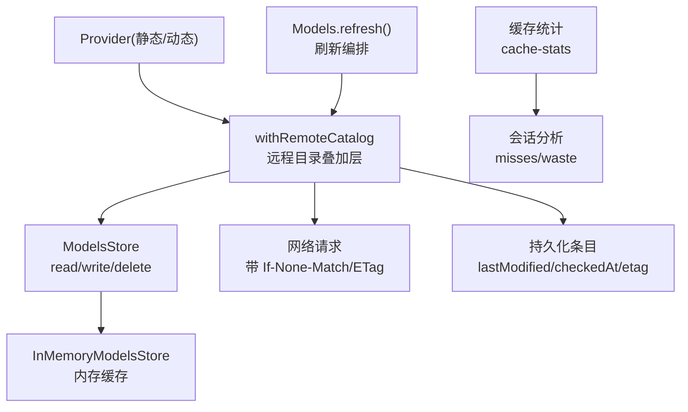
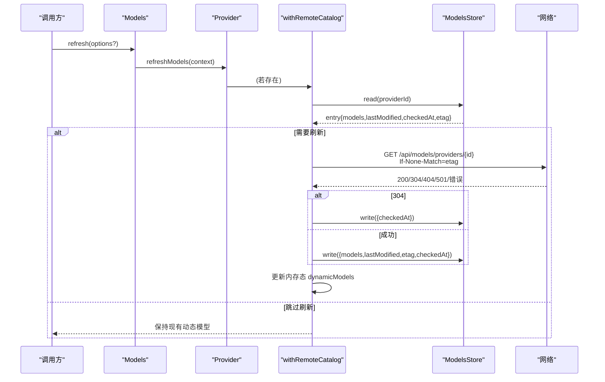
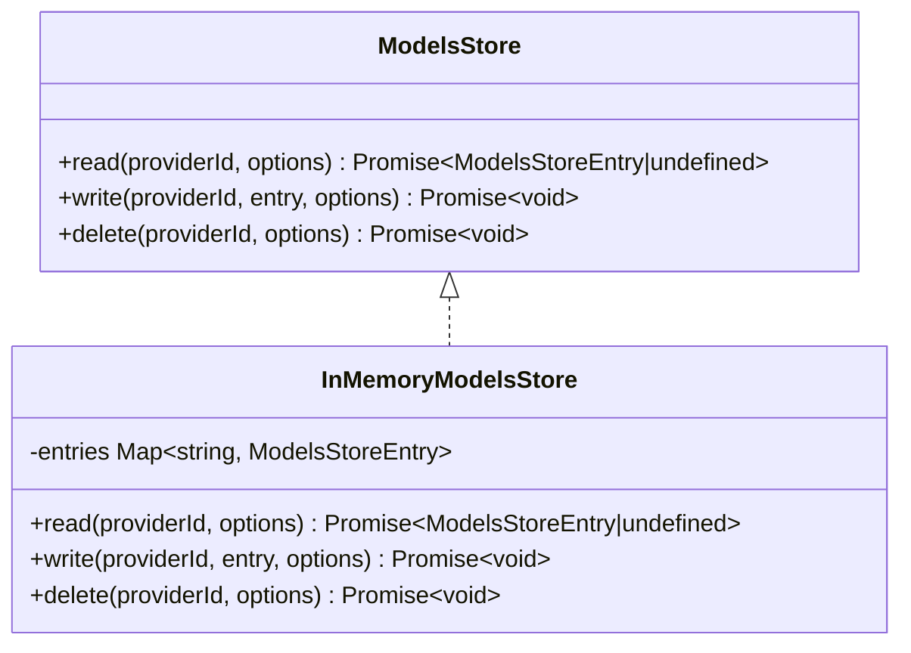
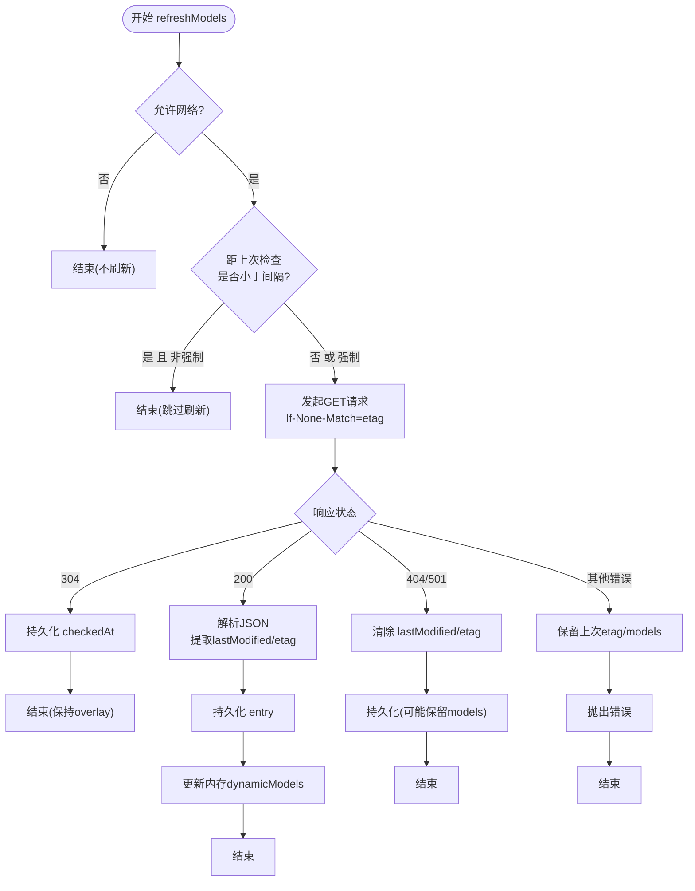
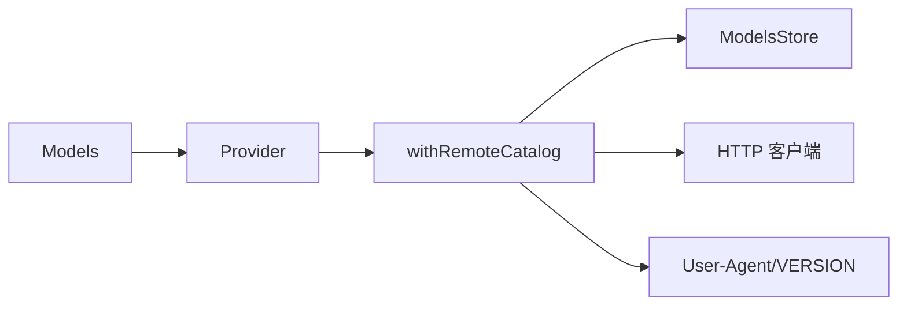

# 模型缓存机制

<cite>
**本文引用的文件**
- [packages/ai/src/models-store.ts](file://packages/ai/src/models-store.ts)
- [packages/coding-agent/src/core/remote-catalog-provider.ts](file://packages/coding-agent/src/core/remote-catalog-provider.ts)
- [packages/ai/src/models.ts](file://packages/ai/src/models.ts)
- [packages/ai/test/cache-retention.test.ts](file://packages/ai/test/cache-retention.test.ts)
- [packages/coding-agent/src/core/cache-stats.ts](file://packages/coding-agent/src/core/cache-stats.ts)
</cite>

## 目录
1. [简介](#简介)
2. [项目结构](#项目结构)
3. [核心组件](#核心组件)
4. [架构总览](#架构总览)
5. [详细组件分析](#详细组件分析)
6. [依赖关系分析](#依赖关系分析)
7. [性能考量](#性能考量)
8. [故障排查指南](#故障排查指南)
9. [结论](#结论)
10. [附录](#附录)

## 简介
本文件系统性说明“模型发现与元数据”的缓存机制，覆盖内存缓存、持久化存储、基于时间戳与 ETag 的更新检测、多实例一致性、预加载与懒加载策略、缓存大小限制与清理、监控与调试工具、自定义后端实现，以及对模型发现性能的影响和优化建议。内容严格基于仓库中已实现的接口与行为进行归纳与可视化。

## 项目结构
围绕模型缓存的关键代码分布在以下模块：
- 模型存储抽象与内存实现：定义 ModelsStore 接口与 InMemoryModelsStore，提供 read/write/delete 能力，并记录 lastModified、checkedAt、etag 等元信息。
- 远程目录提供者：将本地持久化的目录叠加到静态 Provider 上，负责按时间窗口与 ETag 校验刷新，并将结果持久化与同步到内存。
- 模型集合与刷新上下文：提供 refreshModels 的统一上下文（包含 stored、publish、allowNetwork、force、signal），协调认证、网络访问与发布。
- 缓存命中统计与浪费度量：用于会话级缓存命中率、浪费 token 与成本估算，辅助定位缓存失效原因。
- 缓存保留策略测试：验证不同环境配置下的缓存控制字段注入与 TTL 行为。

图表来源
- [packages/ai/src/models-store.ts:1-46](file://packages/ai/src/models-store.ts#L1-L46)
- [packages/coding-agent/src/core/remote-catalog-provider.ts:1-133](file://packages/coding-agent/src/core/remote-catalog-provider.ts#L1-L133)
- [packages/ai/src/models.ts:39-76](file://packages/ai/src/models.ts#L39-L76)

章节来源
- [packages/ai/src/models-store.ts:1-46](file://packages/ai/src/models-store.ts#L1-L46)
- [packages/coding-agent/src/core/remote-catalog-provider.ts:1-133](file://packages/coding-agent/src/core/remote-catalog-provider.ts#L1-L133)
- [packages/ai/src/models.ts:39-76](file://packages/ai/src/models.ts#L39-L76)

## 核心组件
- 模型存储接口与内存实现
  - 提供以 providerId 为键的条目读写删除，条目包含 models、lastModified、checkedAt、etag。
  - 内存实现在读/写时返回结构化克隆副本，避免外部修改污染内部状态。
- 远程目录叠加层
  - 将静态 Provider 的 getModels 与动态 models 合并；首次恢复 stored 中的 models 作为初始态。
  - 刷新流程：检查是否允许网络、是否在刷新间隔内、是否强制刷新；使用 ETag 做条件请求；处理 304/404/501/失败分支；解析响应并持久化，同时更新内存态。
- 刷新上下文与发布契约
  - refreshModels 通过 context.publish 原子地提交持久化与内存态更新；支持 AbortSignal 取消；allowNetwork 控制是否允许网络；force 跳过新鲜度检查。
- 缓存统计与浪费度量
  - 扫描会话消息，计算 missedTokens、missedCost、missCount，识别 idleMs、modelChanged 等维度，帮助定位缓存未命中原因。

章节来源
- [packages/ai/src/models-store.ts:1-46](file://packages/ai/src/models-store.ts#L1-L46)
- [packages/coding-agent/src/core/remote-catalog-provider.ts:1-133](file://packages/coding-agent/src/core/remote-catalog-provider.ts#L1-L133)
- [packages/ai/src/models.ts:39-76](file://packages/ai/src/models.ts#L39-L76)
- [packages/coding-agent/src/core/cache-stats.ts:1-165](file://packages/coding-agent/src/core/cache-stats.ts#L1-L165)

## 架构总览
下图展示了模型发现与缓存的整体协作：Provider 暴露静态模型列表；withRemoteCatalog 在其之上叠加动态目录；刷新由 Models.refresh 触发，读取持久化条目，必要时发起网络请求并使用 ETag 校验；成功后写入持久化并更新内存态；缓存统计在会话层对命中/浪费进行分析。

图表来源
- [packages/ai/src/models.ts:39-76](file://packages/ai/src/models.ts#L39-L76)
- [packages/coding-agent/src/core/remote-catalog-provider.ts:44-133](file://packages/coding-agent/src/core/remote-catalog-provider.ts#L44-L133)
- [packages/ai/src/models-store.ts:20-45](file://packages/ai/src/models-store.ts#L20-L45)

## 详细组件分析

### 组件A：模型存储（ModelsStore 与 InMemoryModelsStore）
- 职责
  - 以 providerId 为键维护模型目录条目，包含 models、lastModified、checkedAt、etag。
  - 提供 read/write/delete 操作，支持 AbortSignal 中断。
- 数据结构与复杂度
  - 内存 Map 存取 O(1)；读/写返回结构化克隆，保证隔离性。
- 依赖链
  - 被 withRemoteCatalog 用于持久化目录条目；被 Models 刷新流程调用。
- 优化点
  - 批量写入或合并更新可减少 IO；可引入 LRU/过期策略扩展。
- 错误处理
  - 支持 AbortSignal 抛出中止异常；上层需捕获并回退到旧缓存。

图表来源
- [packages/ai/src/models-store.ts:1-46](file://packages/ai/src/models-store.ts#L1-L46)

章节来源
- [packages/ai/src/models-store.ts:1-46](file://packages/ai/src/models-store.ts#L1-L46)

### 组件B：远程目录叠加层（withRemoteCatalog）
- 职责
  - 将静态 Provider 的模型列表与动态目录合并；首次从持久化恢复；按时间窗口与 ETag 刷新；处理 304/404/501/失败；持久化并更新内存态。
- 关键逻辑
  - 刷新节流：当 checkedAt 距今小于固定间隔且非强制刷新时跳过网络。
  - 条件请求：仅当存在有效 models 时才携带 etag 作为 If-None-Match，避免空覆盖。
  - 304 处理：仅更新 checkedAt，保持 overlay 不变。
  - 404/501：清空 lastModified 与 etag，保留 models 为空或已有值，防止后续误用。
  - 失败：保留上次 etag 与 models，下次继续重验证。
- 并发与一致性
  - 通过 context.publish 原子提交持久化与内存更新；AbortSignal 统一中断。
- 性能
  - 减少不必要下载；利用 304 降低带宽与 CPU；合并静态与动态列表 O(n)。

图表来源
- [packages/coding-agent/src/core/remote-catalog-provider.ts:44-133](file://packages/coding-agent/src/core/remote-catalog-provider.ts#L44-L133)

章节来源
- [packages/coding-agent/src/core/remote-catalog-provider.ts:44-133](file://packages/coding-agent/src/core/remote-catalog-provider.ts#L44-L133)

### 组件C：刷新上下文与发布（RefreshModelsContext 与 publish）
- 职责
  - 封装刷新所需上下文：stored 快照、publish 原子发布、allowNetwork/force/signal。
  - 确保持久化与内存态一致，避免竞态。
- 设计要点
  - 发布顺序：先持久化，再执行 update 回调，保证内存态始终与持久化一致。
  - 信号传播：所有阻塞操作监听 AbortSignal，及时释放资源。
- 与 Providers 的关系
  - 动态 Provider 实现 refreshModels，使用 context.publish 提交变更；静态 Provider 无需实现。

章节来源
- [packages/ai/src/models.ts:39-76](file://packages/ai/src/models.ts#L39-L76)

### 组件D：缓存保留策略与 TTL（Anthropic/OpenAI）
- 行为
  - 根据环境变量 PI_CACHE_RETENTION 与 baseUrl 决定系统提示的 cache_control 字段是否包含 ttl。
  - 当 supportsLongCacheRetention 为 false 或 cacheRetention 为 none 时，省略 TTL 或整个 cache_control。
- 影响
  - 控制远端侧缓存保留时长，间接影响本地目录是否需要频繁刷新（因为模型可用性/能力可能变化）。
- 验证
  - 测试用例覆盖了默认、long、代理场景与开关组合。

章节来源
- [packages/ai/test/cache-retention.test.ts:32-189](file://packages/ai/test/cache-retention.test.ts#L32-L189)

### 组件E：缓存命中统计与浪费度量（cache-stats）
- 指标
  - missedTokens、missedCost、missCount；idleMs、modelChanged。
  - 过滤噪声阈值（如 NOISE_FLOOR_TOKENS），避免误报。
- 用途
  - 会话重建时生成提示；定位缓存未命中根因（空闲过长、模型切换、provider 不支持缓存等）。
- 集成
  - 通过 ModelPriceSource 获取模型价格，估算浪费成本。

章节来源
- [packages/coding-agent/src/core/cache-stats.ts:1-165](file://packages/coding-agent/src/core/cache-stats.ts#L1-L165)

## 依赖关系分析
- 耦合关系
  - withRemoteCatalog 强依赖 ModelsStore 与网络能力；通过 RefreshModelsContext 解耦发布与刷新。
  - Models 聚合 Provider，协调刷新与可用模型查询。
- 外部依赖
  - HTTP 客户端（fetchWithRetry）、用户代理头、版本常量。
- 循环依赖
  - 未发现直接循环；刷新流程单向依赖存储与网络。

图表来源
- [packages/ai/src/models.ts:39-76](file://packages/ai/src/models.ts#L39-L76)
- [packages/coding-agent/src/core/remote-catalog-provider.ts:1-133](file://packages/coding-agent/src/core/remote-catalog-provider.ts#L1-L133)

章节来源
- [packages/ai/src/models.ts:39-76](file://packages/ai/src/models.ts#L39-L76)
- [packages/coding-agent/src/core/remote-catalog-provider.ts:1-133](file://packages/coding-agent/src/core/remote-catalog-provider.ts#L1-L133)

## 性能考量
- 预加载与懒加载
  - 懒加载：getModels 同步返回当前已知列表，避免启动阻塞；refreshModels 按需触发。
  - 预加载：可在应用启动阶段调用 refresh(force=true) 预热目录，减少首请求延迟。
- 刷新节流
  - 基于 checkedAt 与固定间隔避免频繁网络请求；304 快速路径最小化开销。
- 合并成本
  - 静态与动态模型合并为线性复杂度；应避免频繁全量刷新。
- 内存占用
  - 内存存储无上限；生产环境可扩展为带容量限制的 LRU 或分片存储。
- 网络优化
  - 仅在存在有效 models 时发送 If-None-Match；失败时保留 etag 以便下次重验证。

[本节为通用指导，不直接分析具体文件]

## 故障排查指南
- 常见问题
  - 目录长时间不更新：检查 allowNetwork、force、刷新间隔、网络连通性。
  - 动态模型丢失：确认 404/501 分支是否正确清空元数据；检查持久化是否被覆盖。
  - 重复下载：确认 ETag 是否被正确传递与保存；304 分支是否更新 checkedAt。
- 诊断手段
  - 使用缓存统计工具分析会话级 missedTokens、missedCost、idleMs、modelChanged。
  - 检查持久化条目中的 lastModified、checkedAt、etag 是否符合预期。
- 恢复步骤
  - 调用 refresh(force=true) 强制刷新；必要时 delete(providerId) 清理后重试。

章节来源
- [packages/coding-agent/src/core/cache-stats.ts:1-165](file://packages/coding-agent/src/core/cache-stats.ts#L1-L165)
- [packages/coding-agent/src/core/remote-catalog-provider.ts:44-133](file://packages/coding-agent/src/core/remote-catalog-provider.ts#L44-L133)
- [packages/ai/src/models-store.ts:1-46](file://packages/ai/src/models-store.ts#L1-L46)

## 结论
该缓存机制通过“内存缓存 + 持久化 + ETag/时间戳”的组合，实现了高效、可靠的模型目录管理。刷新流程具备幂等性与容错性，结合懒加载与预加载策略，显著降低模型发现的延迟与网络开销。配合缓存统计工具，可精准定位未命中原因并优化用户体验。

[本节为总结性内容，不直接分析具体文件]

## 附录

### 缓存失效与更新检测
- 基于时间戳
  - lastModified：来自远端的 Last-Modified，用于判断本地目录是否早于构建产物。
  - checkedAt：最近一次完成检查的时间，用于刷新节流。
- 基于 ETag
  - etag：原样保存并作为 If-None-Match 发送；304 时仅更新 checkedAt。
- 失效场景
  - 超过刷新间隔、强制刷新、lastModified 早于本地生成时间、远端返回 200。

章节来源
- [packages/ai/src/models-store.ts:1-46](file://packages/ai/src/models-store.ts#L1-L46)
- [packages/coding-agent/src/core/remote-catalog-provider.ts:44-133](file://packages/coding-agent/src/core/remote-catalog-provider.ts#L44-L133)

### 多实例一致性
- 单进程内
  - 内存 Map 天然共享；publish 保证持久化与内存一致。
- 多进程/多实例
  - 当前内存实现不具备跨进程同步；应替换为分布式存储（如 Redis/DB）并在各实例间广播失效事件或使用版本号/ETag 驱动的一致性协议。
- 建议
  - 使用带版本号的条目（如递增 version 或哈希）；订阅失效事件后主动刷新。

[本节为概念性指导，不直接分析具体文件]

### 缓存大小限制与清理策略
- 现状
  - InMemoryModelsStore 无内置容量限制。
- 建议
  - 增加 LRU/容量上限；按 providerId 分桶；定期清理久未使用的条目；支持按 lastModified/checkedAt 过期清理。
- 实现思路
  - 在 read/write 时检查容量，淘汰最久未使用条目；后台定时任务扫描过期条目。

[本节为概念性指导，不直接分析具体文件]

### 监控与调试工具
- 缓存统计
  - computeCacheWaste/collectCacheMisses/detectCacheMiss：输出 missedTokens、missedCost、missCount、idleMs、modelChanged。
- 日志与指标
  - 记录刷新耗时、网络状态码、ETag 命中情况、目录大小变化。
- 可视化
  - 将统计结果接入仪表盘，展示会话级缓存命中率与浪费趋势。

章节来源
- [packages/coding-agent/src/core/cache-stats.ts:1-165](file://packages/coding-agent/src/core/cache-stats.ts#L1-L165)

### 自定义缓存后端实现指南
- 步骤
  - 实现 ModelsStore 接口：read/write/delete，支持 AbortSignal。
  - 选择合适介质：文件系统、SQLite、Redis、KV 存储等。
  - 序列化策略：确保 ModelsStoreEntry 的可序列化与兼容性。
  - 并发安全：读写加锁或事务；处理部分写入失败的回滚。
  - 监控：记录读写延迟、命中率、错误率。
- 集成
  - 在 Models 初始化时注入自定义 store；确保 withRemoteCatalog 能正常持久化。

章节来源
- [packages/ai/src/models-store.ts:1-46](file://packages/ai/src/models-store.ts#L1-L46)
- [packages/ai/src/models.ts:39-76](file://packages/ai/src/models.ts#L39-L76)

### 对模型发现性能的影响与优化建议
- 影响
  - 首次冷启动：无缓存时需拉取目录；后续命中内存与持久化，显著降低延迟。
  - 网络抖动：304 快速路径与失败回退保障稳定性。
- 优化建议
  - 启动预热：refresh(force=true) 提前拉取目录。
  - 合理设置刷新间隔：平衡新鲜度与网络开销。
  - 合并静态与动态目录：减少重复查找。
  - 启用 ETag：尽可能利用 304。
  - 监控与告警：对刷新失败、目录过大、ETag 不命中等情况设置阈值告警。

[本节为通用指导，不直接分析具体文件]