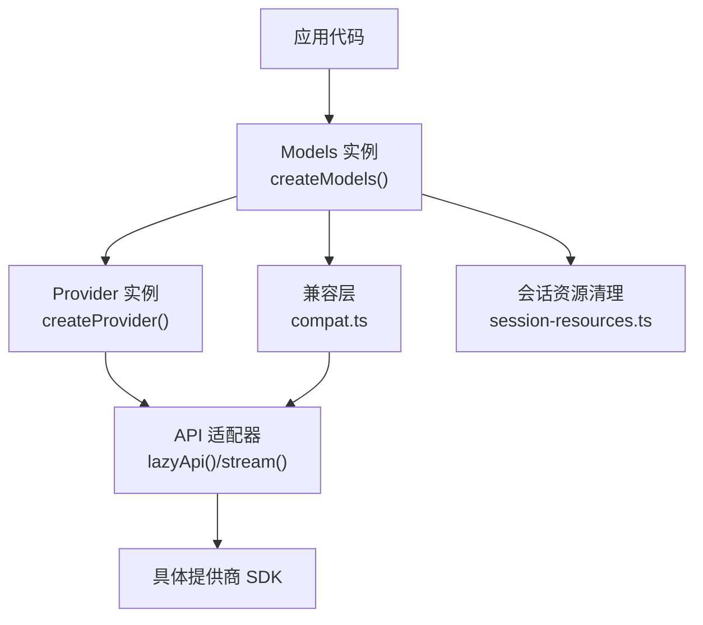
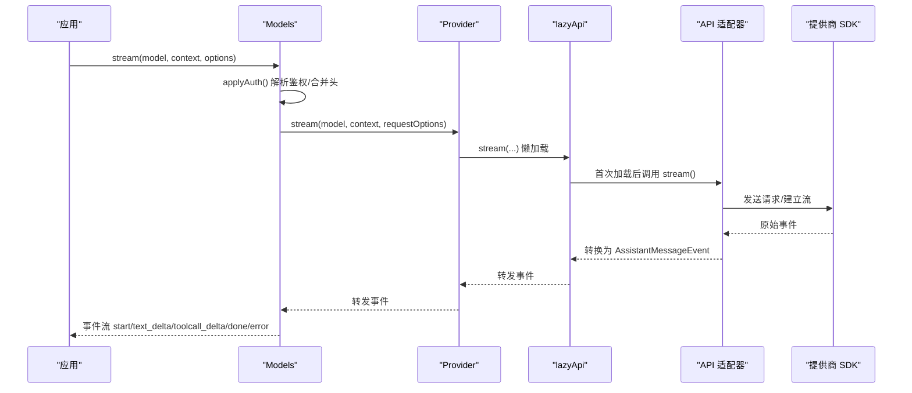
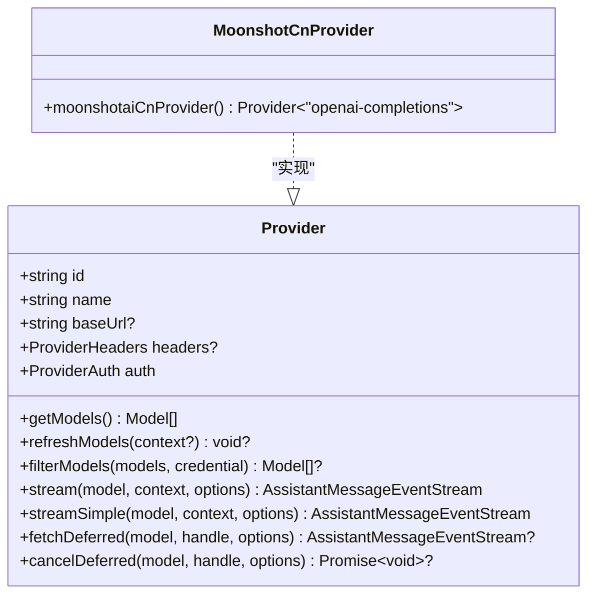
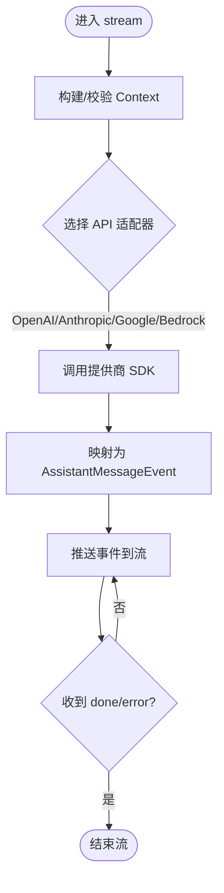
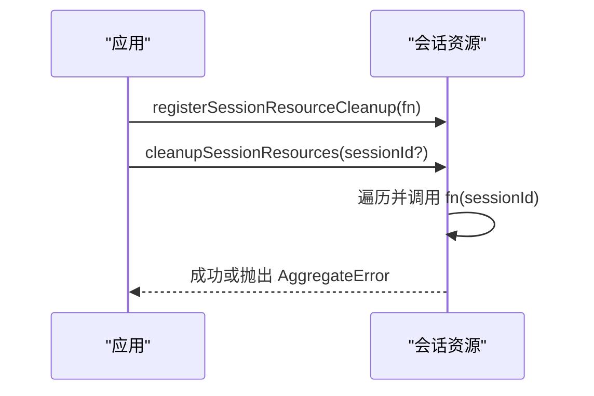
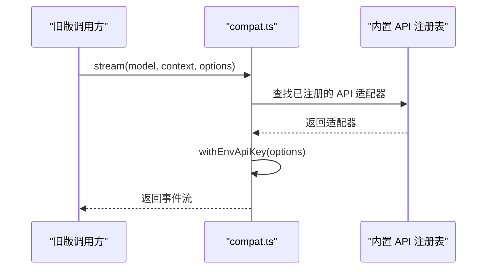
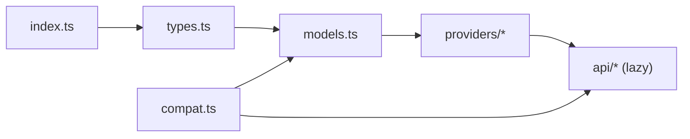

# 统一 API 设计

<cite>
**本文引用的文件**
- [packages/ai/src/index.ts](file://packages/ai/src/index.ts)
- [packages/ai/src/types.ts](file://packages/ai/src/types.ts)
- [packages/ai/src/models.ts](file://packages/ai/src/models.ts)
- [packages/ai/src/api/lazy.ts](file://packages/ai/src/api/lazy.ts)
- [packages/ai/src/compat.ts](file://packages/ai/src/compat.ts)
- [packages/ai/src/session-resources.ts](file://packages/ai/src/session-resources.ts)
- [packages/ai/src/providers/moonshotai-cn.ts](file://packages/ai/src/providers/moonshotai-cn.ts)
</cite>

## 目录
1. [简介](#简介)
2. [项目结构](#项目结构)
3. [核心组件](#核心组件)
4. [架构总览](#架构总览)
5. [详细组件分析](#详细组件分析)
6. [依赖关系分析](#依赖关系分析)
7. [性能考量](#性能考量)
8. [故障排查指南](#故障排查指南)
9. [结论](#结论)
10. [附录：使用示例与最佳实践](#附录使用示例与最佳实践)

## 简介
本文件系统性阐述 Pi 的“统一 AI 抽象层”设计，说明如何通过适配器模式屏蔽不同 AI 提供商（OpenAI、Anthropic、Google、Bedrock 等）的差异，提供一致的编程接口。文档覆盖：
- 核心类型定义：Message、ToolCall、ProviderConfig（以 Provider、Model、Context、StreamOptions 等形式体现）、Usage、StopReason 等
- 消息格式标准化机制：将各提供商消息统一为内部 AssistantMessage 事件流
- 会话资源管理：上下文与会话生命周期清理
- 兼容性处理：新旧 API 版本兼容与迁移路径
- 类型安全设计与错误处理策略
- 使用统一 API 进行聊天完成、工具调用等的操作指引

## 项目结构
- 包入口与导出：index.ts 暴露核心类型、工具与模块，保持无副作用的核心层
- 统一模型与提供者：models.ts 定义 Provider、Models、createProvider/createModels 等运行时编排
- 类型契约：types.ts 定义统一的 Message、ToolCall、Context、StreamOptions、Usage、StopReason 等
- 适配器与懒加载：api/lazy.ts 提供 lazyStream/lazyApi，延迟加载具体 API 实现并转发事件
- 兼容层：compat.ts 保留旧版全局 API 表面，逐步迁移到 createModels + Provider 工厂
- 会话资源：session-resources.ts 提供会话级资源注册与清理
- 提供商实现：providers/* 下按提供商组织，moonshotai-cn.ts 等通过 createProvider 接入统一接口

图表来源
- [packages/ai/src/models.ts:136-223](file://packages/ai/src/models.ts#L136-L223)
- [packages/ai/src/api/lazy.ts:41-99](file://packages/ai/src/api/lazy.ts#L41-L99)
- [packages/ai/src/compat.ts:178-213](file://packages/ai/src/compat.ts#L178-L213)
- [packages/ai/src/session-resources.ts:1-25](file://packages/ai/src/session-resources.ts#L1-L25)

章节来源
- [packages/ai/src/index.ts:1-48](file://packages/ai/src/index.ts#L1-L48)
- [packages/ai/src/models.ts:88-223](file://packages/ai/src/models.ts#L88-L223)
- [packages/ai/src/types.ts:17-33](file://packages/ai/src/types.ts#L17-L33)

## 核心组件
- 统一类型与数据模型
  - Message：UserMessage、AssistantMessage、ToolResultMessage 的统一联合类型
  - ToolCall：工具调用的统一表示，包含 id、name、arguments、可选命名空间与签名
  - Context：系统提示、消息历史、工具列表
  - StreamOptions / SimpleStreamOptions：请求级选项（超时、重试、传输、缓存、会话 ID、元数据等）
  - Usage：用量统计与成本估算
  - StopReason：停止原因枚举（pending/stop/length/toolUse/error/aborted/deferred）
- 提供者与模型
  - Provider：统一接口，包含 id/name/baseUrl/auth/getModels/stream/streamSimple/fetchDeferred/cancelDeferred
  - Model：模型元信息（id/name/api/provider/baseUrl/reasoning 等）
  - Models：运行时集合，负责鉴权解析、模型刷新、分发到 Provider
- 适配器与事件流
  - ProviderStreams：统一 stream/streamSimple/fetchDeferred/cancelDeferred 契约
  - AssistantMessageEventStream：事件协议（start/text_delta/toolcall_delta/done/error 等）
  - lazyStream/lazyApi：惰性加载与错误封装，保证同步返回流对象

章节来源
- [packages/ai/src/types.ts:332-455](file://packages/ai/src/types.ts#L332-L455)
- [packages/ai/src/types.ts:478-800](file://packages/ai/src/types.ts#L478-L800)
- [packages/ai/src/models.ts:88-149](file://packages/ai/src/models.ts#L88-L149)
- [packages/ai/src/api/lazy.ts:41-99](file://packages/ai/src/api/lazy.ts#L41-L99)

## 架构总览
Pi 的 AI 抽象层采用“适配器模式 + 懒加载”的组合：
- 每个提供商通过 createProvider 声明其 id、auth、模型列表与 API 适配器
- Models 在调用时解析鉴权、合并请求头与环境变量，再委派给对应 Provider
- 具体 API 实现位于 api/*，通过 lazyApi 延迟加载，首次调用时才引入
- 所有提供商的消息被转换为统一的 AssistantMessage 事件流，上层无需关心差异

图表来源
- [packages/ai/src/models.ts:667-695](file://packages/ai/src/models.ts#L667-L695)
- [packages/ai/src/api/lazy.ts:41-99](file://packages/ai/src/api/lazy.ts#L41-L99)
- [packages/ai/src/types.ts:260-324](file://packages/ai/src/types.ts#L260-L324)

## 详细组件分析

### 适配器模式与 Provider 工厂
- createProvider：将 id、auth、模型列表、API 适配器组合成 Provider；支持单 API 或按 model.api 分派
- Provider.stream/streamSimple：统一入口，返回事件流；可选 fetchDeferred/cancelDeferred 用于异步长任务
- 提供商示例：moonshotai-cn.ts 通过 createProvider 接入 openai-completions 适配器

图表来源
- [packages/ai/src/models.ts:88-149](file://packages/ai/src/models.ts#L88-L149)
- [packages/ai/src/providers/moonshotai-cn.ts:1-15](file://packages/ai/src/providers/moonshotai-cn.ts#L1-L15)

章节来源
- [packages/ai/src/models.ts:739-800](file://packages/ai/src/models.ts#L739-L800)
- [packages/ai/src/providers/moonshotai-cn.ts:1-15](file://packages/ai/src/providers/moonshotai-cn.ts#L1-L15)

### 消息格式标准化与事件流
- 输入：Context.messages 中的 UserMessage/ToolResultMessage
- 输出：AssistantMessageEventStream 的事件序列
  - start/text_start/text_delta/text_end
  - thinking_start/thinking_delta/thinking_end
  - toolcall_start/toolcall_delta/toolcall_end
  - done/error
- 统一内容块：TextContent、ThinkingContent、ImageContent、ToolCall
- 停止原因与诊断：StopReason、errorMessage、diagnostics

图表来源
- [packages/ai/src/types.ts:515-539](file://packages/ai/src/types.ts#L515-L539)
- [packages/ai/src/types.ts:332-455](file://packages/ai/src/types.ts#L332-L455)

章节来源
- [packages/ai/src/types.ts:332-455](file://packages/ai/src/types.ts#L332-L455)
- [packages/ai/src/types.ts:515-539](file://packages/ai/src/types.ts#L515-L539)

### 会话资源管理与状态
- 会话资源清理：registerSessionResourceCleanup 注册清理函数，cleanupSessionResources 批量执行
- 适用场景：连接池、临时文件、WebSocket 等会话级资源的生命周期管理
- 错误聚合：清理失败会聚合异常抛出，便于上层捕获

图表来源
- [packages/ai/src/session-resources.ts:1-25](file://packages/ai/src/session-resources.ts#L1-L25)

章节来源
- [packages/ai/src/session-resources.ts:1-25](file://packages/ai/src/session-resources.ts#L1-L25)

### 兼容性处理与新旧 API 迁移
- compat.ts 提供旧版全局 API（stream/complete/streamSimple/completeSimple），自动注入环境变量密钥，并注册内置 API 适配器
- 新代码应使用 createModels + Provider 工厂，以获得更好的类型与可测试性
- 兼容层会优先使用内置适配器，同时支持 Cloudflare 等特殊鉴权路径

图表来源
- [packages/ai/src/compat.ts:178-213](file://packages/ai/src/compat.ts#L178-L213)
- [packages/ai/src/compat.ts:222-264](file://packages/ai/src/compat.ts#L222-L264)

章节来源
- [packages/ai/src/compat.ts:1-299](file://packages/ai/src/compat.ts#L1-L299)

### 类型安全设计
- 强类型 API 映射：ApiOptionsMap 将 KnownApi 映射到具体 Options 类型
- 泛型约束：Provider<TApi>、Models.stream<TApi>()、createProvider<TApi>() 确保模型与 API 一致
- 工具参数约束：Tool<TParameters extends TSchema> 结合 TypeBox 做 JSON Schema 约束
- 兼容字段：OpenAICompletionsCompat/OpenAIResponsesCompat/AnthropicMessagesCompat/BedrockCompat 等控制行为开关

章节来源
- [packages/ai/src/types.ts:234-258](file://packages/ai/src/types.ts#L234-L258)
- [packages/ai/src/types.ts:542-687](file://packages/ai/src/types.ts#L542-L687)
- [packages/ai/src/types.ts:485-507](file://packages/ai/src/types.ts#L485-L507)

### 错误处理策略
- 流式错误：setup 失败或上游错误通过 error 事件携带 AssistantMessage（含 stopReason 与 errorMessage）
- Models 层：未配置 Provider、未知 Provider、鉴权失败等抛出 ModelsError
- 懒加载：lazyStream 捕获初始化错误并转为错误事件
- 会话清理：AggregateError 聚合多个清理失败

章节来源
- [packages/ai/src/api/lazy.ts:4-23](file://packages/ai/src/api/lazy.ts#L4-L23)
- [packages/ai/src/models.ts:628-665](file://packages/ai/src/models.ts#L628-L665)
- [packages/ai/src/session-resources.ts:12-24](file://packages/ai/src/session-resources.ts#L12-L24)

## 依赖关系分析
- index.ts 仅暴露核心类型与工具，避免副作用
- models.ts 依赖 types.ts 的类型契约，依赖 auth 模块解析鉴权，依赖 utils/abort 等工具
- providers/* 通过 createProvider 依赖 models.ts 与 api/* 适配器
- compat.ts 依赖 providers/all.ts 获取内置模型与提供者，并注册内置 API 适配器

图表来源
- [packages/ai/src/index.ts:1-48](file://packages/ai/src/index.ts#L1-L48)
- [packages/ai/src/models.ts:1-35](file://packages/ai/src/models.ts#L1-L35)
- [packages/ai/src/compat.ts:178-213](file://packages/ai/src/compat.ts#L178-L213)

章节来源
- [packages/ai/src/index.ts:1-48](file://packages/ai/src/index.ts#L1-L48)
- [packages/ai/src/models.ts:1-35](file://packages/ai/src/models.ts#L1-L35)
- [packages/ai/src/compat.ts:178-213](file://packages/ai/src/compat.ts#L178-L213)

## 性能考量
- 懒加载：lazyApi 仅在首次调用时加载具体 API 模块，减少冷启动开销
- 流式处理：事件流按需消费，避免一次性加载大响应
- 传输与缓存：Transport、CacheRetention、sessionId 等选项可优化网络与缓存命中
- 并发刷新：Models.refresh 支持并行刷新多个 Provider 的模型列表
- 超时与重试：timeoutMs、maxRetries、maxRetryDelayMs 控制健壮性与延迟

[本节为通用指导，不直接分析具体文件]

## 故障排查指南
- 未配置 Provider：检查 getAuth 是否返回 undefined，确认 apiKey/OAuth 配置
- 模型不可用：调用 refresh() 刷新动态模型列表，或使用 getAvailable() 过滤可用模型
- 流中错误：监听 error 事件，读取 errorMessage 与 diagnostics
- 会话资源泄漏：确保在会话结束时调用 cleanupSessionResources
- 兼容层问题：确认已正确注册内置 API 适配器，Cloudflare 鉴权需显式设置

章节来源
- [packages/ai/src/models.ts:544-563](file://packages/ai/src/models.ts#L544-L563)
- [packages/ai/src/models.ts:386-446](file://packages/ai/src/models.ts#L386-L446)
- [packages/ai/src/api/lazy.ts:4-23](file://packages/ai/src/api/lazy.ts#L4-L23)
- [packages/ai/src/session-resources.ts:12-24](file://packages/ai/src/session-resources.ts#L12-L24)

## 结论
Pi 的统一 AI 抽象层通过 Provider/Models/Adapter 的分层设计，将多提供商差异收敛为一致的流式接口。借助强类型、事件协议与懒加载，既保证了扩展性与可维护性，又提供了良好的性能与可观测性。建议新项目直接使用 createModels + Provider 工厂，旧项目通过 compat 平滑迁移。

[本节为总结，不直接分析具体文件]

## 附录：使用示例与最佳实践
以下示例展示如何使用统一 API 进行聊天完成与工具调用。为避免泄露实现细节，此处仅提供调用路径与关键步骤，实际代码请参考相应源码位置。

- 聊天完成（流式）
  - 创建 Models 与 Provider，选择 Model
  - 调用 Models.stream(model, context, options)，订阅事件流
  - 处理 text_delta 与 toolcall_delta，最终根据 done 事件获取 AssistantMessage
  - 参考路径：[packages/ai/src/models.ts:667-695](file://packages/ai/src/models.ts#L667-L695)、[packages/ai/src/types.ts:515-539](file://packages/ai/src/types.ts#L515-L539)

- 聊天完成（非流式）
  - 调用 Models.complete(model, context, options) 或直接 stream().result()
  - 参考路径：[packages/ai/src/models.ts:682-688](file://packages/ai/src/models.ts#L682-L688)

- 简单模式（忽略复杂选项）
  - 使用 streamSimple/completeSimple，适合快速体验
  - 参考路径：[packages/ai/src/models.ts:690-704](file://packages/ai/src/models.ts#L690-L704)

- 工具调用
  - 在 Context.tools 中声明 Tool（带 JSON Schema 参数）
  - 流中出现 toolcall_* 事件时执行工具，并以 ToolResultMessage 回写
  - 参考路径：[packages/ai/src/types.ts:485-507](file://packages/ai/src/types.ts#L485-L507)、[packages/ai/src/types.ts:437-455](file://packages/ai/src/types.ts#L437-L455)

- 会话资源清理
  - 在会话开始时注册清理函数，结束时调用 cleanupSessionResources
  - 参考路径：[packages/ai/src/session-resources.ts:1-25](file://packages/ai/src/session-resources.ts#L1-L25)

- 兼容层使用（旧项目）
  - 使用 compat 的 stream/complete/streamSimple/completeSimple，自动注入环境变量密钥
  - 参考路径：[packages/ai/src/compat.ts:250-299](file://packages/ai/src/compat.ts#L250-L299)