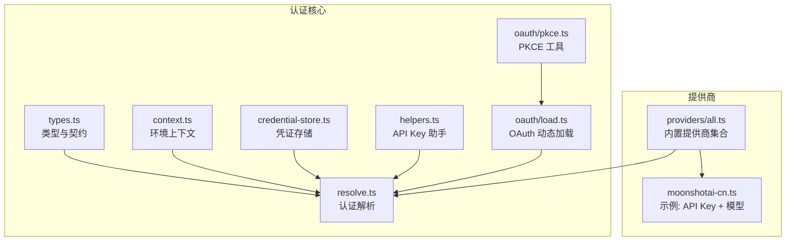
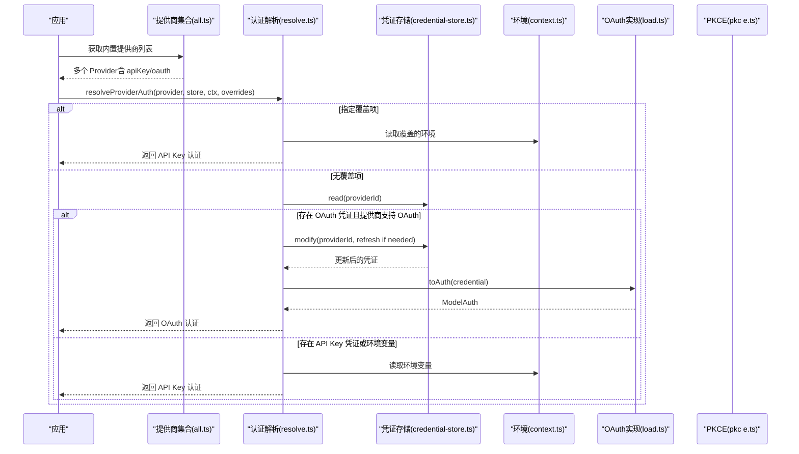
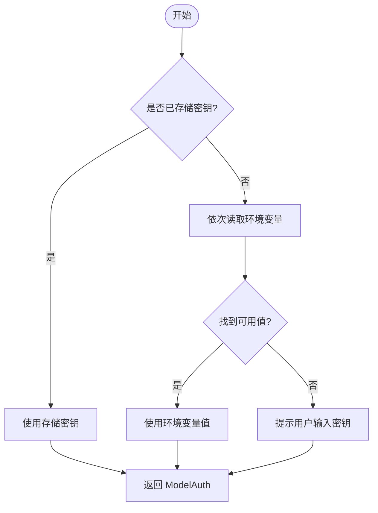
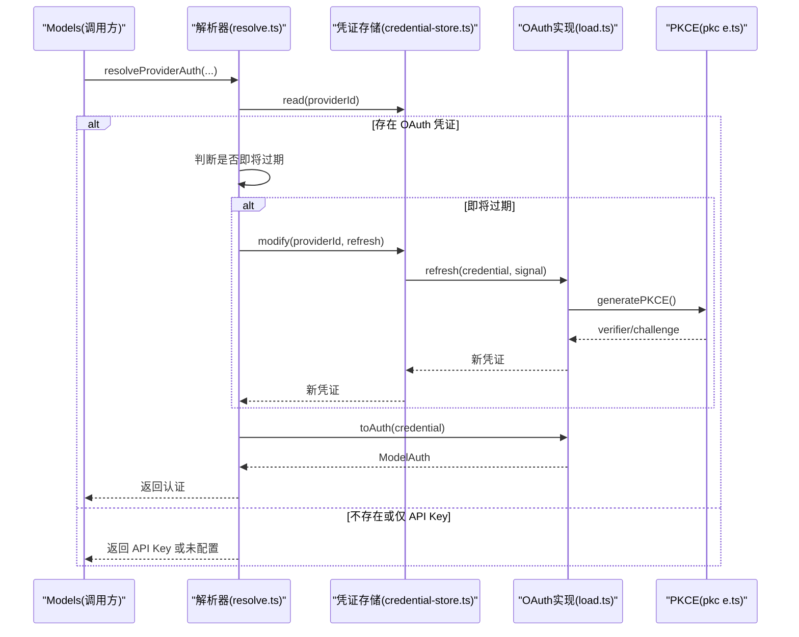
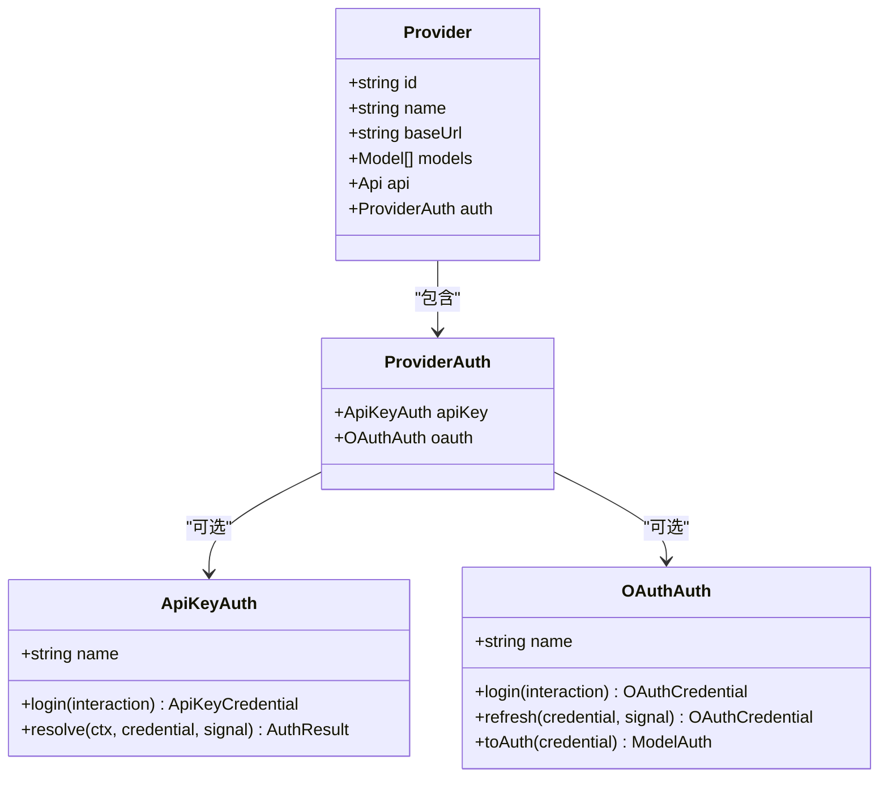
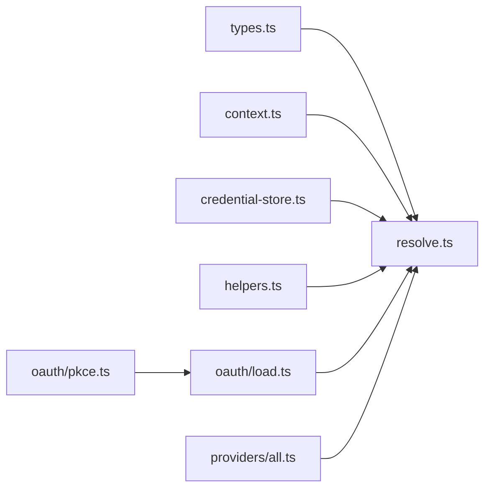

# 认证管理

<cite>
**本文引用的文件**
- [packages/ai/src/auth/helpers.ts](file://packages/ai/src/auth/helpers.ts)
- [packages/ai/src/auth/types.ts](file://packages/ai/src/auth/types.ts)
- [packages/ai/src/auth/context.ts](file://packages/ai/src/auth/context.ts)
- [packages/ai/src/auth/credential-store.ts](file://packages/ai/src/auth/credential-store.ts)
- [packages/ai/src/auth/resolve.ts](file://packages/ai/src/auth/resolve.ts)
- [packages/ai/src/auth/oauth/load.ts](file://packages/ai/src/auth/oauth/load.ts)
- [packages/ai/src/auth/oauth/pkce.ts](file://packages/ai/src/auth/oauth/pkce.ts)
- [packages/ai/src/providers/all.ts](file://packages/ai/src/providers/all.ts)
- [packages/ai/src/providers/moonshotai-cn.ts](file://packages/ai/src/providers/moonshotai-cn.ts)
</cite>

## 目录
1. [简介](#简介)
2. [项目结构](#项目结构)
3. [核心组件](#核心组件)
4. [架构总览](#架构总览)
5. [详细组件分析](#详细组件分析)
6. [依赖关系分析](#依赖关系分析)
7. [性能考量](#性能考量)
8. [故障排查指南](#故障排查指南)
9. [结论](#结论)
10. [附录](#附录)

## 简介
本文件面向“多提供商认证机制”的完整说明，覆盖 API Key 管理、OAuth 流程、环境变量配置、令牌生命周期与自动刷新、企业级认证接入方式、安全最佳实践、多账户切换策略以及常见问题诊断。该实现以统一的抽象层（ApiKeyAuth/OAuthAuth）对接多种提供商，并通过可插拔的凭证存储与环境上下文完成跨平台兼容（Node.js/浏览器）。

## 项目结构
认证子系统位于 packages/ai/src/auth 下，围绕以下关键模块组织：
- 类型与契约：定义凭证、交互、解析结果等统一接口
- 环境上下文：提供环境变量读取与文件存在性检查
- 凭证存储：默认内存实现，支持序列化写入与并发保护
- 解析器：按优先级从覆盖项、已存储凭证、环境变量/系统配置中解析最终请求认证信息
- OAuth 加载器：按需动态加载各提供商的 OAuth 实现，避免将 Node-only 代码打入通用包
- PKCE 工具：基于 Web Crypto 生成 code verifier/challenge，跨 Node/Browser 兼容
- 提供商注册：集中注册所有内置提供商及其认证能力

图表来源
- [packages/ai/src/auth/types.ts:1-241](file://packages/ai/src/auth/types.ts#L1-L241)
- [packages/ai/src/auth/context.ts:1-46](file://packages/ai/src/auth/context.ts#L1-L46)
- [packages/ai/src/auth/credential-store.ts:1-68](file://packages/ai/src/auth/credential-store.ts#L1-L68)
- [packages/ai/src/auth/resolve.ts:1-206](file://packages/ai/src/auth/resolve.ts#L1-L206)
- [packages/ai/src/auth/helpers.ts:1-60](file://packages/ai/src/auth/helpers.ts#L1-L60)
- [packages/ai/src/auth/oauth/load.ts:1-69](file://packages/ai/src/auth/oauth/load.ts#L1-L69)
- [packages/ai/src/auth/oauth/pkce.ts:1-35](file://packages/ai/src/auth/oauth/pkce.ts#L1-L35)
- [packages/ai/src/providers/all.ts:1-156](file://packages/ai/src/providers/all.ts#L1-L156)
- [packages/ai/src/providers/moonshotai-cn.ts:1-15](file://packages/ai/src/providers/moonshotai-cn.ts#L1-L15)

章节来源
- [packages/ai/src/auth/types.ts:1-241](file://packages/ai/src/auth/types.ts#L1-L241)
- [packages/ai/src/auth/context.ts:1-46](file://packages/ai/src/auth/context.ts#L1-L46)
- [packages/ai/src/auth/credential-store.ts:1-68](file://packages/ai/src/auth/credential-store.ts#L1-L68)
- [packages/ai/src/auth/resolve.ts:1-206](file://packages/ai/src/auth/resolve.ts#L1-L206)
- [packages/ai/src/auth/helpers.ts:1-60](file://packages/ai/src/auth/helpers.ts#L1-L60)
- [packages/ai/src/auth/oauth/load.ts:1-69](file://packages/ai/src/auth/oauth/load.ts#L1-L69)
- [packages/ai/src/auth/oauth/pkce.ts:1-35](file://packages/ai/src/auth/oauth/pkce.ts#L1-L35)
- [packages/ai/src/providers/all.ts:1-156](file://packages/ai/src/providers/all.ts#L1-L156)
- [packages/ai/src/providers/moonshotai-cn.ts:1-15](file://packages/ai/src/providers/moonshotai-cn.ts#L1-L15)

## 核心组件
- 类型与契约（types.ts）
  - 定义了请求级认证 ModelAuth、两类凭证 ApiKeyCredential/OAuthCredential、凭证存储 CredentialStore、环境上下文 AuthContext、解析结果 AuthResult、交互回调 AuthInteraction、以及两种认证处理器 ApiKeyAuth 与 OAuthAuth 的统一接口。
  - 通过类型标签区分凭证类型，确保单 Provider 仅持有单一凭证。
- 环境上下文（context.ts）
  - 默认实现从进程环境变量读取值，并支持在 Node 环境下检测文件是否存在（含 ~ 展开），在浏览器中始终返回 false。
- 凭证存储（credential-store.ts）
  - 默认内存实现，按 Provider.id 键控，串行化写入（modify/delete/read/list），保证并发安全与跨进程可扩展（可通过替换为持久化实现扩展）。
- 认证解析（resolve.ts）
  - 统一入口 resolveProviderAuth，按优先级：覆盖项 > 已存储凭证 > 环境变量/系统配置；对 OAuth 采用“双检锁”模式进行过期前预刷新与全局去重刷新。
- API Key 助手（helpers.ts）
  - envApiKeyAuth：优先使用已存储密钥，其次按顺序读取环境变量；提供交互式登录提示。
  - lazyOAuth：延迟加载具体 OAuth 实现，避免将 Node-only 代码引入通用包。
- OAuth 加载器（oauth/load.ts）
  - 通过变量限定符动态导入各提供商 OAuth 模块，支持打包时静态注册以减少运行时开销。
- PKCE 工具（oauth/pkce.ts）
  - 基于 Web Crypto 生成 code verifier 与 challenge，兼容 Node 20+ 与浏览器。

章节来源
- [packages/ai/src/auth/types.ts:1-241](file://packages/ai/src/auth/types.ts#L1-L241)
- [packages/ai/src/auth/context.ts:1-46](file://packages/ai/src/auth/context.ts#L1-L46)
- [packages/ai/src/auth/credential-store.ts:1-68](file://packages/ai/src/auth/credential-store.ts#L1-L68)
- [packages/ai/src/auth/resolve.ts:1-206](file://packages/ai/src/auth/resolve.ts#L1-L206)
- [packages/ai/src/auth/helpers.ts:1-60](file://packages/ai/src/auth/helpers.ts#L1-L60)
- [packages/ai/src/auth/oauth/load.ts:1-69](file://packages/ai/src/auth/oauth/load.ts#L1-L69)
- [packages/ai/src/auth/oauth/pkce.ts:1-35](file://packages/ai/src/auth/oauth/pkce.ts#L1-L35)

## 架构总览
下图展示了从“提供商注册”到“认证解析”再到“请求级认证”的整体流程，以及 OAuth 刷新与存储的协作关系。

图表来源
- [packages/ai/src/providers/all.ts:88-141](file://packages/ai/src/providers/all.ts#L88-L141)
- [packages/ai/src/auth/resolve.ts:50-110](file://packages/ai/src/auth/resolve.ts#L50-L110)
- [packages/ai/src/auth/credential-store.ts:30-66](file://packages/ai/src/auth/credential-store.ts#L30-L66)
- [packages/ai/src/auth/context.ts:23-45](file://packages/ai/src/auth/context.ts#L23-L45)
- [packages/ai/src/auth/oauth/load.ts:31-68](file://packages/ai/src/auth/oauth/load.ts#L31-L68)
- [packages/ai/src/auth/oauth/pkce.ts:21-34](file://packages/ai/src/auth/oauth/pkce.ts#L21-L34)

## 详细组件分析

### API Key 认证与多环境变量
- 设计要点
  - 通过 envApiKeyAuth 提供标准 API Key 解析：优先使用已存储密钥，其次按顺序读取一组环境变量；若均未设置则视为未配置。
  - 支持交互式登录：当需要用户输入密钥时，通过交互回调提示并返回凭证。
- 数据流
  - 调用方传入 provider.auth.apiKey 与可选覆盖项；解析器调用 ApiKeyAuth.resolve，合并 stored credential.key 与环境变量，输出 ModelAuth。
- 复杂度与性能
  - 解析过程为 O(n) 环境变量遍历，n 通常很小；无网络 IO，性能开销极低。
- 错误处理
  - 解析失败会包装为 ModelsError（code="auth"），便于上层统一处理。

图表来源
- [packages/ai/src/auth/helpers.ts:9-31](file://packages/ai/src/auth/helpers.ts#L9-L31)
- [packages/ai/src/auth/resolve.ts:181-193](file://packages/ai/src/auth/resolve.ts#L181-L193)

章节来源
- [packages/ai/src/auth/helpers.ts:1-60](file://packages/ai/src/auth/helpers.ts#L1-L60)
- [packages/ai/src/auth/resolve.ts:181-193](file://packages/ai/src/auth/resolve.ts#L181-L193)

### OAuth 认证与令牌生命周期管理
- 设计要点
  - OAuthAuth 接口分离 login/refresh/toAuth：login 负责首次授权，refresh 负责刷新令牌，toAuth 根据当前凭证派生请求级认证。
  - 解析器对 OAuth 采用“双检锁”：先快速判断是否即将过期，再在凭证存储的串行写入锁内二次检查并执行刷新，避免并发重复刷新。
  - 最小有效期阈值默认 5 分钟，可配置；刷新超时默认 15 秒。
- 动态加载
  - 通过 oauth/load.ts 按需动态导入各提供商 OAuth 实现，避免将 Node-only 代码打入通用包；支持打包时静态注册。
- PKCE
  - 使用 Web Crypto 生成 code verifier 与 challenge，兼容 Node 20+ 与浏览器。

图表来源
- [packages/ai/src/auth/resolve.ts:122-179](file://packages/ai/src/auth/resolve.ts#L122-L179)
- [packages/ai/src/auth/credential-store.ts:40-66](file://packages/ai/src/auth/credential-store.ts#L40-L66)
- [packages/ai/src/auth/oauth/load.ts:31-68](file://packages/ai/src/auth/oauth/load.ts#L31-L68)
- [packages/ai/src/auth/oauth/pkce.ts:21-34](file://packages/ai/src/auth/oauth/pkce.ts#L21-L34)

章节来源
- [packages/ai/src/auth/resolve.ts:122-179](file://packages/ai/src/auth/resolve.ts#L122-L179)
- [packages/ai/src/auth/oauth/load.ts:1-69](file://packages/ai/src/auth/oauth/load.ts#L1-L69)
- [packages/ai/src/auth/oauth/pkce.ts:1-35](file://packages/ai/src/auth/oauth/pkce.ts#L1-L35)

### 多提供商注册与选择
- 内置提供商集合由 providers/all.ts 集中注册，每个 Provider 声明其 id、名称、baseUrl、支持的模型、API 适配与 auth（apiKey 与/或 oauth）。
- 示例：moonshotai-cn 使用 envApiKeyAuth 绑定特定环境变量名，从而在同一应用中无缝切换不同提供商的认证方式。

图表来源
- [packages/ai/src/providers/all.ts:88-141](file://packages/ai/src/providers/all.ts#L88-L141)
- [packages/ai/src/providers/moonshotai-cn.ts:6-14](file://packages/ai/src/providers/moonshotai-cn.ts#L6-L14)
- [packages/ai/src/auth/types.ts:232-241](file://packages/ai/src/auth/types.ts#L232-L241)

章节来源
- [packages/ai/src/providers/all.ts:88-141](file://packages/ai/src/providers/all.ts#L88-L141)
- [packages/ai/src/providers/moonshotai-cn.ts:1-15](file://packages/ai/src/providers/moonshotai-cn.ts#L1-L15)
- [packages/ai/src/auth/types.ts:232-241](file://packages/ai/src/auth/types.ts#L232-L241)

### 环境变量与上下文注入
- 默认上下文从进程环境变量读取，支持在 Node 环境中检测文件是否存在（含 ~ 展开），在浏览器中始终返回 false。
- 解析器支持通过覆盖项 overlay 临时注入 Provider 级环境变量，用于测试或运行时动态配置。

章节来源
- [packages/ai/src/auth/context.ts:1-46](file://packages/ai/src/auth/context.ts#L1-L46)
- [packages/ai/src/auth/resolve.ts:112-117](file://packages/ai/src/auth/resolve.ts#L112-L117)

## 依赖关系分析
- 低耦合高内聚
  - 类型与契约（types.ts）被其他模块引用，形成稳定的接口边界。
  - 解析器（resolve.ts）依赖凭证存储、环境上下文与 OAuth 加载器，但不直接依赖具体提供商实现。
  - 提供商通过 all.ts 集中注册，新增提供商只需实现 ProviderAuth 并加入注册表。
- 外部依赖
  - Node 内置模块（fs/os）仅在 Node 环境动态加载，避免浏览器打包问题。
  - Web Crypto API 用于 PKCE，跨 Node/Browser 兼容。

图表来源
- [packages/ai/src/auth/types.ts:1-241](file://packages/ai/src/auth/types.ts#L1-L241)
- [packages/ai/src/auth/resolve.ts:1-206](file://packages/ai/src/auth/resolve.ts#L1-L206)
- [packages/ai/src/auth/context.ts:1-46](file://packages/ai/src/auth/context.ts#L1-L46)
- [packages/ai/src/auth/credential-store.ts:1-68](file://packages/ai/src/auth/credential-store.ts#L1-L68)
- [packages/ai/src/auth/helpers.ts:1-60](file://packages/ai/src/auth/helpers.ts#L1-L60)
- [packages/ai/src/auth/oauth/load.ts:1-69](file://packages/ai/src/auth/oauth/load.ts#L1-L69)
- [packages/ai/src/auth/oauth/pkce.ts:1-35](file://packages/ai/src/auth/oauth/pkce.ts#L1-L35)
- [packages/ai/src/providers/all.ts:1-156](file://packages/ai/src/providers/all.ts#L1-L156)

## 性能考量
- 解析路径短平快：API Key 解析仅涉及内存与少量环境变量读取，时间复杂度 O(n)。
- OAuth 刷新去重：通过凭证存储的串行写入锁与“双检锁”，避免并发重复刷新，减少网络开销。
- 动态加载：OAuth 实现按需加载，避免将 Node-only 代码打入通用包，减小体积与启动成本。
- 超时控制：OAuth 刷新具备超时信号，防止长时间阻塞。

[本节为通用性能讨论，不直接分析具体文件]

## 故障排查指南
- 常见错误码
  - ModelsError.code 包括 model_source、model_validation、provider、stream、auth、oauth。认证相关错误集中在 auth 与 oauth。
- 典型问题与定位
  - API Key 未配置：检查是否设置了环境变量或已在存储中保存密钥；确认 envApiKeyAuth 绑定的环境变量名是否正确。
  - OAuth 刷新失败：查看刷新超时与最小有效期配置；确认网络可达与凭证实效；检查凭证存储写入是否成功。
  - 并发冲突：若出现重复刷新或状态不一致，确认是否使用了正确的凭证存储实现并确保串行写入。
- 建议的诊断步骤
  - 启用更详细的日志（如记录 source 字段），确认认证来源（存储、环境变量、OAuth）。
  - 在测试环境使用覆盖项注入环境变量，隔离环境问题。
  - 对于浏览器环境，确认 fileExists 始终返回 false，避免误判本地文件。

章节来源
- [packages/ai/src/auth/resolve.ts:16-42](file://packages/ai/src/auth/resolve.ts#L16-L42)
- [packages/ai/src/auth/resolve.ts:122-179](file://packages/ai/src/auth/resolve.ts#L122-L179)
- [packages/ai/src/auth/helpers.ts:9-31](file://packages/ai/src/auth/helpers.ts#L9-L31)

## 结论
该认证子系统通过统一抽象与可插拔实现，实现了多提供商的 API Key 与 OAuth 认证统一管理。其特点包括：
- 清晰的类型契约与职责划分
- 安全的并发与令牌生命周期管理
- 跨平台兼容的动态加载与上下文注入
- 易于扩展的企业级集成点（自定义凭证存储、OAuth 实现）

在生产部署中，建议结合企业安全策略（密钥管理、传输加密、访问控制）与上述机制，构建稳健的多租户、多提供商认证体系。

[本节为总结性内容，不直接分析具体文件]

## 附录
- 安全最佳实践
  - 密钥存储：优先使用受保护的凭证存储（如操作系统钥匙串或企业密钥管理服务），避免明文落盘。
  - 传输加密：确保所有认证请求均通过 HTTPS 进行。
  - 访问控制：最小权限原则，限制密钥与令牌的访问范围与作用域。
  - 审计与告警：记录认证事件与失败原因，及时告警异常行为。
- 企业部署配置指南
  - 使用自定义凭证存储实现对接企业密钥管理系统。
  - 通过覆盖项注入 Provider 级环境变量，实现运行时配置与灰度发布。
  - 针对企业网关（如 Radius/OpenID Connect）接入 OAuth 实现，遵循企业身份源策略。

[本节为通用指导，不直接分析具体文件]