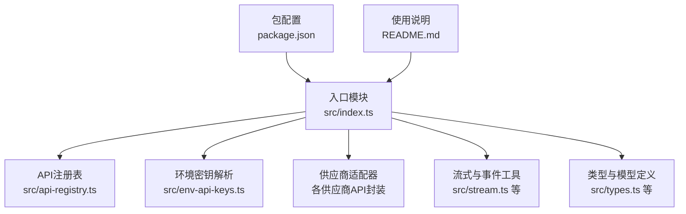
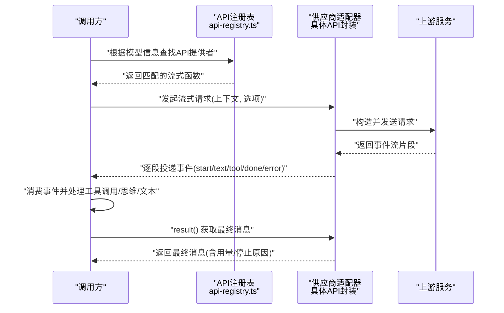
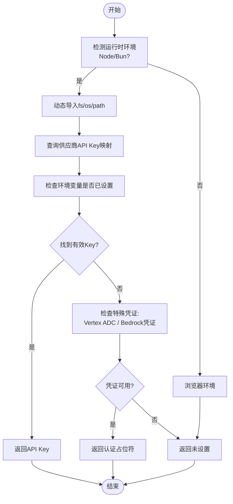
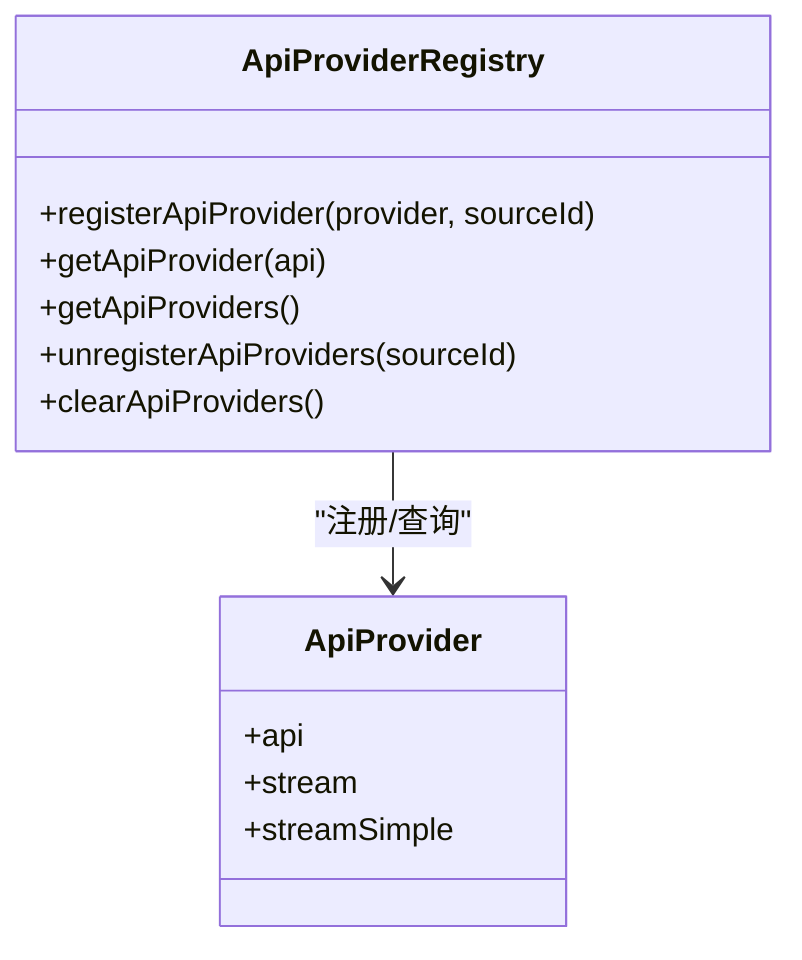
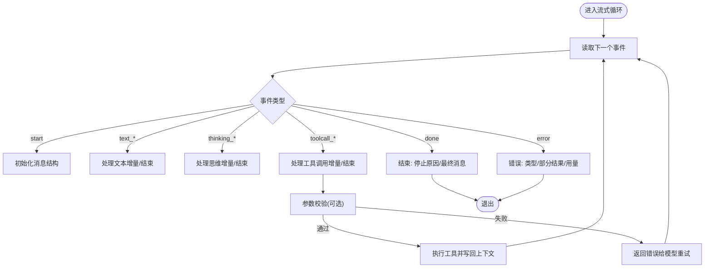
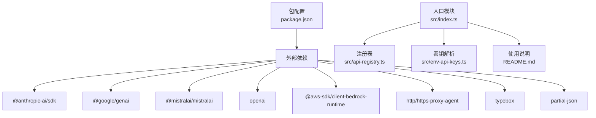

# AI提供者层

<cite>
**本文引用的文件**
- [packages/ai/package.json](file://packages/ai/package.json)
- [packages/ai/src/index.ts](file://packages/ai/src/index.ts)
- [packages/ai/src/env-api-keys.ts](file://packages/ai/src/env-api-keys.ts)
- [packages/ai/src/api-registry.ts](file://packages/ai/src/api-registry.ts)
- [packages/ai/README.md](file://packages/ai/README.md)
</cite>

## 目录
1. [简介](#简介)
2. [项目结构](#项目结构)
3. [核心组件](#核心组件)
4. [架构总览](#架构总览)
5. [详细组件分析](#详细组件分析)
6. [依赖关系分析](#依赖关系分析)
7. [性能考虑](#性能考虑)
8. [故障排查指南](#故障排查指南)
9. [结论](#结论)
10. [附录](#附录)

## 简介
本文件为 Pi AI 提供者层的全面API文档，聚焦于统一多供应商LLM API的设计与实现。该库通过统一的接口抽象，屏蔽不同供应商（如OpenAI、Anthropic、Google、AWS Bedrock、Mistral等）的差异，提供一致的流式与非流式调用体验，并内置工具调用、思维/推理内容、停止原因、错误处理、会话上下文持久化与跨提供者转接等能力。

## 项目结构
- 包装与导出：通过入口文件集中导出类型、注册表、供应商适配器、流式与事件工具等。
- 认证与密钥：提供环境变量解析与凭证检测逻辑，覆盖多种供应商的API Key与OAuth场景。
- 注册表：以“API”维度注册不同供应商的流式/简化流式实现，形成可扩展的适配器体系。
- 文档与示例：README提供快速开始、工具调用、图像输入/生成、思维/推理、错误处理、OAuth等详尽说明。

图表来源
- [packages/ai/src/index.ts:1-48](file://packages/ai/src/index.ts#L1-L48)
- [packages/ai/src/api-registry.ts:1-99](file://packages/ai/src/api-registry.ts#L1-L99)
- [packages/ai/src/env-api-keys.ts:1-211](file://packages/ai/src/env-api-keys.ts#L1-L211)
- [packages/ai/package.json:1-107](file://packages/ai/package.json#L1-L107)
- [packages/ai/README.md:1-1384](file://packages/ai/README.md#L1-L1384)

章节来源
- [packages/ai/src/index.ts:1-48](file://packages/ai/src/index.ts#L1-L48)
- [packages/ai/package.json:1-107](file://packages/ai/package.json#L1-L107)
- [packages/ai/README.md:1-1384](file://packages/ai/README.md#L1-L1384)

## 核心组件
- 统一模型与上下文
  - 模型对象包含供应商、模型ID、输入/输出能力、推理支持等元数据；上下文包含系统提示、消息数组、工具定义等。
- 流式与非流式接口
  - 支持完整流式事件（文本、思维、工具调用增量）、简化模式（仅思维/文本）、一次性完成响应。
- 事件流与状态
  - 事件类型覆盖 start/text/toolcall/done/error 等；支持中止信号、停止原因、部分结果与用量统计。
- 工具调用
  - 基于TypeBox的强类型工具定义与参数校验；支持部分JSON增量解析，便于实时UI更新。
- 图像输入/生成
  - 视觉模型支持图像输入；图像生成使用独立API面，不参与工具调用。
- 思维/推理
  - 多供应商统一的思维/推理开关与预算控制；流式思维内容事件。
- 错误处理
  - 统一错误事件与中止事件；支持在中断后继续会话。

章节来源
- [packages/ai/README.md:371-391](file://packages/ai/README.md#L371-L391)
- [packages/ai/README.md:492-584](file://packages/ai/README.md#L492-L584)
- [packages/ai/README.md:597-696](file://packages/ai/README.md#L597-L696)

## 架构总览
统一API通过“API注册表”将不同供应商的流式实现绑定到统一的模型对象上。调用方仅需选择供应商与模型，即可获得一致的事件流与结果。

图表来源
- [packages/ai/src/api-registry.ts:40-99](file://packages/ai/src/api-registry.ts#L40-L99)
- [packages/ai/src/index.ts:1-48](file://packages/ai/src/index.ts#L1-L48)

## 详细组件分析

### 认证与密钥管理
- 环境变量映射
  - 不同供应商的API Key环境变量映射集中维护，如 OPENAI_API_KEY、ANTHROPIC_API_KEY、GOOGLE_CLOUD_API_KEY、AWS_* 等。
  - 对OAuth优先级有明确约定（例如Anthropic优先使用OAuth Token）。
- 凭证检测
  - 针对Vertex AI，检测ADC凭据与项目/区域配置是否存在。
  - 针对Amazon Bedrock，检测多种AWS凭证来源（Profile、IAM Key、Bearer Token、ECS Task Role、IRSA等）。
- 运行时兼容性
  - 在Bun沙箱环境下，通过读取/proc/self/environ恢复缺失的进程环境变量。
- Node/Bun运行时动态导入
  - 仅在Node/Bun环境中按需加载fs/os/path模块，避免浏览器构建问题。

图表来源
- [packages/ai/src/env-api-keys.ts:1-211](file://packages/ai/src/env-api-keys.ts#L1-L211)

章节来源
- [packages/ai/src/env-api-keys.ts:91-134](file://packages/ai/src/env-api-keys.ts#L91-L134)
- [packages/ai/src/env-api-keys.ts:143-210](file://packages/ai/src/env-api-keys.ts#L143-L210)

### API注册表与适配器
- 注册表职责
  - 将“API标识”与“流式/简化流式实现”绑定；提供注册、查询、注销与清空能力。
  - 包装原始流式函数，确保传入模型的API与注册API一致。
- 扩展点
  - 新增供应商时，只需实现对应API的流式函数，并通过注册表进行注册。
- 查询与遍历
  - 可按API查询提供者，或列出所有已注册提供者。

图表来源
- [packages/ai/src/api-registry.ts:23-99](file://packages/ai/src/api-registry.ts#L23-L99)

章节来源
- [packages/ai/src/api-registry.ts:40-99](file://packages/ai/src/api-registry.ts#L40-L99)

### 流式事件与处理策略
- 事件类型
  - start、text_start/text_delta/text_end、thinking_start/thinking_delta/thinking_end、toolcall_start/toolcall_delta/toolcall_end、done、error。
- 事件特性
  - 不保证同一内容块的事件连续性；需使用contentIndex关联块与事件。
  - 部分JSON增量解析：工具调用参数在流过程中逐步可解析，便于前端渐进式渲染。
- 错误与中止
  - error事件区分“error”与“aborted”，并携带部分结果与用量。
  - 中止后可将部分消息加入上下文继续对话。

图表来源
- [packages/ai/README.md:371-391](file://packages/ai/README.md#L371-L391)
- [packages/ai/README.md:597-696](file://packages/ai/README.md#L597-L696)

章节来源
- [packages/ai/README.md:371-391](file://packages/ai/README.md#L371-L391)
- [packages/ai/README.md:597-696](file://packages/ai/README.md#L597-L696)

### 模型参数与关键设置
- 温度与最大令牌数
  - 通过供应商特定选项传递，如OpenAI的温度、最大输出长度；Anthropic的思考预算；Google的思考预算等。
- 推理/思维
  - 统一的简化选项与供应商特定选项并存；支持最小/低/中/高/x高等粒度。
- 工具调用
  - 通过TypeBox定义工具参数schema，自动校验与值转换；支持部分JSON增量解析。
- 图像输入/生成
  - 视觉模型支持图像输入；图像生成使用独立API面，不参与工具调用。

章节来源
- [packages/ai/README.md:496-561](file://packages/ai/README.md#L496-L561)
- [packages/ai/README.md:428-491](file://packages/ai/README.md#L428-L491)

### OAuth与第三方登录
- 支持OAuth的供应商（如GitHub Copilot、Anthropic等）
- 提供CLI登录与程序化OAuth流程示例
- 使用OAuth Token替代传统API Key

章节来源
- [packages/ai/README.md:42-49](file://packages/ai/README.md#L42-L49)

### 添加新供应商支持的集成步骤
- 定义API标识与流式函数
  - 实现 stream(model, context, options) -> AssistantMessageEventStream
  - 提供简化模式 streamSimple(model, context, options)
- 定义供应商选项类型
  - 映射供应商特定参数（如温度、最大令牌、推理预算等）
- 注册到API注册表
  - registerApiProvider({ api, stream, streamSimple }, sourceId?)
- 导出类型与工具
  - 在入口模块导出供应商类型与注册函数，便于上层使用

章节来源
- [packages/ai/src/api-registry.ts:66-78](file://packages/ai/src/api-registry.ts#L66-L78)
- [packages/ai/src/index.ts:10-28](file://packages/ai/src/index.ts#L10-L28)

## 依赖关系分析
- 外部SDK依赖
  - Anthropic、Google GenAI、Mistral、OpenAI、AWS Bedrock Runtime、代理库等。
- 内部模块耦合
  - 入口模块聚合导出；注册表集中管理适配器；环境密钥解析为各适配器提供认证信息。
- 运行时要求
  - Node >= 22.19.0；浏览器兼容注意（动态导入限制）。

图表来源
- [packages/ai/package.json:69-80](file://packages/ai/package.json#L69-L80)
- [packages/ai/src/index.ts:1-48](file://packages/ai/src/index.ts#L1-L48)
- [packages/ai/src/api-registry.ts:1-99](file://packages/ai/src/api-registry.ts#L1-L99)
- [packages/ai/src/env-api-keys.ts:1-211](file://packages/ai/src/env-api-keys.ts#L1-L211)
- [packages/ai/README.md:1-1384](file://packages/ai/README.md#L1-L1384)

章节来源
- [packages/ai/package.json:69-80](file://packages/ai/package.json#L69-L80)
- [packages/ai/src/index.ts:1-48](file://packages/ai/src/index.ts#L1-L48)

## 性能考虑
- 流式增量处理
  - 利用事件流的增量特性，尽早渲染文本与工具参数，降低感知延迟。
- 用量与成本追踪
  - 消息包含输入/输出用量与总成本，便于成本控制与优化。
- 中止与续传
  - 中止后可将部分结果加入上下文继续对话，减少重复计算。
- 代理与网络
  - 通过代理库支持HTTP/HTTPS代理，改善网络受限环境下的稳定性。

章节来源
- [packages/ai/README.md:597-696](file://packages/ai/README.md#L597-L696)

## 故障排查指南
- 常见问题
  - API Key未设置或环境变量未生效：检查供应商对应的环境变量是否正确配置。
  - 认证失败：确认OAuth Token优先级、AWS凭证来源、Google ADC配置。
  - 流式事件不连续：按contentIndex关联块与事件，不要假设事件序列连续。
  - 工具参数解析异常：部分JSON可能不完整，需防御性处理。
- 调试技巧
  - 使用 onPayload 回调打印上游请求载荷，定位格式问题。
  - 使用中止信号测试中断与续传流程。
  - 在复杂场景下启用简化事件参考对照表核对行为。

章节来源
- [packages/ai/README.md:683-696](file://packages/ai/README.md#L683-L696)
- [packages/ai/README.md:371-391](file://packages/ai/README.md#L371-L391)

## 结论
Pi AI提供者层通过统一的API注册表与事件流，实现了多供应商LLM的无缝集成。其设计兼顾了类型安全、可观测性与可扩展性，既适合快速集成现有供应商，也为新增供应商提供了清晰的扩展路径。配合完善的工具调用、思维/推理、图像输入/生成与错误处理机制，能够满足复杂智能体工作流的需求。

## 附录
- 快速开始与示例
  - 参考README中的快速开始与工具调用、图像输入/生成、思维/推理、错误处理等章节。
- 供应商清单
  - README列出了受支持的供应商列表，便于按需选择与配置。

章节来源
- [packages/ai/README.md:87-207](file://packages/ai/README.md#L87-L207)
- [packages/ai/README.md:51-78](file://packages/ai/README.md#L51-L78)