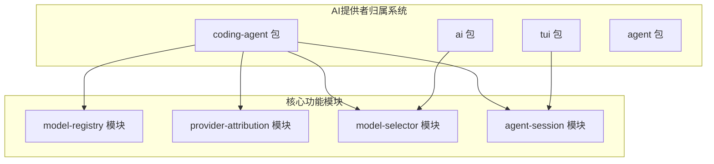
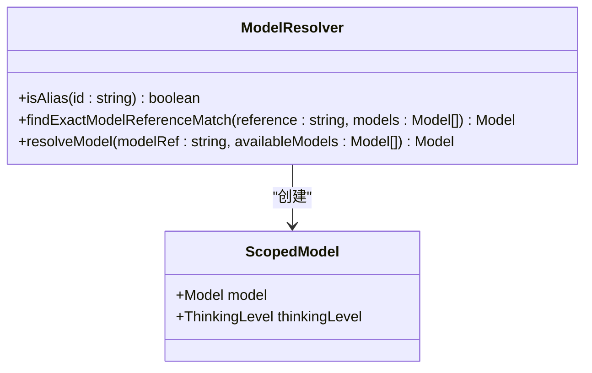
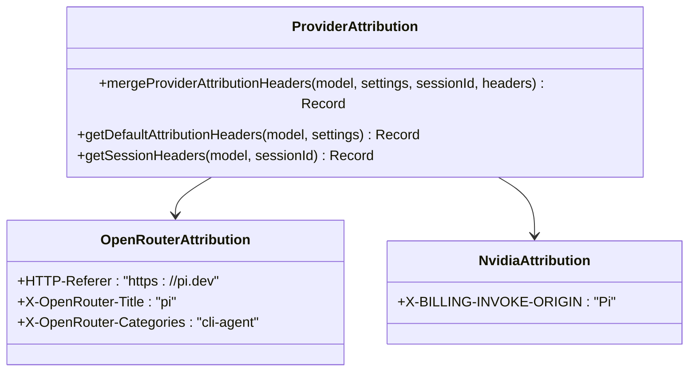
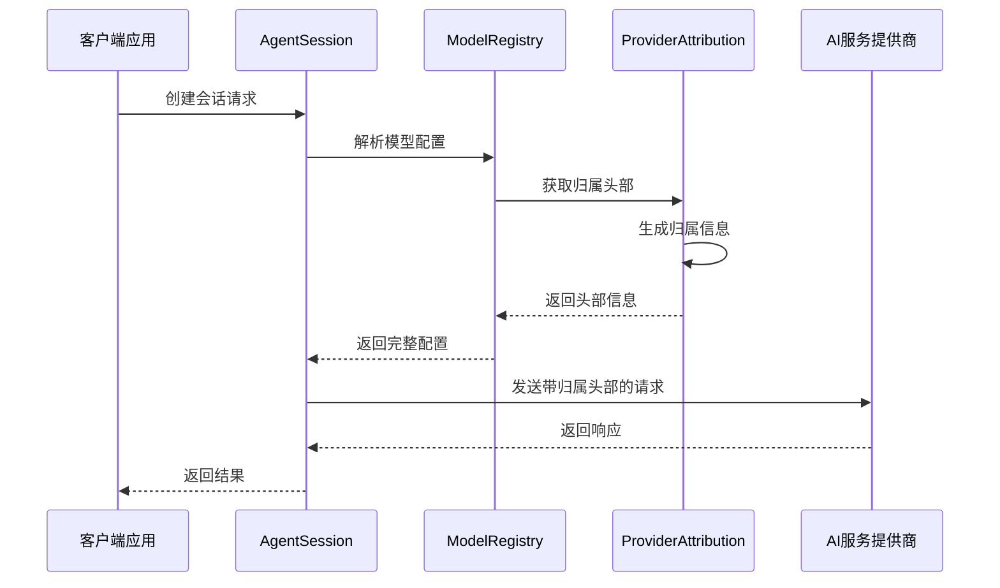
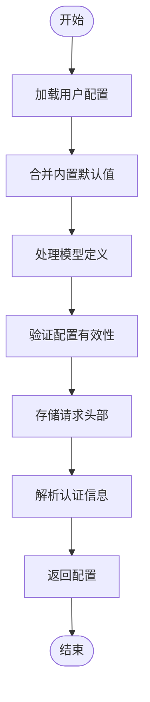
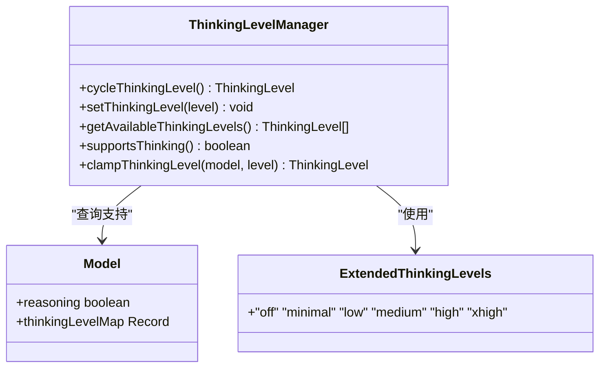
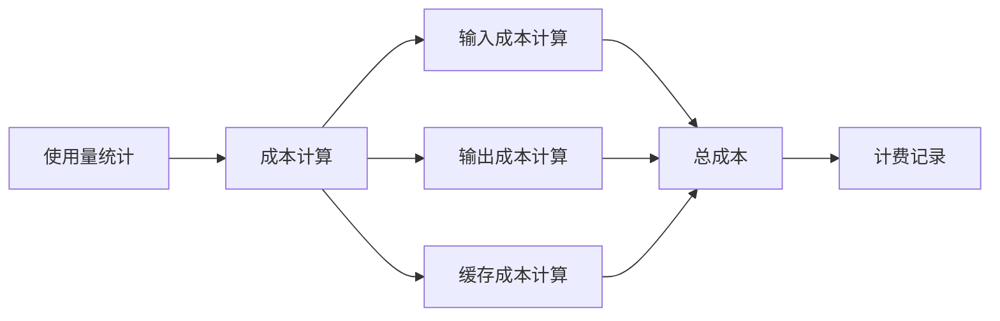
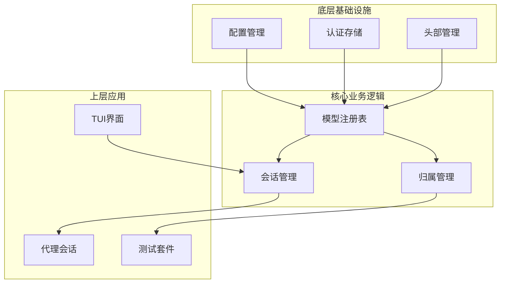

# AI提供者归属系统

<cite>
**本文档引用的文件**
- [model-resolver.ts](file://packages/coding-agent/src/core/model-resolver.ts)
- [provider-attribution.ts](file://packages/coding-agent/src/core/provider-attribution.ts)
- [model-registry.ts](file://packages/coding-agent/src/core/model-registry.ts)
- [models.ts](file://packages/ai/src/models.ts)
- [openai-responses.ts](file://packages/ai/src/providers/openai-responses.ts)
- [sdk-openrouter-attribution.test.ts](file://packages/coding-agent/test/sdk-openrouter-attribution.test.ts)
- [supports-xhigh.test.ts](file://packages/ai/test/supports-xhigh.test.ts)
- [agent-session.ts](file://packages/coding-agent/src/core/agent-session.ts)
- [tui.ts](file://packages/tui/src/tui.ts)
- [README.md](file://packages/coding-agent/README.md)
- [README.md](file://packages/ai/README.md)
</cite>

## 目录
1. [简介](#简介)
2. [项目结构](#项目结构)
3. [核心组件](#核心组件)
4. [架构概览](#架构概览)
5. [详细组件分析](#详细组件分析)
6. [依赖关系分析](#依赖关系分析)
7. [性能考虑](#性能考虑)
8. [故障排除指南](#故障排除指南)
9. [结论](#结论)

## 简介

AI提供者归属系统是一个复杂的多包架构，专门设计用于管理和跟踪AI模型的提供者归属信息。该系统通过在请求头中添加特定的归属标识，确保AI服务提供商能够正确识别和归因于Pi平台的使用。

系统的核心功能包括：
- 模型提供者识别和验证
- 归属头部信息的动态生成
- 多种AI服务提供商的兼容性支持
- 思维级别（Thinking Level）的智能管理
- 成本计算和使用量统计

## 项目结构

该项目采用多包（monorepo）结构，主要包含以下核心包：

**图表来源**
- [model-registry.ts:638-796](file://packages/coding-agent/src/core/model-registry.ts#L638-L796)
- [provider-attribution.ts:44-97](file://packages/coding-agent/src/core/provider-attribution.ts#L44-L97)

**章节来源**
- [README.md](file://packages/coding-agent/README.md)
- [README.md](file://packages/ai/README.md)

## 核心组件

### 模型解析器（Model Resolver）

模型解析器负责处理模型引用匹配和别名识别，确保模型ID的准确解析。

**图表来源**
- [model-resolver.ts:52-95](file://packages/coding-agent/src/core/model-resolver.ts#L52-L95)

### 提供者归属模块（Provider Attribution）

提供者归属模块是系统的核心，负责为不同AI服务提供商生成适当的归属头部信息。

**图表来源**
- [provider-attribution.ts:44-97](file://packages/coding-agent/src/core/provider-attribution.ts#L44-L97)

**章节来源**
- [model-resolver.ts:52-95](file://packages/coding-agent/src/core/model-resolver.ts#L52-L95)
- [provider-attribution.ts:44-97](file://packages/coding-agent/src/core/provider-attribution.ts#L44-L97)

## 架构概览

系统采用分层架构设计，从底层的模型注册表到顶层的会话管理器，形成了完整的AI提供者归属链路。

**图表来源**
- [agent-session.ts:1543-1589](file://packages/coding-agent/src/core/agent-session.ts#L1543-L1589)
- [model-registry.ts:757-796](file://packages/coding-agent/src/core/model-registry.ts#L757-L796)
- [provider-attribution.ts:79-97](file://packages/coding-agent/src/core/provider-attribution.ts#L79-L97)

## 详细组件分析

### 模型注册表（Model Registry）

模型注册表负责管理所有可用的AI模型配置，包括内置模型和自定义模型的合并逻辑。

**图表来源**
- [model-registry.ts:638-796](file://packages/coding-agent/src/core/model-registry.ts#L638-L796)

### 思维级别管理系统

系统实现了智能的思维级别管理，根据模型能力和用户偏好自动调整推理深度。

**图表来源**
- [agent-session.ts:1543-1589](file://packages/coding-agent/src/core/agent-session.ts#L1543-L1589)
- [models.ts:48-80](file://packages/ai/src/models.ts#L48-L80)

### 成本计算和使用量统计

系统提供了精确的成本计算机制，支持多种计费模式和使用量统计。

**图表来源**
- [models.ts:39-46](file://packages/ai/src/models.ts#L39-L46)

**章节来源**
- [model-registry.ts:638-796](file://packages/coding-agent/src/core/model-registry.ts#L638-L796)
- [agent-session.ts:1543-1589](file://packages/coding-agent/src/core/agent-session.ts#L1543-L1589)
- [models.ts:39-80](file://packages/ai/src/models.ts#L39-L80)

## 依赖关系分析

系统中的组件依赖关系体现了清晰的分层架构和职责分离。

**图表来源**
- [model-registry.ts:757-796](file://packages/coding-agent/src/core/model-registry.ts#L757-L796)
- [provider-attribution.ts:79-97](file://packages/coding-agent/src/core/provider-attribution.ts#L79-L97)

**章节来源**
- [model-registry.ts:757-796](file://packages/coding-agent/src/core/model-registry.ts#L757-L796)
- [provider-attribution.ts:79-97](file://packages/coding-agent/src/core/provider-attribution.ts#L79-L97)

## 性能考虑

系统在设计时充分考虑了性能优化，特别是在以下方面：

### 缓存策略
- 内置默认值缓存：避免重复查询内置模型配置
- 模型头部缓存：减少重复的头部解析开销
- 认证信息缓存：降低频繁的认证检查成本

### 异步处理
- 异步API密钥检索：避免阻塞主线程
- 并行头部解析：同时处理多个头部字段
- 流式响应处理：支持大响应的渐进式处理

### 内存管理
- 对象池化：复用临时对象减少GC压力
- 懒加载：按需加载模型配置
- 弱引用：避免循环引用导致的内存泄漏

## 故障排除指南

### 常见问题及解决方案

**归属头部缺失**
- 检查是否启用了遥测功能
- 验证模型提供商类型识别
- 确认会话ID的有效性

**模型解析失败**
- 验证模型ID格式
- 检查提供者别名映射
- 确认模型引用的唯一性

**思维级别不支持**
- 查看模型的思维级别支持列表
- 检查服务端对思维级别的支持
- 验证思维级别的有效范围

**成本计算异常**
- 确认使用量统计的准确性
- 检查服务等级计价倍数
- 验证缓存读写成本计算

**章节来源**
- [sdk-openrouter-attribution.test.ts:149-270](file://packages/coding-agent/test/sdk-openrouter-attribution.test.ts#L149-L270)
- [supports-xhigh.test.ts:1-69](file://packages/ai/test/supports-xhigh.test.ts#L1-L69)

## 结论

AI提供者归属系统通过其精心设计的多包架构和模块化组件，成功实现了对AI服务提供商的精确归属管理。系统不仅支持多种AI服务提供商，还提供了智能的思维级别管理和精确的成本计算功能。

关键优势包括：
- **可扩展性**：模块化设计支持新提供者的轻松集成
- **可靠性**：完善的错误处理和回退机制
- **透明度**：清晰的归属信息追踪和报告
- **性能**：优化的缓存策略和异步处理

该系统为构建企业级AI应用提供了坚实的基础，特别是在需要精确归属追踪和成本控制的场景中表现出色。