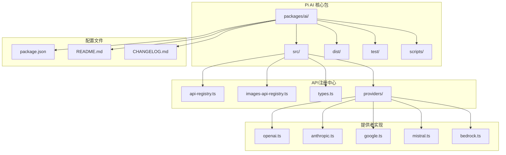
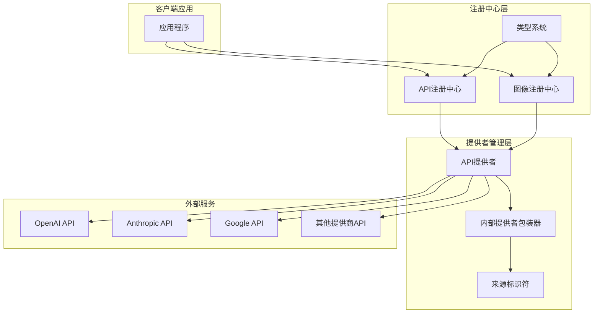
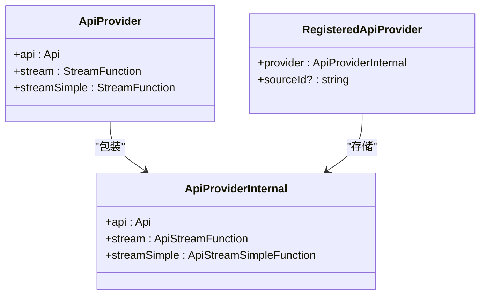
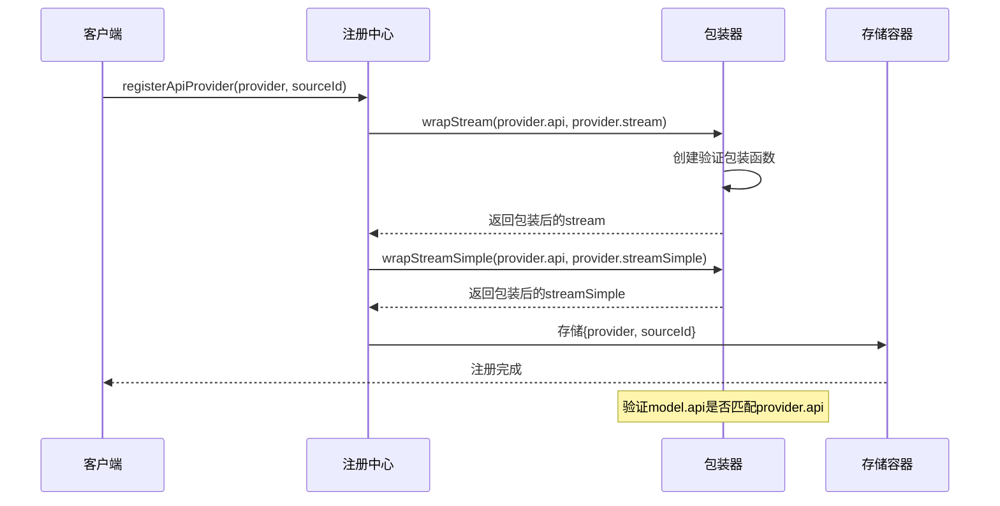
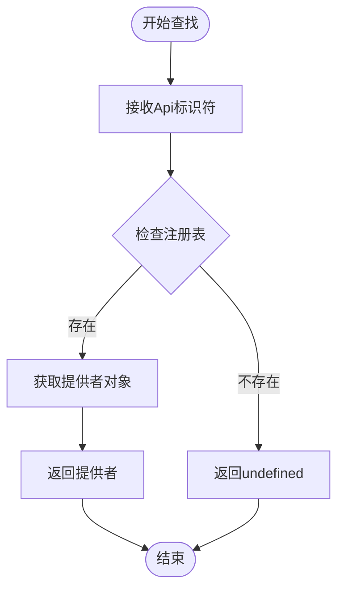
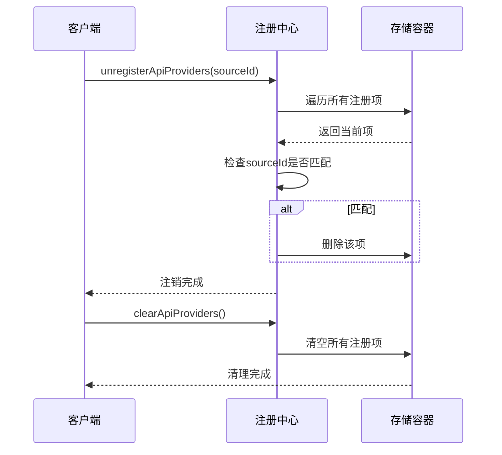
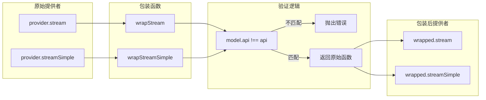
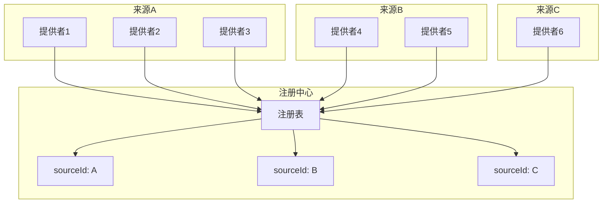
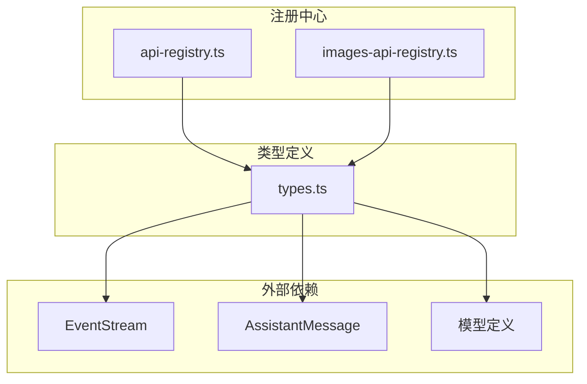

# API提供者注册中心

<cite>
**本文档引用的文件**
- [api-registry.ts](file://packages/ai/src/api-registry.ts)
- [images-api-registry.ts](file://packages/ai/src/images-api-registry.ts)
- [types.ts](file://packages/ai/src/types.ts)
- [README.md](file://packages/ai/README.md)
- [CHANGELOG.md](file://packages/ai/CHANGELOG.md)
- [package.json](file://packages/ai/package.json)
</cite>

## 目录
1. [简介](#简介)
2. [项目结构](#项目结构)
3. [核心组件](#核心组件)
4. [架构概览](#架构概览)
5. [详细组件分析](#详细组件分析)
6. [依赖分析](#依赖分析)
7. [性能考虑](#性能考虑)
8. [故障排除指南](#故障排除指南)
9. [结论](#结论)
10. [附录](#附录)

## 简介

Pi API提供者注册中心是Pi AI统一多提供商API系统的核心基础设施，负责管理各种AI服务提供商的注册、发现和调用。该注册中心实现了标准化的API提供者接口，支持多种AI服务提供商（如OpenAI、Anthropic、Google、Mistral等），并提供了完整的生命周期管理功能。

该系统的核心目标是：
- 提供统一的API抽象层，屏蔽不同提供商的差异
- 实现动态的API提供者注册和注销机制
- 确保API一致性和类型安全
- 支持多来源管理和版本控制

## 项目结构

Pi AI项目采用monorepo架构，API提供者注册中心位于`packages/ai`包中，主要包含以下核心文件：



**图表来源**
- [package.json:1-107](file://packages/ai/package.json#L1-L107)
- [api-registry.ts:1-99](file://packages/ai/src/api-registry.ts#L1-L99)

**章节来源**
- [package.json:1-107](file://packages/ai/package.json#L1-L107)
- [README.md:1-90](file://packages/ai/README.md#L1-L90)

## 核心组件

API提供者注册中心由三个核心组件构成：

### 1. 主API注册中心
- **文件**: `packages/ai/src/api-registry.ts`
- **职责**: 管理文本生成类API提供者的注册和发现
- **特点**: 支持标准流式API和简化流式API两种模式

### 2. 图像API注册中心  
- **文件**: `packages/ai/src/images-api-registry.ts`
- **职责**: 管理图像生成类API提供者的注册和发现
- **特点**: 专门处理图像生成任务，提供异步生成接口

### 3. 类型定义系统
- **文件**: `packages/ai/src/types.ts`
- **职责**: 定义所有API相关的类型系统，包括Api、Provider、Model等
- **特点**: 提供完整的类型安全保证和接口契约

**章节来源**
- [api-registry.ts:23-38](file://packages/ai/src/api-registry.ts#L23-L38)
- [images-api-registry.ts:9-22](file://packages/ai/src/images-api-registry.ts#L9-L22)
- [types.ts:6-65](file://packages/ai/src/types.ts#L6-L65)

## 架构概览

API提供者注册中心采用模块化设计，通过接口抽象和工厂模式实现松耦合的架构：



**图表来源**
- [api-registry.ts:40](file://packages/ai/src/api-registry.ts#L40)
- [images-api-registry.ts:24](file://packages/ai/src/images-api-registry.ts#L24)
- [types.ts:17-65](file://packages/ai/src/types.ts#L17-L65)

## 详细组件分析

### ApiProvider接口定义

ApiProvider是注册中心的核心接口，定义了API提供者必须实现的标准契约：



**图表来源**
- [api-registry.ts:23-38](file://packages/ai/src/api-registry.ts#L23-L38)

**章节来源**
- [api-registry.ts:23-38](file://packages/ai/src/api-registry.ts#L23-L38)
- [types.ts:212-222](file://packages/ai/src/types.ts#L212-L222)

### 注册机制实现

注册中心提供了完整的注册机制，确保API提供者的正确安装和验证：

#### 注册流程序列图



**图表来源**
- [api-registry.ts:66-78](file://packages/ai/src/api-registry.ts#L66-L78)
- [api-registry.ts:42-64](file://packages/ai/src/api-registry.ts#L42-L64)

**章节来源**
- [api-registry.ts:66-78](file://packages/ai/src/api-registry.ts#L66-L78)
- [api-registry.ts:42-64](file://packages/ai/src/api-registry.ts#L42-L64)

### 查找算法实现

注册中心提供了多种查找算法来满足不同的使用场景：

#### 获取单个提供者流程图



**图表来源**
- [api-registry.ts:80-82](file://packages/ai/src/api-registry.ts#L80-L82)

**章节来源**
- [api-registry.ts:80-82](file://packages/ai/src/api-registry.ts#L80-L82)

### 注销流程管理

注册中心支持灵活的注销机制，可以按来源或全部注销API提供者：

#### 注销流程时序图



**图表来源**
- [api-registry.ts:88-98](file://packages/ai/src/api-registry.ts#L88-L98)

**章节来源**
- [api-registry.ts:88-98](file://packages/ai/src/api-registry.ts#L88-L98)

### wrapStream和wrapStreamSimple函数详解

这两个函数是注册中心的核心安全机制，确保API一致性验证：

#### 包装函数架构图



**图表来源**
- [api-registry.ts:42-64](file://packages/ai/src/api-registry.ts#L42-L64)

#### 包装函数实现原理

1. **参数绑定**: 包装函数将provider.api作为闭包变量保存
2. **运行时验证**: 每次调用时检查model.api是否与provider.api匹配
3. **错误处理**: 不匹配时立即抛出明确的错误信息
4. **类型转换**: 将通用类型转换为具体类型，保持类型安全

**章节来源**
- [api-registry.ts:42-64](file://packages/ai/src/api-registry.ts#L42-L64)

### 生命周期管理方法

注册中心提供了完整的生命周期管理功能：

| 方法名 | 参数 | 返回值 | 功能描述 |
|--------|------|--------|----------|
| `registerApiProvider` | provider: ApiProvider, sourceId?: string | void | 注册新的API提供者 |
| `getApiProvider` | api: Api | ApiProviderInternal \| undefined | 获取指定API的提供者 |
| `getApiProviders` | 无 | ApiProviderInternal[] | 获取所有已注册的提供者 |
| `unregisterApiProviders` | sourceId: string | void | 按来源注销提供者 |
| `clearApiProviders` | 无 | void | 清空所有提供者 |

**章节来源**
- [api-registry.ts:66-98](file://packages/ai/src/api-registry.ts#L66-L98)

### sourceId的作用和多来源管理

sourceId是注册中心的重要特性，用于实现多来源管理：

#### 多来源管理架构



**图表来源**
- [api-registry.ts:37](file://packages/ai/src/api-registry.ts#L37)
- [api-registry.ts:88-94](file://packages/ai/src/api-registry.ts#L88-L94)

**章节来源**
- [api-registry.ts:37](file://packages/ai/src/api-registry.ts#L37)
- [api-registry.ts:88-94](file://packages/ai/src/api-registry.ts#L88-L94)

## 依赖分析

API提供者注册中心的依赖关系相对简单，主要依赖于类型定义系统：



**图表来源**
- [api-registry.ts:1-9](file://packages/ai/src/api-registry.ts#L1-L9)
- [images-api-registry.ts:1](file://packages/ai/src/images-api-registry.ts#L1)
- [types.ts:1-5](file://packages/ai/src/types.ts#L1-L5)

**章节来源**
- [api-registry.ts:1-9](file://packages/ai/src/api-registry.ts#L1-L9)
- [images-api-registry.ts:1](file://packages/ai/src/images-api-registry.ts#L1)

## 性能考虑

API提供者注册中心在设计时充分考虑了性能因素：

### 内存管理
- 使用Map数据结构存储注册信息，提供O(1)的查找性能
- 注销机制支持按来源批量清理，避免内存泄漏
- 包装函数使用闭包存储provider.api，减少重复计算

### 类型安全优化
- 编译时类型检查，运行时零成本抽象
- 泛型约束确保API类型的一致性
- 接口契约明确，减少运行时错误

### 扩展性设计
- 插件化架构支持动态加载新提供者
- 松耦合设计便于维护和扩展
- 标准化接口降低集成复杂度

## 故障排除指南

### 常见问题及解决方案

#### 1. API不匹配错误
**问题**: `Mismatched api: ${model.api} expected ${api}`
**原因**: 提供者的api标识符与模型不匹配
**解决方案**: 确保注册时使用的api标识符与模型定义一致

#### 2. 提供者未找到
**问题**: `getApiProvider`返回undefined
**原因**: 提供者未正确注册或已被注销
**解决方案**: 检查注册流程和sourceId配置

#### 3. 内存泄漏
**问题**: 注销后仍占用内存
**原因**: 未正确调用注销方法
**解决方案**: 使用`unregisterApiProviders`或`clearApiProviders`

**章节来源**
- [api-registry.ts:47-61](file://packages/ai/src/api-registry.ts#L47-L61)
- [api-registry.ts:80-82](file://packages/ai/src/api-registry.ts#L80-L82)

## 结论

Pi API提供者注册中心是一个设计精良的系统，它成功地解决了多提供商API集成的核心挑战。通过标准化的接口抽象、严格的类型安全保证和灵活的生命周期管理，该系统为Pi AI平台提供了强大的扩展能力。

关键优势包括：
- **类型安全**: 完整的TypeScript类型系统确保编译时错误检测
- **运行时验证**: 包装函数提供额外的安全层保护
- **灵活管理**: 支持多来源管理和动态注册/注销
- **高性能**: 基于Map的数据结构提供最优的查找性能

该注册中心为未来的扩展奠定了坚实的基础，支持更多AI提供商的无缝集成。

## 附录

### 使用示例

#### 基本注册流程
```typescript
// 1. 定义API提供者
const provider: ApiProvider = {
  api: 'openai-responses',
  stream: openaiStream,
  streamSimple: openaiStreamSimple
};

// 2. 注册提供者
registerApiProvider(provider, 'my-source');

// 3. 获取并使用提供者
const apiProvider = getApiProvider('openai-responses');
```

#### 多来源管理示例
```typescript
// 注册多个来源的提供者
registerApiProvider(provider1, 'builtin');
registerApiProvider(provider2, 'custom');

// 按来源注销
unregisterApiProviders('builtin'); // 只注销内置提供者

// 清空所有提供者
clearApiProviders();
```

### 最佳实践

1. **始终使用sourceId**: 为不同来源的提供者分配唯一的标识符
2. **及时注销**: 在应用关闭或切换环境时及时注销提供者
3. **类型安全**: 利用TypeScript类型系统确保API一致性
4. **错误处理**: 实现适当的错误处理和回退机制
5. **性能监控**: 定期检查注册中心的内存使用情况

**章节来源**
- [README.md:1315-1322](file://packages/ai/README.md#L1315-L1322)
- [CHANGELOG.md:874](file://packages/ai/CHANGELOG.md#L874)