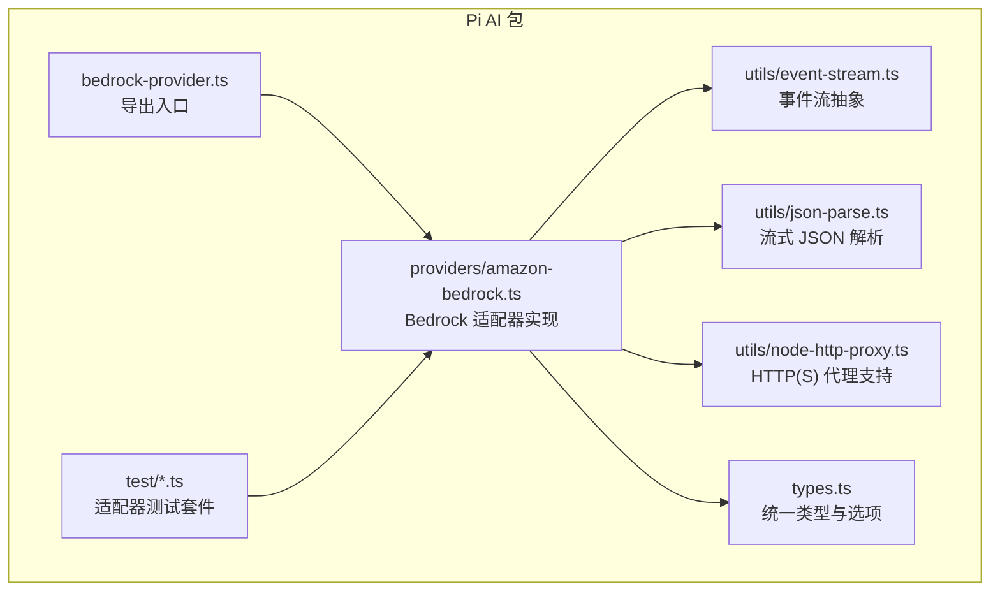
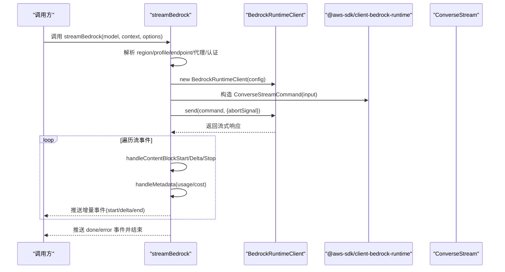
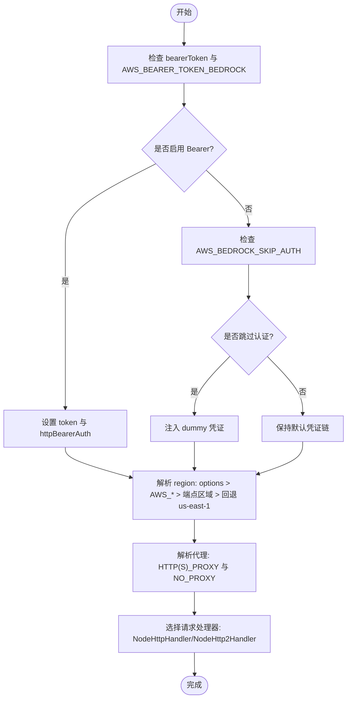
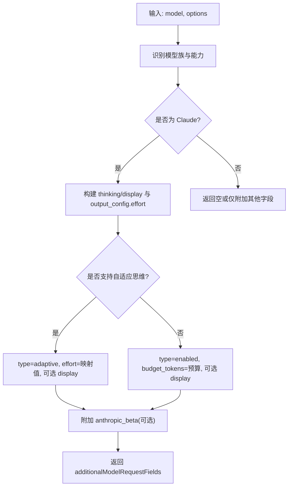
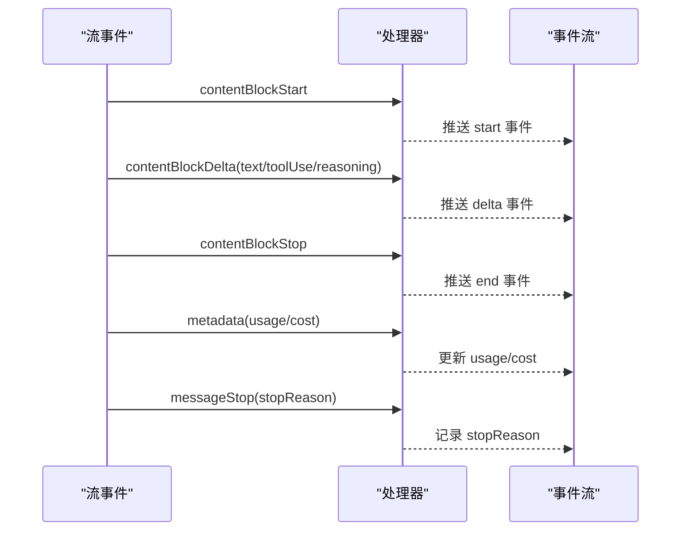
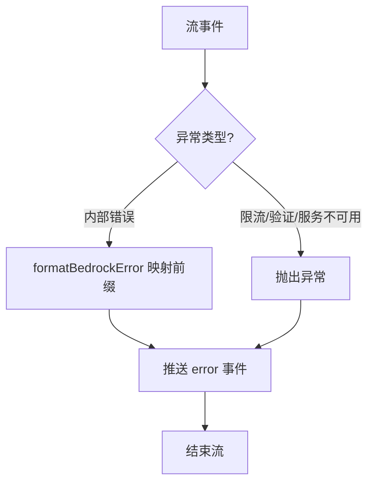
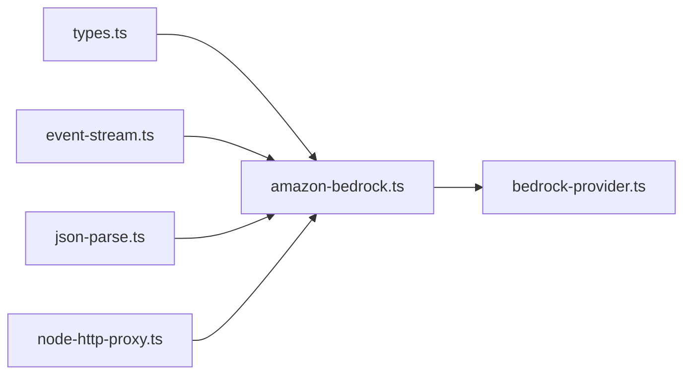

# Amazon Bedrock适配器

<cite>
**本文档引用的文件**
- [amazon-bedrock.ts](file://packages/ai/src/providers/amazon-bedrock.ts)
- [bedrock-provider.ts](file://packages/ai/src/bedrock-provider.ts)
- [types.ts](file://packages/ai/src/types.ts)
- [event-stream.ts](file://packages/ai/src/utils/event-stream.ts)
- [json-parse.ts](file://packages/ai/src/utils/json-parse.ts)
- [node-http-proxy.ts](file://packages/ai/src/utils/node-http-proxy.ts)
- [bedrock-models.test.ts](file://packages/ai/test/bedrock-models.test.ts)
- [bedrock-convert-messages.test.ts](file://packages/ai/test/bedrock-convert-messages.test.ts)
- [bedrock-thinking-payload.test.ts](file://packages/ai/test/bedrock-thinking-payload.test.ts)
- [README.md](file://README.md)
</cite>

## 目录
1. [简介](#简介)
2. [项目结构](#项目结构)
3. [核心组件](#核心组件)
4. [架构总览](#架构总览)
5. [详细组件分析](#详细组件分析)
6. [依赖关系分析](#依赖关系分析)
7. [性能考量](#性能考量)
8. [故障排查指南](#故障排查指南)
9. [结论](#结论)
10. [附录](#附录)

## 简介
本文件为 Pi 项目的 Amazon Bedrock 适配器技术文档，聚焦于 AWS Bedrock 服务的统一接入与流式响应处理。适配器通过 @aws-sdk/client-bedrock-runtime 客户端实现 Bedrock Converse 流式接口，支持：
- 认证配置：支持 SigV4 凭证与 Bearer Token（API Key）两种模式；可绕过签名或使用代理环境变量。
- 区域与端点：智能解析标准端点区域，优先使用自定义 baseUrl；在无显式配置时回退到 us-east-1。
- 模型访问控制：按模型类型区分支持的推理能力（如提示缓存、思维内容、工具调用），并针对不同模型族（Anthropic、Amazon、Meta 等）进行差异化处理。
- 流式响应：事件驱动的增量解析，支持文本、思维内容、工具调用三类内容块的增量传输与最终化。
- 错误与重试：对 Bedrock 运行时异常进行分类与格式化，下游可基于前缀识别服务器错误、限流等场景。
- 成本优化：支持请求元数据标注（requestMetadata）、提示缓存（prompt caching）与思维显示策略（thinkingDisplay）以降低延迟与成本。

## 项目结构
Pi 的多提供方统一 AI 接口位于 packages/ai，Bedrock 适配器主要实现于 providers/amazon-bedrock.ts，配套工具与类型定义位于 utils 与 src 目录下。测试用例覆盖模型可用性、消息转换与思维负载构建等关键路径。

图表来源
- [amazon-bedrock.ts:1-956](file://packages/ai/src/providers/amazon-bedrock.ts#L1-L956)
- [event-stream.ts:1-89](file://packages/ai/src/utils/event-stream.ts#L1-L89)
- [json-parse.ts:1-125](file://packages/ai/src/utils/json-parse.ts#L1-L125)
- [node-http-proxy.ts:1-124](file://packages/ai/src/utils/node-http-proxy.ts#L1-L124)
- [types.ts:1-200](file://packages/ai/src/types.ts#L1-L200)
- [bedrock-provider.ts:1-7](file://packages/ai/src/bedrock-provider.ts#L1-L7)
- [bedrock-models.test.ts:1-67](file://packages/ai/test/bedrock-models.test.ts#L1-L67)

章节来源
- [README.md:25](file://README.md#L25)
- [amazon-bedrock.ts:1-50](file://packages/ai/src/providers/amazon-bedrock.ts#L1-L50)
- [bedrock-provider.ts:1-7](file://packages/ai/src/bedrock-provider.ts#L1-L7)

## 核心组件
- BedrockOptions：统一的流式选项，包含 region/profile、工具选择、思维级别与预算、思维显示策略、请求元数据、Bearer Token 等。
- streamBedrock：主流程函数，负责客户端初始化、消息转换、工具配置、推理参数构建、流式事件处理与错误格式化。
- streamSimpleBedrock：简化版流式封装，自动根据模型能力调整 maxTokens 与思维预算，兼容不同模型族。
- 事件流：AssistantMessageEventStream 提供异步迭代与最终结果提取，支持 start/delta/end/error 等事件类型。
- 工具与解析：parseStreamingJson 支持不完整 JSON 的增量解析；node-http-proxy 提供 HTTP/HTTPS 代理与 NO_PROXY 支持。

章节来源
- [amazon-bedrock.ts:53-85](file://packages/ai/src/providers/amazon-bedrock.ts#L53-L85)
- [amazon-bedrock.ts:89-267](file://packages/ai/src/providers/amazon-bedrock.ts#L89-L267)
- [amazon-bedrock.ts:299-343](file://packages/ai/src/providers/amazon-bedrock.ts#L299-L343)
- [event-stream.ts:69-89](file://packages/ai/src/utils/event-stream.ts#L69-L89)
- [json-parse.ts:104-124](file://packages/ai/src/utils/json-parse.ts#L104-L124)
- [node-http-proxy.ts:113-124](file://packages/ai/src/utils/node-http-proxy.ts#L113-L124)

## 架构总览
适配器在 Node/Bun 环境中通过 @aws-sdk/client-bedrock-runtime 构建 BedrockRuntimeClient，使用 ConverseStreamCommand 发起流式请求。请求前会根据 options 与环境变量解析 region、endpoint、代理与认证方案；流式事件按内容块类型分发到文本、思维与工具调用处理器，并在 metadata 中更新用量与成本。

图表来源
- [amazon-bedrock.ts:117-205](file://packages/ai/src/providers/amazon-bedrock.ts#L117-L205)
- [amazon-bedrock.ts:214-241](file://packages/ai/src/providers/amazon-bedrock.ts#L214-L241)
- [amazon-bedrock.ts:345-467](file://packages/ai/src/providers/amazon-bedrock.ts#L345-L467)
- [amazon-bedrock.ts:426-439](file://packages/ai/src/providers/amazon-bedrock.ts#L426-L439)

## 详细组件分析

### 认证与网络配置
- 凭证与区域解析：优先使用 options.region 或 AWS_REGION/AWS_DEFAULT_REGION；若未配置且存在显式标准端点，则使用端点中的区域；否则回退到 us-east-1。
- Bearer Token：当 options.bearerToken 或 AWS_BEARER_TOKEN_BEDROCK 设置且未禁用时，使用 httpBearerAuth 方案，避免 SigV4 签名。
- 代理支持：通过 createHttpProxyAgentsForTarget 解析 HTTP(S)_PROXY 与 NO_PROXY，支持 HTTP/HTTPS 代理；在需要 HTTP/1.1 的自定义端点时可强制使用 NodeHttpHandler。
- 跳过认证：设置 AWS_BEDROCK_SKIP_AUTH=1 时注入 dummy 凭证，用于特定测试或代理场景。

图表来源
- [amazon-bedrock.ts:136-181](file://packages/ai/src/providers/amazon-bedrock.ts#L136-L181)
- [amazon-bedrock.ts:826-840](file://packages/ai/src/providers/amazon-bedrock.ts#L826-L840)
- [node-http-proxy.ts:91-124](file://packages/ai/src/utils/node-http-proxy.ts#L91-L124)

章节来源
- [amazon-bedrock.ts:136-181](file://packages/ai/src/providers/amazon-bedrock.ts#L136-L181)
- [node-http-proxy.ts:1-124](file://packages/ai/src/utils/node-http-proxy.ts#L1-L124)

### 模型与推理参数
- 模型识别：isAnthropicClaudeModel 通过模型 ID/名称判断是否为 Anthropic Claude；supportsPromptCaching 判断是否支持提示缓存；supportsAdaptiveThinking 识别 Opus/Sonnet 4.6+ 的自适应思维。
- 思维映射：mapThinkingLevelToEffort 将通用思维级别映射为模型支持的 effort 值；supportsNativeXhighEffort 对 Opus 4.7/4.8 支持原生 xhigh。
- 推理配置：buildAdditionalModelRequestFields 构建 additionalModelRequestFields，含 thinking/display、output_config.effort、interleaved-thinking-beta 等；GovCloud 场景下省略 display 字段。
- 请求元数据：requestMetadata 透传至 Bedrock Converse API 的 requestMetadata 字段，便于成本分摊。

图表来源
- [amazon-bedrock.ts:535-545](file://packages/ai/src/providers/amazon-bedrock.ts#L535-L545)
- [amazon-bedrock.ts:559-576](file://packages/ai/src/providers/amazon-bedrock.ts#L559-L576)
- [amazon-bedrock.ts:489-514](file://packages/ai/src/providers/amazon-bedrock.ts#L489-L514)
- [amazon-bedrock.ts:879-926](file://packages/ai/src/providers/amazon-bedrock.ts#L879-L926)

章节来源
- [amazon-bedrock.ts:489-514](file://packages/ai/src/providers/amazon-bedrock.ts#L489-L514)
- [amazon-bedrock.ts:879-926](file://packages/ai/src/providers/amazon-bedrock.ts#L879-L926)

### 流式响应处理
- 内容块事件：contentBlockStart/Delta/Stop 分别对应文本、思维与工具调用的增量与结束；handleContentBlockDelta 对文本与工具调用分别处理；handleContentBlockStop 完成块并清理临时状态。
- 元数据更新：handleMetadata 在流中接收 usage 与 cost 数据，计算总 token 与费用。
- 终止原因：mapStopReason 将 Bedrock stopReason 映射为统一的 stop/reason 类型。

图表来源
- [amazon-bedrock.ts:345-467](file://packages/ai/src/providers/amazon-bedrock.ts#L345-L467)
- [amazon-bedrock.ts:426-439](file://packages/ai/src/providers/amazon-bedrock.ts#L426-L439)
- [amazon-bedrock.ts:811-824](file://packages/ai/src/providers/amazon-bedrock.ts#L811-L824)

章节来源
- [amazon-bedrock.ts:345-467](file://packages/ai/src/providers/amazon-bedrock.ts#L345-L467)
- [amazon-bedrock.ts:426-439](file://packages/ai/src/providers/amazon-bedrock.ts#L426-L439)

### 错误与重试机制
- 异常分类：formatBedrockError 将 BedrockRuntimeServiceException 名称映射为稳定的人类可读前缀，便于下游基于字符串匹配识别错误类别。
- 错误事件：流中遇到 internalServerException、validationException、throttlingException、serviceUnavailableException 等将抛出异常，由外层捕获并转换为 error 事件。
- 重试策略：适配器本身不内置重试逻辑，但通过统一的错误前缀与 stopReason，可配合上层会话逻辑进行条件重试（例如对 server.?error 与 service.?unavailable 进行指数退避重试）。

图表来源
- [amazon-bedrock.ts:275-297](file://packages/ai/src/providers/amazon-bedrock.ts#L275-L297)
- [amazon-bedrock.ts:230-240](file://packages/ai/src/providers/amazon-bedrock.ts#L230-L240)

章节来源
- [amazon-bedrock.ts:275-297](file://packages/ai/src/providers/amazon-bedrock.ts#L275-L297)
- [amazon-bedrock.ts:230-240](file://packages/ai/src/providers/amazon-bedrock.ts#L230-L240)

### 与 @aws-sdk/client-bedrock-runtime 的集成
- 客户端构造：BedrockRuntimeClient 接收 region、endpoint、requestHandler、token/authScheme 等配置；支持自定义端点（如 VPC/代理路由）与 HTTP/1.1 强制切换。
- 命令发送：ConverseStreamCommand 输入包含 modelId/messages/system/inferenceConfig/toolConfig/additionalModelRequestFields/requestMetadata；支持 onPayload/onResponse 钩子。
- 事件消费：通过 for-await-of 遍历流，按事件类型分派处理；metadata 中包含 usage/cost 与请求 ID。

章节来源
- [amazon-bedrock.ts:183-205](file://packages/ai/src/providers/amazon-bedrock.ts#L183-L205)
- [amazon-bedrock.ts:187-198](file://packages/ai/src/providers/amazon-bedrock.ts#L187-L198)

### 不同模型族的参数差异
- Anthropic Claude：支持思维内容与签名、提示缓存、自适应思维（Opus/Sonnet 4.6+）、interleaved-thinking-beta；GovCloud 下 display 字段需省略。
- Amazon Nova：自动缓存，无需显式缓存点。
- 其他模型：不支持 reasoningContent.signature 字段，需降级为纯文本 reasoningContent。

章节来源
- [amazon-bedrock.ts:586-588](file://packages/ai/src/providers/amazon-bedrock.ts#L586-L588)
- [amazon-bedrock.ts:559-576](file://packages/ai/src/providers/amazon-bedrock.ts#L559-L576)
- [amazon-bedrock.ts:889-890](file://packages/ai/src/providers/amazon-bedrock.ts#L889-L890)

## 依赖关系分析
- 外部依赖：@aws-sdk/client-bedrock-runtime、@smithy/node-http-handler、http-proxy-agent/https-proxy-agent。
- 内部依赖：types.ts（统一类型）、event-stream.ts（事件流）、json-parse.ts（流式 JSON 解析）、node-http-proxy.ts（代理）。
- 导出入口：bedrock-provider.ts 导出 streamBedrock 与 streamSimpleBedrock。

图表来源
- [types.ts:1-200](file://packages/ai/src/types.ts#L1-L200)
- [event-stream.ts:1-89](file://packages/ai/src/utils/event-stream.ts#L1-L89)
- [json-parse.ts:1-125](file://packages/ai/src/utils/json-parse.ts#L1-L125)
- [node-http-proxy.ts:1-124](file://packages/ai/src/utils/node-http-proxy.ts#L1-L124)
- [bedrock-provider.ts:1-7](file://packages/ai/src/bedrock-provider.ts#L1-L7)

章节来源
- [bedrock-provider.ts:1-7](file://packages/ai/src/bedrock-provider.ts#L1-L7)

## 性能考量
- 成本优化
  - requestMetadata：通过 requestMetadata 传递成本分配标签，便于在 AWS Cost Explorer 中拆分成本。
  - prompt caching：对支持的 Claude 4.x/3.7 Sonnet/3.5 Haiku 启用缓存点，减少重复 token 消耗；应用推理配置场景可通过环境变量强制启用。
  - thinkingDisplay：将 thinkingDisplay 设为 "omitted" 可跳过思维文本传输，缩短首 token 时间。
- 延迟优化
  - 代理与 HTTP/1.1：在自定义端点需要 HTTP/1.1 时强制使用 NodeHttpHandler；通过代理提升内网可达性。
  - 最大令牌与温度：仅在显式设置时才传入 inferenceConfig.maxTokens/temperature，避免不必要的配额预留。
- 可靠性
  - 错误分类：基于前缀识别 server error、throttling、service unavailable，便于上层做针对性重试。
  - 终止原因映射：统一 stopReason，便于上层做上下文压缩或工具调用处理。

章节来源
- [amazon-bedrock.ts:74-84](file://packages/ai/src/providers/amazon-bedrock.ts#L74-L84)
- [amazon-bedrock.ts:559-576](file://packages/ai/src/providers/amazon-bedrock.ts#L559-L576)
- [amazon-bedrock.ts:318-335](file://packages/ai/src/providers/amazon-bedrock.ts#L318-L335)
- [amazon-bedrock.ts:167-170](file://packages/ai/src/providers/amazon-bedrock.ts#L167-L170)
- [amazon-bedrock.ts:311-315](file://packages/ai/src/providers/amazon-bedrock.ts#L311-L315)

## 故障排查指南
- 认证问题
  - Bearer Token：确认 AWS_BEARER_TOKEN_BEDROCK 或 options.bearerToken 设置正确，且目标身份具备 bedrock:CallWithBearerToken 权限；如需跳过认证，设置 AWS_BEDROCK_SKIP_AUTH=1。
  - SigV4：检查 region/profile/baseUrl 是否冲突；若使用自定义端点，确保未强制 pin 标准端点导致覆盖。
- 代理问题
  - 代理 URL：确保 HTTP(S)_PROXY 格式正确，协议为 http/https；NO_PROXY 配置应遵循逗号或空白分隔规则。
  - HTTP/2：若自定义端点要求 HTTP/1.1，设置 AWS_BEDROCK_FORCE_HTTP1=1。
- 错误识别
  - 查看错误消息前缀：internal server error、throttling error、service unavailable 等，据此决定重试策略。
  - 上游重试：对 server.?error 与 service.?unavailable 实施指数退避与最大重试次数限制。
- 模型能力
  - GovCloud：GovCloud 目标不支持 Claude thinking.display，需省略 display 字段。
  - 应用推理配置：当模型 ARN 不包含模型名时，可通过环境变量强制启用缓存点。

章节来源
- [amazon-bedrock.ts:136-181](file://packages/ai/src/providers/amazon-bedrock.ts#L136-L181)
- [node-http-proxy.ts:91-124](file://packages/ai/src/utils/node-http-proxy.ts#L91-L124)
- [amazon-bedrock.ts:275-297](file://packages/ai/src/providers/amazon-bedrock.ts#L275-L297)
- [amazon-bedrock.ts:889-890](file://packages/ai/src/providers/amazon-bedrock.ts#L889-L890)
- [bedrock-thinking-payload.test.ts:86-113](file://packages/ai/test/bedrock-thinking-payload.test.ts#L86-L113)

## 结论
Pi 的 Amazon Bedrock 适配器通过统一的流式接口与完善的模型能力识别，实现了对多种 Bedrock 模型族的兼容与优化。其特性包括灵活的认证与网络配置、精细化的思维与缓存策略、健壮的错误分类与事件流处理。结合 AWS 成本标签与提示缓存，可在保证质量的同时显著优化成本与时延表现。

## 附录

### 部署与配置要点（概念性）
- 凭证与权限
  - 使用 IAM 角色/用户或 AWS_BEARER_TOKEN_BEDROCK；确保具备 bedrock:InvokeModel 与 bedrock:CallWithBearerToken（如使用 Bearer）。
- 区域与端点
  - 默认回退 us-east-1；若使用自定义端点（如 VPC/代理），确保 baseUrl 正确且与 region/profile 协调。
- 网络
  - 通过 HTTP(S)_PROXY/NO_PROXY 配置代理；必要时启用 AWS_BEDROCK_FORCE_HTTP1=1。
- 安全
  - GovCloud 场景下避免传递 thinking.display；应用推理配置时注意模型名与 ARN 的一致性。

### 监控与指标（概念性）
- 关键指标
  - 请求成功率、平均/第 N 个 token 延迟、总 token 数、缓存命中率、成本分摊（requestMetadata）。
- 建议
  - 结合 AWS CloudWatch 与 Cost Explorer，按模型/标签聚合成本；对 throttling error 与 server error 设置告警并联动重试。

### 测试参考
- 模型可用性测试：在指定区域与凭据满足条件下运行模型列表测试，验证各模型可发起简单请求。
- 消息转换测试：验证未知内容块被跳过而非中断，保障向后兼容。
- 思维负载测试：验证自适应思维与固定预算思维的 payload 构建，以及 GovCloud 场景下的字段省略。

章节来源
- [bedrock-models.test.ts:1-67](file://packages/ai/test/bedrock-models.test.ts#L1-L67)
- [bedrock-convert-messages.test.ts:69-159](file://packages/ai/test/bedrock-convert-messages.test.ts#L69-L159)
- [bedrock-thinking-payload.test.ts:55-114](file://packages/ai/test/bedrock-thinking-payload.test.ts#L55-L114)