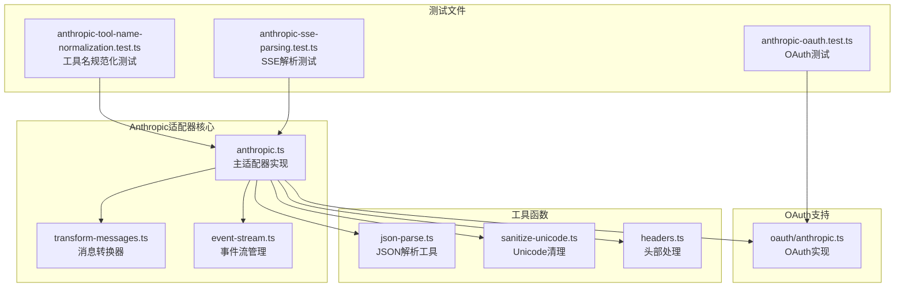
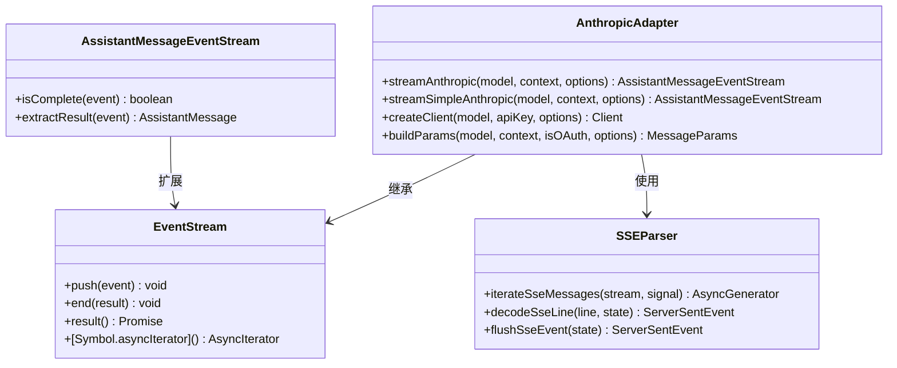
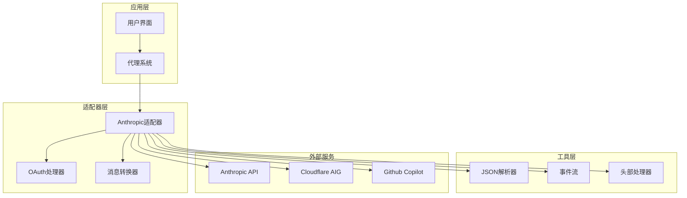
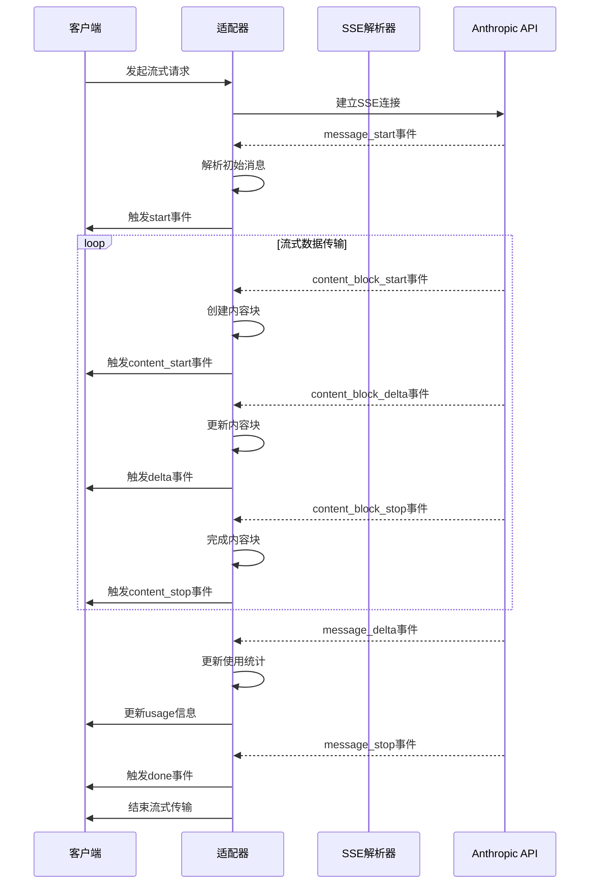
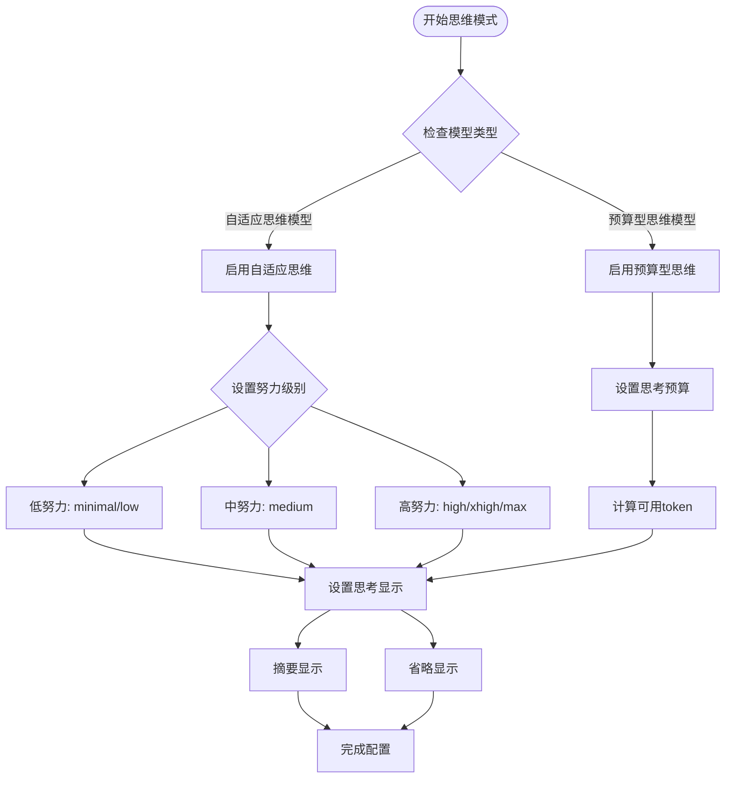
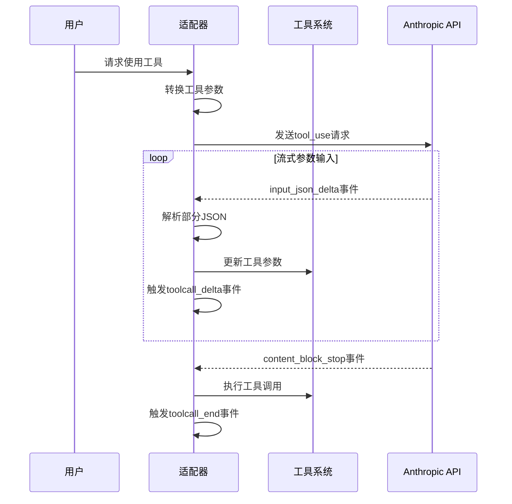
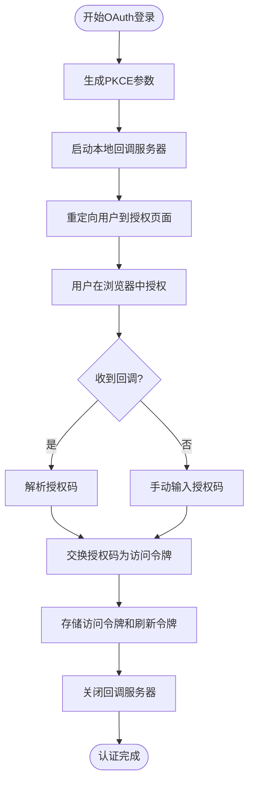
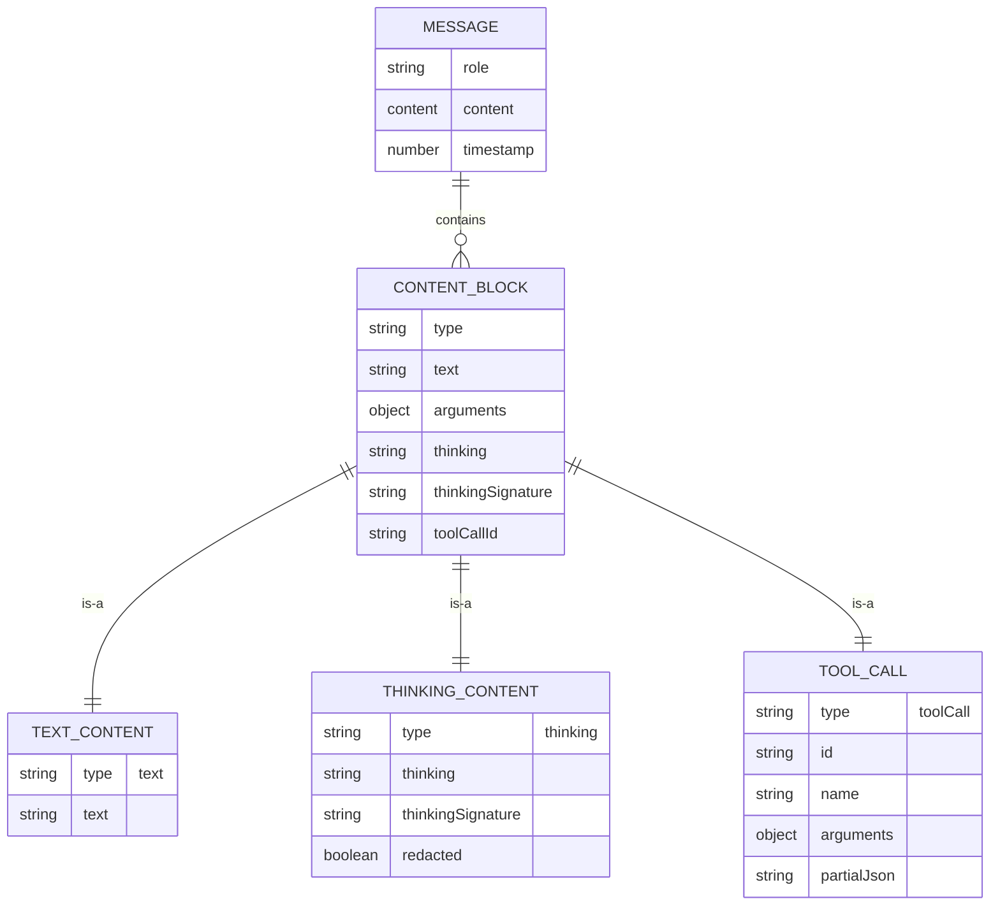
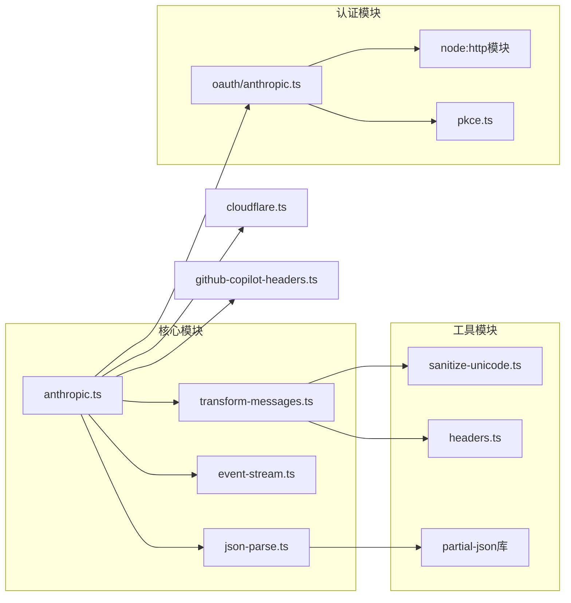

# Anthropic适配器

<cite>
**本文档引用的文件**
- [anthropic.ts](file://packages/ai/src/providers/anthropic.ts)
- [anthropic.ts](file://packages/ai/src/utils/oauth/anthropic.ts)
- [transform-messages.ts](file://packages/ai/src/providers/transform-messages.ts)
- [json-parse.ts](file://packages/ai/src/utils/json-parse.ts)
- [event-stream.ts](file://packages/ai/src/utils/event-stream.ts)
- [anthropic-sse-parsing.test.ts](file://packages/ai/test/anthropic-sse-parsing.test.ts)
- [anthropic-oauth.test.ts](file://packages/ai/test/anthropic-oauth.test.ts)
- [anthropic-tool-name-normalization.test.ts](file://packages/ai/test/anthropic-tool-name-normalization.test.ts)
- [anthropic-adaptive-thinking-models.test.ts](file://packages/ai/test/anthropic-adaptive-thinking-models.test.ts)
- [index.ts](file://packages/coding-agent/examples/extensions/custom-provider-anthropic/index.ts)
</cite>

## 目录
1. [简介](#简介)
2. [项目结构](#项目结构)
3. [核心组件](#核心组件)
4. [架构概览](#架构概览)
5. [详细组件分析](#详细组件分析)
6. [依赖关系分析](#依赖关系分析)
7. [性能考虑](#性能考虑)
8. [故障排除指南](#故障排除指南)
9. [结论](#结论)
10. [附录](#附录)

## 简介

Pi项目的Anthropic适配器是一个完整的Claude AI集成解决方案，专门用于适配Anthropic Claude API的各种特性。该适配器不仅支持标准的文本对话功能，还深度集成了Anthropic的高级特性，包括：

- **思维模式支持**：支持自适应思维和预算型思维两种模式
- **工具调用功能**：完整的tool_use功能支持，包括流式工具输入
- **系统提示词处理**：智能的system prompt管理和缓存控制
- **流式响应处理**：基于Server-Sent Events的实时流式输出
- **OAuth认证支持**：完整的Claude Pro/Max OAuth流程
- **多提供商兼容**：支持API密钥、OAuth令牌、Cloudflare AI Gateway等多种认证方式

该适配器通过统一的接口抽象，为上层应用提供了跨平台、跨模型的一致性体验。

## 项目结构

Anthropic适配器位于Pi项目的`packages/ai`包中，采用模块化设计，主要包含以下核心文件：



**图表来源**
- [anthropic.ts:1-1229](file://packages/ai/src/providers/anthropic.ts#L1-L1229)
- [transform-messages.ts:1-221](file://packages/ai/src/providers/transform-messages.ts#L1-L221)
- [event-stream.ts:1-89](file://packages/ai/src/utils/event-stream.ts#L1-L89)

**章节来源**
- [anthropic.ts:1-1229](file://packages/ai/src/providers/anthropic.ts#L1-L1229)
- [transform-messages.ts:1-221](file://packages/ai/src/providers/transform-messages.ts#L1-L221)

## 核心组件

### 主适配器类

Anthropic适配器的核心是`streamAnthropic`函数，它实现了完整的流式对话功能：



**图表来源**
- [anthropic.ts:448-707](file://packages/ai/src/providers/anthropic.ts#L448-L707)
- [event-stream.ts:69-83](file://packages/ai/src/utils/event-stream.ts#L69-L83)

### 认证配置系统

适配器支持多种认证方式，每种都有特定的配置要求：

| 认证类型 | 配置方式 | 特殊要求 | 使用场景 |
|---------|----------|----------|----------|
| API密钥 | `ANTHROPIC_API_KEY`环境变量 | 标准API密钥格式 | 个人开发、企业部署 |
| OAuth令牌 | Claude Pro/Max账户 | sk-ant-oat开头的令牌 | Claude Pro/Max用户 |
| Cloudflare AI Gateway | 特定网关URL | CF-AIG专用认证头 | Cloudflare生态 |
| GitHub Copilot | 动态头部生成 | 视觉输入支持 | Copilot集成 |

**章节来源**
- [anthropic.ts:474-518](file://packages/ai/src/providers/anthropic.ts#L474-L518)
- [anthropic.ts:780-888](file://packages/ai/src/providers/anthropic.ts#L780-L888)

## 架构概览

Anthropic适配器采用分层架构设计，确保了高度的模块化和可扩展性：



**图表来源**
- [anthropic.ts:1-1229](file://packages/ai/src/providers/anthropic.ts#L1-L1229)
- [oauth/anthropic.ts:1-403](file://packages/ai/src/utils/oauth/anthropic.ts#L1-L403)

## 详细组件分析

### 流式响应处理机制

Anthropic适配器实现了完整的Server-Sent Events (SSE)处理机制：



**图表来源**
- [anthropic.ts:407-446](file://packages/ai/src/providers/anthropic.ts#L407-L446)
- [anthropic.ts:525-691](file://packages/ai/src/providers/anthropic.ts#L525-L691)

### 思维模式支持

适配器支持两种思维模式，针对不同模型版本进行了优化：

#### 自适应思维模式
适用于最新的Claude Opus 4.7+模型，具有以下特点：
- 模型自主决定思考程度
- 支持effort级别控制（low到max）
- 内置交错思维功能
- 智能思考内容显示策略

#### 预算型思维模式
适用于较旧的Claude 4.x模型：
- 基于token预算的思考控制
- 可配置思考预算大小
- 固定的思考内容显示策略
- 向后兼容性保证



**图表来源**
- [anthropic.ts:167-182](file://packages/ai/src/providers/anthropic.ts#L167-L182)
- [anthropic.ts:952-981](file://packages/ai/src/providers/anthropic.ts#L952-L981)

**章节来源**
- [anthropic.ts:160-244](file://packages/ai/src/providers/anthropic.ts#L160-L244)
- [anthropic.ts:952-981](file://packages/ai/src/providers/anthropic.ts#L952-L981)

### 工具调用功能

适配器实现了完整的tool_use功能，支持流式工具输入和输出：

#### 工具名称规范化
对于Claude Code OAuth，适配器会自动进行工具名称规范化：
- 将用户定义的工具名称转换为Claude Code的标准格式
- 在返回时将工具名称还原为原始格式
- 支持Pi内置工具和自定义工具

#### 流式工具输入
适配器支持细粒度工具流式输入，允许工具参数在生成过程中逐步提供：



**图表来源**
- [anthropic.ts:1183-1206](file://packages/ai/src/providers/anthropic.ts#L1183-L1206)
- [anthropic.ts:605-625](file://packages/ai/src/providers/anthropic.ts#L605-L625)

**章节来源**
- [anthropic.ts:97-106](file://packages/ai/src/providers/anthropic.ts#L97-L106)
- [anthropic.ts:1183-1206](file://packages/ai/src/providers/anthropic.ts#L1183-L1206)

### OAuth认证流程

适配器提供了完整的OAuth认证支持，特别针对Claude Pro/Max用户：



**图表来源**
- [oauth/anthropic.ts:230-343](file://packages/ai/src/utils/oauth/anthropic.ts#L230-L343)

**章节来源**
- [oauth/anthropic.ts:1-403](file://packages/ai/src/utils/oauth/anthropic.ts#L1-L403)

### 消息结构转换

适配器实现了跨平台的消息结构转换，确保与Anthropic API的兼容性：



**图表来源**
- [transform-messages.ts:1-221](file://packages/ai/src/providers/transform-messages.ts#L1-L221)

**章节来源**
- [transform-messages.ts:64-220](file://packages/ai/src/providers/transform-messages.ts#L64-L220)

## 依赖关系分析

### 外部依赖

Anthropic适配器依赖以下关键外部库：

| 依赖库 | 版本 | 用途 | 关键功能 |
|--------|------|------|----------|
| @anthropic-ai/sdk | 最新版本 | Anthropic API客户端 | 核心API调用 |
| typebox | 最新版本 | 类型验证 | 运行时类型检查 |
| partial-json | 最新版本 | 流式JSON解析 | 不完整JSON处理 |

### 内部依赖关系



**图表来源**
- [anthropic.ts:1-38](file://packages/ai/src/providers/anthropic.ts#L1-L38)
- [oauth/anthropic.ts:1-12](file://packages/ai/src/utils/oauth/anthropic.ts#L1-L12)

**章节来源**
- [anthropic.ts:1-38](file://packages/ai/src/providers/anthropic.ts#L1-L38)
- [oauth/anthropic.ts:1-12](file://packages/ai/src/utils/oauth/anthropic.ts#L1-L12)

## 性能考虑

### 缓存策略

适配器实现了智能的缓存控制机制：

- **短期缓存**：默认缓存策略，适合一般对话场景
- **长期缓存**：支持1小时持久化缓存，适用于重复对话
- **无缓存模式**：完全禁用缓存，确保隐私安全
- **会话亲和性**：通过特殊头部实现负载均衡器亲和性

### 流式处理优化

为了提高流式响应的性能，适配器采用了多项优化技术：

- **增量JSON解析**：使用partial-json库处理不完整JSON
- **事件缓冲**：智能事件队列管理，避免内存泄漏
- **错误恢复**：自动修复损坏的JSON数据
- **超时控制**：可配置的请求超时和信号中断

### 内存管理

适配器实现了严格的内存管理策略：

- **流式数据处理**：避免将整个响应加载到内存中
- **索引跟踪**：使用index字段跟踪内容块位置
- **资源清理**：及时释放不再使用的资源
- **异常安全**：确保异常情况下资源正确释放

## 故障排除指南

### 常见问题及解决方案

#### SSE连接问题
**症状**：流式响应无法建立或提前结束
**可能原因**：
- 网络连接不稳定
- 代理服务器配置问题
- 超时设置过短

**解决方案**：
- 检查网络连接稳定性
- 配置正确的代理设置
- 增加超时时间设置

#### 工具调用失败
**症状**：工具调用返回错误或参数解析失败
**可能原因**：
- 工具参数格式不正确
- 工具名称不匹配
- 流式JSON解析错误

**解决方案**：
- 验证工具参数schema
- 检查工具名称规范化
- 使用JSON修复功能

#### OAuth认证失败
**症状**：OAuth流程中断或令牌交换失败
**可能原因**：
- 授权码过期
- 状态参数不匹配
- 网络请求超时

**解决方案**：
- 重新发起认证流程
- 检查状态参数一致性
- 增加请求超时时间

### 调试技巧

#### 启用详细日志
```javascript
// 设置调试环境变量
process.env.DEBUG = "anthropic:*"
process.env.DEBUG_DEPTH = "5"
```

#### 监控流式事件
```javascript
const stream = anthropicStream(model, context, options);

stream.on('data', (event) => {
  console.log('事件类型:', event.type);
  console.log('事件数据:', JSON.stringify(event, null, 2));
});

stream.on('error', (error) => {
  console.error('流错误:', error);
});
```

**章节来源**
- [anthropic-sse-parsing.test.ts:1-190](file://packages/ai/test/anthropic-sse-parsing.test.ts#L1-L190)
- [anthropic-oauth.test.ts:1-100](file://packages/ai/test/anthropic-oauth.test.ts#L1-L100)

## 结论

Pi项目的Anthropic适配器是一个功能完整、设计精良的AI集成解决方案。它成功地将复杂的Anthropic API功能抽象为简单易用的接口，同时保持了高度的灵活性和可扩展性。

### 主要优势

1. **全面的功能支持**：涵盖了Anthropic的所有核心功能
2. **优秀的架构设计**：模块化设计便于维护和扩展
3. **强大的错误处理**：完善的错误恢复和诊断机制
4. **高性能实现**：优化的流式处理和内存管理
5. **丰富的测试覆盖**：全面的单元测试和集成测试

### 技术亮点

- 智能的思维模式支持，适应不同模型版本
- 完整的OAuth认证流程，支持Claude Pro/Max用户
- 高效的流式处理机制，提供实时用户体验
- 灵活的消息转换系统，确保跨平台兼容性

该适配器为Pi生态系统提供了强大的AI能力，是构建智能应用的理想选择。

## 附录

### 配置选项参考

#### 基础配置
| 选项 | 类型 | 默认值 | 描述 |
|------|------|--------|------|
| apiKey | string | 从环境变量读取 | Anthropic API密钥 |
| maxTokens | number | 模型默认值 | 最大生成token数 |
| temperature | number | 1.0 | 采样温度 |
| reasoning | "minimal"\|"low"\|"medium"\|"high" | undefined | 思维推理级别 |

#### 高级配置
| 选项 | 类型 | 默认值 | 描述 |
|------|------|--------|------|
| thinkingEnabled | boolean | false | 是否启用思维模式 |
| thinkingBudgetTokens | number | 1024 | 思维预算token数 |
| effort | "low"\|"medium"\|"high"\|"xhigh"\|"max" | undefined | 自适应思维努力级别 |
| thinkingDisplay | "summarized"\|"omitted" | "summarized" | 思维内容显示方式 |
| interleavedThinking | boolean | true | 是否启用交错思维 |
| toolChoice | string\|object | undefined | 工具选择策略 |

#### 认证配置
| 选项 | 类型 | 默认值 | 描述 |
|------|------|--------|------|
| client | Anthropic | 自动生成 | 预构建的Anthropic客户端实例 |
| headers | Record<string,string> | {} | 自定义请求头部 |
| sessionId | string | undefined | 会话ID，用于缓存控制 |
| cacheRetention | "none"\|"short"\|"long" | "short" | 缓存保留策略 |

### 使用示例

#### 基础文本对话
```javascript
const model = getModel("anthropic", "claude-sonnet-4-5");
const context = {
  messages: [
    { role: "user", content: "你好，你能帮我写个简单的程序吗？" }
  ]
};

const stream = streamSimpleAnthropic(model, context, {
  apiKey: process.env.ANTHROPIC_API_KEY,
  maxTokens: 1000
});

for await (const event of stream) {
  if (event.type === "text_delta") {
    process.stdout.write(event.delta);
  }
}
```

#### 启用思维模式
```javascript
const stream = streamSimpleAnthropic(model, context, {
  apiKey: process.env.ANTHROPIC_API_KEY,
  reasoning: "high",
  thinkingDisplay: "omitted"
});
```

#### 使用工具调用
```javascript
const context = {
  messages: [
    { role: "user", content: "请读取文件 /etc/passwd 的内容" }
  ],
  tools: [
    {
      name: "read_file",
      description: "读取文件内容",
      parameters: {
        type: "object",
        properties: {
          path: { type: "string" }
        },
        required: ["path"]
      }
    }
  ]
};

const stream = streamSimpleAnthropic(model, context, {
  apiKey: process.env.ANTHROPIC_API_KEY
});
```

#### OAuth认证使用
```javascript
// 首次登录获取令牌
const credentials = await loginAnthropic({
  onAuth: (info) => console.log("访问:", info.url),
  onPrompt: async () => {
    const code = await getUserInput("请输入授权码:");
    return code;
  }
});

// 使用OAuth令牌进行对话
const stream = streamSimpleAnthropic(model, context, {
  apiKey: credentials.access
});
```