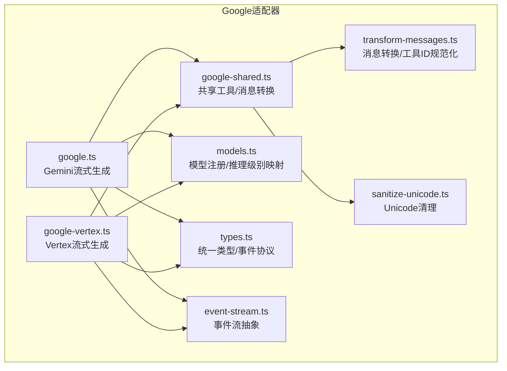
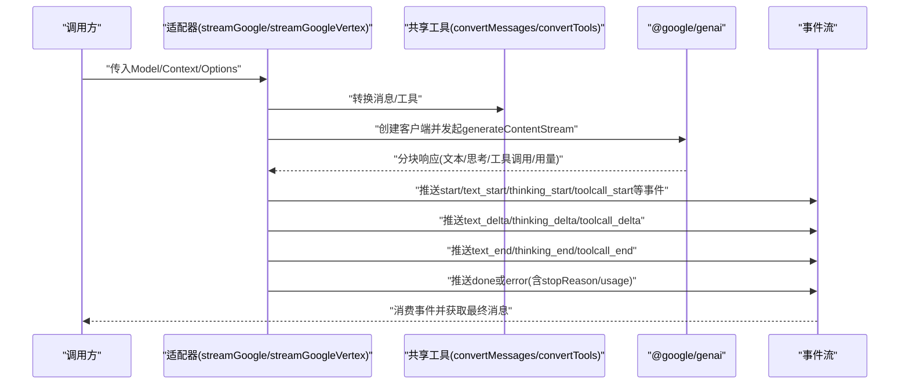
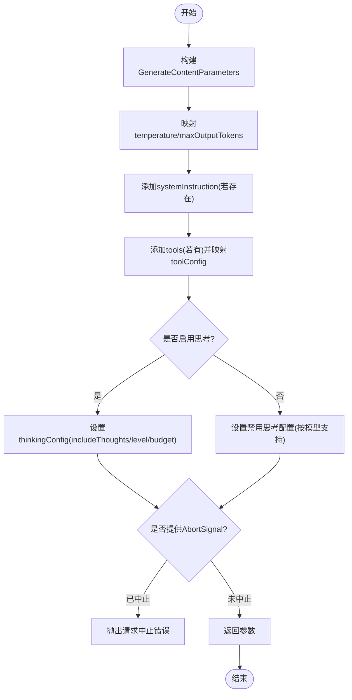
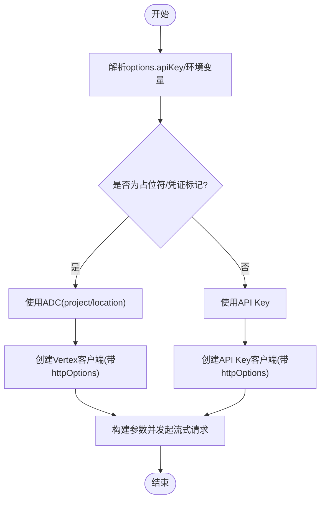
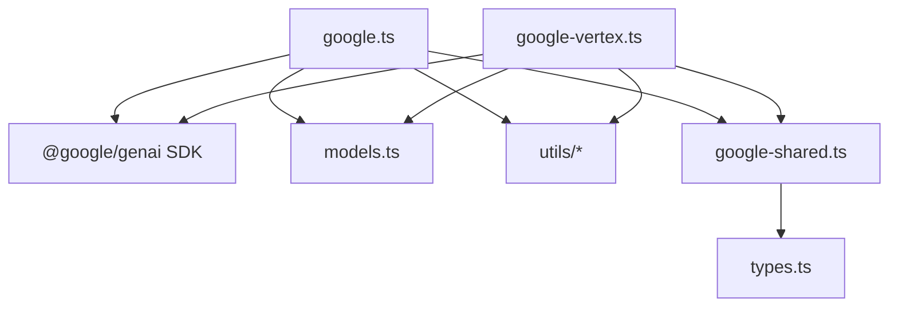

# Google适配器

<cite>
**本文档引用的文件**
- [google.ts](file://packages/ai/src/providers/google.ts)
- [google-vertex.ts](file://packages/ai/src/providers/google-vertex.ts)
- [google-shared.ts](file://packages/ai/src/providers/google-shared.ts)
- [models.ts](file://packages/ai/src/models.ts)
- [types.ts](file://packages/ai/src/types.ts)
- [event-stream.ts](file://packages/ai/src/utils/event-stream.ts)
- [sanitize-unicode.ts](file://packages/ai/src/utils/sanitize-unicode.ts)
- [transform-messages.ts](file://packages/ai/src/providers/transform-messages.ts)
- [google-shared-convert-tools.test.ts](file://packages/ai/test/google-shared-convert-tools.test.ts)
- [google-vertex-api-key-resolution.test.ts](file://packages/ai/test/google-vertex-api-key-resolution.test.ts)
- [package.json](file://packages/ai/package.json)
</cite>

## 目录
1. [简介](#简介)
2. [项目结构](#项目结构)
3. [核心组件](#核心组件)
4. [架构总览](#架构总览)
5. [详细组件分析](#详细组件分析)
6. [依赖关系分析](#依赖关系分析)
7. [性能考虑](#性能考虑)
8. [故障排除指南](#故障排除指南)
9. [结论](#结论)
10. [附录](#附录)

## 简介
本文件为 Pi 项目中 Google 适配器的技术文档，涵盖对 Google Gemini API 的适配实现，包括：
- Vertex AI 集成与认证机制（服务账号、ADC、API Key）
- 模型配置与生成参数映射
- Google 特有的函数调用（工具）能力与多模态输入输出处理
- 安全性设置与内容安全策略处理
- 与 @google/generative-ai SDK 的集成方式（会话管理、历史记录与上下文处理）
- 完整配置示例与使用指南（项目ID、区域、权限）
- 调试技巧与故障排除方法

## 项目结构
Google 适配器位于 packages/ai/src/providers 目录下，核心文件包括：
- google.ts：面向 Gemini API 的流式生成实现
- google-vertex.ts：面向 Vertex AI 的流式生成实现
- google-shared.ts：共享工具与消息转换逻辑
- models.ts：模型注册与推理级别映射
- types.ts：统一类型定义与事件协议
- utils/event-stream.ts：事件流抽象
- utils/sanitize-unicode.ts：Unicode 去除代理字符
- providers/transform-messages.ts：跨模型消息转换与工具调用ID规范化
- 测试文件：验证工具转换与 Vertex API Key 解析行为

图表来源
- [google.ts:1-502](file://packages/ai/src/providers/google.ts#L1-L502)
- [google-vertex.ts:1-569](file://packages/ai/src/providers/google-vertex.ts#L1-L569)
- [google-shared.ts:1-351](file://packages/ai/src/providers/google-shared.ts#L1-L351)
- [transform-messages.ts:1-221](file://packages/ai/src/providers/transform-messages.ts#L1-L221)
- [models.ts:1-93](file://packages/ai/src/models.ts#L1-L93)
- [types.ts:1-592](file://packages/ai/src/types.ts#L1-L592)
- [event-stream.ts:1-89](file://packages/ai/src/utils/event-stream.ts#L1-L89)
- [sanitize-unicode.ts:1-26](file://packages/ai/src/utils/sanitize-unicode.ts#L1-L26)

章节来源
- [google.ts:1-502](file://packages/ai/src/providers/google.ts#L1-L502)
- [google-vertex.ts:1-569](file://packages/ai/src/providers/google-vertex.ts#L1-L569)
- [google-shared.ts:1-351](file://packages/ai/src/providers/google-shared.ts#L1-L351)
- [transform-messages.ts:1-221](file://packages/ai/src/providers/transform-messages.ts#L1-L221)
- [models.ts:1-93](file://packages/ai/src/models.ts#L1-L93)
- [types.ts:1-592](file://packages/ai/src/types.ts#L1-L592)
- [event-stream.ts:1-89](file://packages/ai/src/utils/event-stream.ts#L1-L89)
- [sanitize-unicode.ts:1-26](file://packages/ai/src/utils/sanitize-unicode.ts#L1-L26)

## 核心组件
- 流式生成函数
  - streamGoogle：面向 Gemini API 的流式生成，支持思考块、工具调用、停止原因映射与用量统计。
  - streamGoogleVertex：面向 Vertex AI 的流式生成，支持 API Key 或 ADC 认证、项目/区域解析与自定义基础URL。
- 共享工具
  - convertMessages：将内部消息格式转换为 Gemini Content[]，处理文本、图像、思考块与工具调用。
  - convertTools：将工具定义转换为 Gemini 函数声明格式，支持 parameters 与 parametersJsonSchema。
  - mapToolChoice/mapStopReason：工具选择模式与停止原因映射。
  - isThinkingPart/retainThoughtSignature：识别与保留思考签名，确保多轮上下文连续性。
- 模型与推理级别
  - models.ts 提供模型注册、成本计算与推理级别夹取（clampThinkingLevel）。
- 事件流与消息转换
  - event-stream.ts 提供统一事件流抽象，支持 start/text/thinking/toolcall/done/error 事件。
  - transform-messages.ts 规范化工具调用ID、降级不支持图像的模型、插入孤儿工具调用的合成结果。

章节来源
- [google.ts:48-276](file://packages/ai/src/providers/google.ts#L48-L276)
- [google-vertex.ts:63-293](file://packages/ai/src/providers/google-vertex.ts#L63-L293)
- [google-shared.ts:91-235](file://packages/ai/src/providers/google-shared.ts#L91-L235)
- [google-shared.ts:272-288](file://packages/ai/src/providers/google-shared.ts#L272-L288)
- [google-shared.ts:293-304](file://packages/ai/src/providers/google-shared.ts#L293-L304)
- [google-shared.ts:309-336](file://packages/ai/src/providers/google-shared.ts#L309-L336)
- [models.ts:39-80](file://packages/ai/src/models.ts#L39-L80)
- [event-stream.ts:69-83](file://packages/ai/src/utils/event-stream.ts#L69-L83)
- [transform-messages.ts:64-220](file://packages/ai/src/providers/transform-messages.ts#L64-L220)

## 架构总览
Google 适配器通过统一的流式接口对接 @google/genai SDK，分别支持：
- Gemini API（直接 API Key）
- Vertex AI（API Key 或 ADC，需指定项目与区域）

图表来源
- [google.ts:52-276](file://packages/ai/src/providers/google.ts#L52-L276)
- [google-vertex.ts:67-293](file://packages/ai/src/providers/google-vertex.ts#L67-L293)
- [google-shared.ts:91-235](file://packages/ai/src/providers/google-shared.ts#L91-L235)
- [event-stream.ts:69-83](file://packages/ai/src/utils/event-stream.ts#L69-L83)

## 详细组件分析

### 组件A：Gemini 流式生成（streamGoogle）
- 功能要点
  - 支持温度、最大输出令牌数等生成配置映射。
  - 工具调用：自动为重复或缺失的工具调用ID生成唯一ID，并以事件形式推送增量参数。
  - 思考块：识别 isThinkingPart 并保留 thoughtSignature，支持 MINIMAL/Low/Medium/High 等思考级别。
  - 停止原因：根据 FinishReason 映射为 stop/length/toolUse/error。
  - 用量统计：从 usageMetadata 中提取 prompt/candidates/thoughts 等令牌计数并计算成本。
  - 取消信号：支持 AbortSignal，异常时抛出错误并标记 stopReason。
- 关键流程图（构建参数与思考配置）

图表来源
- [google.ts:336-394](file://packages/ai/src/providers/google.ts#L336-L394)
- [google.ts:367-378](file://packages/ai/src/providers/google.ts#L367-L378)
- [google.ts:410-426](file://packages/ai/src/providers/google.ts#L410-L426)

章节来源
- [google.ts:48-276](file://packages/ai/src/providers/google.ts#L48-L276)
- [google.ts:336-394](file://packages/ai/src/providers/google.ts#L336-L394)
- [google.ts:410-426](file://packages/ai/src/providers/google.ts#L410-L426)

### 组件B：Vertex 流式生成（streamGoogleVertex）
- 功能要点
  - 认证优先级：若提供 API Key 则使用 API Key 客户端；否则使用 ADC（需项目ID与区域）。
  - 自定义基础URL：支持传入 baseUrl，若包含版本路径则不重复追加 apiVersion。
  - 思考配置：与 Gemini 类似，但使用 ThinkingLevel 枚举映射。
  - 工具调用与思考签名：与共享工具一致。
- API Key 解析流程图

图表来源
- [google-vertex.ts:397-403](file://packages/ai/src/providers/google-vertex.ts#L397-L403)
- [google-vertex.ts:409-425](file://packages/ai/src/providers/google-vertex.ts#L409-L425)
- [google-vertex.ts:331-357](file://packages/ai/src/providers/google-vertex.ts#L331-L357)
- [google-vertex.ts:346-357](file://packages/ai/src/providers/google-vertex.ts#L346-L357)

章节来源
- [google-vertex.ts:63-293](file://packages/ai/src/providers/google-vertex.ts#L63-L293)
- [google-vertex.ts:397-425](file://packages/ai/src/providers/google-vertex.ts#L397-L425)
- [google-vertex.ts:331-357](file://packages/ai/src/providers/google-vertex.ts#L331-L357)

### 组件C：共享工具与消息转换（google-shared.ts）
- convertMessages
  - 用户消息：支持纯文本与多模态（文本+图像），图像以 inlineData 形式发送。
  - 助手消息：保留同模型的思考块与签名；跨模型时将思考块转为普通文本。
  - 工具结果：支持文本与图像混合，Gemini 3+ 支持在 functionResponse.parts 中嵌入图像。
- convertTools
  - 默认使用 parametersJsonSchema 支持完整 JSON Schema。
  - 当 useParameters=true 时使用 parameters（OpenAPI 3.03 Schema），用于 Cloud Code Assist。
  - 自动剥离 JSON Schema 元声明（如 $schema、$defs 等）。
- mapToolChoice/mapStopReason
  - 将字符串映射为 FunctionCallingConfigMode/AUTO/NONE/ANY。
  - FinishReason 映射到 stop/length/toolUse/error。
- isThinkingPart/retainThoughtSignature
  - 识别 thought: true 的思考内容，保留 thoughtSignature 以维持多轮上下文。

章节来源
- [google-shared.ts:91-235](file://packages/ai/src/providers/google-shared.ts#L91-L235)
- [google-shared.ts:272-288](file://packages/ai/src/providers/google-shared.ts#L272-L288)
- [google-shared.ts:293-304](file://packages/ai/src/providers/google-shared.ts#L293-L304)
- [google-shared.ts:309-336](file://packages/ai/src/providers/google-shared.ts#L309-L336)
- [google-shared.ts:33-49](file://packages/ai/src/providers/google-shared.ts#L33-L49)

### 组件D：模型与推理级别（models.ts）
- calculateCost：按模型单价与令牌用量计算成本。
- getSupportedThinkingLevels/clampThinkingLevel：根据模型支持情况夹取推理级别，避免越界。

章节来源
- [models.ts:39-80](file://packages/ai/src/models.ts#L39-L80)

### 组件E：事件流与消息转换（event-stream.ts、transform-messages.ts）
- AssistantMessageEventStream：统一事件协议，支持 start/text/thinking/toolcall/done/error。
- transform-messages：
  - 规范化工具调用ID（长度限制、字符集限制）。
  - 不支持图像的模型将图像替换为占位符。
  - 插入孤儿工具调用的合成工具结果，保证 API 合法性。

章节来源
- [event-stream.ts:69-83](file://packages/ai/src/utils/event-stream.ts#L69-L83)
- [transform-messages.ts:64-220](file://packages/ai/src/providers/transform-messages.ts#L64-L220)

## 依赖关系分析
- 外部依赖
  - @google/genai：统一的 Gemini/Vertex SDK，提供 generateContentStream 与 ThinkingConfig。
  - Node 适配器：http-proxy-agent/https-proxy-agent（可选代理）。
- 内部依赖
  - types.ts：统一的类型系统与事件协议。
  - models.ts：模型注册与推理级别映射。
  - utils：事件流、Unicode 清理、消息转换。

图表来源
- [package.json:69-80](file://packages/ai/package.json#L69-L80)
- [google.ts:1-35](file://packages/ai/src/providers/google.ts#L1-L35)
- [google-vertex.ts:1-37](file://packages/ai/src/providers/google-vertex.ts#L1-L37)
- [types.ts:1-592](file://packages/ai/src/types.ts#L1-L592)
- [models.ts:1-93](file://packages/ai/src/models.ts#L1-L93)

章节来源
- [package.json:69-80](file://packages/ai/package.json#L69-L80)
- [google.ts:1-35](file://packages/ai/src/providers/google.ts#L1-L35)
- [google-vertex.ts:1-37](file://packages/ai/src/providers/google-vertex.ts#L1-L37)

## 性能考虑
- 思考预算与级别
  - Gemini 3.x：通过 thinkingConfig.thinkingLevel 控制思考强度。
  - Gemini 2.x：通过 thinkingConfig.thinkingBudget 控制令牌预算，不同模型有预设预算表。
  - clampThinkingLevel 会根据模型支持情况夹取合理级别，避免无效配置。
- 用量统计
  - 使用 usageMetadata 中的 promptTokenCount、candidatesTokenCount、thoughtsTokenCount、cachedContentTokenCount 精确统计输入/输出/缓存读取令牌。
  - calculateCost 将令牌转换为美元成本，便于计费与优化。
- 流式传输
  - 事件驱动的增量推送减少内存占用，适合长对话与大文本生成。

章节来源
- [google.ts:367-378](file://packages/ai/src/providers/google.ts#L367-L378)
- [google.ts:461-501](file://packages/ai/src/providers/google.ts#L461-L501)
- [models.ts:39-46](file://packages/ai/src/models.ts#L39-L46)

## 故障排除指南
- Vertex 认证问题
  - 若 options.apiKey 为占位符或凭证标记，则回退到 ADC；请确认项目ID与区域正确设置。
  - 自定义 baseUrl 不应包含版本路径，否则 SDK 会重复追加 apiVersion。
- 工具调用ID冲突
  - 当上游返回的工具调用ID为空或重复时，适配器会生成唯一ID；请检查工具调用参数增量事件是否正确接收。
- 思考签名与跨模型
  - 跨模型重放时，思考签名会被移除以避免 API 错误；仅同模型保留思考块与签名。
- Unicode 代理字符
  - 输入文本中的未配对代理字符可能导致序列化错误，建议使用 sanitizeSurrogates 进行清理。
- 停止原因与错误
  - FinishReason 为 BLOCKLIST/PROHIBITED_CONTENT/SPII/SAFETY/IMAGE_SAFETY 等时映射为 error；请检查内容安全策略与输入合规性。

章节来源
- [google-vertex.ts:397-425](file://packages/ai/src/providers/google-vertex.ts#L397-L425)
- [google-vertex.ts:380-395](file://packages/ai/src/providers/google-vertex.ts#L380-L395)
- [google.ts:176-201](file://packages/ai/src/providers/google.ts#L176-L201)
- [google-shared.ts:128-156](file://packages/ai/src/providers/google-shared.ts#L128-L156)
- [sanitize-unicode.ts:21-25](file://packages/ai/src/utils/sanitize-unicode.ts#L21-L25)
- [google-shared.ts:309-336](file://packages/ai/src/providers/google-shared.ts#L309-L336)

## 结论
Pi 的 Google 适配器通过统一的事件流与消息转换机制，实现了对 Gemini 与 Vertex 的无缝对接。其特性包括：
- 灵活的认证方式（API Key 与 ADC）
- 完整的工具调用与多模态支持
- 精细的思考配置与预算控制
- 严谨的安全策略与签名保留规则
- 可扩展的事件协议与成本统计

## 附录

### 配置示例与使用指南
- Gemini API（直接 API Key）
  - 选项：apiKey、temperature、maxTokens、toolChoice、thinking.enabled/level/budgetTokens、headers、onPayload/onResponse、sessionId、timeoutMs、maxRetries、metadata 等。
  - 适用场景：本地开发、私有部署或直接使用 Google API Key。
- Vertex AI（API Key 或 ADC）
  - 选项：apiKey、project、location、headers、onPayload、baseUrl（自定义基础URL，注意不要包含版本路径）。
  - 适用场景：企业环境、GCP 项目内调用、服务账号或 ADC 认证。
- 推理级别与预算
  - reasoning: minimal/low/medium/high/xhigh；通过 clampThinkingLevel 夹取可用级别。
  - Gemini 3.x：使用 thinkingLevel；Gemini 2.x：使用 thinkingBudget；不同模型有预设预算表。
- 工具定义
  - parametersJsonSchema 支持完整 JSON Schema；如需兼容 Cloud Code Assist，可使用 parameters（OpenAPI 3.03 Schema）。
  - 自动剥离 JSON Schema 元声明，避免上游不支持字段。
- 多模态输入输出
  - 用户消息支持文本与图像；工具结果支持文本与图像混合。
  - Gemini 3+ 支持在 functionResponse.parts 中嵌入图像；低版本模型会在后续用户消息中附加图像。

章节来源
- [google.ts:36-43](file://packages/ai/src/providers/google.ts#L36-L43)
- [google-vertex.ts:38-47](file://packages/ai/src/providers/google-vertex.ts#L38-L47)
- [google.ts:367-378](file://packages/ai/src/providers/google.ts#L367-L378)
- [google.ts:461-501](file://packages/ai/src/providers/google.ts#L461-L501)
- [google-shared.ts:272-288](file://packages/ai/src/providers/google-shared.ts#L272-L288)
- [google-shared.ts:187-231](file://packages/ai/src/providers/google-shared.ts#L187-L231)

### 调试技巧
- 使用 onPayload/onResponse 钩子检查/修改请求与响应。
- 在 Vertex 模式下，确认 baseUrl 是否包含版本路径，避免重复追加 apiVersion。
- 对于工具调用，关注 toolcall_start/toolcall_delta/toolcall_end 事件，核对 arguments 增量。
- 关注 stopReason 与 errorMessage，结合日志定位错误来源。
- 对于思考块，保留 thoughtSignature 有助于多轮上下文一致性，但跨模型时会被移除。

章节来源
- [google.ts:78-82](file://packages/ai/src/providers/google.ts#L78-L82)
- [google-vertex.ts:96-99](file://packages/ai/src/providers/google-vertex.ts#L96-L99)
- [google-vertex.ts:380-395](file://packages/ai/src/providers/google-vertex.ts#L380-L395)
- [types.ts:353-365](file://packages/ai/src/types.ts#L353-L365)