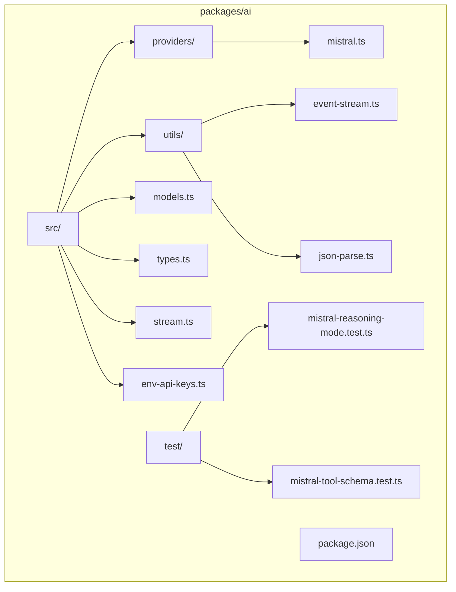
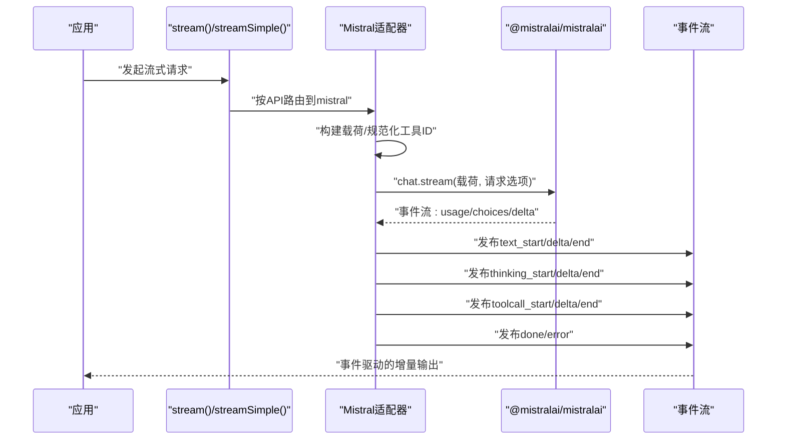
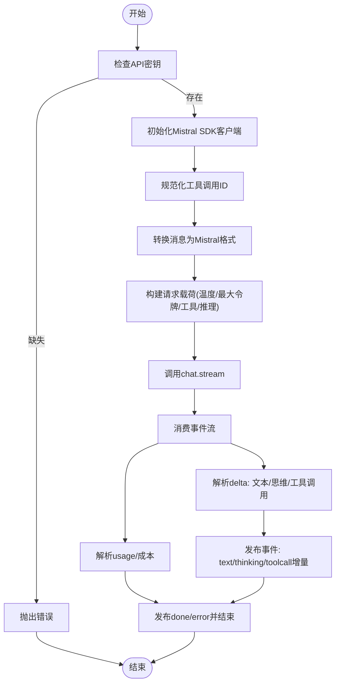
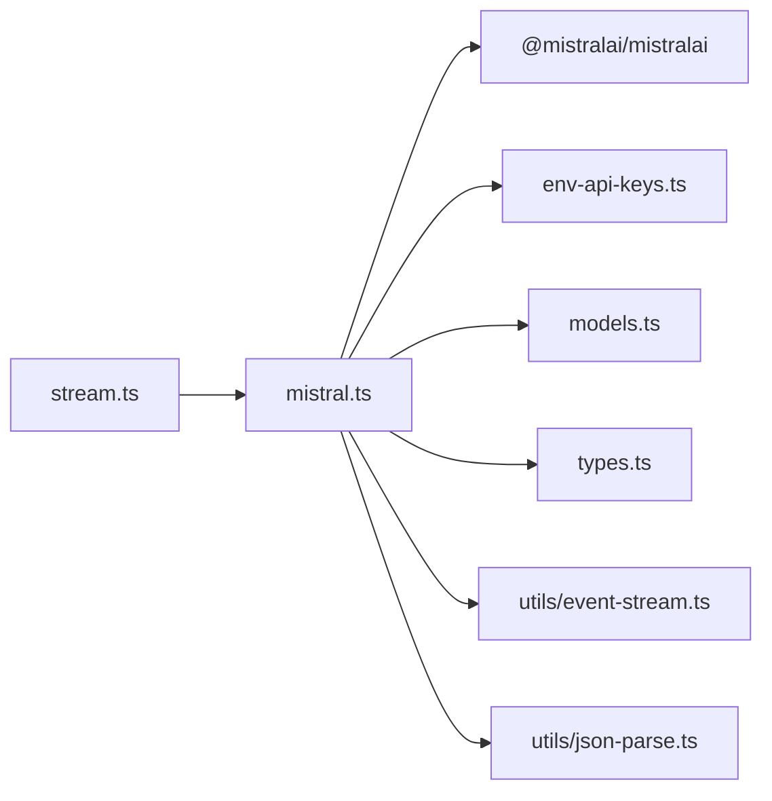

# Mistral适配器

<cite>
**本文引用的文件**
- [mistral.ts](file://packages/ai/src/providers/mistral.ts)
- [mistral-reasoning-mode.test.ts](file://packages/ai/test/mistral-reasoning-mode.test.ts)
- [mistral-tool-schema.test.ts](file://packages/ai/test/mistral-tool-schema.test.ts)
- [models.ts](file://packages/ai/src/models.ts)
- [env-api-keys.ts](file://packages/ai/src/env-api-keys.ts)
- [event-stream.ts](file://packages/ai/src/utils/event-stream.ts)
- [json-parse.ts](file://packages/ai/src/utils/json-parse.ts)
- [stream.ts](file://packages/ai/src/stream.ts)
- [package.json](file://packages/ai/package.json)
</cite>

## 目录
1. [简介](#简介)
2. [项目结构](#项目结构)
3. [核心组件](#核心组件)
4. [架构总览](#架构总览)
5. [详细组件分析](#详细组件分析)
6. [依赖关系分析](#依赖关系分析)
7. [性能考虑](#性能考虑)
8. [故障排查指南](#故障排查指南)
9. [结论](#结论)
10. [附录](#附录)

## 简介
本文件面向Pi平台的Mistral适配器，系统性说明如何将Mistral AI的对话流式接口（chat.stream）无缝接入Pi的统一AI抽象层。内容涵盖：
- 认证配置：API密钥来源与环境变量映射
- 模型选择与参数映射：温度、最大令牌数、工具调用策略、推理模式与推理强度
- Mistral特有能力：聊天模式、工具调用、思维块（thinking）输出、图像输入
- 响应处理：事件流解析、token计数、成本计算
- 与@mistralai/mistralai SDK集成：请求头、会话缓存、超时与重试策略
- 使用示例与配置要点：模型参数、温度、最大令牌数、会话ID
- 性能优化建议与常见问题解决

## 项目结构
Mistral适配器位于Pi的“ai”包中，核心实现集中在providers目录下，配套有通用类型、事件流、JSON解析工具、模型注册与成本计算等模块。

图表来源
- [mistral.ts](file://packages/ai/src/providers/mistral.ts)
- [models.ts](file://packages/ai/src/models.ts)
- [env-api-keys.ts](file://packages/ai/src/env-api-keys.ts)
- [event-stream.ts](file://packages/ai/src/utils/event-stream.ts)
- [json-parse.ts](file://packages/ai/src/utils/json-parse.ts)
- [stream.ts](file://packages/ai/src/stream.ts)
- [package.json](file://packages/ai/package.json)

章节来源
- [package.json:1-107](file://packages/ai/package.json#L1-L107)

## 核心组件
- Mistral流式适配器：封装Mistral SDK的chat.stream，负责构建请求载荷、消费流式事件、标准化输出与错误处理。
- 事件流：统一的异步事件流类，支持文本增量、思维块增量、工具调用参数增量、完成/错误事件。
- 工具Schema清理：在发送前移除TypeBox符号键，避免SDK校验失败。
- 推理模式与推理强度：根据模型能力与用户配置，自动映射到promptMode或reasoningEffort。
- 成本计算：基于模型单价与token用量计算输入/输出/缓存读写成本与总计。

章节来源
- [mistral.ts:49-132](file://packages/ai/src/providers/mistral.ts#L49-L132)
- [event-stream.ts:69-83](file://packages/ai/src/utils/event-stream.ts#L69-L83)
- [json-parse.ts:467-481](file://packages/ai/src/utils/json-parse.ts#L467-L481)
- [models.ts:39-46](file://packages/ai/src/models.ts#L39-L46)

## 架构总览
Pi通过统一的stream/complete接口路由到具体Provider。Mistral适配器负责：
- 解析上下文消息，转换为Mistral的消息结构（含文本、图像、工具调用）
- 构建SDK请求载荷（含工具定义、温度、最大令牌数、工具选择策略、推理模式/强度）
- 调用SDK chat.stream，逐段消费事件流，向事件流发布text/thinking/toolcall增量
- 合并usage与成本，最终产出AssistantMessage

图表来源
- [stream.ts:25-59](file://packages/ai/src/stream.ts#L25-L59)
- [mistral.ts:49-106](file://packages/ai/src/providers/mistral.ts#L49-L106)
- [event-stream.ts:69-83](file://packages/ai/src/utils/event-stream.ts#L69-L83)

## 详细组件分析

### Mistral适配器主流程
- 认证：优先使用options.apiKey；否则从环境变量获取（MISTRAL_API_KEY），若两者都无则抛错。
- 初始化SDK客户端：支持自定义baseUrl（代理/网关场景），并注入请求信号。
- 消息转换：将Pi的Message/Content转换为Mistral的ChatCompletionStreamRequestMessage数组，支持文本、图像、工具调用与思维块。
- 载荷构建：映射温度、最大令牌数、工具选择策略、推理模式与推理强度；可插入系统提示。
- 流消费：逐段解析usage、finishReason与delta内容；区分文本、思维块与工具调用参数增量。
- 结果聚合：合并usage与成本，设置停止原因，返回AssistantMessage事件流。

图表来源
- [mistral.ts:49-106](file://packages/ai/src/providers/mistral.ts#L49-L106)
- [mistral.ts:270-453](file://packages/ai/src/providers/mistral.ts#L270-L453)

章节来源
- [mistral.ts:49-106](file://packages/ai/src/providers/mistral.ts#L49-L106)
- [mistral.ts:241-268](file://packages/ai/src/providers/mistral.ts#L241-L268)
- [mistral.ts:270-453](file://packages/ai/src/providers/mistral.ts#L270-L453)

### 认证与环境变量
- 支持通过options.apiKey显式传入；否则从环境变量MISTRAL_API_KEY读取。
- 在Node/Bun环境下，兼容Bun沙箱中process.env为空的特殊情况，从/proc/self/environ恢复环境变量。
- 对于Google Vertex等其他提供商，另有独立的凭据检测逻辑（与Mistral无关）。

章节来源
- [mistral.ts:60-69](file://packages/ai/src/providers/mistral.ts#L60-L69)
- [env-api-keys.ts:13-24](file://packages/ai/src/env-api-keys.ts#L13-L24)
- [env-api-keys.ts:113-134](file://packages/ai/src/env-api-keys.ts#L113-L134)
- [env-api-keys.ts:35-59](file://packages/ai/src/env-api-keys.ts#L35-L59)

### 模型选择与参数映射
- 温度与最大令牌数：直接映射到SDK请求字段。
- 工具调用策略：支持auto/none/any/required或指定函数名，内部统一封装为SDK期望的结构。
- 推理模式与推理强度：
  - 针对特定模型（如mistral-small-2603、mistral-small-latest、mistral-medium-3.5）使用reasoningEffort。
  - 其他推理模型使用promptMode="reasoning"。
  - 推理等级通过thinkingLevelMap映射为Mistral的字符串值。
- 系统提示：若存在，插入到第一条消息之前。

章节来源
- [mistral.ts:241-268](file://packages/ai/src/providers/mistral.ts#L241-L268)
- [mistral.ts:591-604](file://packages/ai/src/providers/mistral.ts#L591-L604)
- [mistral.ts:595-597](file://packages/ai/src/providers/mistral.ts#L595-L597)
- [mistral.ts:606-617](file://packages/ai/src/providers/mistral.ts#L606-L617)

### Mistral特有能力支持
- 聊天模式：默认使用Mistral对话流式接口。
- 补全模式：本适配器聚焦对话流式接口，不提供独立补全接口。
- 指令遵循：通过系统提示与推理模式/强度实现。
- 图像输入：当模型支持图片时，将图片编码为data URL；不支持时进行提示省略。
- 思维块输出：Mistral支持thinking类型的内容块，适配器将其作为独立事件流发布。
- 工具调用：将Pi的ToolCall映射为Mistral的toolCalls，参数增量通过JSON解析工具修复与容错。

章节来源
- [mistral.ts:483-568](file://packages/ai/src/providers/mistral.ts#L483-L568)
- [mistral.ts:346-385](file://packages/ai/src/providers/mistral.ts#L346-L385)
- [mistral.ts:388-434](file://packages/ai/src/providers/mistral.ts#L388-L434)
- [json-parse.ts:104-124](file://packages/ai/src/utils/json-parse.ts#L104-L124)

### 响应格式、token计数与成本计算
- 响应格式：事件流逐段推送text/thinking/toolcall增量，最后推送done或error。
- token计数：从usage中提取prompt/completion/total，并计算成本。
- 成本计算：基于模型单价（每百万tokens）与实际用量，分别计算输入/输出/缓存读写成本与总计。

章节来源
- [mistral.ts:308-315](file://packages/ai/src/providers/mistral.ts#L308-L315)
- [models.ts:39-46](file://packages/ai/src/models.ts#L39-L46)

### 与@mistralai/mistralai SDK集成
- 客户端初始化：支持自定义baseUrl与API Key；每次请求新建客户端实例，避免共享状态。
- 请求选项：禁用SDK内置重试（strategy: none），支持AbortSignal、自定义Headers与会话ID（x-affinity）。
- 会话缓存：通过sessionId自动设置x-affinity头，启用KV缓存复用（前缀缓存）。
- 错误处理：捕获SDK异常，格式化HTTP状态码与body，截断过长错误信息，保证可读性。

章节来源
- [mistral.ts:66-69](file://packages/ai/src/providers/mistral.ts#L66-L69)
- [mistral.ts:214-239](file://packages/ai/src/providers/mistral.ts#L214-L239)
- [mistral.ts:186-212](file://packages/ai/src/providers/mistral.ts#L186-L212)

### 事件流与工具Schema清理
- 事件流：统一的事件流类，支持异步迭代与最终结果提取；Mistral适配器发布text_start/delta/end、thinking_start/delta/end、toolcall_start/delta/end等事件。
- 工具Schema清理：在发送前递归移除TypeBox符号键，确保SDK校验通过。

章节来源
- [event-stream.ts:69-83](file://packages/ai/src/utils/event-stream.ts#L69-L83)
- [mistral.ts:455-481](file://packages/ai/src/providers/mistral.ts#L455-L481)

### 测试验证点
- 推理模式选择：针对不同模型正确设置promptMode或reasoningEffort，且关闭推理时不附加任何推理控制。
- 工具Schema序列化：TypeBox符号键被清理，嵌套对象属性亦被正确处理。

章节来源
- [mistral-reasoning-mode.test.ts:45-80](file://packages/ai/test/mistral-reasoning-mode.test.ts#L45-L80)
- [mistral-tool-schema.test.ts:17-61](file://packages/ai/test/mistral-tool-schema.test.ts#L17-L61)

## 依赖关系分析
- Mistral适配器依赖：
  - @mistralai/mistralai：SDK客户端与类型定义
  - Pi内部通用模块：env-api-keys（密钥）、models（成本与推理等级）、types（统一类型）、utils（event-stream、json-parse）
  - stream入口：将API路由到具体Provider

图表来源
- [mistral.ts:1-29](file://packages/ai/src/providers/mistral.ts#L1-L29)
- [stream.ts:1-14](file://packages/ai/src/stream.ts#L1-L14)

章节来源
- [package.json:74-74](file://packages/ai/package.json#L74-L74)
- [stream.ts:1-14](file://packages/ai/src/stream.ts#L1-L14)

## 性能考虑
- 会话缓存复用：通过sessionId设置x-affinity头，利用Mistral基础设施的KV缓存（前缀缓存）提升重复请求命中率。
- 禁用SDK重试：避免在上层统一处理重试时出现重复请求与资源浪费。
- 流式增量处理：仅在必要时解析与拼接增量，减少内存峰值。
- 工具调用参数解析：使用部分JSON解析与修复策略，降低因流式片段导致的解析失败风险。
- 超时与取消：通过AbortSignal中断长时间无响应的请求，释放资源。

章节来源
- [mistral.ts:228-232](file://packages/ai/src/providers/mistral.ts#L228-L232)
- [mistral.ts:214-239](file://packages/ai/src/providers/mistral.ts#L214-L239)
- [json-parse.ts:104-124](file://packages/ai/src/utils/json-parse.ts#L104-L124)

## 故障排查指南
- 无API密钥：若未在options.apiKey或环境变量中配置，将抛出明确错误。请确认MISTRAL_API_KEY已设置或在调用时传入。
- SDK错误格式化：若SDK返回HTTP状态码与body，适配器会格式化为可读错误；若body过长会截断，便于日志定位。
- 工具Schema校验失败：确保工具Schema不含TypeBox符号键；适配器在发送前会清理。
- 图像不支持：当模型不支持图片时，会提示“图像省略”，请切换支持图片的模型或移除图片内容。
- 推理模式未生效：确认所选模型是否支持promptMode或reasoningEffort；不同模型映射规则不同。

章节来源
- [mistral.ts:60-63](file://packages/ai/src/providers/mistral.ts#L60-L63)
- [mistral.ts:186-212](file://packages/ai/src/providers/mistral.ts#L186-L212)
- [mistral-tool-schema.test.ts:18-61](file://packages/ai/test/mistral-tool-schema.test.ts#L18-L61)
- [mistral.ts:503-505](file://packages/ai/src/providers/mistral.ts#L503-L505)
- [mistral-reasoning-mode.test.ts:46-80](file://packages/ai/test/mistral-reasoning-mode.test.ts#L46-L80)

## 结论
Pi的Mistral适配器以最小侵入的方式整合了@mistralai/mistralai SDK，提供了统一的事件流体验与完善的参数映射。通过会话缓存、严格的错误处理与工具Schema清理，适配器在易用性与稳定性之间取得良好平衡。配合推理模式与工具调用能力，能够覆盖从基础对话到复杂推理与工具编排的多种场景。

## 附录

### 使用示例与配置要点
- 基础流式对话
  - 传入模型与上下文，设置temperature与maxTokens
  - 可选：sessionId用于开启会话缓存；headers用于自定义请求头
- 工具调用
  - 在上下文中提供tools，适配器会自动转换为Mistral的FunctionTool定义
  - 支持toolChoice策略：auto/none/any/required或指定函数名
- 推理模式
  - 通过SimpleStreamOptions的reasoning字段开启推理
  - 适配器会根据模型能力自动选择promptMode或reasoningEffort
- 成本与token
  - 适配器自动从usage中提取prompt/completion/total并计算成本
  - 可通过模型的cost字段与usage进行核对

章节来源
- [mistral.ts:241-268](file://packages/ai/src/providers/mistral.ts#L241-L268)
- [mistral.ts:455-465](file://packages/ai/src/providers/mistral.ts#L455-L465)
- [models.ts:39-46](file://packages/ai/src/models.ts#L39-L46)