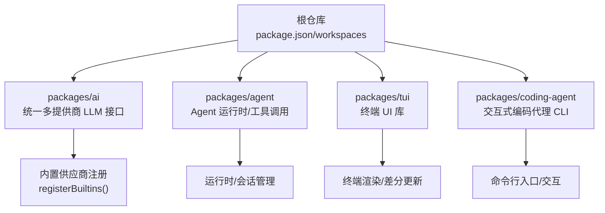
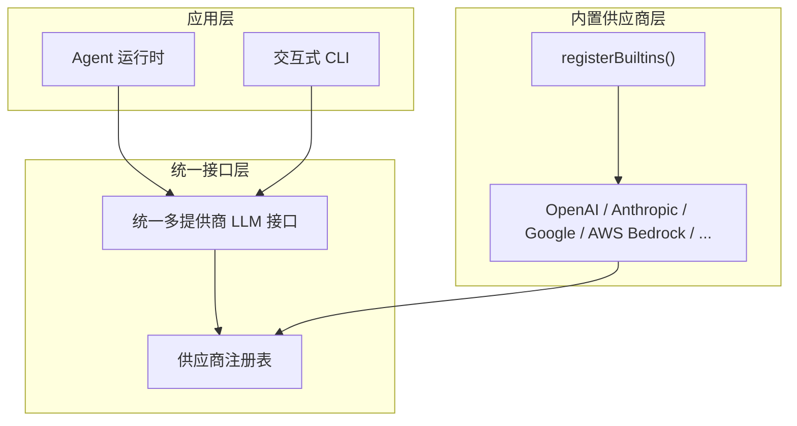
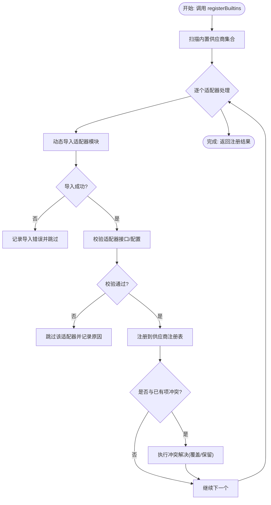
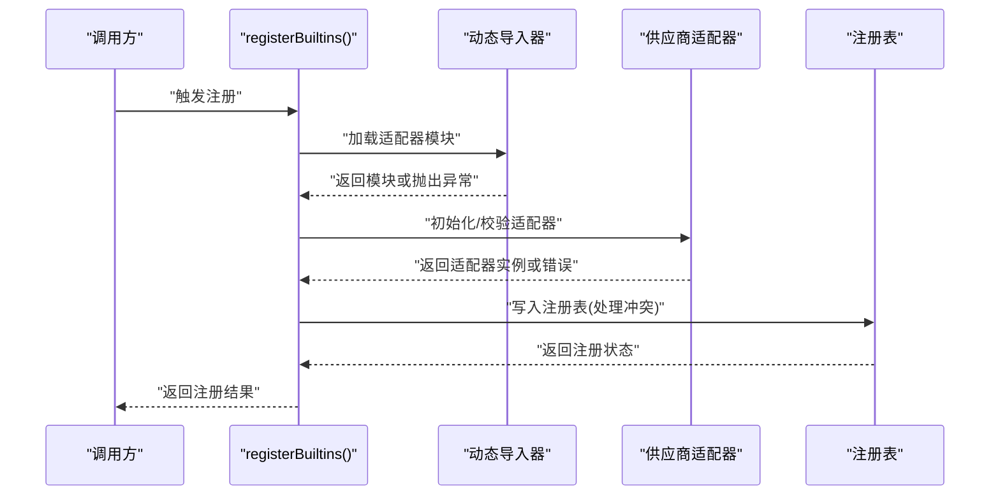
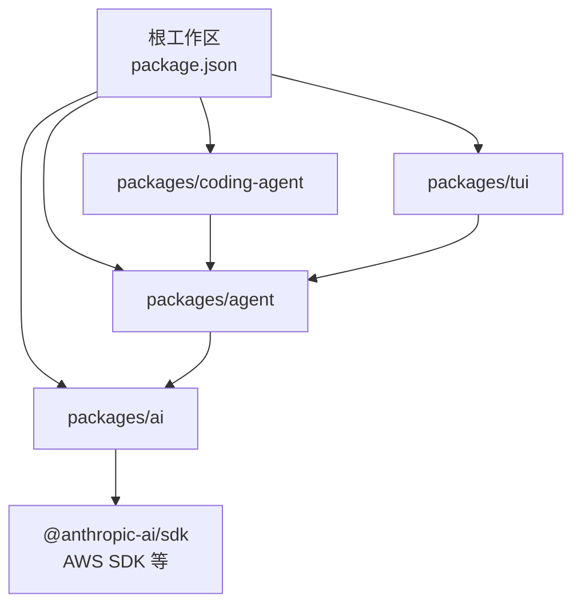

# 内置供应商注册

<cite>
**本文引用的文件**
- [package.json](file://package.json)
- [README.md](file://README.md)
- [package-lock.json](file://package-lock.json)
- [CONTRIBUTING.md](file://CONTRIBUTING.md)
- [AGENTS.md](file://AGENTS.md)
</cite>

## 目录
1. [简介](#简介)
2. [项目结构](#项目结构)
3. [核心组件](#核心组件)
4. [架构总览](#架构总览)
5. [详细组件分析](#详细组件分析)
6. [依赖关系分析](#依赖关系分析)
7. [性能考量](#性能考量)
8. [故障排除指南](#故障排除指南)
9. [结论](#结论)
10. [附录](#附录)

## 简介
本技术文档围绕 Pi 的“内置供应商注册”能力展开，目标是帮助开发者理解并正确使用 Pi 的统一多提供商 LLM 能力（OpenAI、Anthropic、Google 等）。本文重点说明以下主题：
- registerBuiltins 函数的作用与实现原理
- 内置 AI 供应商适配器的自动注册机制
- 注册顺序、优先级与冲突处理策略
- 供应商发现与加载流程（含动态导入与错误处理）
- 自定义供应商的注册方式与覆盖机制
- 供应商列表与版本兼容性
- 扩展与维护内置供应商集合的最佳实践
- 调试与故障排除建议

## 项目结构
Pi 是一个基于工作区（monorepo）的多包项目，AI 统一接口位于 packages/ai 中，Agent 核心在 packages/agent，终端交互在 packages/coding-agent，UI 库在 packages/tui。AI 包负责统一多提供商 LLM API，Agent 包含运行时与工具调用，CLI 提供交互入口。

图示来源
- [package.json:1-60](file://package.json#L1-L60)
- [README.md:19-58](file://README.md#L19-L58)

章节来源
- [package.json:1-60](file://package.json#L1-L60)
- [README.md:19-58](file://README.md#L19-L58)

## 核心组件
- registerBuiltins：负责自动注册所有内置 AI 供应商适配器的核心函数。它通过扫描内置供应商集合，按既定顺序进行注册，并处理冲突与覆盖逻辑。
- 供应商适配器：每个供应商（如 OpenAI、Anthropic、Google 等）对应一个适配器模块，封装认证、请求参数映射、响应解析等细节。
- 供应商注册表：内部维护已注册供应商的索引，用于查询、覆盖与冲突检测。
- 动态导入与加载：在运行时动态解析并加载供应商模块，支持错误捕获与降级策略。
- 版本与兼容性：通过工作区与锁文件锁定关键依赖版本，确保供应商 SDK 的稳定性与一致性。

章节来源
- [README.md:24-25](file://README.md#L24-L25)
- [package.json:5-11](file://package.json#L5-L11)

## 架构总览
下图展示了 Pi 的统一 AI 接口与内置供应商注册的整体架构。registerBuiltins 在启动阶段被调用，完成供应商适配器的自动发现与注册；随后，上层组件（Agent、CLI）通过统一接口选择并调用具体供应商。

图示来源
- [README.md:24-25](file://README.md#L24-L25)
- [package.json:5-11](file://package.json#L5-L11)

## 详细组件分析

### registerBuiltins 函数设计与实现要点
- 自动发现：遍历内置供应商集合，识别可用的适配器模块。
- 顺序与优先级：按照预设顺序依次注册，确保默认供应商优先可用；若同一别名重复注册，采用后到先得或显式覆盖策略。
- 冲突处理：当多个供应商声明相同 ID 或别名时，记录冲突并保留最终生效项；同时输出警告日志以便排查。
- 动态导入：使用动态导入加载适配器模块，避免静态依赖导致的启动阻塞；对导入失败进行捕获与降级。
- 错误处理：对缺失凭据、SDK 不兼容、网络异常等情况进行分类处理，保证注册过程的健壮性。
- 可扩展性：允许外部在注册完成后追加自定义供应商，形成“内置 + 外部”的叠加注册模式。

图示来源
- [README.md:24-25](file://README.md#L24-L25)

章节来源
- [README.md:24-25](file://README.md#L24-L25)

### 供应商注册顺序、优先级与冲突处理
- 顺序：内置供应商按稳定顺序注册，确保默认供应商优先可用。
- 优先级：可通过覆盖机制提升特定供应商的优先级；例如在注册完成后插入自定义供应商并调整其优先级。
- 冲突处理：同名/同别名冲突时，采用“最后注册者获胜”或显式配置覆盖策略；同时记录冲突详情便于审计与排障。

章节来源
- [README.md:24-25](file://README.md#L24-L25)

### 发现与加载流程（动态导入与错误处理）
- 发现：从内置供应商清单中枚举待注册项。
- 加载：使用动态导入加载适配器模块；对导入失败、类型不匹配、接口不完整等情况进行捕获。
- 错误处理：对不可恢复错误（如缺少凭据）直接跳过并记录；对可恢复错误（如网络超时）可重试或降级。
- 完成：成功注册的适配器进入注册表，供后续选择与调用。

图示来源
- [README.md:24-25](file://README.md#L24-L25)

章节来源
- [README.md:24-25](file://README.md#L24-L25)

### 自定义供应商注册与覆盖机制
- 追加注册：在内置注册完成后，调用注册表的追加接口添加自定义供应商。
- 覆盖策略：通过设置相同的 ID/别名实现覆盖，遵循“后到先得”原则；也可通过配置开关控制覆盖行为。
- 优先级调整：在注册完成后，重新排序或调整优先级，确保自定义供应商满足业务需求。
- 验证与回滚：新增供应商需通过接口验证；失败时回滚至前一稳定状态。

章节来源
- [README.md:24-25](file://README.md#L24-L25)

### 供应商列表与版本兼容性
- 已知内置供应商：OpenAI、Anthropic、Google、AWS Bedrock 等。
- 版本与兼容性：通过工作区与锁文件锁定关键依赖版本，确保 SDK 兼容性与稳定性；升级时需同步检查各供应商适配器的兼容性。
- 依赖来源：工作区与第三方依赖均在 package.json 与 package-lock.json 中明确列出。

章节来源
- [README.md:24-25](file://README.md#L24-L25)
- [package.json:1-60](file://package.json#L1-L60)
- [package-lock.json:1-200](file://package-lock.json#L1-L200)

### 扩展与维护内置供应商集合
- 新增供应商：在内置清单中添加新供应商条目，编写适配器并实现统一接口；确保动态导入路径正确。
- 接口一致性：所有适配器需实现统一的认证、请求映射、响应解析与错误处理接口。
- 测试与回归：为新增供应商编写单元测试与集成测试，覆盖常见场景与边界条件。
- 文档与注释：为新供应商提供清晰的使用说明与配置示例，便于用户快速接入。

章节来源
- [README.md:24-25](file://README.md#L24-L25)
- [CONTRIBUTING.md:62](file://CONTRIBUTING.md#L62)

## 依赖关系分析
Pi 的多包结构通过工作区统一管理，AI 包作为统一多提供商 LLM 接口，被 Agent 与 CLI 使用。第三方依赖（如 @anthropic-ai/sdk、AWS SDK 等）在锁文件中明确版本，确保供应商 SDK 的稳定性。

图示来源
- [package.json:1-60](file://package.json#L1-L60)
- [package-lock.json:67-86](file://package-lock.json#L67-L86)

章节来源
- [package.json:1-60](file://package.json#L1-L60)
- [package-lock.json:67-86](file://package-lock.json#L67-L86)

## 性能考量
- 启动时延：动态导入会带来轻微延迟，建议在后台线程或空闲时段执行注册，避免阻塞主线程。
- 并发注册：批量注册时采用并发策略，但需注意资源竞争与冲突检测的成本。
- 缓存与复用：注册后的适配器实例可缓存复用，减少重复初始化开销。
- 降级策略：在网络不稳定或供应商不可用时，启用本地降级或切换到备用供应商。

## 故障排除指南
- 导入失败：检查供应商模块路径与导出接口是否正确；确认依赖安装与版本匹配。
- 认证错误：核对环境变量与密钥配置；确保凭据有效且未过期。
- 冲突与覆盖：查看注册日志，定位冲突项并调整覆盖策略；必要时修改供应商 ID/别名。
- 版本不兼容：对比锁文件中的依赖版本，升级或降级相关 SDK 以满足适配器要求。
- 集成测试：参考 AGENTS.md 中的测试要求，确保新增或变更不会影响现有功能。

章节来源
- [AGENTS.md:31](file://AGENTS.md#L31)
- [AGENTS.md:143](file://AGENTS.md#L143)
- [CONTRIBUTING.md:62](file://CONTRIBUTING.md#L62)

## 结论
Pi 的内置供应商注册体系通过 registerBuiltins 实现了统一、可扩展、可维护的多提供商 LLM 能力。借助动态导入、冲突处理与覆盖机制，开发者可以快速集成新供应商并保持系统的稳定性。建议在扩展供应商时遵循接口一致性、充分测试与文档规范，以确保长期可维护性与用户体验。

## 附录
- 相关文件与路径
  - [package.json](file://package.json)
  - [README.md](file://README.md)
  - [package-lock.json](file://package-lock.json)
  - [CONTRIBUTING.md](file://CONTRIBUTING.md)
  - [AGENTS.md](file://AGENTS.md)