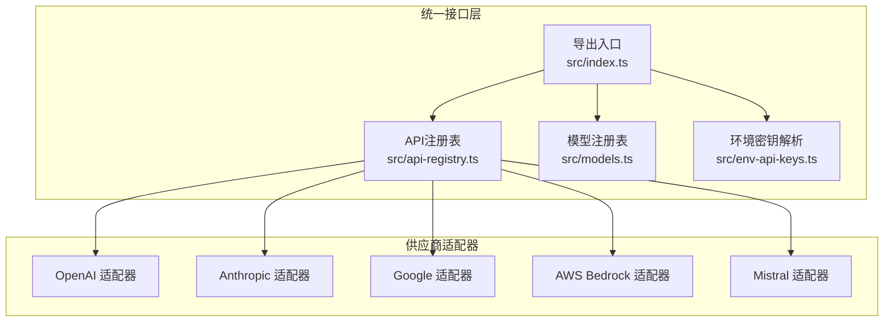
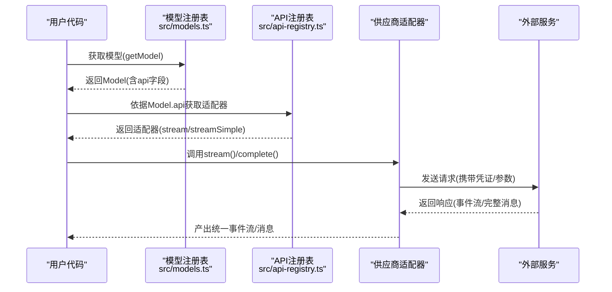
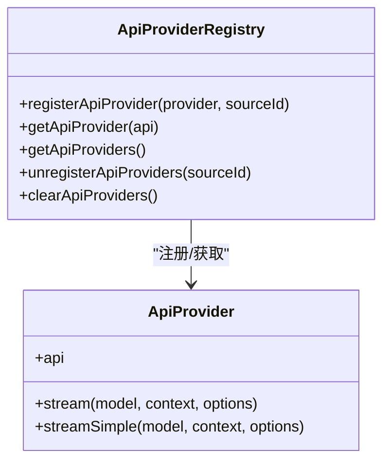
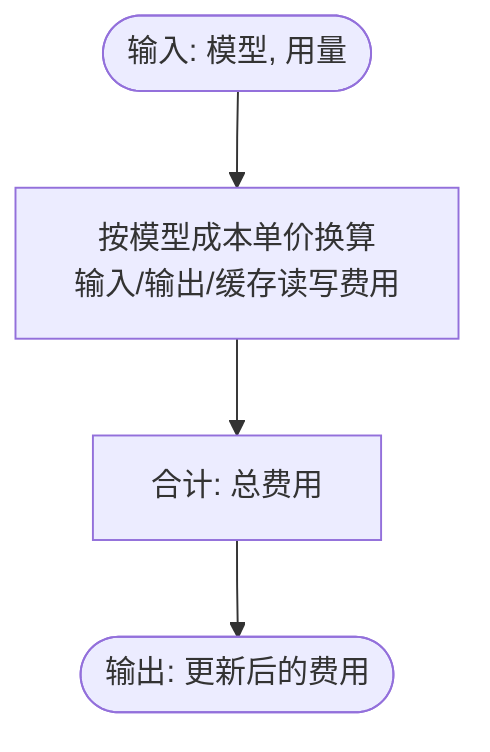
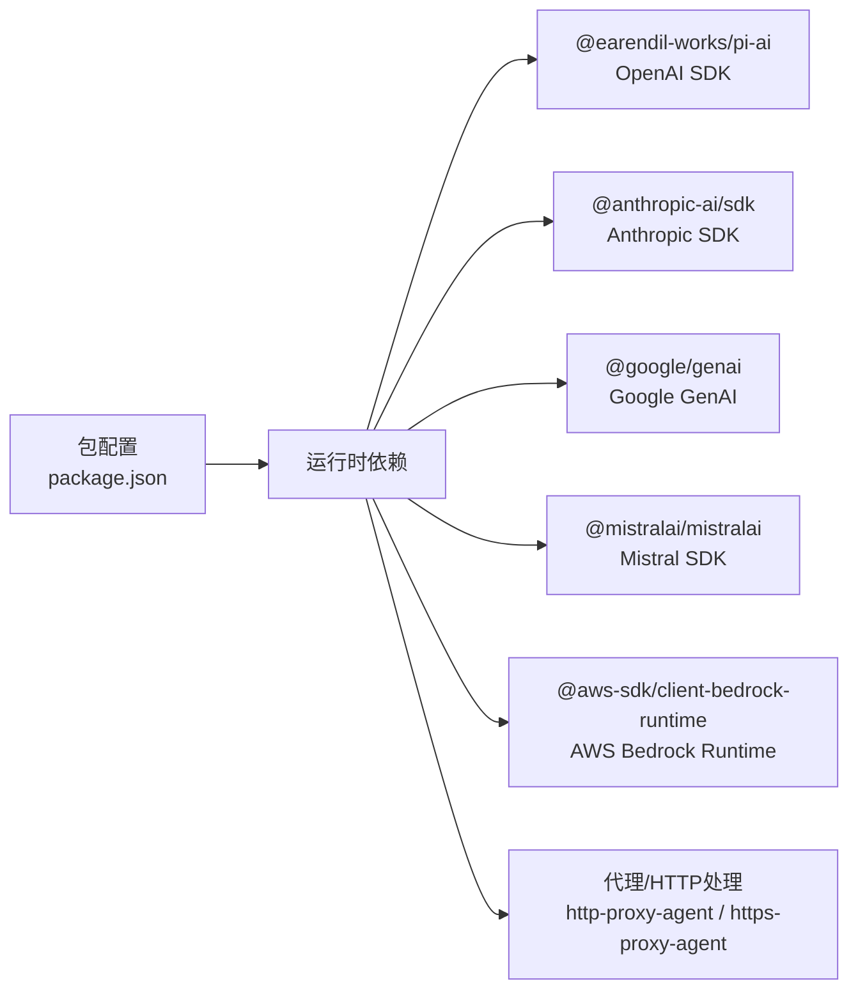

# 多供应商适配器

<cite>
**本文引用的文件**
- [packages/ai/package.json](file://packages/ai/package.json)
- [packages/ai/README.md](file://packages/ai/README.md)
- [packages/ai/src/index.ts](file://packages/ai/src/index.ts)
- [packages/ai/src/api-registry.ts](file://packages/ai/src/api-registry.ts)
- [packages/ai/src/env-api-keys.ts](file://packages/ai/src/env-api-keys.ts)
- [packages/ai/src/models.ts](file://packages/ai/src/models.ts)
</cite>

## 目录
1. [简介](#简介)
2. [项目结构](#项目结构)
3. [核心组件](#核心组件)
4. [架构总览](#架构总览)
5. [详细组件分析](#详细组件分析)
6. [依赖分析](#依赖分析)
7. [性能考虑](#性能考虑)
8. [故障排查指南](#故障排查指南)
9. [结论](#结论)
10. [附录](#附录)

## 简介
本文件面向Pi多供应商适配器系统，系统性梳理统一LLM API的设计与实现，重点覆盖以下方面：
- 各AI供应商适配器（OpenAI、Anthropic、Google、AWS Bedrock、Mistral等）的适配方案与特性支持
- 适配器的注册机制与发现流程，如何动态加载与管理不同供应商实现
- 供应商特有能力：如Anthropic的思考模式、Google的函数调用、AWS Bedrock的流式处理等
- 适配器开发指南：如何为新供应商创建适配器
- 性能对比与选择建议

该系统以“统一接口 + 供应商API适配层”的方式，屏蔽底层差异，向上提供一致的事件流、工具调用、推理/思考能力与成本统计。

## 项目结构
- 核心包位于 packages/ai，采用模块化导出与类型安全设计
- 通过模型注册表与API注册表实现“模型发现 + 适配器发现”
- 提供环境变量解析与凭证检测，支持多种认证方式（API Key、OAuth、ADC、AWS凭据等）
- README涵盖安装、快速开始、工具调用、图像输入/生成、推理/思考、停止原因、错误处理、OAuth、API/模型/供应商等完整主题

图表来源
- [packages/ai/src/index.ts:1-48](file://packages/ai/src/index.ts#L1-L48)
- [packages/ai/src/api-registry.ts:1-99](file://packages/ai/src/api-registry.ts#L1-L99)
- [packages/ai/src/models.ts:1-93](file://packages/ai/src/models.ts#L1-L93)
- [packages/ai/src/env-api-keys.ts:1-211](file://packages/ai/src/env-api-keys.ts#L1-L211)

章节来源
- [packages/ai/package.json:1-107](file://packages/ai/package.json#L1-L107)
- [packages/ai/README.md:1-800](file://packages/ai/README.md#L1-L800)

## 核心组件
- 统一导出入口：集中导出API注册、环境密钥、图片模型、图片API、模型、类型、流、OAuth类型等
- API注册表：负责注册/获取/注销API适配器，确保按API维度绑定具体实现
- 模型注册表：基于生成的模型清单，提供按供应商检索模型、计算用量与费用、推理级别映射等功能
- 环境密钥解析：提供API Key与OAuth令牌的自动发现与凭证检测，支持Vertex AI ADC、AWS多类凭据等

章节来源
- [packages/ai/src/index.ts:1-48](file://packages/ai/src/index.ts#L1-L48)
- [packages/ai/src/api-registry.ts:1-99](file://packages/ai/src/api-registry.ts#L1-L99)
- [packages/ai/src/models.ts:1-93](file://packages/ai/src/models.ts#L1-L93)
- [packages/ai/src/env-api-keys.ts:1-211](file://packages/ai/src/env-api-keys.ts#L1-L211)

## 架构总览
系统采用“模型注册表 + API注册表 + 供应商适配器”的分层架构：
- 模型注册表：提供模型发现、推理级别映射、成本计算
- API注册表：提供适配器注册、按API检索、按来源注销
- 适配器层：针对不同供应商实现统一的流式/非流式接口，暴露统一事件流与内容块

图表来源
- [packages/ai/src/models.ts:20-37](file://packages/ai/src/models.ts#L20-L37)
- [packages/ai/src/api-registry.ts:80-86](file://packages/ai/src/api-registry.ts#L80-L86)

## 详细组件分析

### API注册表与适配器发现
- 注册：registerApiProvider将API标识与对应的stream/streamSimple绑定，内部进行API一致性校验包装
- 发现：getApiProvider按API标识返回适配器；getApiProviders返回全部已注册适配器；unregisterApiProviders按来源ID批量注销；clearApiProviders清空
- 作用：将“模型的api”与“具体适配器实现”解耦，便于扩展新供应商

图表来源
- [packages/ai/src/api-registry.ts:23-99](file://packages/ai/src/api-registry.ts#L23-L99)

章节来源
- [packages/ai/src/api-registry.ts:1-99](file://packages/ai/src/api-registry.ts#L1-L99)

### 模型注册表与推理级别映射
- 初始化：从生成的模型清单构建内存注册表，按供应商与模型ID索引
- 查询：getModel/getProviders/getModels提供模型发现能力
- 成本：calculateCost按每百万token计费标准计算输入/输出/缓存读写费用
- 推理：getSupportedThinkingLevels/clampThinkingLevel对不同模型的推理级别进行映射与裁剪

图表来源
- [packages/ai/src/models.ts:39-46](file://packages/ai/src/models.ts#L39-L46)

章节来源
- [packages/ai/src/models.ts:1-93](file://packages/ai/src/models.ts#L1-L93)

### 环境密钥解析与凭证检测
- API Key发现：findEnvKeys根据供应商映射返回可用环境变量名集合
- 凭证获取：getEnvApiKey优先返回显式API Key；对特定供应商返回“已认证占位符”，用于触发下游认证路径
- 特殊场景：
  - Vertex AI：检测ADC凭据与项目/区域配置
  - AWS Bedrock：检测AWS_PROFILE、IAM密钥、Bearer Token、ECS/IRSA等凭据
- 行为：在Node/Bun环境下尝试从/proc/self/environ恢复被沙箱破坏的进程环境

章节来源
- [packages/ai/src/env-api-keys.ts:91-211](file://packages/ai/src/env-api-keys.ts#L91-L211)

### 供应商适配器概览与特性支持
- OpenAI系列：OpenAI Completions、OpenAI Responses、OpenAI Codex Responses、Azure OpenAI Responses
- Anthropic：Messages API，支持思考模式（Thinking），可配置启用与预算
- Google/Gemini：Generative AI API、Vertex AI API，支持函数调用、推理/思考
- Mistral：Conversations API
- AWS Bedrock：Converse流式API，支持流式处理
- 其他：DeepSeek、Groq、Cerebras、Cloudflare、xAI、OpenRouter、MiniMax、Together AI、GitHub Copilot（OAuth）、Fireworks/Kimi/Xiaomi（兼容Anthropic API）

章节来源
- [packages/ai/README.md:51-77](file://packages/ai/README.md#L51-L77)
- [packages/ai/README.md:697-714](file://packages/ai/README.md#L697-L714)
- [packages/ai/package.json:13-52](file://packages/ai/package.json#L13-L52)

### 适配器开发指南（新增供应商）
- 步骤
  1) 定义适配器API标识与选项类型（参考现有OpenAI/Anthropic/Google/Mistral/Bedrock）
  2) 实现stream与streamSimple两个函数，遵循统一事件流协议（文本/思考/工具调用/完成/错误等）
  3) 在初始化阶段调用registerApiProvider(api, { api, stream, streamSimple })完成注册
  4) 在模型清单中补充该供应商的模型定义（由生成脚本维护）
  5) 在环境密钥解析中添加该供应商的API Key环境变量映射
  6) 如需OAuth或ADC等特殊认证，完善getEnvApiKey分支逻辑
- 关键点
  - 严格校验Model.api与注册API一致
  - 事件流必须保证内容块索引(contentIndex)正确，避免跨块错配
  - 对不支持的特性（如某些模型不支持推理/思考）应静默忽略或返回默认行为
  - 工具调用参数解析需兼容部分JSON流（Partial JSON），并提供验证工具

章节来源
- [packages/ai/src/api-registry.ts:66-78](file://packages/ai/src/api-registry.ts#L66-L78)
- [packages/ai/src/env-api-keys.ts:91-134](file://packages/ai/src/env-api-keys.ts#L91-L134)
- [packages/ai/src/models.ts:15-26](file://packages/ai/src/models.ts#L15-L26)

### 供应商特性支持要点
- Anthropic思考模式
  - 支持开启与预算限制；适合需要展示内部推理过程的场景
- Google函数调用与推理
  - 支持函数调用与推理/思考；注意与Responses API的差异
- AWS Bedrock流式处理
  - 使用Converse流式API，适合实时交互与低延迟场景
- OpenAI兼容设置
  - 支持多种兼容端点（Ollama/vLLM/LM Studio等），便于本地部署与边缘计算

章节来源
- [packages/ai/README.md:532-561](file://packages/ai/README.md#L532-L561)
- [packages/ai/README.md:563-583](file://packages/ai/README.md#L563-L583)
- [packages/ai/README.md:709-709](file://packages/ai/README.md#L709-L709)

## 依赖分析
- 运行时依赖覆盖主流供应商SDK与通用网络代理库
- 包导出结构清晰，支持按功能子包导入（如./anthropic、./google、./bedrock-provider等）
- Node版本要求较高，确保现代ES模块与实验特性可用

图表来源
- [packages/ai/package.json:69-80](file://packages/ai/package.json#L69-L80)

章节来源
- [packages/ai/package.json:1-107](file://packages/ai/package.json#L1-L107)

## 性能考虑
- 流式处理优先：在需要实时反馈的场景（如工具调用参数预览、思考内容展示）使用stream/streamSimple
- 事件顺序与内容块索引：不同内容块的start/delta/end可能交错，消费者需按contentIndex关联
- 停止原因与中断：支持正常结束、长度截断、工具调用等待、错误与中止；中止后可续传上下文
- 成本与用量：统一的Usage与费用计算，便于成本控制与优化

章节来源
- [packages/ai/README.md:371-391](file://packages/ai/README.md#L371-L391)
- [packages/ai/README.md:585-596](file://packages/ai/README.md#L585-L596)
- [packages/ai/README.md:611-681](file://packages/ai/README.md#L611-L681)
- [packages/ai/src/models.ts:39-46](file://packages/ai/src/models.ts#L39-L46)

## 故障排查指南
- 错误事件与中止
  - 流式API在错误/中止时发出error事件，包含reason与部分内容；最终消息的stopReason指示失败原因
- 中止后继续对话
  - 将中止消息加入上下文并追加用户提示，继续后续请求
- 调试请求负载
  - 使用onPayload回调打印发送到供应商的请求体，定位格式问题
- 认证问题
  - 检查findEnvKeys/getEnvApiKey返回值，确认环境变量是否正确设置；对Vertex AI与AWS Bedrock分别检查ADC与多类凭据

章节来源
- [packages/ai/README.md:597-696](file://packages/ai/README.md#L597-L696)
- [packages/ai/src/env-api-keys.ts:143-211](file://packages/ai/src/env-api-keys.ts#L143-L211)

## 结论
Pi多供应商适配器系统通过统一接口与注册机制，实现了对多家供应商的无缝集成。其优势在于：
- 统一事件流与内容块模型，屏蔽供应商差异
- 完整的工具调用、推理/思考、图像输入/生成能力
- 灵活的注册与注销机制，便于扩展新供应商
- 严谨的成本与用量统计，便于资源控制

在实际选型中，可根据以下维度权衡：
- 实时性：Bedrock流式与Anthropic思考模式适合高交互场景
- 功能完备性：Google/Gemini在函数调用与推理上表现突出
- 部署灵活性：OpenAI兼容端点适合本地/边缘部署
- 成本敏感度：结合模型单价与用量统计进行优化

## 附录
- 快速开始与示例参见README中的“快速开始”与“工具调用”章节
- 模型清单与供应商列表参见README“支持的供应商”与“API/模型/供应商”章节
- 导出子包与CLI入口参见package.json的exports与bin字段

章节来源
- [packages/ai/README.md:87-207](file://packages/ai/README.md#L87-L207)
- [packages/ai/README.md:51-77](file://packages/ai/README.md#L51-L77)
- [packages/ai/README.md:697-714](file://packages/ai/README.md#L697-L714)
- [packages/ai/package.json:8-56](file://packages/ai/package.json#L8-L56)