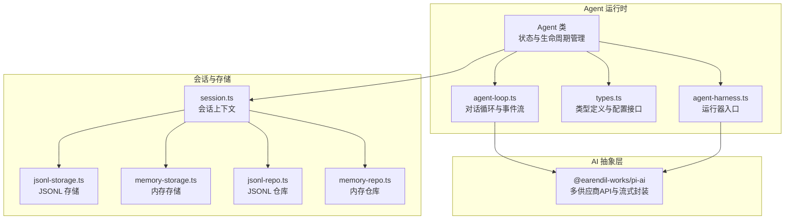
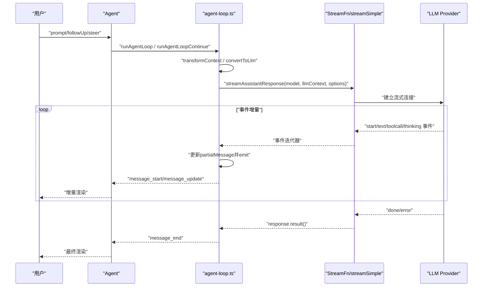
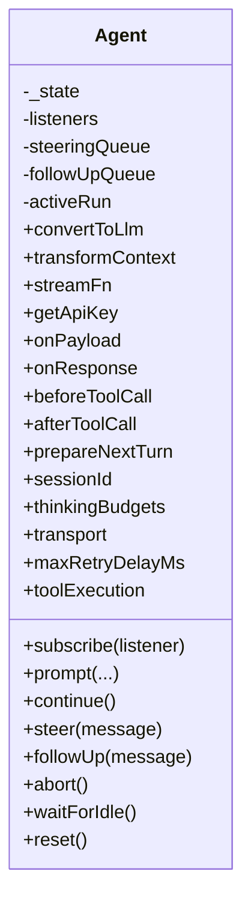
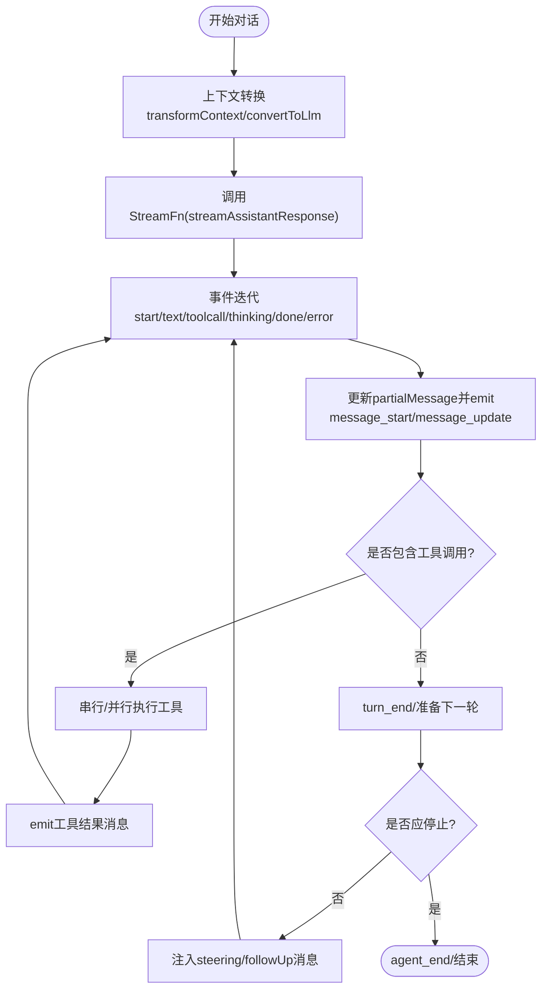
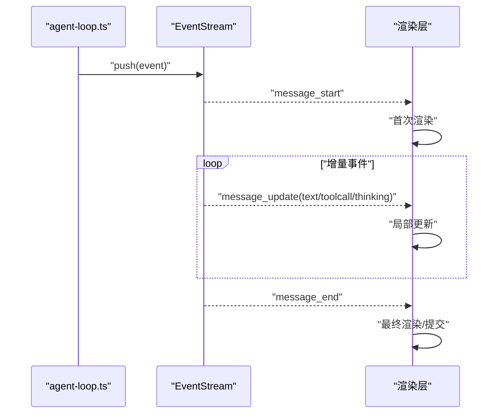
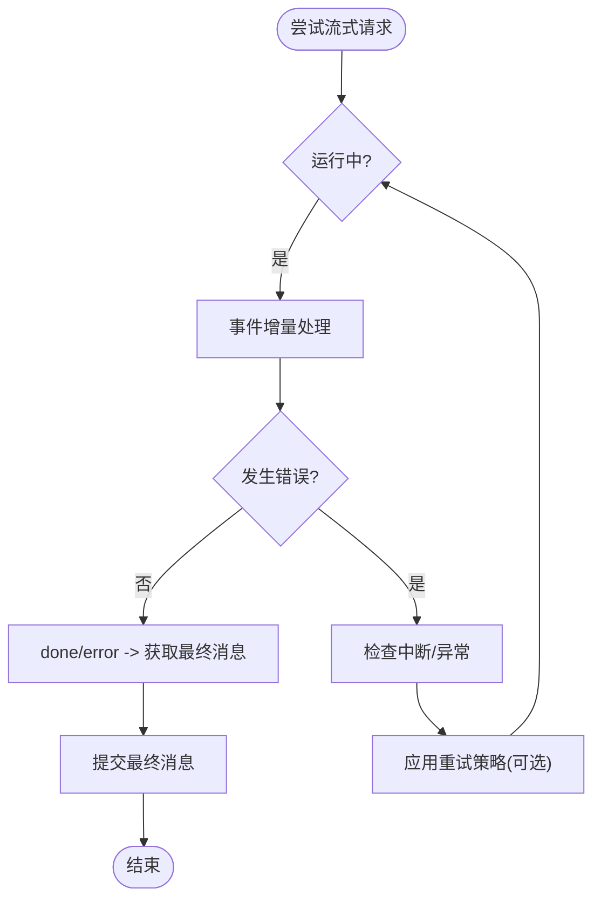
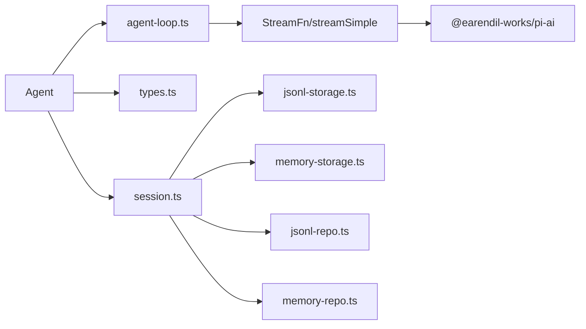

# 流式响应处理

<cite>
**本文引用的文件**
- [README.md](file://README.md)
- [agent.ts](file://packages/agent/src/agent.ts)
- [agent-loop.ts](file://packages/agent/src/agent-loop.ts)
- [types.ts](file://packages/agent/src/harness/types.ts)
- [agent-harness.ts](file://packages/agent/src/harness/agent-harness.ts)
- [session.ts](file://packages/agent/src/harness/session/session.ts)
- [jsonl-storage.ts](file://packages/agent/src/harness/session/jsonl-storage.ts)
- [memory-storage.ts](file://packages/agent/src/harness/session/memory-storage.ts)
- [jsonl-repo.ts](file://packages/agent/src/harness/session/jsonl-repo.ts)
- [memory-repo.ts](file://packages/agent/src/harness/session/memory-repo.ts)
</cite>

## 目录
1. [简介](#简介)
2. [项目结构](#项目结构)
3. [核心组件](#核心组件)
4. [架构总览](#架构总览)
5. [详细组件分析](#详细组件分析)
6. [依赖关系分析](#依赖关系分析)
7. [性能考虑](#性能考虑)
8. [故障排查指南](#故障排查指南)
9. [结论](#结论)
10. [附录](#附录)

## 简介
本文件面向Pi流式响应处理系统，聚焦于“流式API调用”的实现原理与工程实践，涵盖事件流解析、增量响应处理、实时渲染机制；解释多供应商（如OpenAI、Anthropic）的流式协议差异与适配；阐述错误恢复与重连策略以保障网络中断后的数据完整性；并提供实时聊天与代码生成等典型场景的使用示例与最佳实践。

Pi通过统一的多供应商LLM API层（@earendil-works/pi-ai）抽象底层差异，并在Agent运行时中以可插拔的流式函数（StreamFn/streamSimple）驱动端到端的流式对话循环。系统采用事件驱动的增量渲染模型，结合工具调用与消息队列，实现高并发、可中断、可恢复的实时交互体验。

## 项目结构
Pi采用Monorepo组织，核心与流式能力主要位于packages/agent与packages/ai。其中：
- packages/agent：状态化Agent运行时、事件流、工具执行、会话存储与消息队列
- packages/ai：多供应商LLM API抽象与流式传输封装（由Agent侧导入使用）

图表来源
- [agent.ts:166-558](file://packages/agent/src/agent.ts#L166-L558)
- [agent-loop.ts:1-743](file://packages/agent/src/agent-loop.ts#L1-L743)
- [types.ts](file://packages/agent/src/harness/types.ts)
- [agent-harness.ts](file://packages/agent/src/harness/agent-harness.ts)
- [session.ts](file://packages/agent/src/harness/session/session.ts)
- [jsonl-storage.ts](file://packages/agent/src/harness/session/jsonl-storage.ts)
- [memory-storage.ts](file://packages/agent/src/harness/session/memory-storage.ts)
- [jsonl-repo.ts](file://packages/agent/src/harness/session/jsonl-repo.ts)
- [memory-repo.ts](file://packages/agent/src/harness/session/memory-repo.ts)

章节来源
- [README.md:19-55](file://README.md#L19-L55)
- [agent.ts:166-558](file://packages/agent/src/agent.ts#L166-L558)
- [agent-loop.ts:1-743](file://packages/agent/src/agent-loop.ts#L1-L743)

## 核心组件
- Agent类：状态化运行时，负责事件订阅、消息队列、工具执行、生命周期管理与错误收尾。支持可选的流式函数注入，转发给底层流式实现。
- agent-loop.ts：实现完整的对话循环，将AgentMessage[]转换为Provider兼容的Message[]，调用流式函数进行增量事件消费，并将事件映射为Agent事件流。
- types.ts：定义Agent事件、消息、工具调用、流式函数签名等核心类型，支撑跨模块契约。
- 会话与存储：提供JSONL与内存两种持久化方案，支持会话读写、归档与回放，便于调试与复盘。

章节来源
- [agent.ts:166-558](file://packages/agent/src/agent.ts#L166-L558)
- [agent-loop.ts:1-743](file://packages/agent/src/agent-loop.ts#L1-L743)
- [types.ts](file://packages/agent/src/harness/types.ts)

## 架构总览
Pi的流式响应处理遵循“事件驱动 + 增量渲染”的设计范式：
- 输入阶段：Agent接收用户输入或工具结果，构建AgentMessage上下文
- 转换阶段：将AgentMessage[]转换为Provider期望的Message[]（含system prompt、messages、tools）
- 流式阶段：调用StreamFn（默认streamSimple），按事件类型增量更新消息内容
- 渲染阶段：事件流驱动UI或终端进行增量渲染，同时维护内部消息历史
- 工具阶段：当检测到工具调用时，串行或并行执行工具，产出工具结果消息
- 结束阶段：根据停止条件或异常，发出最终事件并结束流

图表来源
- [agent.ts:386-412](file://packages/agent/src/agent.ts#L386-L412)
- [agent-loop.ts:275-368](file://packages/agent/src/agent-loop.ts#L275-L368)

## 详细组件分析

### Agent类与事件流
- 事件订阅：subscribe(listener)提供生命周期事件回调，支持AbortSignal传递，保证异步监听的可取消性
- 消息队列：steer/followUp队列支持“单条/全部”模式，用于注入后续消息或延迟消息
- 生命周期：runWithLifecycle封装activeRun、abort、wait、reset等，确保状态一致性
- 错误处理：handleRunFailure在异常或中断时生成错误消息并触发收尾事件

图表来源
- [agent.ts:166-558](file://packages/agent/src/agent.ts#L166-L558)

章节来源
- [agent.ts:166-558](file://packages/agent/src/agent.ts#L166-L558)

### 对话循环与流式响应
- runLoop：外层循环处理“继续/跟随消息”，内层循环处理工具调用与消息注入，支持思考级别与模型参数动态切换
- streamAssistantResponse：将AgentMessage[]转换为Message[]，调用StreamFn进行事件迭代，按事件类型更新partialMessage并emit对应Agent事件
- 工具执行：executeToolCalls根据配置选择串行或并行，支持beforeToolCall/afterToolCall钩子与错误收敛

图表来源
- [agent-loop.ts:155-269](file://packages/agent/src/agent-loop.ts#L155-L269)
- [agent-loop.ts:275-368](file://packages/agent/src/agent-loop.ts#L275-L368)

章节来源
- [agent-loop.ts:155-269](file://packages/agent/src/agent-loop.ts#L155-L269)
- [agent-loop.ts:275-368](file://packages/agent/src/agent-loop.ts#L275-L368)

### 事件流解析与增量渲染
- 事件类型：start、text_start/text_delta/text_end、thinking_start/thinking_delta/thinking_end、toolcall_start/toolcall_delta/toolcall_end、done、error
- 增量更新：partialMessage在事件到达时被替换，渲染层仅对变化部分进行更新，降低UI抖动
- 终止条件：done/error分支调用response.result()获取最终消息，确保一次性完整消息的落盘

图表来源
- [agent-loop.ts:313-357](file://packages/agent/src/agent-loop.ts#L313-L357)

章节来源
- [agent-loop.ts:313-357](file://packages/agent/src/agent-loop.ts#L313-L357)

### 多供应商流式协议差异与适配
- OpenAI风格：通常以Server-Sent Events（SSE）推送增量文本与工具调用事件，事件字段包含delta与finish_reason
- Anthropic风格：流式输出格式与事件命名与OpenAI存在差异，需在StreamFn层面进行协议适配与统一封装
- Google/其它：同样通过StreamFn抽象，屏蔽底层差异，保持上层事件语义一致

说明：具体协议细节由@earendil-works/pi-ai在StreamFn实现中完成，Agent侧通过统一事件流消费，不直接感知供应商差异。

章节来源
- [agent.ts:1-10](file://packages/agent/src/agent.ts#L1-L10)
- [agent-loop.ts:297-308](file://packages/agent/src/agent-loop.ts#L297-L308)

### 错误恢复与重连机制
- 中断与错误：Agent在runWithLifecycle中捕获异常，通过handleRunFailure生成错误消息并触发message_start/message_end/turn_end/agent_end，确保UI与状态一致
- 可取消性：AbortSignal贯穿事件流与工具执行，支持用户主动中断
- 重试上限：maxRetryDelayMs可限制供应商请求重试的最大等待时间，避免无限等待
- 数据完整性：done/error分支调用response.result()获取最终消息，保证消息落盘；partialMessage在done前持续更新，避免丢失中间增量

图表来源
- [agent.ts:476-492](file://packages/agent/src/agent.ts#L476-L492)
- [agent-loop.ts:342-357](file://packages/agent/src/agent-loop.ts#L342-L357)

章节来源
- [agent.ts:476-492](file://packages/agent/src/agent.ts#L476-L492)
- [agent-loop.ts:342-357](file://packages/agent/src/agent-loop.ts#L342-L357)

### 使用示例：实时聊天与代码生成
- 实时聊天
  - 步骤：构造用户消息 -> 调用Agent.prompt -> 订阅事件流 -> 增量渲染文本 -> 收尾事件
  - 关键点：使用onPayload/onResponse钩子进行额外处理；必要时设置sessionId以启用缓存感知
- 代码生成
  - 步骤：prompt包含代码任务描述 -> 观察thinking_*事件了解推理过程 -> 观察text_*事件获取代码片段 -> 观察toolcall_*事件执行外部工具（如编译/测试）
  - 关键点：合理设置thinkingBudgets与transport；在beforeToolCall/afterToolCall中控制工具行为与结果

章节来源
- [agent.ts:324-412](file://packages/agent/src/agent.ts#L324-L412)
- [agent-loop.ts:275-368](file://packages/agent/src/agent-loop.ts#L275-L368)

## 依赖关系分析
- Agent依赖agent-loop.ts进行对话循环与事件流管理
- agent-loop.ts依赖@earendil-works/pi-ai的StreamFn与EventStream进行流式事件消费
- Agent与会话模块解耦，通过session.ts/jsonl*/memory*进行持久化与检索
- 类型系统集中在types.ts，确保跨模块契约稳定

图表来源
- [agent.ts:1-10](file://packages/agent/src/agent.ts#L1-L10)
- [agent-loop.ts:1-23](file://packages/agent/src/agent-loop.ts#L1-L23)
- [session.ts](file://packages/agent/src/harness/session/session.ts)

章节来源
- [agent.ts:1-10](file://packages/agent/src/agent.ts#L1-L10)
- [agent-loop.ts:1-23](file://packages/agent/src/agent-loop.ts#L1-L23)

## 性能考虑
- 增量渲染优先：仅对变化部分更新UI，减少重排与重绘开销
- 事件批处理：在渲染层合并短间隔的text_delta事件，降低渲染频率
- 内存管理：及时清理partialMessage与临时事件对象；在工具执行完成后释放中间状态
- 并发控制：工具执行默认并行，可通过配置改为串行以降低资源竞争
- 缓存与会话：合理使用sessionId与缓存感知后端，减少重复计算
- 超时与中断：为长轮询设置合理超时，配合AbortSignal快速回收资源

## 故障排查指南
- 无事件更新：确认StreamFn正确实现且未被阻塞；检查事件类型是否被正确识别
- 文本渲染卡顿：检查渲染层是否过度频繁地重绘；考虑合并事件批次
- 工具执行失败：查看beforeToolCall/afterToolCall返回值；核对工具参数与权限
- 中断无效：确认AbortSignal传递路径；避免在事件监听中忽略信号
- 最终消息缺失：确保done/error分支调用response.result()；检查网络稳定性

章节来源
- [agent.ts:476-492](file://packages/agent/src/agent.ts#L476-L492)
- [agent-loop.ts:342-357](file://packages/agent/src/agent-loop.ts#L342-L357)

## 结论
Pi的流式响应处理以事件驱动为核心，通过统一的StreamFn抽象屏蔽多供应商差异，结合Agent事件流实现增量渲染与工具执行闭环。系统在可中断、可恢复、可扩展方面具备良好工程实践，适用于实时聊天、代码生成等复杂交互场景。建议在生产环境中结合缓存、并发控制与监控告警，进一步提升稳定性与用户体验。

## 附录
- 术语
  - 事件流：从LLM接收到的增量事件序列，包含文本、思考与工具调用等
  - 增量响应：事件驱动的消息更新，逐步完善最终消息
  - 会话存储：基于JSONL或内存的持久化方案，支持会话归档与回放
- 相关文件
  - [README.md:19-55](file://README.md#L19-L55)
  - [agent.ts:166-558](file://packages/agent/src/agent.ts#L166-L558)
  - [agent-loop.ts:1-743](file://packages/agent/src/agent-loop.ts#L1-L743)
  - [types.ts](file://packages/agent/src/harness/types.ts)
  - [agent-harness.ts](file://packages/agent/src/harness/agent-harness.ts)
  - [session.ts](file://packages/agent/src/harness/session/session.ts)
  - [jsonl-storage.ts](file://packages/agent/src/harness/session/jsonl-storage.ts)
  - [memory-storage.ts](file://packages/agent/src/harness/session/memory-storage.ts)
  - [jsonl-repo.ts](file://packages/agent/src/harness/session/jsonl-repo.ts)
  - [memory-repo.ts](file://packages/agent/src/harness/session/memory-repo.ts)