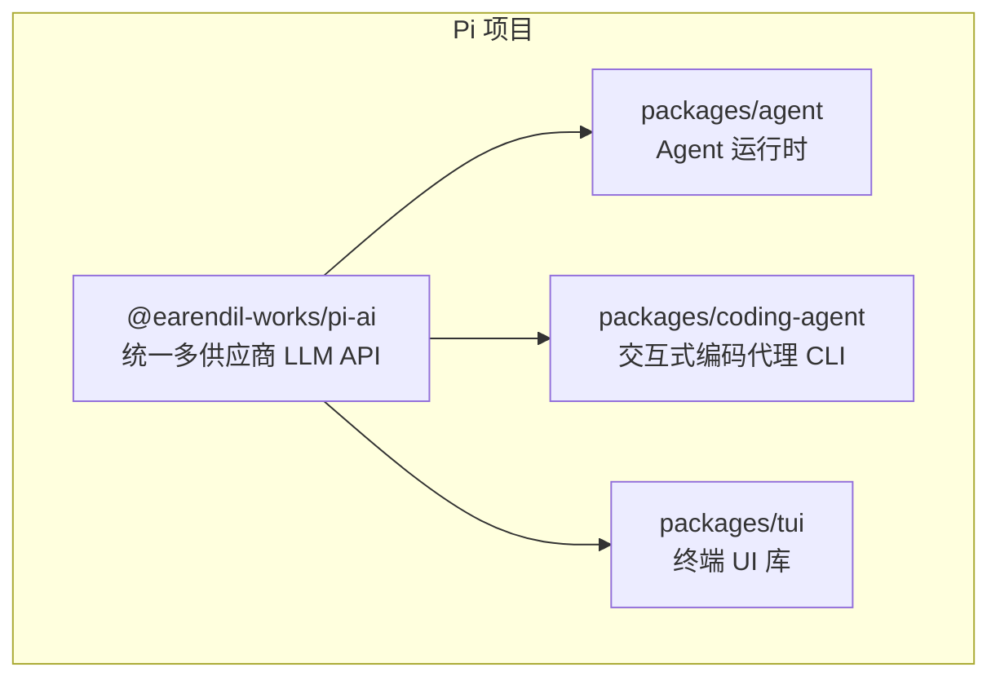
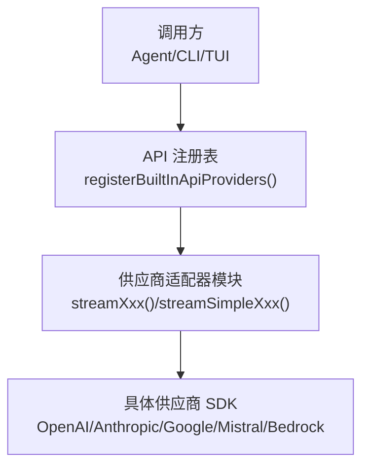
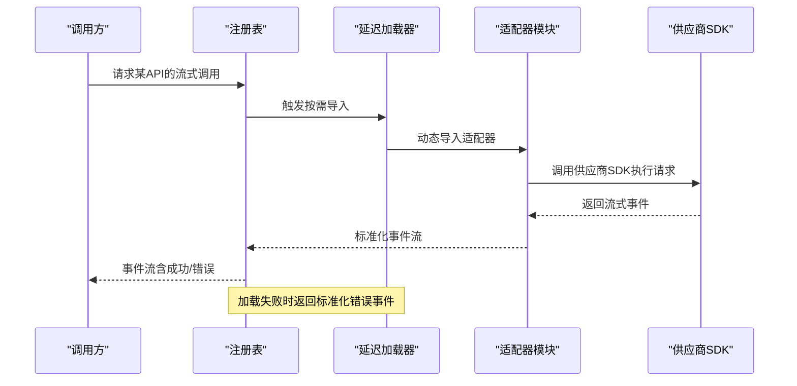
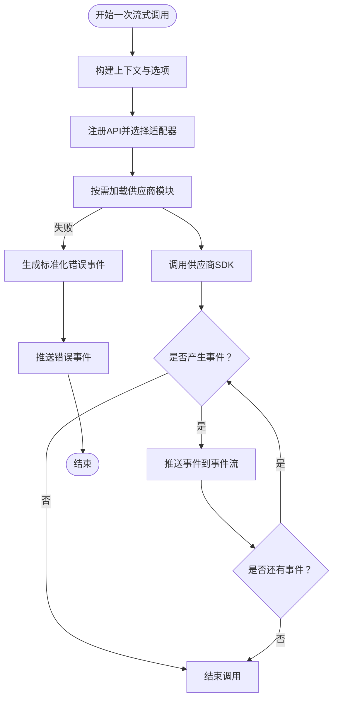
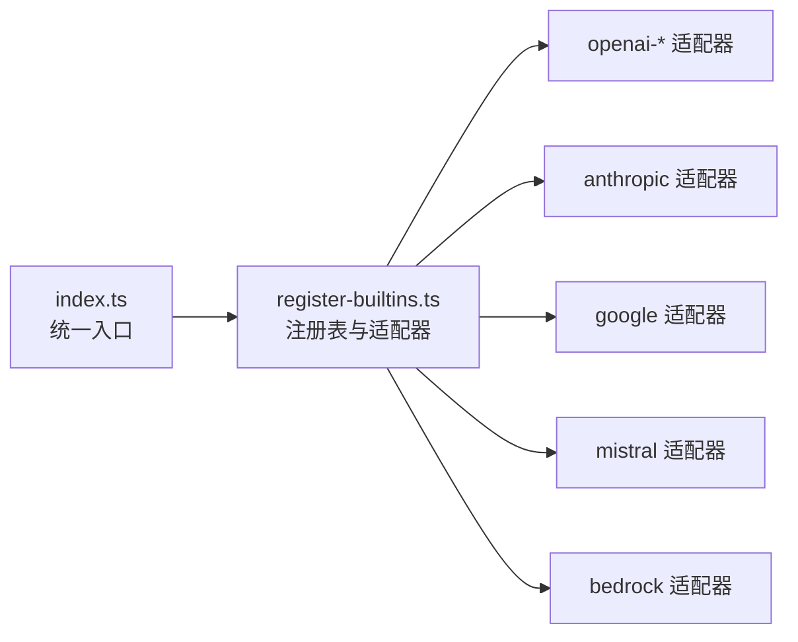

# 统一API接口设计

<cite>
**本文引用的文件**
- [README.md](file://README.md)
- [packages/ai/package.json](file://packages/ai/package.json)
- [packages/ai/src/index.ts](file://packages/ai/src/index.ts)
- [packages/ai/src/providers/register-builtins.ts](file://packages/ai/src/providers/register-builtins.ts)
</cite>

## 目录
1. [引言](#引言)
2. [项目结构](#项目结构)
3. [核心组件](#核心组件)
4. [架构总览](#架构总览)
5. [详细组件分析](#详细组件分析)
6. [依赖关系分析](#依赖关系分析)
7. [性能考量](#性能考量)
8. [故障排查指南](#故障排查指南)
9. [结论](#结论)
10. [附录](#附录)

## 引言
本文件面向Pi统一AI API接口设计，系统化阐述多供应商统一接口的核心理念与实现方式，重点覆盖以下主题：
- 标准化的消息格式、响应结构与错误处理机制
- 接口抽象层的设计原理，如何屏蔽不同AI供应商之间的差异
- 模型参数的标准化处理（如温度、最大令牌数、top_p 等）的映射规则
- 具体的接口使用示例，展示如何在不关心底层供应商的情况下进行AI调用
- 接口版本兼容性说明与迁移指南

Pi的统一AI能力由 [@earendil-works/pi-ai](packages/ai) 包提供，支持多家主流供应商（OpenAI、Anthropic、Google、Mistral、Amazon Bedrock 等），通过统一的API注册与流式事件模型对外暴露一致的调用体验。

章节来源
- [README.md:25](file://README.md#L25)
- [README.md:52](file://README.md#L52)

## 项目结构
Pi采用多包工作区组织，其中统一AI能力位于 packages/ai。该包通过模块化的方式为各供应商提供“延迟加载”的适配器，结合统一的API注册表完成跨供应商的无缝切换。

图表来源
- [README.md:23-56](file://README.md#L23-L56)

章节来源
- [README.md:19-56](file://README.md#L19-L56)
- [packages/ai/package.json:1-107](file://packages/ai/package.json#L1-L107)

## 核心组件
- 统一入口与类型导出：统一入口导出API注册表、环境密钥管理、模型定义、图片相关能力、会话资源、流式处理工具以及OAuth类型等，便于上层按需使用。
- 供应商适配器注册：内置注册表集中注册各供应商的流式调用函数，支持标准流式与简化流式两种模式；同时提供延迟加载机制以降低启动成本。
- 延迟加载与错误兜底：对各供应商模块采用按需动态导入，并在加载失败时生成标准化错误消息，确保调用方始终收到一致的事件流结构。

章节来源
- [packages/ai/src/index.ts:1-48](file://packages/ai/src/index.ts#L1-L48)
- [packages/ai/src/providers/register-builtins.ts:1-407](file://packages/ai/src/providers/register-builtins.ts#L1-L407)

## 架构总览
统一AI接口通过“抽象层 + 注册表 + 延迟加载 + 事件流”的架构屏蔽供应商差异，形成可扩展、可替换的统一调用面。

图表来源
- [packages/ai/src/providers/register-builtins.ts:345-399](file://packages/ai/src/providers/register-builtins.ts#L345-L399)

## 详细组件分析

### 组件A：API注册与延迟加载
- 设计要点
  - 使用统一的注册函数集中注册各供应商的流式调用能力，键为供应商标识（如 openai-responses、anthropic-messages 等）。
  - 通过延迟加载函数按需导入对应适配器模块，避免一次性加载全部SDK带来的冷启动开销。
  - 对于Bedrock等仅在Node运行时可用的模块，提供运行时判断与替代加载策略。
  - 提供标准流式与简化流式两类调用入口，满足不同场景需求。
- 错误处理
  - 在延迟加载失败时，构造标准化的错误消息事件，保证调用方能统一处理异常。
- 可扩展性
  - 支持外部设置Bedrock适配器模块，便于在特定环境下替换默认实现。

图表来源
- [packages/ai/src/providers/register-builtins.ts:162-204](file://packages/ai/src/providers/register-builtins.ts#L162-L204)
- [packages/ai/src/providers/register-builtins.ts:310-324](file://packages/ai/src/providers/register-builtins.ts#L310-L324)

章节来源
- [packages/ai/src/providers/register-builtins.ts:1-407](file://packages/ai/src/providers/register-builtins.ts#L1-L407)

### 组件B：标准化消息格式与响应结构
- 统一消息结构
  - 统一的助手消息包含角色、内容、API标识、供应商、模型名、用量统计、停止原因、时间戳等字段，确保跨供应商一致性。
- 流式事件模型
  - 通过事件流封装每次调用的增量输出，调用方可逐条消费事件，无需等待完整响应。
- 错误处理机制
  - 当底层调用或模块加载失败时，统一以“错误”事件形式返回，事件中包含错误信息与标准化用量统计，便于上层统一处理。

图表来源
- [packages/ai/src/providers/register-builtins.ts:132-160](file://packages/ai/src/providers/register-builtins.ts#L132-L160)
- [packages/ai/src/providers/register-builtins.ts:162-204](file://packages/ai/src/providers/register-builtins.ts#L162-L204)

章节来源
- [packages/ai/src/providers/register-builtins.ts:132-204](file://packages/ai/src/providers/register-builtins.ts#L132-L204)

### 组件C：模型参数标准化与映射规则
- 目标
  - 将不同供应商的参数语义统一映射到Pi的标准化参数体系，减少上层适配成本。
- 设计原则
  - 优先保留通用参数（如温度、最大令牌数、采样策略等），对不支持的参数进行静默忽略或降级处理。
  - 对供应商特有的参数，提供显式的选项类型声明，避免隐式转换导致的不确定性。
- 实施建议
  - 在统一入口导出各供应商的选项类型，调用方在传参时明确指定供应商与参数集合。
  - 对于流式调用，统一透传参数至适配器层，由适配器负责将标准化参数映射到具体SDK的参数结构。

章节来源
- [packages/ai/src/index.ts:10-25](file://packages/ai/src/index.ts#L10-L25)

### 组件D：接口使用示例（无代码，有路径）
- 选择供应商与模型
  - 通过统一入口导出的类型与注册表，选择目标API与模型。
- 发起流式调用
  - 使用标准流式或简化流式入口发起请求，接收事件流并在循环中逐条处理。
- 处理错误
  - 若事件流中出现错误事件，依据事件中的错误信息与用量统计进行重试或降级处理。

章节来源
- [packages/ai/src/index.ts:1-48](file://packages/ai/src/index.ts#L1-L48)
- [packages/ai/src/providers/register-builtins.ts:345-399](file://packages/ai/src/providers/register-builtins.ts#L345-L399)

## 依赖关系分析
- 外部SDK依赖
  - 各供应商SDK作为直接依赖引入，统一由适配器模块封装调用细节。
- 内部模块耦合
  - 统一入口聚合导出，注册表集中注册，适配器模块按需加载，整体保持低耦合高内聚。
- 版本与兼容
  - 通过锁定直接依赖版本与严格的构建流程，确保跨版本兼容性与可重复构建。

图表来源
- [packages/ai/src/index.ts:1-48](file://packages/ai/src/index.ts#L1-L48)
- [packages/ai/src/providers/register-builtins.ts:345-399](file://packages/ai/src/providers/register-builtins.ts#L345-L399)

章节来源
- [packages/ai/package.json:69-80](file://packages/ai/package.json#L69-L80)

## 性能考量
- 延迟加载优化
  - 仅在首次调用时加载对应供应商模块，显著降低初始化开销。
- 事件驱动流式处理
  - 通过事件流逐步产出结果，避免一次性缓冲大量数据，提升交互流畅度。
- 资源复用与清理
  - 在适配器层合理管理SDK连接与资源生命周期，避免泄漏。

## 故障排查指南
- 模块加载失败
  - 现象：调用返回错误事件。
  - 排查：确认供应商密钥配置、网络连通性与运行时环境（如Bedrock仅支持Node）。
- 参数不兼容
  - 现象：调用被拒绝或返回默认值。
  - 排查：核对参数映射规则，优先使用标准化参数；对供应商特有参数使用对应选项类型。
- 事件流中断
  - 现象：事件流提前结束或缺少中间事件。
  - 排查：检查上游SDK版本与网络稳定性，必要时启用重试与断点续传策略。

章节来源
- [packages/ai/src/providers/register-builtins.ts:141-160](file://packages/ai/src/providers/register-builtins.ts#L141-L160)

## 结论
Pi统一AI API通过抽象层、注册表与延迟加载机制，有效屏蔽了多供应商间的差异，提供了统一的消息格式、响应结构与错误处理模型。借助标准化参数映射与事件流设计，开发者可在不关心底层供应商的前提下进行灵活调用，并具备良好的可扩展性与可维护性。

## 附录

### 接口版本兼容性与迁移指南
- 版本策略
  - 严格锁定直接依赖版本，避免因第三方SDK升级导致的行为变化。
- 迁移步骤
  - 升级前先在本地验证所有供应商适配器是否仍可正常加载与调用。
  - 如遇参数命名或行为变更，优先通过适配器层进行向后兼容映射。
  - 更新完成后进行全面回归测试，确保事件流与错误处理逻辑一致。

章节来源
- [packages/ai/package.json:78-80](file://packages/ai/package.json#L78-L80)