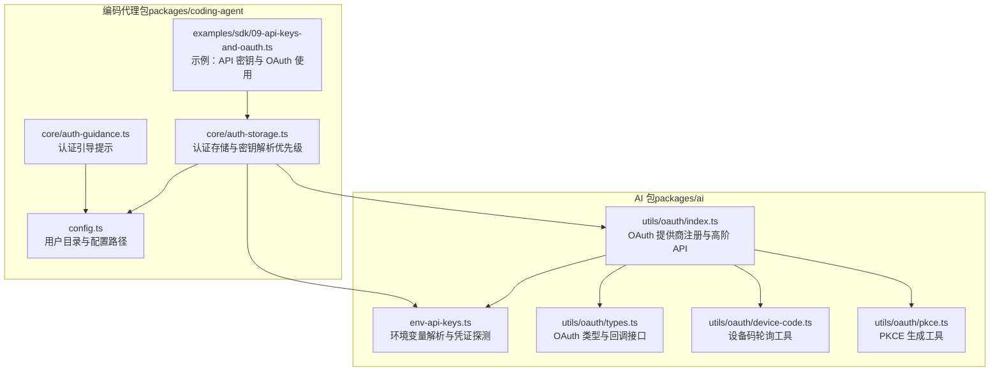
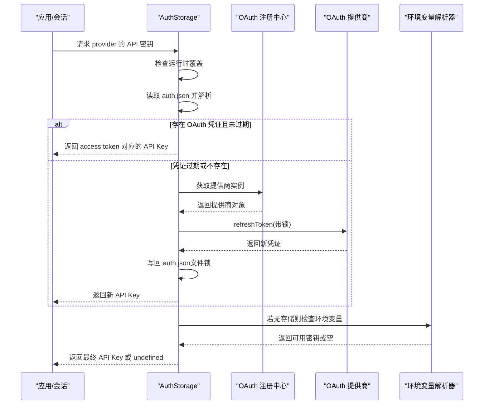
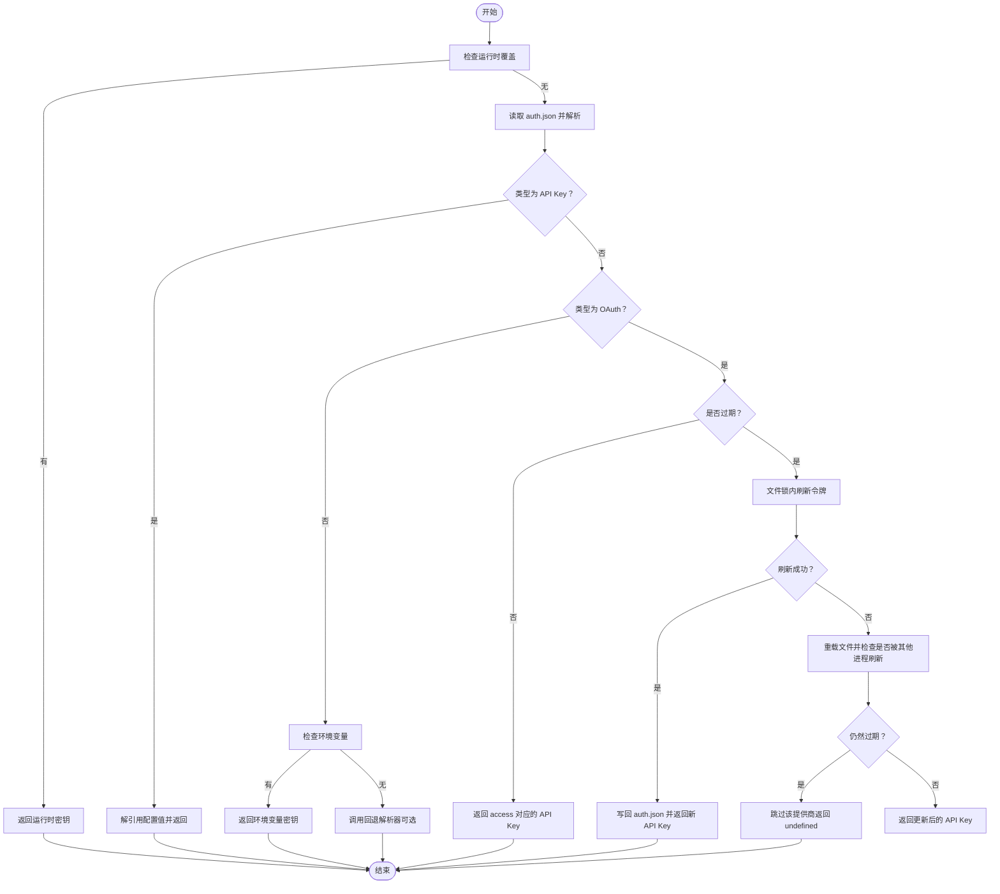
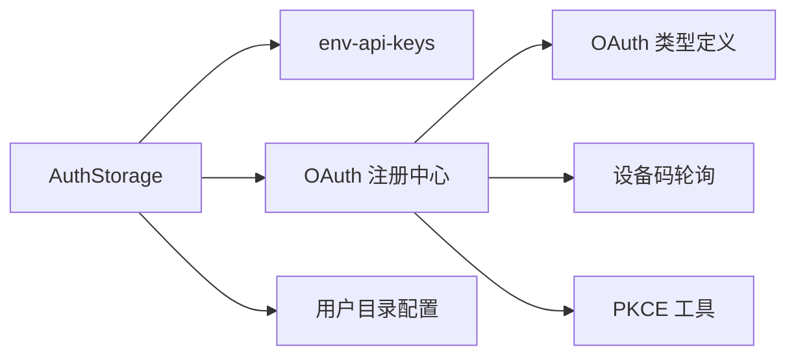

# 认证和密钥管理

<cite>
**本文引用的文件**
- [README.md](file://README.md)
- [env-api-keys.ts](file://packages/ai/src/env-api-keys.ts)
- [oauth.ts](file://packages/ai/src/oauth.ts)
- [index.ts（OAuth 总入口）](file://packages/ai/src/utils/oauth/index.ts)
- [types.ts（OAuth 类型定义）](file://packages/ai/src/utils/oauth/types.ts)
- [device-code.ts（设备码流程工具）](file://packages/ai/src/utils/oauth/device-code.ts)
- [pkce.ts（PKCE 工具）](file://packages/ai/src/utils/oauth/pkce.ts)
- [auth-storage.ts（认证存储与密钥解析）](file://packages/coding-agent/src/core/auth-storage.ts)
- [auth-guidance.ts（认证引导提示）](file://packages/coding-agent/src/core/auth-guidance.ts)
- [config.ts（应用与用户目录配置）](file://packages/coding-agent/src/config.ts)
- [09-api-keys-and-oauth.ts（示例：API 密钥与 OAuth）](file://packages/coding-agent/examples/sdk/09-api-keys-and-oauth.ts)
</cite>

## 目录
1. [简介](#简介)
2. [项目结构](#项目结构)
3. [核心组件](#核心组件)
4. [架构总览](#架构总览)
5. [详细组件分析](#详细组件分析)
6. [依赖关系分析](#依赖关系分析)
7. [性能考量](#性能考量)
8. [故障排查指南](#故障排查指南)
9. [结论](#结论)
10. [附录](#附录)

## 简介
本文件面向使用 Pi 的开发者与运维人员，提供认证与密钥管理的完整操作文档。内容涵盖：
- 支持的认证方式：API 密钥、OAuth 认证、设备码登录（PKCE/设备码）。
- 环境变量配置方法与安全存储策略。
- 密钥轮换与过期处理机制（自动刷新、并发锁、错误恢复）。
- 针对不同供应商的配置示例与最佳实践。
- 常见问题与排障建议。

## 项目结构
围绕认证与密钥管理的关键模块分布于两个包：
- packages/ai：统一多供应商 LLM API 与 OAuth 能力（环境变量解析、OAuth 提供商注册与刷新、设备码与 PKCE 工具）。
- packages/coding-agent：认证存储、密钥解析优先级、运行时覆盖与错误记录。

图表来源
- [env-api-keys.ts:1-211](file://packages/ai/src/env-api-keys.ts#L1-L211)
- [index.ts（OAuth 总入口）:1-161](file://packages/ai/src/utils/oauth/index.ts#L1-L161)
- [types.ts（OAuth 类型定义）:1-80](file://packages/ai/src/utils/oauth/types.ts#L1-L80)
- [device-code.ts（设备码流程工具）:1-84](file://packages/ai/src/utils/oauth/device-code.ts#L1-L84)
- [pkce.ts（PKCE 工具）:1-35](file://packages/ai/src/utils/oauth/pkce.ts#L1-L35)
- [auth-storage.ts（认证存储与密钥解析）:1-532](file://packages/coding-agent/src/core/auth-storage.ts#L1-L532)
- [auth-guidance.ts（认证引导提示）:1-26](file://packages/coding-agent/src/core/auth-guidance.ts#L1-L26)
- [config.ts（应用与用户目录配置）:480-537](file://packages/coding-agent/src/config.ts#L480-L537)
- [09-api-keys-and-oauth.ts（示例：API 密钥与 OAuth）:1-53](file://packages/coding-agent/examples/sdk/09-api-keys-and-oauth.ts#L1-L53)

章节来源
- [README.md:1-90](file://README.md#L1-L90)
- [config.ts:480-537](file://packages/coding-agent/src/config.ts#L480-L537)

## 核心组件
- 环境变量解析器：从已知供应商映射中查找可用的 API 密钥环境变量，并识别部分“默认凭据”（如 Google ADC、AWS 多种来源）。
- OAuth 注册中心：内置多个 OAuth 提供商（Anthropic、GitHub Copilot、OpenAI Codex），支持注册自定义提供商、重置内置提供商、按 ID 获取提供商。
- 设备码与 PKCE：提供通用的设备码轮询逻辑与 PKCE 生成工具，用于浏览器或无本地回调场景。
- 认证存储与密钥解析：以 auth.json 为核心存储，结合运行时覆盖、环境变量与回退解析器，提供统一的密钥获取优先级；并发刷新通过文件锁保障一致性。

章节来源
- [env-api-keys.ts:91-210](file://packages/ai/src/env-api-keys.ts#L91-L210)
- [index.ts（OAuth 总入口）:36-161](file://packages/ai/src/utils/oauth/index.ts#L36-L161)
- [device-code.ts:45-84](file://packages/ai/src/utils/oauth/device-code.ts#L45-L84)
- [pkce.ts:21-35](file://packages/ai/src/utils/oauth/pkce.ts#L21-L35)
- [auth-storage.ts:196-532](file://packages/coding-agent/src/core/auth-storage.ts#L196-L532)

## 架构总览
下图展示了从应用请求模型到最终获取可用 API 密钥的整体流程，包括环境变量、OAuth 凭证与存储的优先级与刷新机制。

图表来源
- [auth-storage.ts:462-523](file://packages/coding-agent/src/core/auth-storage.ts#L462-L523)
- [index.ts（OAuth 总入口）:113-161](file://packages/ai/src/utils/oauth/index.ts#L113-L161)
- [env-api-keys.ts:158-210](file://packages/ai/src/env-api-keys.ts#L158-L210)

## 详细组件分析

### 环境变量解析与供应商映射
- 功能要点
  - 依据供应商名称返回一组可能的环境变量名（例如 Anthropic 同时支持 OAuth 令牌与 API Key）。
  - 支持“默认 ADC”（Google Vertex）与多种 AWS 凭证来源，不将其视为“显式 API Key”，但可用于认证状态判断。
  - 在 Bun 沙箱二进制环境中，通过读取 /proc/self/environ 恢复缺失的 process.env。
- 安全注意
  - 不直接暴露 AWS/Google 默认凭据，仅用于“是否已认证”的判定；实际 API Key 仍需显式配置。

章节来源
- [env-api-keys.ts:91-134](file://packages/ai/src/env-api-keys.ts#L91-L134)
- [env-api-keys.ts:158-210](file://packages/ai/src/env-api-keys.ts#L158-L210)

### OAuth 提供商注册与高阶 API
- 功能要点
  - 内置提供商：Anthropic、GitHub Copilot、OpenAI Codex。
  - 提供 getOAuthProvider、registerOAuthProvider、unregisterOAuthProvider、resetOAuthProviders、getOAuthProviders 等能力。
  - 高阶 API：refreshOAuthToken（已废弃）、getOAuthApiKey（自动刷新过期令牌并返回 API Key）。
- 扩展性
  - 可注册自定义提供商，或重置为内置实现。

章节来源
- [index.ts（OAuth 总入口）:36-161](file://packages/ai/src/utils/oauth/index.ts#L36-L161)

### 设备码登录与轮询
- 功能要点
  - 统一的设备码轮询流程：支持 interval/slow_down、超时控制、AbortSignal 中断。
  - 适用于浏览器或无法启动本地回调服务器的场景。
- 兼容性
  - 在 WSL/VM 环境出现时钟漂移导致 slow_down 时，自动增加轮询间隔并给出明确提示。

章节来源
- [device-code.ts:45-84](file://packages/ai/src/utils/oauth/device-code.ts#L45-L84)

### PKCE 工具
- 功能要点
  - 生成随机 verifier 与 SHA-256 challenge，兼容 Node.js 与浏览器的 Web Crypto API。
- 应用场景
  - 与浏览器端 OAuth 登录配合，提升授权安全性。

章节来源
- [pkce.ts:21-35](file://packages/ai/src/utils/oauth/pkce.ts#L21-L35)

### 认证存储与密钥解析优先级
- 优先级（从高到低）
  1) 运行时覆盖（CLI --api-key 等临时覆盖，不持久化）
  2) auth.json 中的 API Key 或 OAuth 凭证
  3) 环境变量中的 API Key
  4) 回退解析器（用于 models.json 自定义提供商）
- 并发与一致性
  - 刷新 OAuth 令牌时使用文件锁（同步/异步），避免多进程同时刷新导致冲突。
  - 刷新失败时重载文件，若其他进程已成功刷新则直接复用。
- 错误处理
  - 记录加载/写入/刷新错误；当无法获取有效密钥时，模型发现阶段会跳过该提供商。

图表来源
- [auth-storage.ts:462-523](file://packages/coding-agent/src/core/auth-storage.ts#L462-L523)
- [auth-storage.ts:407-451](file://packages/coding-agent/src/core/auth-storage.ts#L407-L451)

章节来源
- [auth-storage.ts:196-532](file://packages/coding-agent/src/core/auth-storage.ts#L196-L532)

### 用户目录与配置路径
- 默认用户目录：~/.pi/agent（可通过环境变量覆盖）。
- 关键文件位置：auth.json、models.json、settings.json、sessions/ 等。
- 文档与示例路径：docs/ 与 examples/。

章节来源
- [config.ts:480-537](file://packages/coding-agent/src/config.ts#L480-L537)

### 认证引导与提示
- 当无可用模型或未找到 API Key 时，输出指向文档与帮助的提示信息，指导用户进行 /login 或配置认证。

章节来源
- [auth-guidance.ts:6-26](file://packages/coding-agent/src/core/auth-guidance.ts#L6-L26)

### 示例：API 密钥与 OAuth
- 展示了默认与自定义 auth.json 位置、运行时覆盖 API Key、以及基于 ModelRegistry 的会话创建方式。

章节来源
- [09-api-keys-and-oauth.ts:1-53](file://packages/coding-agent/examples/sdk/09-api-keys-and-oauth.ts#L1-L53)

## 依赖关系分析
- 认证存储依赖
  - 环境变量解析器：用于识别环境变量中的 API Key。
  - OAuth 注册中心：用于解析 OAuth 凭证并刷新令牌。
  - 用户目录配置：确定 auth.json 默认位置。
- OAuth 依赖
  - 设备码轮询与 PKCE 工具：为浏览器或无本地回调场景提供支撑。
  - 类型定义：约束提供商接口与回调协议。

图表来源
- [auth-storage.ts:9-22](file://packages/coding-agent/src/core/auth-storage.ts#L9-L22)
- [index.ts（OAuth 总入口）:36-96](file://packages/ai/src/utils/oauth/index.ts#L36-L96)
- [types.ts（OAuth 类型定义）:54-72](file://packages/ai/src/utils/oauth/types.ts#L54-L72)
- [device-code.ts:45-84](file://packages/ai/src/utils/oauth/device-code.ts#L45-L84)
- [pkce.ts:21-35](file://packages/ai/src/utils/oauth/pkce.ts#L21-L35)
- [config.ts:480-537](file://packages/coding-agent/src/config.ts#L480-L537)

## 性能考量
- 文件锁策略
  - 同步锁与异步锁均提供重试与“锁被破坏”保护，降低并发刷新冲突概率。
- 轮询优化
  - 设备码轮询根据 slow_down 动态增加间隔，避免频繁请求。
- 缓存与最小化 IO
  - 在 Bun 沙箱环境下，通过 /proc/self/environ 恢复环境变量，减少因进程隔离导致的重复 IO。

章节来源
- [auth-storage.ts:74-171](file://packages/coding-agent/src/core/auth-storage.ts#L74-L171)
- [device-code.ts:45-84](file://packages/ai/src/utils/oauth/device-code.ts#L45-L84)
- [env-api-keys.ts:35-59](file://packages/ai/src/env-api-keys.ts#L35-L59)

## 故障排查指南
- 无可用模型或未找到 API Key
  - 系统会输出指向文档与帮助的提示，建议执行 /login 或检查环境变量与 auth.json。
- 设备码登录超时或 slow_down
  - 检查系统时钟同步（WSL/VM 环境常见），适当等待或重启虚拟机时钟后重试。
- 多实例同时刷新导致异常
  - 系统已采用文件锁；若仍出现“锁被破坏”错误，请检查磁盘权限与锁文件状态。
- 环境变量未生效
  - 在 Bun 沙箱二进制环境中，确认 /proc/self/environ 可读；必要时改用 auth.json 存储。

章节来源
- [auth-guidance.ts:6-26](file://packages/coding-agent/src/core/auth-guidance.ts#L6-L26)
- [device-code.ts:1-10](file://packages/ai/src/utils/oauth/device-code.ts#L1-L10)
- [auth-storage.ts:134-169](file://packages/coding-agent/src/core/auth-storage.ts#L134-L169)
- [env-api-keys.ts:35-59](file://packages/ai/src/env-api-keys.ts#L35-L59)

## 结论
本系统通过“运行时覆盖 → 存储 → 环境变量 → 回退解析器”的优先级设计，结合 OAuth 自动刷新与文件锁并发控制，提供了稳定、可扩展的认证与密钥管理能力。建议在生产环境优先使用 auth.json 存储敏感信息，并配合严格的文件权限与定期轮换来强化安全。

## 附录

### 支持的供应商与环境变量映射（节选）
- Anthropic：支持 OAuth 令牌与 API Key（后者优先级低于前者）。
- OpenAI/Azure OpenAI/DeepSeek/Google/Gemini/Groq/Cerebras/XAI/OpenRouter/Vercel AI Gateway/Zai/Mistral/Minimax/Moonshot/HuggingFace/Fireworks/Together/OpenCode/Kimi/Xiaomi/Cloudflare Workers AI 等。
- Google Vertex：支持显式 API Key 或默认 ADC（需项目与区域信息）。
- Amazon Bedrock：支持多种 AWS 凭证来源（含 IRSA）。

章节来源
- [env-api-keys.ts:91-134](file://packages/ai/src/env-api-keys.ts#L91-L134)
- [env-api-keys.ts:166-207](file://packages/ai/src/env-api-keys.ts#L166-L207)

### 环境变量配置方法与安全建议
- 方法
  - 优先使用 auth.json 存储敏感信息；对于临时测试可使用运行时覆盖。
  - 通过环境变量注入 API Key；系统会自动识别对应供应商的变量名。
- 安全建议
  - 限制 auth.json 权限（仅所有者可读写）。
  - 定期轮换密钥，启用自动刷新与错误告警。
  - 在 CI/CD 中使用受控密钥管理服务，避免硬编码。

章节来源
- [auth-storage.ts:210-221](file://packages/coding-agent/src/core/auth-storage.ts#L210-L221)
- [config.ts:480-537](file://packages/coding-agent/src/config.ts#L480-L537)

### 密钥轮换与过期处理机制
- 自动刷新
  - 当凭证过期时，系统在文件锁保护下调用提供商的 refreshToken，成功后写回存储。
- 错误恢复
  - 刷新失败时重载文件，若其他进程已刷新则直接复用；否则跳过该提供商。
- 并发控制
  - 同步与异步锁均提供重试与“锁被破坏”保护，避免竞态条件。

章节来源
- [auth-storage.ts:407-451](file://packages/coding-agent/src/core/auth-storage.ts#L407-L451)
- [auth-storage.ts:486-510](file://packages/coding-agent/src/core/auth-storage.ts#L486-L510)

### 配置示例（步骤说明）
- 默认存储位置
  - 使用默认用户目录下的 auth.json。
- 自定义存储位置
  - 指定 auth.json 路径，便于多项目或多用户隔离。
- 运行时覆盖
  - 通过运行时覆盖临时指定某供应商的 API Key，不写入磁盘。
- 示例参考
  - 参考示例脚本中的会话创建与存储初始化方式。

章节来源
- [09-api-keys-and-oauth.ts:9-32](file://packages/coding-agent/examples/sdk/09-api-keys-and-oauth.ts#L9-L32)
- [auth-storage.ts:209-221](file://packages/coding-agent/src/core/auth-storage.ts#L209-L221)