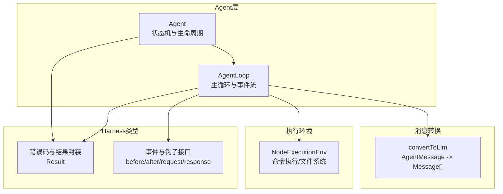
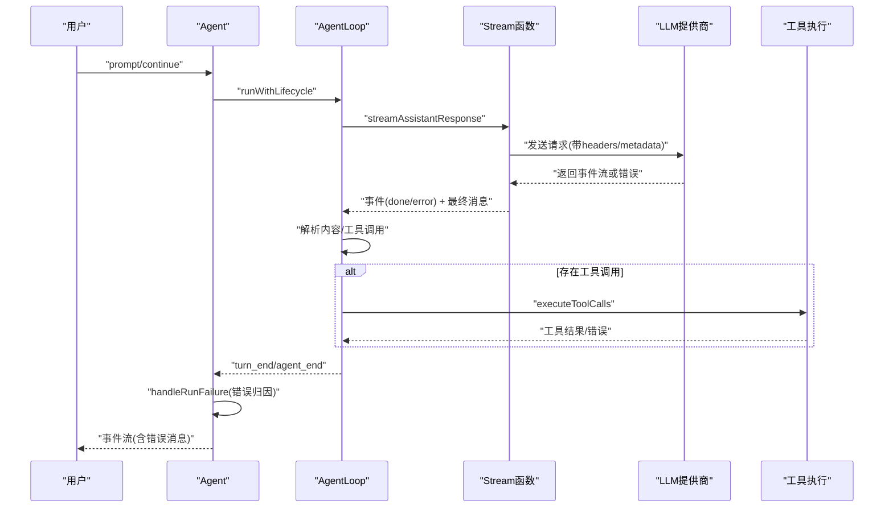
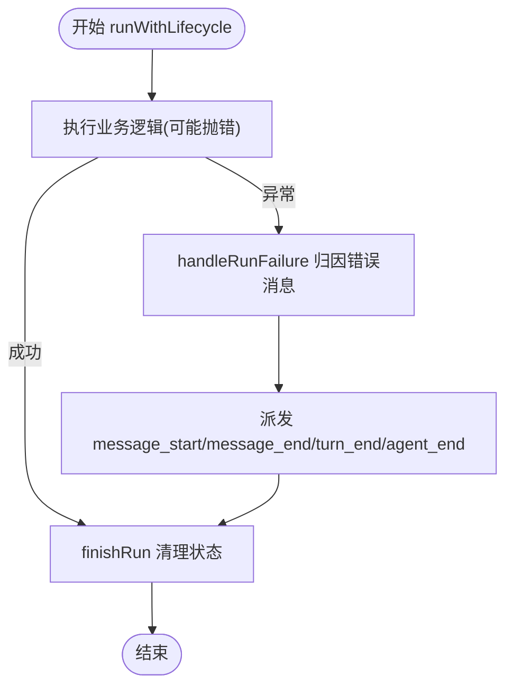
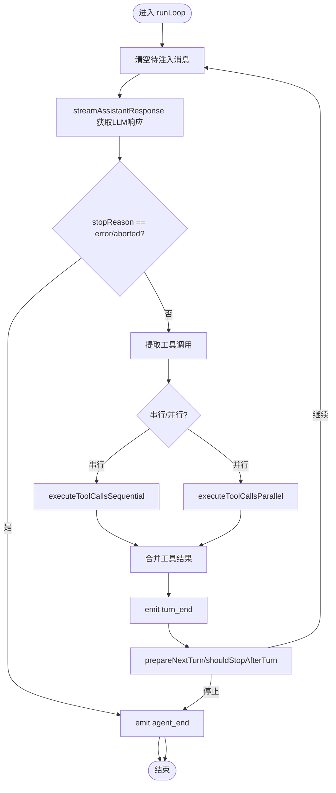
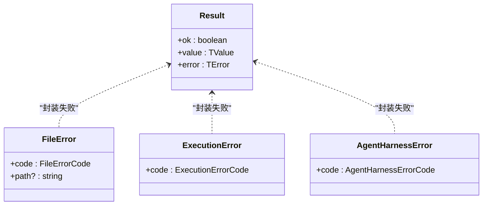
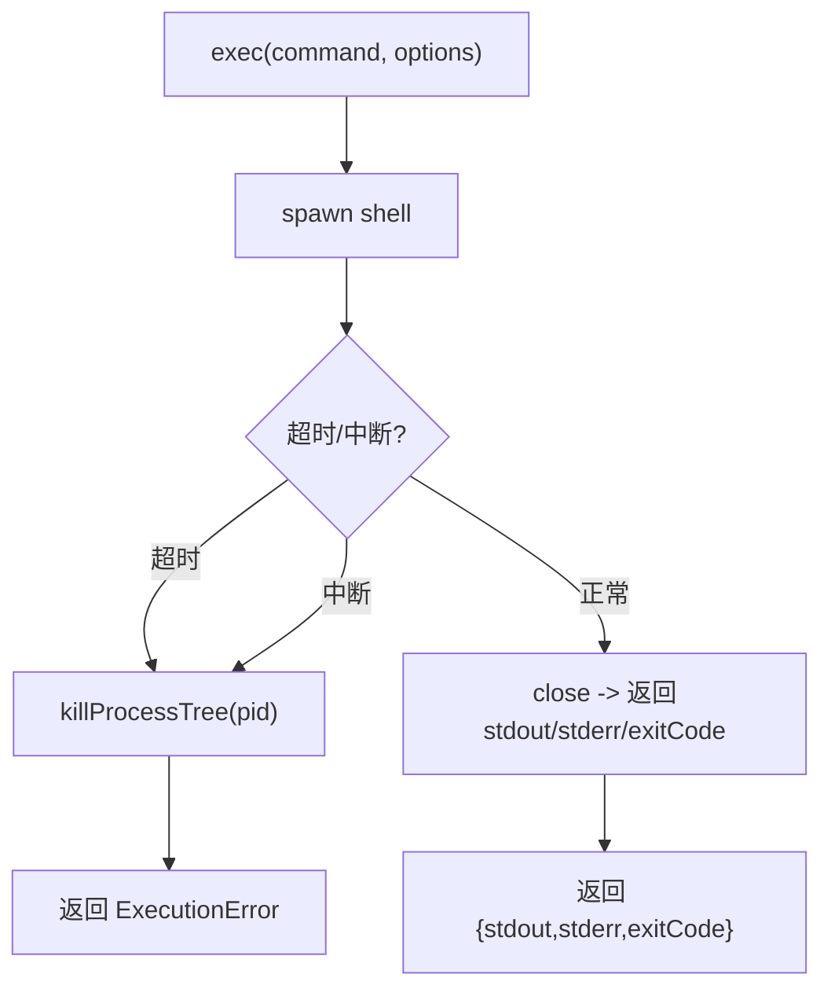
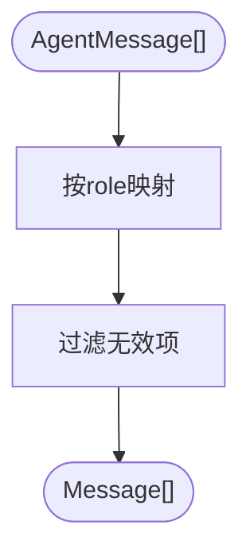
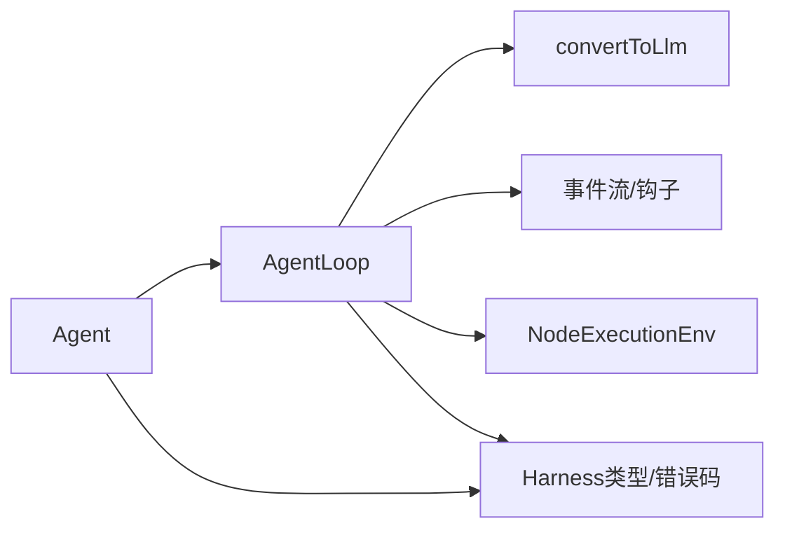
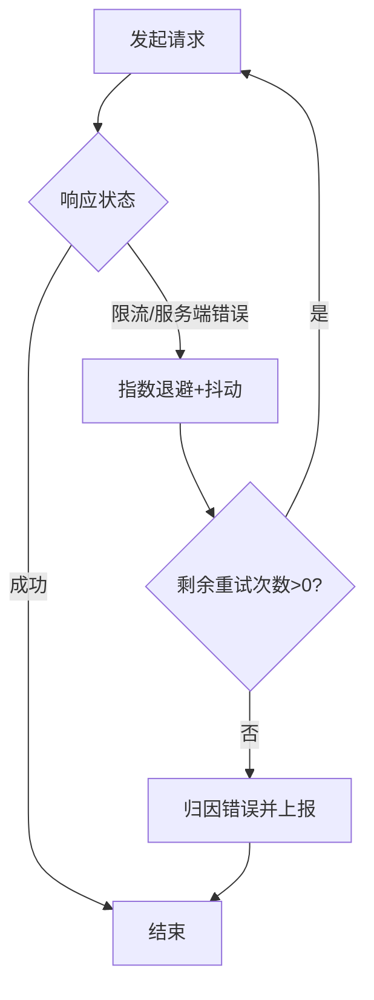

# 错误处理和重试策略

<cite>
**本文引用的文件**
- [packages/agent/src/agent.ts](file://packages/agent/src/agent.ts)
- [packages/agent/src/agent-loop.ts](file://packages/agent/src/agent-loop.ts)
- [packages/agent/src/harness/types.ts](file://packages/agent/src/harness/types.ts)
- [packages/agent/src/harness/env/nodejs.ts](file://packages/agent/src/harness/env/nodejs.ts)
- [packages/agent/src/harness/messages.ts](file://packages/agent/src/harness/messages.ts)
</cite>

## 目录
1. [简介](#简介)
2. [项目结构](#项目结构)
3. [核心组件](#核心组件)
4. [架构总览](#架构总览)
5. [详细组件分析](#详细组件分析)
6. [依赖关系分析](#依赖关系分析)
7. [性能考量](#性能考量)
8. [故障排除指南](#故障排除指南)
9. [结论](#结论)
10. [附录](#附录)

## 简介
本文件面向Pi AI在运行时的错误处理与重试策略，聚焦以下主题：
- 错误类型分类与处理机制：网络错误、API限流/配额、认证失败、模型不可用、工具执行错误、系统资源错误等
- 指数退避重试算法的实现要点：最大重试次数、退避因子、抖动策略
- 错误诊断工具与信息采集：事件流、错误码、上下文元数据、会话摘要
- 具体示例：如何优雅地处理各类异常，避免重复请求、正确传播错误
- 监控告警与运维最佳实践：指标建议、告警阈值、日志与追踪

## 项目结构
围绕错误处理与重试策略的关键模块如下：
- Agent与AgentLoop：负责消息流转、工具调用、错误归因与事件上报
- Harness类型与错误码：定义统一的错误分类与结果封装
- Node执行环境：进程执行、文件系统操作的错误码与超时控制
- 消息转换：将内部AgentMessage转换为LLM输入，便于定位上下文问题

**图表来源**
- [packages/agent/src/agent.ts:166-558](file://packages/agent/src/agent.ts#L166-L558)
- [packages/agent/src/agent-loop.ts:95-270](file://packages/agent/src/agent-loop.ts#L95-L270)
- [packages/agent/src/harness/types.ts:5-38](file://packages/agent/src/harness/types.ts#L5-L38)
- [packages/agent/src/harness/env/nodejs.ts:217-351](file://packages/agent/src/harness/env/nodejs.ts#L217-L351)
- [packages/agent/src/harness/messages.ts:120-165](file://packages/agent/src/harness/messages.ts#L120-L165)

**章节来源**
- [packages/agent/src/agent.ts:166-558](file://packages/agent/src/agent.ts#L166-L558)
- [packages/agent/src/agent-loop.ts:95-270](file://packages/agent/src/agent-loop.ts#L95-L270)
- [packages/agent/src/harness/types.ts:5-38](file://packages/agent/src/harness/types.ts#L5-L38)
- [packages/agent/src/harness/env/nodejs.ts:217-351](file://packages/agent/src/harness/env/nodejs.ts#L217-L351)
- [packages/agent/src/harness/messages.ts:120-165](file://packages/agent/src/harness/messages.ts#L120-L165)

## 核心组件
- Agent类：维护状态、订阅事件、启动/继续对话、错误归因与最终事件派发
- AgentLoop：主循环、消息注入、工具调用、停止条件、事件发射
- Harness类型：统一的Result封装、错误码体系（文件/执行/会话/代理等）
- Node执行环境：命令执行与文件系统操作的错误码与超时控制
- 消息转换：将自定义消息（如bash执行、分支/压缩摘要）转换为LLM可理解的消息

**章节来源**
- [packages/agent/src/agent.ts:166-558](file://packages/agent/src/agent.ts#L166-L558)
- [packages/agent/src/agent-loop.ts:95-270](file://packages/agent/src/agent-loop.ts#L95-L270)
- [packages/agent/src/harness/types.ts:5-38](file://packages/agent/src/harness/types.ts#L5-L38)
- [packages/agent/src/harness/env/nodejs.ts:217-351](file://packages/agent/src/harness/env/nodejs.ts#L217-L351)
- [packages/agent/src/harness/messages.ts:120-165](file://packages/agent/src/harness/messages.ts#L120-L165)

## 架构总览
下图展示了从用户输入到LLM响应、再到工具执行与错误处理的整体流程。

**图表来源**
- [packages/agent/src/agent.ts:451-492](file://packages/agent/src/agent.ts#L451-L492)
- [packages/agent/src/agent-loop.ts:275-368](file://packages/agent/src/agent-loop.ts#L275-L368)
- [packages/agent/src/agent-loop.ts:373-516](file://packages/agent/src/agent-loop.ts#L373-L516)

## 详细组件分析

### Agent类：错误归因与事件派发
- 生命周期管理：runWithLifecycle负责启动、捕获错误、完成收尾
- 错误归因：handleRunFailure将错误映射为“assistant”消息，携带provider/model/api/usage/stopReason/errorMessage等字段
- 事件处理：processEvents根据事件更新内部状态，并向订阅者派发

**图表来源**
- [packages/agent/src/agent.ts:451-500](file://packages/agent/src/agent.ts#L451-L500)
- [packages/agent/src/agent.ts:476-492](file://packages/agent/src/agent.ts#L476-L492)

**章节来源**
- [packages/agent/src/agent.ts:451-500](file://packages/agent/src/agent.ts#L451-L500)
- [packages/agent/src/agent.ts:476-492](file://packages/agent/src/agent.ts#L476-L492)

### AgentLoop：主循环与工具调用
- 主循环：处理待注入消息、拉取LLM响应、解析工具调用、执行工具、决定是否继续
- 工具调用：支持串行/并行两种模式；对每个工具调用进行准备、执行、收尾
- 停止条件：turn_end/agent_end事件触发后退出

**图表来源**
- [packages/agent/src/agent-loop.ts:155-269](file://packages/agent/src/agent-loop.ts#L155-L269)
- [packages/agent/src/agent-loop.ts:373-516](file://packages/agent/src/agent-loop.ts#L373-L516)

**章节来源**
- [packages/agent/src/agent-loop.ts:155-269](file://packages/agent/src/agent-loop.ts#L155-L269)
- [packages/agent/src/agent-loop.ts:373-516](file://packages/agent/src/agent-loop.ts#L373-L516)

### Harness类型与错误码：统一错误模型
- Result<TValue,TError>：显式区分成功与失败，避免异常穿透带来的不确定性
- 错误码体系：
  - 文件系统：aborted/not_found/permission_denied/…/unknown
  - 执行环境：aborted/timeout/shell_unavailable/spawn_error/callback_error/unknown
  - 会话/代理：busy/invalid_state/invalid_argument/session/hook/auth/…/unknown
- 事件与钩子：before_provider_request/before_provider_payload/after_provider_response等，便于在重试前调整参数

**图表来源**
- [packages/agent/src/harness/types.ts:5-38](file://packages/agent/src/harness/types.ts#L5-L38)
- [packages/agent/src/harness/types.ts:122-155](file://packages/agent/src/harness/types.ts#L122-L155)
- [packages/agent/src/harness/types.ts:146-155](file://packages/agent/src/harness/types.ts#L146-L155)
- [packages/agent/src/harness/types.ts:219-227](file://packages/agent/src/harness/types.ts#L219-L227)

**章节来源**
- [packages/agent/src/harness/types.ts:5-38](file://packages/agent/src/harness/types.ts#L5-L38)
- [packages/agent/src/harness/types.ts:122-155](file://packages/agent/src/harness/types.ts#L122-L155)
- [packages/agent/src/harness/types.ts:146-155](file://packages/agent/src/harness/types.ts#L146-L155)
- [packages/agent/src/harness/types.ts:219-227](file://packages/agent/src/harness/types.ts#L219-L227)

### Node执行环境：命令执行与文件系统错误
- 命令执行：spawn子进程，支持超时、AbortSignal、stdout/stderr回调；错误码覆盖spawn_error、timeout、aborted、callback_error
- 文件系统：统一的FileError错误码，路径解析、读写、列表、删除、临时目录等操作均返回Result
- 进程树清理：跨平台终止子进程，避免僵尸进程

**图表来源**
- [packages/agent/src/harness/env/nodejs.ts:236-351](file://packages/agent/src/harness/env/nodejs.ts#L236-L351)
- [packages/agent/src/harness/env/nodejs.ts:192-215](file://packages/agent/src/harness/env/nodejs.ts#L192-L215)

**章节来源**
- [packages/agent/src/harness/env/nodejs.ts:236-351](file://packages/agent/src/harness/env/nodejs.ts#L236-L351)
- [packages/agent/src/harness/env/nodejs.ts:192-215](file://packages/agent/src/harness/env/nodejs.ts#L192-L215)

### 消息转换：上下文对齐与错误定位
- convertToLlm：将自定义消息（如bashExecution、branchSummary、compactionSummary）转换为LLM可见的Message，便于在错误时回溯上下文
- 自定义消息：支持文本或富内容，可选择是否纳入上下文

**图表来源**
- [packages/agent/src/harness/messages.ts:120-165](file://packages/agent/src/harness/messages.ts#L120-L165)

**章节来源**
- [packages/agent/src/harness/messages.ts:120-165](file://packages/agent/src/harness/messages.ts#L120-L165)

## 依赖关系分析
- Agent依赖AgentLoop进行消息与工具调用的主循环
- AgentLoop依赖Stream函数与LLM提供商交互，并通过事件流传递中间状态
- AgentLoop依赖convertToLlm将内部消息转换为LLM输入
- Node执行环境为工具执行与文件操作提供统一错误模型
- Harness类型为所有错误与结果提供一致的封装与分类

**图表来源**
- [packages/agent/src/agent.ts:166-558](file://packages/agent/src/agent.ts#L166-L558)
- [packages/agent/src/agent-loop.ts:95-270](file://packages/agent/src/agent-loop.ts#L95-L270)
- [packages/agent/src/harness/messages.ts:120-165](file://packages/agent/src/harness/messages.ts#L120-L165)
- [packages/agent/src/harness/env/nodejs.ts:217-351](file://packages/agent/src/harness/env/nodejs.ts#L217-L351)
- [packages/agent/src/harness/types.ts:5-38](file://packages/agent/src/harness/types.ts#L5-L38)

**章节来源**
- [packages/agent/src/agent.ts:166-558](file://packages/agent/src/agent.ts#L166-L558)
- [packages/agent/src/agent-loop.ts:95-270](file://packages/agent/src/agent-loop.ts#L95-L270)
- [packages/agent/src/harness/messages.ts:120-165](file://packages/agent/src/harness/messages.ts#L120-L165)
- [packages/agent/src/harness/env/nodejs.ts:217-351](file://packages/agent/src/harness/env/nodejs.ts#L217-L351)
- [packages/agent/src/harness/types.ts:5-38](file://packages/agent/src/harness/types.ts#L5-L38)

## 性能考量
- 事件驱动与异步：事件流与工具并行执行减少端到端等待时间
- 上下文压缩：分支/压缩摘要消息有助于降低token占用，间接提升吞吐
- 超时与中断：命令执行与文件操作支持超时与AbortSignal，避免长时间阻塞
- 重试上限：maxRetryDelayMs用于限制提供商建议的重试延迟，防止雪崩

[本节为通用指导，无需列出具体文件来源]

## 故障排除指南

### 错误类型与处理机制
- 网络错误/超时
  - 表现：命令执行返回timeout或callback_error；文件读写被AbortSignal中断
  - 处理：检查网络连通性、DNS、代理设置；为长耗时操作设置合理超时；使用AbortSignal取消任务
  - 参考
    - [packages/agent/src/harness/env/nodejs.ts:290-351](file://packages/agent/src/harness/env/nodejs.ts#L290-L351)
    - [packages/agent/src/harness/env/nodejs.ts:353-404](file://packages/agent/src/harness/env/nodejs.ts#L353-L404)
- API限流/配额
  - 表现：提供商返回限流/配额错误；事件流中after_provider_response包含状态码与头部
  - 处理：在before_provider_request中调整headers/metadata；设置maxRetries与maxRetryDelayMs
  - 参考
    - [packages/agent/src/harness/types.ts:80-96](file://packages/agent/src/harness/types.ts#L80-L96)
    - [packages/agent/src/harness/types.ts:539-556](file://packages/agent/src/harness/types.ts#L539-L556)
- 认证失败
  - 表现：401/403；getApiKey返回未授权
  - 处理：刷新令牌、检查密钥有效期；在钩子中注入新密钥
  - 参考
    - [packages/agent/src/agent-loop.ts:300-308](file://packages/agent/src/agent-loop.ts#L300-L308)
- 模型不可用/不支持
  - 表现：模型不存在、推理能力不匹配；AgentLoop在转换上下文或工具调用时失败
  - 处理：切换可用模型；在prepareNextTurn中动态调整模型
  - 参考
    - [packages/agent/src/agent-loop.ts:220-239](file://packages/agent/src/agent-loop.ts#L220-L239)
- 工具执行错误
  - 表现：工具准备/执行/收尾阶段抛错；工具结果标记isError
  - 处理：在before_tool_call/after_tool_call中拦截与修正；必要时终止批次
  - 参考
    - [packages/agent/src/agent-loop.ts:562-708](file://packages/agent/src/agent-loop.ts#L562-L708)
- 系统资源错误
  - 表现：文件不存在/权限不足/路径非法；临时目录创建失败
  - 处理：检查磁盘空间、权限、路径合法性；重试或降级到本地缓存
  - 参考
    - [packages/agent/src/harness/env/nodejs.ts:406-523](file://packages/agent/src/harness/env/nodejs.ts#L406-L523)

### 指数退避重试策略
- 参数与行为
  - 最大重试次数：由maxRetries控制
  - 退避因子：默认指数增长（例如2倍），结合抖动避免全局重试风暴
  - 抖动策略：在退避基础上加入随机抖动，分散重试时间点
  - 最大重试延迟：maxRetryDelayMs用于限制提供商建议的重试间隔
- 实施位置
  - 在before_provider_request钩子中应用重试策略，动态调整headers/metadata
  - 在AgentLoop中根据stopReason/error进行回退与重试
- 示例流程

**图表来源**
- [packages/agent/src/harness/types.ts:80-96](file://packages/agent/src/harness/types.ts#L80-L96)
- [packages/agent/src/agent-loop.ts:275-368](file://packages/agent/src/agent-loop.ts#L275-L368)

**章节来源**
- [packages/agent/src/harness/types.ts:80-96](file://packages/agent/src/harness/types.ts#L80-L96)
- [packages/agent/src/agent-loop.ts:275-368](file://packages/agent/src/agent-loop.ts#L275-L368)

### 错误诊断工具与信息采集
- 事件流：订阅Agent事件（message_start/message_end/turn_end/agent_end）以捕获中间态
- 错误码：使用Harness提供的错误码快速定位问题类别
- 上下文元数据：在before_provider_request中记录model、sessionId、headers、metadata
- 日志与追踪：结合sessionId与事件ID，串联一次完整对话的错误轨迹
- 参考
  - [packages/agent/src/agent.ts:231-234](file://packages/agent/src/agent.ts#L231-L234)
  - [packages/agent/src/harness/types.ts:539-556](file://packages/agent/src/harness/types.ts#L539-L556)

**章节来源**
- [packages/agent/src/agent.ts:231-234](file://packages/agent/src/agent.ts#L231-L234)
- [packages/agent/src/harness/types.ts:539-556](file://packages/agent/src/harness/types.ts#L539-L556)

### 具体错误处理示例
- 场景一：LLM响应错误
  - 步骤：捕获error事件，构造错误消息，派发agent_end
  - 参考
    - [packages/agent/src/agent-loop.ts:342-357](file://packages/agent/src/agent-loop.ts#L342-L357)
    - [packages/agent/src/agent.ts:476-492](file://packages/agent/src/agent.ts#L476-L492)
- 场景二：工具执行失败
  - 步骤：在after_tool_call中将isError=true并可选终止批次
  - 参考
    - [packages/agent/src/agent-loop.ts:676-708](file://packages/agent/src/agent-loop.ts#L676-L708)
- 场景三：命令执行超时
  - 步骤：在exec中检测timeout并返回timeout错误码
  - 参考
    - [packages/agent/src/harness/env/nodejs.ts:290-351](file://packages/agent/src/harness/env/nodejs.ts#L290-L351)

**章节来源**
- [packages/agent/src/agent-loop.ts:342-357](file://packages/agent/src/agent-loop.ts#L342-L357)
- [packages/agent/src/agent.ts:476-492](file://packages/agent/src/agent.ts#L476-L492)
- [packages/agent/src/agent-loop.ts:676-708](file://packages/agent/src/agent-loop.ts#L676-L708)
- [packages/agent/src/harness/env/nodejs.ts:290-351](file://packages/agent/src/harness/env/nodejs.ts#L290-L351)

### 监控告警与运维最佳实践
- 指标建议
  - 请求成功率、P50/P95延迟、重试次数分布、错误码分布
  - 工具执行失败率、超时率、中断率
- 告警阈值
  - 连续N次错误或错误率超过阈值触发告警
  - 重试次数达到上限仍失败立即告警
- 日志与追踪
  - 为每次请求生成唯一traceId，贯穿事件流与工具调用
  - 记录sessionId、model/provider、headers/metadata、错误堆栈
- 运维建议
  - 为高风险操作设置超时与AbortSignal
  - 使用maxRetryDelayMs限制重试膨胀
  - 对敏感错误（认证失败）进行脱敏处理

[本节为通用指导，无需列出具体文件来源]

## 结论
Pi AI通过事件驱动的AgentLoop与统一的Harness错误模型，实现了对网络、认证、工具、系统资源等多类错误的清晰归因与优雅处理。配合指数退避与抖动策略、最大重试延迟限制以及完善的事件流与错误码体系，能够在复杂生产环境中稳定运行并快速定位问题。

[本节为总结性内容，无需列出具体文件来源]

## 附录
- 关键实现位置索引
  - Agent生命周期与错误归因：[packages/agent/src/agent.ts:451-500](file://packages/agent/src/agent.ts#L451-L500)
  - AgentLoop主循环与工具调用：[packages/agent/src/agent-loop.ts:155-269](file://packages/agent/src/agent-loop.ts#L155-L269)
  - 统一错误模型与事件钩子：[packages/agent/src/harness/types.ts:5-38](file://packages/agent/src/harness/types.ts#L5-L38)
  - 命令执行与文件系统错误：[packages/agent/src/harness/env/nodejs.ts:236-351](file://packages/agent/src/harness/env/nodejs.ts#L236-L351)
  - 消息转换与上下文对齐：[packages/agent/src/harness/messages.ts:120-165](file://packages/agent/src/harness/messages.ts#L120-L165)

[本节为补充索引，无需列出具体文件来源]