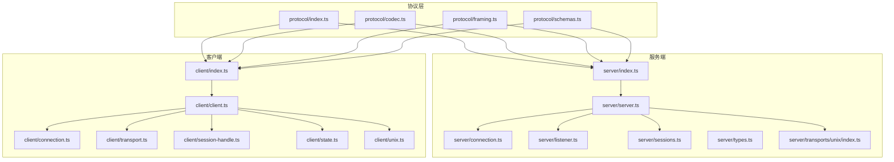
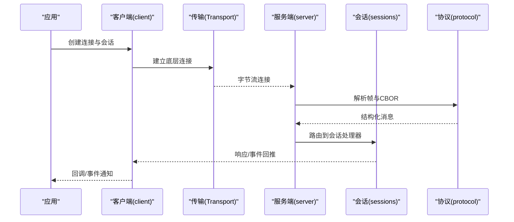
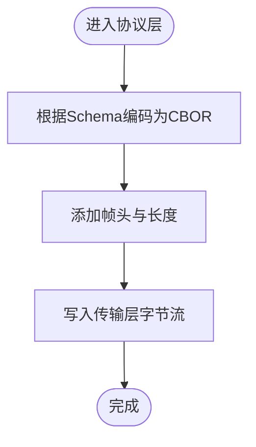
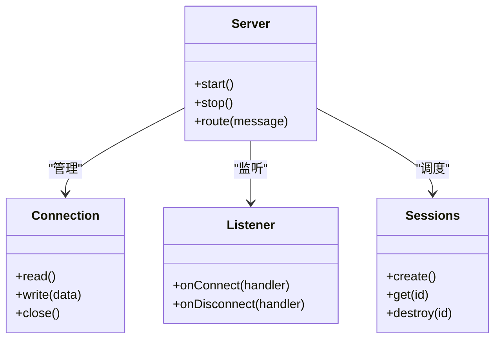
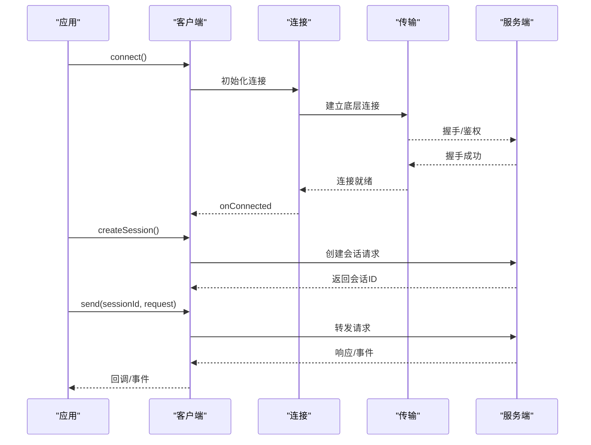
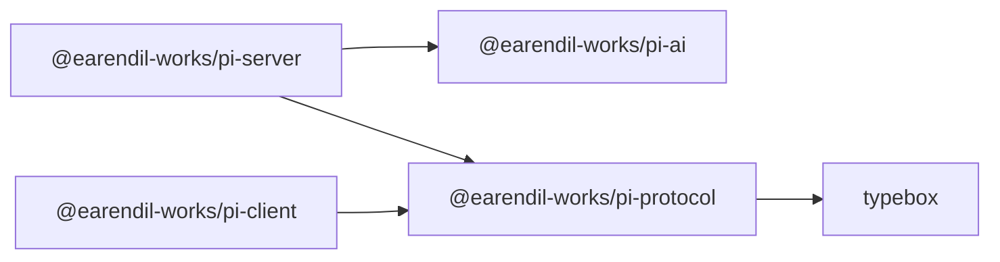

# API 参考

<cite>
**本文引用的文件**
- [README.md](file://README.md)
- [package.json](file://package.json)
- [packages/server/package.json](file://packages/server/package.json)
- [packages/client/package.json](file://packages/client/package.json)
- [packages/protocol/package.json](file://packages/protocol/package.json)
- [packages/server/src/index.ts](file://packages/server/src/index.ts)
- [packages/server/src/server.ts](file://packages/server/src/server.ts)
- [packages/server/src/connection.ts](file://packages/server/src/connection.ts)
- [packages/server/src/listener.ts](file://packages/server/src/listener.ts)
- [packages/server/src/sessions.ts](file://packages/server/src/sessions.ts)
- [packages/server/src/types.ts](file://packages/server/src/types.ts)
- [packages/server/src/errors.ts](file://packages/server/src/errors.ts)
- [packages/server/src/transports/unix/index.ts](file://packages/server/src/transports/unix/index.ts)
- [packages/client/src/index.ts](file://packages/client/src/index.ts)
- [packages/client/src/client.ts](file://packages/client/src/client.ts)
- [packages/client/src/connection.ts](file://packages/client/src/connection.ts)
- [packages/client/src/transport.ts](file://packages/client/src/transport.ts)
- [packages/client/src/session-handle.ts](file://packages/client/src/session-handle.ts)
- [packages/client/src/state.ts](file://packages/client/src/state.ts)
- [packages/client/src/errors.ts](file://packages/client/src/errors.ts)
- [packages/client/src/unix.ts](file://packages/client/src/unix.ts)
- [packages/protocol/src/index.ts](file://packages/protocol/src/index.ts)
- [packages/protocol/src/codec.ts](file://packages/protocol/src/codec.ts)
- [packages/protocol/src/framing.ts](file://packages/protocol/src/framing.ts)
- [packages/protocol/src/schemas.ts](file://packages/protocol/src/schemas.ts)
</cite>

## 目录
1. [简介](#简介)
2. [项目结构](#项目结构)
3. [核心组件](#核心组件)
4. [架构总览](#架构总览)
5. [详细组件分析](#详细组件分析)
6. [依赖关系分析](#依赖关系分析)
7. [性能考虑](#性能考虑)
8. [故障排查指南](#故障排查指南)
9. [结论](#结论)
10. [附录](#附录)

## 简介
本仓库为 Pi Agent Harness，提供可扩展的编码代理运行时、统一的 LLM 调用抽象、以及跨传输层的客户端/服务器协议。API 参考聚焦于：
- 传输无关的 CBOR 协议（包 protocol）
- 服务端会话与连接管理（包 server）
- 客户端连接与会话句柄（包 client）
- 基于 Unix Domain Socket 的本地 IPC 通道
- 认证与错误处理策略
- TypeScript 类型定义与版本兼容性说明

该文档面向希望集成 Pi 远程会话能力的开发者，涵盖 RESTful 与 WebSocket 的适用性说明、IPC/Pipe 通信模型、消息格式、事件类型、实时交互模式、错误码与异常处理、客户端集成示例与最佳实践、版本管理与向后兼容、性能与速率限制等。

## 项目结构
仓库采用 monorepo 组织，核心 API 相关包如下：
- @earendil-works/pi-protocol：传输无关的 CBOR 编解码与帧封装，提供 Schema 定义
- @earendil-works/pi-server：服务端实现，负责连接监听、会话生命周期、协议路由
- @earendil-works/pi-client：客户端实现，负责建立连接、发送请求、接收响应与事件
- 各包通过 exports 字段暴露入口，便于按需引入

图表来源
- [packages/protocol/src/index.ts](file://packages/protocol/src/index.ts)
- [packages/protocol/src/codec.ts](file://packages/protocol/src/codec.ts)
- [packages/protocol/src/framing.ts](file://packages/protocol/src/framing.ts)
- [packages/protocol/src/schemas.ts](file://packages/protocol/src/schemas.ts)
- [packages/server/src/index.ts](file://packages/server/src/index.ts)
- [packages/server/src/server.ts](file://packages/server/src/server.ts)
- [packages/server/src/connection.ts](file://packages/server/src/connection.ts)
- [packages/server/src/listener.ts](file://packages/server/src/listener.ts)
- [packages/server/src/sessions.ts](file://packages/server/src/sessions.ts)
- [packages/server/src/transports/unix/index.ts](file://packages/server/src/transports/unix/index.ts)
- [packages/client/src/index.ts](file://packages/client/src/index.ts)
- [packages/client/src/client.ts](file://packages/client/src/client.ts)
- [packages/client/src/connection.ts](file://packages/client/src/connection.ts)
- [packages/client/src/transport.ts](file://packages/client/src/transport.ts)
- [packages/client/src/session-handle.ts](file://packages/client/src/session-handle.ts)
- [packages/client/src/state.ts](file://packages/client/src/state.ts)
- [packages/client/src/unix.ts](file://packages/client/src/unix.ts)

章节来源
- [README.md:13-35](file://README.md#L13-L35)
- [package.json:1-75](file://package.json#L1-L75)
- [packages/server/package.json:1-58](file://packages/server/package.json#L1-L58)
- [packages/client/package.json:1-57](file://packages/client/package.json#L1-L57)
- [packages/protocol/package.json:1-49](file://packages/protocol/package.json#L1-L49)

## 核心组件
- 协议层（pi-protocol）
  - 提供 CBOR 编解码与帧封装能力，使用 TypeBox 进行 Schema 校验
  - 对外暴露统一接口，供客户端与服务端复用
- 服务端（pi-server）
  - 提供连接监听、会话管理、协议路由、Unix 域套接字传输
  - 暴露可组合的监听器与连接处理器
- 客户端（pi-client）
  - 提供传输无关的连接与会话句柄，支持 Unix 域套接字
  - 封装请求/响应与事件流，简化上层业务调用

章节来源
- [packages/protocol/src/index.ts](file://packages/protocol/src/index.ts)
- [packages/protocol/src/codec.ts](file://packages/protocol/src/codec.ts)
- [packages/protocol/src/framing.ts](file://packages/protocol/src/framing.ts)
- [packages/protocol/src/schemas.ts](file://packages/protocol/src/schemas.ts)
- [packages/server/src/index.ts](file://packages/server/src/index.ts)
- [packages/server/src/server.ts](file://packages/server/src/server.ts)
- [packages/server/src/connection.ts](file://packages/server/src/connection.ts)
- [packages/server/src/listener.ts](file://packages/server/src/listener.ts)
- [packages/server/src/sessions.ts](file://packages/server/src/sessions.ts)
- [packages/server/src/types.ts](file://packages/server/src/types.ts)
- [packages/client/src/index.ts](file://packages/client/src/index.ts)
- [packages/client/src/client.ts](file://packages/client/src/client.ts)
- [packages/client/src/connection.ts](file://packages/client/src/connection.ts)
- [packages/client/src/transport.ts](file://packages/client/src/transport.ts)
- [packages/client/src/session-handle.ts](file://packages/client/src/session-handle.ts)
- [packages/client/src/state.ts](file://packages/client/src/state.ts)

## 架构总览
Pi 的 API 以“传输无关”的 CBOR 协议为核心，客户端与服务端通过任意字节流传输（如 TCP、WebSocket、Unix Domain Socket）交换帧化后的 CBOR 消息。服务端负责会话生命周期管理，客户端通过会话句柄发起请求并订阅事件。

图表来源
- [packages/client/src/client.ts](file://packages/client/src/client.ts)
- [packages/client/src/connection.ts](file://packages/client/src/connection.ts)
- [packages/client/src/transport.ts](file://packages/client/src/transport.ts)
- [packages/server/src/server.ts](file://packages/server/src/server.ts)
- [packages/server/src/connection.ts](file://packages/server/src/connection.ts)
- [packages/server/src/sessions.ts](file://packages/server/src/sessions.ts)
- [packages/protocol/src/codec.ts](file://packages/protocol/src/codec.ts)
- [packages/protocol/src/framing.ts](file://packages/protocol/src/framing.ts)

## 详细组件分析

### 协议层（pi-protocol）
- 职责
  - 定义消息 Schema（TypeBox），用于序列化前校验
  - 提供 CBOR 编解码器，将结构化数据转为字节流
  - 提供帧封装/解封装，确保边界清晰、可分片重组
- 关键模块
  - schemas.ts：消息结构与字段约束
  - codec.ts：CBOR 编解码逻辑
  - framing.ts：帧头/长度/载荷的打包与解析
  - index.ts：对外导出统一 API
- 复杂度与性能
  - 编解码时间复杂度与消息大小线性相关
  - 帧封装避免粘包/半包问题，提升网络稳定性
- 错误处理
  - 非法 Schema 或损坏帧会抛出协议级错误，由上层捕获并降级

图表来源
- [packages/protocol/src/codec.ts](file://packages/protocol/src/codec.ts)
- [packages/protocol/src/framing.ts](file://packages/protocol/src/framing.ts)
- [packages/protocol/src/schemas.ts](file://packages/protocol/src/schemas.ts)

章节来源
- [packages/protocol/src/index.ts](file://packages/protocol/src/index.ts)
- [packages/protocol/src/codec.ts](file://packages/protocol/src/codec.ts)
- [packages/protocol/src/framing.ts](file://packages/protocol/src/framing.ts)
- [packages/protocol/src/schemas.ts](file://packages/protocol/src/schemas.ts)

### 服务端（pi-server）
- 职责
  - 监听连接（支持 Unix 域套接字）
  - 维护会话集合，分配会话 ID
  - 路由协议消息到具体处理器
  - 管理连接生命周期与资源释放
- 关键模块
  - server.ts：服务启动、监听、路由分发
  - connection.ts：单连接读写循环、错误处理
  - listener.ts：连接监听与接入控制
  - sessions.ts：会话注册、销毁、状态同步
  - transports/unix/index.ts：Unix 域套接字传输适配
  - types.ts：服务端类型定义
  - errors.ts：服务端错误类型
- 错误处理
  - 连接异常、协议解析失败、会话不存在等场景返回明确错误
- 性能特性
  - 基于事件驱动的 I/O 模型，适合高并发连接
  - 会话隔离，避免共享状态竞争

图表来源
- [packages/server/src/server.ts](file://packages/server/src/server.ts)
- [packages/server/src/connection.ts](file://packages/server/src/connection.ts)
- [packages/server/src/listener.ts](file://packages/server/src/listener.ts)
- [packages/server/src/sessions.ts](file://packages/server/src/sessions.ts)

章节来源
- [packages/server/src/index.ts](file://packages/server/src/index.ts)
- [packages/server/src/server.ts](file://packages/server/src/server.ts)
- [packages/server/src/connection.ts](file://packages/server/src/connection.ts)
- [packages/server/src/listener.ts](file://packages/server/src/listener.ts)
- [packages/server/src/sessions.ts](file://packages/server/src/sessions.ts)
- [packages/server/src/types.ts](file://packages/server/src/types.ts)
- [packages/server/src/errors.ts](file://packages/server/src/errors.ts)
- [packages/server/src/transports/unix/index.ts](file://packages/server/src/transports/unix/index.ts)

### 客户端（pi-client）
- 职责
  - 建立与服务的连接（支持 Unix 域套接字）
  - 封装请求/响应与事件订阅
  - 提供会话句柄，简化业务调用
- 关键模块
  - client.ts：客户端主入口，连接与会话管理
  - connection.ts：连接生命周期与重试策略
  - transport.ts：传输抽象，屏蔽底层差异
  - session-handle.ts：会话操作封装（请求、事件）
  - state.ts：客户端状态机（连接中、已连接、断开等）
  - unix.ts：Unix 域套接字客户端适配
  - errors.ts：客户端错误类型
- 错误处理
  - 连接失败、超时、协议错误、会话不存在等
- 性能特性
  - 异步非阻塞 I/O，支持批量请求与事件流

图表来源
- [packages/client/src/client.ts](file://packages/client/src/client.ts)
- [packages/client/src/connection.ts](file://packages/client/src/connection.ts)
- [packages/client/src/transport.ts](file://packages/client/src/transport.ts)
- [packages/client/src/session-handle.ts](file://packages/client/src/session-handle.ts)
- [packages/client/src/unix.ts](file://packages/client/src/unix.ts)

章节来源
- [packages/client/src/index.ts](file://packages/client/src/index.ts)
- [packages/client/src/client.ts](file://packages/client/src/client.ts)
- [packages/client/src/connection.ts](file://packages/client/src/connection.ts)
- [packages/client/src/transport.ts](file://packages/client/src/transport.ts)
- [packages/client/src/session-handle.ts](file://packages/client/src/session-handle.ts)
- [packages/client/src/state.ts](file://packages/client/src/state.ts)
- [packages/client/src/errors.ts](file://packages/client/src/errors.ts)
- [packages/client/src/unix.ts](file://packages/client/src/unix.ts)

### 认证与权限
- 认证方式
  - 环境变量注入 API Key（适用于 LLM 提供商）
  - 本地 IPC（Unix 域套接字）通常用于进程内或本机可信环境
- 安全建议
  - 生产环境建议使用容器化或沙箱隔离
  - 对敏感凭据进行最小权限访问控制

章节来源
- [README.md:38-47](file://README.md#L38-L47)
- [packages/ai/src/providers/moonshotai-cn.ts:1-15](file://packages/ai/src/providers/moonshotai-cn.ts#L1-L15)

### 实时交互模式（WebSocket 与 IPC）
- WebSocket
  - 若需浏览器或跨进程实时通信，可在传输层之上封装 WebSocket 适配器，复用协议层的 CBOR 帧
  - 事件推送通过服务端主动推送消息至客户端
- IPC/Unix 域套接字
  - 本机高性能通信，低延迟、零拷贝优势
  - 适用于 CLI、TUI、本地代理等场景

章节来源
- [packages/server/src/transports/unix/index.ts](file://packages/server/src/transports/unix/index.ts)
- [packages/client/src/unix.ts](file://packages/client/src/unix.ts)

## 依赖关系分析
- 包间依赖
  - server 依赖 ai 与 protocol
  - client 依赖 protocol
  - protocol 依赖 typebox
- 版本与引擎
  - Node.js >= 22.19.0
  - 工作区脚本统一构建顺序

图表来源
- [packages/server/package.json:1-58](file://packages/server/package.json#L1-L58)
- [packages/client/package.json:1-57](file://packages/client/package.json#L1-L57)
- [packages/protocol/package.json:1-49](file://packages/protocol/package.json#L1-L49)

章节来源
- [package.json:1-75](file://package.json#L1-L75)
- [packages/server/package.json:1-58](file://packages/server/package.json#L1-L58)
- [packages/client/package.json:1-57](file://packages/client/package.json#L1-L57)
- [packages/protocol/package.json:1-49](file://packages/protocol/package.json#L1-L49)

## 性能考虑
- 传输层
  - 优先使用 Unix 域套接字进行本机通信，降低延迟与开销
  - 网络传输时合理设置帧大小与缓冲策略
- 协议层
  - 使用 CBOR 减少序列化开销；Schema 校验在必要时启用
- 服务端
  - 会话隔离与资源回收，避免内存泄漏
  - 连接池与并发控制，防止过载
- 客户端
  - 批量请求合并、退避重试、超时控制
  - 事件流背压处理，避免阻塞 UI 线程

[本节为通用指导，不直接分析具体文件]

## 故障排查指南
- 常见问题
  - 连接失败：检查端口/路径、防火墙、权限
  - 协议错误：确认 Schema 一致性与帧格式
  - 会话丢失：检查服务端会话生命周期与客户端重连逻辑
- 调试建议
  - 启用日志与追踪，记录请求/响应与事件
  - 使用最小复现用例定位问题
- 错误分类
  - 连接错误：网络不可达、权限不足
  - 协议错误：消息格式非法、版本不兼容
  - 业务错误：参数校验失败、资源不存在

章节来源
- [packages/server/src/errors.ts](file://packages/server/src/errors.ts)
- [packages/client/src/errors.ts](file://packages/client/src/errors.ts)

## 结论
本 API 参考围绕传输无关的 CBOR 协议，提供了稳定的客户端/服务端抽象与本地 IPC 能力。通过清晰的会话管理与错误处理机制，开发者可以高效集成 Pi 的远程会话能力。建议在生产环境中结合容器化与沙箱技术，确保安全与稳定。

[本节为总结，不直接分析具体文件]

## 附录

### TypeScript 类型定义与接口说明
- 协议层
  - 消息 Schema：在 schemas.ts 中定义，用于前后端一致性
  - 编解码接口：在 codec.ts 中提供 encode/decode 方法
  - 帧接口：在 framing.ts 中提供 frame/unframe 方法
- 服务端
  - 类型定义：在 types.ts 中集中声明
  - 错误类型：在 errors.ts 中定义
- 客户端
  - 连接与会话：在 client.ts、connection.ts、session-handle.ts 中定义
  - 状态机：在 state.ts 中描述连接状态转换
  - 错误类型：在 errors.ts 中定义

章节来源
- [packages/protocol/src/schemas.ts](file://packages/protocol/src/schemas.ts)
- [packages/protocol/src/codec.ts](file://packages/protocol/src/codec.ts)
- [packages/protocol/src/framing.ts](file://packages/protocol/src/framing.ts)
- [packages/server/src/types.ts](file://packages/server/src/types.ts)
- [packages/server/src/errors.ts](file://packages/server/src/errors.ts)
- [packages/client/src/client.ts](file://packages/client/src/client.ts)
- [packages/client/src/connection.ts](file://packages/client/src/connection.ts)
- [packages/client/src/session-handle.ts](file://packages/client/src/session-handle.ts)
- [packages/client/src/state.ts](file://packages/client/src/state.ts)
- [packages/client/src/errors.ts](file://packages/client/src/errors.ts)

### RESTful API 与 WebSocket API 说明
- RESTful
  - 本项目未内置 HTTP REST 端点；如需 HTTP 暴露，可在 server 之上封装 HTTP 路由，将请求转换为协议消息
- WebSocket
  - 可通过传输层适配 WebSocket，复用协议帧；事件推送与双向通信天然契合
- 认证方法
  - 环境变量注入 API Key（适用于 LLM 提供商）
  - 本地 IPC 信任本机进程

章节来源
- [packages/server/src/server.ts](file://packages/server/src/server.ts)
- [packages/client/src/transport.ts](file://packages/client/src/transport.ts)
- [packages/ai/src/providers/moonshotai-cn.ts:1-15](file://packages/ai/src/providers/moonshotai-cn.ts#L1-L15)

### IPC/Pipe 通信的数据流与进程同步
- 数据流
  - 客户端通过 Unix 域套接字发送帧化 CBOR 消息
  - 服务端接收并解析，路由到对应会话处理器
- 进程同步
  - 基于事件驱动的非阻塞 I/O，无需显式锁
  - 会话隔离保证状态一致性

章节来源
- [packages/server/src/transports/unix/index.ts](file://packages/server/src/transports/unix/index.ts)
- [packages/client/src/unix.ts](file://packages/client/src/unix.ts)

### 客户端集成示例与最佳实践
- 基本流程
  - 创建客户端实例
  - 建立连接（Unix 域套接字）
  - 创建会话并发送请求
  - 订阅事件并处理响应
- 最佳实践
  - 使用重试与超时控制
  - 合理管理会话生命周期
  - 对错误进行分类处理与上报

章节来源
- [packages/client/src/client.ts](file://packages/client/src/client.ts)
- [packages/client/src/connection.ts](file://packages/client/src/connection.ts)
- [packages/client/src/session-handle.ts](file://packages/client/src/session-handle.ts)

### API 版本管理与向后兼容性
- 版本策略
  - 包版本遵循语义化版本，升级时注意破坏性变更
  - 协议 Schema 演进应向后兼容，新增字段可选
- 兼容性保证
  - 客户端与服务端需保持协议版本一致
  - 通过 Schema 校验确保消息结构正确

章节来源
- [packages/protocol/src/schemas.ts](file://packages/protocol/src/schemas.ts)
- [package.json:1-75](file://package.json#L1-L75)

### 性能考虑与速率限制
- 性能优化
  - 使用 Unix 域套接字降低延迟
  - 批量请求与事件合并
  - 合理设置超时与重试策略
- 速率限制
  - 在服务端对高频请求进行限流
  - 客户端实施指数退避与令牌桶算法

[本节为通用指导，不直接分析具体文件]