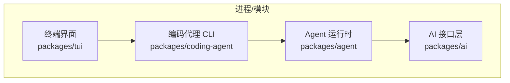
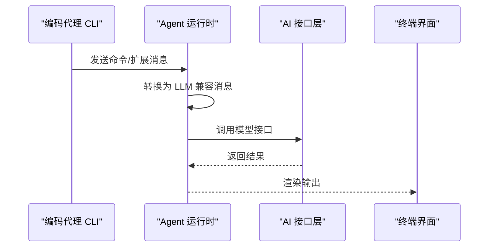
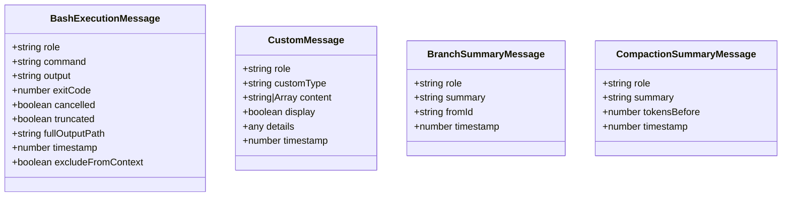
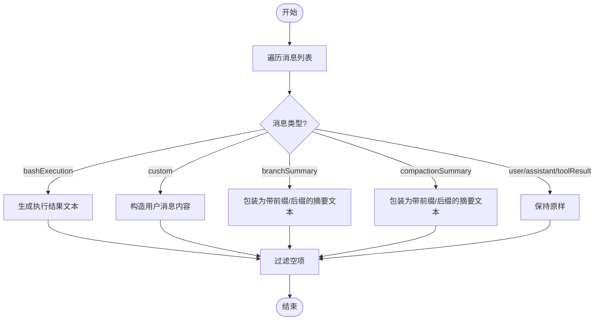
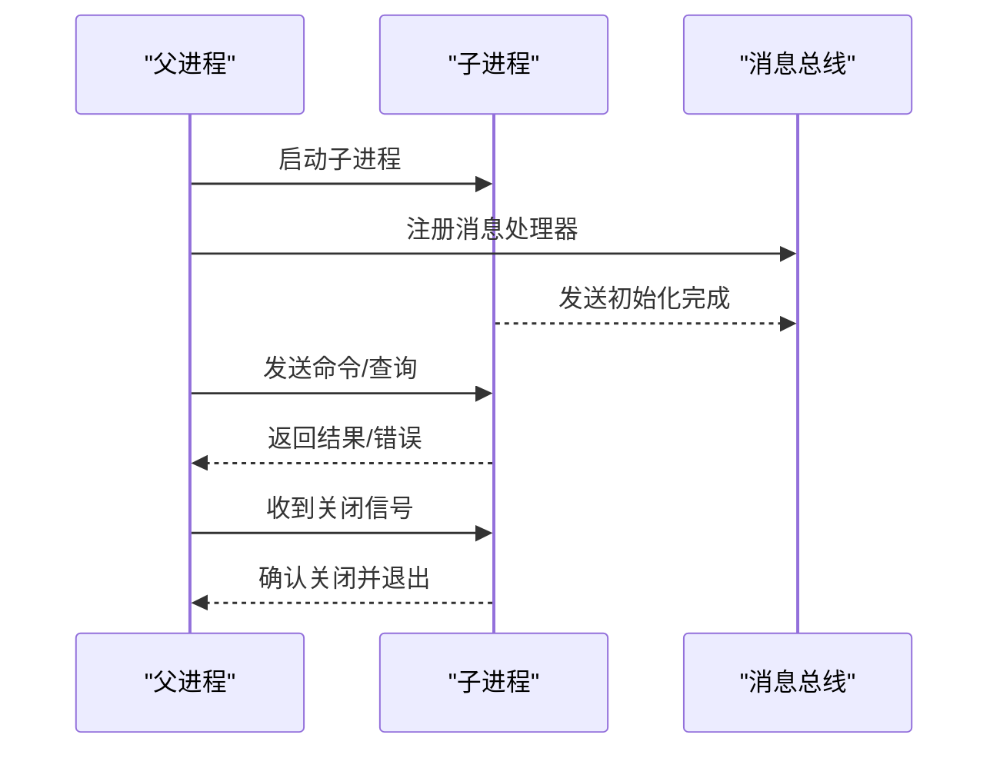
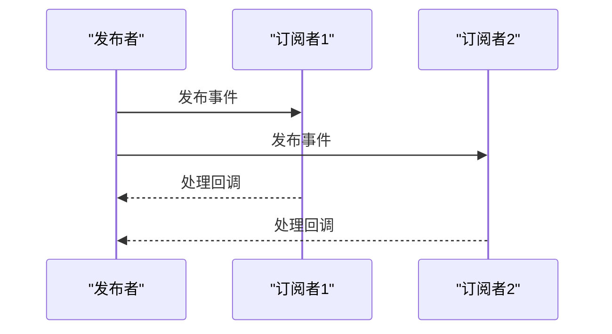
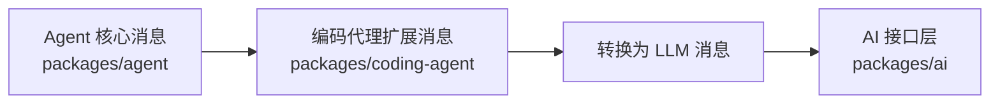

# IPC 通信

<cite>
**本文引用的文件**
- [README.md](file://README.md)
- [messages.ts（agent harness）](file://packages/agent/src/harness/messages.ts)
- [messages.ts（coding-agent core）](file://packages/coding-agent/src/core/messages.ts)
</cite>

## 目录
1. [简介](#简介)
2. [项目结构](#项目结构)
3. [核心组件](#核心组件)
4. [架构总览](#架构总览)
5. [详细组件分析](#详细组件分析)
6. [依赖关系分析](#依赖关系分析)
7. [性能考虑](#性能考虑)
8. [故障排除指南](#故障排除指南)
9. [结论](#结论)
10. [附录](#附录)

## 简介
本文件聚焦于进程间通信（IPC）在仓库中的实现与使用方式，覆盖以下主题：
- 管道、消息队列与共享内存的使用策略
- 消息传递协议：消息格式、序列化方式与数据编码
- 进程同步机制：锁、信号量与条件变量
- 异步通信模式：请求-响应与发布-订阅
- 进程生命周期管理：启动、通信与优雅关闭
- 错误处理策略：连接失败、超时与重试
- 性能调优与故障排除

说明：本仓库以 Node.js/TypeScript 为主，IPC 主要通过子进程、事件流与消息协议进行协作。当前代码库中可见的“消息”类型集中在 agent 与 coding-agent 的消息定义与转换逻辑中，体现了跨进程/模块的消息契约与序列化边界。

## 项目结构
仓库采用多包 monorepo 组织，关键与 IPC 相关的包包括：
- packages/agent：Agent 运行时与工具调用、状态管理，包含消息类型与转换逻辑
- packages/coding-agent：交互式编码代理 CLI，扩展了 AgentMessage 并定义具体消息类型
- packages/ai：统一的多提供者 LLM API（与 IPC 间接相关，常用于远程服务交互）
- packages/tui：终端 UI，通常通过标准输入输出或本地通道与后端通信

图表来源
- [README.md:26-35](file://README.md#L26-L35)

章节来源
- [README.md:26-35](file://README.md#L26-L35)

## 核心组件
- 消息类型与转换器：用于在不同进程/模块之间传递结构化消息，并提供到 LLM 兼容格式的转换
- 自定义消息扩展：允许扩展点注入自定义消息，便于跨进程分发与展示
- 摘要消息：分支与压缩摘要消息，用于上下文管理与历史压缩

章节来源
- [messages.ts（agent harness）:19-61](file://packages/agent/src/harness/messages.ts#L19-L61)
- [messages.ts（coding-agent core）:26-77](file://packages/coding-agent/src/core/messages.ts#L26-L77)

## 架构总览
下图展示了典型的消息流转路径：CLI 发起命令或扩展消息，经由 Agent 运行时转换为 LLM 可理解的消息；必要时与 AI 接口层交互，最终由 TUI 呈现结果。

图表来源
- [messages.ts（coding-agent core）:140-195](file://packages/coding-agent/src/core/messages.ts#L140-L195)
- [messages.ts（agent harness）:124-168](file://packages/agent/src/harness/messages.ts#L124-L168)

## 详细组件分析

### 消息类型与协议
- Bash 执行消息：记录命令、输出、退出码、是否取消、是否截断等元信息，用于将外部命令执行结果纳入对话上下文
- 自定义消息：支持扩展注入任意内容（文本或图像），并可控制是否在 UI 上显示
- 分支与压缩摘要消息：用于会话历史压缩与分支回溯时的上下文恢复

图表来源
- [messages.ts（agent harness）:19-61](file://packages/agent/src/harness/messages.ts#L19-L61)
- [messages.ts（coding-agent core）:26-77](file://packages/coding-agent/src/core/messages.ts#L26-L77)

章节来源
- [messages.ts（agent harness）:19-61](file://packages/agent/src/harness/messages.ts#L19-L61)
- [messages.ts（coding-agent core）:26-77](file://packages/coding-agent/src/core/messages.ts#L26-L77)

### 消息转换流程（到 LLM 兼容格式）
- 将内部消息（如 Bash 执行、自定义、摘要）映射为 LLM 可识别的用户/助手/工具结果消息
- 对 Bash 执行消息，生成可读文本以便 LLM 理解执行结果
- 过滤掉不应进入上下文的条目（例如标记为排除的命令输出）

图表来源
- [messages.ts（coding-agent core）:140-195](file://packages/coding-agent/src/core/messages.ts#L140-L195)
- [messages.ts（agent harness）:124-168](file://packages/agent/src/harness/messages.ts#L124-L168)

章节来源
- [messages.ts（coding-agent core）:140-195](file://packages/coding-agent/src/core/messages.ts#L140-L195)
- [messages.ts（agent harness）:124-168](file://packages/agent/src/harness/messages.ts#L124-L168)

### 进程生命周期管理（示例）
- 启动：CLI 初始化并加载 Agent 运行时，建立消息通道（如子进程 stdin/stdout 或本地套接字）
- 通信：通过消息协议发送命令、扩展消息与查询；接收结果并转换为 UI 可渲染格式
- 优雅关闭：监听终止信号，完成未决任务后关闭通道，释放资源

[此图为概念性流程图，不直接映射到具体源码文件]

### 异步通信模式
- 请求-响应：CLI 向 Agent 发送请求，等待响应后再继续；适用于命令执行与工具调用
- 发布-订阅：扩展或工具将事件发布到总线，多个消费者（如日志、遥测、UI）订阅并处理

[此图为概念性流程图，不直接映射到具体源码文件]

## 依赖关系分析
- 消息类型定义位于 agent 与 coding-agent 两个位置，后者扩展了基础消息类型，形成清晰的层次
- 转换函数将内部消息映射为 LLM 兼容格式，降低上层业务对底层协议的耦合
- README 明确了各包职责，有助于理解 IPC 边界与集成点

图表来源
- [messages.ts（agent harness）:19-61](file://packages/agent/src/harness/messages.ts#L19-L61)
- [messages.ts（coding-agent core）:26-77](file://packages/coding-agent/src/core/messages.ts#L26-L77)
- [README.md:26-35](file://README.md#L26-L35)

章节来源
- [README.md:26-35](file://README.md#L26-L35)
- [messages.ts（agent harness）:19-61](file://packages/agent/src/harness/messages.ts#L19-L61)
- [messages.ts（coding-agent core）:26-77](file://packages/coding-agent/src/core/messages.ts#L26-L77)

## 性能考虑
- 消息体积控制：避免在自定义消息中携带过大负载，必要时采用分块传输或引用路径
- 序列化成本：优先使用轻量级 JSON 或二进制协议（如 MessagePack）以降低网络开销
- 背压与限流：在高吞吐场景下引入队列长度限制与消费速率控制，防止内存膨胀
- 批处理：合并小消息批量发送，减少系统调用次数
- 缓存与去重：对重复查询结果进行短期缓存，降低重复计算与 I/O

[本节提供通用指导，不直接分析具体文件]

## 故障排除指南
- 连接失败：检查子进程启动参数与端口/管道可用性；增加重试与退避策略
- 超时处理：为每个请求设置合理超时；对长耗时操作采用心跳或进度上报
- 重试机制：对幂等操作实施指数退避重试；对非幂等操作需加幂等键
- 死锁与竞态：确保临界区最小化，使用锁/信号量保护共享资源；避免嵌套锁顺序不一致
- 日志与诊断：为关键路径添加结构化日志，记录消息 ID、时间戳与错误堆栈

[本节提供通用指导，不直接分析具体文件]

## 结论
本仓库通过清晰的消息类型定义与转换逻辑，构建了跨进程/模块的通信契约。结合子进程、事件流与统一的 LLM 消息格式，实现了可扩展的 IPC 体系。建议在后续演进中补充更完善的错误处理、超时与重试策略，并在高并发场景下进行压力测试与性能调优。

## 附录
- 参考包职责与定位：见 README 中的包清单与描述
- 消息类型与转换：参见 agent 与 coding-agent 的消息定义与转换函数

章节来源
- [README.md:26-35](file://README.md#L26-L35)
- [messages.ts（agent harness）:19-61](file://packages/agent/src/harness/messages.ts#L19-L61)
- [messages.ts（coding-agent core）:26-77](file://packages/coding-agent/src/core/messages.ts#L26-L77)