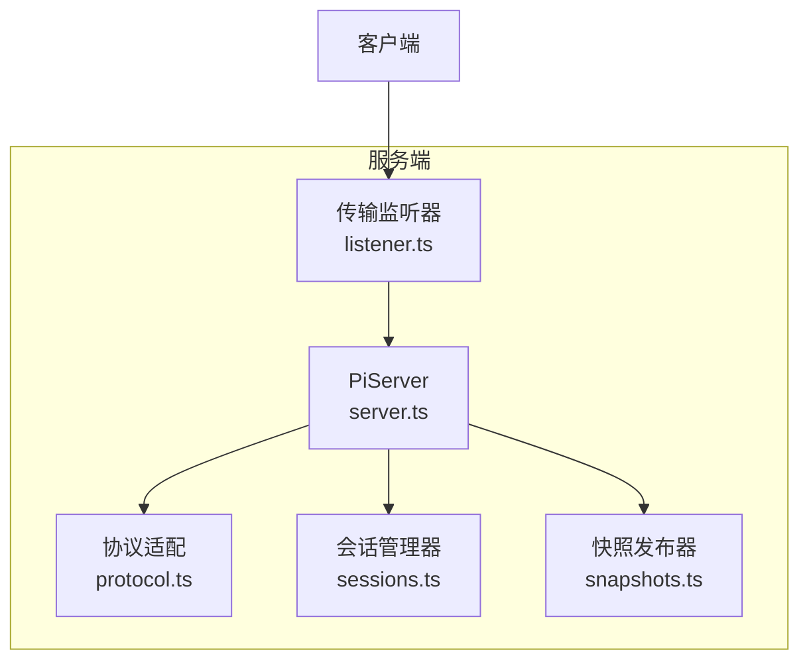
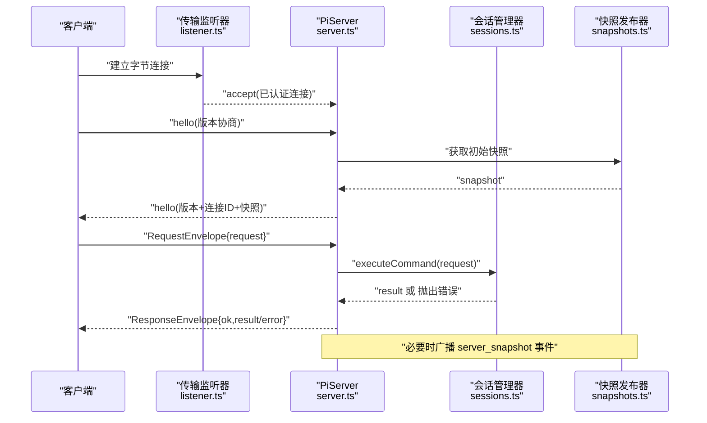
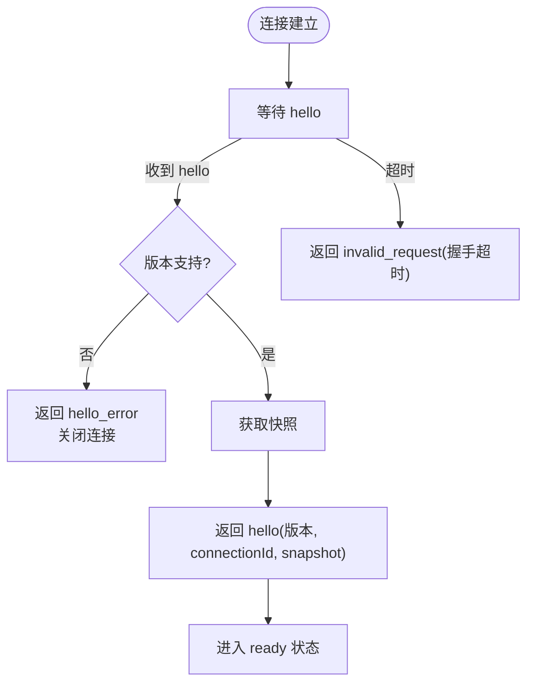
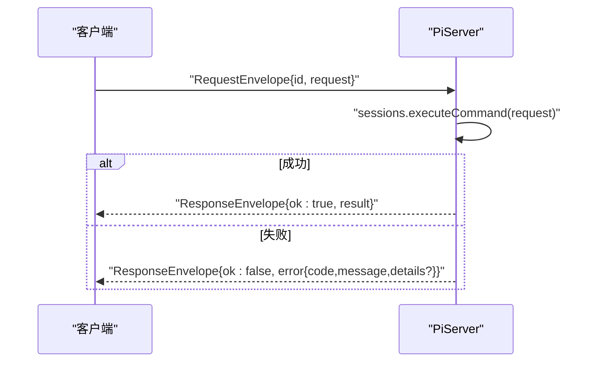
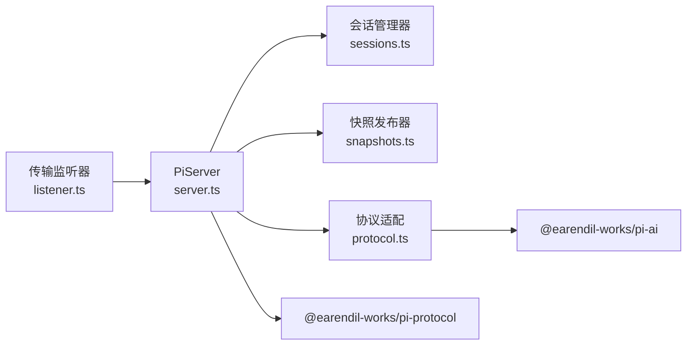

# RESTful API

<cite>
**本文引用的文件**
- [README.md](file://README.md)
- [packages/server/README.md](file://packages/server/README.md)
- [packages/server/src/server.ts](file://packages/server/src/server.ts)
- [packages/server/src/listener.ts](file://packages/server/src/listener.ts)
- [packages/server/src/protocol.ts](file://packages/server/src/protocol.ts)
</cite>

## 目录
1. [简介](#简介)
2. [项目结构](#项目结构)
3. [核心组件](#核心组件)
4. [架构总览](#架构总览)
5. [详细组件分析](#详细组件分析)
6. [依赖关系分析](#依赖关系分析)
7. [性能考虑](#性能考虑)
8. [故障排查指南](#故障排查指南)
9. [结论](#结论)
10. [附录](#附录)

## 简介
本仓库提供的是 Pi Agent Harness，包含可插拔的编码代理、统一的多模型 LLM 抽象以及会话服务器。当前代码库并未暴露传统意义上的 HTTP RESTful API（GET/POST/PUT/DELETE），而是通过自定义协议在字节连接上以长度前缀的 CBOR 消息进行请求/响应与事件推送。因此，本节文档将基于现有实现，说明实际的“接口”形态：长连接握手、命令执行、快照广播与错误处理，并给出客户端集成建议与安全注意事项。

## 项目结构
- packages/server：会话服务器的核心实现，负责监听传输层、握手、会话生命周期管理、快照发布与协议编解码。
- packages/ai：多提供商 LLM 的统一抽象与适配器（非 HTTP REST）。
- 其他包：代理运行时、TUI、遥测等。

图表来源
- [packages/server/src/server.ts:39-79](file://packages/server/src/server.ts#L39-L79)
- [packages/server/src/listener.ts:3-10](file://packages/server/src/listener.ts#L3-L10)
- [packages/server/src/protocol.ts:141-186](file://packages/server/src/protocol.ts#L141-L186)

章节来源
- [README.md:13-36](file://README.md#L13-L36)
- [packages/server/README.md:7-38](file://packages/server/README.md#L7-L38)

## 核心组件
- PiServer：会话服务器主类，负责启动监听、连接接受、握手、请求分发、响应发送、断开清理与错误上报。
- PiServerListener：传输层抽象，由具体实现（如 Unix Socket）完成认证授权后，将已认证的字节连接交给 PiServer。
- 协议适配：将内部 pi-ai 领域对象转换为协议兼容的 JSON 片段，并进行严格校验与清洗。
- 会话管理与快照：维护活跃会话、元数据列表与增量快照广播。

章节来源
- [packages/server/src/server.ts:39-79](file://packages/server/src/server.ts#L39-L79)
- [packages/server/src/listener.ts:3-10](file://packages/server/src/listener.ts#L3-L10)
- [packages/server/src/protocol.ts:141-186](file://packages/server/src/protocol.ts#L141-L186)

## 架构总览
下图展示了从客户端到服务端的完整交互流程：建立传输连接 → 发送 hello → 握手成功 → 发送请求信封 → 收到响应或事件 → 断开连接。

图表来源
- [packages/server/src/server.ts:112-219](file://packages/server/src/server.ts#L112-L219)
- [packages/server/src/server.ts:221-269](file://packages/server/src/server.ts#L221-L269)
- [packages/server/src/server.ts:293-328](file://packages/server/src/server.ts#L293-L328)

## 详细组件分析

### 传输与握手
- 传输层：通过 PiServerListener 抽象，具体实现（如 Unix 套接字）负责绑定地址、接收连接并完成认证/鉴权，再将连接交由 PiServer.accept。
- 握手阶段：客户端首条消息必须为 hello；服务端校验协议版本，返回 hello（含 connectionId 与初始 snapshot），随后进入 ready 状态。
- 超时控制：握手阶段存在超时计时器，超时将返回协议错误并关闭连接。

图表来源
- [packages/server/src/server.ts:122-149](file://packages/server/src/server.ts#L122-L149)
- [packages/server/src/server.ts:185-219](file://packages/server/src/server.ts#L185-L219)
- [packages/server/src/server.ts:221-249](file://packages/server/src/server.ts#L221-L249)

章节来源
- [packages/server/src/server.ts:112-219](file://packages/server/src/server.ts#L112-L219)
- [packages/server/src/listener.ts:3-10](file://packages/server/src/listener.ts#L3-L10)

### 请求/响应与事件
- 请求格式：客户端在 ready 状态下发送 RequestEnvelope，包含 id 与 request。
- 响应格式：服务端返回 ResponseEnvelope，ok=true 时携带 result；ok=false 时携带 error（code/message/details）。
- 事件：握手成功后可能立即推送一次 server_snapshot 事件；连接断开或快照更新时也可能广播。

图表来源
- [packages/server/src/server.ts:252-269](file://packages/server/src/server.ts#L252-L269)
- [packages/server/src/server.ts:315-328](file://packages/server/src/server.ts#L315-L328)

章节来源
- [packages/server/src/server.ts:252-269](file://packages/server/src/server.ts#L252-L269)

### 协议数据转换与校验
- 将内部 pi-ai 对象转换为协议兼容的 JSON 片段，强制类型检查、去循环引用、过滤函数/符号等不可序列化值。
- 对诊断信息做安全清洗，避免影响执行语义。
- 工具调用结果需与原始 ToolCall 关联校验，确保一致性。

章节来源
- [packages/server/src/protocol.ts:141-186](file://packages/server/src/protocol.ts#L141-L186)
- [packages/server/src/protocol.ts:354-382](file://packages/server/src/protocol.ts#L354-L382)

### 错误处理策略
- 协议级错误：握手失败、版本不匹配、非法请求等，返回 hello_error 或 ResponseEnvelope{ok:false}。
- 内部错误：封装为 internal_error，屏蔽细节，仅返回通用提示。
- 未实现：not_implemented。
- 异常上报：所有异常均通过 onError 回调上报，便于外部监控。

章节来源
- [packages/server/src/server.ts:315-369](file://packages/server/src/server.ts#L315-L369)

## 依赖关系分析
- PiServer 依赖：
  - 传输监听器（PiServerListener）：负责底层连接与认证。
  - 会话管理器（LiveSessionManager）：执行命令、管理会话生命周期。
  - 快照发布器（ServerSnapshotPublisher）：提供初始快照与增量广播。
  - 协议模块：负责消息编解码与数据转换。
- 外部依赖：@earendil-works/pi-protocol（协议定义）、@earendil-works/pi-ai（领域对象）。

图表来源
- [packages/server/src/server.ts:39-79](file://packages/server/src/server.ts#L39-L79)
- [packages/server/src/protocol.ts:1-23](file://packages/server/src/protocol.ts#L1-L23)

章节来源
- [packages/server/src/server.ts:39-79](file://packages/server/src/server.ts#L39-L79)
- [packages/server/src/protocol.ts:1-23](file://packages/server/src/protocol.ts#L1-L23)

## 性能考虑
- 帧大小限制：通过 maxFrameLength 限制单帧大小，防止过大消息导致内存压力。
- 握手超时：默认 5 秒，避免资源长期占用。
- 批量消息：解码器支持一次性解析多条消息，减少调度开销。
- 快照广播：仅在必要时机广播，降低网络与 CPU 消耗。
- 建议：
  - 合理设置 maxFrameLength，结合业务消息体大小。
  - 使用连接池复用长连接，减少握手成本。
  - 对高频事件进行节流或合并。

章节来源
- [packages/server/src/server.ts:35-38](file://packages/server/src/server.ts#L35-L38)
- [packages/server/src/server.ts:122-149](file://packages/server/src/server.ts#L122-L149)
- [packages/server/src/server.ts:170-183](file://packages/server/src/server.ts#L170-L183)

## 故障排查指南
- 常见问题定位：
  - 握手失败：检查首条消息是否为 hello，以及协议版本是否受支持。
  - 版本不匹配：客户端与服务端需保持协议版本一致。
  - 请求无效：确认 RequestEnvelope 结构与字段合法性。
  - 内部错误：查看 onError 回调日志，定位根因。
- 调试建议：
  - 启用传输层日志，记录连接建立/断开与消息收发。
  - 捕获并打印 ResponseEnvelope.error 的 code/message/details。
  - 使用测试客户端（testing 子模块）进行确定性协议一致性测试。

章节来源
- [packages/server/src/server.ts:185-219](file://packages/server/src/server.ts#L185-L219)
- [packages/server/src/server.ts:252-269](file://packages/server/src/server.ts#L252-L269)
- [packages/server/src/server.ts:315-369](file://packages/server/src/server.ts#L315-L369)
- [packages/server/README.md:42-44](file://packages/server/README.md#L42-L44)

## 结论
本项目未提供传统 HTTP RESTful API，而是通过自定义协议的长连接进行通信。其优势在于低延迟、双向事件推送与细粒度控制；挑战在于需要客户端实现协议握手、消息编解码与重连机制。建议在部署时配合传输层的认证授权（如 Unix 权限或 WebSocket 升级鉴权），并结合监控与日志完善可观测性。

## 附录

### 接口规范摘要（非 HTTP REST）
- 传输：字节流，长度前缀 CBOR 消息。
- 握手：
  - 客户端 → 服务端：hello{version}
  - 服务端 → 客户端：hello{version, connectionId, snapshot}
- 请求/响应：
  - 客户端 → 服务端：RequestEnvelope{id, request}
  - 服务端 → 客户端：ResponseEnvelope{ok, result|error}
- 事件：
  - 服务端 → 客户端：event{type:"server_snapshot", snapshot}

章节来源
- [packages/server/README.md:36-38](file://packages/server/README.md#L36-L38)
- [packages/server/src/server.ts:185-249](file://packages/server/src/server.ts#L185-L249)
- [packages/server/src/server.ts:252-269](file://packages/server/src/server.ts#L252-L269)

### 认证与权限
- 传输层认证：由 PiServerListener 的具体实现负责（例如 Unix 套接字的文件系统权限，或 WebSocket 升级时的凭据校验）。PiServer 假定传入的连接已完成认证与授权。
- 应用层权限：由上层服务在 PiServerService 中实现，例如 listSessions、createSession 等方法内校验用户角色与资源访问。

章节来源
- [packages/server/README.md:36-38](file://packages/server/README.md#L36-L38)

### 速率限制、缓存与性能优化
- 速率限制：未在核心服务器中内置，建议在传输层或网关层实现（如令牌桶、滑动窗口）。
- 缓存策略：利用快照机制减少重复状态同步；对只读查询可在服务层引入本地缓存。
- 性能优化：
  - 合理配置 maxFrameLength 与握手超时。
  - 复用长连接，避免频繁握手。
  - 对高频事件进行聚合与节流。

[本节为通用建议，不直接分析具体文件]

### API 版本管理与向后兼容
- 协议版本：握手阶段进行版本协商，不支持的版本将被拒绝。
- 兼容性：新增字段应向后兼容；破坏性变更需升级协议版本并通知客户端。
- 建议：在服务端保留旧版本兼容逻辑，逐步淘汰旧客户端。

章节来源
- [packages/server/src/server.ts:221-228](file://packages/server/src/server.ts#L221-L228)

### 客户端集成示例与最佳实践
- 连接与握手：
  - 建立传输连接后，首先发送 hello。
  - 接收 hello 并保存 connectionId，用于后续请求标识。
- 请求与响应：
  - 构造 RequestEnvelope，分配唯一 id。
  - 处理 ResponseEnvelope，区分 ok=true/result 与 ok=false/error。
- 事件处理：
  - 订阅 event 消息，处理 server_snapshot 等事件。
- 错误与重连：
  - 捕获握手错误与协议错误，实施指数退避重连。
  - 断开后重新握手并拉取最新快照。

[本节为通用指导，不直接分析具体文件]