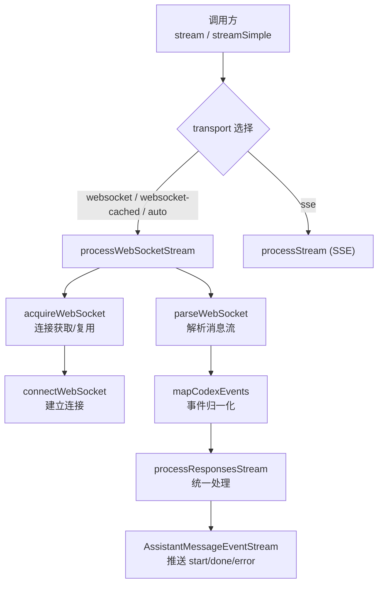
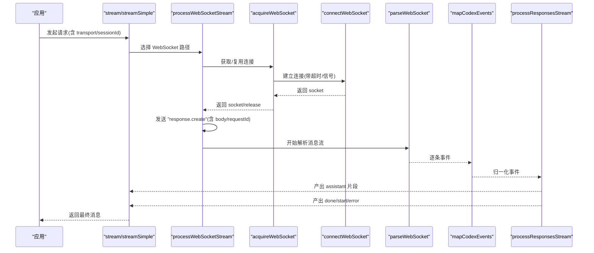
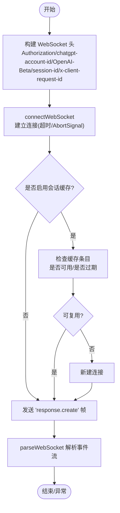
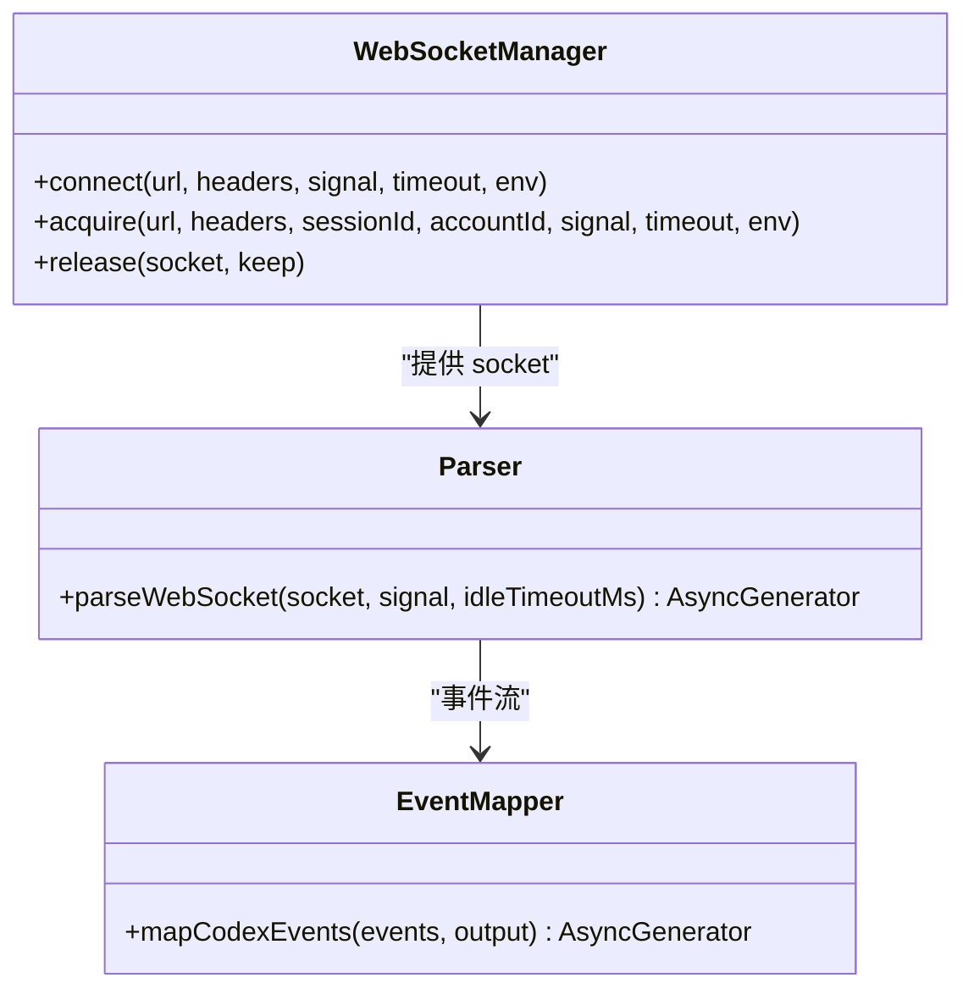
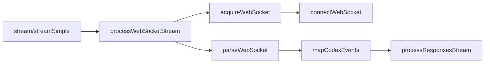

# WebSocket API

<cite>
**本文引用的文件**
- [openai-codex-responses.ts](file://packages/ai/src/api/openai-codex-responses.ts)
- [codex-websocket-cached-probe.ts](file://packages/ai/test/codex-websocket-cached-probe.ts)
</cite>

## 目录
1. [简介](#简介)
2. [项目结构](#项目结构)
3. [核心组件](#核心组件)
4. [架构总览](#架构总览)
5. [详细组件分析](#详细组件分析)
6. [依赖关系分析](#依赖关系分析)
7. [性能考虑](#性能考虑)
8. [故障排查指南](#故障排查指南)
9. [结论](#结论)
10. [附录](#附录)

## 简介
本文件面向使用 OpenAI Codex Responses 的 WebSocket 传输模式，系统化说明连接建立、握手协议与配置、消息格式规范、事件类型系统、实时交互模式（双向通信、流式传输、空闲超时）、连接管理（重连、错误处理、资源清理）、安全考量（鉴权、访问控制）以及性能优化与调试技巧。内容基于仓库中的实现进行归纳与可视化，便于不同技术背景的读者理解和使用。

## 项目结构
本项目在 packages/ai 中实现了针对 OpenAI Codex Responses 的流式接口，支持 SSE 与 WebSocket 两种传输方式，并内置了“WebSocket 缓存复用”能力，用于在多轮对话中复用已建立的连接，减少握手开销。关键入口为 stream/streamSimple，内部根据 transport 选项选择 WebSocket 或 SSE 路径；当启用 websocket-cached 或 auto 时，会尝试复用会话级 WebSocket 连接，并通过 previous_response_id + input delta 的方式实现增量上下文续传。

图表来源
- [openai-codex-responses.ts:244-504](file://packages/ai/src/api/openai-codex-responses.ts#L244-L504)
- [openai-codex-responses.ts:1467-1554](file://packages/ai/src/api/openai-codex-responses.ts#L1467-L1554)
- [openai-codex-responses.ts:1049-1222](file://packages/ai/src/api/openai-codex-responses.ts#L1049-L1222)
- [openai-codex-responses.ts:1281-1397](file://packages/ai/src/api/openai-codex-responses.ts#L1281-L1397)

章节来源
- [openai-codex-responses.ts:244-504](file://packages/ai/src/api/openai-codex-responses.ts#L244-L504)

## 核心组件
- 流式入口：stream 与 streamSimple，负责构建请求体、选择传输、初始化输出对象、派发 start/done/error 事件。
- WebSocket 连接管理：connectWebSocket、acquireWebSocket、closeWebSocketSilently（通过 release 回调），支持按 sessionId/accountId 维度的连接缓存与复用。
- 消息解析：parseWebSocket 将二进制/文本帧解码为 JSON，识别完成事件，提供 idle timeout 保护。
- 事件映射：mapCodexEvents 将后端事件归一化为标准响应事件，包括 response.completed/incomplete/done 等。
- 统一处理：processResponsesStream 将事件转换为 AssistantMessage 片段并推送到事件流。
- 头部与鉴权：buildBaseCodexHeaders/buildSSEHeaders/buildWebSocketHeaders 设置 Authorization、chatgpt-account-id、OpenAI-Beta、session-id、x-client-request-id 等。
- 错误处理：CodexApiError/CodexProtocolError/WebSocketCloseError，结合重试策略与降级到 SSE。

章节来源
- [openai-codex-responses.ts:244-504](file://packages/ai/src/api/openai-codex-responses.ts#L244-L504)
- [openai-codex-responses.ts:1049-1222](file://packages/ai/src/api/openai-codex-responses.ts#L1049-L1222)
- [openai-codex-responses.ts:1281-1397](file://packages/ai/src/api/openai-codex-responses.ts#L1281-L1397)
- [openai-codex-responses.ts:1560-1662](file://packages/ai/src/api/openai-codex-responses.ts#L1560-L1662)

## 架构总览
下图展示了从调用方到服务端的事件流转，涵盖连接建立、消息发送、事件解析与结果输出。

图表来源
- [openai-codex-responses.ts:244-504](file://packages/ai/src/api/openai-codex-responses.ts#L244-L504)
- [openai-codex-responses.ts:1467-1554](file://packages/ai/src/api/openai-codex-responses.ts#L1467-L1554)
- [openai-codex-responses.ts:1049-1222](file://packages/ai/src/api/openai-codex-responses.ts#L1049-L1222)
- [openai-codex-responses.ts:1281-1397](file://packages/ai/src/api/openai-codex-responses.ts#L1281-L1397)

## 详细组件分析

### 连接建立与握手协议
- 连接构造：connectWebSocket 动态获取 WebSocket 构造函数，创建连接并监听 open/error/close/abort，支持连接超时与 AbortSignal 中断。
- 握手头：buildWebSocketHeaders 设置 Authorization、chatgpt-account-id、originator、User-Agent、OpenAI-Beta、x-client-request-id、session-id。
- 请求帧：首次发送类型为 "response.create" 的 JSON 帧，包含 model、input、tools、text、reasoning、service_tier、prompt_cache_key 等字段。
- 会话复用：acquireWebSocket 根据 sessionId 与 accountId 维护连接池，支持 reuse、busy 标记、空闲过期与释放。
- 增量续传：当 transport 为 websocket-cached 或 auto 且存在缓存条目时，使用 previous_response_id 与 input delta 进行续传，避免重复发送完整历史。

图表来源
- [openai-codex-responses.ts:1049-1222](file://packages/ai/src/api/openai-codex-responses.ts#L1049-L1222)
- [openai-codex-responses.ts:1467-1554](file://packages/ai/src/api/openai-codex-responses.ts#L1467-L1554)
- [openai-codex-responses.ts:1646-1662](file://packages/ai/src/api/openai-codex-responses.ts#L1646-L1662)

章节来源
- [openai-codex-responses.ts:1049-1222](file://packages/ai/src/api/openai-codex-responses.ts#L1049-L1222)
- [openai-codex-responses.ts:1467-1554](file://packages/ai/src/api/openai-codex-responses.ts#L1467-L1554)
- [openai-codex-responses.ts:1646-1662](file://packages/ai/src/api/openai-codex-responses.ts#L1646-L1662)

### 消息格式规范
- 请求帧：类型为 "response.create"，主体包含模型标识、输入消息、工具定义、推理与文本设置、服务等级、提示词缓存键等。
- 响应事件：
  - 普通事件：由 mapCodexEvents 归一化处理，包含 content 增量、工具调用等。
  - 终止事件：response.completed、response.incomplete、response.done，用于结束流并确定 stopReason。
- 错误事件：type 为 "error" 或 response.failed，会被提升为 CodexApiError。
- 数据编码：parseWebSocket 支持字符串与 ArrayBuffer/ArrayBufferView/BlobLike 的解码，统一转为 JSON 对象。

章节来源
- [openai-codex-responses.ts:728-770](file://packages/ai/src/api/openai-codex-responses.ts#L728-L770)
- [openai-codex-responses.ts:1264-1397](file://packages/ai/src/api/openai-codex-responses.ts#L1264-L1397)
- [openai-codex-responses.ts:1516-1554](file://packages/ai/src/api/openai-codex-responses.ts#L1516-L1554)

### 事件类型系统与回调机制
- 事件命名约定：
  - 业务事件：response.created/completed/incomplete/done 等。
  - 错误事件：error、response.failed。
- 载荷结构：
  - response.* 事件携带 response 对象，包含 status、end_turn、output 等。
  - error 事件可能嵌套 code/message。
- 回调机制：
  - AssistantMessageEventStream 推送 start/done/error 事件，上层消费以组装最终消息。
  - processResponsesStream 将事件流转换为 AssistantMessage 片段并更新 usage/cost。

章节来源
- [openai-codex-responses.ts:728-770](file://packages/ai/src/api/openai-codex-responses.ts#L728-L770)
- [openai-codex-responses.ts:244-504](file://packages/ai/src/api/openai-codex-responses.ts#L244-L504)

### 实时交互模式
- 双向通信：客户端发送 "response.create"，服务端持续推送事件，直至终止事件。
- 流式传输：事件逐步到达，parseWebSocket 以队列+唤醒机制有序产出，支持 idle timeout。
- 心跳检测：未显式实现心跳帧；通过 idleTimeoutMs 防止长时间无消息导致阻塞，并在空闲超时时关闭连接。

章节来源
- [openai-codex-responses.ts:1281-1397](file://packages/ai/src/api/openai-codex-responses.ts#L1281-L1397)
- [openai-codex-responses.ts:1467-1554](file://packages/ai/src/api/openai-codex-responses.ts#L1467-L1554)

### 连接管理与示例
- 重连逻辑：
  - 若发生连接限制或前次响应缺失，会在一定条件下重试一次。
  - 非传输类错误直接抛出，不重试。
- 错误处理：
  - 区分网络/协议/业务错误，记录诊断信息，必要时降级到 SSE。
- 资源清理：
  - release 回调负责关闭或归还连接至缓存；空闲时调度过期清理。
- 示例脚本：
  - codex-websocket-cached-probe.ts 演示多轮对话、工具调用、统计与连接关闭。

图表来源
- [openai-codex-responses.ts:1049-1222](file://packages/ai/src/api/openai-codex-responses.ts#L1049-L1222)
- [openai-codex-responses.ts:1281-1397](file://packages/ai/src/api/openai-codex-responses.ts#L1281-L1397)
- [openai-codex-responses.ts:728-770](file://packages/ai/src/api/openai-codex-responses.ts#L728-L770)

章节来源
- [openai-codex-responses.ts:244-504](file://packages/ai/src/api/openai-codex-responses.ts#L244-L504)
- [openai-codex-responses.ts:1049-1222](file://packages/ai/src/api/openai-codex-responses.ts#L1049-L1222)
- [openai-codex-responses.ts:1281-1397](file://packages/ai/src/api/openai-codex-responses.ts#L1281-L1397)
- [codex-websocket-cached-probe.ts:1-300](file://packages/ai/test/codex-websocket-cached-probe.ts#L1-L300)

### 安全考虑
- 连接验证：
  - Authorization: Bearer token 与 chatgpt-account-id 用于身份与账户绑定。
  - session-id/x-client-request-id 用于请求追踪与会话关联。
- 访问控制：
  - 通过账号 ID 与令牌校验限制访问范围。
- 消息加密：
  - 传输层依赖 TLS（wss）；应用层可通过 include 字段请求加密推理内容。
- 最佳实践：
  - 仅在可信环境传递密钥；合理设置超时与空闲超时；对异常进行最小化暴露。

章节来源
- [openai-codex-responses.ts:1591-1662](file://packages/ai/src/api/openai-codex-responses.ts#L1591-L1662)
- [openai-codex-responses.ts:530-603](file://packages/ai/src/api/openai-codex-responses.ts#L530-L603)

## 依赖关系分析
- 模块内依赖：
  - stream/streamSimple 依赖 processWebSocketStream/processStream。
  - processWebSocketStream 依赖 acquireWebSocket/connectWebSocket/parseWebSocket/mapCodexEvents/processResponsesStream。
  - acquireWebSocket 依赖连接缓存与会话生命周期管理。
- 外部依赖：
  - 运行时 WebSocket 构造器（Node/Bun/浏览器）。
  - fetch/SSE 作为备选传输。
  - zlib zstd 压缩（SSE 路径可选）。

图表来源
- [openai-codex-responses.ts:244-504](file://packages/ai/src/api/openai-codex-responses.ts#L244-L504)
- [openai-codex-responses.ts:1467-1554](file://packages/ai/src/api/openai-codex-responses.ts#L1467-L1554)
- [openai-codex-responses.ts:1049-1222](file://packages/ai/src/api/openai-codex-responses.ts#L1049-L1222)
- [openai-codex-responses.ts:1281-1397](file://packages/ai/src/api/openai-codex-responses.ts#L1281-L1397)

章节来源
- [openai-codex-responses.ts:244-504](file://packages/ai/src/api/openai-codex-responses.ts#L244-L504)
- [openai-codex-responses.ts:1467-1554](file://packages/ai/src/api/openai-codex-responses.ts#L1467-L1554)

## 性能考虑
- 连接复用：
  - 使用 sessionId/accountId 维度缓存连接，减少握手与鉴权开销。
  - 通过 previous_response_id + input delta 实现增量上下文续传，降低带宽与延迟。
- 超时与空闲：
  - 连接超时与空闲超时防止资源占用与死锁。
- 压缩：
  - SSE 路径可选 zstd 压缩请求体，降低首包大小。
- 重试与降级：
  - 针对限流与瞬态错误进行指数退避重试；失败时自动降级到 SSE。
- 监控与统计：
  - 通过调试统计记录请求数、连接创建/复用、缓存命中、full/delta 比例等指标。

章节来源
- [openai-codex-responses.ts:1127-1222](file://packages/ai/src/api/openai-codex-responses.ts#L1127-L1222)
- [openai-codex-responses.ts:1467-1554](file://packages/ai/src/api/openai-codex-responses.ts#L1467-L1554)
- [openai-codex-responses.ts:211-238](file://packages/ai/src/api/openai-codex-responses.ts#L211-L238)
- [codex-websocket-cached-probe.ts:164-294](file://packages/ai/test/codex-websocket-cached-probe.ts#L164-L294)

## 故障排查指南
- 常见问题定位：
  - 连接失败：检查 WebSocket 构造器可用性、超时设置、AbortSignal。
  - 消息解析错误：确认事件 JSON 合法性，关注 CodexProtocolError。
  - 业务错误：捕获 CodexApiError，查看 code/message 与 payload。
- 日志与诊断：
  - 使用调试统计函数获取连接与请求指标，辅助定位缓存命中与复用情况。
  - 探针脚本提供端到端测试与指标汇总。
- 恢复策略：
  - 遇到连接限制或缺失前次响应时，触发有限重试。
  - 非传输错误立即抛出，避免无效重试。

章节来源
- [openai-codex-responses.ts:1224-1262](file://packages/ai/src/api/openai-codex-responses.ts#L1224-L1262)
- [openai-codex-responses.ts:1560-1585](file://packages/ai/src/api/openai-codex-responses.ts#L1560-L1585)
- [codex-websocket-cached-probe.ts:164-294](file://packages/ai/test/codex-websocket-cached-probe.ts#L164-L294)

## 结论
该实现提供了稳定高效的 OpenAI Codex Responses WebSocket 传输方案，具备连接复用、增量续传、超时保护、错误分类与降级能力。通过清晰的头部规范与事件归一化，开发者可以便捷地集成实时对话与工具调用场景。建议在生产环境中启用会话缓存、合理配置超时与重试策略，并结合调试统计进行性能调优与问题定位。

## 附录
- 常用配置项：
  - transport：auto | websocket | websocket-cached | sse
  - sessionId：用于连接缓存与会话关联
  - timeoutMs/websocketConnectTimeoutMs/idleTimeoutMs：超时控制
  - maxRetries：HTTP 重试次数
- 参考脚本：
  - codex-websocket-cached-probe.ts 提供端到端测试与统计输出，可用于验证传输模式与缓存效果。

章节来源
- [openai-codex-responses.ts:244-504](file://packages/ai/src/api/openai-codex-responses.ts#L244-L504)
- [codex-websocket-cached-probe.ts:1-300](file://packages/ai/test/codex-websocket-cached-probe.ts#L1-L300)