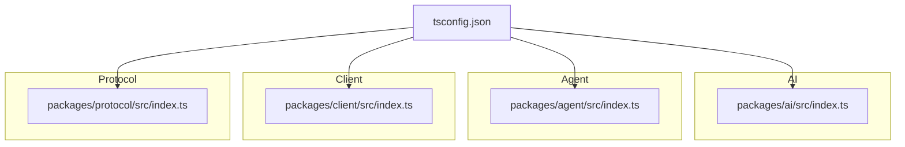
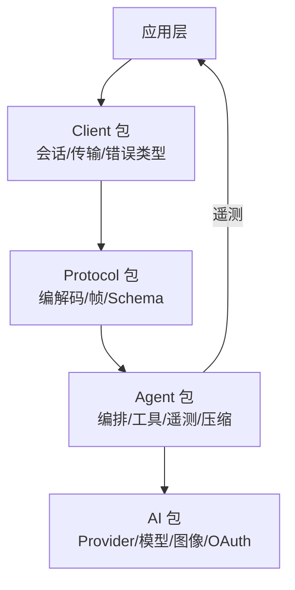
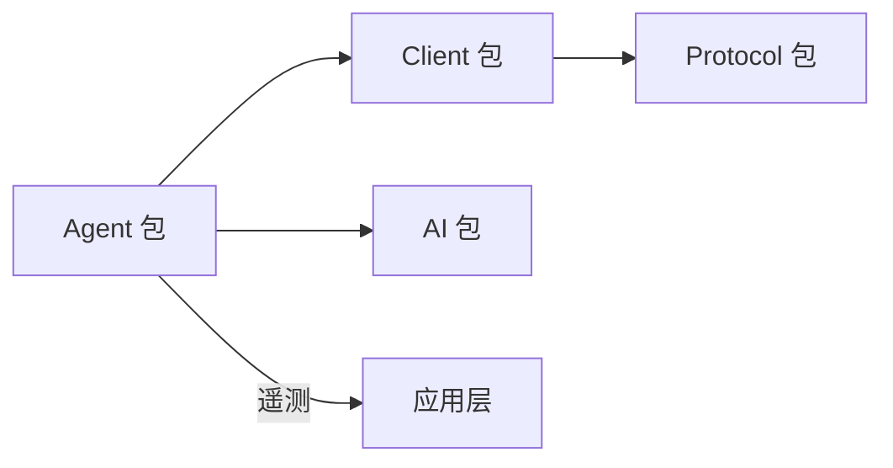

# 类型定义

<cite>
**本文引用的文件**
- [packages/ai/src/index.ts](file://packages/ai/src/index.ts)
- [packages/agent/src/index.ts](file://packages/agent/src/index.ts)
- [packages/client/src/index.ts](file://packages/client/src/index.ts)
- [packages/protocol/src/index.ts](file://packages/protocol/src/index.ts)
- [tsconfig.json](file://tsconfig.json)
</cite>

## 目录
1. [简介](#简介)
2. [项目结构](#项目结构)
3. [核心组件](#核心组件)
4. [架构总览](#架构总览)
5. [详细组件分析](#详细组件分析)
6. [依赖关系分析](#依赖关系分析)
7. [性能考虑](#性能考虑)
8. [故障排查指南](#故障排查指南)
9. [结论](#结论)
10. [附录](#附录)

## 简介
本文件面向 TypeScript 使用者，系统化梳理仓库中的公共类型定义与使用方式。重点覆盖：
- 公共接口、类型别名与枚举的边界与职责
- 核心数据结构（如消息、工具调用、会话、提供者配置等）的字段含义与用法
- 泛型类型的使用场景与约束
- 类型安全的编程示例（以路径引用代替代码片段）
- 类型版本管理与向后兼容策略
- 类型推导最佳实践与常见陷阱
- IDE 集成提示与自动补全配置

## 项目结构
仓库采用多包 monorepo 组织，类型定义主要分布在以下包中：
- ai：模型、提供者、认证、图像、事件流、工具函数等类型与运行时能力
- agent：Agent 运行、编排、压缩、遥测、工具、系统提示等类型与能力
- client：客户端连接、会话句柄、传输、错误等类型
- protocol：协议编解码、帧格式、Schema 等类型
- tsconfig：模块解析、路径映射，统一 IDE 与构建时的类型解析行为

图表来源
- [tsconfig.json:1-41](file://tsconfig.json#L1-L41)
- [packages/ai/src/index.ts:1-48](file://packages/ai/src/index.ts#L1-L48)
- [packages/agent/src/index.ts:1-146](file://packages/agent/src/index.ts#L1-L146)
- [packages/client/src/index.ts:1-19](file://packages/client/src/index.ts#L1-L19)
- [packages/protocol/src/index.ts:1-5](file://packages/protocol/src/index.ts#L1-L5)

章节来源
- [tsconfig.json:1-41](file://tsconfig.json#L1-L41)

## 核心组件
本节概述各包导出的类型职责与协作关系，帮助快速定位所需类型。

- AI 包
  - 导出 TypeBox 相关类型与工具，便于在运行时进行 Schema 校验与类型推导
  - 集中导出各 Provider 的配置选项、事件类型、图像模型类型、会话资源、OAuth 类型等
  - 提供通用工具类型与辅助方法（诊断、重试、溢出处理、JSON 解析、UUID 等）

- Agent 包
  - 导出 Agent 核心能力、循环控制、Harness、消息、提示模板、结果、会话、技能、系统提示等类型
  - 导出遥测相关类型与 Schema，以及工具、Shell、文件系统抽象等执行环境类型
  - 暴露压缩、摘要、上下文估算等算法相关的类型与常量

- Client 包
  - 导出 PiClient 客户端类及连接状态、创建会话选项、会话句柄、传输接口、错误类型等

- Protocol 包
  - 导出协议层编解码、帧格式与 Schema，用于跨进程/网络通信的类型契约

章节来源
- [packages/ai/src/index.ts:1-48](file://packages/ai/src/index.ts#L1-L48)
- [packages/agent/src/index.ts:1-146](file://packages/agent/src/index.ts#L1-L146)
- [packages/client/src/index.ts:1-19](file://packages/client/src/index.ts#L1-L19)
- [packages/protocol/src/index.ts:1-5](file://packages/protocol/src/index.ts#L1-L5)

## 架构总览
下图展示类型在系统中的分层与流向：上层应用通过 Client 发起请求，经由 Protocol 进行序列化/反序列化；Agent 编排业务逻辑并调用 AI 提供的模型与工具；遥测贯穿各环节。

图表来源
- [packages/client/src/index.ts:1-19](file://packages/client/src/index.ts#L1-L19)
- [packages/protocol/src/index.ts:1-5](file://packages/protocol/src/index.ts#L1-L5)
- [packages/agent/src/index.ts:1-146](file://packages/agent/src/index.ts#L1-L146)
- [packages/ai/src/index.ts:1-48](file://packages/ai/src/index.ts#L1-L48)

## 详细组件分析

### AI 包类型体系
- 职责
  - 提供统一的模型调用与 Provider 配置类型，屏蔽底层差异
  - 提供 OAuth、认证上下文、图像模型、事件流、工具函数等类型
  - 通过 TypeBox 暴露 TSchema 与 Type，支持运行时校验与类型推导

- 关键导出类别
  - 模型与 Provider 选项：各 Provider 的配置类型（如 OpenAI、Anthropic、Google、Bedrock 等）
  - 图像模型与注册表：图像生成相关类型与注册机制
  - 会话资源与工具：会话生命周期与资源管理类型
  - 认证与 OAuth：登录回调、设备码、选择提示等交互类型
  - 工具函数：诊断、重试、溢出处理、JSON 解析、UUID、验证等

- 使用建议
  - 优先使用包内导出的 Provider 选项类型，避免手写配置导致类型不一致
  - 结合 TypeBox 的 TSchema 进行运行时校验，确保配置安全
  - 利用工具函数提升健壮性（如重试、溢出保护）

章节来源
- [packages/ai/src/index.ts:1-48](file://packages/ai/src/index.ts#L1-L48)

### Agent 包类型体系
- 职责
  - 定义 Agent 运行所需的编排、工具、会话、遥测、压缩、提示模板等类型
  - 暴露执行环境抽象（Shell、文件系统）、错误分类、结果封装等
  - 提供压缩与摘要相关算法的类型与常量

- 关键导出类别
  - 编排与循环：Agent 主循环与 Harness 相关类型
  - 消息与提示：消息、模板、系统提示等类型
  - 工具与环境：工具、Shell、文件系统、技能等类型
  - 遥测：Span、事件、属性、Schema 等类型
  - 压缩与摘要：压缩设置、结果、估算、序列化等类型

- 使用建议
  - 使用统一的错误类型与分类，便于上层处理与上报
  - 借助遥测类型记录关键步骤，便于问题定位与性能分析
  - 使用压缩与摘要类型控制上下文长度，优化成本与延迟

章节来源
- [packages/agent/src/index.ts:1-146](file://packages/agent/src/index.ts#L1-L146)

### Client 包类型体系
- 职责
  - 定义客户端连接与会话管理的类型，包括连接状态、创建会话选项、会话句柄、传输接口与错误类型

- 关键导出类别
  - 客户端：PiClient 类
  - 错误：断开、服务端错误、会话所有权等错误类型
  - 会话：会话句柄、获取选项、租约模式等
  - 传输：字节传输接口与工厂、处理器
  - 连接：连接状态与变更事件、监听器错误处理、订阅取消等

- 使用建议
  - 通过会话句柄管理生命周期，避免重复创建或泄露
  - 使用传输接口实现自定义传输（如 WebSocket、HTTP）
  - 正确处理连接状态变化与错误，保障稳定性

章节来源
- [packages/client/src/index.ts:1-19](file://packages/client/src/index.ts#L1-L19)

### Protocol 包类型体系
- 职责
  - 定义协议层的编解码、帧格式与 Schema，保证跨进程/网络通信的类型一致性

- 关键导出类别
  - 编解码：CBOR 编解码、通用编解码器
  - 帧格式：消息帧结构与边界
  - Schema：协议消息的结构化定义

- 使用建议
  - 严格遵循 Schema 定义构造与解析消息，避免类型漂移
  - 使用编解码器统一序列化/反序列化，减少手工转换错误

章节来源
- [packages/protocol/src/index.ts:1-5](file://packages/protocol/src/index.ts#L1-L5)

### 类型推导与泛型使用
- 典型场景
  - 基于 TypeBox 的 TSchema 进行运行时校验与类型推导，确保配置与数据一致
  - 在 Agent 编排中使用泛型约束工具输入输出，提高类型安全性
  - 在 Client 传输层使用泛型表示消息载荷，增强可扩展性

- 约束条件
  - 泛型需明确边界，避免过度宽泛导致推断失败
  - 结合可选与必填属性，精确表达 API 契约
  - 使用联合类型与字面量类型区分不同分支逻辑

- 最佳实践
  - 优先使用包内导出的类型与工具，减少自定义复杂泛型
  - 对关键路径添加运行时校验，弥补静态类型的不足
  - 保持类型与文档同步更新，避免误导

[本节为概念性说明，不直接分析具体文件]

### 类型安全的编程示例（路径引用）
- 使用 AI 包 Provider 配置类型
  - 参考路径：[packages/ai/src/index.ts:1-48](file://packages/ai/src/index.ts#L1-L48)
- 使用 Agent 包工具与环境类型
  - 参考路径：[packages/agent/src/index.ts:1-146](file://packages/agent/src/index.ts#L1-L146)
- 使用 Client 包会话与传输类型
  - 参考路径：[packages/client/src/index.ts:1-19](file://packages/client/src/index.ts#L1-L19)
- 使用 Protocol 包 Schema 与编解码类型
  - 参考路径：[packages/protocol/src/index.ts:1-5](file://packages/protocol/src/index.ts#L1-L5)

[本节仅列出路径，不包含代码内容]

### 类型版本管理与向后兼容策略
- 版本管理
  - 通过工作区脚本统一版本递增与发布流程，确保各包版本一致
  - 使用路径映射与别名导入，降低升级带来的破坏性变更影响

- 向后兼容
  - 新增类型时尽量保持可选与默认值，避免破坏现有调用方
  - 对废弃类型提供迁移指引与替代方案
  - 在协议层严格维护 Schema 兼容性，避免破坏序列化/反序列化

章节来源
- [tsconfig.json:1-41](file://tsconfig.json#L1-L41)

## 依赖关系分析
各包之间的类型依赖关系如下：
- Client 依赖 Protocol 进行消息序列化/反序列化
- Agent 依赖 AI 进行模型调用与工具执行
- 遥测贯穿 Agent 与应用层，用于观测与诊断
- tsconfig 提供路径映射，统一 IDE 与构建时的类型解析

图表来源
- [packages/client/src/index.ts:1-19](file://packages/client/src/index.ts#L1-L19)
- [packages/protocol/src/index.ts:1-5](file://packages/protocol/src/index.ts#L1-L5)
- [packages/agent/src/index.ts:1-146](file://packages/agent/src/index.ts#L1-L146)
- [packages/ai/src/index.ts:1-48](file://packages/ai/src/index.ts#L1-L48)

章节来源
- [packages/client/src/index.ts:1-19](file://packages/client/src/index.ts#L1-L19)
- [packages/protocol/src/index.ts:1-5](file://packages/protocol/src/index.ts#L1-L5)
- [packages/agent/src/index.ts:1-146](file://packages/agent/src/index.ts#L1-L146)
- [packages/ai/src/index.ts:1-48](file://packages/ai/src/index.ts#L1-L48)

## 性能考虑
- 类型层面
  - 合理使用联合类型与字面量类型，减少运行时分支判断复杂度
  - 避免过深的嵌套类型，提升编译与 IDE 响应速度
- 运行时层面
  - 使用重试与超时策略，降低外部依赖抖动影响
  - 对大对象进行分块处理与溢出保护，避免内存峰值过高
- 协议层面
  - 使用高效的编解码格式（如 CBOR），减少序列化开销
  - 合理设计帧大小与批处理策略，平衡吞吐与延迟

[本节提供一般性指导，不直接分析具体文件]

## 故障排查指南
- 常见问题
  - 类型不匹配：检查 Provider 配置是否使用了正确的选项类型
  - 会话异常：确认会话句柄的生命周期与所有权是否正确管理
  - 传输错误：检查字节传输接口的实现是否符合协议规范
  - 遥测缺失：确认 Span 与事件是否正确记录与上报

- 排查步骤
  - 使用诊断工具与日志定位问题阶段
  - 逐步缩小范围，隔离外部依赖影响
  - 复现最小用例，验证类型与运行时行为

章节来源
- [packages/client/src/index.ts:1-19](file://packages/client/src/index.ts#L1-L19)
- [packages/agent/src/index.ts:1-146](file://packages/agent/src/index.ts#L1-L146)
- [packages/ai/src/index.ts:1-48](file://packages/ai/src/index.ts#L1-L48)

## 结论
本仓库通过清晰的包划分与类型定义，构建了从客户端到协议层再到 AI 调用的完整类型体系。遵循本文档的建议，可以在保证类型安全的前提下，高效地进行开发与扩展。建议在引入新特性时，优先考虑类型层面的设计与兼容性，并结合运行时校验提升鲁棒性。

[本节为总结性内容，不直接分析具体文件]

## 附录

### IDE 集成提示与自动补全配置
- 模块解析
  - 使用 NodeNext 模块解析策略，确保 ES 模块与类型正确加载
- 路径映射
  - 通过 tsconfig 的路径映射，将包别名指向源码，获得更准确的自动补全与跳转
- 推荐设置
  - 启用严格的类型检查，尽早发现类型错误
  - 使用 TS 语言服务与编辑器插件，提升开发体验

章节来源
- [tsconfig.json:1-41](file://tsconfig.json#L1-L41)