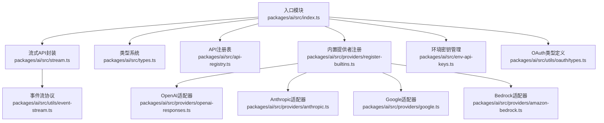
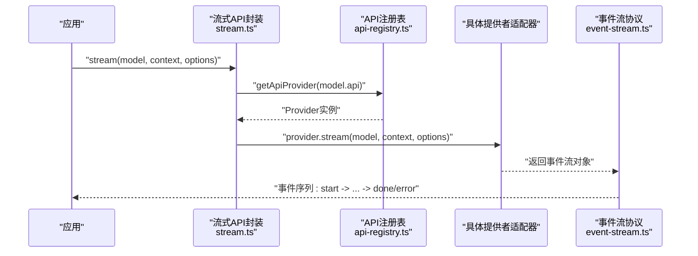
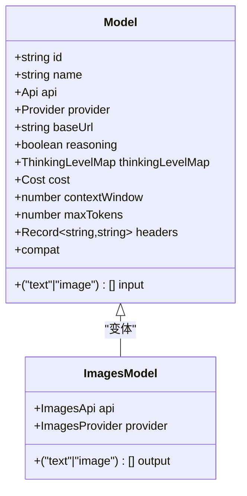
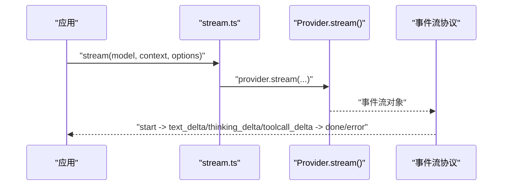
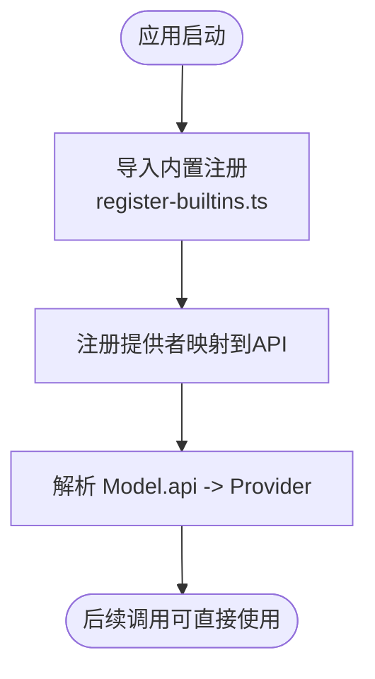
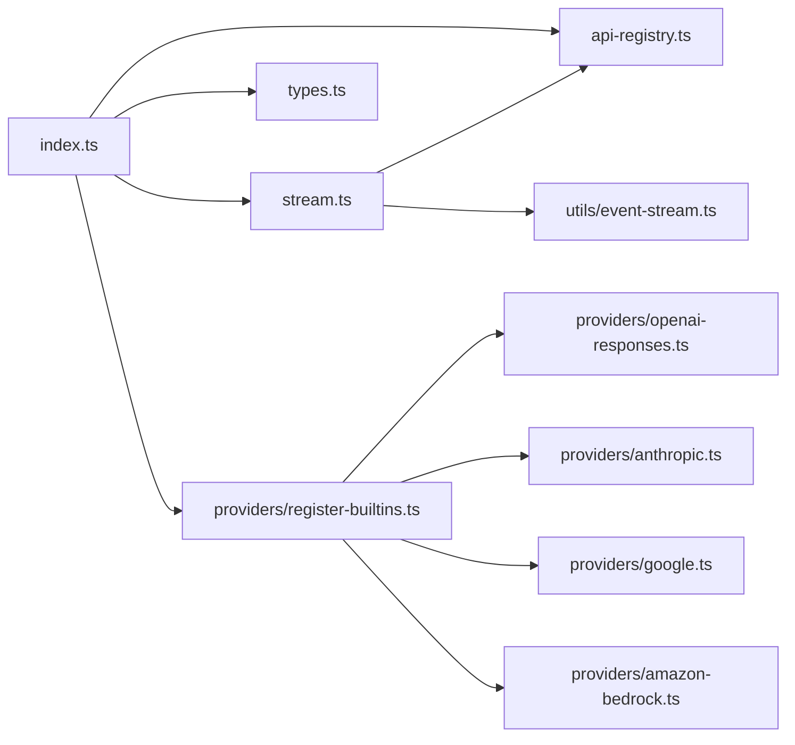

# AI提供者API

<cite>
**本文引用的文件**
- [packages/ai/src/index.ts](file://packages/ai/src/index.ts)
- [packages/ai/src/stream.ts](file://packages/ai/src/stream.ts)
- [packages/ai/src/types.ts](file://packages/ai/src/types.ts)
- [packages/ai/src/api-registry.ts](file://packages/ai/src/api-registry.ts)
- [packages/ai/src/env-api-keys.ts](file://packages/ai/src/env-api-keys.ts)
- [packages/ai/src/providers/register-builtins.ts](file://packages/ai/src/providers/register-builtins.ts)
- [packages/ai/src/providers/openai-responses.ts](file://packages/ai/src/providers/openai-responses.ts)
- [packages/ai/src/providers/anthropic.ts](file://packages/ai/src/providers/anthropic.ts)
- [packages/ai/src/providers/google.ts](file://packages/ai/src/providers/google.ts)
- [packages/ai/src/providers/amazon-bedrock.ts](file://packages/ai/src/providers/amazon-bedrock.ts)
- [packages/ai/src/utils/event-stream.ts](file://packages/ai/src/utils/event-stream.ts)
- [packages/ai/src/utils/oauth/types.ts](file://packages/ai/src/utils/oauth/types.ts)
- [packages/coding-agent/examples/extensions/custom-provider-anthropic/index.ts](file://packages/coding-agent/examples/extensions/custom-provider-anthropic/index.ts)
</cite>

## 目录
1. [简介](#简介)
2. [项目结构](#项目结构)
3. [核心组件](#核心组件)
4. [架构总览](#架构总览)
5. [详细组件分析](#详细组件分析)
6. [依赖关系分析](#依赖关系分析)
7. [性能考虑](#性能考虑)
8. [故障排除指南](#故障排除指南)
9. [结论](#结论)
10. [附录](#附录)

## 简介
本文件为 Pi 项目的 AI 提供者 API 的完整技术文档，聚焦于统一的 AI 接口设计与多供应商适配器的实现。内容涵盖：
- 统一模型接口 Model 的定义与扩展点
- 提供者注册机制与 API 注册表
- 流式响应处理（事件流、错误处理、连接管理）
- 多供应商适配器：OpenAI、Anthropic、Google、Amazon Bedrock 等
- 认证与环境密钥管理
- 实用示例与最佳实践

## 项目结构
AI 能力主要位于 packages/ai/src 目录，核心导出通过入口文件统一暴露，同时提供：
- 类型系统与通用接口（types.ts）
- 流式调用与简单调用封装（stream.ts）
- API 注册表与内置提供者注册（api-registry.ts、register-builtins.ts）
- 各供应商适配器（providers/*）
- 事件流与 OAuth 工具（utils/event-stream.ts、utils/oauth/types.ts）

图表来源
- [packages/ai/src/index.ts:1-48](file://packages/ai/src/index.ts#L1-L48)
- [packages/ai/src/stream.ts:1-60](file://packages/ai/src/stream.ts#L1-L60)
- [packages/ai/src/types.ts:1-592](file://packages/ai/src/types.ts#L1-L592)
- [packages/ai/src/api-registry.ts](file://packages/ai/src/api-registry.ts)
- [packages/ai/src/providers/register-builtins.ts](file://packages/ai/src/providers/register-builtins.ts)
- [packages/ai/src/providers/openai-responses.ts](file://packages/ai/src/providers/openai-responses.ts)
- [packages/ai/src/providers/anthropic.ts](file://packages/ai/src/providers/anthropic.ts)
- [packages/ai/src/providers/google.ts](file://packages/ai/src/providers/google.ts)
- [packages/ai/src/providers/amazon-bedrock.ts](file://packages/ai/src/providers/amazon-bedrock.ts)
- [packages/ai/src/utils/event-stream.ts](file://packages/ai/src/utils/event-stream.ts)
- [packages/ai/src/env-api-keys.ts](file://packages/ai/src/env-api-keys.ts)
- [packages/ai/src/utils/oauth/types.ts](file://packages/ai/src/utils/oauth/types.ts)

章节来源
- [packages/ai/src/index.ts:1-48](file://packages/ai/src/index.ts#L1-L48)

## 核心组件
- 统一模型接口 Model<TApi>：描述模型标识、提供商、基础URL、推理开关、输入输出类型、成本、上下文窗口、最大令牌数、兼容性覆盖等。
- 统一上下文 Context：包含系统提示、消息历史、工具定义。
- 统一流式函数 StreamFunction 与简单流式函数 SimpleStreamOptions：约定返回事件流对象，失败时通过流事件而非抛异常表达。
- 事件流协议 AssistantMessageEvent：定义 start/text/thinking/toolcall/done/error 等事件类型。
- API 注册表与提供者注册：通过 register-builtins 将具体提供商绑定到统一的 Api/Provider 标识。

章节来源
- [packages/ai/src/types.ts:553-592](file://packages/ai/src/types.ts#L553-L592)
- [packages/ai/src/types.ts:339-343](file://packages/ai/src/types.ts#L339-L343)
- [packages/ai/src/types.ts:204-222](file://packages/ai/src/types.ts#L204-L222)
- [packages/ai/src/types.ts:345-366](file://packages/ai/src/types.ts#L345-L366)
- [packages/ai/src/api-registry.ts](file://packages/ai/src/api-registry.ts)
- [packages/ai/src/providers/register-builtins.ts](file://packages/ai/src/providers/register-builtins.ts)

## 架构总览
Pi 的 AI 提供者 API 采用“统一模型 + 适配器 + 注册表”的分层架构：
- 上层：应用通过 Model 与 Context 调用 stream()/complete() 或 streamSimple()/completeSimple()
- 中间层：API 注册表根据 Model.api 解析到具体 Provider 实现
- 下层：各供应商适配器负责将统一模型映射为供应商特定的请求格式与响应解析

图表来源
- [packages/ai/src/stream.ts:25-32](file://packages/ai/src/stream.ts#L25-L32)
- [packages/ai/src/api-registry.ts](file://packages/ai/src/api-registry.ts)
- [packages/ai/src/utils/event-stream.ts](file://packages/ai/src/utils/event-stream.ts)

## 详细组件分析

### 统一模型接口 Model
- 关键字段：id、name、api、provider、baseUrl、reasoning、thinkingLevelMap、input、cost、contextWindow、maxTokens、headers、compat
- 兼容性覆盖：针对不同 Api（如 openai-completions、openai-responses、anthropic-messages）提供兼容配置，用于适配参数命名、缓存控制、路由策略等差异
- 扩展点：可通过自定义 compat 与 headers 定制供应商行为；支持图片模型 ImagesModel 的变体

图表来源
- [packages/ai/src/types.ts:553-592](file://packages/ai/src/types.ts#L553-L592)

章节来源
- [packages/ai/src/types.ts:553-592](file://packages/ai/src/types.ts#L553-L592)

### 流式API封装与事件流
- stream()/complete()：返回事件流对象，完成时通过 done 事件携带最终 AssistantMessage；错误时通过 error 事件携带 stopReason 与 errorMessage
- streamSimple()/completeSimple()：在统一选项基础上增加推理级别与预算控制
- 事件流协议 AssistantMessageEvent：覆盖文本、思考、工具调用三类增量更新与结束事件

图表来源
- [packages/ai/src/stream.ts:25-41](file://packages/ai/src/stream.ts#L25-L41)
- [packages/ai/src/types.ts:345-366](file://packages/ai/src/types.ts#L345-L366)
- [packages/ai/src/utils/event-stream.ts](file://packages/ai/src/utils/event-stream.ts)

章节来源
- [packages/ai/src/stream.ts:1-60](file://packages/ai/src/stream.ts#L1-L60)
- [packages/ai/src/types.ts:345-366](file://packages/ai/src/types.ts#L345-L366)

### API注册表与提供者注册
- API 注册表：根据 Model.api 查找已注册的 Provider 实现
- 内置注册：register-builtins 将常见供应商（OpenAI、Anthropic、Google、Bedrock 等）与对应适配器绑定
- 使用方式：在应用启动时确保执行注册流程，使后续按 Model.api 能正确解析到 Provider

图表来源
- [packages/ai/src/providers/register-builtins.ts](file://packages/ai/src/providers/register-builtins.ts)
- [packages/ai/src/api-registry.ts](file://packages/ai/src/api-registry.ts)

章节来源
- [packages/ai/src/api-registry.ts](file://packages/ai/src/api-registry.ts)
- [packages/ai/src/providers/register-builtins.ts](file://packages/ai/src/providers/register-builtins.ts)

### 多供应商适配器集成
- OpenAI 适配器：支持 Responses 等接口，兼容 OpenAI 风格的参数与响应格式
- Anthropic 适配器：支持 Messages 接口，提供思考模式与工具调用流式支持
- Google 适配器：支持 Generative AI 与 Vertex，提供思考级别与缓存控制
- Amazon Bedrock 适配器：基于 AWS SDK 的集成，支持会话与缓存亲和头

章节来源
- [packages/ai/src/providers/openai-responses.ts](file://packages/ai/src/providers/openai-responses.ts)
- [packages/ai/src/providers/anthropic.ts](file://packages/ai/src/providers/anthropic.ts)
- [packages/ai/src/providers/google.ts](file://packages/ai/src/providers/google.ts)
- [packages/ai/src/providers/amazon-bedrock.ts](file://packages/ai/src/providers/amazon-bedrock.ts)

### 认证与环境密钥管理
- 环境密钥：通过 env-api-keys 模块读取与注入 API 密钥，避免硬编码
- OAuth 类型：提供 OAuthAuthInfo、OAuthCredentials、OAuthProvider 等类型定义，便于扩展第三方登录或代理认证场景

章节来源
- [packages/ai/src/env-api-keys.ts](file://packages/ai/src/env-api-keys.ts)
- [packages/ai/src/utils/oauth/types.ts](file://packages/ai/src/utils/oauth/types.ts)

### 示例：注册新AI供应商与处理流式响应
- 注册新供应商：参考内置注册流程，将新的 Provider 实现与 Api 标识绑定
- 配置认证信息：通过 options.apiKey 或环境变量注入密钥
- 处理流式响应：监听事件流的 start/text_delta/thinking_delta/toolcall_delta/done/error 事件，按需渲染或聚合结果

章节来源
- [packages/ai/src/providers/register-builtins.ts](file://packages/ai/src/providers/register-builtins.ts)
- [packages/ai/src/stream.ts:25-41](file://packages/ai/src/stream.ts#L25-L41)
- [packages/ai/src/types.ts:345-366](file://packages/ai/src/types.ts#L345-L366)

## 依赖关系分析
- 入口模块 index.ts 统一导出所有公共能力，包括 API 注册表、环境密钥、图片模型、事件流、OAuth 类型等
- stream.ts 依赖 API 注册表解析 Provider，并依赖事件流协议进行数据传输
- types.ts 定义了统一的模型、上下文、事件流与兼容性配置，是各适配器实现的契约
- 各 Provider 适配器依赖注册表与事件流协议，向上提供统一的 stream 接口

图表来源
- [packages/ai/src/index.ts:1-48](file://packages/ai/src/index.ts#L1-L48)
- [packages/ai/src/stream.ts:1-60](file://packages/ai/src/stream.ts#L1-L60)
- [packages/ai/src/types.ts:1-592](file://packages/ai/src/types.ts#L1-L592)
- [packages/ai/src/api-registry.ts](file://packages/ai/src/api-registry.ts)
- [packages/ai/src/providers/register-builtins.ts](file://packages/ai/src/providers/register-builtins.ts)
- [packages/ai/src/utils/event-stream.ts](file://packages/ai/src/utils/event-stream.ts)
- [packages/ai/src/providers/openai-responses.ts](file://packages/ai/src/providers/openai-responses.ts)
- [packages/ai/src/providers/anthropic.ts](file://packages/ai/src/providers/anthropic.ts)
- [packages/ai/src/providers/google.ts](file://packages/ai/src/providers/google.ts)
- [packages/ai/src/providers/amazon-bedrock.ts](file://packages/ai/src/providers/amazon-bedrock.ts)

章节来源
- [packages/ai/src/index.ts:1-48](file://packages/ai/src/index.ts#L1-L48)

## 性能考虑
- 传输选择：通过 options.transport 指定 SSE/WebSocket/auto，优先使用 WebSocket 以降低握手开销
- 缓存亲和：启用 sessionId 并发送亲和头（如 x-session-affinity），提升提示缓存命中率
- 重试与超时：合理设置 maxRetries 与 timeoutMs，避免长时间阻塞；对服务器要求长等待的场景，使用 maxRetryDelayMs 进行上限控制
- 推理预算：通过 SimpleStreamOptions.thinkingBudgets 控制 token 预算，平衡质量与成本
- 事件消费：在事件流中及时消费增量数据，避免累积导致内存压力

## 故障排除指南
- 无提供者注册：当 Model.api 未注册时，解析阶段会抛出错误；请确认已执行内置注册或自定义注册
- 流式中断：若出现连接中断，检查 WebSocket 连接超时与网络稳定性；必要时切换到 SSE 或启用客户端重试
- 错误事件：收到 error 事件时，依据 stopReason 与 errorMessage 进行分类处理（网络、配额、参数、服务端错误）
- 事件丢失：确保事件监听器在流对象创建后立即注册，避免错过 start 或早期增量事件
- 认证失败：核对 apiKey 来源与权限范围，确认环境变量或 options.apiKey 设置正确

章节来源
- [packages/ai/src/stream.ts:17-23](file://packages/ai/src/stream.ts#L17-L23)
- [packages/ai/src/types.ts:345-366](file://packages/ai/src/types.ts#L345-L366)

## 结论
Pi 的 AI 提供者 API 通过统一模型与事件流协议，实现了对多家供应商的抽象与适配。借助注册表与兼容性配置，开发者可以快速接入新供应商并获得一致的流式体验。配合认证、缓存与重试策略，可在复杂生产环境中获得稳定与高性能的表现。

## 附录

### 常用API与类型速查
- 统一模型接口：Model<TApi>
- 上下文：Context
- 流式函数：StreamFunction、SimpleStreamOptions
- 事件流协议：AssistantMessageEvent
- API/Provider枚举：KnownApi、KnownProvider
- 兼容性配置：OpenAICompletionsCompat、OpenAIResponsesCompat、AnthropicMessagesCompat、OpenRouterRouting、VercelGatewayRouting

章节来源
- [packages/ai/src/types.ts:6-592](file://packages/ai/src/types.ts#L6-L592)