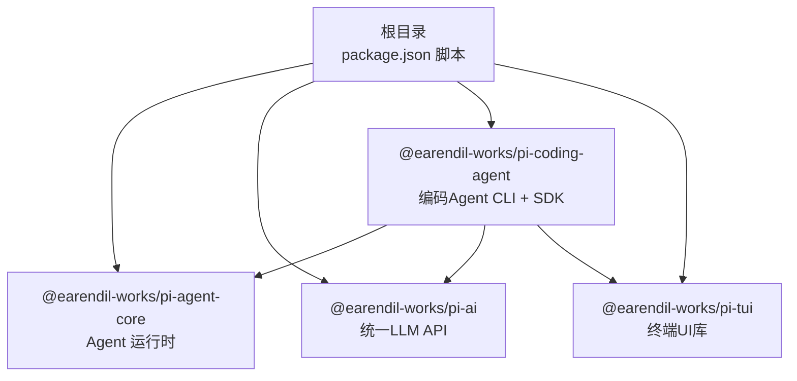
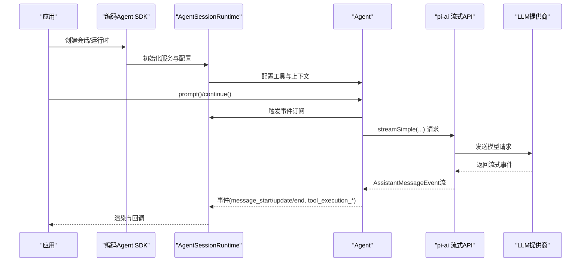
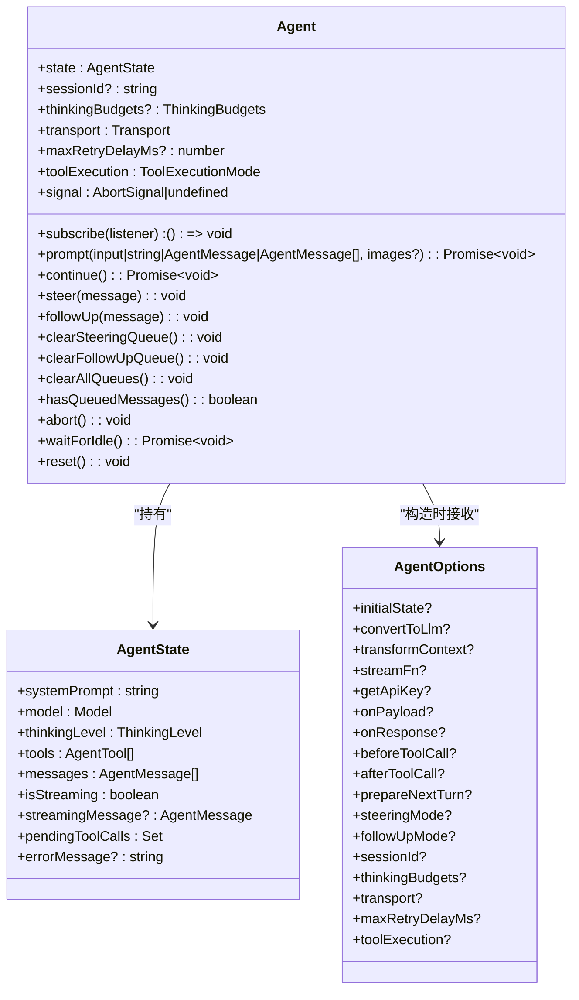
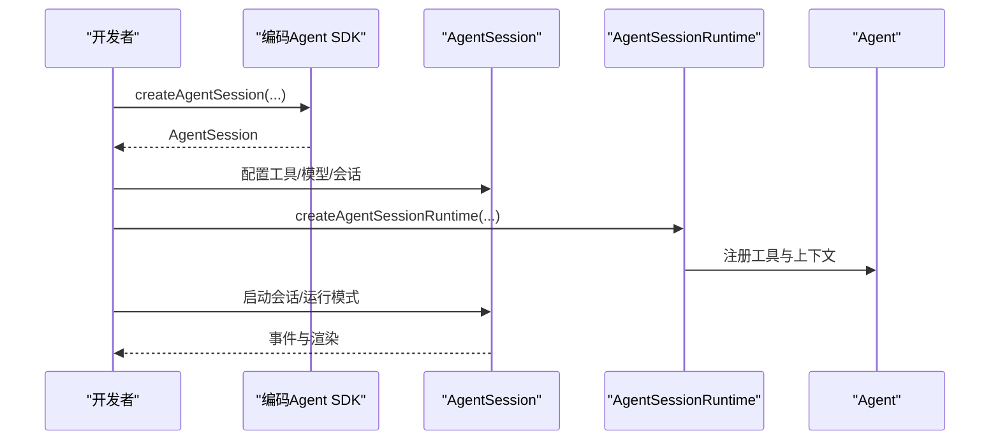
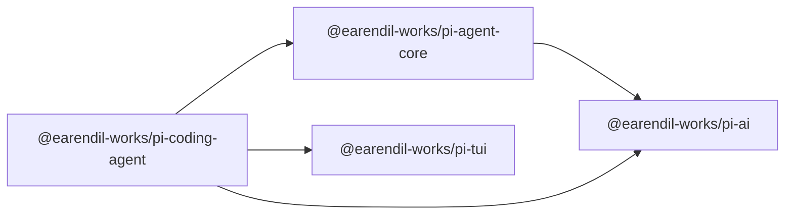

# API参考

<cite>
**本文引用的文件**
- [README.md](file://README.md)
- [package.json](file://package.json)
- [packages/agent/src/agent.ts](file://packages/agent/src/agent.ts)
- [packages/agent/src/types.ts](file://packages/agent/src/types.ts)
- [packages/ai/src/index.ts](file://packages/ai/src/index.ts)
- [packages/coding-agent/src/index.ts](file://packages/coding-agent/src/index.ts)
- [packages/tui/src/index.ts](file://packages/tui/src/index.ts)
- [packages/agent/package.json](file://packages/agent/package.json)
- [packages/ai/package.json](file://packages/ai/package.json)
- [packages/coding-agent/package.json](file://packages/coding-agent/package.json)
- [packages/tui/package.json](file://packages/tui/package.json)
</cite>

## 目录
1. [简介](#简介)
2. [项目结构](#项目结构)
3. [核心组件](#核心组件)
4. [架构总览](#架构总览)
5. [详细组件分析](#详细组件分析)
6. [依赖关系分析](#依赖关系分析)
7. [性能考量](#性能考量)
8. [故障排查指南](#故障排查指南)
9. [结论](#结论)
10. [附录](#附录)

## 简介
本API参考面向Pi项目（多包Monorepo）中的Agent运行时、统一LLM API与终端UI库，覆盖以下核心包：
- @earendil-works/pi-agent-core：带工具调用与状态管理的通用Agent运行时
- @earendil-works/pi-ai：统一多提供商LLM API（OpenAI、Anthropic、Google、Bedrock等）
- @earendil-works/pi-coding-agent：交互式编码Agent CLI，提供SDK接口与会话管理
- @earendil-works/pi-tui：终端UI库，支持差异化渲染与图像协议

本参考文档按“公共接口”维度梳理类定义、方法签名、参数类型、返回值、事件流、错误处理与典型用法，并提供SDK接口的初始化配置、方法调用与错误处理说明。

## 项目结构
Pi项目采用Monorepo组织，根目录通过脚本统一构建各子包；核心SDK入口位于各包的dist导出中，类型声明位于dist/index.d.ts等位置。下图展示主要包之间的导出关系与职责边界：

图表来源
- [package.json:12-35](file://package.json#L12-L35)
- [packages/agent/package.json:8-18](file://packages/agent/package.json#L8-L18)
- [packages/ai/package.json:8-52](file://packages/ai/package.json#L8-L52)
- [packages/coding-agent/package.json:14-22](file://packages/coding-agent/package.json#L14-L22)
- [packages/tui/package.json:6-11](file://packages/tui/package.json#L6-L11)

章节来源
- [README.md:48-57](file://README.md#L48-L57)
- [package.json:12-35](file://package.json#L12-L35)

## 核心组件
本节概述各包对外公开的公共API与SDK接口，重点说明类、接口、类型别名、事件与回调。

- Agent运行时（@earendil-works/pi-agent-core）
  - 类：Agent
  - 关键接口：AgentOptions、AgentState、AgentContext、AgentEvent、AgentTool、AgentToolResult、ToolExecutionMode、QueueMode、ThinkingLevel
  - 事件：agent_start、agent_end、turn_start、turn_end、message_start、message_update、message_end、tool_execution_start、tool_execution_update、tool_execution_end
  - 方法：prompt、continue、subscribe、abort、waitForIdle、reset、steer、followUp、clearSteeringQueue、clearFollowUpQueue、clearAllQueues、hasQueuedMessages
  - 属性：state、sessionId、thinkingBudgets、transport、maxRetryDelayMs、toolExecution、signal

- 统一LLM API（@earendil-works/pi-ai）
  - 导出：api-registry、models、stream、types、providers（OpenAI、Anthropic、Google、Mistral、Bedrock等）、OAuth工具类型
  - 类型：StreamFn、Model、Message、Tool、ToolResultMessage、ThinkingLevel等
  - 工具：streamSimple、convertToLlm等

- 编码Agent SDK（@earendil-works/pi-coding-agent）
  - SDK工厂：createAgentSession、createAgentSessionFromServices、createAgentSessionRuntime、createAgentSessionServices
  - 会话与运行时：AgentSession、AgentSessionRuntime、SessionManager、SettingsManager、ModelRegistry
  - 工具工厂：createBashTool、createEditTool、createFindTool、createGrepTool、createLsTool、createReadTool、createWriteTool、createCodingTools、createReadOnlyTools
  - 模式：InteractiveMode、RpcClient、runPrintMode、runRpcMode
  - UI组件与主题：多种组件、主题与剪贴板工具

- 终端UI库（@earendil-works/pi-tui）
  - 组件：Box、Editor、Image、Input、Loader、Markdown、SelectList、SettingsList、Text、TruncatedText等
  - 图像协议：Kitty、iTerm2等终端图像渲染能力
  - 键盘输入与键位：Key、KeybindingsManager、StdinBuffer等
  - 工具函数：truncateToWidth、visibleWidth、wrapTextWithAnsi等

章节来源
- [packages/agent/src/agent.ts:166-558](file://packages/agent/src/agent.ts#L166-L558)
- [packages/agent/src/types.ts:15-419](file://packages/agent/src/types.ts#L15-L419)
- [packages/ai/src/index.ts:1-48](file://packages/ai/src/index.ts#L1-48)
- [packages/coding-agent/src/index.ts:164-355](file://packages/coding-agent/src/index.ts#L164-L355)
- [packages/tui/src/index.ts:1-107](file://packages/tui/src/index.ts#L1-L107)

## 架构总览
下图展示SDK调用链路与事件流：应用通过编码Agent SDK创建会话与运行时，运行时驱动Agent执行对话与工具调用，Agent通过统一LLM API与多提供商交互，最终在TUI中渲染结果。

图表来源
- [packages/coding-agent/src/index.ts:164-190](file://packages/coding-agent/src/index.ts#L164-L190)
- [packages/agent/src/agent.ts:324-412](file://packages/agent/src/agent.ts#L324-L412)
- [packages/ai/src/index.ts:27-28](file://packages/ai/src/index.ts#L27-L28)

## 详细组件分析

### Agent类（Agent运行时）
- 类定义与职责
  - Agent是状态化包装器，封装对话转录、生命周期事件、工具执行与消息队列控制，提供prompt/continue/steer/followUp等高层API。
- 关键接口与类型
  - AgentOptions：构造选项，含初始状态、转换函数、流函数、API密钥解析、事件钩子、队列模式、传输方式、最大重试延迟、工具执行策略等。
  - AgentState：只读状态视图，包含系统提示、当前模型、思考级别、工具列表、消息列表、是否正在流式、部分消息、待执行工具集合、错误信息。
  - AgentContext：传递给低层循环的上下文快照。
  - AgentEvent：事件类型集合，覆盖Agent生命周期、回合生命周期、消息生命周期与工具执行生命周期。
  - AgentTool/AgentToolResult：工具定义与执行结果。
  - ToolExecutionMode/QueueMode/ThinkingLevel：工具执行策略、队列注入策略、模型思考级别。
- 公共方法与属性
  - subscribe(listener)：订阅Agent事件，返回取消订阅函数。
  - prompt(message | messages | string, images?)：发起新提示或批量消息。
  - continue()：从当前转录继续。
  - steer(message)/followUp(message)：注入引导消息与后续消息。
  - clearSteeringQueue()/clearFollowUpQueue()/clearAllQueues()/hasQueuedMessages()：队列管理。
  - abort()/waitForIdle()/reset()：运行控制与重置。
  - 属性：state、sessionId、thinkingBudgets、transport、maxRetryDelayMs、toolExecution、signal。
- 事件流与错误处理
  - runWithLifecycle封装一次运行，设置isStreaming、捕获异常并发出失败消息事件，最后finishRun清理状态。
  - processEvents根据事件类型更新内部状态并触发订阅者回调。
- 使用示例与最佳实践
  - 基础提示：通过prompt传入字符串或消息数组，等待agent_end事件后读取state.messages。
  - 工具拦截：beforeToolCall可阻止特定工具执行；afterToolCall可修改工具结果。
  - 队列控制：steeringMode/followUpMode决定队列注入策略，适合动态引导与延迟执行。
  - 中断与恢复：使用AbortController中断长耗时操作；waitForIdle等待监听器完成后再判定空闲。

图表来源
- [packages/agent/src/agent.ts:166-558](file://packages/agent/src/agent.ts#L166-L558)
- [packages/agent/src/types.ts:317-342](file://packages/agent/src/types.ts#L317-L342)
- [packages/agent/src/types.ts:95-116](file://packages/agent/src/types.ts#L95-L116)

章节来源
- [packages/agent/src/agent.ts:166-558](file://packages/agent/src/agent.ts#L166-L558)
- [packages/agent/src/types.ts:15-419](file://packages/agent/src/types.ts#L15-L419)

### 统一LLM API（pi-ai）
- 导出与能力
  - 提供统一的模型注册、流式API、图片模型、OAuth工具与诊断工具，支持OpenAI、Anthropic、Google、Mistral、Bedrock等提供商。
  - 导出streamSimple、convertToLlm、类型与提供商适配器。
- 类型与工具
  - StreamFn：流式函数签名，用于Agent循环。
  - Model/Message/Tool/ToolResultMessage：基础类型。
  - providers/*：各提供商选项与思维级别类型。
- 使用建议
  - 在AgentOptions中注入streamFn与convertToLlm，实现跨提供商的一致行为。
  - 使用getApiKey动态解析密钥，适配短期令牌场景。

章节来源
- [packages/ai/src/index.ts:1-48](file://packages/ai/src/index.ts#L1-L48)

### 编码Agent SDK（pi-coding-agent）
- SDK工厂与运行时
  - createAgentSession/createAgentSessionFromServices/createAgentSessionRuntime/createAgentSessionServices：创建会话、服务与运行时。
  - AgentSession/AgentSessionRuntime：会话与运行时抽象。
  - SessionManager/SettingsManager/ModelRegistry：会话管理、设置与模型注册。
- 工具工厂
  - createBashTool/createEditTool/createFindTool/createGrepTool/createLsTool/createReadTool/createWriteTool/createCodingTools/createReadOnlyTools：创建常用工具。
- 模式与UI
  - InteractiveMode/RpcClient/runPrintMode/runRpcMode：运行模式。
  - 多种UI组件与主题工具，支持扩展与自定义渲染。
- 使用示例与最佳实践
  - 会话初始化：通过createAgentSession创建会话，配置工具与模型。
  - 工具集成：使用工具工厂创建工具，注册到Agent。
  - RPC/打印模式：runRpcMode用于远程控制，runPrintMode用于批处理输出。
  - 主题与组件：使用主题工具与组件渲染消息与编辑器。

图表来源
- [packages/coding-agent/src/index.ts:164-190](file://packages/coding-agent/src/index.ts#L164-L190)
- [packages/coding-agent/src/index.ts:285-298](file://packages/coding-agent/src/index.ts#L285-L298)

章节来源
- [packages/coding-agent/src/index.ts:164-355](file://packages/coding-agent/src/index.ts#L164-L355)

### 终端UI库（pi-tui）
- 组件与功能
  - 基础组件：Box、Editor、Image、Input、Loader、Markdown、SelectList、SettingsList、Text、TruncatedText。
  - 图像协议：Kitty/iTerm2等终端图像渲染与尺寸计算。
  - 键盘输入：Key、KeybindingsManager、StdinBuffer等。
  - 工具函数：文本截断、宽度计算与ANSI包装。
- 使用建议
  - 在扩展与自定义组件中复用组件与主题工具，保证一致的视觉体验。
  - 使用图像协议渲染图片，注意终端能力检测与回退。

章节来源
- [packages/tui/src/index.ts:1-107](file://packages/tui/src/index.ts#L1-L107)

## 依赖关系分析
- 包导出与入口
  - @earendil-works/pi-agent-core：主入口dist/index.js，导出Agent与相关类型。
  - @earendil-works/pi-ai：主入口dist/index.js，导出统一API与提供商适配器。
  - @earendil-works/pi-coding-agent：主入口dist/index.js，导出SDK工厂、会话与工具。
  - @earendil-works/pi-tui：主入口dist/index.js，导出UI组件与工具。
- 依赖关系
  - coding-agent依赖agent、ai、tui。
  - agent依赖ai与typebox/yaml等。
  - ai依赖各提供商SDK与类型校验库。

图表来源
- [packages/agent/package.json:31-35](file://packages/agent/package.json#L31-L35)
- [packages/ai/package.json:69-79](file://packages/ai/package.json#L69-L79)
- [packages/coding-agent/package.json:41-58](file://packages/coding-agent/package.json#L41-L58)
- [packages/tui/package.json:39-42](file://packages/tui/package.json#L39-L42)

章节来源
- [packages/agent/package.json:8-18](file://packages/agent/package.json#L8-L18)
- [packages/ai/package.json:8-52](file://packages/ai/package.json#L8-L52)
- [packages/coding-agent/package.json:14-22](file://packages/coding-agent/package.json#L14-L22)
- [packages/tui/package.json:6-11](file://packages/tui/package.json#L6-L11)

## 性能考量
- 流式处理与事件驱动：通过streamSimple与事件流实现低延迟响应，减少阻塞等待。
- 工具并发执行：ToolExecutionMode支持并行执行，提升吞吐；同时保留顺序一致性语义。
- 队列注入策略：QueueMode允许选择一次性注入或逐条注入，平衡实时性与稳定性。
- 终端渲染优化：TUI采用差异化渲染与图像协议，降低重绘开销。

## 故障排查指南
- Agent运行异常
  - 现象：抛出“已在处理中”或“无法继续”的错误。
  - 排查：确认未重复调用prompt/continue；使用hasQueuedMessages检查队列；使用abort中断长任务；使用waitForIdle等待监听器完成。
- 工具执行失败
  - 现象：工具结果包含错误或提前终止。
  - 排查：在beforeToolCall中拦截并记录原因；在afterToolCall中修正结果；检查工具schema与参数准备。
- LLM请求失败
  - 现象：消息结束事件携带stopReason为error或aborted。
  - 排查：检查getApiKey返回值；验证convertToLlm与transformContext不抛错；查看提供商限流与重试策略。
- 终端图像渲染问题
  - 现象：图像未显示或显示异常。
  - 排查：检测终端图像协议支持；使用detectCapabilities与setCapabilities；回退到文本渲染。

章节来源
- [packages/agent/src/agent.ts:324-365](file://packages/agent/src/agent.ts#L324-L365)
- [packages/agent/src/agent.ts:476-492](file://packages/agent/src/agent.ts#L476-L492)
- [packages/agent/src/types.ts:262-276](file://packages/agent/src/types.ts#L262-L276)
- [packages/tui/src/index.ts:64-91](file://packages/tui/src/index.ts#L64-L91)

## 结论
本API参考系统性梳理了Pi项目中Agent运行时、统一LLM API、编码Agent SDK与终端UI库的公共接口与使用方式。通过事件驱动与流式处理，结合工具并发与队列策略，开发者可以快速构建具备工具调用与状态管理的智能Agent，并在终端环境中高效呈现结果。建议在实际开发中优先使用SDK工厂与工具工厂，配合事件钩子与主题组件，获得一致且可扩展的体验。

## 附录
- 版本与引擎要求
  - Node版本要求：>= 22.19.0
  - 各包版本号可在对应package.json中查看
- 常用命令
  - 构建：npm run build
  - 检查：npm run check
  - 测试：npm run test 或 ./test.sh

章节来源
- [package.json:49-51](file://package.json#L49-L51)
- [packages/agent/package.json:51-52](file://packages/agent/package.json#L51-L52)
- [packages/ai/package.json:98-99](file://packages/ai/package.json#L98-L99)
- [packages/coding-agent/package.json:95-96](file://packages/coding-agent/package.json#L95-L96)
- [packages/tui/package.json:35-36](file://packages/tui/package.json#L35-L36)