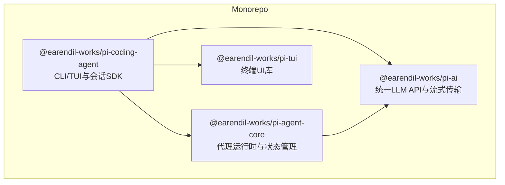
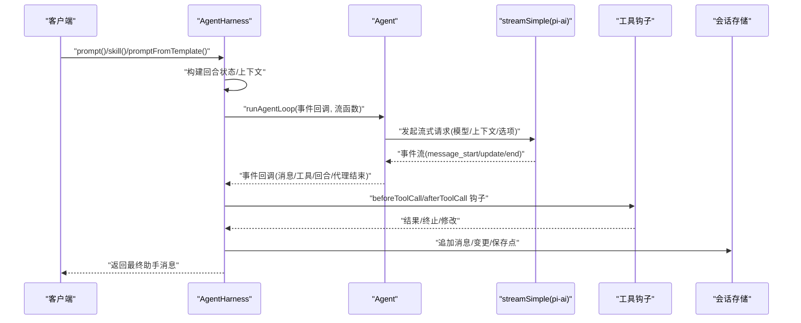
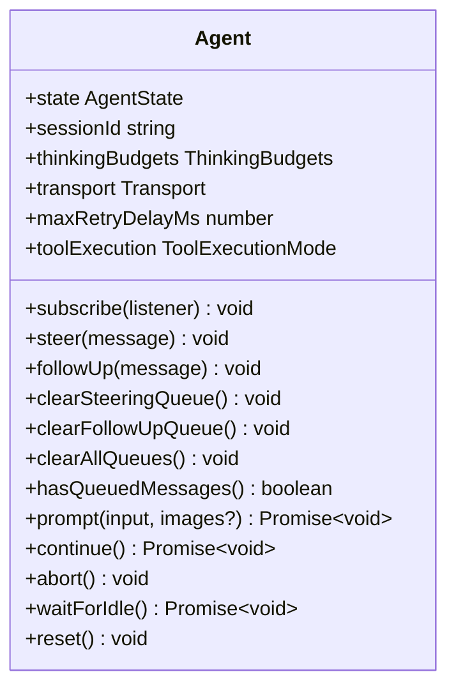
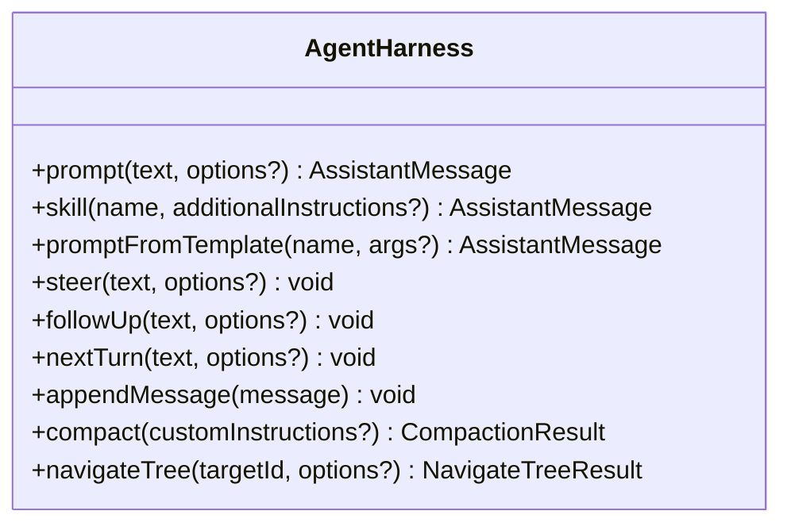
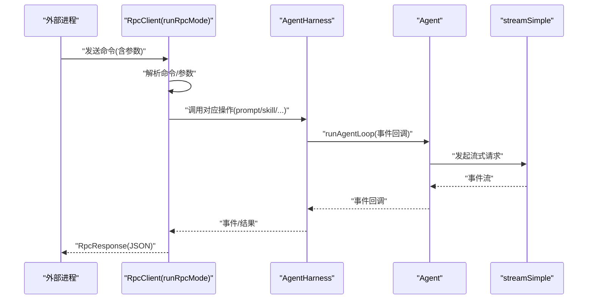
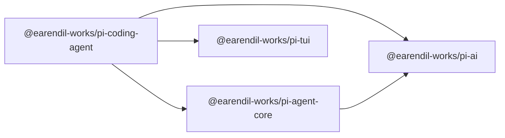

# SDK API

<cite>
**本文引用的文件**
- [README.md](file://README.md)
- [package.json](file://package.json)
- [packages/agent/package.json](file://packages/agent/package.json)
- [packages/ai/package.json](file://packages/ai/package.json)
- [packages/coding-agent/package.json](file://packages/coding-agent/package.json)
- [packages/tui/package.json](file://packages/tui/package.json)
- [packages/agent/src/agent.ts](file://packages/agent/src/agent.ts)
- [packages/agent/src/harness/agent-harness.ts](file://packages/agent/src/harness/agent-harness.ts)
- [packages/ai/src/index.ts](file://packages/ai/src/index.ts)
- [packages/coding-agent/src/index.ts](file://packages/coding-agent/src/index.ts)
</cite>

## 目录
1. [简介](#简介)
2. [项目结构](#项目结构)
3. [核心组件](#核心组件)
4. [架构总览](#架构总览)
5. [详细组件分析](#详细组件分析)
6. [依赖分析](#依赖分析)
7. [性能考虑](#性能考虑)
8. [故障排除指南](#故障排除指南)
9. [结论](#结论)
10. [附录](#附录)

## 简介
本文件为 Pi 项目的 SDK API 文档，面向希望以编程方式集成 Pi 的开发者。文档覆盖以下主题：
- SDK 初始化与配置：认证设置、连接参数、环境配置
- 核心 SDK 类：会话管理、工具调用、事件处理
- CLI 接口：命令行参数、配置选项、输出格式
- RPC 模式：远程过程调用、数据序列化、错误处理
- 使用示例：基础用法、高级特性、集成模式
- 版本兼容性、依赖要求与部署指南
- 调试技巧、性能监控与故障排除最佳实践

Pi 是一个可扩展的编码代理平台，提供统一的多提供商大模型（LLM）API、代理运行时、终端交互界面以及 CLI 工具链。SDK 由三个主要包组成：
- @earendil-works/pi-ai：统一的 LLM API 与流式传输抽象
- @earendil-works/pi-agent-core：代理运行时、状态管理与工具调用
- @earendil-works/pi-coding-agent：CLI 与交互式 TUI，提供会话管理与 RPC 模式

**章节来源**
- [README.md:19-31](file://README.md#L19-L31)
- [README.md:48-57](file://README.md#L48-L57)

## 项目结构
仓库采用 monorepo 结构，核心包位于 packages 目录：
- packages/ai：统一 LLM API、提供商适配器、流式传输与类型导出
- packages/agent：代理运行时（Agent）、代理编排（AgentHarness）、会话存储与消息管理
- packages/coding-agent：CLI 入口、会话 SDK、RPC 模式、TUI 组件
- packages/tui：终端 UI 库，供 CLI/TUI 使用

**图表来源**
- [packages/agent/package.json:31-36](file://packages/agent/package.json#L31-L36)
- [packages/ai/package.json:8-53](file://packages/ai/package.json#L8-L53)
- [packages/coding-agent/package.json:41-59](file://packages/coding-agent/package.json#L41-L59)
- [packages/tui/package.json:13-18](file://packages/tui/package.json#L13-L18)

**章节来源**
- [package.json:5-11](file://package.json#L5-L11)
- [packages/agent/package.json:1-61](file://packages/agent/package.json#L1-L61)
- [packages/ai/package.json:1-107](file://packages/ai/package.json#L1-L107)
- [packages/coding-agent/package.json:1-99](file://packages/coding-agent/package.json#L1-L99)
- [packages/tui/package.json:1-48](file://packages/tui/package.json#L1-L48)

## 核心组件
本节聚焦 SDK 的核心能力与对外 API，包括：
- Agent：状态化代理封装，支持队列化引导消息、跟随消息、事件订阅、中止控制与重置
- AgentHarness：面向会话的高级编排器，负责上下文构建、工具钩子、会话写入与压缩
- pi-ai：统一的流式传输抽象与提供商注册，提供 streamSimple 等流函数
- 编程式 SDK：在 coding-agent 中导出的会话运行时、服务工厂与工具定义

关键导出与职责概览：
- Agent：会话管理、工具执行、事件生命周期、队列控制、中止与等待空闲
- AgentHarness：回合驱动、钩子系统、会话持久化、分支摘要与压缩
- pi-ai：模型类型、流式传输、提供商类型与工具注册
- 编程式 SDK：会话运行时、服务工厂、工具工厂、RPC 客户端

**章节来源**
- [packages/agent/src/agent.ts:166-558](file://packages/agent/src/agent.ts#L166-L558)
- [packages/agent/src/harness/agent-harness.ts:174-1065](file://packages/agent/src/harness/agent-harness.ts#L174-L1065)
- [packages/ai/src/index.ts:1-48](file://packages/ai/src/index.ts#L1-L48)
- [packages/coding-agent/src/index.ts:163-191](file://packages/coding-agent/src/index.ts#L163-L191)

## 架构总览
下图展示 SDK 的高层交互：客户端通过 Agent 或 AgentHarness 发起对话；AgentHarness 将消息转换为 LLM 输入，借助 streamSimple 进行流式传输；工具调用通过钩子拦截与后处理；事件在 Agent 生命周期内传播，并持久化到会话存储。

**图表来源**
- [packages/agent/src/harness/agent-harness.ts:553-628](file://packages/agent/src/harness/agent-harness.ts#L553-L628)
- [packages/agent/src/agent.ts:386-412](file://packages/agent/src/agent.ts#L386-L412)
- [packages/ai/src/index.ts:27-28](file://packages/ai/src/index.ts#L27-L28)

## 详细组件分析

### Agent 类分析
Agent 提供状态化代理封装，具备以下能力：
- 初始化选项：初始状态、消息转换、上下文变换、流函数、API 密钥获取、事件回调、工具钩子、队列模式、会话 ID、思考预算、传输选择、最大重试延迟、工具执行策略
- 事件订阅：订阅代理生命周期事件，监听器在当前运行中被依次等待
- 队列控制：支持“引导”消息与“跟随”消息，两种队列模式（逐条/全部）
- 运行控制：启动提示、继续对话、中止当前运行、等待空闲、重置状态
- 内部事件处理：根据事件更新内部状态（消息、流状态、待执行工具集合），并向订阅者广播

**图表来源**
- [packages/agent/src/agent.ts:166-558](file://packages/agent/src/agent.ts#L166-L558)

**章节来源**
- [packages/agent/src/agent.ts:95-219](file://packages/agent/src/agent.ts#L95-L219)
- [packages/agent/src/agent.ts:231-335](file://packages/agent/src/agent.ts#L231-L335)
- [packages/agent/src/agent.ts:337-412](file://packages/agent/src/agent.ts#L337-L412)
- [packages/agent/src/agent.ts:509-556](file://packages/agent/src/agent.ts#L509-L556)

### AgentHarness 类分析
AgentHarness 面向会话的高级编排器，负责：
- 执行回合：prompt、skill、promptFromTemplate
- 队列管理：steer/followUp/nextTurn
- 钩子系统：before_agent_start、context、tool_call、tool_result、before_provider_request、before_provider_payload、after_provider_response、session_* 系列
- 会话持久化：消息追加、模型切换、思考级别变更、活动工具变更、自定义条目等
- 压缩与导航：分支摘要、树导航、压缩流程
- 错误归一化：将底层异常映射为 AgentHarnessError

**图表来源**
- [packages/agent/src/harness/agent-harness.ts:630-800](file://packages/agent/src/harness/agent-harness.ts#L630-L800)

**章节来源**
- [packages/agent/src/harness/agent-harness.ts:174-223](file://packages/agent/src/harness/agent-harness.ts#L174-L223)
- [packages/agent/src/harness/agent-harness.ts:409-470](file://packages/agent/src/harness/agent-harness.ts#L409-L470)
- [packages/agent/src/harness/agent-harness.ts:509-537](file://packages/agent/src/harness/agent-harness.ts#L509-L537)
- [packages/agent/src/harness/agent-harness.ts:630-762](file://packages/agent/src/harness/agent-harness.ts#L630-L762)

### 编程式 SDK（会话运行时与服务）
coding-agent 提供编程式 SDK，核心导出包括：
- 会话运行时与服务工厂：createAgentSession、createAgentSessionFromServices、createAgentSessionRuntime、createAgentSessionServices
- 工具工厂：createBashTool、createEditTool、createFindTool、createGrepTool、createLsTool、createReadTool、createWriteTool 及只读工具集
- Prompt 模板类型与会话管理类型：用于构建与维护会话上下文
- RPC 模式：RpcClient、runRpcMode、runPrintMode 等

这些导出使开发者能够以编程方式创建会话、注入工具、执行对话并接入 RPC 模式。

**章节来源**
- [packages/coding-agent/src/index.ts:163-191](file://packages/coding-agent/src/index.ts#L163-L191)
- [packages/coding-agent/src/index.ts:232-281](file://packages/coding-agent/src/index.ts#L232-L281)
- [packages/coding-agent/src/index.ts:284-298](file://packages/coding-agent/src/index.ts#L284-L298)

### RPC 模式实现
RPC 模式允许外部进程通过标准输入/输出与 CLI 通信，典型流程如下：
- 启动：runRpcMode 创建 RpcClient 并进入循环读取命令
- 命令解析：RpcClient 解析命令与参数，构造 RpcCommand
- 执行：根据命令类型调用相应逻辑（如 prompt、skill、promptFromTemplate、steer、followUp、nextTurn、compact、navigateTree、appendMessage、quit）
- 响应：将 RpcResponse 序列化输出，包含状态码、消息与数据
- 事件：在 AgentHarness 层触发事件，便于监听与持久化

**图表来源**
- [packages/coding-agent/src/index.ts:284-298](file://packages/coding-agent/src/index.ts#L284-L298)
- [packages/agent/src/harness/agent-harness.ts:553-628](file://packages/agent/src/harness/agent-harness.ts#L553-L628)
- [packages/agent/src/agent.ts:386-412](file://packages/agent/src/agent.ts#L386-L412)

## 依赖分析
- Node.js 版本要求：所有包均声明 Node >= 22.19.0
- 包导出与入口：
  - @earendil-works/pi-ai：提供统一 LLM API、流式传输与提供商注册
  - @earendil-works/pi-agent-core：提供 Agent 与 AgentHarness
  - @earendil-works/pi-coding-agent：提供 CLI、会话 SDK、RPC 模式
  - @earendil-works/pi-tui：提供终端 UI 能力
- 关键依赖关系：
  - coding-agent 依赖 agent、ai、tui
  - agent 依赖 ai
  - ai 依赖多个提供商 SDK（OpenAI、Anthropic、Google、Bedrock 等）

**图表来源**
- [packages/coding-agent/package.json:41-59](file://packages/coding-agent/package.json#L41-L59)
- [packages/agent/package.json:31-36](file://packages/agent/package.json#L31-L36)
- [packages/ai/package.json:69-80](file://packages/ai/package.json#L69-L80)

**章节来源**
- [package.json:49-51](file://package.json#L49-L51)
- [packages/agent/package.json:51-53](file://packages/agent/package.json#L51-L53)
- [packages/ai/package.json:98-100](file://packages/ai/package.json#L98-L100)
- [packages/coding-agent/package.json:95-97](file://packages/coding-agent/package.json#L95-L97)
- [packages/tui/package.json:35-37](file://packages/tui/package.json#L35-L37)

## 性能考虑
- 流式传输：通过 streamSimple 获取事件流，减少首字节延迟，提升交互体验
- 队列模式：steeringMode 与 followUpMode 支持“逐条/全部”两种模式，按需平衡吞吐与一致性
- 工具执行策略：toolExecution 支持并行执行，提高多工具场景下的响应速度
- 重试与超时：AgentHarness 的 streamOptions 支持超时、最大重试次数与最大重试延迟，避免长时间阻塞
- 会话压缩：在长对话后进行分支摘要与压缩，降低上下文开销，提升后续推理性能

[本节为通用指导，不直接分析具体文件]

## 故障排除指南
- 重复名称与未知工具：在 AgentHarness 构造时校验工具名唯一性与存在性，若重复或未知会抛出 AgentHarnessError
- 运行失败：AgentHarness 在 runAgentLoop 失败时会发出失败消息事件并尝试报告失败，若失败上报也失败则抛出聚合错误
- 队列状态：steer/followUp/nextTurn 在空闲状态下不可用，需先完成一次回合
- 会话写入：在回合进行中追加消息会被暂存至 pendingSessionWrites，回合结束后批量刷新

**章节来源**
- [packages/agent/src/harness/agent-harness.ts:472-482](file://packages/agent/src/harness/agent-harness.ts#L472-L482)
- [packages/agent/src/harness/agent-harness.ts:539-551](file://packages/agent/src/harness/agent-harness.ts#L539-L551)
- [packages/agent/src/harness/agent-harness.ts:679-694](file://packages/agent/src/harness/agent-harness.ts#L679-L694)
- [packages/agent/src/harness/agent-harness.ts:484-508](file://packages/agent/src/harness/agent-harness.ts#L484-L508)

## 结论
Pi 的 SDK 将统一的 LLM 抽象、代理运行时与会话编排整合为一体，既支持 CLI/TUI 交互，也支持编程式 SDK 与 RPC 模式。通过事件驱动与钩子系统，开发者可以灵活扩展工具、拦截与修改对话行为，并结合会话压缩与队列策略优化性能与用户体验。

[本节为总结性内容，不直接分析具体文件]

## 附录

### 初始化与配置
- 认证设置
  - Agent：可通过 getApiKey 或 AgentHarness 的 getApiKeyAndHeaders 提供 API Key 与请求头
  - AgentHarness：在 before_provider_request 钩子中合并 headers，支持动态鉴权
- 连接参数
  - 传输选择：transport（自动/显式指定）
  - 超时与重试：timeoutMs、maxRetries、maxRetryDelayMs
  - 缓存保留：cacheRetention
  - 会话 ID：sessionId 透传给流函数，用于缓存感知后端
- 环境配置
  - Node 版本：>= 22.19.0
  - 包导出：pi-ai 提供统一模型与流式传输类型；coding-agent 提供 CLI 与会话 SDK

**章节来源**
- [packages/agent/src/agent.ts:95-116](file://packages/agent/src/agent.ts#L95-L116)
- [packages/agent/src/harness/agent-harness.ts:376-407](file://packages/agent/src/harness/agent-harness.ts#L376-L407)
- [packages/ai/src/index.ts:27-28](file://packages/ai/src/index.ts#L27-L28)
- [package.json:49-51](file://package.json#L49-L51)

### 核心 SDK 类方法与属性
- Agent
  - 方法：subscribe、steer、followUp、clearSteeringQueue、clearFollowUpQueue、clearAllQueues、hasQueuedMessages、prompt、continue、abort、waitForIdle、reset
  - 属性：state、sessionId、thinkingBudgets、transport、maxRetryDelayMs、toolExecution
- AgentHarness
  - 方法：prompt、skill、promptFromTemplate、steer、followUp、nextTurn、appendMessage、compact、navigateTree
  - 钩子：before_agent_start、context、tool_call、tool_result、before_provider_request、before_provider_payload、after_provider_response、session_* 系列
- 编程式 SDK
  - 工厂：createAgentSession、createAgentSessionFromServices、createAgentSessionRuntime、createAgentSessionServices
  - 工具工厂：createBashTool、createEditTool、createFindTool、createGrepTool、createLsTool、createReadTool、createWriteTool
  - RPC：runRpcMode、RpcClient、RpcCommand、RpcResponse

**章节来源**
- [packages/agent/src/agent.ts:166-558](file://packages/agent/src/agent.ts#L166-L558)
- [packages/agent/src/harness/agent-harness.ts:174-800](file://packages/agent/src/harness/agent-harness.ts#L174-L800)
- [packages/coding-agent/src/index.ts:163-191](file://packages/coding-agent/src/index.ts#L163-L191)

### CLI 接口使用
- 命令行二进制：pi（来自 @earendil-works/pi-coding-agent）
- 主要模式：交互模式、打印模式、RPC 模式
- 会话管理：会话创建、加载、切换、信息查询与标签
- 输出格式：JSON（RPC 模式）、人类可读文本（交互/打印模式）

**章节来源**
- [packages/coding-agent/package.json:9-11](file://packages/coding-agent/package.json#L9-L11)
- [packages/coding-agent/src/index.ts:284-298](file://packages/coding-agent/src/index.ts#L284-L298)

### RPC 模式的数据序列化与错误处理
- 数据序列化：RpcCommand/RpcResponse 以 JSON 形式在标准输入/输出传递
- 错误处理：AgentHarness 将异常归一化为 AgentHarnessError，必要时在失败事件中携带错误信息

**章节来源**
- [packages/coding-agent/src/index.ts:284-298](file://packages/coding-agent/src/index.ts#L284-L298)
- [packages/agent/src/harness/agent-harness.ts:145-156](file://packages/agent/src/harness/agent-harness.ts#L145-L156)

### 使用示例（路径指引）
- 基础用法
  - 通过 Agent.prompt 发起一次对话
  - 通过 Agent.continue 继续当前对话
  - 通过 Agent.subscribe 订阅事件并处理
  - 参考：[packages/agent/src/agent.ts:324-365](file://packages/agent/src/agent.ts#L324-L365)
- 高级特性
  - 使用 AgentHarness 的钩子系统拦截与修改上下文、工具调用与结果
  - 使用 AgentHarness.compact 与 navigateTree 进行会话压缩与树导航
  - 参考：[packages/agent/src/harness/agent-harness.ts:421-470](file://packages/agent/src/harness/agent-harness.ts#L421-L470)
- 集成模式
  - 通过编程式 SDK 创建会话运行时与服务工厂，注入自定义工具
  - 通过 RPC 模式让外部进程与 CLI 通信
  - 参考：[packages/coding-agent/src/index.ts:163-191](file://packages/coding-agent/src/index.ts#L163-L191)

### 版本兼容性与部署指南
- Node.js：>= 22.19.0
- 包版本：各包版本号一致（例如 0.77.0），确保依赖锁定
- 部署建议
  - 使用 npm ci 安装并忽略脚本，保证可复现安装
  - 发布前执行检查脚本（lint、格式、类型检查、锁文件校验、浏览器烟雾测试）
  - CLI 包含 npm-shrinkwrap.json，用于固定第三方依赖

**章节来源**
- [package.json:49-51](file://package.json#L49-L51)
- [packages/agent/package.json:51-53](file://packages/agent/package.json#L51-L53)
- [packages/ai/package.json:98-100](file://packages/ai/package.json#L98-L100)
- [packages/coding-agent/package.json:95-97](file://packages/coding-agent/package.json#L95-L97)
- [README.md:73-86](file://README.md#L73-L86)