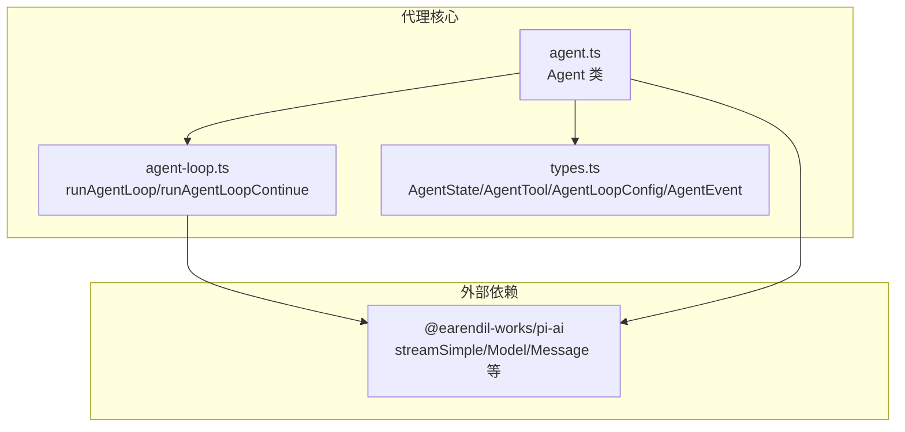
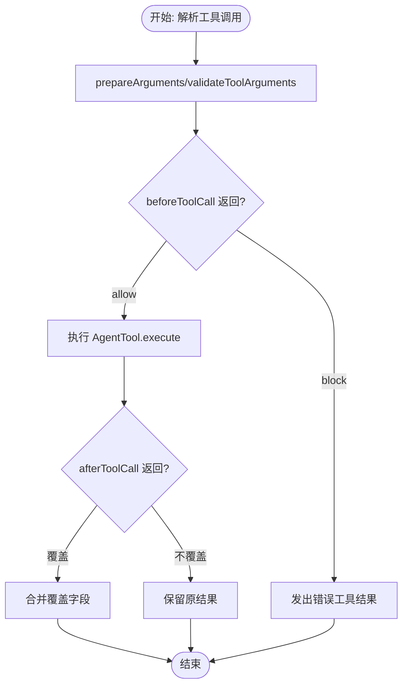
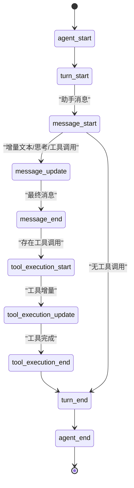
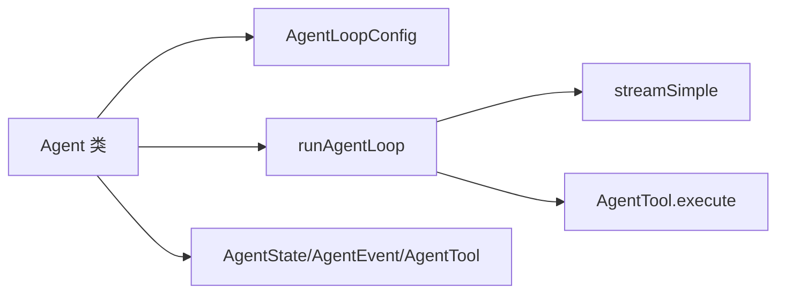

# 代理API

<cite>
**本文引用的文件**
- [packages/agent/src/agent.ts](file://packages/agent/src/agent.ts)
- [packages/agent/src/agent-loop.ts](file://packages/agent/src/agent-loop.ts)
- [packages/agent/src/types.ts](file://packages/agent/src/types.ts)
- [packages/agent/test/agent.test.ts](file://packages/agent/test/agent.test.ts)
</cite>

## 目录
1. [简介](#简介)
2. [项目结构](#项目结构)
3. [核心组件](#核心组件)
4. [架构总览](#架构总览)
5. [详细组件分析](#详细组件分析)
6. [依赖关系分析](#依赖关系分析)
7. [性能考量](#性能考量)
8. [故障排查指南](#故障排查指南)
9. [结论](#结论)
10. [附录：代码示例与最佳实践](#附录代码示例与最佳实践)

## 简介
本文件为 Pi 项目中的代理 API 提供系统化、可操作的开发者文档。重点覆盖以下方面：
- Agent 类的公共方法、属性与事件订阅机制
- 消息处理流程（prompt/continue）、队列注入（steer/followUp）与生命周期管理
- AgentState 接口的状态管理能力
- AgentTool 工具定义的参数准备、校验与执行机制
- AgentLoopConfig 配置项（转换函数、钩子、回调、流式传输等）
- AgentEvent 事件系统（事件类型、触发条件、数据结构）
- 错误处理与最佳实践
- 结合测试用例给出可直接参考的使用示例路径

## 项目结构
本仓库采用多包结构，代理核心位于 packages/agent。关键源码分布如下：
- 核心运行时：agent.ts（状态机、事件分发、生命周期控制）
- 循环逻辑：agent-loop.ts（LLM 调用、工具调用、事件发射）
- 类型与配置：types.ts（AgentState、AgentTool、AgentLoopConfig、AgentEvent 等）
- 测试用例：agent.test.ts（行为验证、事件序列、错误处理）



图表来源
- [packages/agent/src/agent.ts:166-558](file://packages/agent/src/agent.ts#L166-L558)
- [packages/agent/src/agent-loop.ts:95-270](file://packages/agent/src/agent-loop.ts#L95-L270)
- [packages/agent/src/types.ts:135-419](file://packages/agent/src/types.ts#L135-L419)

章节来源
- [packages/agent/src/agent.ts:166-558](file://packages/agent/src/agent.ts#L166-L558)
- [packages/agent/src/agent-loop.ts:95-270](file://packages/agent/src/agent-loop.ts#L95-L270)
- [packages/agent/src/types.ts:135-419](file://packages/agent/src/types.ts#L135-L419)

## 核心组件
- Agent 类：面向应用的高层封装，负责状态管理、事件订阅、消息注入、生命周期控制与工具执行编排。
- AgentLoopConfig：低层循环配置，定义转换、上下文变换、API Key 解析、钩子、回调、工具执行模式与队列策略。
- AgentState：只读对外状态视图，包含系统提示、模型、思考级别、工具列表、消息历史、流式状态、待执行工具集合与错误信息。
- AgentTool：工具抽象，支持参数预处理、Schema 校验、执行回调与可选的串行/并行执行模式。
- AgentEvent：事件系统，贯穿一次对话轮次（turn）从开始到结束的全生命周期。

章节来源
- [packages/agent/src/agent.ts:166-558](file://packages/agent/src/agent.ts#L166-L558)
- [packages/agent/src/types.ts:135-419](file://packages/agent/src/types.ts#L135-L419)

## 架构总览
下图展示了从应用调用到 LLM 请求、工具执行与事件回传的整体流程。

```mermaid
sequenceDiagram
participant App as "应用"
participant Agent as "Agent 类"
participant Loop as "runAgentLoop"
participant Stream as "streamSimple"
participant Tools as "AgentTool.execute"
App->>Agent : "prompt()/continue()"
Agent->>Agent : "runWithLifecycle()"
Agent->>Loop : "runAgentLoop(..., config)"
Loop->>Loop : "transformContext()/convertToLlm()"
Loop->>Stream : "发起流式请求"
Stream-->>Loop : "message_start/message_update/message_end"
Loop->>Loop : "解析工具调用"
Loop->>Tools : "execute(toolCall)"
Tools-->>Loop : "工具结果/部分更新"
Loop-->>Agent : "emit AgentEvent"
Agent->>Agent : "processEvents() 更新状态"
Agent-->>App : "事件回调/最终消息"
```

图表来源
- [packages/agent/src/agent.ts:386-412](file://packages/agent/src/agent.ts#L386-L412)
- [packages/agent/src/agent-loop.ts:155-269](file://packages/agent/src/agent-loop.ts#L155-L269)
- [packages/agent/src/agent-loop.ts:275-368](file://packages/agent/src/agent-loop.ts#L275-L368)
- [packages/agent/src/agent-loop.ts:373-516](file://packages/agent/src/agent-loop.ts#L373-L516)

## 详细组件分析

### Agent 类 API 总览
- 构造与初始化
  - 支持通过 initialState、convertToLlm、transformContext、streamFn、getApiKey、onPayload/onResponse、beforeToolCall/afterToolCall、prepareNextTurn、steeringMode/followUpMode、sessionId、thinkingBudgets、transport、maxRetryDelayMs、toolExecution 等选项定制。
- 状态访问
  - state：只读公开状态视图，包含 systemPrompt、model、thinkingLevel、tools/messages 的 getter/setter（赋值会复制数组），以及 isStreaming、streamingMessage、pendingToolCalls、errorMessage。
- 生命周期与消息处理
  - prompt(message | messages | string[, images])：启动新对话，若已在运行则抛错；内部归一化输入后进入 runPromptMessages。
  - continue()：基于现有消息历史继续生成，要求最后一条消息为 user/toolResult；若无队列且非 assistant 尾部则继续；否则按队列策略处理。
  - reset()：清空消息、流状态、待执行工具与错误信息，并清空两个队列。
  - waitForIdle()：等待当前运行及已订阅事件监听器完成。
  - signal/abort()：暴露当前运行的 AbortSignal，支持主动中止。
- 队列与注入
  - steer(message)/followUp(message)：分别注入“引导消息”和“后续消息”，支持“全部注入(all)”或“逐条注入(one-at-a-time)”两种模式。
  - clearSteeringQueue()/clearFollowUpQueue()/clearAllQueues()/hasQueuedMessages()：队列管理。
- 订阅与事件
  - subscribe(listener)：订阅 AgentEvent，listener 可异步并接收 AbortSignal；agent_end 后仍需等待所有已订阅监听器完成才视为真正空闲。
- 内部运行机制
  - runWithLifecycle：设置 isStreaming、捕获错误、收尾 finishRun。
  - runPromptMessages/runContinuation：构建上下文快照与 AgentLoopConfig，调用底层循环。
  - processEvents：根据事件类型更新 AgentState 并同步通知订阅者。

章节来源
- [packages/agent/src/agent.ts:95-219](file://packages/agent/src/agent.ts#L95-L219)
- [packages/agent/src/agent.ts:231-322](file://packages/agent/src/agent.ts#L231-L322)
- [packages/agent/src/agent.ts:324-412](file://packages/agent/src/agent.ts#L324-L412)
- [packages/agent/src/agent.ts:451-556](file://packages/agent/src/agent.ts#L451-L556)

### AgentState 状态管理
- 字段与语义
  - systemPrompt：随每次请求发送的系统提示
  - model：当前使用的 Model
  - thinkingLevel：推理级别（off/minimal/low/medium/high/xhigh）
  - tools/messages：getter/setter，赋值会复制顶层数组，避免外部直接修改内部引用
  - isStreaming：是否正在处理 prompt 或 continue
  - streamingMessage：当前流式助手消息片段
  - pendingToolCalls：当前正在执行的工具调用 ID 集合
  - errorMessage：最近一次失败或被中止的助手消息的错误文本
- 复杂度与一致性
  - 通过不可变快照与事件驱动更新，保证 UI/监听器与运行时状态一致
  - pendingToolCalls 使用 Set 以 O(1) 检查工具执行状态

章节来源
- [packages/agent/src/types.ts:317-342](file://packages/agent/src/types.ts#L317-L342)
- [packages/agent/src/agent.ts:66-93](file://packages/agent/src/agent.ts#L66-L93)
- [packages/agent/src/agent.ts:509-547](file://packages/agent/src/agent.ts#L509-L547)

### AgentTool 工具定义与执行
- 定义要点
  - 继承自通用 Tool，扩展 label、prepareArguments、execute、executionMode
  - execute 支持可选的 AgentToolUpdateCallback，用于流式返回中间结果
- 参数准备与校验
  - prepareArguments：在 Schema 校验前对原始参数进行兼容性转换
  - 校验由上游 validateToolArguments 完成（在工具准备阶段）
- 执行与回调
  - beforeToolCall：在执行前拦截，可阻断执行并返回原因
  - afterToolCall：在执行后拦截，可部分覆盖结果字段（content/details/isError/terminate）
- 执行模式
  - 支持 per-tool executionMode 覆盖全局 toolExecution（"sequential"/"parallel"）
  - 并行模式下，先顺序预检，再并发执行，最终按完成顺序发出 tool_execution_end，但工具结果消息仍按原顺序插入



图表来源
- [packages/agent/src/agent-loop.ts:562-708](file://packages/agent/src/agent-loop.ts#L562-L708)
- [packages/agent/src/types.ts:361-384](file://packages/agent/src/types.ts#L361-L384)

章节来源
- [packages/agent/src/agent-loop.ts:562-708](file://packages/agent/src/agent-loop.ts#L562-L708)
- [packages/agent/src/types.ts:361-384](file://packages/agent/src/types.ts#L361-L384)

### AgentLoopConfig 配置项详解
- 基础字段
  - model：当前模型
  - reasoning/thinkingLevel：推理级别（字符串）
  - sessionId/transport/maxRetryDelayMs/thinkingBudgets/toolExecution：运行期参数透传
- 转换与上下文
  - convertToLlm：将 AgentMessage[] 转换为 LLM 可理解的 Message[]
  - transformContext：在 convertToLlm 前对 AgentMessage[] 进行上下文变换（如裁剪、注入）
  - getApiKey：动态解析 API Key（适用于易过期令牌）
- 钩子与回调
  - beforeToolCall：工具执行前拦截，可阻断
  - afterToolCall：工具执行后拦截，可部分覆盖结果
  - prepareNextTurn：每轮结束后替换下一轮上下文/模型/思考级别
  - shouldStopAfterTurn：在 turn_end 后决定是否提前终止
- 队列与注入
  - getSteeringMessages/getFollowUpMessages：轮次间注入消息的来源
- 其他
  - onPayload/onResponse：流式传输的 payload/response 回调
  - 其余 SimpleStreamOptions 透传

章节来源
- [packages/agent/src/types.ts:135-277](file://packages/agent/src/types.ts#L135-L277)
- [packages/agent/src/agent.ts:422-449](file://packages/agent/src/agent.ts#L422-L449)

### AgentEvent 事件系统
- 事件类型与触发时机
  - agent_start/agent_end：一次运行开始/结束（agent_end 是最后一次事件，但需等待已订阅监听器完成）
  - turn_start/turn_end：一轮开始/结束（包含本轮助手消息与工具结果）
  - message_start/message_update/message_end：用户/助手/工具结果消息的开始/增量更新/结束
  - tool_execution_start/tool_execution_update/tool_execution_end：工具执行开始/增量更新/结束
- 数据结构
  - 事件携带必要上下文（如 toolCallId/toolName/args/result/isError 等）
  - 订阅者可获得 AbortSignal，以便在监听器中响应中止
- 状态联动
  - processEvents 根据事件类型更新 AgentState（如 streamingMessage、messages、pendingToolCalls、errorMessage）



图表来源
- [packages/agent/src/agent.ts:509-556](file://packages/agent/src/agent.ts#L509-L556)
- [packages/agent/src/types.ts:403-419](file://packages/agent/src/types.ts#L403-L419)

章节来源
- [packages/agent/src/agent.ts:509-556](file://packages/agent/src/agent.ts#L509-L556)
- [packages/agent/src/types.ts:403-419](file://packages/agent/src/types.ts#L403-L419)

## 依赖关系分析
- Agent 依赖 @earendil-works/pi-ai 的 streamSimple 作为默认流式传输函数，并通过 AgentLoopConfig 透传相关选项
- AgentLoopConfig 将 convertToLlm/transformContext/beforeToolCall/afterToolCall 等回调注入到底层循环
- AgentLoop 在 runLoop 中协调 steering/followUp 队列、工具执行批次与停止条件



图表来源
- [packages/agent/src/agent.ts:172-219](file://packages/agent/src/agent.ts#L172-L219)
- [packages/agent/src/agent-loop.ts:95-270](file://packages/agent/src/agent-loop.ts#L95-L270)
- [packages/agent/src/types.ts:135-419](file://packages/agent/src/types.ts#L135-L419)

章节来源
- [packages/agent/src/agent.ts:172-219](file://packages/agent/src/agent.ts#L172-L219)
- [packages/agent/src/agent-loop.ts:95-270](file://packages/agent/src/agent-loop.ts#L95-L270)
- [packages/agent/src/types.ts:135-419](file://packages/agent/src/types.ts#L135-L419)

## 性能考量
- 工具执行模式
  - 并行模式可提升吞吐，但需注意工具副作用与资源竞争；串行模式更安全但吞吐较低
- 上下文变换
  - transformContext 中的裁剪/注入应尽量轻量，避免在每次轮次都做昂贵计算
- 流式传输
  - onPayload/onResponse 可用于统计与可观测性，但应避免在回调中做重 IO
- 队列策略
  - steeringMode/followUpMode 影响交互延迟与吞吐，需结合业务场景选择

## 故障排查指南
- 常见错误与定位
  - “已在运行”：同一 Agent 实例同时执行 prompt/continue，应使用 steer()/followUp() 或等待 waitForIdle()
  - “无法从 assistant 继续”：lastMessage 必须是 user/toolResult，否则 continue() 会抛错
  - “运行失败”：handleRunFailure 会发出 message_start/message_end/turn_end/agent_end 的失败消息，检查 errorMessage
  - “工具被阻断”：beforeToolCall 返回 block 时会发出错误工具结果，检查 reason
- 监听器与中止信号
  - 订阅者可接收 AbortSignal，在监听器中及时响应中止
- 单元测试参考
  - 测试覆盖了事件序列、异步监听器结算、AbortSignal 传递、队列注入与 continue() 行为

章节来源
- [packages/agent/src/agent.ts:324-365](file://packages/agent/src/agent.ts#L324-L365)
- [packages/agent/src/agent.ts:476-492](file://packages/agent/src/agent.ts#L476-L492)
- [packages/agent/test/agent.test.ts:103-132](file://packages/agent/test/agent.test.ts#L103-L132)
- [packages/agent/test/agent.test.ts:207-243](file://packages/agent/test/agent.test.ts#L207-L243)

## 结论
Pi 代理 API 通过 Agent 类与 AgentLoopConfig 提供了清晰、可扩展的对话与工具调用框架。其事件驱动的状态机设计使得 UI 与业务逻辑解耦，同时允许灵活的上下文变换、工具拦截与队列注入。配合合理的工具执行模式与队列策略，可在保证稳定性的同时实现高吞吐与低延迟。

## 附录：代码示例与最佳实践

### 如何创建代理实例
- 使用默认构造或传入 initialState、convertToLlm、transformContext、streamFn、getApiKey、onPayload/onResponse、beforeToolCall/afterToolCall、prepareNextTurn、steeringMode/followUpMode、sessionId、thinkingBudgets、transport、maxRetryDelayMs、toolExecution 等选项定制。
- 示例参考路径
  - [packages/agent/test/agent.test.ts:51-80](file://packages/agent/test/agent.test.ts#L51-L80)

章节来源
- [packages/agent/test/agent.test.ts:51-80](file://packages/agent/test/agent.test.ts#L51-L80)

### 如何注册工具
- 定义 AgentTool（含 label、prepareArguments、execute、executionMode），并在 AgentState.tools 中设置
- 示例参考路径
  - [packages/agent/src/types.ts:361-384](file://packages/agent/src/types.ts#L361-L384)
  - [packages/agent/test/agent.test.ts:245-282](file://packages/agent/test/agent.test.ts#L245-L282)

章节来源
- [packages/agent/src/types.ts:361-384](file://packages/agent/src/types.ts#L361-L384)
- [packages/agent/test/agent.test.ts:245-282](file://packages/agent/test/agent.test.ts#L245-L282)

### 如何处理消息与监听事件
- 使用 subscribe 订阅 AgentEvent，注意 agent_end 后仍需等待监听器完成
- 使用 steer()/followUp() 注入消息，或使用 continue() 继续生成
- 示例参考路径
  - [packages/agent/src/agent.ts:231-322](file://packages/agent/src/agent.ts#L231-L322)
  - [packages/agent/test/agent.test.ts:81-101](file://packages/agent/test/agent.test.ts#L81-L101)
  - [packages/agent/test/agent.test.ts:284-302](file://packages/agent/test/agent.test.ts#L284-L302)
  - [packages/agent/test/agent.test.ts:387-423](file://packages/agent/test/agent.test.ts#L387-L423)

章节来源
- [packages/agent/src/agent.ts:231-322](file://packages/agent/src/agent.ts#L231-L322)
- [packages/agent/test/agent.test.ts:81-101](file://packages/agent/test/agent.test.ts#L81-L101)
- [packages/agent/test/agent.test.ts:284-302](file://packages/agent/test/agent.test.ts#L284-L302)
- [packages/agent/test/agent.test.ts:387-423](file://packages/agent/test/agent.test.ts#L387-L423)

### 如何使用 AgentLoopConfig
- 设置 convertToLlm/transformContext/beforeToolCall/afterToolCall/prepareNextTurn/shouldStopAfterTurn/getSteeringMessages/getFollowUpMessages/toolExecution 等
- 示例参考路径
  - [packages/agent/src/agent.ts:422-449](file://packages/agent/src/agent.ts#L422-L449)
  - [packages/agent/src/types.ts:135-277](file://packages/agent/src/types.ts#L135-L277)

章节来源
- [packages/agent/src/agent.ts:422-449](file://packages/agent/src/agent.ts#L422-L449)
- [packages/agent/src/types.ts:135-277](file://packages/agent/src/types.ts#L135-L277)

### 错误处理与最佳实践
- 使用 handleRunFailure 发出统一的失败消息（包含 stopReason 与 errorMessage）
- 在 beforeToolCall/afterToolCall 中尊重 AbortSignal
- 使用 waitForIdle 确保监听器完成后再认为代理空闲
- 示例参考路径
  - [packages/agent/src/agent.ts:476-500](file://packages/agent/src/agent.ts#L476-L500)
  - [packages/agent/test/agent.test.ts:103-132](file://packages/agent/test/agent.test.ts#L103-L132)
  - [packages/agent/test/agent.test.ts:172-205](file://packages/agent/test/agent.test.ts#L172-L205)

章节来源
- [packages/agent/src/agent.ts:476-500](file://packages/agent/src/agent.ts#L476-L500)
- [packages/agent/test/agent.test.ts:103-132](file://packages/agent/test/agent.test.ts#L103-L132)
- [packages/agent/test/agent.test.ts:172-205](file://packages/agent/test/agent.test.ts#L172-L205)