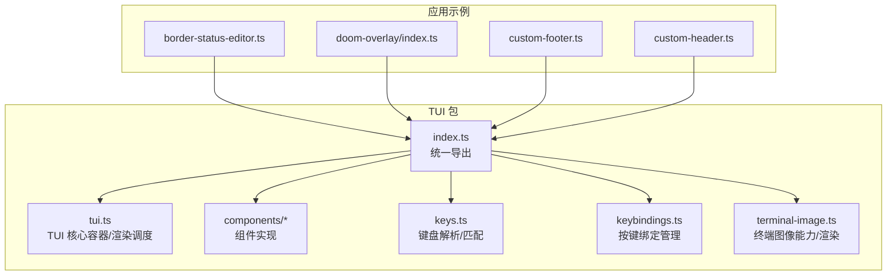
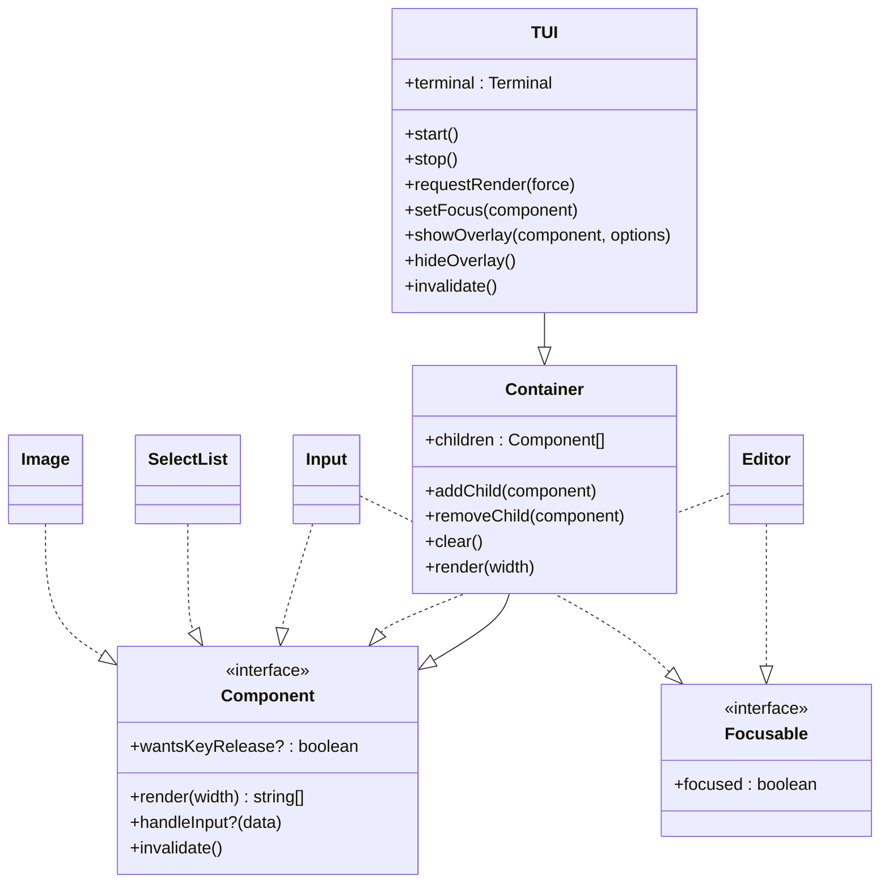
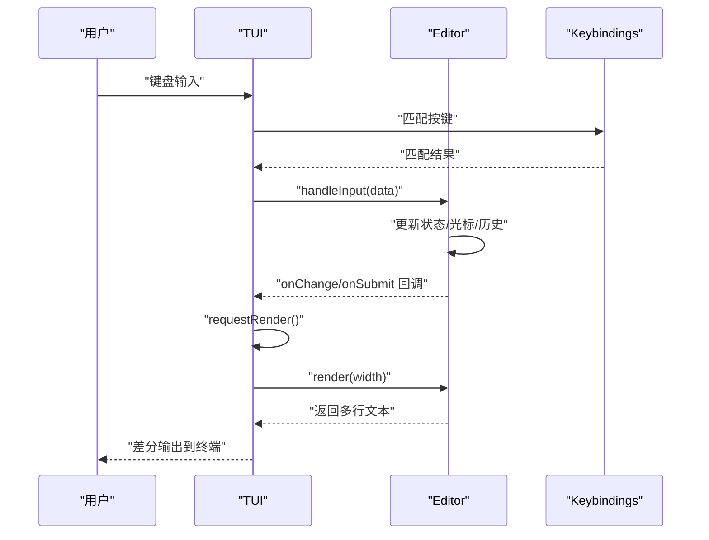
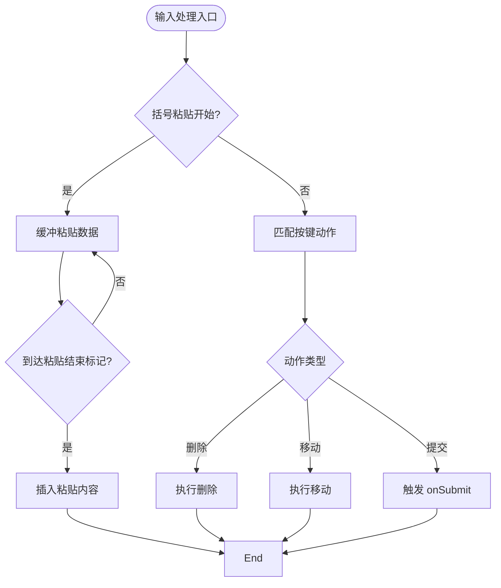
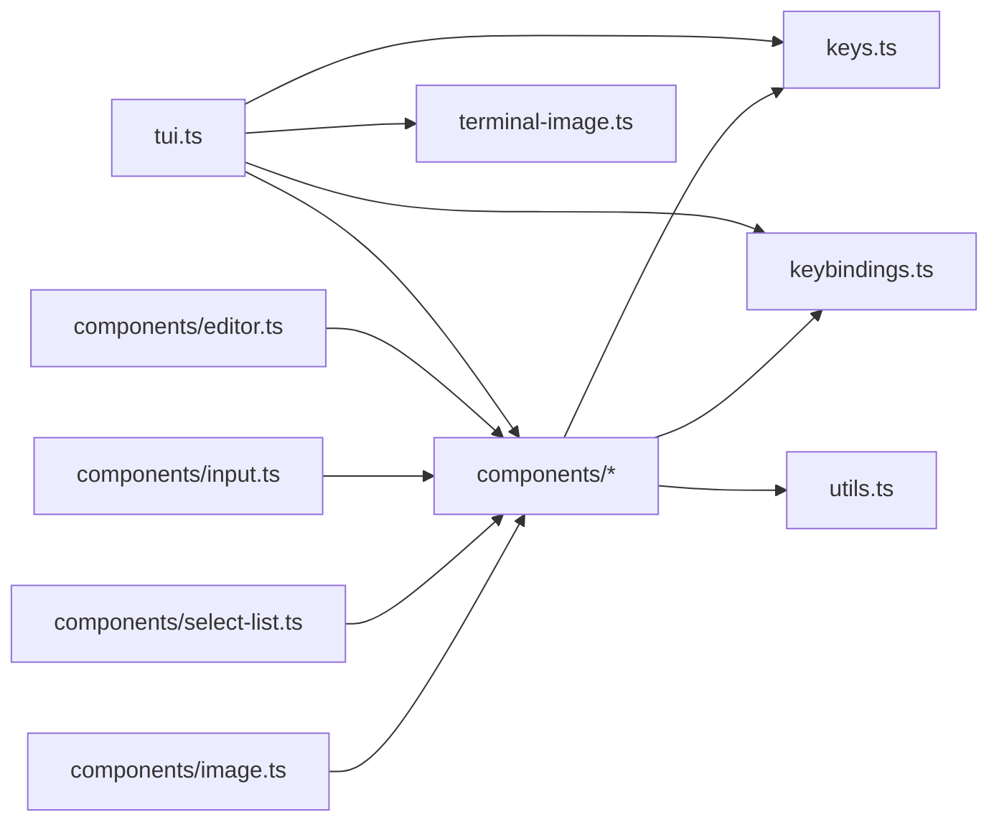
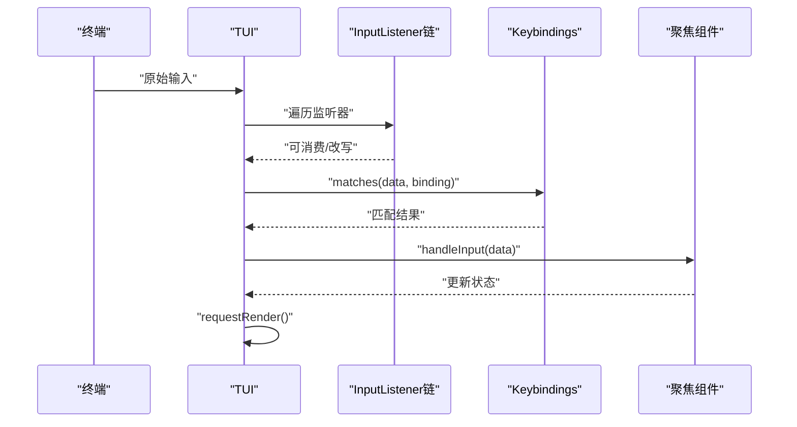

# 终端UI API

<cite>
**本文引用的文件**
- [packages/tui/src/index.ts](file://packages/tui/src/index.ts)
- [packages/tui/src/tui.ts](file://packages/tui/src/tui.ts)
- [packages/tui/src/components/editor.ts](file://packages/tui/src/components/editor.ts)
- [packages/tui/src/components/input.ts](file://packages/tui/src/components/input.ts)
- [packages/tui/src/components/select-list.ts](file://packages/tui/src/components/select-list.ts)
- [packages/tui/src/components/image.ts](file://packages/tui/src/components/image.ts)
- [packages/tui/src/keybindings.ts](file://packages/tui/src/keybindings.ts)
- [packages/tui/src/keys.ts](file://packages/tui/src/keys.ts)
- [packages/tui/src/terminal-image.ts](file://packages/tui/src/terminal-image.ts)
- [packages/tui/package.json](file://packages/tui/package.json)
- [packages/coding-agent/examples/extensions/border-status-editor.ts](file://packages/coding-agent/examples/extensions/border-status-editor.ts)
- [packages/coding-agent/examples/extensions/doom-overlay/index.ts](file://packages/coding-agent/examples/extensions/doom-overlay/index.ts)
- [packages/coding-agent/examples/extensions/doom-overlay/doom-component.ts](file://packages/coding-agent/examples/extensions/doom-overlay/doom-component.ts)
- [packages/coding-agent/examples/extensions/doom-overlay/doom-keys.ts](file://packages/coding-agent/examples/extensions/doom-overlay/doom-keys.ts)
- [packages/coding-agent/examples/extensions/custom-footer.ts](file://packages/coding-agent/examples/extensions/custom-footer.ts)
- [packages/coding-agent/examples/extensions/custom-header.ts](file://packages/coding-agent/examples/extensions/custom-header.ts)
</cite>

## 目录
1. [简介](#简介)
2. [项目结构](#项目结构)
3. [核心组件](#核心组件)
4. [架构总览](#架构总览)
5. [组件详细分析](#组件详细分析)
6. [依赖关系分析](#依赖关系分析)
7. [性能与渲染优化](#性能与渲染优化)
8. [键盘输入与事件处理](#键盘输入与事件处理)
9. [主题系统与样式定制](#主题系统与样式定制)
10. [无障碍与跨平台兼容](#无障碍与跨平台兼容)
11. [故障排查指南](#故障排查指南)
12. [结论](#结论)
13. [附录：API参考速查](#附录api参考速查)

## 简介
本文件为 Pi 项目中的终端 UI（TUI）库提供系统化、可操作的 API 文档。重点覆盖以下方面：
- 核心组件体系：编辑器、输入框、列表、图像等组件的接口与行为
- 差分渲染引擎：渲染优化、内存管理与性能考量
- 键盘输入处理：按键绑定、事件传播、自定义快捷键
- 主题系统：颜色方案、样式定制与响应式布局
- 组件 API：属性、方法、事件与生命周期钩子
- 实战示例：如何创建自定义组件、处理交互、集成到应用
- 无障碍与跨平台兼容性

## 项目结构
TUI 库位于 packages/tui，对外通过统一入口导出核心类型与组件；应用侧（如 coding-agent 扩展）通过该入口使用组件与工具。

图表来源
- [packages/tui/src/index.ts:1-107](file://packages/tui/src/index.ts#L1-L107)
- [packages/tui/src/tui.ts:239-450](file://packages/tui/src/tui.ts#L239-L450)

章节来源
- [packages/tui/src/index.ts:1-107](file://packages/tui/src/index.ts#L1-L107)
- [packages/tui/package.json:1-48](file://packages/tui/package.json#L1-L48)

## 核心组件
TUI 提供一组可组合的组件，所有组件均实现统一的 Component 接口，支持差异化渲染与焦点管理。核心组件包括：
- 编辑器组件：多行文本编辑，支持撤销/重做、剪贴板、自动补全、历史记录、滚动与光标定位
- 输入组件：单行文本输入，支持水平滚动、撤销/重做、剪贴板、删除与单词跳转
- 列表组件：可筛选、可选中的选择列表，支持主题化与列宽控制
- 图像组件：基于终端图像协议的图像渲染，支持回退与缓存

章节来源
- [packages/tui/src/components/editor.ts:223-538](file://packages/tui/src/components/editor.ts#L223-L538)
- [packages/tui/src/components/input.ts:19-447](file://packages/tui/src/components/input.ts#L19-L447)
- [packages/tui/src/components/select-list.ts:40-229](file://packages/tui/src/components/select-list.ts#L40-L229)
- [packages/tui/src/components/image.ts:24-126](file://packages/tui/src/components/image.ts#L24-L126)

## 架构总览
TUI 的运行时由 TUI 类驱动，负责：
- 统一调度渲染：按最小时间间隔合并多次渲染请求
- 差分输出：对比上一次渲染结果，仅输出变化部分
- 聚焦与事件：将键盘输入路由到当前聚焦组件
- 叠加层：支持弹窗/模态叠加，按优先级堆叠与定位
- 终端能力：查询单元格尺寸、检测图像能力、清理图像资源

图表来源
- [packages/tui/src/tui.ts:239-450](file://packages/tui/src/tui.ts#L239-L450)
- [packages/tui/src/tui.ts:39-82](file://packages/tui/src/tui.ts#L39-L82)
- [packages/tui/src/components/editor.ts:223-231](file://packages/tui/src/components/editor.ts#L223-L231)
- [packages/tui/src/components/input.ts:19-26](file://packages/tui/src/components/input.ts#L19-L26)

## 组件详细分析

### 编辑器组件（Editor）
- 角色：多行文本编辑器，支持撤销/重做、剪贴板、自动补全、历史记录、垂直滚动与光标定位
- 关键接口
  - 属性
    - paddingX：左右内边距（整数列）
    - borderColor：边框颜色函数
    - disableSubmit：禁用提交
    - onSubmit(text)：提交回调
    - onChange(text)：内容变更回调
  - 方法
    - setPaddingX(n)
    - setAutocompleteMaxVisible(n)
    - setAutocompleteProvider(provider)
    - addToHistory(text)
    - invalidate()
  - 生命周期
    - render(width)：返回多行字符串数组
    - handleInput(data)：处理键盘输入
    - invalidate()：失效缓存
- 行为特性
  - 智能换行：按可视宽度拆分，尊重空白与粘贴标记
  - 历史导航：上下箭头浏览历史，支持首尾跳转
  - 自动补全：可选的下拉列表，支持过滤与应用
  - 光标与滚动：根据终端高度动态计算可见行，保持光标可见
  - 剪贴板：支持 Kitty 协议的括号粘贴模式
  - 撤销/重做：基于状态快照栈

图表来源
- [packages/tui/src/components/editor.ts:540-800](file://packages/tui/src/components/editor.ts#L540-L800)
- [packages/tui/src/tui.ts:544-597](file://packages/tui/src/tui.ts#L544-L597)

章节来源
- [packages/tui/src/components/editor.ts:206-302](file://packages/tui/src/components/editor.ts#L206-L302)
- [packages/tui/src/components/editor.ts:415-538](file://packages/tui/src/components/editor.ts#L415-L538)
- [packages/tui/src/components/editor.ts:540-800](file://packages/tui/src/components/editor.ts#L540-L800)

### 输入组件（Input）
- 角色：单行文本输入，支持水平滚动、撤销/重做、剪贴板、删除与单词跳转
- 关键接口
  - 属性
    - getValue()/setValue(v)
    - onSubmit(value)/onEscape()
  - 方法
    - handleInput(data)
    - render(width)
    - invalidate()
- 行为特性
  - 水平滚动：当文本超出可用宽度时，以光标为中心进行滚动
  - 光标显示：使用硬件光标标记与反显字符模拟光标
  - 剪贴板：支持 Kitty 括号粘贴模式
  - 撤销/重做：基于状态快照栈

图表来源
- [packages/tui/src/components/input.ts:48-211](file://packages/tui/src/components/input.ts#L48-L211)
- [packages/tui/src/components/input.ts:378-446](file://packages/tui/src/components/input.ts#L378-L446)

章节来源
- [packages/tui/src/components/input.ts:19-447](file://packages/tui/src/components/input.ts#L19-L447)

### 列表组件（SelectList）
- 角色：可筛选的选择列表，支持主题化与列宽控制
- 关键接口
  - 属性
    - onSelect(item)/onCancel()/onSelectionChange(item)
  - 方法
    - setFilter(filter)
    - setSelectedIndex(i)
    - getSelectedItem()
    - render(width)
    - handleInput(keyData)
    - invalidate()
- 行为特性
  - 过滤：按 value 前缀过滤
  - 选中：上下箭头循环选择，Enter 确认，Esc/Ctrl+C 取消
  - 主题化：前缀、选中文本、描述、滚动信息、无匹配提示
  - 布局：主列宽度可配置，支持截断策略

章节来源
- [packages/tui/src/components/select-list.ts:40-229](file://packages/tui/src/components/select-list.ts#L40-L229)

### 图像组件（Image）
- 角色：终端图像渲染组件，支持多种协议与回退
- 关键接口
  - 属性
    - maxWidthCells/maxHeightCells/filename/imageId
  - 方法
    - getImageId()
    - render(width)
    - invalidate()
- 行为特性
  - 能力检测：根据终端能力选择 Kitty 或 iTerm2 协议
  - 缓存：按宽度缓存渲染结果，避免重复绘制
  - 回退：不支持图像时输出文件名与尺寸的文本回退
  - 动画/更新：复用 Kitty 图像 ID 支持动画与增量更新

章节来源
- [packages/tui/src/components/image.ts:24-126](file://packages/tui/src/components/image.ts#L24-L126)
- [packages/tui/src/terminal-image.ts:1-120](file://packages/tui/src/terminal-image.ts#L1-L120)

## 依赖关系分析
- 组件依赖
  - Editor/Input 依赖键盘解析与按键绑定模块
  - Image 依赖终端图像能力探测与渲染工具
  - TUI 作为容器，聚合组件并进行差分渲染
- 外部依赖
  - Node 内置模块（fs、os、path、perf_hooks）
  - 第三方库：get-east-asian-width、marked（用于宽度计算与 Markdown 渲染）

图表来源
- [packages/tui/src/tui.ts:1-1320](file://packages/tui/src/tui.ts#L1-L1320)
- [packages/tui/src/components/editor.ts:1-2232](file://packages/tui/src/components/editor.ts#L1-L2232)
- [packages/tui/src/components/input.ts:1-448](file://packages/tui/src/components/input.ts#L1-L448)
- [packages/tui/src/components/select-list.ts:1-230](file://packages/tui/src/components/select-list.ts#L1-L230)
- [packages/tui/src/components/image.ts:1-127](file://packages/tui/src/components/image.ts#L1-L127)
- [packages/tui/src/keys.ts:1-200](file://packages/tui/src/keys.ts#L1-L200)
- [packages/tui/src/keybindings.ts:1-200](file://packages/tui/src/keybindings.ts#L1-L200)
- [packages/tui/src/terminal-image.ts:1-127](file://packages/tui/src/terminal-image.ts#L1-L127)

章节来源
- [packages/tui/src/index.ts:1-107](file://packages/tui/src/index.ts#L1-L107)

## 性能与渲染优化
- 差分渲染
  - TUI 对比上次渲染输出，仅输出变化部分，减少终端写入
  - 通过 requestRender 合并渲染请求，最小化渲染间隔
- 渲染调度
  - 使用定时器与 nextTick 合理安排渲染时机，避免频繁抖动
  - 强制刷新（force）会清空历史状态并触发全量重绘
- 组件缓存
  - Image 组件按宽度缓存渲染结果
  - Editor/SelectList 在布局与主题不变时避免重复计算
- 内存管理
  - 历史记录与撤销栈限制大小（例如编辑器历史最多 100 条）
  - 叠加层隐藏时释放焦点，避免无效渲染
- 终端能力感知
  - 查询单元格像素尺寸后重新渲染图像，确保缩放正确
  - 不支持图像时自动回退到文本占位

章节来源
- [packages/tui/src/tui.ts:495-542](file://packages/tui/src/tui.ts#L495-L542)
- [packages/tui/src/tui.ts:619-755](file://packages/tui/src/tui.ts#L619-L755)
- [packages/tui/src/components/editor.ts:347-357](file://packages/tui/src/components/editor.ts#L347-L357)
- [packages/tui/src/components/image.ts:60-68](file://packages/tui/src/components/image.ts#L60-L68)

## 键盘输入与事件处理
- 键盘解析
  - keys.ts 提供按键解析与匹配工具，支持 Kitty 协议的可打印序列
  - 支持键释放事件过滤，组件可通过 wantsKeyRelease 显式接收
- 按键绑定
  - keybindings.ts 提供全局按键绑定管理，支持配置与冲突检测
  - 组件通过 getKeybindings() 获取当前绑定，匹配输入数据
- 事件传播
  - TUI.handleInput 将输入传递给当前聚焦组件，支持监听器链消费与改写输入
  - 全局调试键（Shift+Ctrl+D）在 onDebug 存在时触发
- 自定义快捷键
  - 通过 KeybindingsManager 配置自定义绑定，覆盖默认键位

图表来源
- [packages/tui/src/tui.ts:544-597](file://packages/tui/src/tui.ts#L544-L597)
- [packages/tui/src/keybindings.ts:1-200](file://packages/tui/src/keybindings.ts#L1-L200)
- [packages/tui/src/keys.ts:1-200](file://packages/tui/src/keys.ts#L1-L200)

章节来源
- [packages/tui/src/tui.ts:544-597](file://packages/tui/src/tui.ts#L544-L597)
- [packages/tui/src/keybindings.ts:1-200](file://packages/tui/src/keybindings.ts#L1-L200)
- [packages/tui/src/keys.ts:1-200](file://packages/tui/src/keys.ts#L1-L200)

## 主题系统与样式定制
- 主题接口
  - EditorTheme：边框颜色函数、SelectList 主题
  - ImageTheme：图像回退颜色函数
  - SelectListTheme：选中前缀、选中文本、描述、滚动信息、无匹配提示
- 定制方式
  - 通过构造函数传入主题对象，组件内部使用对应函数对文本进行装饰
  - 支持动态切换主题（组件提供 invalidate），TUI 会触发重新渲染
- 响应式设计
  - 组件根据当前 viewport 宽度动态调整布局（如编辑器滚动条、列表列宽）
  - 叠加层支持百分比尺寸与锚点定位，适配不同终端尺寸

章节来源
- [packages/tui/src/components/editor.ts:206-214](file://packages/tui/src/components/editor.ts#L206-L214)
- [packages/tui/src/components/select-list.ts:18-24](file://packages/tui/src/components/select-list.ts#L18-L24)
- [packages/tui/src/components/image.ts:12-14](file://packages/tui/src/components/image.ts#L12-L14)
- [packages/tui/src/tui.ts:623-721](file://packages/tui/src/tui.ts#L623-L721)

## 无障碍与跨平台兼容
- 硬件光标
  - 通过 CURSOR_MARKER 在组件渲染时注入零宽度标记，TUI 定位硬件光标，改善输入法候选窗口定位
  - 可通过 setShowHardwareCursor 控制是否显示硬件光标
- 终端能力检测
  - 通过 detectCapabilities/getCapabilities 检测图像支持与协议类型（Kitty/iTerm2）
  - 查询单元格像素尺寸以正确缩放图像
- 平台差异
  - 支持 Termux 环境检测
  - 不同终端对 Kitty 协议支持程度不同，组件自动降级到文本回退

章节来源
- [packages/tui/src/tui.ts:90](file://packages/tui/src/tui.ts#L90)
- [packages/tui/src/tui.ts:285-296](file://packages/tui/src/tui.ts#L285-L296)
- [packages/tui/src/terminal-image.ts:1-127](file://packages/tui/src/terminal-image.ts#L1-L127)
- [packages/tui/src/tui.ts:133-135](file://packages/tui/src/tui.ts#L133-L135)

## 故障排查指南
- 输入无响应
  - 检查是否聚焦到正确组件（TUI.setFocus）
  - 确认 wantsKeyRelease 设置（若需要接收键释放事件）
  - 使用 onDebug 触发全局调试键（Shift+Ctrl+D）
- 渲染异常
  - 调用 requestRender(force) 强制全量重绘
  - 检查 overlay 是否被隐藏或不可见（visible 回调）
- 图像不显示
  - 确认终端图像能力（getCapabilities）
  - 检查单元格尺寸查询是否成功（consumeCellSizeResponse）
  - 查看回退文本是否正常输出
- 性能问题
  - 减少频繁调用 requestRender
  - 合理设置最大可见行与列表项数量
  - 避免在 render 中进行昂贵计算

章节来源
- [packages/tui/src/tui.ts:544-597](file://packages/tui/src/tui.ts#L544-L597)
- [packages/tui/src/tui.ts:495-542](file://packages/tui/src/tui.ts#L495-L542)
- [packages/tui/src/terminal-image.ts:599-617](file://packages/tui/src/terminal-image.ts#L599-L617)

## 结论
Pi 的 TUI 库通过统一的组件接口、差分渲染与完善的键盘/图像能力支持，提供了高效且可扩展的终端 UI 能力。开发者可基于现有组件快速构建复杂交互界面，并通过主题与布局配置实现一致的视觉体验与良好的跨平台兼容性。

## 附录：API参考速查
- 统一导出入口
  - 组件：Box、Editor、Input、SelectList、Image、Text、Markdown、SettingsList、Loader、CancellableLoader、Spacer、TruncatedText
  - 工具：truncateToWidth、visibleWidth、wrapTextWithAnsi
  - 键盘：Key、parseKey、matchesKey、isKeyRelease、isKeyRepeat、isKittyProtocolActive、setKittyProtocolActive、decodeKittyPrintable
  - 按键绑定：KeybindingsManager、getKeybindings、setKeybindings、TUI_KEYBINDINGS、Keybindings、KeybindingDefinitions
  - 终端与图像：Terminal、ProcessTerminal、TerminalCapabilities、ImageProtocol、ImageDimensions、ImageRenderOptions、renderImage、encodeKitty、encodeITerm2、imageFallback
  - 核心：TUI、Container、Component、Focusable、CURSOR_MARKER、OverlayOptions、OverlayHandle

章节来源
- [packages/tui/src/index.ts:1-107](file://packages/tui/src/index.ts#L1-L107)

## 示例与实战

### 创建自定义组件
- 组件实现
  - 实现 Component 接口（render/可选 handleInput/invalidate）
  - 若需要硬件光标，实现 Focusable（focused 字段）
- 集成到应用
  - 通过 TUI.addChild 或 showOverlay 添加组件
  - 使用 requestRender 触发重绘

章节来源
- [packages/tui/src/tui.ts:39-82](file://packages/tui/src/tui.ts#L39-L82)
- [packages/tui/src/tui.ts:200-234](file://packages/tui/src/tui.ts#L200-L234)

### 处理用户交互
- 编辑器/输入框
  - 通过 onSubmit/onCancel/onSelectionChange 等回调处理结果
  - 使用 addToHistory 保存历史，支持上下箭头导航
- 列表组件
  - setFilter 动态过滤，handleInput 响应上下确认/取消
- 图像组件
  - 通过 imageId 复用 Kitty 图像 ID，支持动画与更新

章节来源
- [packages/tui/src/components/editor.ts:290-292](file://packages/tui/src/components/editor.ts#L290-L292)
- [packages/tui/src/components/select-list.ts:112-137](file://packages/tui/src/components/select-list.ts#L112-L137)
- [packages/tui/src/components/image.ts:50-53](file://packages/tui/src/components/image.ts#L50-L53)

### 集成到应用（示例）
- 边框状态编辑器
  - 在扩展中注册编辑器组件，设置主题与键绑定
- Doom 覆盖层
  - 使用 showOverlay 展示游戏覆盖层，控制焦点与可见性
- 自定义页眉/页脚
  - 通过 header/footer 回调创建动态内容，订阅数据变更并请求重绘

章节来源
- [packages/coding-agent/examples/extensions/border-status-editor.ts:120-147](file://packages/coding-agent/examples/extensions/border-status-editor.ts#L120-L147)
- [packages/coding-agent/examples/extensions/doom-overlay/index.ts:53-54](file://packages/coding-agent/examples/extensions/doom-overlay/index.ts#L53-L54)
- [packages/coding-agent/examples/extensions/doom-overlay/doom-component.ts:55-73](file://packages/coding-agent/examples/extensions/doom-overlay/doom-component.ts#L55-L73)
- [packages/coding-agent/examples/extensions/custom-footer.ts:23-24](file://packages/coding-agent/examples/extensions/custom-footer.ts#L23-L24)
- [packages/coding-agent/examples/extensions/custom-header.ts:50](file://packages/coding-agent/examples/extensions/custom-header.ts#L50)