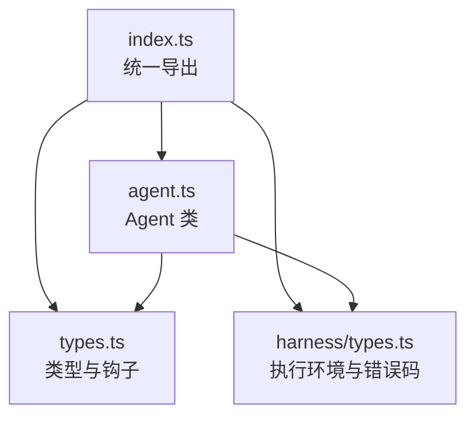
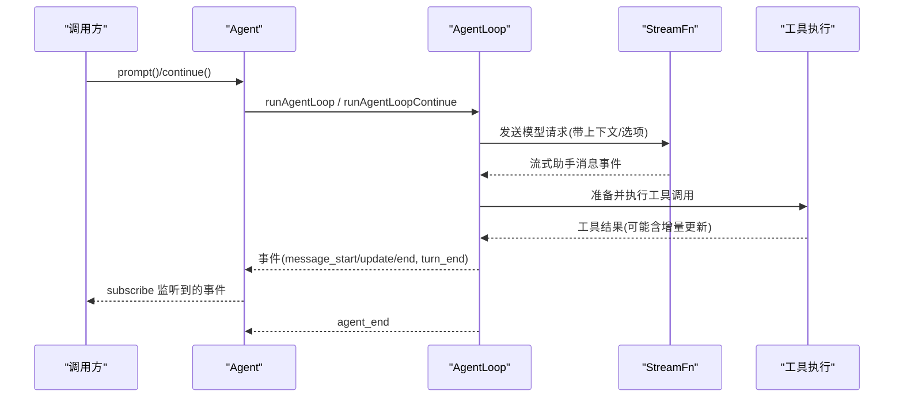
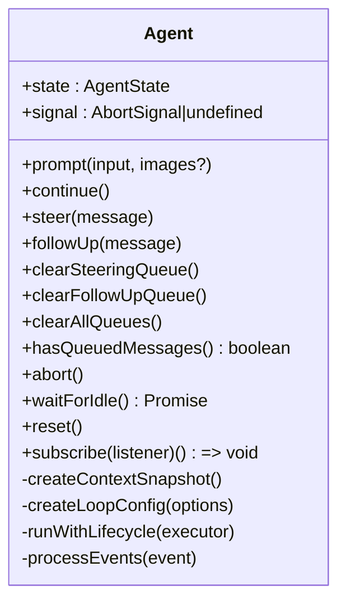
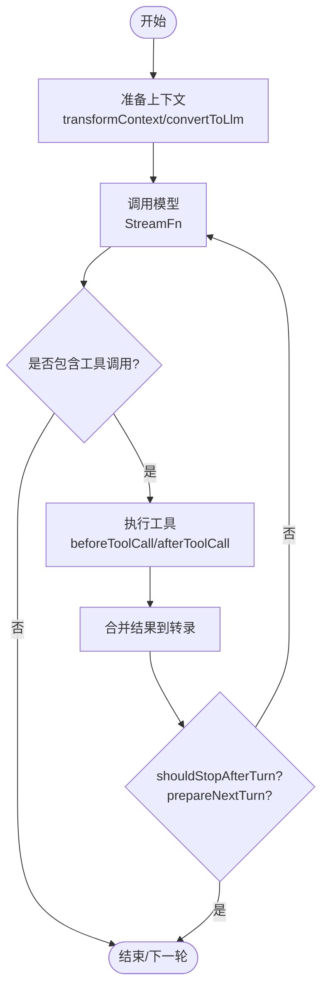
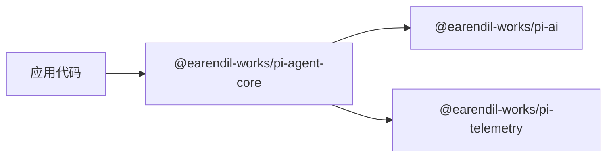

# API 参考

<cite>
**本文引用的文件**
- [packages/agent/src/index.ts](file://packages/agent/src/index.ts)
- [packages/agent/src/agent.ts](file://packages/agent/src/agent.ts)
- [packages/agent/src/types.ts](file://packages/agent/src/types.ts)
- [packages/agent/package.json](file://packages/agent/package.json)
- [packages/agent/src/harness/types.ts](file://packages/agent/src/harness/types.ts)
</cite>

## 目录
1. [简介](#简介)
2. [项目结构](#项目结构)
3. [核心组件](#核心组件)
4. [架构总览](#架构总览)
5. [详细组件分析](#详细组件分析)
6. [依赖关系分析](#依赖关系分析)
7. [性能考虑](#性能考虑)
8. [故障排除指南](#故障排除指南)
9. [结论](#结论)
10. [附录](#附录)

## 简介
本参考文档面向代理核心 API，聚焦于 @earendil-works/pi-agent-core 的公共接口与类型定义。内容涵盖类、方法、属性、事件、参数与返回值、异常处理、异步与回调模式、错误码、版本兼容性与迁移建议、最佳实践与常见陷阱等。读者可据此快速集成 Agent 运行时、管理会话状态、编排工具调用、订阅事件流并实现自定义上下文转换与策略控制。

## 项目结构
- 包入口导出集中在 index.ts，统一暴露 Agent、循环函数、Harness、压缩摘要、消息与提示模板、遥测、工具、流默认设置与类型等。
- 核心运行时由 agent.ts 中的 Agent 类驱动，封装了状态、队列、生命周期、事件分发与运行控制。
- 类型定义集中于 types.ts，包括 AgentMessage、AgentState、AgentTool、AgentEvent、工具执行模式、钩子上下文等。
- Harness 相关能力（文件系统、Shell、执行环境、错误码）在 harness/types.ts 中定义。



图表来源
- [packages/agent/src/index.ts:1-146](file://packages/agent/src/index.ts#L1-L146)
- [packages/agent/src/agent.ts:1-593](file://packages/agent/src/agent.ts#L1-L593)
- [packages/agent/src/types.ts:1-444](file://packages/agent/src/types.ts#L1-L444)
- [packages/agent/src/harness/types.ts:1-316](file://packages/agent/src/harness/types.ts#L1-L316)

章节来源
- [packages/agent/src/index.ts:1-146](file://packages/agent/src/index.ts#L1-L146)

## 核心组件
- Agent：有状态的代理运行时包装器，负责维护对话转录、工具执行、事件发射、队列注入（引导/后续消息）、中止与空闲等待。
- AgentLoop 配置与钩子：convertToLlm、transformContext、getApiKey、shouldStopAfterTurn、prepareNextTurn、beforeToolCall、afterToolCall、toolExecution 等。
- 事件系统：agent_start/agent_end、turn_start/turn_end、message_start/message_update/message_end、tool_execution_start/update/end。
- 工具模型：AgentTool 扩展标准 Tool，支持 prepareArguments、execute、executionMode 与增量更新回调。
- Harness 执行环境：FileSystem、Shell、ExecutionEnv 以及统一的 Result 模式与错误码。

章节来源
- [packages/agent/src/agent.ts:97-238](file://packages/agent/src/agent.ts#L97-L238)
- [packages/agent/src/types.ts:149-293](file://packages/agent/src/types.ts#L149-L293)
- [packages/agent/src/types.ts:320-444](file://packages/agent/src/types.ts#L320-L444)
- [packages/agent/src/harness/types.ts:5-316](file://packages/agent/src/harness/types.ts#L5-L316)

## 架构总览
Agent 通过 StreamFn 与底层 LLM 交互，按轮次推进：准备上下文 -> 调用模型 -> 解析工具调用 -> 执行工具 -> 合并结果 -> 下一轮或结束。期间通过事件向外部 UI/日志系统推送进度。



图表来源
- [packages/agent/src/agent.ts:347-435](file://packages/agent/src/agent.ts#L347-L435)
- [packages/agent/src/types.ts:17-32](file://packages/agent/src/types.ts#L17-L32)
- [packages/agent/src/types.ts:421-444](file://packages/agent/src/types.ts#L421-L444)

## 详细组件分析

### Agent 类
- 构造选项 AgentOptions：包含 initialState、convertToLlm、transformContext、streamFn、getApiKey、onPayload/onResponse、beforeToolCall/afterToolCall、shouldStopAfterTurn、prepareNextTurn/prepareNextTurnWithContext、steering/followUp 队列模式、sessionId、thinkingBudgets、transport、maxRetryDelayMs、toolExecution。
- 状态访问 state：systemPrompt、model、thinkingLevel、tools/messages（赋值时拷贝顶层数组）、isStreaming、streamingMessage、pendingToolCalls、errorMessage。
- 队列与注入：steer/followUp/clearSteeringQueue/clearFollowUpQueue/clearAllQueues/hasQueuedMessages；队列模式 QueueMode 控制“全部”或“逐个”注入。
- 运行控制：prompt（支持字符串+图片、单条或多条消息）、continue（从当前转录继续）、abort、waitForIdle、reset。
- 生命周期与事件：subscribe 订阅事件；内部 processEvents 将事件写入状态并依次 await 所有监听器；handleRunFailure 将失败编码为正常事件序列。
- 工具执行模式：toolExecution 支持 sequential/parallel，可在工具级别覆盖 executionMode。



图表来源
- [packages/agent/src/agent.ts:173-330](file://packages/agent/src/agent.ts#L173-L330)
- [packages/agent/src/agent.ts:347-593](file://packages/agent/src/agent.ts#L347-L593)

章节来源
- [packages/agent/src/agent.ts:97-238](file://packages/agent/src/agent.ts#L97-L238)
- [packages/agent/src/agent.ts:240-330](file://packages/agent/src/agent.ts#L240-L330)
- [packages/agent/src/agent.ts:347-593](file://packages/agent/src/agent.ts#L347-L593)

### 类型与钩子
- StreamFn：代理循环使用的流函数契约，必须返回助手消息事件流，失败以 stopReason 与 errorMessage 编码。
- AgentLoopConfig：包含 convertToLlm、transformContext、getApiKey、shouldStopAfterTurn、prepareNextTurn、getSteeringMessages、getFollowUpMessages、toolExecution、beforeToolCall、afterToolCall 等。
- AgentMessage/AgentState：消息联合与公开状态，含 systemPrompt、model、thinkingLevel、tools/messages、isStreaming/streamingMessage/pendingToolCalls/errorMessage。
- AgentTool：扩展标准 Tool，增加 label、prepareArguments、execute（支持 AbortSignal 与 onUpdate 增量回调）、executionMode。
- AgentEvent：完整的事件集合，覆盖代理/回合/消息/工具执行生命周期。



图表来源
- [packages/agent/src/types.ts:17-32](file://packages/agent/src/types.ts#L17-L32)
- [packages/agent/src/types.ts:149-293](file://packages/agent/src/types.ts#L149-L293)
- [packages/agent/src/types.ts:320-444](file://packages/agent/src/types.ts#L320-L444)

章节来源
- [packages/agent/src/types.ts:17-32](file://packages/agent/src/types.ts#L17-L32)
- [packages/agent/src/types.ts:149-293](file://packages/agent/src/types.ts#L149-L293)
- [packages/agent/src/types.ts:320-444](file://packages/agent/src/types.ts#L320-L444)

### Harness 执行环境与错误
- Result 模式：ok/err/getOrThrow/getOrUndefined/toError，用于显式错误传播。
- FileSystem/Shell/ExecutionEnv：跨后端的文件与进程执行抽象，所有操作返回 Result，禁止抛出异常。
- 错误码：FileErrorCode、ExecutionErrorCode、CompactionErrorCode、BranchSummaryErrorCode，对应 FileError、ExecutionError、CompactionError、BranchSummaryError。

```mermaid
classDiagram
class FileSystem {
+cwd string
+absolutePath(path, signal?) Result<string, FileError>
+readTextFile(path, signal?) Result<string, FileError>
+writeFile(path, content, signal?) Result<void, FileError>
+listDir(path, signal?) Result<FileInfo[], FileError>
+exists(path, signal?) Result<boolean, FileError>
+cleanup() Promise<void>
}
class Shell {
+exec(command, options?) Result<{stdout,string;stderr,string;exitCode,number}, ExecutionError>
+cleanup() Promise<void>
}
class ExecutionEnv {
}
FileSystem <|-- ExecutionEnv
Shell <|-- ExecutionEnv
```

图表来源
- [packages/agent/src/harness/types.ts:128-316](file://packages/agent/src/harness/types.ts#L128-L316)

章节来源
- [packages/agent/src/harness/types.ts:5-316](file://packages/agent/src/harness/types.ts#L5-L316)

## 依赖关系分析
- Agent 依赖 pi-ai 的 Model/Message/Transport 等类型与流式接口。
- Agent 通过 StreamFn 与 LLM 提供商解耦，支持 transport、metadata、cacheRetention、timeout、retries 等请求级选项。
- 包导出将 Agent、循环函数、Harness、压缩摘要、消息与提示模板、遥测、工具、流默认设置与类型统一暴露，便于上层应用按需引入。



图表来源
- [packages/agent/package.json:37-44](file://packages/agent/package.json#L37-L44)
- [packages/agent/src/index.ts:1-146](file://packages/agent/src/index.ts#L1-L146)

章节来源
- [packages/agent/package.json:1-69](file://packages/agent/package.json#L1-L69)
- [packages/agent/src/index.ts:1-146](file://packages/agent/src/index.ts#L1-L146)

## 性能考虑
- 工具执行模式：
  - parallel：预检工具调用顺序执行，随后允许的工具并发执行；tool_execution_end 按完成顺序发出，工具结果消息按助手源顺序稍后发出。适合 I/O 密集型工具。
  - sequential：严格串行执行，保证强顺序与资源独占。
- 上下文窗口管理：使用 transformContext 进行裁剪/压缩，避免超出模型上下文限制；配合 shouldStopAfterTurn 在接近上限前优雅退出。
- 重试与超时：通过 SimpleStreamOptions 的 maxRetries、maxRetryDelayMs、timeoutMs 控制请求级行为，避免雪崩。
- 流式处理：优先使用 message_update 增量渲染，减少重绘与内存占用。
- 队列模式：steering/followUp 队列采用 one-at-a-time 或 all，根据场景选择以避免突发注入导致上下文膨胀。

[本节为通用指导，不直接分析具体文件]

## 故障排除指南
- 常见错误与原因
  - 重复运行：同时调用 prompt/continue 或在运行中 reset 会抛出错误。应在 waitForIdle 后再重置或发起新运行。
  - 无法继续：当最后一条消息角色为 assistant 时，不能直接 continue；需先处理工具结果或注入 steer/followUp。
  - 工具被阻止：beforeToolCall 返回 block:true 会生成错误工具结果并可携带 terminate 提示提前终止批次。
  - 上下文过大：应启用 transformContext 裁剪历史消息，或使用 shouldStopAfterTurn 主动停止。
- 事件定位问题
  - 使用 subscribe 监听 agent_end 确认一轮完全结束；注意 awaited 监听器完成后才视为空闲。
  - tool_execution_start/update/end 可用于追踪工具执行进度与错误。
- 错误码与异常
  - 文件系统/执行/压缩/分支摘要错误均通过 Result 与特定 Error 子类返回，包含稳定 code 字段，便于分类处理。
  - 流式失败通过助手消息的 stopReason="error"/"aborted" 与 errorMessage 传递。

章节来源
- [packages/agent/src/agent.ts:332-388](file://packages/agent/src/agent.ts#L332-L388)
- [packages/agent/src/types.ts:55-95](file://packages/agent/src/types.ts#L55-L95)
- [packages/agent/src/types.ts:421-444](file://packages/agent/src/types.ts#L421-L444)
- [packages/agent/src/harness/types.ts:128-206](file://packages/agent/src/harness/types.ts#L128-L206)

## 结论
Agent 核心 API 提供了高内聚的代理运行时，围绕事件驱动的流式交互、可扩展的工具执行与灵活的上下文控制，满足复杂多步任务编排需求。通过合理的工具执行模式、上下文管理与请求级选项，可以在保证正确性的同时获得良好性能与可观测性。

[本节为总结性内容，不直接分析具体文件]

## 附录

### 公共 API 速查（方法与签名要点）
- Agent
  - constructor(options: AgentOptions)
  - get state(): AgentState
  - prompt(input: string | AgentMessage | AgentMessage[], images?: ImageContent[]): Promise<void>
  - continue(): Promise<void>
  - steer(message: AgentMessage): void
  - followUp(message: AgentMessage): void
  - clearSteeringQueue(): void
  - clearFollowUpQueue(): void
  - clearAllQueues(): void
  - hasQueuedMessages(): boolean
  - abort(): void
  - waitForIdle(): Promise<void>
  - reset(): void
  - subscribe(listener): () => void
  - get signal(): AbortSignal | undefined

- 类型与钩子
  - StreamFn(model, context, options?): AssistantMessageEventStream | Promise<...>
  - AgentLoopConfig：包含 convertToLlm、transformContext、getApiKey、shouldStopAfterTurn、prepareNextTurn、getSteeringMessages、getFollowUpMessages、toolExecution、beforeToolCall、afterToolCall
  - AgentTool<TParameters, TDetails>：label、prepareArguments、execute(toolCallId, params, signal?, onUpdate?)、executionMode?
  - AgentEvent：agent_start/agent_end、turn_start/turn_end、message_start/message_update/message_end、tool_execution_start/update/end

- Harness
  - FileSystem/Shell/ExecutionEnv：所有方法返回 Result<T, E>，禁止抛错
  - 错误码：FileErrorCode、ExecutionErrorCode、CompactionErrorCode、BranchSummaryErrorCode

章节来源
- [packages/agent/src/agent.ts:97-238](file://packages/agent/src/agent.ts#L97-L238)
- [packages/agent/src/agent.ts:347-593](file://packages/agent/src/agent.ts#L347-L593)
- [packages/agent/src/types.ts:149-293](file://packages/agent/src/types.ts#L149-L293)
- [packages/agent/src/types.ts:320-444](file://packages/agent/src/types.ts#L320-L444)
- [packages/agent/src/harness/types.ts:5-316](file://packages/agent/src/harness/types.ts#L5-L316)

### 版本与兼容性
- 包名与版本：@earendil-works/pi-agent-core，当前版本见 package.json。
- 引擎要求：Node.js >= 22.19.0。
- 向后兼容：Agent 构造函数对旧版编译产物做了兼容处理（options 或 streamFn 缺失时的回退）。
- 导出路径：主入口、node 入口、session/testing 测试入口分别提供类型与模块导出。

章节来源
- [packages/agent/package.json:1-22](file://packages/agent/package.json#L1-L22)
- [packages/agent/package.json:59-61](file://packages/agent/package.json#L59-L61)
- [packages/agent/src/agent.ts:216-223](file://packages/agent/src/agent.ts#L216-L223)

### 异步与回调模式
- 流式事件：通过 subscribe 接收 agent/turn/message/tool 事件，监听器可返回 Promise，将在当前运行中按序 await。
- 工具增量更新：execute 的 onUpdate 回调用于在工具执行过程中推送部分结果。
- 中止信号：所有关键钩子与 execute 均可接收 AbortSignal，需主动检查并优雅退出。

章节来源
- [packages/agent/src/agent.ts:240-253](file://packages/agent/src/agent.ts#L240-L253)
- [packages/agent/src/types.ts:377-409](file://packages/agent/src/types.ts#L377-L409)
- [packages/agent/src/types.ts:270-293](file://packages/agent/src/types.ts#L270-L293)

### 最佳实践与常见陷阱
- 始终使用 transformContext 管理上下文大小，避免超出模型限制。
- 合理选择 toolExecution：I/O 密集用 parallel，强顺序/互斥用 sequential。
- 使用 shouldStopAfterTurn 在接近上下文上限或业务条件满足时优雅退出。
- 通过 beforeToolCall/afterToolCall 实现权限校验、审计与结果改写。
- 避免在运行中调用 reset 或再次 prompt/continue，应先 waitForIdle。
- 使用 Result 模式处理文件系统/执行错误，不要抛异常。
- 利用 steering/followUp 队列控制消息注入时机与数量，防止上下文爆炸。

[本节为通用指导，不直接分析具体文件]