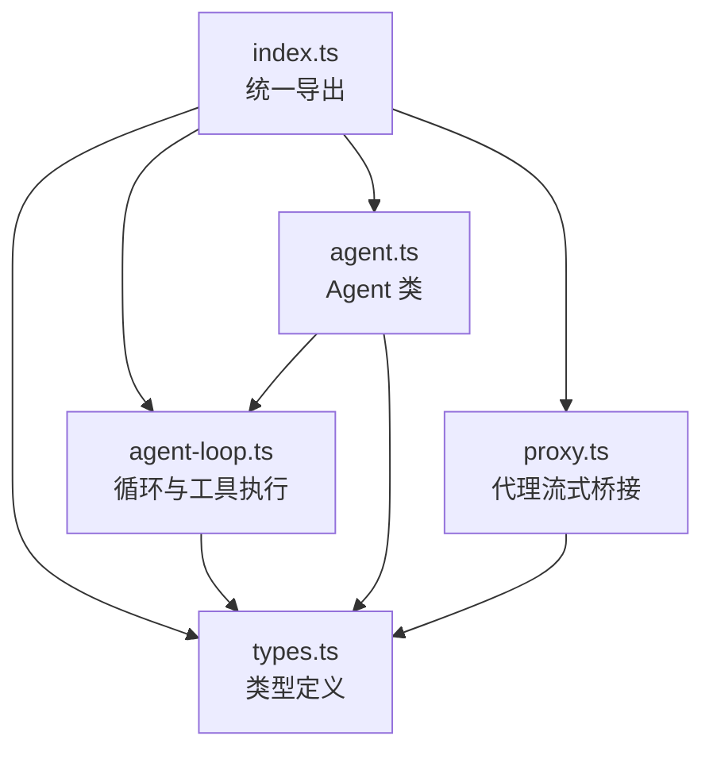
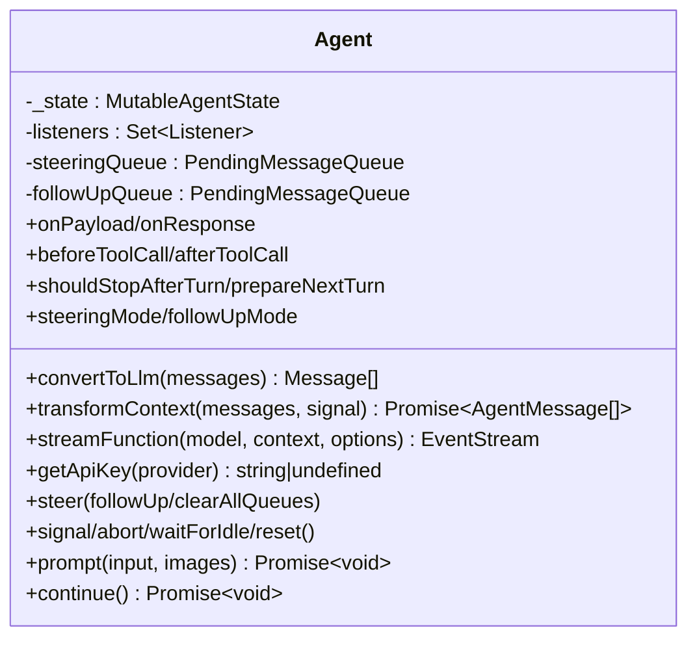
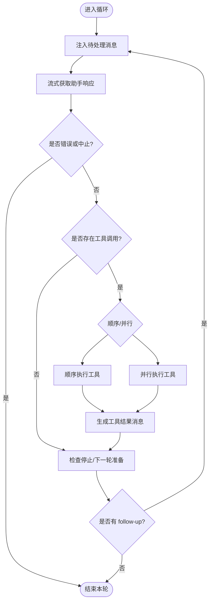
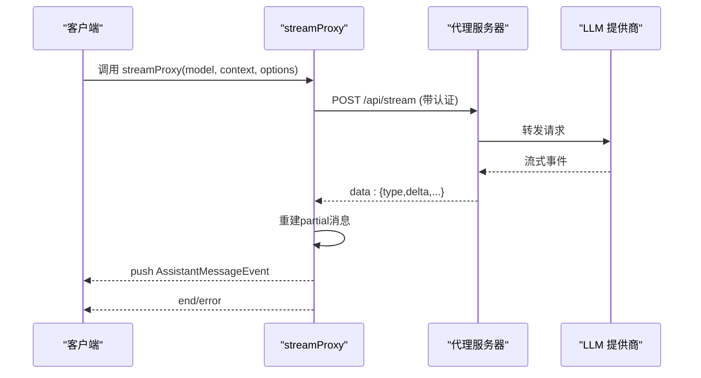
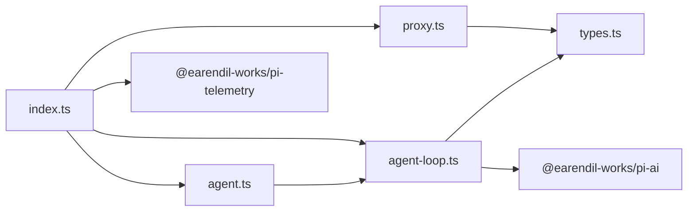

# 代理核心

<cite>
**本文引用的文件**
- [packages/agent/src/index.ts](file://packages/agent/src/index.ts)
- [packages/agent/src/agent.ts](file://packages/agent/src/agent.ts)
- [packages/agent/src/agent-loop.ts](file://packages/agent/src/agent-loop.ts)
- [packages/agent/src/types.ts](file://packages/agent/src/types.ts)
- [packages/agent/src/proxy.ts](file://packages/agent/src/proxy.ts)
- [packages/agent/package.json](file://packages/agent/package.json)
</cite>

## 目录
1. [简介](#简介)
2. [项目结构](#项目结构)
3. [核心组件](#核心组件)
4. [架构总览](#架构总览)
5. [详细组件分析](#详细组件分析)
6. [依赖关系分析](#依赖关系分析)
7. [性能考量](#性能考量)
8. [故障排查指南](#故障排查指南)
9. [结论](#结论)
10. [附录：API 参考与集成示例](#附录api-参考与集成示例)

## 简介
本文件为“代理核心”模块的权威技术文档，聚焦于代理运行时的实现原理与使用方式。内容涵盖：
- 状态管理机制、工具调用框架、生命周期管理
- 代理实例的创建、配置与执行流程
- 内置工具系统的设计与扩展点（文件系统、命令执行、网络请求等）
- 会话管理的核心概念：上下文维护、历史管理、分支摘要
- 完整 API 参考与编程式集成示例
- 错误处理策略、重试机制与性能优化技巧

该模块提供通用代理运行时，具备传输抽象、状态管理与附件支持，并通过流式事件驱动模型完成多轮对话与工具调用。

## 项目结构
代理核心位于 packages/agent，主要入口与职责如下：
- index.ts：统一导出公共 API（Agent、循环函数、工具、压缩与分支摘要、遥测、类型等）
- agent.ts：Agent 类封装状态、队列、生命周期与高层接口（prompt/continue/steer/followUp）
- agent-loop.ts：低层循环实现，负责消息转换、LLM 流式调用、工具准备与执行、事件派发
- types.ts：核心类型定义（AgentMessage、AgentTool、AgentLoopConfig、工具执行模式、队列模式等）
- proxy.ts：通过服务端代理进行 LLM 调用的流式桥接实现
- package.json：包元数据与导出路径



图表来源
- [packages/agent/src/index.ts:1-146](file://packages/agent/src/index.ts#L1-L146)
- [packages/agent/src/agent.ts:1-593](file://packages/agent/src/agent.ts#L1-L593)
- [packages/agent/src/agent-loop.ts:1-797](file://packages/agent/src/agent-loop.ts#L1-L797)
- [packages/agent/src/types.ts:1-444](file://packages/agent/src/types.ts#L1-L444)
- [packages/agent/src/proxy.ts:1-371](file://packages/agent/src/proxy.ts#L1-L371)

章节来源
- [packages/agent/src/index.ts:1-146](file://packages/agent/src/index.ts#L1-L146)
- [packages/agent/package.json:1-69](file://packages/agent/package.json#L1-L69)

## 核心组件
- Agent 类：封装状态、队列、生命周期与高层交互（prompt/continue/steer/followUp），订阅事件并驱动循环
- 代理循环：将 AgentMessage 转换为 LLM 可理解的 Message，流式获取响应，执行工具调用，派发事件
- 工具系统：基于 ToolSchema 的参数校验、before/after 钩子、顺序/并行执行模式、增量更新回调
- 代理流式桥接：通过服务端代理转发 LLM 请求，重建部分消息以节省带宽
- 会话与压缩：上下文转换、历史管理、分支摘要与上下文压缩能力（由 harness 暴露）

章节来源
- [packages/agent/src/agent.ts:1-593](file://packages/agent/src/agent.ts#L1-L593)
- [packages/agent/src/agent-loop.ts:1-797](file://packages/agent/src/agent-loop.ts#L1-L797)
- [packages/agent/src/types.ts:1-444](file://packages/agent/src/types.ts#L1-L444)
- [packages/agent/src/proxy.ts:1-371](file://packages/agent/src/proxy.ts#L1-L371)
- [packages/agent/src/index.ts:1-146](file://packages/agent/src/index.ts#L1-L146)

## 架构总览
代理核心采用“高层 Agent + 低层循环 + 工具框架 + 可选代理流”的分层架构。Agent 持有状态与队列，调用循环执行；循环负责消息转换、LLM 流式调用、工具准备与执行、事件派发；工具框架提供参数校验、钩子与执行模式；代理流用于通过服务端中转 LLM 请求。

```mermaid
sequenceDiagram
participant App as "应用"
participant Agent as "Agent"
participant Loop as "代理循环"
participant Stream as "流式函数(默认或代理)"
participant Provider as "LLM 提供商"
participant Tools as "工具集合"
App->>Agent : prompt()/continue()
Agent->>Loop : runAgentLoop()/runAgentLoopContinue()
Loop->>Stream : stream(model, context, options)
Stream->>Provider : 发起流式请求
Provider-->>Stream : 文本/思考/工具调用增量
Stream-->>Loop : AssistantMessageEvent 流
Loop->>Loop : 转换/追加到上下文
Loop->>Tools : 准备并执行工具(顺序/并行)
Tools-->>Loop : 工具结果(含usage/details)
Loop-->>Agent : 事件(message_start/update/end, turn_end, agent_end)
Agent-->>App : subscribe 监听事件
```

图表来源
- [packages/agent/src/agent.ts:167-593](file://packages/agent/src/agent.ts#L167-L593)
- [packages/agent/src/agent-loop.ts:95-275](file://packages/agent/src/agent-loop.ts#L95-L275)
- [packages/agent/src/proxy.ts:118-235](file://packages/agent/src/proxy.ts#L118-L235)

## 详细组件分析

### Agent 类与生命周期
- 状态管理：维护 systemPrompt、model、thinkingLevel、tools、messages、isStreaming、streamingMessage、pendingToolCalls、errorMessage
- 队列控制：steeringQueue 与 followUpQueue，支持 all 与 one-at-a-time 两种排空模式
- 生命周期：
  - prompt：标准化输入，启动新轮次
  - continue：从当前上下文继续，自动处理 steering/follow-up 队列
  - steer/followUp：注入后续消息
  - abort/waitForIdle/reset：中断、等待空闲、重置
- 事件订阅：subscribe 返回取消函数，事件包含 message/turn/agent 生命周期与工具执行事件



图表来源
- [packages/agent/src/agent.ts:61-593](file://packages/agent/src/agent.ts#L61-L593)

章节来源
- [packages/agent/src/agent.ts:61-593](file://packages/agent/src/agent.ts#L61-L593)

### 代理循环与工具执行
- 主循环：
  - 注入 pending messages（steering/follow-up）
  - 流式获取 assistant 响应，追加到上下文
  - 检测 toolCall，按模式执行（顺序/并行）
  - 在 turn_end 后调用 shouldStopAfterTurn/prepareNextTurn
  - 若无更多消息则结束
- 工具执行：
  - prepareToolCall：查找工具、参数预处理与校验、beforeToolCall 钩子
  - executePreparedToolCall：执行工具，支持 onUpdate 增量事件
  - finalizeExecutedToolCall：afterToolCall 钩子合并结果，生成 toolResult 消息
  - 截断保护：当 stopReason=length 时，批量失败所有工具调用以避免执行不完整参数
- 事件派发：message_start/update/end、tool_execution_start/update/end、turn_end、agent_end



图表来源
- [packages/agent/src/agent-loop.ts:155-275](file://packages/agent/src/agent-loop.ts#L155-L275)
- [packages/agent/src/agent-loop.ts:408-554](file://packages/agent/src/agent-loop.ts#L408-L554)
- [packages/agent/src/agent-loop.ts:600-797](file://packages/agent/src/agent-loop.ts#L600-L797)

章节来源
- [packages/agent/src/agent-loop.ts:95-797](file://packages/agent/src/agent-loop.ts#L95-L797)

### 代理流式桥接（Proxy）
- 用途：将 LLM 请求路由至服务端，服务端鉴权并代理到提供商，减少客户端带宽
- 工作方式：
  - 构造请求体（model/context/options），携带 authToken 与 proxyUrl
  - 读取服务端 SSE-like 流，解析 data: JSON 行
  - 本地重建 partial AssistantMessage，映射 text/thinking/toolcall 增量
  - 异常与中止：根据信号与响应状态抛出错误，最终输出 error/done 事件
- 适用场景：需要集中鉴权、审计或缓存的服务端架构



图表来源
- [packages/agent/src/proxy.ts:118-235](file://packages/agent/src/proxy.ts#L118-L235)
- [packages/agent/src/proxy.ts:240-371](file://packages/agent/src/proxy.ts#L240-L371)

章节来源
- [packages/agent/src/proxy.ts:1-371](file://packages/agent/src/proxy.ts#L1-L371)

### 会话管理：上下文、历史与分支摘要
- 上下文维护：
  - transformContext：在进入 LLM 前对 AgentMessage[] 做裁剪/注入
  - convertToLlm：将 AgentMessage[] 转为 LLM 可识别的 Message[]
- 历史管理：
  - 每次 message_start/update/end 都会更新上下文中的 partial/final 消息
  - toolResult 消息作为独立条目追加，保持可追溯性
- 分支摘要与压缩：
  - 通过 harness 暴露的 compaction 与 branch-summarization 能力，支持上下文压缩与分支摘要生成
  - 可在 shouldStopAfterTurn/prepareNextTurn 中结合 token 估算与阈值触发压缩

章节来源
- [packages/agent/src/types.ts:149-257](file://packages/agent/src/types.ts#L149-L257)
- [packages/agent/src/agent-loop.ts:281-372](file://packages/agent/src/agent-loop.ts#L281-L372)
- [packages/agent/src/index.ts:47-83](file://packages/agent/src/index.ts#L47-L83)

### 工具系统设计与使用
- 工具定义：
  - 名称、描述、schema（TypeBox）、label、prepareArguments（可选）、execute（必需）、executionMode（可选）
- 执行流程：
  - 参数预处理与校验
  - beforeToolCall：可阻止执行并标记 terminate
  - 执行：支持 onUpdate 增量回调
  - afterToolCall：可覆盖 content/details/isError/usage/terminate
- 执行模式：
  - sequential：逐个执行，适合有副作用或需严格顺序的工具
  - parallel：预检后并发执行，tool_execution_end 按完成顺序发出，tool-result 消息按源顺序追加
- 内置工具扩展点：
  - 文件系统操作、命令执行、网络请求等可通过自定义工具接入
  - 工具结果可携带 usage 与 details，便于日志与 UI 渲染

章节来源
- [packages/agent/src/types.ts:360-409](file://packages/agent/src/types.ts#L360-L409)
- [packages/agent/src/agent-loop.ts:408-797](file://packages/agent/src/agent-loop.ts#L408-L797)

## 依赖关系分析
- 内部依赖：
  - agent.ts 依赖 agent-loop.ts、types.ts、stream-fn.ts
  - agent-loop.ts 依赖 types.ts、@earendil-works/pi-ai（消息/工具/流式协议）
  - proxy.ts 依赖 @earendil-works/pi-ai（流式事件与工具调用类型）
  - index.ts 聚合导出所有公共能力
- 外部依赖：
  - @earendil-works/pi-ai：统一 LLM 抽象、消息与工具协议
  - @earendil-works/pi-telemetry：遥测类型与上下文
  - typebox/yaml/diff/ignore：类型校验、序列化与差异计算



图表来源
- [packages/agent/src/agent.ts:1-593](file://packages/agent/src/agent.ts#L1-L593)
- [packages/agent/src/agent-loop.ts:1-797](file://packages/agent/src/agent-loop.ts#L1-L797)
- [packages/agent/src/proxy.ts:1-371](file://packages/agent/src/proxy.ts#L1-L371)
- [packages/agent/src/index.ts:1-146](file://packages/agent/src/index.ts#L1-L146)

章节来源
- [packages/agent/package.json:37-44](file://packages/agent/package.json#L37-L44)
- [packages/agent/src/index.ts:1-146](file://packages/agent/src/index.ts#L1-L146)

## 性能考量
- 工具执行模式选择：
  - 并行模式提升吞吐，但需注意工具间依赖与副作用隔离
  - 顺序模式保证严格顺序，适合强依赖或资源竞争场景
- 上下文转换与压缩：
  - 使用 transformContext 在每轮前裁剪历史，避免超出上下文窗口
  - 结合 estimateTokens/compact/branch summarization 控制成本与延迟
- 流式处理：
  - 利用 message_update 增量渲染 UI，降低首屏延迟
  - 代理流式桥接可减少带宽占用，适合移动端或弱网环境
- 重试与超时：
  - 通过 maxRetryDelayMs 限制提供商重试延迟
  - 使用 AbortSignal 及时中断长时间任务
- 事件批处理：
  - tool_execution_end 与 tool-result 消息分离，UI 可按需消费

[本节为通用指导，不直接分析具体文件]

## 故障排查指南
- 常见错误与定位：
  - “Cannot continue from message role: assistant”：需在 user/toolResult 结尾继续
  - “Tool not found”：检查 tools 列表与工具名匹配
  - “Operation aborted”：检查 AbortSignal 是否被触发
  - “Response hit output token limit”：工具参数可能截断，需让模型重新发起
- 调试建议：
  - 订阅 agent 事件，观察 message/turn/agent 生命周期
  - 在 beforeToolCall/afterToolCall 中记录 args/result 与耗时
  - 使用 transformContext/convertToLlm 打印中间消息，确认上下文正确性
- 恢复策略：
  - 遇到错误时，可将 errorMessage 写入 state，提示用户重试
  - 对于可恢复的网络错误，结合 shouldStopAfterTurn 与 prepareNextTurn 调整策略

章节来源
- [packages/agent/src/agent-loop.ts:120-143](file://packages/agent/src/agent-loop.ts#L120-L143)
- [packages/agent/src/agent-loop.ts:374-406](file://packages/agent/src/agent-loop.ts#L374-L406)
- [packages/agent/src/agent-loop.ts:600-668](file://packages/agent/src/agent-loop.ts#L600-L668)
- [packages/agent/src/agent.ts:511-527](file://packages/agent/src/agent.ts#L511-L527)

## 结论
代理核心提供了稳定、可扩展的代理运行时，具备完善的工具调用框架、流式事件驱动、灵活的上下文与历史管理，以及可选的服务端代理桥接。通过 Agent 的高层 API 与循环的低层控制点，开发者可以构建高性能、可观测、易维护的智能代理应用。

[本节为总结，不直接分析具体文件]

## 附录：API 参考与集成示例

### 公共导出概览
- Agent、循环函数、工具、压缩与分支摘要、遥测、类型与工具集等均在 index.ts 统一导出

章节来源
- [packages/agent/src/index.ts:1-146](file://packages/agent/src/index.ts#L1-L146)

### Agent 关键 API
- 构造选项：initialState、convertToLlm、transformContext、streamFn、getApiKey、onPayload/onResponse、beforeToolCall/afterToolCall、shouldStopAfterTurn、prepareNextTurn、steeringMode/followUpMode、sessionId、thinkingBudgets、transport、maxRetryDelayMs、toolExecution
- 方法：
  - prompt(input|messages, images?)：开始新轮次
  - continue()：从当前上下文继续
  - steer()/followUp()：注入后续消息
  - clearSteeringQueue()/clearFollowUpQueue()/clearAllQueues()：清理队列
  - hasQueuedMessages()：检查队列
  - signal/abort/waitForIdle/reset()：生命周期控制
  - subscribe(listener)：订阅事件

章节来源
- [packages/agent/src/agent.ts:97-358](file://packages/agent/src/agent.ts#L97-L358)
- [packages/agent/src/agent.ts:359-593](file://packages/agent/src/agent.ts#L359-L593)

### 工具定义与执行
- 工具接口：name、description、schema、label、prepareArguments、execute、executionMode
- 执行模式：sequential/parallel
- 钩子：beforeToolCall（可阻止并终止批次）、afterToolCall（可覆盖结果字段）
- 增量更新：execute 的 onUpdate 回调

章节来源
- [packages/agent/src/types.ts:360-409](file://packages/agent/src/types.ts#L360-L409)
- [packages/agent/src/agent-loop.ts:600-797](file://packages/agent/src/agent-loop.ts#L600-L797)

### 代理流式桥接
- 使用 streamProxy 作为 streamFn，传入 authToken 与 proxyUrl
- 适用于需要通过服务端鉴权与转发的场景

章节来源
- [packages/agent/src/proxy.ts:83-116](file://packages/agent/src/proxy.ts#L83-L116)
- [packages/agent/src/proxy.ts:118-235](file://packages/agent/src/proxy.ts#L118-L235)

### 编程式集成示例（步骤说明）
- 创建 Agent：
  - 设置 model、systemPrompt、thinkingLevel、tools
  - 配置 streamFn（默认或代理）、getApiKey、onPayload/onResponse
  - 配置 beforeToolCall/afterToolCall、shouldStopAfterTurn、prepareNextTurn
- 启动与继续：
  - 调用 prompt 发送用户消息或消息数组
  - 调用 continue 继续执行
- 订阅事件：
  - 使用 subscribe 监听 message/turn/agent 生命周期与工具执行事件
- 队列控制：
  - 使用 steer/followUp 注入后续消息，控制排空模式
- 代理模式：
  - 使用 streamProxy 替换默认流式函数，传入认证与服务端地址

[本节为步骤说明，不直接展示代码内容]

### 错误处理与重试
- 错误传播：
  - 工具执行抛错会被捕获并转化为错误工具结果
  - 流式错误会生成带有 stopReason="error"/"aborted" 的消息
- 重试策略：
  - 通过 maxRetryDelayMs 限制提供商重试延迟
  - 在 shouldStopAfterTurn 中结合上下文大小与错误率决定是否提前停止
- 中止与清理：
  - 使用 abort 中断当前运行，reset 清理状态与队列

章节来源
- [packages/agent/src/agent-loop.ts:374-406](file://packages/agent/src/agent-loop.ts#L374-L406)
- [packages/agent/src/agent-loop.ts:600-668](file://packages/agent/src/agent-loop.ts#L600-L668)
- [packages/agent/src/agent.ts:511-535](file://packages/agent/src/agent.ts#L511-L535)