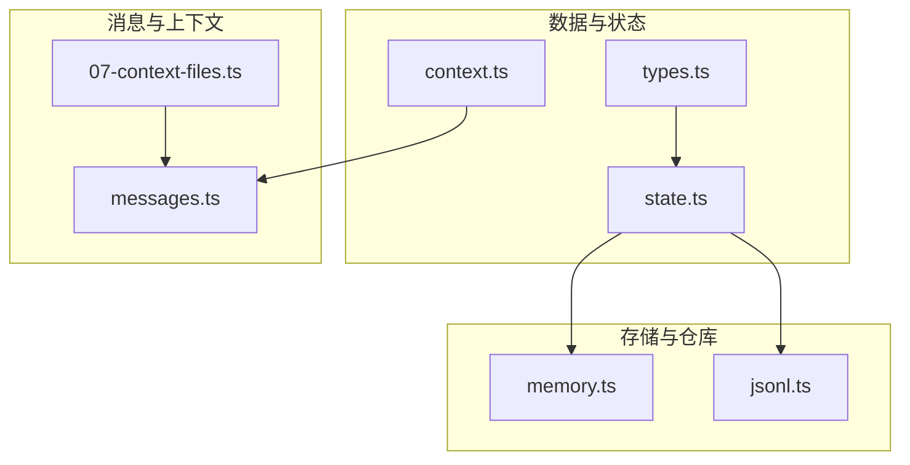
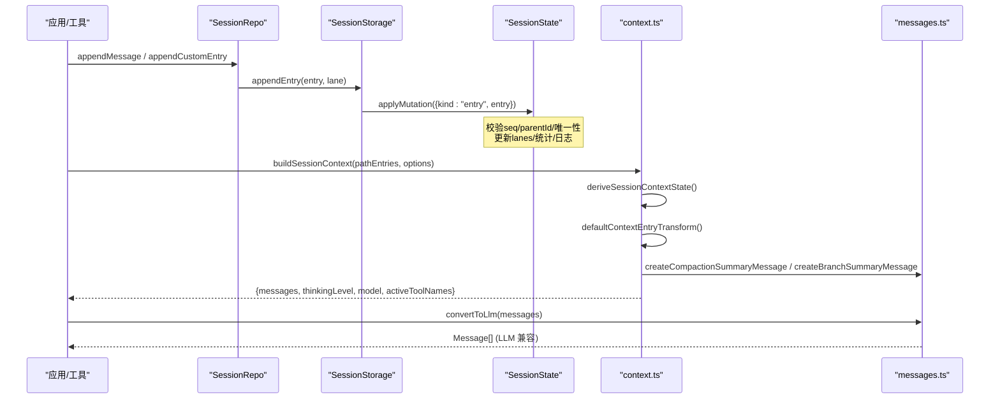
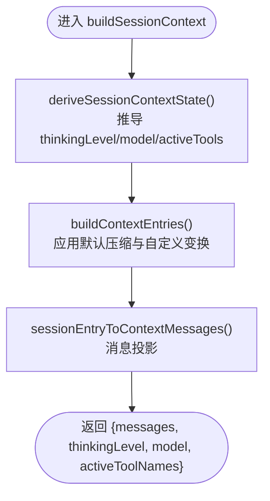
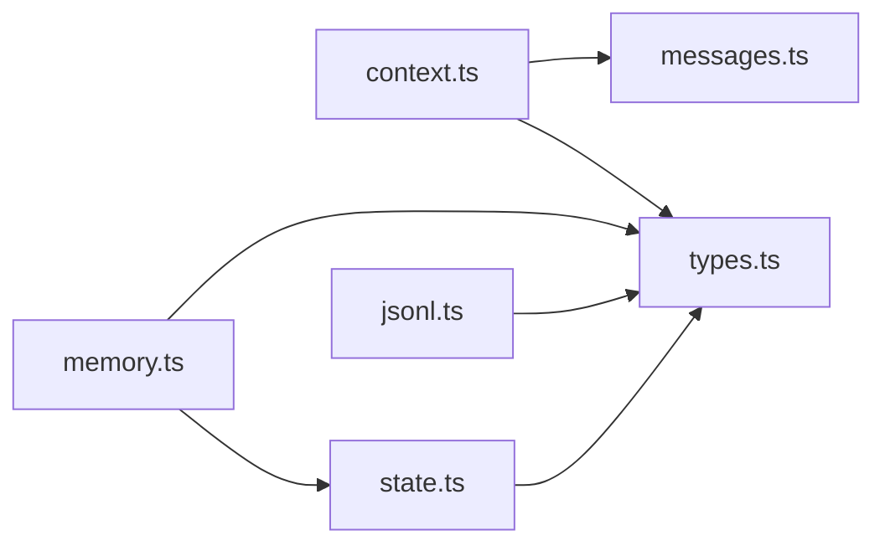

# 上下文管理

<cite>
**本文引用的文件**
- [packages/agent/src/harness/session/context.ts](file://packages/agent/src/harness/session/context.ts)
- [packages/agent/src/harness/session/types.ts](file://packages/agent/src/harness/session/types.ts)
- [packages/agent/src/harness/session/state.ts](file://packages/agent/src/harness/session/state.ts)
- [packages/agent/src/harness/session/memory.ts](file://packages/agent/src/harness/session/memory.ts)
- [packages/agent/src/harness/session/jsonl.ts](file://packages/agent/src/harness/session/jsonl.ts)
- [packages/coding-agent/src/core/messages.ts](file://packages/coding-agent/src/core/messages.ts)
- [packages/coding-agent/examples/sdk/07-context-files.ts](file://packages/coding-agent/examples/sdk/07-context-files.ts)
</cite>

## 目录
1. [简介](#简介)
2. [项目结构](#项目结构)
3. [核心组件](#核心组件)
4. [架构总览](#架构总览)
5. [详细组件分析](#详细组件分析)
6. [依赖关系分析](#依赖关系分析)
7. [性能考量](#性能考量)
8. [故障排查指南](#故障排查指南)
9. [结论](#结论)
10. [附录：API 参考](#附录api-参考)

## 简介
本文件为“上下文管理系统”的权威技术文档，聚焦于会话上下文的数据模型、构建与压缩、版本控制与变更追踪、共享与隔离策略、持久化与序列化格式，以及面向开发者的 API 参考与最佳实践。系统以“条目（Entry）”为核心原子单元，通过有向无环图（DAG）组织消息历史、工具调用、分支摘要、压缩摘要等；提供内存与 JSONL 两种存储后端；支持按分支扫描、查询与裁剪，最终构建出 LLM 可用的消息上下文。

## 项目结构
- 数据模型与状态机
  - types.ts：定义 Entry、LaneRecord、SessionStorage、SessionRepo 等核心类型与查询接口
  - state.ts：实现 SessionState，负责序列号、ID 唯一性、分支遍历、统计与分叉（fork）
  - context.ts：将 Entry 路径转换为 AgentMessage 上下文，并执行默认压缩策略
- 存储与仓库
  - memory.ts：InMemorySessionStorage / InMemorySessionRepo，基于内存的会话存储与仓库
  - jsonl.ts：导出 JSONL 仓库类型与选项，用于磁盘持久化
- 消息转换与上下文文件
  - messages.ts：扩展自定义消息类型（bashExecution、custom、branchSummary、compactionSummary），并提供 convertToLlm 转换
  - 07-context-files.ts：示例展示如何加载 AGENTS.md 作为上下文文件注入系统提示

**图表来源**
- [packages/agent/src/harness/session/types.ts:1-394](file://packages/agent/src/harness/session/types.ts#L1-L394)
- [packages/agent/src/harness/session/state.ts:1-345](file://packages/agent/src/harness/session/state.ts#L1-L345)
- [packages/agent/src/harness/session/context.ts:1-101](file://packages/agent/src/harness/session/context.ts#L1-L101)
- [packages/agent/src/harness/session/memory.ts:1-193](file://packages/agent/src/harness/session/memory.ts#L1-L193)
- [packages/agent/src/harness/session/jsonl.ts:1-10](file://packages/agent/src/harness/session/jsonl.ts#L1-L10)
- [packages/coding-agent/src/core/messages.ts:1-196](file://packages/coding-agent/src/core/messages.ts#L1-L196)
- [packages/coding-agent/examples/sdk/07-context-files.ts:1-48](file://packages/coding-agent/examples/sdk/07-context-files.ts#L1-L48)

**章节来源**
- [packages/agent/src/harness/session/types.ts:1-394](file://packages/agent/src/harness/session/types.ts#L1-L394)
- [packages/agent/src/harness/session/state.ts:1-345](file://packages/agent/src/harness/session/state.ts#L1-L345)
- [packages/agent/src/harness/session/context.ts:1-101](file://packages/agent/src/harness/session/context.ts#L1-L101)
- [packages/agent/src/harness/session/memory.ts:1-193](file://packages/agent/src/harness/session/memory.ts#L1-L193)
- [packages/agent/src/harness/session/jsonl.ts:1-10](file://packages/agent/src/harness/session/jsonl.ts#L1-L10)
- [packages/coding-agent/src/core/messages.ts:1-196](file://packages/coding-agent/src/core/messages.ts#L1-L196)
- [packages/coding-agent/examples/sdk/07-context-files.ts:1-48](file://packages/coding-agent/examples/sdk/07-context-files.ts#L1-L48)

## 核心组件
- 条目（Entry）与记录（Record）
  - Entry：消息、模型切换、思考级别切换、活跃工具切换、压缩摘要、分支摘要、自定义条目
  - Record：操作开始/结束、步骤尝试、工具调用、队列入队/取消、延迟写入、用量统计等
- 会话状态（SessionState）
  - 维护序列号、ID 唯一性、条目索引、分支指针（lane）、开放操作集合、日志与统计
  - 提供分支遍历、查询、分叉（fork）生成批量变更
- 上下文构建（buildSessionContext）
  - 从某条分支上的 Entry 路径推导会话级状态（thinkingLevel、model、activeToolNames）
  - 应用默认压缩策略（保留最近一次 compaction 及其尾部）
  - 将 Entry 映射为 AgentMessage 列表，供上层使用
- 存储后端
  - 内存后端：快速测试与演示
  - JSONL 后端：可持久化的行式存储（通过 repo 暴露）
- 消息转换
  - 将自定义消息（bashExecution、custom、branchSummary、compactionSummary）转换为 LLM 兼容的消息
  - 支持将上下文文件（如 AGENTS.md）注入系统提示

**章节来源**
- [packages/agent/src/harness/session/types.ts:14-74](file://packages/agent/src/harness/session/types.ts#L14-L74)
- [packages/agent/src/harness/session/types.ts:87-212](file://packages/agent/src/harness/session/types.ts#L87-L212)
- [packages/agent/src/harness/session/state.ts:50-180](file://packages/agent/src/harness/session/state.ts#L50-L180)
- [packages/agent/src/harness/session/context.ts:25-100](file://packages/agent/src/harness/session/context.ts#L25-L100)
- [packages/agent/src/harness/session/memory.ts:25-146](file://packages/agent/src/harness/session/memory.ts#L25-L146)
- [packages/coding-agent/src/core/messages.ts:29-196](file://packages/coding-agent/src/core/messages.ts#L29-L196)

## 架构总览
下图展示了从“会话写入”到“上下文构建”再到“LLM 消息”的整体流程，涵盖分支、压缩、摘要与消息转换。

**图表来源**
- [packages/agent/src/harness/session/memory.ts:59-89](file://packages/agent/src/harness/session/memory.ts#L59-L89)
- [packages/agent/src/harness/session/state.ts:97-180](file://packages/agent/src/harness/session/state.ts#L97-L180)
- [packages/agent/src/harness/session/context.ts:25-100](file://packages/agent/src/harness/session/context.ts#L25-L100)
- [packages/coding-agent/src/core/messages.ts:100-196](file://packages/coding-agent/src/core/messages.ts#L100-L196)

## 详细组件分析

### 数据结构与组织方式
- 条目（Entry）
  - message：用户/助手/工具结果消息
  - model_change / thinking_level_change / active_tools_change：会话级元信息变更
  - compaction：压缩摘要节点，包含 summary、retainedTail、tokensBefore、usage
  - branch_summary：分支回溯时的摘要节点
  - custom：扩展点，携带自定义类型与数据
- 记录（Record）
  - operation_started/finished：操作生命周期
  - step_attempt：助手或摘要生成步骤尝试
  - tool_started：工具调用开始
  - queue_enqueued/cancelled：任务队列
  - write_deferred：延迟写入
  - usage：用量统计（输入/缓存读写/成本）
- 分支与路径
  - 每个 lane 指向当前叶子 entry，findEntriesOnBranch 沿 parentId 回溯至根，支持 stopAtId/stopAtType 边界
- 会话状态
  - 维护 entries、entriesById、records、openOperationsByLane、lanes、log、stats、name、labels
  - 严格顺序约束：applyMutation 要求 seq 连续，保证一致性

**章节来源**
- [packages/agent/src/harness/session/types.ts:14-74](file://packages/agent/src/harness/session/types.ts#L14-L74)
- [packages/agent/src/harness/session/types.ts:87-212](file://packages/agent/src/harness/session/types.ts#L87-L212)
- [packages/agent/src/harness/session/state.ts:50-180](file://packages/agent/src/harness/session/state.ts#L50-L180)
- [packages/agent/src/harness/session/state.ts:198-215](file://packages/agent/src/harness/session/state.ts#L198-L215)
- [packages/agent/src/harness/session/state.ts:301-320](file://packages/agent/src/harness/session/state.ts#L301-L320)

### 上下文构建与压缩算法
- 默认压缩策略
  - 从路径末尾向前查找最近的 compaction 条目，将其置于最前，并仅保留其后的条目，从而大幅缩减上下文长度
- 上下文消息投影
  - message → 直接输出（排除 deferred 的助手消息）
  - compaction → 生成 compactionSummary 消息 + retainedTail 中的消息
  - branch_summary → 生成 branchSummary 消息
  - custom → 通过 entryProjectors 自定义投影
- 会话级状态推导
  - 从路径中推导 thinkingLevel、model、activeToolNames，便于 UI 或策略层感知

**图表来源**
- [packages/agent/src/harness/session/context.ts:25-100](file://packages/agent/src/harness/session/context.ts#L25-L100)

**章节来源**
- [packages/agent/src/harness/session/context.ts:45-100](file://packages/agent/src/harness/session/context.ts#L45-L100)

### 版本控制与变更追踪
- 序列号与不可变性
  - 所有 entry/record/fact/lane 变更均通过 applyMutation 追加，seq 严格递增，形成不可变日志
- 分支与分叉（Fork）
  - createForkMutations 支持 tree 或 branch 范围复制，生成新的 entry 副本与 lane 指针，保持原会话不变
- 日志与审计
  - log 记录每次变更（entry/record/lane/fact），支持 afterSeq 增量拉取，便于回放与调试

**章节来源**
- [packages/agent/src/harness/session/state.ts:97-180](file://packages/agent/src/harness/session/state.ts#L97-L180)
- [packages/agent/src/harness/session/state.ts:260-299](file://packages/agent/src/harness/session/state.ts#L260-L299)
- [packages/agent/src/harness/session/state.ts:236-246](file://packages/agent/src/harness/session/state.ts#L236-L246)

### 上下文共享与隔离策略
- 多会话隔离
  - SessionRepo 管理多个 Session，每个 Session 拥有独立 Storage 与 State
- 会话复用与克隆
  - fork 支持按分支或整树复制，创建新会话并继承父会话的条目与标签，适合“基于历史继续对话”的场景
- 跨会话共享
  - 通过 parentSessionId 建立血缘关系，便于统计与溯源

**章节来源**
- [packages/agent/src/harness/session/memory.ts:148-185](file://packages/agent/src/harness/session/memory.ts#L148-L185)
- [packages/agent/src/harness/session/types.ts:354-373](file://packages/agent/src/harness/session/types.ts#L354-L373)

### 持久化与序列化格式
- 内存后端
  - InMemorySessionStorage 将变更应用到 SessionState，并以结构化拷贝暴露给调用方
- JSONL 后端
  - 通过 jsonl.ts 暴露 JsonlSessionRepo 及类型，用于将会话条目与记录落盘为 JSON 行格式（具体编码细节由 jsonl/repo.ts 实现）
- 序列化要点
  - 所有 entry/record 均包含 id、seq、timestamp 等元数据，确保可重放与排序
  - 分支通过 parentId 链接，lane 指针表示当前活动位置

**章节来源**
- [packages/agent/src/harness/session/memory.ts:25-146](file://packages/agent/src/harness/session/memory.ts#L25-L146)
- [packages/agent/src/harness/session/jsonl.ts:1-10](file://packages/agent/src/harness/session/jsonl.ts#L1-L10)

### 上下文文件与环境变量
- 上下文文件（AGENTS.md）
  - 通过资源加载器发现并注入系统提示，可在运行时覆盖或扩展
- 环境变量
  - 在 AI 提供者配置中读取密钥（如 Moonshot API Key），与上下文管理解耦但共同影响最终上下文

**章节来源**
- [packages/coding-agent/examples/sdk/07-context-files.ts:1-48](file://packages/coding-agent/examples/sdk/07-context-files.ts#L1-L48)

## 依赖关系分析
- 模块耦合
  - context.ts 依赖 types.ts 的 Entry 与 messages.ts 的摘要消息构造
  - state.ts 依赖 types.ts 的类型与错误码，被 memory.ts 封装为 SessionStorage
  - memory.ts 实现 SessionRepo/SessionStorage，向上暴露统一接口
  - messages.ts 提供 LLM 兼容的消息转换，被 context.ts 在构建时调用
- 外部依赖
  - 使用 UUID 生成会话 ID
  - 使用 AI 模型提供方配置（如 provider/auth/models）

**图表来源**
- [packages/agent/src/harness/session/context.ts:1-101](file://packages/agent/src/harness/session/context.ts#L1-L101)
- [packages/agent/src/harness/session/state.ts:1-345](file://packages/agent/src/harness/session/state.ts#L1-L345)
- [packages/agent/src/harness/session/memory.ts:1-193](file://packages/agent/src/harness/session/memory.ts#L1-L193)
- [packages/agent/src/harness/session/jsonl.ts:1-10](file://packages/agent/src/harness/session/jsonl.ts#L1-L10)
- [packages/coding-agent/src/core/messages.ts:1-196](file://packages/coding-agent/src/core/messages.ts#L1-L196)

**章节来源**
- [packages/agent/src/harness/session/context.ts:1-101](file://packages/agent/src/harness/session/context.ts#L1-L101)
- [packages/agent/src/harness/session/state.ts:1-345](file://packages/agent/src/harness/session/state.ts#L1-L345)
- [packages/agent/src/harness/session/memory.ts:1-193](file://packages/agent/src/harness/session/memory.ts#L1-L193)
- [packages/agent/src/harness/session/jsonl.ts:1-10](file://packages/agent/src/harness/session/jsonl.ts#L1-L10)
- [packages/coding-agent/src/core/messages.ts:1-196](file://packages/coding-agent/src/core/messages.ts#L1-L196)

## 性能考量
- 压缩优先
  - 使用默认压缩策略（保留最近一次 compaction 及其尾部）显著减少上下文大小，降低 token 消耗与延迟
- 分支裁剪
  - findEntriesOnBranch 支持 stopAtId/stopAtType，避免全量回溯，提升查询效率
- 增量日志
  - getLog 支持 afterSeq 游标，避免重复传输历史
- 统计驱动优化
  - 通过 usage 记录统计 cached/uncached tokens 与成本，指导阈值调整与压缩触发时机
- 内存安全
  - 对外返回 structuredClone 副本，避免意外修改内部状态

[本节为通用性能建议，不直接分析具体代码]

## 故障排查指南
- 常见错误
  - 非连续 seq：applyMutation 会抛出 invalid_entry，检查并发写入或回放顺序
  - 重复 id：validateUnusedId 失败，检查 ID 生成策略
  - 无效 lane：requireLane 失败，检查 lane 是否存在
  - 目标不存在：validateTarget 失败，检查 entry 是否已写入
  - 分支循环：walkToRoot 检测到环，检查 parentId 链
  - 存储冲突：同一 lane 存在未完成的 operation_started，需先完成或中止
- 定位手段
  - 使用 getLog(afterSeq, limit) 获取最近变更
  - 使用 findOpenOperations(lane) 检查悬挂操作
  - 使用 findEntries/findRecords 配合 order/limit/cursor 分页定位

**章节来源**
- [packages/agent/src/harness/session/state.ts:26-40](file://packages/agent/src/harness/session/state.ts#L26-L40)
- [packages/agent/src/harness/session/state.ts:97-180](file://packages/agent/src/harness/session/state.ts#L97-L180)
- [packages/agent/src/harness/session/state.ts:301-320](file://packages/agent/src/harness/session/state.ts#L301-L320)
- [packages/agent/src/harness/session/memory.ts:72-89](file://packages/agent/src/harness/session/memory.ts#L72-L89)

## 结论
该上下文管理系统以“条目+记录”的不可变日志为核心，结合分支与压缩机制，实现了高效、可追溯、可扩展的会话上下文管理。通过统一的存储抽象与消息转换，既能满足本地内存场景的快速迭代，也能支撑 JSONL 持久化的生产环境。建议在长会话中合理设置压缩阈值，利用分支与摘要保持关键信息，同时借助统计指标持续优化上下文质量与成本。

[本节为总结性内容，不直接分析具体代码]

## 附录：API 参考
- 上下文构建
  - buildSessionContext(pathEntries, options): 构建会话上下文，返回消息列表与会话级状态
  - sessionEntryToContextMessages(entry, index, entries, options): 将单个 Entry 投影为 AgentMessage
  - defaultContextEntryTransform(pathEntries): 默认压缩策略
  - buildContextEntries(pathEntries, options): 应用变换后得到上下文条目
- 存储与查询
  - SessionStorage.appendEntry/appendRecord/getEntry/findEntries/findEntriesOnBranch/findRecords/findOpenOperations/getLog
  - SessionStorage.getName/setName/getLabel/setLabel/getStats
  - SessionRepo.create/open/list/delete/fork
- 消息转换
  - convertToLlm(messages): 将 AgentMessage 转为 LLM 兼容消息
  - createCompactionSummaryMessage/createBranchSummaryMessage/createCustomMessage
- 上下文文件
  - DefaultResourceLoader.getAgentsFiles(): 发现并加载 AGENTS.md 等上下文文件

**章节来源**
- [packages/agent/src/harness/session/context.ts:45-100](file://packages/agent/src/harness/session/context.ts#L45-L100)
- [packages/agent/src/harness/session/types.ts:290-352](file://packages/agent/src/harness/session/types.ts#L290-L352)
- [packages/coding-agent/src/core/messages.ts:100-196](file://packages/coding-agent/src/core/messages.ts#L100-L196)
- [packages/coding-agent/examples/sdk/07-context-files.ts:1-48](file://packages/coding-agent/examples/sdk/07-context-files.ts#L1-L48)