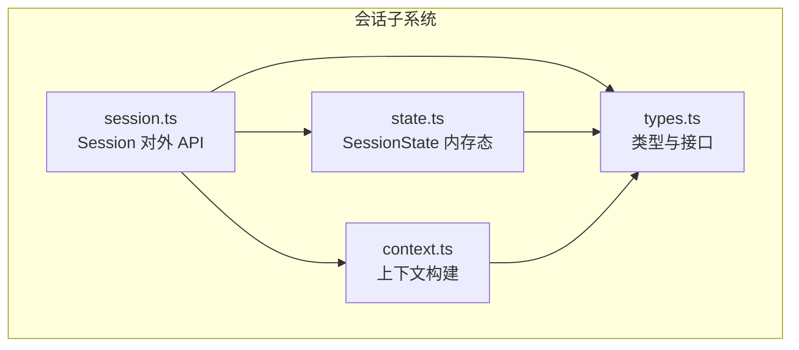
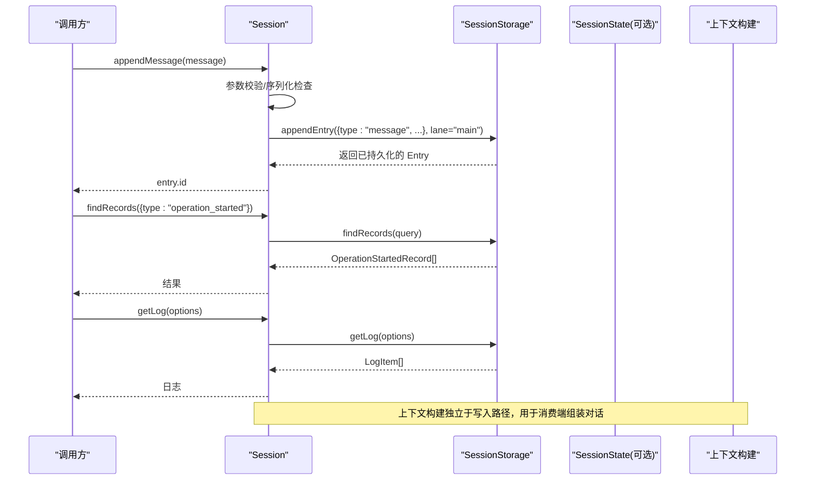
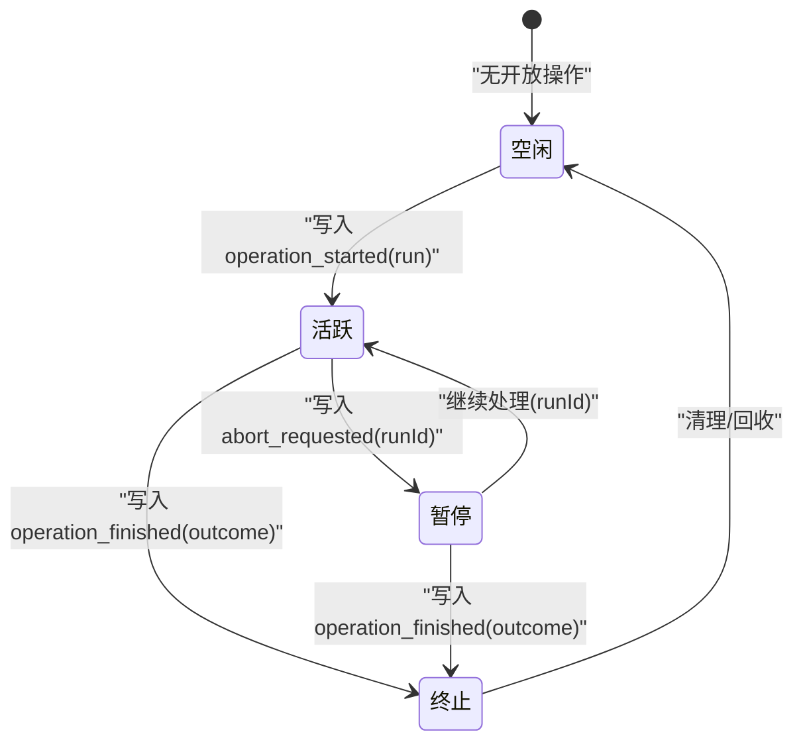
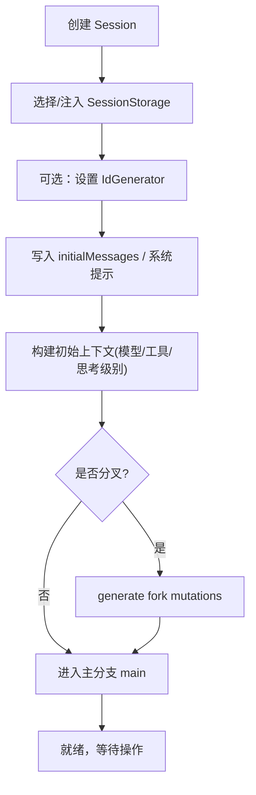
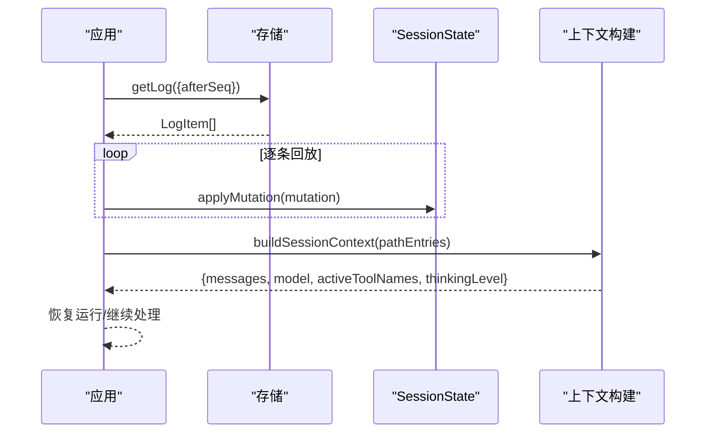
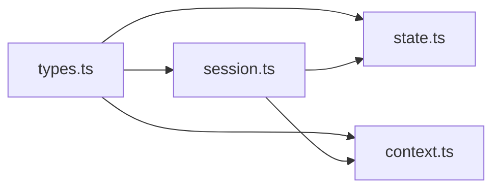

# 会话生命周期

<cite>
**本文引用的文件**
- [packages/agent/src/harness/session/session.ts](file://packages/agent/src/harness/session/session.ts)
- [packages/agent/src/harness/session/state.ts](file://packages/agent/src/harness/session/state.ts)
- [packages/agent/src/harness/session/types.ts](file://packages/agent/src/harness/session/types.ts)
- [packages/agent/src/harness/session/context.ts](file://packages/agent/src/harness/session/context.ts)
</cite>

## 目录
1. [简介](#简介)
2. [项目结构](#项目结构)
3. [核心组件](#核心组件)
4. [架构总览](#架构总览)
5. [详细组件分析](#详细组件分析)
6. [依赖关系分析](#依赖关系分析)
7. [性能考量](#性能考量)
8. [故障排查指南](#故障排查指南)
9. [结论](#结论)
10. [附录：API 参考与使用示例](#附录api-参考与使用示例)

## 简介
本文件围绕“会话生命周期管理”提供系统化文档，覆盖会话的完整生命周期（初始化、状态转换、资源管理与销毁）、状态机设计（活跃、暂停、恢复、终止等）、创建流程（配置验证、上下文初始化、存储分配）、恢复机制（状态重建、上下文加载、历史同步）、API 参考（创建、更新、查询、删除）、实际使用示例与错误处理策略，以及超时与自动清理机制。内容基于仓库中会话子系统实现进行提炼与可视化说明。

## 项目结构
会话子系统位于 agent 包的 harness/session 目录下，采用“接口 + 实现 + 类型定义 + 上下文构建”的分层组织方式：
- types.ts：定义会话元数据、条目、记录、查询、存储接口、错误码等核心类型。
- state.ts：内存态 SessionState，维护序列号、条目、记录、分支指针、日志、统计等，并负责变更校验与重放。
- session.ts：对外暴露 Session 类，封装对存储的读写操作、分支视图、消息追加、记录追加、日志查询等。
- context.ts：根据路径上的条目构建会话上下文（消息、模型、工具集、思考级别等），支持压缩摘要与分支摘要注入。

图表来源
- [packages/agent/src/harness/session/session.ts:102-299](file://packages/agent/src/harness/session/session.ts#L102-L299)
- [packages/agent/src/harness/session/state.ts:50-345](file://packages/agent/src/harness/session/state.ts#L50-L345)
- [packages/agent/src/harness/session/types.ts:259-394](file://packages/agent/src/harness/session/types.ts#L259-L394)
- [packages/agent/src/harness/session/context.ts:25-101](file://packages/agent/src/harness/session/context.ts#L25-L101)

章节来源
- [packages/agent/src/harness/session/session.ts:102-299](file://packages/agent/src/harness/session/session.ts#L102-L299)
- [packages/agent/src/harness/session/state.ts:50-345](file://packages/agent/src/harness/session/state.ts#L50-L345)
- [packages/agent/src/harness/session/types.ts:259-394](file://packages/agent/src/harness/session/types.ts#L259-L394)
- [packages/agent/src/harness/session/context.ts:25-101](file://packages/agent/src/harness/session/context.ts#L25-L101)

## 核心组件
- Session（会话）：面向调用方的会话树与写入入口，统一封装 appendMessage、appendCustomEntry、findEntries/findRecords、getLog、分支 view、命名与标签等能力，并通过内部方法将数据持久化到 SessionStorage。
- SessionState（会话状态）：内存中的会话快照，维护序列号、条目索引、记录、分支指针、开放操作集合、日志与统计；提供变更应用、查询、分叉生成等能力。
- 类型与接口（types）：定义 Entry、LaneRecord、SessionMetadata、SessionStorage、SessionTree、SessionError 等，是跨模块契约。
- 上下文构建（context）：从路径条目推导当前模型、工具集、思考级别，并将条目转换为对话消息，支持压缩摘要与分支摘要注入。

章节来源
- [packages/agent/src/harness/session/session.ts:102-299](file://packages/agent/src/harness/session/session.ts#L102-L299)
- [packages/agent/src/harness/session/state.ts:50-345](file://packages/agent/src/harness/session/state.ts#L50-L345)
- [packages/agent/src/harness/session/types.ts:259-394](file://packages/agent/src/harness/session/types.ts#L259-L394)
- [packages/agent/src/harness/session/context.ts:25-101](file://packages/agent/src/harness/session/context.ts#L25-L101)

## 架构总览
会话子系统通过 Session 暴露稳定 API，所有写操作最终委托给 SessionStorage 持久化；读操作可走内存态（SessionState）或底层存储。状态机以“操作记录”为核心：operation_started/operation_finished 标记操作的开始与结束，结合 openOperationsByLane 跟踪活跃/暂停/完成/失败等状态。

图表来源
- [packages/agent/src/harness/session/session.ts:178-224](file://packages/agent/src/harness/session/session.ts#L178-L224)
- [packages/agent/src/harness/session/types.ts:290-326](file://packages/agent/src/harness/session/types.ts#L290-L326)
- [packages/agent/src/harness/session/context.ts:90-101](file://packages/agent/src/harness/session/context.ts#L90-L101)

## 详细组件分析

### 会话状态机与生命周期
- 状态定义与含义
  - 活跃（Active）：存在未完成的 operation_started 且无 operation_finished。
  - 暂停（Suspended）：存在 operation_started 但被外部中断（如 abort_requested）。
  - 恢复（Resumed）：从上次 operation_started 继续执行，直至 operation_finished。
  - 终止（Terminated）：operation_finished 为 completed/aborted/failed/declined。
- 关键事件
  - operation_started：开启一次运行，携带 intent（run/compaction/navigation）及初始消息等。
  - abort_requested：请求中止指定 runId。
  - operation_finished：结束运行，附带 outcome 与可选 error。
  - usage：累计 token 与成本统计。
- 状态转换条件
  - 活跃 → 暂停：收到 abort_requested（同一 runId）。
  - 暂停 → 恢复：继续处理该 runId 的后续步骤。
  - 任意 → 终止：写入 operation_finished。
- 内存态维护
  - SessionState.openOperationsByLane 按 lane 维护 open 操作集合，便于快速查询与恢复。

图表来源
- [packages/agent/src/harness/session/state.ts:56-142](file://packages/agent/src/harness/session/state.ts#L56-L142)
- [packages/agent/src/harness/session/types.ts:87-125](file://packages/agent/src/harness/session/types.ts#L87-L125)

章节来源
- [packages/agent/src/harness/session/state.ts:56-142](file://packages/agent/src/harness/session/state.ts#L56-L142)
- [packages/agent/src/harness/session/types.ts:87-125](file://packages/agent/src/harness/session/types.ts#L87-L125)

### 会话创建流程（配置验证、上下文初始化、存储分配）
- 配置与 ID
  - Session 构造时接受 SessionStorage 与可选 IdGenerator；默认使用 uuidv7 生成 ID。
  - 元数据 SessionMetadata 包含 id、createdAt、parentSessionId。
- 存储分配
  - 通过 SessionStorage 抽象，具体实现负责持久化条目、记录、分支指针、名称与标签等。
- 上下文初始化
  - 首次运行可通过 initialMessages 注入系统提示、工具声明等；上下文构建会扫描路径条目，推导 thinkingLevel、model、activeToolNames。
- 分支与分叉
  - 支持 tree/branch 两种分叉范围，生成一组 SessionMutation 后由上层应用批量 apply。

图表来源
- [packages/agent/src/harness/session/session.ts:102-109](file://packages/agent/src/harness/session/session.ts#L102-L109)
- [packages/agent/src/harness/session/types.ts:259-263](file://packages/agent/src/harness/session/types.ts#L259-L263)
- [packages/agent/src/harness/session/state.ts:260-299](file://packages/agent/src/harness/session/state.ts#L260-L299)
- [packages/agent/src/harness/session/context.ts:25-43](file://packages/agent/src/harness/session/context.ts#L25-L43)

章节来源
- [packages/agent/src/harness/session/session.ts:102-109](file://packages/agent/src/harness/session/session.ts#L102-L109)
- [packages/agent/src/harness/session/types.ts:259-263](file://packages/agent/src/harness/session/types.ts#L259-L263)
- [packages/agent/src/harness/session/state.ts:260-299](file://packages/agent/src/harness/session/state.ts#L260-L299)
- [packages/agent/src/harness/session/context.ts:25-43](file://packages/agent/src/harness/session/context.ts#L25-L43)

### 会话恢复机制（状态重建、上下文加载、历史同步）
- 状态重建
  - 通过读取日志（LogItem）或回放 mutation，逐步 apply 到 SessionState，确保序列连续性与引用一致性。
- 上下文加载
  - 基于路径条目构建上下文，自动提取最近一次 thinkingLevel/model/activeTools，并将 compaction/branch_summary/custom 映射为消息。
- 历史同步
  - 使用 afterSeq 游标增量同步新日志；findOpenOperations 用于恢复未完成的操作（最多取两条，避免冗余）。

图表来源
- [packages/agent/src/harness/session/state.ts:97-180](file://packages/agent/src/harness/session/state.ts#L97-L180)
- [packages/agent/src/harness/session/context.ts:59-101](file://packages/agent/src/harness/session/context.ts#L59-L101)
- [packages/agent/src/harness/session/types.ts:285-318](file://packages/agent/src/harness/session/types.ts#L285-L318)

章节来源
- [packages/agent/src/harness/session/state.ts:97-180](file://packages/agent/src/harness/session/state.ts#L97-L180)
- [packages/agent/src/harness/session/context.ts:59-101](file://packages/agent/src/harness/session/context.ts#L59-L101)
- [packages/agent/src/harness/session/types.ts:285-318](file://packages/agent/src/harness/session/types.ts#L285-L318)

### 资源管理与销毁
- 资源
  - 内存态：entries、records、openOperationsByLane、labels、stats 等。
  - 持久化：通过 SessionStorage 管理条目、记录、分支指针、名称与标签。
- 销毁
  - 通过 Repo.delete(metadata) 删除会话元数据；具体清理策略由后端实现决定。
  - 内存态随对象释放而回收；建议显式关闭存储连接（由后端实现保证）。

章节来源
- [packages/agent/src/harness/session/types.ts:361-373](file://packages/agent/src/harness/session/types.ts#L361-L373)
- [packages/agent/src/harness/session/state.ts:50-68](file://packages/agent/src/harness/session/state.ts#L50-L68)

### 超时处理与自动清理
- 超时策略
  - 代码库未内置全局超时定时器；建议在调用方侧实现：对长时间运行的 operation_started 设置超时，并在超时时写入 abort_requested 或 operation_finished(outcome=aborted)。
- 自动清理
  - 可基于 usage/costTotal/messageCount 等统计指标触发压缩（compaction）或归档；压缩过程会生成 compaction 条目与 branch_summary，减少上下文体积。
  - 清理策略应遵循“保留必要尾部消息”的原则，确保上下文可恢复性。

章节来源
- [packages/agent/src/harness/session/types.ts:190-201](file://packages/agent/src/harness/session/types.ts#L190-L201)
- [packages/agent/src/harness/session/context.ts:45-57](file://packages/agent/src/harness/session/context.ts#L45-L57)

## 依赖关系分析
- Session 依赖 SessionStorage 完成持久化，依赖 SessionState 进行内存态查询与分叉生成，依赖 context 构建上下文。
- types 作为契约，被 session、state、context 共同引用，确保类型一致。

图表来源
- [packages/agent/src/harness/session/session.ts:1-22](file://packages/agent/src/harness/session/session.ts#L1-L22)
- [packages/agent/src/harness/session/state.ts:1-15](file://packages/agent/src/harness/session/state.ts#L1-L15)
- [packages/agent/src/harness/session/context.ts:1-3](file://packages/agent/src/harness/session/context.ts#L1-L3)

章节来源
- [packages/agent/src/harness/session/session.ts:1-22](file://packages/agent/src/harness/session/session.ts#L1-L22)
- [packages/agent/src/harness/session/state.ts:1-15](file://packages/agent/src/harness/session/state.ts#L1-L15)
- [packages/agent/src/harness/session/context.ts:1-3](file://packages/agent/src/harness/session/context.ts#L1-L3)

## 性能考量
- 写入路径
  - 所有写入前进行 JSON 可序列化校验，避免非法对象导致持久化失败。
  - 使用序列号与游标（afterSeq）实现增量同步，降低全量拉取开销。
- 查询优化
  - findEntriesOnBranch 支持 stopAtType/stopAtId 限制回溯范围，避免遍历整条链。
  - findOpenOperations 限制最多两条结果，满足恢复所需的最小状态。
- 上下文构建
  - 默认变换会将最近的 compaction 摘要前置，并仅保留尾部消息，显著减小上下文大小。
  - 自定义 entryTransforms 与 entryProjectors 允许按需裁剪与投影，进一步优化上下文体积。

章节来源
- [packages/agent/src/harness/session/session.ts:42-100](file://packages/agent/src/harness/session/session.ts#L42-L100)
- [packages/agent/src/harness/session/state.ts:198-215](file://packages/agent/src/harness/session/state.ts#L198-L215)
- [packages/agent/src/harness/session/types.ts:231-236](file://packages/agent/src/harness/session/types.ts#L231-L236)
- [packages/agent/src/harness/session/context.ts:45-57](file://packages/agent/src/harness/session/context.ts#L45-L57)

## 故障排查指南
- 常见错误码
  - not_found：条目/目标不存在。
  - already_exists：重复 ID 或分支已存在。
  - invalid_entry：条目链断裂、循环引用、非连续序列等。
  - invalid_payload：不可 JSON 序列化的负载。
  - invalid_lane：分支不存在。
  - invalid_query：limit/cursor 不合法或组合不兼容。
  - invalid_fork_target：分叉目标不是消息条目。
  - storage：存储层异常。
- 定位建议
  - 使用 getLog(afterSeq, limit) 获取最近变更，结合 seq 定位问题点。
  - 通过 findOpenOperations(lane) 检查是否存在悬挂操作。
  - 检查 entriesById 与 parentId 引用，确认分支链完整性。
  - 对 custom 条目使用 entryProjectors 调试其投影逻辑。

章节来源
- [packages/agent/src/harness/session/types.ts:375-394](file://packages/agent/src/harness/session/types.ts#L375-L394)
- [packages/agent/src/harness/session/state.ts:26-40](file://packages/agent/src/harness/session/state.ts#L26-L40)
- [packages/agent/src/harness/session/state.ts:301-319](file://packages/agent/src/harness/session/state.ts#L301-L319)

## 结论
本会话子系统以“操作记录”为中心，通过严格的序列与引用约束保障一致性；借助 SessionStorage 抽象实现解耦，配合上下文构建与压缩摘要机制，兼顾可扩展性与性能。通过明确的错误码与日志能力，便于在复杂场景中定位与恢复。

## 附录：API 参考与使用示例

### 会话 API 参考
- 创建与会话树
  - create(options)：创建新会话，支持 id、parentSessionId。
  - open(metadata)：打开已有会话并获取写入权。
  - list(options)：列出会话元数据。
  - delete(metadata)：删除会话。
  - fork(source, options)：分叉会话（tree/branch）。
- 写入
  - appendMessage(message)：追加消息到主分支。
  - appendCustomEntry(customType, data?)：追加自定义条目。
  - appendRecord(record)：追加记录（如 operation_started/finished、usage 等）。
- 查询
  - findEntries(query)：全局条目查询。
  - findEntriesOnBranch(query)：分支路径查询（支持 start/stopAt*）。
  - findRecords(query)：记录查询（支持 type/runId/operationKind/order/limit/afterSeq）。
  - findOpenOperations(lane, options)：查询未完成的运行。
  - getLog(options)：增量日志查询。
- 元数据与事实
  - getName()/setName(name)：会话名称。
  - getLabel(id)/setLabel(id, label)：条目标签。
  - getStats()：统计信息（消息数、token、成本等）。
- 分支
  - view(lane)：获取某分支的只读视图。
  - getLanes()/createLane(lane, at)/moveLane(lane, to)：分支管理。

章节来源
- [packages/agent/src/harness/session/types.ts:328-373](file://packages/agent/src/harness/session/types.ts#L328-L373)
- [packages/agent/src/harness/session/session.ts:111-224](file://packages/agent/src/harness/session/session.ts#L111-L224)

### 使用示例（描述性）
- 创建会话并追加消息
  - 调用 create({id?, parentSessionId?}) 获得 Session。
  - 调用 appendMessage({role:"user", content:...}) 追加用户消息。
  - 调用 appendRecord({type:"operation_started", intent:{kind:"run",...}}) 启动运行。
  - 运行完成后调用 appendRecord({type:"operation_finished", outcome:"completed"}).
- 查询与恢复
  - 调用 getLog({afterSeq, limit}) 增量同步。
  - 调用 findOpenOperations("main", {limit:2}) 检测悬挂运行。
  - 使用 buildSessionContext(pathEntries) 构建上下文，驱动下一步推理。
- 分叉与分支
  - 使用 fork({scope:"branch", entryId, position:"before"/"at"}) 在消息处分叉。
  - 通过 view(lane) 获取分支视图并追加消息。

章节来源
- [packages/agent/src/harness/session/types.ts:354-373](file://packages/agent/src/harness/session/types.ts#L354-L373)
- [packages/agent/src/harness/session/state.ts:260-299](file://packages/agent/src/harness/session/state.ts#L260-L299)
- [packages/agent/src/harness/session/context.ts:90-101](file://packages/agent/src/harness/session/context.ts#L90-L101)