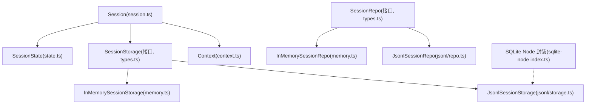
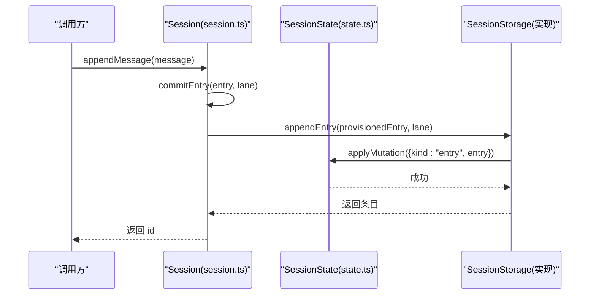
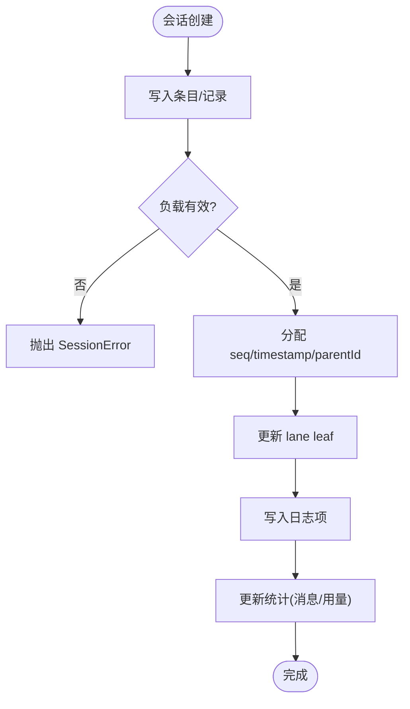
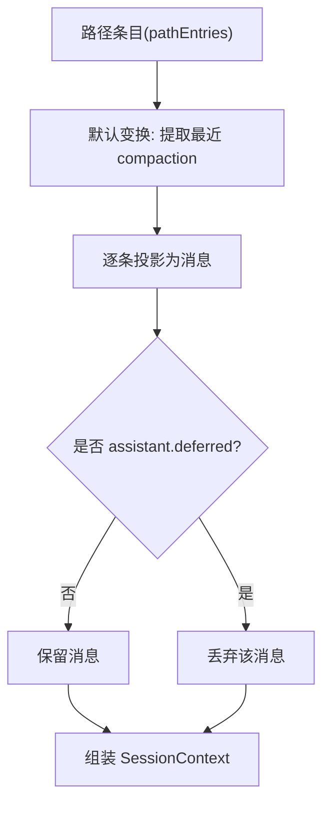
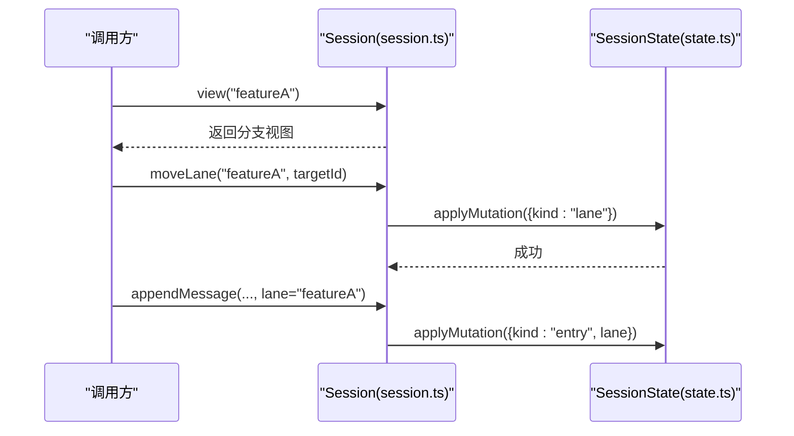
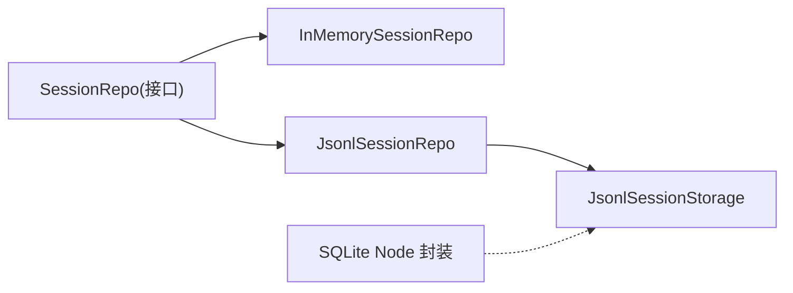
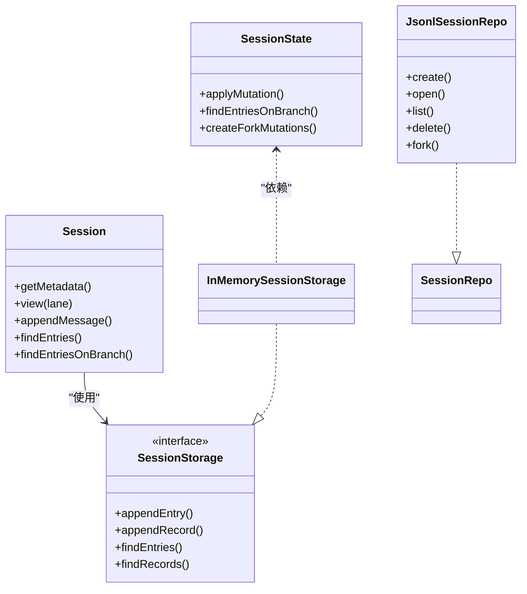

# 会话管理

<cite>
**本文引用的文件**
- [session.ts](file://packages/agent/src/harness/session/session.ts)
- [types.ts](file://packages/agent/src/harness/session/types.ts)
- [state.ts](file://packages/agent/src/harness/session/state.ts)
- [context.ts](file://packages/agent/src/harness/session/context.ts)
- [memory.ts](file://packages/agent/src/harness/session/memory.ts)
- [jsonl.ts](file://packages/agent/src/harness/session/jsonl.ts)
- [repo.ts](file://packages/agent/src/harness/session/jsonl/repo.ts)
- [types.ts（JSONL）](file://packages/agent/src/harness/session/jsonl/types.ts)
- [sqlite-node index.ts](file://packages/session-backends/sqlite-node/src/index.ts)
</cite>

## 目录
1. [简介](#简介)
2. [项目结构](#项目结构)
3. [核心组件](#核心组件)
4. [架构总览](#架构总览)
5. [详细组件分析](#详细组件分析)
6. [依赖关系分析](#依赖关系分析)
7. [性能考量](#性能考量)
8. [故障排查指南](#故障排查指南)
9. [结论](#结论)
10. [附录：API 参考与示例](#附录api-参考与示例)

## 简介
本文件为“会话管理系统”的权威技术文档，覆盖会话生命周期、状态转换、上下文维护与压缩、分支管理与合并、持久化方案与存储格式、完整 API 参考、使用示例、性能优化建议以及数据迁移与版本兼容性。系统以“事件溯源 + 有向无环图（DAG）”为核心思想，通过条目（Entry）和记录（Record）构建可回放、可分支、可压缩的对话历史，并提供内存与 JSONL 两种后端实现，同时提供 SQLite Node 后端封装以便扩展。

## 项目结构
- 会话核心位于 packages/agent/src/harness/session：
  - session.ts：对外暴露 Session 类，统一读写入口，封装分支视图、查询与写入。
  - types.ts：定义 Entry、Record、SessionStorage、SessionRepo、查询参数等类型契约。
  - state.ts：SessionState 实现内存中的状态机、分支遍历、变更应用与统计。
  - context.ts：上下文构建与压缩策略，将路径上的 Entry 转换为模型可用的消息序列。
  - memory.ts：InMemorySessionStorage / InMemorySessionRepo 的内存实现。
  - jsonl.ts：导出 JSONL 仓库接口。
  - jsonl/repo.ts：基于 JSONL 文件的持久化仓库实现。
  - jsonl/types.ts：JSONL 元数据与头信息类型。
- 持久化后端：
  - packages/session-backends/sqlite-node/src/index.ts：Node sqlite 数据库封装，提供事务、语句执行等能力，供上层 SQLite 会话后端复用。

图表来源
- [session.ts:102-299](file://packages/agent/src/harness/session/session.ts#L102-L299)
- [state.ts:50-345](file://packages/agent/src/harness/session/state.ts#L50-L345)
- [memory.ts:25-193](file://packages/agent/src/harness/session/memory.ts#L25-L193)
- [repo.ts:36-216](file://packages/agent/src/harness/session/jsonl/repo.ts#L36-L216)
- [sqlite-node index.ts:53-106](file://packages/session-backends/sqlite-node/src/index.ts#L53-L106)

章节来源
- [session.ts:102-299](file://packages/agent/src/harness/session/session.ts#L102-L299)
- [types.ts:290-352](file://packages/agent/src/harness/session/types.ts#L290-L352)
- [memory.ts:25-193](file://packages/agent/src/harness/session/memory.ts#L25-L193)
- [repo.ts:36-216](file://packages/agent/src/harness/session/jsonl/repo.ts#L36-L216)

## 核心组件
- Session：会话对外 API，提供消息追加、自定义条目、分支视图、查询、标签与名称、统计等。
- SessionState：内存状态机，维护 entries、records、lanes、open operations、日志与统计；支持分支遍历与克隆分叉。
- SessionStorage/SessionRepo：存储与仓库抽象，解耦具体持久化实现。
- Context：上下文构建器，负责从路径条目生成模型消息，并处理压缩摘要与分支摘要。
- 持久化后端：
  - InMemory：进程内内存实现，适合测试与轻量场景。
  - Jsonl：基于 JSONL 文件，带版本头与目录组织，支持跨进程共享与增量追加。
  - SQLite Node：提供数据库事务与语句封装，便于构建高性能、强一致的后端。

章节来源
- [session.ts:102-299](file://packages/agent/src/harness/session/session.ts#L102-L299)
- [state.ts:50-345](file://packages/agent/src/harness/session/state.ts#L50-L345)
- [types.ts:290-352](file://packages/agent/src/harness/session/types.ts#L290-L352)
- [context.ts:25-101](file://packages/agent/src/harness/session/context.ts#L25-L101)
- [memory.ts:25-193](file://packages/agent/src/harness/session/memory.ts#L25-L193)
- [repo.ts:36-216](file://packages/agent/src/harness/session/jsonl/repo.ts#L36-L216)

## 架构总览
会话采用“事件溯源 + DAG”的结构：
- 写入侧：通过 Session.appendMessage / appendCustomEntry / appendRecord 产生新条目或记录，底层 Storage 分配 seq、parentId、timestamp，并更新 lane leaf。
- 读取侧：通过 findEntries / findEntriesOnBranch 按顺序或沿父链回溯，结合 BranchBounds 限定范围。
- 分支：Lane 指向当前叶子节点，moveLane 切换分支；createLane 创建新分支；fork 支持树级或分支级克隆。
- 上下文：Context 从路径中抽取最近一次 compaction/branch_summary，将其作为摘要注入，再拼接后续消息，形成最终上下文。
- 持久化：Memory/Jsonl/SQLite 三种后端均实现 SessionStorage/SessionRepo 接口，保证一致的语义。

图表来源
- [session.ts:178-184](file://packages/agent/src/harness/session/session.ts#L178-L184)
- [session.ts:286-289](file://packages/agent/src/harness/session/session.ts#L286-L289)
- [memory.ts:59-70](file://packages/agent/src/harness/session/memory.ts#L59-L70)
- [state.ts:97-125](file://packages/agent/src/harness/session/state.ts#L97-L125)

## 详细组件分析

### 会话生命周期与状态转换
- 创建：通过 Repo.create 或 MemoryRepo.create 生成 Session，内部初始化 metadata、lanes（默认 main）。
- 写入：appendMessage/appendCustomEntry 会校验负载可序列化，分配 id、seq、parentId、timestamp，写入后更新 lane leaf。
- 查询：findEntries/findEntriesOnBranch 支持类型过滤、游标分页、顺序控制；分支查询从 start 向根回溯，支持 stopAtId/stopAtType。
- 分支：createLane/moveLane 改变分支指针；view(lane) 返回该分支的只读视图。
- 操作记录：appendRecord 写入 LaneRecord（如 operation_started/finished、usage 等），用于恢复、审计与统计。
- 删除：Repo.delete 移除会话文件（JSONL）或内存引用。

图表来源
- [session.ts:26-39](file://packages/agent/src/harness/session/session.ts#L26-L39)
- [session.ts:286-298](file://packages/agent/src/harness/session/session.ts#L286-L298)
- [state.ts:97-149](file://packages/agent/src/harness/session/state.ts#L97-L149)

章节来源
- [session.ts:102-299](file://packages/agent/src/harness/session/session.ts#L102-L299)
- [state.ts:50-345](file://packages/agent/src/harness/session/state.ts#L50-L345)
- [types.ts:217-288](file://packages/agent/src/harness/session/types.ts#L217-L288)

### 上下文维护与压缩算法
- 上下文构建：buildSessionContext 从路径条目推导 thinkingLevel、model、activeToolNames，并将路径条目转换为 AgentMessage 列表。
- 默认变换：defaultContextEntryTransform 查找最近的 compaction 条目，将其置于最前，仅保留其后的片段，避免重复历史。
- 投影规则：sessionEntryToContextMessages 将 message/compaction/branch_summary/custom 映射为消息；assistant 的 deferred 消息被丢弃。
- 压缩策略：
  - 触发点：由上层流程在达到阈值或溢出时写入 CompactionEntry，包含 summary、retainedTail、tokensBefore、usage。
  - 信息保留：retainedTail 保留尾部关键消息，确保最新上下文可用。
  - 内存优化：通过压缩减少上下文长度，降低 token 消耗与内存占用。
  - 分支摘要：BranchSummaryEntry 用于分支合并时的上下文压缩，配合 createBranchSummaryMessage 注入。

图表来源
- [context.ts:25-101](file://packages/agent/src/harness/session/context.ts#L25-L101)
- [types.ts:44-74](file://packages/agent/src/harness/session/types.ts#L44-L74)

章节来源
- [context.ts:25-101](file://packages/agent/src/harness/session/context.ts#L25-L101)
- [types.ts:44-74](file://packages/agent/src/harness/session/types.ts#L44-L74)

### 分支管理与合并机制
- 分支表示：每个 lane 指向一个 leafId，构成一条从叶到根的链。
- 创建与切换：createLane 新建分支；moveLane 移动分支指针；view(lane) 提供分支视图。
- 分叉（Fork）：SessionState.createForkMutations 支持：
  - scope="tree"：复制整棵树与所有 lanes。
  - scope="branch"：从指定 entryId 或其父节点开始复制路径，position 可为 before/at。
- 合并：通过写入 BranchSummaryEntry 将某分支的历史压缩为摘要，并在目标分支插入，实现逻辑合并。

图表来源
- [session.ts:115-132](file://packages/agent/src/harness/session/session.ts#L115-L132)
- [state.ts:260-299](file://packages/agent/src/harness/session/state.ts#L260-L299)

章节来源
- [session.ts:115-196](file://packages/agent/src/harness/session/session.ts#L115-L196)
- [state.ts:260-299](file://packages/agent/src/harness/session/state.ts#L260-L299)
- [types.ts:231-236](file://packages/agent/src/harness/session/types.ts#L231-L236)

### 会话持久化与数据存储格式
- 内存后端（InMemory）：
  - 使用 SessionState 维护 entries、records、lanes、labels、stats。
  - 所有写操作通过 applyMutation 保证序列号连续性与一致性。
- JSONL 后端（JsonlSessionRepo/Storage）：
  - 每个会话对应一个 .jsonl 文件，首行为版本头（v4），包含 id、createdAt、cwd、parentSessionId、metadata。
  - 文件命名含时间戳与 id，目录按 cwd 编码组织，避免冲突。
  - 支持 list/delete/fork/open/create 等操作，具备并发创建保护（activeCreateDestinations）。
- SQLite Node 后端：
  - 提供 DatabaseSync 封装，支持事务（BEGIN IMMEDIATE/COMMIT/ROLLBACK）、语句执行与结果获取。
  - 可用于构建高性能、强一致的会话存储后端。

图表来源
- [memory.ts:148-193](file://packages/agent/src/harness/session/memory.ts#L148-L193)
- [repo.ts:36-216](file://packages/agent/src/harness/session/jsonl/repo.ts#L36-L216)
- [sqlite-node index.ts:53-106](file://packages/session-backends/sqlite-node/src/index.ts#L53-L106)

章节来源
- [memory.ts:25-193](file://packages/agent/src/harness/session/memory.ts#L25-L193)
- [repo.ts:36-216](file://packages/agent/src/harness/session/jsonl/repo.ts#L36-L216)
- [types.ts（JSONL）:20-58](file://packages/agent/src/harness/session/jsonl/types.ts#L20-L58)
- [sqlite-node index.ts:53-106](file://packages/session-backends/sqlite-node/src/index.ts#L53-L106)

### 错误处理与一致性
- 输入校验：limit/cursor 合法性检查，非有限数、循环引用、非标准数组等拒绝写入。
- 分支一致性：walkToRoot 检测环路与缺失父节点，防止无效分支。
- 操作并发：同一 lane 不允许同时存在多个 open operation（写入 record 时校验）。
- 错误类型：统一 SessionError，携带 code（not_found/already_exists/invalid_entry/invalid_payload/invalid_lane/invalid_query/invalid_fork_target/storage）。

章节来源
- [session.ts:26-39](file://packages/agent/src/harness/session/session.ts#L26-L39)
- [session.ts:42-100](file://packages/agent/src/harness/session/session.ts#L42-L100)
- [state.ts:26-40](file://packages/agent/src/harness/session/state.ts#L26-L40)
- [state.ts:301-320](file://packages/agent/src/harness/session/state.ts#L301-L320)
- [memory.ts:72-89](file://packages/agent/src/harness/session/memory.ts#L72-L89)
- [types.ts:375-393](file://packages/agent/src/harness/session/types.ts#L375-L393)

## 依赖关系分析
- Session 依赖 SessionStorage 抽象，屏蔽具体存储实现。
- SessionState 被 InMemorySessionStorage 使用，提供内存状态机能力。
- JsonlSessionRepo 依赖文件系统抽象，负责会话文件的生命周期与元数据管理。
- SQLite Node 封装提供数据库事务与语句执行，便于上层实现高并发、强一致存储。

图表来源
- [session.ts:102-299](file://packages/agent/src/harness/session/session.ts#L102-L299)
- [state.ts:50-345](file://packages/agent/src/harness/session/state.ts#L50-L345)
- [memory.ts:25-193](file://packages/agent/src/harness/session/memory.ts#L25-L193)
- [repo.ts:36-216](file://packages/agent/src/harness/session/jsonl/repo.ts#L36-L216)

章节来源
- [session.ts:102-299](file://packages/agent/src/harness/session/session.ts#L102-L299)
- [state.ts:50-345](file://packages/agent/src/harness/session/state.ts#L50-L345)
- [memory.ts:25-193](file://packages/agent/src/harness/session/memory.ts#L25-L193)
- [repo.ts:36-216](file://packages/agent/src/harness/session/jsonl/repo.ts#L36-L216)

## 性能考量
- 上下文压缩：
  - 使用 CompactionEntry 定期压缩历史，保留 retainedTail 确保最新上下文可用，显著降低 token 与内存消耗。
  - 分支摘要（BranchSummaryEntry）在合并时减少冗余历史。
- 查询优化：
  - 使用 limit 与 cursor 分页，避免一次性加载大量条目。
  - BranchBounds 限制扫描范围，减少回溯成本。
- 写入优化：
  - 批量写入时尽量合并记录，减少多次 applyMutation 开销。
  - JSONL 追加写入具有良好并发友好性，注意避免同进程重复创建。
- 统计与监控：
  - 通过 UsageRecord 累计 cached/uncached tokens 与 costTotal，辅助容量规划与成本控制。

[本节为通用指导，不直接分析具体文件]

## 故障排查指南
- 常见错误码：
  - not_found：条目/会话不存在。
  - already_exists：重复 id 或重复创建。
  - invalid_entry：非法条目或分支环。
  - invalid_payload：不可序列化或非法数据结构。
  - invalid_lane：无效的 lane 名称或目标。
  - invalid_query：limit/cursor 不合法。
  - storage：存储层异常（如并发 open operation）。
- 定位步骤：
  - 检查 query 参数（limit、cursor、order、type、customType）。
  - 确认 lane 是否存在且 leafId 有效。
  - 查看 open operations 是否冲突。
  - 对 JSONL 后端检查文件头版本与路径解析。
  - 使用 getLog 获取最近变更日志，定位问题发生点。

章节来源
- [types.ts:375-393](file://packages/agent/src/harness/session/types.ts#L375-L393)
- [memory.ts:72-89](file://packages/agent/src/harness/session/memory.ts#L72-L89)
- [repo.ts:85-95](file://packages/agent/src/harness/session/jsonl/repo.ts#L85-L95)

## 结论
本会话管理系统以事件溯源与 DAG 为基础，提供强大的分支、压缩、查询与持久化能力。通过统一的 Session/SessionStorage/SessionRepo 抽象，可在内存、JSONL、SQLite 等多种后端间无缝切换。上下文压缩与分支摘要有效降低资源消耗，提升可扩展性。建议在生产环境结合 UsageRecord 进行容量与成本管理，并使用游标分页与分支边界查询优化性能。

[本节为总结，不直接分析具体文件]

## 附录：API 参考与示例

### 会话操作（Session）
- 创建与会话管理
  - create(options): 创建新会话（Repo 层）
  - open(metadata): 打开已有会话（Repo 层）
  - list(options?): 列出会话元数据（Repo 层）
  - delete(metadata): 删除会话（Repo 层）
  - fork(source, options): 分叉会话（Repo 层）
- 会话视图与写入
  - view(lane): 获取分支视图
  - appendMessage(message): 追加消息
  - appendCustomEntry(customType, data?): 追加自定义条目
  - appendRecord(record): 追加记录（如 operation_started/finished、usage）
- 查询与浏览
  - findEntries(query?): 全局查询条目
  - findEntry(query?): 单条查询
  - findEntriesOnBranch(query?): 分支查询
  - findEntryOnBranch(query?): 分支单条查询
  - getEntry(id): 按 id 获取条目
  - getStats(): 获取统计信息
  - getName()/setName(name): 会话名称
  - getLabel(targetId)/setLabel(targetId, label?): 条目标签
  - getLanes(): 列出所有 lane 及其 leaf
  - createLane(lane, at): 创建分支
  - moveLane(lane, to): 移动分支指针
  - findOpenOperations(lane, options?): 查找未完成的运行
  - getLog(options?): 获取变更日志

章节来源
- [types.ts:290-352](file://packages/agent/src/harness/session/types.ts#L290-L352)
- [session.ts:102-299](file://packages/agent/src/harness/session/session.ts#L102-L299)

### 上下文查询与历史记录访问
- 上下文构建
  - buildSessionContext(pathEntries, options?): 构建会话上下文
  - defaultContextEntryTransform(pathEntries): 默认上下文变换（提取最近压缩）
  - sessionEntryToContextMessages(entry, index, entries, options?): 条目到消息投影
- 历史记录访问
  - findEntries/findEntriesOnBranch：支持 type、customType、order、limit、cursor
  - BranchBounds：start、stopAtType、stopAtId 控制分支扫描范围

章节来源
- [context.ts:25-101](file://packages/agent/src/harness/session/context.ts#L25-L101)
- [types.ts:217-288](file://packages/agent/src/harness/session/types.ts#L217-L288)

### 实际使用示例（描述性）
- 创建会话并追加消息
  - 使用 Repo.create 创建会话，随后 Session.appendMessage 追加用户与助手消息。
  - 使用 findEntriesOnBranch 获取当前分支历史，调用 buildSessionContext 生成上下文。
- 分支与合并
  - 使用 createLane 创建 feature 分支，moveLane 切换到该分支继续对话。
  - 当需要合并时，生成 BranchSummaryEntry 并写入目标分支，实现上下文压缩与合并。
- 压缩与上下文优化
  - 当上下文接近阈值时，写入 CompactionEntry，保留 retainedTail，减少后续 token 消耗。
  - 使用 limit 与 cursor 分页查询，避免一次性加载过多历史。

[本节为概念性示例，不直接分析具体文件]

### 数据迁移与版本兼容性
- JSONL 版本头
  - v4 头包含 kind/version/id/createdAt/cwd/parentSessionId/metadata。
  - 支持 legacyParentSessionPath 兼容旧版父路径。
- 迁移策略
  - 读取时解析头信息，若版本不匹配则进行适配或提示升级。
  - 列表时仅读取首行头，快速筛选有效会话。
- 兼容性
  - 向后兼容：新版本能读取旧版本头；旧版本无法识别新字段将被忽略。
  - 向前兼容：旧客户端应忽略未知字段，避免崩溃。

章节来源
- [types.ts（JSONL）:26-58](file://packages/agent/src/harness/session/jsonl/types.ts#L26-L58)
- [repo.ts:157-177](file://packages/agent/src/harness/session/jsonl/repo.ts#L157-L177)