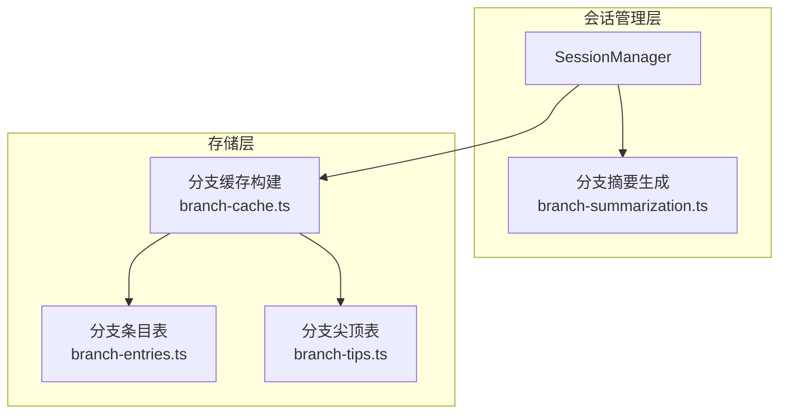
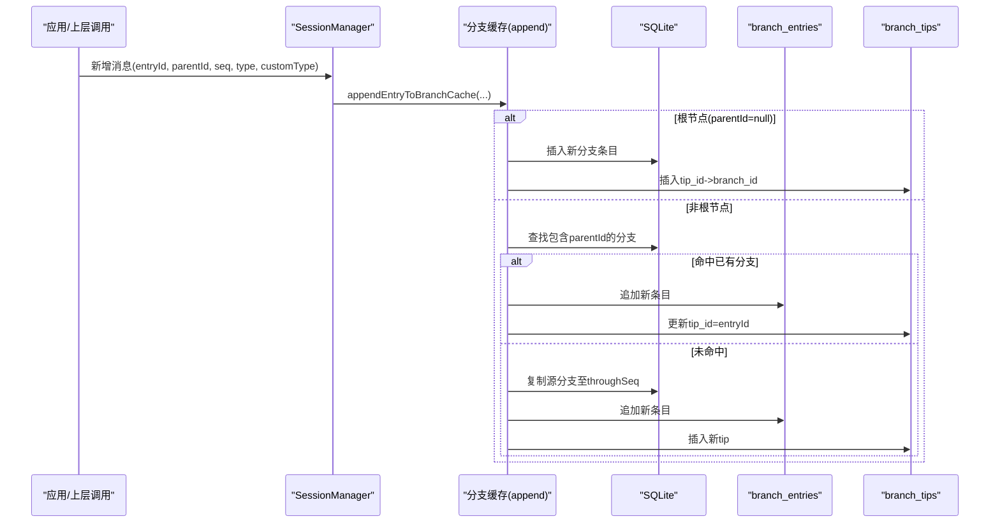
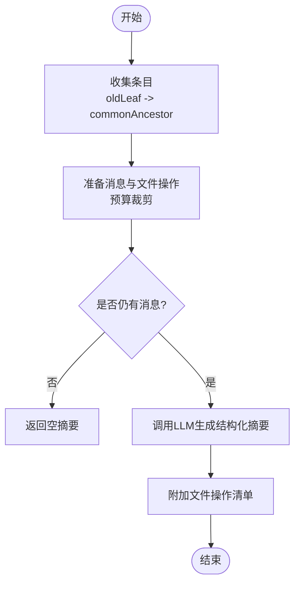
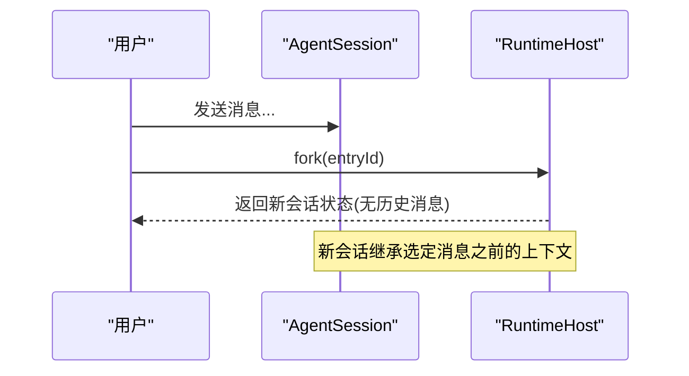
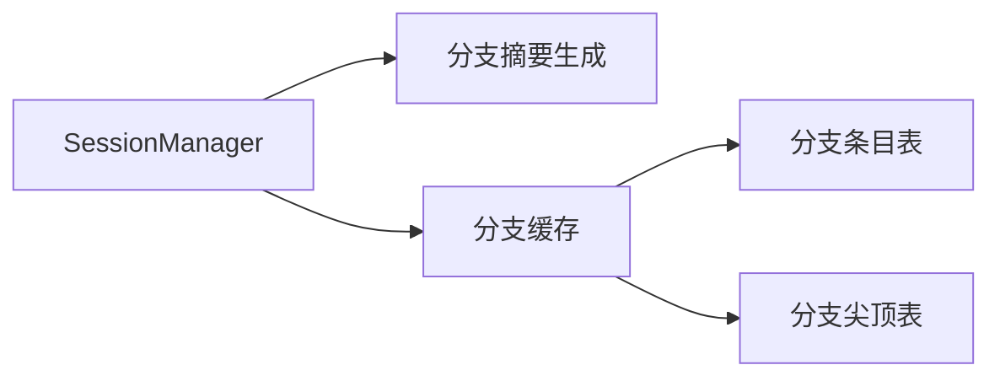

# 分支管理

<cite>
**本文引用的文件**
- [branch-summarization.ts](file://packages/coding-agent/src/core/compaction/branch-summarization.ts)
- [agent-session-branching.test.ts](file://packages/coding-agent/test/agent-session-branching.test.ts)
- [branch-cache.ts](file://packages/session-backends/sqlite-node/src/sqlite/branch-cache.ts)
- [branch-entries.ts](file://packages/session-backends/sqlite-node/src/sqlite/storage/branch-entries.ts)
- [branch-tips.ts](file://packages/session-backends/sqlite-node/src/sqlite/storage/branch-tips.ts)
- [session-manager.ts](file://packages/coding-agent/src/core/session-manager.ts)
</cite>

## 目录
1. [简介](#简介)
2. [项目结构](#项目结构)
3. [核心组件](#核心组件)
4. [架构总览](#架构总览)
5. [详细组件分析](#详细组件分析)
6. [依赖关系分析](#依赖关系分析)
7. [性能考量](#性能考量)
8. [故障排查指南](#故障排查指南)
9. [结论](#结论)
10. [附录：API 参考](#附录api-参考)

## 简介
本文件为“分支管理系统”的权威技术文档，面向希望理解与使用多对话分支（会话树）能力的开发者与使用者。内容涵盖：
- 分支的概念、用途与工作流（创建、切换、提交、合并）
- 数据结构设计（分支点标记、差异计算、合并策略）
- 冲突检测与解决机制
- API 参考（创建、切换、合并、删除）
- 可视化与调试工具建议
- 存储与同步策略（SQLite 缓存与持久化）

## 项目结构
分支能力由两层组成：
- 上层：会话管理与摘要生成（coding-agent），负责在会话树中导航时生成“分支摘要”，以保留上下文。
- 下层：SQLite 后端（session-backends/sqlite-node），负责将分支路径物化为可查询的缓存表，并维护“分支尖顶”映射。

图表来源
- [branch-summarization.ts:108-146](file://packages/coding-agent/src/core/compaction/branch-summarization.ts#L108-L146)
- [branch-cache.ts:19-52](file://packages/session-backends/sqlite-node/src/sqlite/branch-cache.ts#L19-L52)
- [branch-entries.ts:133-151](file://packages/session-backends/sqlite-node/src/sqlite/storage/branch-entries.ts#L133-L151)
- [branch-tips.ts:17-30](file://packages/session-backends/sqlite-node/src/sqlite/storage/branch-tips.ts#L17-L30)

章节来源
- [branch-summarization.ts:108-146](file://packages/coding-agent/src/core/compaction/branch-summarization.ts#L108-L146)
- [branch-cache.ts:19-52](file://packages/session-backends/sqlite-node/src/sqlite/branch-cache.ts#L19-L52)
- [branch-entries.ts:133-151](file://packages/session-backends/sqlite-node/src/sqlite/storage/branch-entries.ts#L133-L151)
- [branch-tips.ts:17-30](file://packages/session-backends/sqlite-node/src/sqlite/storage/branch-tips.ts#L17-L30)

## 核心组件
- 分支摘要生成器：在从旧位置导航到新位置时，自动对“被离开的分支”生成结构化摘要，确保上下文不丢失。
- SQLite 分支缓存：将每条会话条目归属到若干“分支路径”（根到叶），并提供高效查询；同时维护 tip_id -> branch_id 的映射，支持快速定位当前分支尖顶。
- 会话管理器：提供分支相关的能力（如获取某条消息用于分叉、遍历分支等）。

章节来源
- [branch-summarization.ts:108-146](file://packages/coding-agent/src/core/compaction/branch-summarization.ts#L108-L146)
- [branch-cache.ts:19-52](file://packages/session-backends/sqlite-node/src/sqlite/branch-cache.ts#L19-L52)
- [session-manager.ts](file://packages/coding-agent/src/core/session-manager.ts)

## 架构总览
下图展示了“会话树 + 分支缓存”的整体数据流：当新增一条消息时，系统会将其追加到所有包含其父节点的分支上；若父节点不在任何分支缓存中，则回溯找到包含该父节点的源分支，复制前缀后扩展为新分支。

图表来源
- [branch-cache.ts:70-101](file://packages/session-backends/sqlite-node/src/sqlite/branch-cache.ts#L70-L101)
- [branch-entries.ts:163-174](file://packages/session-backends/sqlite-node/src/sqlite/storage/branch-entries.ts#L163-L174)
- [branch-tips.ts:17-30](file://packages/session-backends/sqlite-node/src/sqlite/storage/branch-tips.ts#L17-L30)

## 详细组件分析

### 分支摘要生成（离开分支时的上下文保留）
- 目标：在用户切换到另一条分支时，对“被离开的分支”生成结构化摘要，避免上下文丢失。
- 关键流程：
  - 收集需要摘要的条目：从旧叶节点回溯到与新位置的最近公共祖先，收集沿途条目。
  - 准备消息与文件操作：提取助手消息中的工具调用，累计读取/修改文件列表。
  - 生成摘要：按模型上下文窗口预算裁剪消息，调用 LLM 生成结构化摘要，并在末尾附加文件操作清单。
- 复杂度：
  - 收集条目：O(k)，k 为两条路径之间的深度差。
  - 消息与文件操作提取：O(n)，n 为待处理条目数。
  - 摘要生成：受模型上下文与 token 预算限制，通常线性于输入长度。

图表来源
- [branch-summarization.ts:108-146](file://packages/coding-agent/src/core/compaction/branch-summarization.ts#L108-L146)
- [branch-summarization.ts:195-247](file://packages/coding-agent/src/core/compaction/branch-summarization.ts#L195-L247)
- [branch-summarization.ts:293-376](file://packages/coding-agent/src/core/compaction/branch-summarization.ts#L293-L376)

章节来源
- [branch-summarization.ts:108-146](file://packages/coding-agent/src/core/compaction/branch-summarization.ts#L108-L146)
- [branch-summarization.ts:195-247](file://packages/coding-agent/src/core/compaction/branch-summarization.ts#L195-L247)
- [branch-summarization.ts:293-376](file://packages/coding-agent/src/core/compaction/branch-summarization.ts#L293-L376)

### SQLite 分支缓存与会话树
- 数据结构：
  - entries：会话树节点（含 parent_id 指向父节点）。
  - branch_entries：将每个“根到叶”的路径展开为多条记录，便于按分支范围查询。
  - branch_tips：tip_id（即叶子 entryId）到 branch_id 的映射，表示“某条分支的当前尖顶”。
- 构建与扩展：
  - 构建：从某个叶节点回溯到根，写入 branch_entries，并建立 tip->branch 映射。
  - 扩展：新增节点时，若其父节点已在某分支中，直接追加；否则找到包含父节点的源分支，复制前缀后再追加，形成新分支。
- 查询：
  - 支持按分支、类型、自定义类型、游标分页、停止条件等过滤。

```mermaid
classDiagram
class BranchCache {
+buildCachedBranch(sessionId, leafId)
+appendEntryToBranchCache(...)
+rebuildBranchCache(sessionId)
}
class BranchEntries {
+insertBranchEntriesForPath(...)
+copyBranchEntriesThroughSeq(...)
+queryCachedBranchRows(...)
}
class BranchTips {
+insertBranchTip(...)
+updateBranchTip(...)
+readBranchTipBranchId(...)
}
BranchCache --> BranchEntries : "写入/复制"
BranchCache --> BranchTips : "维护tip映射"
```

图表来源
- [branch-cache.ts:19-52](file://packages/session-backends/sqlite-node/src/sqlite/branch-cache.ts#L19-L52)
- [branch-cache.ts:70-101](file://packages/session-backends/sqlite-node/src/sqlite/branch-cache.ts#L70-L101)
- [branch-entries.ts:133-151](file://packages/session-backends/sqlite-node/src/sqlite/storage/branch-entries.ts#L133-L151)
- [branch-entries.ts:163-174](file://packages/session-backends/sqlite-node/src/sqlite/storage/branch-entries.ts#L163-L174)
- [branch-tips.ts:17-30](file://packages/session-backends/sqlite-node/src/sqlite/storage/branch-tips.ts#L17-L30)

章节来源
- [branch-cache.ts:19-52](file://packages/session-backends/sqlite-node/src/sqlite/branch-cache.ts#L19-L52)
- [branch-cache.ts:70-101](file://packages/session-backends/sqlite-node/src/sqlite/branch-cache.ts#L70-L101)
- [branch-entries.ts:133-151](file://packages/session-backends/sqlite-node/src/sqlite/storage/branch-entries.ts#L133-L151)
- [branch-entries.ts:163-174](file://packages/session-backends/sqlite-node/src/sqlite/storage/branch-entries.ts#L163-L174)
- [branch-tips.ts:17-30](file://packages/session-backends/sqlite-node/src/sqlite/storage/branch-tips.ts#L17-L30)

### 会话分叉与切换（测试用例体现的工作流）
- 分叉：可从单条消息或对话中间任意位置分叉，得到一个新的会话视图。
- 切换：通过选择不同分支尖顶，实现上下文切换。
- 行为验证：测试覆盖了 in-memory 模式与持久化模式的分叉场景，以及从对话中间分叉的正确性。

图表来源
- [agent-session-branching.test.ts:90-155](file://packages/coding-agent/test/agent-session-branching.test.ts#L90-L155)

章节来源
- [agent-session-branching.test.ts:90-155](file://packages/coding-agent/test/agent-session-branching.test.ts#L90-L155)

## 依赖关系分析
- 上层（coding-agent）依赖 SessionManager 提供的分支遍历与消息提取能力，并通过分支摘要生成器在导航时生成上下文摘要。
- 下层（sqlite-node）通过 branch-cache 协调 branch-entries 与 branch-tips，保证分支路径的可查询性与尖顶一致性。
- 可能的耦合点：
  - 新增条目必须正确维护 tip 映射与分支路径，否则查询可能不一致。
  - 摘要生成依赖会话条目结构与工具调用解析，需保持兼容。

图表来源
- [branch-cache.ts:70-101](file://packages/session-backends/sqlite-node/src/sqlite/branch-cache.ts#L70-L101)
- [branch-entries.ts:163-174](file://packages/session-backends/sqlite-node/src/sqlite/storage/branch-entries.ts#L163-L174)
- [branch-tips.ts:17-30](file://packages/session-backends/sqlite-node/src/sqlite/storage/branch-tips.ts#L17-L30)

章节来源
- [branch-cache.ts:70-101](file://packages/session-backends/sqlite-node/src/sqlite/branch-cache.ts#L70-L101)
- [branch-entries.ts:163-174](file://packages/session-backends/sqlite-node/src/sqlite/storage/branch-entries.ts#L163-L174)
- [branch-tips.ts:17-30](file://packages/session-backends/sqlite-node/src/sqlite/storage/branch-tips.ts#L17-L30)

## 性能考量
- 分支缓存构建：
  - 首次构建：从叶回溯到根，时间复杂度 O(h)，h 为树高。
  - 增量追加：若父节点已存在分支，O(1) 追加；否则需复制前缀，O(p)，p 为前缀长度。
- 查询优化：
  - 使用 branch_entries 的 entry_seq 与 stopAt* 条件进行范围扫描，配合索引可显著降低 IO。
- 摘要生成：
  - 通过 token 预算控制消息数量，避免超出模型上下文窗口；必要时优先保留压缩/分支摘要等关键上下文。

[本节为通用性能讨论，无需特定文件引用]

## 故障排查指南
- 分支缓存构建失败：
  - 检查是否存在环状 parent 引用（代码会在回溯时检测循环）。
  - 检查父节点是否存在于 entries 表中。
- 分支尖顶更新失败：
  - 并发更新可能导致 CAS 失败（基于 oldTipId 的更新），需重试或回退。
- 摘要生成异常：
  - 若消息为空或预算不足，可能返回空摘要；检查 token 预算与模型上下文窗口配置。
  - 网络或模型错误会被捕获并返回错误信息。

章节来源
- [branch-entries.ts:133-151](file://packages/session-backends/sqlite-node/src/sqlite/storage/branch-entries.ts#L133-L151)
- [branch-cache.ts:31-52](file://packages/session-backends/sqlite-node/src/sqlite/branch-cache.ts#L31-L52)
- [branch-tips.ts:21-30](file://packages/session-backends/sqlite-node/src/sqlite/storage/branch-tips.ts#L21-L30)
- [branch-summarization.ts:311-376](file://packages/coding-agent/src/core/compaction/branch-summarization.ts#L311-L376)

## 结论
本分支管理系统通过“会话树 + 分支缓存”的组合，实现了高效的多对话分支能力：既能快速定位与切换分支上下文，又能在离开分支时自动生成结构化摘要，保障上下文连续性。SQLite 层的分支缓存与尖顶映射提供了稳定的查询与一致性保障，适合在生产环境中大规模会话管理。

[本节为总结性内容，无需特定文件引用]

## 附录：API 参考
以下 API 均来源于仓库中的实际函数与测试用例，描述其职责与参数要点。

- 分支缓存（SQLite）
  - buildCachedBranch(sessionId, leafId)
    - 作用：从指定叶节点构建根到叶的分支缓存，并建立 tip->branch 映射。
    - 参考：[branch-cache.ts:31-52](file://packages/session-backends/sqlite-node/src/sqlite/branch-cache.ts#L31-L52)
  - appendEntryToBranchCache(sessionId, entryId, entrySeq, entryType, customType, parentId)
    - 作用：将新条目追加到所有包含其父节点的分支；若父节点不在任何分支中，则复制源分支前缀后扩展为新分支。
    - 参考：[branch-cache.ts:70-101](file://packages/session-backends/sqlite-node/src/sqlite/branch-cache.ts#L70-L101)
  - insertBranchEntriesForPath(sessionId, branchId, leafId)
    - 作用：根据叶节点回溯到根，写入 branch_entries。
    - 参考：[branch-entries.ts:133-151](file://packages/session-backends/sqlite-node/src/sqlite/storage/branch-entries.ts#L133-L151)
  - copyBranchEntriesThroughSeq(sessionId, targetBranchId, sourceBranchId, throughSeq)
    - 作用：复制源分支到指定序列号为止，用于分叉时共享前缀。
    - 参考：[branch-entries.ts:163-174](file://packages/session-backends/sqlite-node/src/sqlite/storage/branch-entries.ts#L163-L174)
  - readBranchTipBranchId(sessionId, tipId) / updateBranchTip(sessionId, branchId, oldTipId, newTipId)
    - 作用：读取/更新分支尖顶映射。
    - 参考：[branch-tips.ts:10-14](file://packages/session-backends/sqlite-node/src/sqlite/storage/branch-tips.ts#L10-L14), [branch-tips.ts:21-30](file://packages/session-backends/sqlite-node/src/sqlite/storage/branch-tips.ts#L21-L30)

- 分支摘要（会话层）
  - collectEntriesForBranchSummary(session, oldLeafId, targetId)
    - 作用：收集需要摘要的条目（从旧叶到公共祖先）。
    - 参考：[branch-summarization.ts:108-146](file://packages/coding-agent/src/core/compaction/branch-summarization.ts#L108-L146)
  - prepareBranchEntries(entries, tokenBudget)
    - 作用：准备消息与文件操作，按 token 预算裁剪。
    - 参考：[branch-summarization.ts:195-247](file://packages/coding-agent/src/core/compaction/branch-summarization.ts#L195-L247)
  - generateBranchSummary(entries, options)
    - 作用：调用 LLM 生成结构化分支摘要，并附加文件操作清单。
    - 参考：[branch-summarization.ts:293-376](file://packages/coding-agent/src/core/compaction/branch-summarization.ts#L293-L376)

- 会话分叉（工作流）
  - RuntimeHost.fork(entryId)
    - 作用：从指定消息处分叉出新会话，新会话初始无历史消息但继承上下文。
    - 参考：[agent-session-branching.test.ts:90-155](file://packages/coding-agent/test/agent-session-branching.test.ts#L90-L155)

- 删除与重建
  - deleteBranchCache(sessionId) / rebuildBranchCache(sessionId)
    - 作用：清理或重建全部分支缓存。
    - 参考：[branch-cache.ts:14-29](file://packages/session-backends/sqlite-node/src/sqlite/branch-cache.ts#L14-L29)

章节来源
- [branch-cache.ts:14-29](file://packages/session-backends/sqlite-node/src/sqlite/branch-cache.ts#L14-L29)
- [branch-cache.ts:31-52](file://packages/session-backends/sqlite-node/src/sqlite/branch-cache.ts#L31-L52)
- [branch-cache.ts:70-101](file://packages/session-backends/sqlite-node/src/sqlite/branch-cache.ts#L70-L101)
- [branch-entries.ts:133-151](file://packages/session-backends/sqlite-node/src/sqlite/storage/branch-entries.ts#L133-L151)
- [branch-entries.ts:163-174](file://packages/session-backends/sqlite-node/src/sqlite/storage/branch-entries.ts#L163-L174)
- [branch-tips.ts:10-14](file://packages/session-backends/sqlite-node/src/sqlite/storage/branch-tips.ts#L10-L14)
- [branch-tips.ts:21-30](file://packages/session-backends/sqlite-node/src/sqlite/storage/branch-tips.ts#L21-L30)
- [branch-summarization.ts:108-146](file://packages/coding-agent/src/core/compaction/branch-summarization.ts#L108-L146)
- [branch-summarization.ts:195-247](file://packages/coding-agent/src/core/compaction/branch-summarization.ts#L195-L247)
- [branch-summarization.ts:293-376](file://packages/coding-agent/src/core/compaction/branch-summarization.ts#L293-L376)
- [agent-session-branching.test.ts:90-155](file://packages/coding-agent/test/agent-session-branching.test.ts#L90-L155)