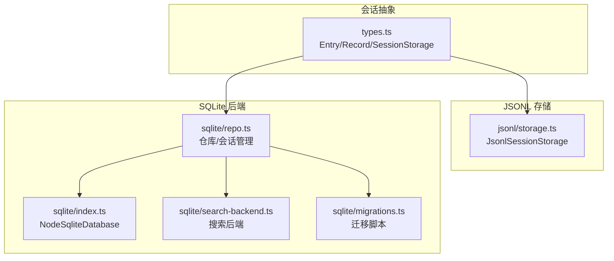
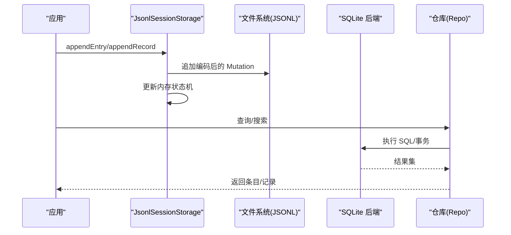
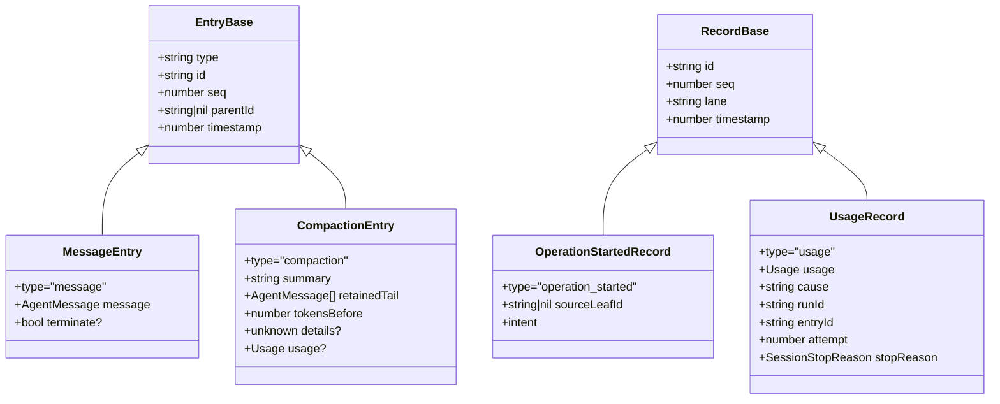
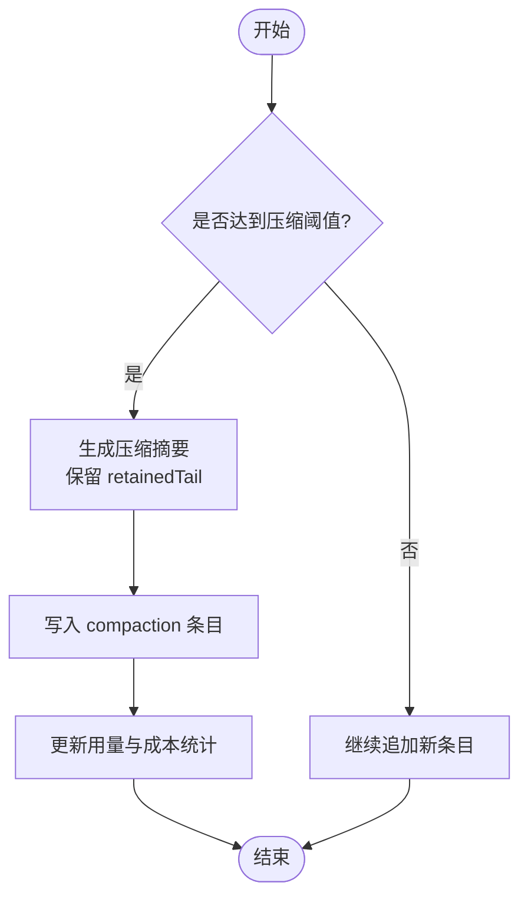
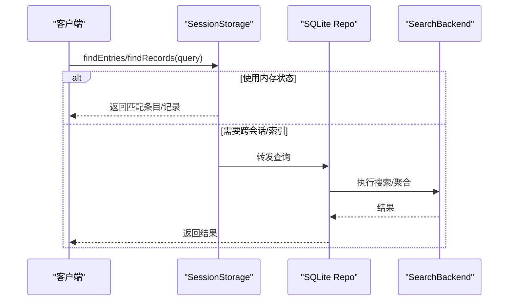
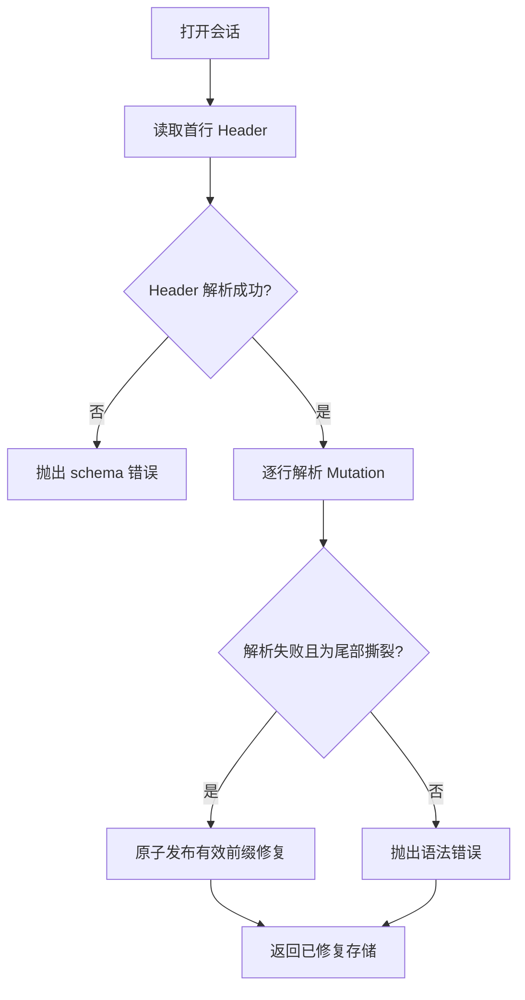
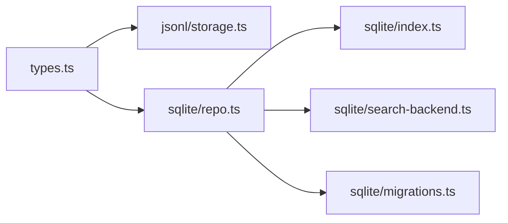

# 历史管理

<cite>
**本文引用的文件**
- [packages/agent/src/harness/session/types.ts](file://packages/agent/src/harness/session/types.ts)
- [packages/agent/src/harness/session/jsonl/storage.ts](file://packages/agent/src/harness/session/jsonl/storage.ts)
- [packages/session-backends/sqlite-node/src/index.ts](file://packages/session-backends/sqlite-node/src/index.ts)
- [packages/session-backends/sqlite-node/src/sqlite/index.ts](file://packages/session-backends/sqlite-node/src/sqlite/index.ts)
- [packages/session-backends/sqlite-node/src/sqlite/repo.ts](file://packages/session-backends/sqlite-node/src/sqlite/repo.ts)
- [packages/session-backends/sqlite-node/src/sqlite/search-backend.ts](file://packages/session-backends/sqlite-node/src/sqlite/search-backend.ts)
- [packages/session-backends/sqlite-node/src/sqlite/migrations.ts](file://packages/session-backends/sqlite-node/src/sqlite/migrations.ts)
</cite>

## 目录
1. [简介](#简介)
2. [项目结构](#项目结构)
3. [核心组件](#核心组件)
4. [架构总览](#架构总览)
5. [详细组件分析](#详细组件分析)
6. [依赖关系分析](#依赖关系分析)
7. [性能考量](#性能考量)
8. [故障排查指南](#故障排查指南)
9. [结论](#结论)
10. [附录：API 参考](#附录api-参考)

## 简介
本文件为“历史管理系统”的权威技术文档，聚焦对话历史的存储结构与索引机制、压缩与归档策略、查询检索能力、迁移与版本兼容、操作 API、备份恢复以及隐私与访问控制。系统采用“事件溯源 + 分支（Lane）”模型，以 JSONL 日志作为持久化载体，并通过 SQLite 后端提供高性能查询与搜索能力。

## 项目结构
- 会话类型与接口定义位于 agent 包中，统一描述 Entry、Record、SessionStorage、SessionTree 等核心抽象。
- JSONL 存储实现将追加式写入与内存状态机结合，保证幂等、可恢复与原子发布。
- SQLite 后端封装数据库连接、事务与语句执行，并提供仓库、搜索后端与迁移工具。

**图示来源**
- [packages/agent/src/harness/session/types.ts:290-352](file://packages/agent/src/harness/session/types.ts#L290-L352)
- [packages/agent/src/harness/session/jsonl/storage.ts:48-277](file://packages/agent/src/harness/session/jsonl/storage.ts#L48-L277)
- [packages/session-backends/sqlite-node/src/index.ts:53-102](file://packages/session-backends/sqlite-node/src/index.ts#L53-L102)
- [packages/session-backends/sqlite-node/src/sqlite/repo.ts](file://packages/session-backends/sqlite-node/src/sqlite/repo.ts)
- [packages/session-backends/sqlite-node/src/sqlite/search-backend.ts](file://packages/session-backends/sqlite-node/src/sqlite/search-backend.ts)
- [packages/session-backends/sqlite-node/src/sqlite/migrations.ts](file://packages/session-backends/sqlite-node/src/sqlite/migrations.ts)

**章节来源**
- [packages/agent/src/harness/session/types.ts:290-352](file://packages/agent/src/harness/session/types.ts#L290-L352)
- [packages/agent/src/harness/session/jsonl/storage.ts:48-277](file://packages/agent/src/harness/session/jsonl/storage.ts#L48-L277)
- [packages/session-backends/sqlite-node/src/index.ts:53-102](file://packages/session-backends/sqlite-node/src/index.ts#L53-L102)

## 核心组件
- 会话类型与接口：定义消息、模型变更、思考级别变更、活跃工具变更、压缩摘要、分支摘要、自定义条目等；记录操作生命周期、工具调用、队列、用量统计等。
- JSONL 存储：基于追加写与内存状态机，支持分支（Lane）、元数据事实（名称、标签）、序列号与时间戳、原子发布与尾部修复。
- SQLite 后端：提供数据库封装、事务、语句执行、仓库管理与搜索后端，支撑高效查询与索引。

**章节来源**
- [packages/agent/src/harness/session/types.ts:14-215](file://packages/agent/src/harness/session/types.ts#L14-L215)
- [packages/agent/src/harness/session/types.ts:217-352](file://packages/agent/src/harness/session/types.ts#L217-L352)
- [packages/agent/src/harness/session/jsonl/storage.ts:48-277](file://packages/agent/src/harness/session/jsonl/storage.ts#L48-L277)
- [packages/session-backends/sqlite-node/src/index.ts:53-102](file://packages/session-backends/sqlite-node/src/index.ts#L53-L102)

## 架构总览
系统由三层构成：
- 抽象层：统一的数据模型与存储接口（Entry/Record/SessionStorage）。
- 存储层：JSONL 追加日志 + 内存状态机，确保强一致与可恢复性。
- 查询/索引层：SQLite 后端提供结构化查询、全文搜索与迁移管理。

**图示来源**
- [packages/agent/src/harness/session/jsonl/storage.ts:154-191](file://packages/agent/src/harness/session/jsonl/storage.ts#L154-L191)
- [packages/agent/src/harness/session/jsonl/storage.ts:267-276](file://packages/agent/src/harness/session/jsonl/storage.ts#L267-L276)
- [packages/session-backends/sqlite-node/src/index.ts:68-85](file://packages/session-backends/sqlite-node/src/index.ts#L68-L85)

## 详细组件分析

### 存储结构与索引机制
- 时间戳与序列号：每条 Entry/Record 均包含 seq（全局递增序列）与 timestamp（Unix ms），用于排序、增量同步与回放。
- 消息类型：Entry 支持 message、model_change、thinking_level_change、active_tools_change、compaction、branch_summary、custom 等；Record 覆盖 operation_started/finished、tool_started、queue_enqueued/cancelled、write_deferred、usage 等。
- 元数据管理：通过“事实（fact）”机制维护会话名称与条目标签；同时维护 SessionMetadata（id、createdAt、parentSessionId）。
- 分支（Lane）与树形结构：通过 Lane 指针与 parentId 构建有向无环图，支持分叉、合并与回溯。

**图示来源**
- [packages/agent/src/harness/session/types.ts:14-74](file://packages/agent/src/harness/session/types.ts#L14-L74)
- [packages/agent/src/harness/session/types.ts:80-215](file://packages/agent/src/harness/session/types.ts#L80-L215)

**章节来源**
- [packages/agent/src/harness/session/types.ts:14-215](file://packages/agent/src/harness/session/types.ts#L14-L215)
- [packages/agent/src/harness/session/types.ts:259-276](file://packages/agent/src/harness/session/types.ts#L259-L276)

### 压缩与归档策略
- 滚动窗口与保留尾部：压缩条目（CompactionEntry）携带 retainedTail，用于在压缩后仍保留最近的消息上下文，避免冷数据丢失影响交互体验。
- 增量存储：所有变更以追加方式写入 JSONL，避免重写历史；压缩仅生成新的摘要与保留片段，不破坏原有顺序。
- 冷热数据分离：热数据（最近消息与活跃 Lane）常驻内存并快速访问；冷数据（早期消息）可通过序列号或游标按需加载，减少内存占用。

**图示来源**
- [packages/agent/src/harness/session/types.ts:44-51](file://packages/agent/src/harness/session/types.ts#L44-L51)
- [packages/agent/src/harness/session/types.ts:190-201](file://packages/agent/src/harness/session/types.ts#L190-L201)

**章节来源**
- [packages/agent/src/harness/session/types.ts:44-51](file://packages/agent/src/harness/session/types.ts#L44-L51)
- [packages/agent/src/harness/session/types.ts:190-201](file://packages/agent/src/harness/session/types.ts#L190-L201)

### 历史查询与检索
- 多维度搜索：支持按类型（Entry.type/Record.type）、自定义类型（customType）、时间范围（afterSeq）、顺序（newestFirst/oldestFirst）、限制条数（limit）与游标（cursor）进行分页查询。
- 分支限定：可在指定分支范围内扫描（BranchBounds），支持从某起点到根的路径扫描，并可设置停止条件（stopAtType/stopAtId）。
- 记录级查询：支持按运行 ID（runId）、操作意图种类（operationKind）精确匹配，便于审计与调试。
- 搜索后端：SQLite 搜索后端提供高效索引与全文检索能力，适合大规模历史数据的快速定位。

**图示来源**
- [packages/agent/src/harness/session/types.ts:217-257](file://packages/agent/src/harness/session/types.ts#L217-L257)
- [packages/session-backends/sqlite-node/src/sqlite/search-backend.ts](file://packages/session-backends/sqlite-node/src/sqlite/search-backend.ts)

**章节来源**
- [packages/agent/src/harness/session/types.ts:217-257](file://packages/agent/src/harness/session/types.ts#L217-L257)
- [packages/session-backends/sqlite-node/src/sqlite/search-backend.ts](file://packages/session-backends/sqlite-node/src/sqlite/search-backend.ts)

### 迁移与版本兼容性
- 迁移脚本：通过 migrations.ts 管理数据库 schema 演进，确保不同版本间的平滑升级。
- 头部与编解码：JSONL 文件首行为 Header，解析失败会抛出错误；加载时自动修复未终止尾部与损坏的尾部行，保障健壮性。
- 版本兼容：Entry/Record 类型扩展通过判别字段（type）保持向后兼容；新增字段默认可选，旧客户端可忽略未知字段。

**图示来源**
- [packages/agent/src/harness/session/jsonl/storage.ts:69-108](file://packages/agent/src/harness/session/jsonl/storage.ts#L69-L108)
- [packages/session-backends/sqlite-node/src/sqlite/migrations.ts](file://packages/session-backends/sqlite-node/src/sqlite/migrations.ts)

**章节来源**
- [packages/agent/src/harness/session/jsonl/storage.ts:69-108](file://packages/agent/src/harness/session/jsonl/storage.ts#L69-L108)
- [packages/session-backends/sqlite-node/src/sqlite/migrations.ts](file://packages/session-backends/sqlite-node/src/sqlite/migrations.ts)

### 历史操作的 API 参考
- 追加
  - 追加消息：appendEntry({ type: "message", ... }, lane)
  - 追加记录：appendRecord({ type: "operation_started"/"tool_started"/... })
- 查询
  - 条目查询：findEntries({ type, customType, order, limit, cursor })
  - 分支查询：findEntriesOnBranch({ start, stopAtType, stopAtId, ... })
  - 记录查询：findRecords({ lane, type, runId, operationKind, afterSeq, order, limit })
  - 开放操作：findOpenOperations(lane, { limit })
- 导出
  - 获取日志：getLog({ afterSeq, limit }) 返回统一 LogItem 流，便于导出与审计
- 清理
  - 删除会话：delete(metadata)
  - 压缩：通过生成 compaction 条目与 retainedTail 实现逻辑清理与空间回收

**章节来源**
- [packages/agent/src/harness/session/types.ts:290-352](file://packages/agent/src/harness/session/types.ts#L290-L352)
- [packages/agent/src/harness/session/jsonl/storage.ts:154-221](file://packages/agent/src/harness/session/jsonl/storage.ts#L154-L221)

### 备份与恢复
- 备份
  - JSONL 文件可直接复制作为快照；由于追加写与原子发布，副本具备一致性。
  - SQLite 数据库可通过事务与只读模式进行在线备份。
- 恢复
  - 从 JSONL 恢复：load(path) 自动解析 Header 与 Mutation，修复尾部撕裂并重建内存状态。
  - 从 SQLite 恢复：重新创建数据库并执行迁移脚本，再导入数据。

**章节来源**
- [packages/agent/src/harness/session/jsonl/storage.ts:69-108](file://packages/agent/src/harness/session/jsonl/storage.ts#L69-L108)
- [packages/session-backends/sqlite-node/src/index.ts:68-85](file://packages/session-backends/sqlite-node/src/index.ts#L68-L85)

### 隐私保护与访问控制
- 最小权限原则：仅暴露必要的读写接口（如 appendEntry/findEntries），隐藏内部状态机细节。
- 敏感信息处理：建议在应用层对消息内容进行脱敏或加密后再写入；存储层不感知业务语义。
- 访问控制：建议通过上层服务对会话 ID 与路径进行鉴权，防止未授权访问；SQLite 文件与 JSONL 文件应受操作系统权限保护。

[本节为通用指导，不直接分析具体文件]

## 依赖关系分析
- JSONL 存储依赖文件系统抽象与编解码器，负责追加写与状态机更新。
- SQLite 后端依赖 node:sqlite，提供事务与语句执行；仓库层组合存储与搜索后端。
- 类型定义被 JSONL 与 SQLite 后端共同引用，保证数据结构一致性。

**图示来源**
- [packages/agent/src/harness/session/types.ts:290-352](file://packages/agent/src/harness/session/types.ts#L290-L352)
- [packages/agent/src/harness/session/jsonl/storage.ts:48-277](file://packages/agent/src/harness/session/jsonl/storage.ts#L48-L277)
- [packages/session-backends/sqlite-node/src/index.ts:53-102](file://packages/session-backends/sqlite-node/src/index.ts#L53-L102)
- [packages/session-backends/sqlite-node/src/sqlite/repo.ts](file://packages/session-backends/sqlite-node/src/sqlite/repo.ts)
- [packages/session-backends/sqlite-node/src/sqlite/search-backend.ts](file://packages/session-backends/sqlite-node/src/sqlite/search-backend.ts)
- [packages/session-backends/sqlite-node/src/sqlite/migrations.ts](file://packages/session-backends/sqlite-node/src/sqlite/migrations.ts)

**章节来源**
- [packages/agent/src/harness/session/types.ts:290-352](file://packages/agent/src/harness/session/types.ts#L290-L352)
- [packages/agent/src/harness/session/jsonl/storage.ts:48-277](file://packages/agent/src/harness/session/jsonl/storage.ts#L48-L277)
- [packages/session-backends/sqlite-node/src/index.ts:53-102](file://packages/session-backends/sqlite-node/src/index.ts#L53-L102)

## 性能考量
- 追加写与内存状态机：JSONL 追加写降低锁竞争，内存状态机加速热点读取。
- 游标与分页：通过 afterSeq 与 limit 实现高效分页，避免全表扫描。
- 压缩与保留尾部：压缩减少热路径长度，retainedTail 保证交互连续性。
- SQLite 索引：为常用查询字段建立索引（如 lane、type、runId、timestamp），提升检索性能。

[本节提供通用指导，不直接分析具体文件]

## 故障排查指南
- 文件损坏与尾部撕裂：加载时检测并自动修复未终止尾部，必要时回滚到有效前缀。
- 无效条目：遇到 invalid_entry 错误时检查 Entry 结构是否符合类型定义。
- 并发写入：JSONL 存储通过串行化队列（enqueue）保证追加顺序；SQLite 事务确保一致性。
- 迁移失败：检查 migrations 脚本与当前 schema 版本，必要时回滚并重放日志。

**章节来源**
- [packages/agent/src/harness/session/jsonl/storage.ts:69-108](file://packages/agent/src/harness/session/jsonl/storage.ts#L69-L108)
- [packages/agent/src/harness/session/jsonl/storage.ts:258-265](file://packages/agent/src/harness/session/jsonl/storage.ts#L258-L265)
- [packages/session-backends/sqlite-node/src/index.ts:68-85](file://packages/session-backends/sqlite-node/src/index.ts#L68-L85)

## 结论
本历史管理系统以事件溯源为核心，结合 JSONL 追加写与 SQLite 索引，实现了高可靠、可扩展、易检索的对话历史管理。通过压缩与保留尾部策略平衡了性能与可用性；通过迁移与修复机制保障长期稳定性。建议在生产环境中配合严格的访问控制与备份策略，以确保数据安全与合规。

[本节为总结，不直接分析具体文件]

## 附录：API 参考
- 会话存储接口（SessionStorage）
  - getMetadata/getLanes/createLane/moveLane
  - appendEntry/appendRecord
  - getEntry/findEntries/findEntriesOnBranch/findRecords/findOpenOperations/getLog
  - getName/setName/getLabel/setLabel/getStats
- 查询参数
  - EntryQuery：type/customType/order/limit/cursor
  - BranchBounds：start/stopAtType/stopAtId
  - RecordQuery：lane/type/runId/operationKind/afterSeq/order/limit
- 仓库接口（SessionRepo）
  - create/open/list/delete/fork

**章节来源**
- [packages/agent/src/harness/session/types.ts:217-373](file://packages/agent/src/harness/session/types.ts#L217-L373)