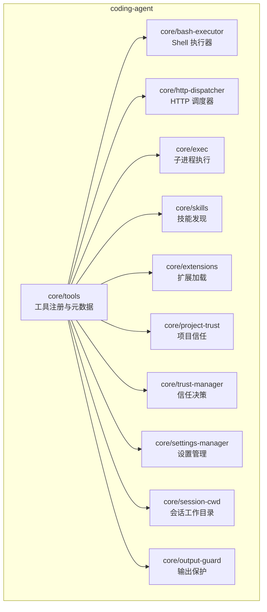
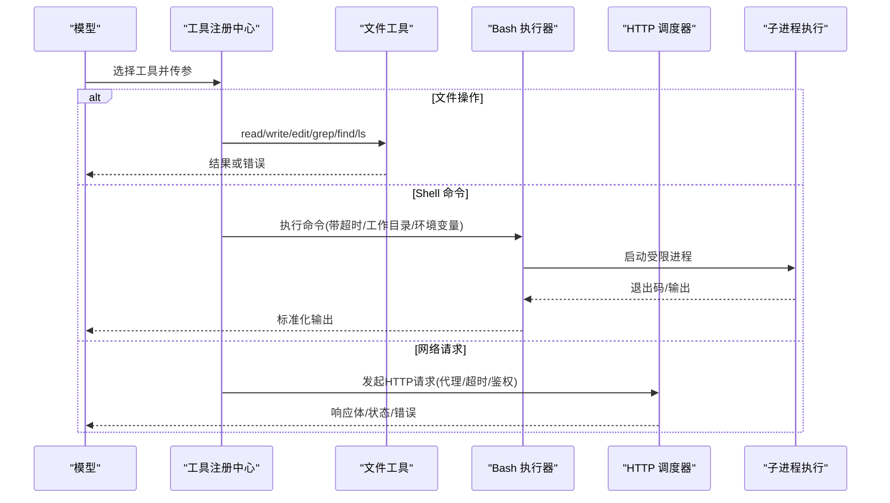
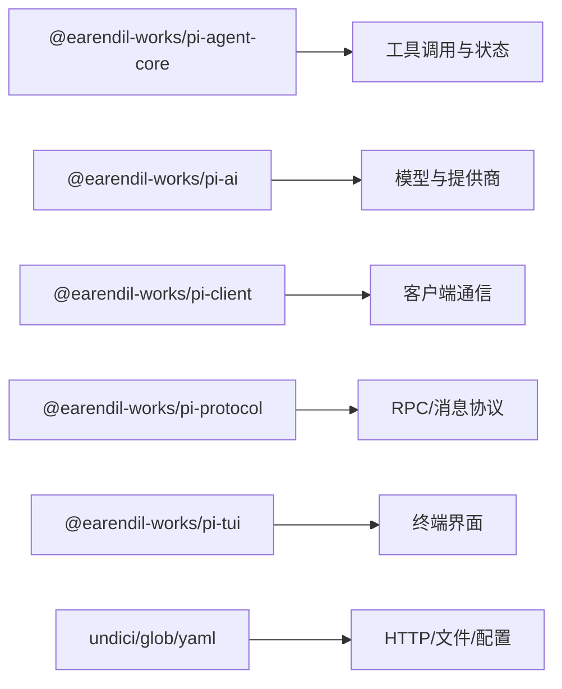

# 内置工具

<cite>
**本文引用的文件**
- [packages/coding-agent/README.md](file://packages/coding-agent/README.md)
- [packages/coding-agent/package.json](file://packages/coding-agent/package.json)
- [packages/coding-agent/src/core/tools/index.ts](file://packages/coding-agent/src/core/tools/index.ts)
- [packages/coding-agent/src/core/bash-executor.ts](file://packages/coding-agent/src/core/bash-executor.ts)
- [packages/coding-agent/src/core/http-dispatcher.ts](file://packages/coding-agent/src/core/http-dispatcher.ts)
- [packages/coding-agent/src/core/exec.ts](file://packages/coding-agent/src/core/exec.ts)
- [packages/coding-agent/src/core/skills.ts](file://packages/coding-agent/src/core/skills.ts)
- [packages/coding-agent/src/core/extensions.ts](file://packages/coding-agent/src/core/extensions.ts)
- [packages/coding-agent/src/core/project-trust.ts](file://packages/coding-agent/src/core/project-trust.ts)
- [packages/coding-agent/src/core/trust-manager.ts](file://packages/coding-agent/src/core/trust-manager.ts)
- [packages/coding-agent/src/core/settings-manager.ts](file://packages/coding-agent/src/core/settings-manager.ts)
- [packages/coding-agent/src/core/session-cwd.ts](file://packages/coding-agent/src/core/session-cwd.ts)
- [packages/coding-agent/src/core/output-guard.ts](file://packages/coding-agent/src/core/output-guard.ts)
- [packages/coding-agent/src/core/model-runtime.ts](file://packages/coding-agent/src/core/model-runtime.ts)
- [packages/agent/package.json](file://packages/agent/package.json)
- [README.md](file://README.md)
</cite>

## 目录
1. [简介](#简介)
2. [项目结构](#项目结构)
3. [核心组件](#核心组件)
4. [架构总览](#架构总览)
5. [详细组件分析](#详细组件分析)
6. [依赖分析](#依赖分析)
7. [性能考虑](#性能考虑)
8. [故障排除指南](#故障排除指南)
9. [结论](#结论)
10. [附录：API 参考与最佳实践](#附录api-参考与最佳实践)

## 简介
本文件为 Pi 的“内置工具”提供系统化、可操作的文档。Pi 默认提供一组可直接被模型调用的工具，涵盖文件系统操作（读取、写入、编辑）、命令执行（shell 命令与进程管理）、网络请求（HTTP 客户端/API 调用）以及代码分析（搜索、查找、列表等）。同时说明安全限制与权限控制机制，并提供完整的 API 参考、使用示例与最佳实践，帮助你在不同场景下高效、安全地使用这些能力。

## 项目结构
Pi 的工具能力集中在 coding-agent 包中，通过 core/tools 暴露给 agent 运行时；bash 执行器负责安全的 shell 调用；http 调度器封装网络请求；技能与扩展提供可选增强；信任管理与设置管理器控制资源加载与行为开关。

图表来源
- [packages/coding-agent/src/core/tools/index.ts](file://packages/coding-agent/src/core/tools/index.ts)
- [packages/coding-agent/src/core/bash-executor.ts](file://packages/coding-agent/src/core/bash-executor.ts)
- [packages/coding-agent/src/core/http-dispatcher.ts](file://packages/coding-agent/src/core/http-dispatcher.ts)
- [packages/coding-agent/src/core/exec.ts](file://packages/coding-agent/src/core/exec.ts)
- [packages/coding-agent/src/core/skills.ts](file://packages/coding-agent/src/core/skills.ts)
- [packages/coding-agent/src/core/extensions.ts](file://packages/coding-agent/src/core/extensions.ts)
- [packages/coding-agent/src/core/project-trust.ts](file://packages/coding-agent/src/core/project-trust.ts)
- [packages/coding-agent/src/core/trust-manager.ts](file://packages/coding-agent/src/core/trust-manager.ts)
- [packages/coding-agent/src/core/settings-manager.ts](file://packages/coding-agent/src/core/settings-manager.ts)
- [packages/coding-agent/src/core/session-cwd.ts](file://packages/coding-agent/src/core/session-cwd.ts)
- [packages/coding-agent/src/core/output-guard.ts](file://packages/coding-agent/src/core/output-guard.ts)

章节来源
- [packages/coding-agent/README.md:578-587](file://packages/coding-agent/README.md#L578-L587)
- [packages/coding-agent/package.json:1-109](file://packages/coding-agent/package.json#L1-L109)

## 核心组件
- 工具注册中心：集中声明内置工具的元数据、参数模式与执行入口，供 agent 运行时发现和调用。
- Bash 执行器：在受限环境中执行 shell 命令，支持超时、工作目录隔离、环境变量注入与输出保护。
- HTTP 调度器：统一发起 HTTP 请求，支持代理、超时、重试、鉴权头注入与响应体限制。
- 子进程执行：以安全方式启动外部进程，限制可执行白名单、路径与工作目录。
- 技能与扩展：按需加载额外能力（如 MCP、自定义工具），受项目信任与设置控制。
- 信任与设置：基于项目信任与全局/项目级设置决定工具可用性、资源加载范围与行为策略。
- 会话上下文：将当前会话的工作目录、ID、模型信息等注入到工具执行环境。

章节来源
- [packages/coding-agent/src/core/tools/index.ts](file://packages/coding-agent/src/core/tools/index.ts)
- [packages/coding-agent/src/core/bash-executor.ts](file://packages/coding-agent/src/core/bash-executor.ts)
- [packages/coding-agent/src/core/http-dispatcher.ts](file://packages/coding-agent/src/core/http-dispatcher.ts)
- [packages/coding-agent/src/core/exec.ts](file://packages/coding-agent/src/core/exec.ts)
- [packages/coding-agent/src/core/skills.ts](file://packages/coding-agent/src/core/skills.ts)
- [packages/coding-agent/src/core/extensions.ts](file://packages/coding-agent/src/core/extensions.ts)
- [packages/coding-agent/src/core/project-trust.ts](file://packages/coding-agent/src/core/project-trust.ts)
- [packages/coding-agent/src/core/trust-manager.ts](file://packages/coding-agent/src/core/trust-manager.ts)
- [packages/coding-agent/src/core/settings-manager.ts](file://packages/coding-agent/src/core/settings-manager.ts)
- [packages/coding-agent/src/core/session-cwd.ts](file://packages/coding-agent/src/core/session-cwd.ts)
- [packages/coding-agent/src/core/output-guard.ts](file://packages/coding-agent/src/core/output-guard.ts)

## 架构总览
下图展示从模型到工具的典型调用链：模型选择工具并传入参数 → 工具路由到具体实现（文件、bash、网络、代码分析）→ 执行器在受限环境中运行 → 结果返回给模型。

图表来源
- [packages/coding-agent/src/core/tools/index.ts](file://packages/coding-agent/src/core/tools/index.ts)
- [packages/coding-agent/src/core/bash-executor.ts](file://packages/coding-agent/src/core/bash-executor.ts)
- [packages/coding-agent/src/core/http-dispatcher.ts](file://packages/coding-agent/src/core/http-dispatcher.ts)
- [packages/coding-agent/src/core/exec.ts](file://packages/coding-agent/src/core/exec.ts)

## 详细组件分析

### 文件系统工具（read, write, edit, grep, find, ls）
- 用途
  - read：读取文件内容，适合查看配置、日志、源码片段。
  - write：创建或覆盖文件，用于生成脚本、配置文件、测试数据。
  - edit：对现有文件进行精确替换/插入，避免全量重写。
  - grep：按正则/关键字搜索文件内容，快速定位问题。
  - find：按名称/类型/大小/时间等条件查找文件。
  - ls：列出目录内容，支持递归与过滤。
- 参数与返回值
  - 各工具均通过工具注册中心的参数模式定义输入字段（如路径、匹配模式、替换规则、选项开关）。
  - 返回值通常为结构化对象：包含成功标志、输出文本、受影响行数/文件数、错误信息。
- 安全与权限
  - 工作目录隔离：所有相对路径基于会话工作目录解析。
  - 路径校验：禁止访问系统关键目录（可通过扩展或策略进一步收紧）。
  - 大文件保护：读/写时限制最大体积，防止内存耗尽。
  - 变更审计：write/edit 建议配合版本控制或快照。
- 使用示例
  - 读取某配置文件并摘要其关键项。
  - 批量替换函数签名并验证影响范围。
  - 搜索未使用的导入并清理。
  - 根据文件名模式收集待测试文件列表。
- 最佳实践
  - 优先使用 edit 做最小化修改，减少误改风险。
  - 使用 grep/find 先评估范围，再执行 write/edit。
  - 对敏感文件启用只读工具集（见 CLI 工具白名单）。

章节来源
- [packages/coding-agent/README.md:578-587](file://packages/coding-agent/README.md#L578-L587)
- [packages/coding-agent/src/core/tools/index.ts](file://packages/coding-agent/src/core/tools/index.ts)
- [packages/coding-agent/src/core/session-cwd.ts](file://packages/coding-agent/src/core/session-cwd.ts)
- [packages/coding-agent/src/core/output-guard.ts](file://packages/coding-agent/src/core/output-guard.ts)

### 命令执行工具（bash）
- 用途
  - 执行 shell 命令，安装依赖、运行测试、构建产物、查询系统信息。
- 参数与返回值
  - 参数包括命令字符串、工作目录、超时、是否合并标准错误、环境变量注入等。
  - 返回标准化输出（stdout/stderr）、退出码、耗时与错误详情。
- 安全与权限
  - 无内置权限弹窗：默认以当前用户权限运行，需容器化或沙箱隔离。
  - 超时与资源限制：防止长时间挂起或资源滥用。
  - 工作目录隔离：限制命令作用域。
  - 环境变量：自动注入会话元数据（会话 ID、模型、推理级别等）。
- 使用示例
  - 运行 lint/test/build 流水线。
  - 查询磁盘/内存使用情况辅助诊断。
  - 拉取远程仓库或更新依赖。
- 最佳实践
  - 始终设置合理超时与输出限制。
  - 对破坏性命令（rm、格式化、部署）增加确认流程（可通过扩展实现）。
  - 结合只读工具集在非交互模式下仅允许查询类命令。

章节来源
- [packages/coding-agent/README.md:578-587](file://packages/coding-agent/README.md#L578-L587)
- [packages/coding-agent/src/core/bash-executor.ts](file://packages/coding-agent/src/core/bash-executor.ts)
- [packages/coding-agent/src/core/exec.ts](file://packages/coding-agent/src/core/exec.ts)
- [packages/coding-agent/src/core/session-cwd.ts](file://packages/coding-agent/src/core/session-cwd.ts)

### 网络请求工具（HTTP 客户端 / API 调用）
- 用途
  - 发起 HTTP/HTTPS 请求，调用第三方 API、拉取资源、上报遥测等。
- 参数与返回值
  - 参数包括 URL、方法、头部、查询参数、请求体、超时、重试策略、代理等。
  - 返回状态码、响应头、响应体（可限制大小）、错误信息。
- 安全与权限
  - 可配置代理与证书策略，限制出站域名（通过扩展或网关）。
  - 支持鉴权头注入（如 Token、签名）。
  - 输出保护：防止超大响应导致内存压力。
- 使用示例
  - 调用代码托管平台 API 获取 PR 列表。
  - 拉取远程配置或模板。
  - 向内部服务提交指标或事件。
- 最佳实践
  - 设置合理的超时与重试退避。
  - 对敏感接口启用最小权限令牌与域名白名单。
  - 缓存热点响应以减少重复请求。

章节来源
- [packages/coding-agent/src/core/http-dispatcher.ts](file://packages/coding-agent/src/core/http-dispatcher.ts)
- [packages/coding-agent/src/core/output-guard.ts](file://packages/coding-agent/src/core/output-guard.ts)

### 代码分析工具（grep, find, ls）
- 用途
  - 快速定位代码中的符号、引用、潜在问题；统计文件规模与分布。
- 参数与返回值
  - 支持正则表达式、忽略大小写、递归搜索、按扩展名过滤、按大小/时间筛选等。
  - 返回匹配条目列表、命中数量、耗时与错误。
- 安全与权限
  - 限制扫描深度与文件大小，避免阻塞。
  - 忽略常见无关目录（node_modules、dist 等）。
- 使用示例
  - 查找废弃 API 的调用点。
  - 统计新增/删除的文件。
  - 定位未使用的常量或函数。
- 最佳实践
  - 先用 find 缩小范围，再用 grep 精确定位。
  - 结合版本控制 diff 提高准确性。

章节来源
- [packages/coding-agent/README.md:578-587](file://packages/coding-agent/README.md#L578-L587)
- [packages/coding-agent/src/core/tools/index.ts](file://packages/coding-agent/src/core/tools/index.ts)

### 技能与扩展（Skills & Extensions）
- 用途
  - 技能：按需的能力包，遵循 Agent Skills 标准，通过 /skill:name 触发。
  - 扩展：TypeScript 模块，可注册自定义工具、命令、UI、事件处理器等。
- 安全与权限
  - 受项目信任控制：仅在信任的项目中加载本地扩展与技能。
  - 可扩展权限门控与路径保护（由扩展自行实现）。
- 使用示例
  - 安装第三方 pi 包以增强工具集。
  - 编写扩展实现 MCP 集成或自定义审批流。
- 最佳实践
  - 谨慎审查第三方包源码。
  - 在生产环境使用最小可用工具集。

章节来源
- [packages/coding-agent/README.md:353-437](file://packages/coding-agent/README.md#L353-L437)
- [packages/coding-agent/src/core/skills.ts](file://packages/coding-agent/src/core/skills.ts)
- [packages/coding-agent/src/core/extensions.ts](file://packages/coding-agent/src/core/extensions.ts)
- [packages/coding-agent/src/core/project-trust.ts](file://packages/coding-agent/src/core/project-trust.ts)
- [packages/coding-agent/src/core/trust-manager.ts](file://packages/coding-agent/src/core/trust-manager.ts)

### 信任管理与设置
- 项目信任
  - 交互式启动时询问是否信任包含本地配置/资源/技能的项目目录。
  - 非交互模式通过默认策略决定是否加载项目资源。
- 设置管理
  - 全局与项目级 settings.json 控制工具可用性、传输偏好、缓存策略等。
- 使用建议
  - 在 CI 或非交互场景中明确指定 --approve/--no-approve。
  - 通过 CLI 工具白名单/黑名单精准控制可用工具。

章节来源
- [packages/coding-agent/README.md:295-317](file://packages/coding-agent/README.md#L295-L317)
- [packages/coding-agent/src/core/project-trust.ts](file://packages/coding-agent/src/core/project-trust.ts)
- [packages/coding-agent/src/core/trust-manager.ts](file://packages/coding-agent/src/core/trust-manager.ts)
- [packages/coding-agent/src/core/settings-manager.ts](file://packages/coding-agent/src/core/settings-manager.ts)

## 依赖分析
- 运行时依赖
  - agent-core：提供工具调用与状态管理。
  - ai：多提供商 LLM 抽象。
  - client/protocol/tui：交互与协议层。
  - 其他：undici（HTTP）、glob/minimatch（文件匹配）、yaml（配置）等。
- 工具可见性
  - 通过 CLI 的 --tools/--exclude-tools 控制内置工具集合。
  - 扩展与技能可动态注册新工具，受信任与设置约束。

图表来源
- [packages/agent/package.json:1-69](file://packages/agent/package.json#L1-L69)
- [packages/coding-agent/package.json:1-109](file://packages/coding-agent/package.json#L1-L109)

章节来源
- [packages/agent/package.json:1-69](file://packages/agent/package.json#L1-L69)
- [packages/coding-agent/package.json:1-109](file://packages/coding-agent/package.json#L1-L109)

## 性能考虑
- 文件工具
  - 大文件读写应分块处理；优先使用 edit 减少 IO。
  - 搜索前用 find 缩小范围，避免全仓扫描。
- Bash 工具
  - 设置合理超时；避免后台长任务；合并输出减少往返。
  - 利用缓存与并行度控制（如并发测试）提升吞吐。
- HTTP 工具
  - 启用连接复用与缓存；对幂等请求加缓存键。
  - 限制响应体大小；失败重试采用指数退避。
- 通用
  - 使用只读工具集降低副作用与锁竞争。
  - 在 CI 中预热依赖与缓存目录。

[本节为通用指导，不直接分析具体文件]

## 故障排除指南
- 无法执行 bash 命令
  - 检查是否处于信任项目；确认工作目录与权限；查看超时与输出限制。
  - 参考会话环境变量是否正确注入。
- 文件读写失败
  - 确认路径解析基于会话工作目录；检查目标目录是否存在与可写。
  - 大文件被拒绝：调整大小限制或分批处理。
- HTTP 请求失败
  - 检查代理、证书与域名白名单；确认鉴权头正确。
  - 增大超时或启用重试；捕获并记录错误详情。
- 工具不可用
  - 使用 CLI 的 --tools/--exclude-tools 显式启用/禁用工具。
  - 非交互模式注意默认项目信任策略。

章节来源
- [packages/coding-agent/README.md:578-617](file://packages/coding-agent/README.md#L578-L617)
- [packages/coding-agent/src/core/bash-executor.ts](file://packages/coding-agent/src/core/bash-executor.ts)
- [packages/coding-agent/src/core/http-dispatcher.ts](file://packages/coding-agent/src/core/http-dispatcher.ts)
- [packages/coding-agent/src/core/project-trust.ts](file://packages/coding-agent/src/core/project-trust.ts)

## 结论
Pi 的内置工具围绕“安全、可控、可扩展”的原则设计：默认提供常用且实用的工具集，通过信任与设置精细控制行为，借助技能与扩展满足个性化需求。建议在开发中使用最小必要工具集，在 CI 与非交互场景强化限制与观测，在需要时通过扩展引入更严格的权限门控与审计。

[本节为总结性内容，不直接分析具体文件]

## 附录：API 参考与最佳实践

### 内置工具清单与用途
- read：读取文件内容。
- write：创建或覆盖文件。
- edit：对现有文件进行精确编辑。
- bash：执行 shell 命令。
- grep：按模式搜索文件内容。
- find：按条件查找文件。
- ls：列出目录内容。

章节来源
- [packages/coding-agent/README.md:578-587](file://packages/coding-agent/README.md#L578-L587)

### 工具启用与禁用（CLI）
- 白名单：--tools <list> 或 -t <list>
- 黑名单：--exclude-tools <list> 或 -xt <list>
- 禁用内置工具但保留扩展工具：--no-builtin-tools 或 -nbt
- 全部禁用：--no-tools 或 -nt

章节来源
- [packages/coding-agent/README.md:578-587](file://packages/coding-agent/README.md#L578-L587)

### Bash 工具安全与环境
- 默认无权限弹窗：以当前进程权限运行，建议使用容器/沙箱。
- 会话环境变量：PI_SESSION_ID、PI_SESSION_FILE、PI_PROVIDER、PI_MODEL、PI_REASONING_LEVEL。
- 工作目录隔离：相对路径基于会话工作目录。

章节来源
- [packages/coding-agent/README.md:665-690](file://packages/coding-agent/README.md#L665-L690)
- [packages/coding-agent/src/core/session-cwd.ts](file://packages/coding-agent/src/core/session-cwd.ts)

### HTTP 工具要点
- 支持代理、超时、重试、鉴权头注入。
- 建议限制响应体大小与域名白名单（通过扩展或网关）。

章节来源
- [packages/coding-agent/src/core/http-dispatcher.ts](file://packages/coding-agent/src/core/http-dispatcher.ts)

### 安全与权限控制机制
- 项目信任：决定是否加载项目本地设置、资源与扩展。
- 设置管理：全局与项目级 settings.json 控制行为。
- 输出保护：限制输出大小，防止内存压力。
- 容器化建议：如需更强边界，使用容器或沙箱隔离。

章节来源
- [packages/coding-agent/README.md:295-317](file://packages/coding-agent/README.md#L295-L317)
- [packages/coding-agent/src/core/project-trust.ts](file://packages/coding-agent/src/core/project-trust.ts)
- [packages/coding-agent/src/core/output-guard.ts](file://packages/coding-agent/src/core/output-guard.ts)
- [README.md:38-47](file://README.md#L38-L47)

### 常见使用场景
- 只读审查：仅启用 read/grep/find/ls，避免任何写入。
- 自动化流水线：在 CI 中以 --no-tools 或严格白名单运行，确保可预测行为。
- 交互式重构：结合 edit/find/grep 进行小步快跑的重构与验证。
- 远程集成：通过 HTTP 工具拉取配置或上报指标，配合缓存与重试。

[本节为概念性内容，不直接分析具体文件]

### 最佳实践清单
- 明确工具白名单，最小权限原则。
- 为 bash 设置合理超时与输出限制。
- 对大文件与高频请求启用缓存与限流。
- 使用项目信任与设置管理控制资源加载范围。
- 在扩展中实现自定义权限门控与审计。

[本节为通用指导，不直接分析具体文件]