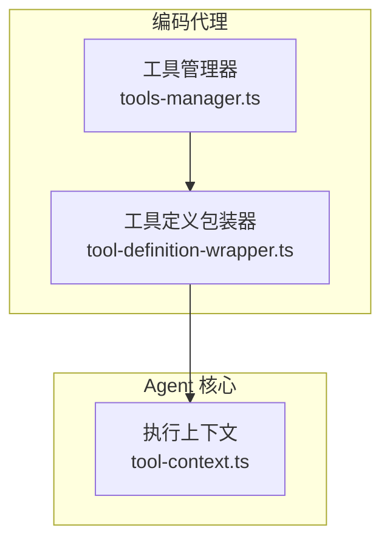
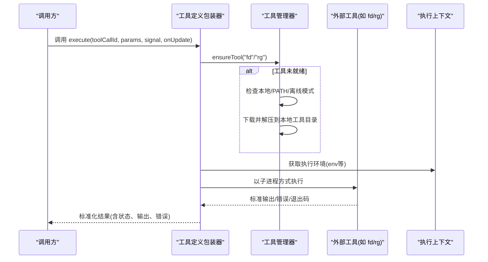
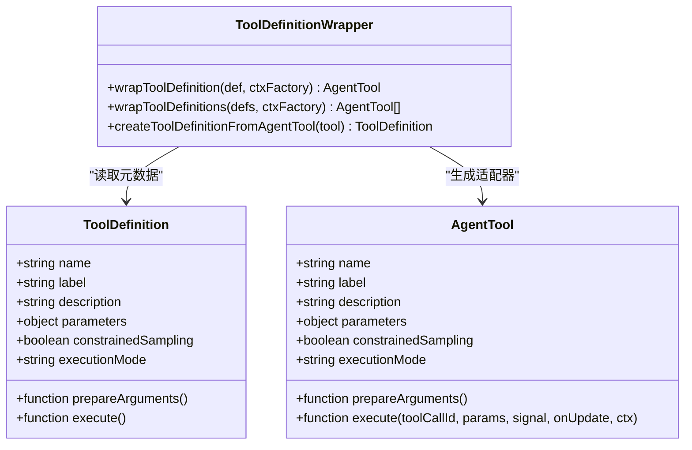
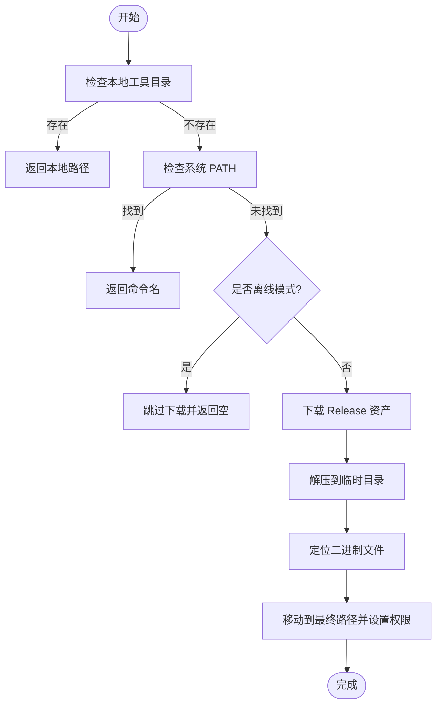
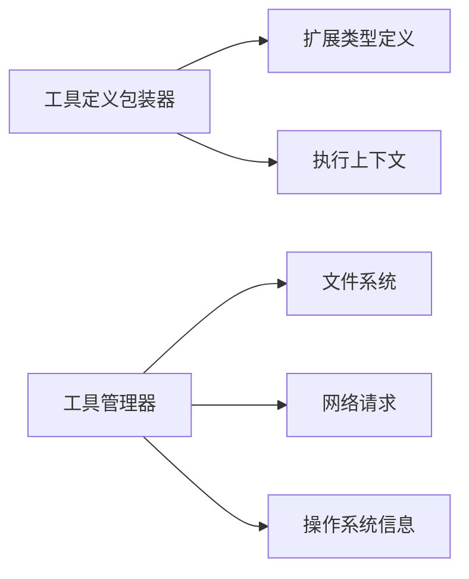

# 工具执行引擎

<cite>
**本文引用的文件**
- [packages/coding-agent/src/core/tools/tool-definition-wrapper.ts](file://packages/coding-agent/src/core/tools/tool-definition-wrapper.ts)
- [packages/coding-agent/src/utils/tools-manager.ts](file://packages/coding-agent/src/utils/tools-manager.ts)
- [packages/agent/src/harness/tools/tool-context.ts](file://packages/agent/src/harness/tools/tool-context.ts)
</cite>

## 目录
1. [简介](#简介)
2. [项目结构](#项目结构)
3. [核心组件](#核心组件)
4. [架构总览](#架构总览)
5. [详细组件分析](#详细组件分析)
6. [依赖关系分析](#依赖关系分析)
7. [性能考虑](#性能考虑)
8. [故障诊断指南](#故障诊断指南)
9. [结论](#结论)
10. [附录](#附录)

## 简介
本文件面向“工具执行引擎”，聚焦以下目标：
- 工具解析、参数绑定、执行调度与结果处理的核心机制
- 安全沙箱机制（权限控制、资源限制、输入验证）
- 并发控制与错误恢复
- 缓存策略与性能优化
- 监控与日志记录
- 性能分析与故障诊断方法
- 版本管理与兼容性处理

说明：本文基于仓库中已实现的工具定义包装器、工具管理器（下载与安装）、以及执行上下文接口进行系统化梳理，并结合通用工程实践给出可操作的指导。

## 项目结构
围绕工具执行的关键代码分布在三个位置：
- 工具定义包装：将扩展侧的 ToolDefinition 适配为核心运行时所需的 AgentTool，统一执行入口与元数据
- 工具管理：负责外部二进制工具（如 fd、rg）的自动发现、下载、解压与安装，提供 getToolPath/ensureTool 等能力
- 执行上下文：为内置执行类工具提供运行环境上下文（如环境变量、工作目录等）

图表来源
- [packages/coding-agent/src/core/tools/tool-definition-wrapper.ts:1-48](file://packages/coding-agent/src/core/tools/tool-definition-wrapper.ts#L1-L48)
- [packages/coding-agent/src/utils/tools-manager.ts:1-372](file://packages/coding-agent/src/utils/tools-manager.ts#L1-L372)
- [packages/agent/src/harness/tools/tool-context.ts:1-7](file://packages/agent/src/harness/tools/tool-context.ts#L1-L7)

章节来源
- [packages/coding-agent/src/core/tools/tool-definition-wrapper.ts:1-48](file://packages/coding-agent/src/core/tools/tool-definition-wrapper.ts#L1-L48)
- [packages/coding-agent/src/utils/tools-manager.ts:1-372](file://packages/coding-agent/src/utils/tools-manager.ts#L1-L372)
- [packages/agent/src/harness/tools/tool-context.ts:1-7](file://packages/agent/src/harness/tools/tool-context.ts#L1-L7)

## 核心组件
- 工具定义包装器
  - 作用：将扩展定义的 ToolDefinition 转换为 AgentTool，屏蔽差异，统一 execute 签名与执行模式
  - 关键点：名称、标签、描述、参数 schema、受限采样、参数预处理、执行模式、execute 调用链
- 工具管理器
  - 作用：确保外部工具可用；优先使用本地或系统 PATH，否则从 GitHub Releases 下载并解压到本地工具目录
  - 关键点：离线模式、平台/架构检测、归档格式兼容、并发解压隔离、权限设置、失败回退
- 执行上下文
  - 作用：为需要文件系统/Shell 能力的工具提供运行环境上下文（如环境变量）

章节来源
- [packages/coding-agent/src/core/tools/tool-definition-wrapper.ts:1-48](file://packages/coding-agent/src/core/tools/tool-definition-wrapper.ts#L1-L48)
- [packages/coding-agent/src/utils/tools-manager.ts:1-372](file://packages/coding-agent/src/utils/tools-manager.ts#L1-L372)
- [packages/agent/src/harness/tools/tool-context.ts:1-7](file://packages/agent/src/harness/tools/tool-context.ts#L1-L7)

## 架构总览
工具执行的整体流程如下：
- 上层通过 AgentTool 发起调用
- 包装器将调用转发至具体实现，必要时注入 ExtensionContext
- 若工具是外部二进制，先由工具管理器保证路径可用（本地/系统/下载）
- 工具在受控的执行上下文中运行，输出被收集并返回给调用方

图表来源
- [packages/coding-agent/src/core/tools/tool-definition-wrapper.ts:1-48](file://packages/coding-agent/src/core/tools/tool-definition-wrapper.ts#L1-L48)
- [packages/coding-agent/src/utils/tools-manager.ts:1-372](file://packages/coding-agent/src/utils/tools-manager.ts#L1-L372)
- [packages/agent/src/harness/tools/tool-context.ts:1-7](file://packages/agent/src/harness/tools/tool-context.ts#L1-L7)

## 详细组件分析

### 工具定义包装器（工具解析与参数绑定）
- 职责
  - 将扩展提供的 ToolDefinition 映射为 AgentTool，保留名称、标签、描述、参数 schema、受限采样、参数预处理、执行模式
  - 统一 execute 签名，支持传入 toolCallId、params、信号、进度回调与上下文
- 参数绑定
  - 通过 parameters 描述参数结构，prepareArguments 可在执行前对参数做规范化/校验
- 执行模式
  - 暴露 executionMode，便于后续按模式选择同步/异步/流式执行策略
- 结果处理
  - execute 返回值由上层统一封装为标准结果对象，包含状态、输出、错误信息

图表来源
- [packages/coding-agent/src/core/tools/tool-definition-wrapper.ts:1-48](file://packages/coding-agent/src/core/tools/tool-definition-wrapper.ts#L1-L48)

章节来源
- [packages/coding-agent/src/core/tools/tool-definition-wrapper.ts:1-48](file://packages/coding-agent/src/core/tools/tool-definition-wrapper.ts#L1-L48)

### 工具管理器（执行调度与结果处理）
- 工具发现与缓存
  - 优先查找本地工具目录，其次尝试系统 PATH；命中则直接复用，避免重复下载
- 下载与安装
  - 查询最新 Release 版本，根据平台/架构选择资产，下载后解压到临时目录，再移动到最终路径
  - 非 Windows 平台设置可执行权限
- 并发与隔离
  - 解压过程使用唯一临时目录，避免多实例并发冲突
- 错误处理
  - 网络请求失败、解压失败、找不到二进制等均抛出明确错误；提供静默模式用于降级提示
- 结果处理
  - 对外暴露 getToolPath/ensureTool，供上层在执行前确保工具可用

图表来源
- [packages/coding-agent/src/utils/tools-manager.ts:1-372](file://packages/coding-agent/src/utils/tools-manager.ts#L1-L372)

章节来源
- [packages/coding-agent/src/utils/tools-manager.ts:1-372](file://packages/coding-agent/src/utils/tools-manager.ts#L1-L372)

### 执行上下文（安全沙箱与资源限制）
- 上下文内容
  - 提供 ExecutionEnv，包含环境变量等运行期配置，供工具执行时读取
- 安全建议（结合上下文）
  - 在调用外部工具前，清理/限制环境变量（如移除敏感密钥）
  - 限制工作目录为只读或最小必要范围
  - 对命令行参数进行白名单校验，防止注入
- 资源限制（建议）
  - 通过子进程启动时的超时、内存上限、CPU 配额等机制限制资源消耗
  - 对大输出采用流式处理，避免一次性加载到内存

章节来源
- [packages/agent/src/harness/tools/tool-context.ts:1-7](file://packages/agent/src/harness/tools/tool-context.ts#L1-L7)

## 依赖关系分析
- 工具定义包装器依赖扩展类型定义，但不直接依赖具体工具实现，保持松耦合
- 工具管理器依赖 Node.js 标准库（fs、child_process、os、path、stream），以及网络请求辅助函数
- 执行上下文仅暴露最小接口，降低与上层工具的耦合度

图表来源
- [packages/coding-agent/src/core/tools/tool-definition-wrapper.ts:1-48](file://packages/coding-agent/src/core/tools/tool-definition-wrapper.ts#L1-L48)
- [packages/coding-agent/src/utils/tools-manager.ts:1-372](file://packages/coding-agent/src/utils/tools-manager.ts#L1-L372)
- [packages/agent/src/harness/tools/tool-context.ts:1-7](file://packages/agent/src/harness/tools/tool-context.ts#L1-L7)

章节来源
- [packages/coding-agent/src/core/tools/tool-definition-wrapper.ts:1-48](file://packages/coding-agent/src/core/tools/tool-definition-wrapper.ts#L1-L48)
- [packages/coding-agent/src/utils/tools-manager.ts:1-372](file://packages/coding-agent/src/utils/tools-manager.ts#L1-L372)
- [packages/agent/src/harness/tools/tool-context.ts:1-7](file://packages/agent/src/harness/tools/tool-context.ts#L1-L7)

## 性能考虑
- 工具路径缓存
  - 首次发现后将工具路径缓存于本地目录，后续直接复用，减少网络与 I/O 开销
- 并行下载与解压隔离
  - 不同工具的下载/解压使用独立临时目录，避免竞争条件
- 流式传输
  - 下载与解压使用流式管道，降低内存占用
- 可选降级
  - 支持离线模式与静默模式，在网络不可用时快速失败，不影响主流程

[本节为通用性能建议，不直接分析具体文件]

## 故障诊断指南
- 常见问题
  - 工具未找到：检查本地目录与系统 PATH；确认离线模式是否启用
  - 下载失败：检查网络连通性与 GitHub API 可达性；关注超时与重试
  - 解压失败：确认系统 tar/unzip/powershell 可用性；查看错误堆栈中的命令失败原因
  - 权限问题：非 Windows 平台需确保二进制可执行位正确设置
- 诊断步骤
  - 启用更详细的日志输出，记录工具发现、下载、解压、移动的全过程
  - 捕获子进程执行的 stdout/stderr 与退出码，定位具体失败点
  - 在 Android/Termux 环境下，优先使用 pkg 安装对应包

章节来源
- [packages/coding-agent/src/utils/tools-manager.ts:1-372](file://packages/coding-agent/src/utils/tools-manager.ts#L1-L372)

## 结论
- 工具执行引擎通过“定义包装 + 工具管理 + 执行上下文”三层解耦，实现了可扩展、可维护的工具体系
- 工具管理器提供了完善的跨平台工具获取与安装能力，具备离线与静默降级策略
- 建议在工具执行层加强安全沙箱（参数白名单、环境变量清洗、资源限制）与可观测性（结构化日志、指标上报）
- 通过缓存与流式处理，整体性能与稳定性得到保障

[本节为总结性内容，不直接分析具体文件]

## 附录

### 工具调用的安全沙箱机制（建议）
- 权限控制
  - 最小权限原则：仅授予工具必要的文件系统访问范围
  - 环境变量白名单：仅传递必需的环境变量，剔除敏感信息
- 资源限制
  - 子进程超时、内存上限、CPU 配额
  - 输出大小限制，避免 OOM
- 输入验证
  - 对工具参数进行严格校验与转义，防止注入攻击
  - 对文件路径进行规范化与白名单校验

[本节为通用安全建议，不直接分析具体文件]

### 并发控制与错误恢复（建议）
- 并发控制
  - 对工具执行进行限流与队列化，避免瞬时高并发导致系统抖动
- 错误恢复
  - 对网络与 I/O 异常进行重试与退避
  - 提供回滚机制：解压失败时清理临时目录，保证一致性

[本节为通用工程建议，不直接分析具体文件]

### 工具缓存策略与性能优化（建议）
- 缓存策略
  - 工具二进制本地缓存，按版本与平台维度组织
  - 元数据缓存：Release 列表与版本信息缓存，减少网络请求
- 性能优化
  - 预取常用工具，缩短冷启动时间
  - 使用并行下载但隔离解压，提升吞吐同时避免冲突

[本节为通用优化建议，不直接分析具体文件]

### 监控与日志记录（建议）
- 关键指标
  - 工具发现耗时、下载耗时、解压耗时、执行耗时
  - 失败率、重试次数、超时次数
- 日志规范
  - 结构化日志：包含工具名、版本、平台、错误码、堆栈
  - 分级日志：DEBUG/INFO/WARN/ERROR，便于生产排查

[本节为通用可观测性建议，不直接分析具体文件]

### 版本管理与兼容性处理（建议）
- 版本管理
  - 锁定工具版本或使用语义化版本约束，避免破坏性更新
  - 提供升级与回滚机制
- 兼容性
  - 针对不同平台/架构提供适配逻辑（如 Windows 的 PowerShell 解压回退）
  - 对旧版工具提供兼容层或迁移脚本

[本节为通用版本管理建议，不直接分析具体文件]