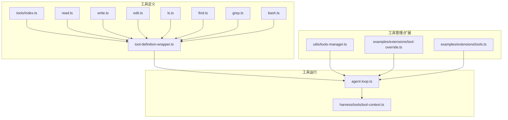
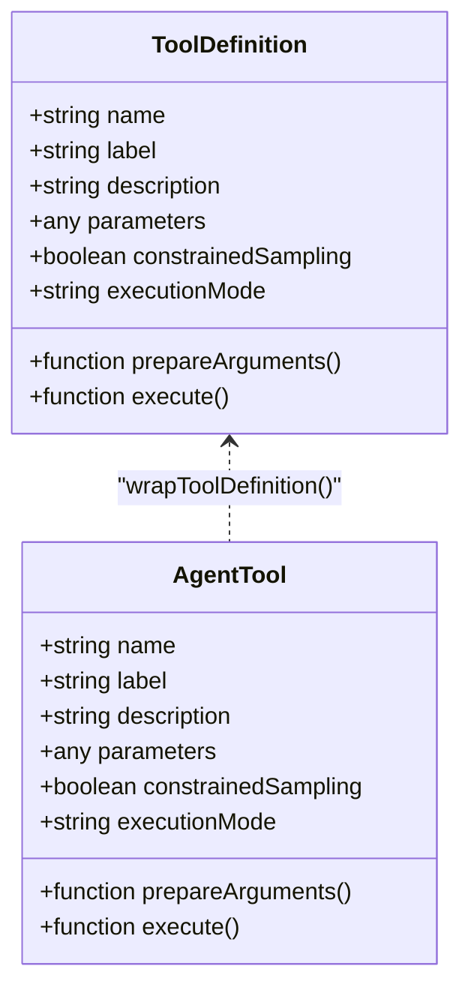
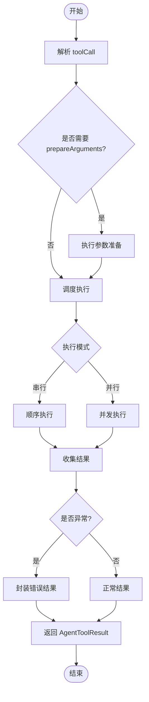
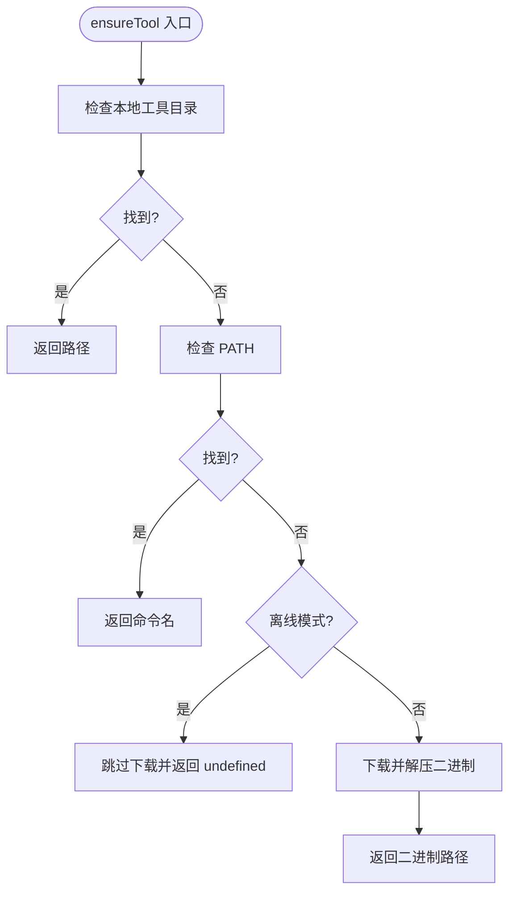
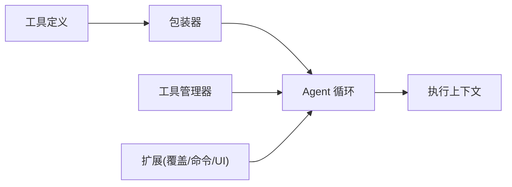

# 工具系统

<cite>
**本文引用的文件**
- [packages/coding-agent/src/core/tools/index.ts](file://packages/coding-agent/src/core/tools/index.ts)
- [packages/coding-agent/src/core/tools/read.ts](file://packages/coding-agent/src/core/tools/read.ts)
- [packages/coding-agent/src/core/tools/write.ts](file://packages/coding-agent/src/core/tools/write.ts)
- [packages/coding-agent/src/core/tools/edit.ts](file://packages/coding-agent/src/core/tools/edit.ts)
- [packages/coding-agent/src/core/tools/ls.ts](file://packages/coding-agent/src/core/tools/ls.ts)
- [packages/coding-agent/src/core/tools/find.ts](file://packages/coding-agent/src/core/tools/find.ts)
- [packages/coding-agent/src/core/tools/grep.ts](file://packages/coding-agent/src/core/tools/grep.ts)
- [packages/coding-agent/src/core/tools/bash.ts](file://packages/coding-agent/src/core/tools/bash.ts)
- [packages/coding-agent/src/core/tools/tool-definition-wrapper.ts](file://packages/coding-agent/src/core/tools/tool-definition-wrapper.ts)
- [packages/coding-agent/src/utils/tools-manager.ts](file://packages/coding-agent/src/utils/tools-manager.ts)
- [packages/agent/src/agent-loop.ts](file://packages/agent/src/agent-loop.ts)
- [packages/agent/src/harness/tools/tool-context.ts](file://packages/agent/src/harness/tools/tool-context.ts)
- [packages/coding-agent/examples/extensions/tool-override.ts](file://packages/coding-agent/examples/extensions/tool-override.ts)
- [packages/coding-agent/examples/extensions/tools.ts](file://packages/coding-agent/examples/extensions/tools.ts)
</cite>

## 目录
1. [简介](#简介)
2. [项目结构](#项目结构)
3. [核心组件](#核心组件)
4. [架构总览](#架构总览)
5. [详细组件分析](#详细组件分析)
6. [依赖关系分析](#依赖关系分析)
7. [性能考虑](#性能考虑)
8. [故障排查指南](#故障排查指南)
9. [结论](#结论)
10. [附录：API 参考与最佳实践](#附录api-参考与最佳实践)

## 简介
本文件为“工具系统”的权威文档，面向开发者与使用者，系统性说明工具框架的设计与实现，包括工具的注册、发现、参数校验、调用与执行流程；覆盖内置工具（文件系统操作、命令执行、搜索等）的功能与用法；提供自定义工具开发规范、安全与权限控制策略；并给出 API 参考、使用示例与性能优化建议。

## 项目结构
工具系统由三层构成：
- 工具定义层：以声明式方式描述工具名称、标签、描述、参数 Schema、执行模式与执行函数，并通过包装器适配到核心运行时所需的 AgentTool 接口。
- 工具运行层：Agent 循环负责解析模型返回的工具调用请求，准备参数、调度执行、收集结果并回写对话上下文。
- 工具管理与扩展层：提供工具安装/发现（如 fd、rg）、启用/禁用管理、以及通过扩展机制覆盖或增强内置工具的能力。



图表来源
- [packages/coding-agent/src/core/tools/tool-definition-wrapper.ts:1-48](file://packages/coding-agent/src/core/tools/tool-definition-wrapper.ts#L1-L48)
- [packages/agent/src/agent-loop.ts:411-500](file://packages/agent/src/agent-loop.ts#L411-L500)
- [packages/agent/src/harness/tools/tool-context.ts:1-7](file://packages/agent/src/harness/tools/tool-context.ts#L1-L7)
- [packages/coding-agent/src/utils/tools-manager.ts:1-372](file://packages/coding-agent/src/utils/tools-manager.ts#L1-L372)
- [packages/coding-agent/examples/extensions/tool-override.ts:1-145](file://packages/coding-agent/examples/extensions/tool-override.ts#L1-L145)
- [packages/coding-agent/examples/extensions/tools.ts:1-147](file://packages/coding-agent/examples/extensions/tools.ts#L1-L147)

章节来源
- [packages/coding-agent/src/core/tools/tool-definition-wrapper.ts:1-48](file://packages/coding-agent/src/core/tools/tool-definition-wrapper.ts#L1-L48)
- [packages/agent/src/agent-loop.ts:411-500](file://packages/agent/src/agent-loop.ts#L411-L500)
- [packages/coding-agent/src/utils/tools-manager.ts:1-372](file://packages/coding-agent/src/utils/tools-manager.ts#L1-L372)
- [packages/coding-agent/examples/extensions/tool-override.ts:1-145](file://packages/coding-agent/examples/extensions/tool-override.ts#L1-L145)
- [packages/coding-agent/examples/extensions/tools.ts:1-147](file://packages/coding-agent/examples/extensions/tools.ts#L1-L147)

## 核心组件
- 工具定义与包装：将扩展侧的 ToolDefinition 转换为 AgentTool，统一暴露 name、label、description、parameters、prepareArguments、executionMode、execute 等能力，供核心运行时调度。
- 工具执行管线：Agent 循环在收到模型的工具调用后，进行参数准备、并发/串行执行、错误封装与结果回写。
- 工具安装与发现：自动检测本地 PATH 或下载第三方二进制（如 fd、rg），支持离线模式与平台差异处理。
- 工具启用/禁用：通过扩展提供交互式 UI 选择当前会话启用的工具集合，并持久化到分支状态。
- 工具覆盖：扩展可注册同名工具替换内置实现，用于审计、访问控制、远程路由等。

章节来源
- [packages/coding-agent/src/core/tools/tool-definition-wrapper.ts:1-48](file://packages/coding-agent/src/core/tools/tool-definition-wrapper.ts#L1-L48)
- [packages/agent/src/agent-loop.ts:411-500](file://packages/agent/src/agent-loop.ts#L411-L500)
- [packages/coding-agent/src/utils/tools-manager.ts:1-372](file://packages/coding-agent/src/utils/tools-manager.ts#L1-L372)
- [packages/coding-agent/examples/extensions/tools.ts:1-147](file://packages/coding-agent/examples/extensions/tools.ts#L1-L147)
- [packages/coding-agent/examples/extensions/tool-override.ts:1-145](file://packages/coding-agent/examples/extensions/tool-override.ts#L1-L145)

## 架构总览
工具系统的执行时序如下：
- 模型返回包含 toolCall 的消息。
- Agent 循环根据工具名查找已注册的 AgentTool。
- 对参数执行 prepareArguments（可选）。
- 按配置串行或并行执行 execute。
- 将结果封装为 AgentToolResult 并追加到消息流。

```mermaid
sequenceDiagram
participant Model as "模型响应"
participant Loop as "Agent 循环"
participant Reg as "工具注册表"
participant Exec as "工具执行"
participant Ctx as "执行上下文"
Model->>Loop : "包含 toolCall 的消息"
Loop->>Reg : "按名称查找 AgentTool"
Reg-->>Loop : "返回工具对象"
Loop->>Loop : "prepareArguments(可选)"
Loop->>Exec : "execute(toolCallId, params, signal, onUpdate)"
Exec->>Ctx : "读取 env/cwd 等上下文"
Exec-->>Loop : "返回 AgentToolResult"
Loop-->>Model : "将结果写入消息流"
```

图表来源
- [packages/agent/src/agent-loop.ts:411-500](file://packages/agent/src/agent-loop.ts#L411-L500)
- [packages/agent/src/harness/tools/tool-context.ts:1-7](file://packages/agent/src/harness/tools/tool-context.ts#L1-L7)

## 详细组件分析

### 工具定义与包装
- 作用：将扩展定义的 ToolDefinition 适配为核心运行时所需的 AgentTool，确保统一的元数据与执行入口。
- 关键点：
  - 保留 name、label、description、parameters、constrainedSampling、prepareArguments、executionMode。
  - 在执行时注入 ExtensionContext（若未显式传入则通过工厂创建）。
  - 支持从已有 AgentTool 反推最小 ToolDefinition，便于内部注册。



图表来源
- [packages/coding-agent/src/core/tools/tool-definition-wrapper.ts:1-48](file://packages/coding-agent/src/core/tools/tool-definition-wrapper.ts#L1-L48)

章节来源
- [packages/coding-agent/src/core/tools/tool-definition-wrapper.ts:1-48](file://packages/coding-agent/src/core/tools/tool-definition-wrapper.ts#L1-L48)

### 工具执行管线（Agent 循环）
- 功能：解析工具调用、参数准备、执行调度（串行/并行）、错误封装与结果回写。
- 行为要点：
  - 当输出 token 限制导致参数被截断时，会提示重新发起完整参数的工具调用。
  - 支持批量工具调用的顺序保持与中止信号。
  - 错误会被封装为标准工具结果，避免中断整体流程。



图表来源
- [packages/agent/src/agent-loop.ts:411-500](file://packages/agent/src/agent-loop.ts#L411-L500)

章节来源
- [packages/agent/src/agent-loop.ts:411-500](file://packages/agent/src/agent-loop.ts#L411-L500)

### 工具安装与发现（fd、rg）
- 功能：检测系统 PATH 或本地工具目录是否存在 fd/rg，不存在时从 GitHub Releases 下载并解压至工具目录，支持多平台与离线模式。
- 关键点：
  - 优先检查本地工具目录，其次 PATH。
  - 通过 GitHub API 获取最新版本，构造资产名并下载。
  - 解压 tar.gz/zip，定位二进制并赋予执行权限（非 Windows）。
  - 支持 Android/Termux 特殊路径提示。
  - 可通过环境变量开启离线模式跳过下载。



图表来源
- [packages/coding-agent/src/utils/tools-manager.ts:1-372](file://packages/coding-agent/src/utils/tools-manager.ts#L1-L372)

章节来源
- [packages/coding-agent/src/utils/tools-manager.ts:1-372](file://packages/coding-agent/src/utils/tools-manager.ts#L1-L372)

### 工具启用/禁用（交互 UI）
- 功能：提供 /tools 命令打开 TUI 界面，勾选启用/禁用工具，实时生效并持久化到当前分支。
- 关键点：
  - 通过 pi.getAllTools() 获取可用工具列表。
  - 通过 pi.setActiveTools() 设置当前启用的工具集合。
  - 使用 pi.appendEntry() 保存状态，并在 session_start/session_tree 事件恢复。

章节来源
- [packages/coding-agent/examples/extensions/tools.ts:1-147](file://packages/coding-agent/examples/extensions/tools.ts#L1-L147)

### 工具覆盖（审计与访问控制）
- 功能：通过注册同名工具覆盖内置实现，实现对 read 的审计与敏感路径拦截。
- 关键点：
  - 使用 TypeBox 定义参数 Schema 进行输入校验。
  - 基于绝对路径匹配黑名单（如 .env、secrets、credentials、SSH/AWS/GPG 目录）。
  - 记录允许/拒绝访问日志，并返回结构化结果（含 details 标记）。
  - 不实现 renderCall/renderResult 时，自动使用内置渲染器。

章节来源
- [packages/coding-agent/examples/extensions/tool-override.ts:1-145](file://packages/coding-agent/examples/extensions/tool-override.ts#L1-L145)

### 内置工具概览
以下内置工具位于 core/tools 目录，均遵循统一的 ToolDefinition 规范并通过包装器适配到 AgentTool：
- 文件读取：read.ts
- 文件写入：write.ts
- 编辑与差异：edit.ts、edit-diff.ts
- 列出目录：ls.ts
- 递归查找：find.ts
- 文本搜索：grep.ts
- 命令执行：bash.ts
- 其他辅助：truncate.ts、path-utils.ts、render-utils.ts、output-accumulator.ts、file-mutation-queue.ts

章节来源
- [packages/coding-agent/src/core/tools/index.ts](file://packages/coding-agent/src/core/tools/index.ts)
- [packages/coding-agent/src/core/tools/read.ts](file://packages/coding-agent/src/core/tools/read.ts)
- [packages/coding-agent/src/core/tools/write.ts](file://packages/coding-agent/src/core/tools/write.ts)
- [packages/coding-agent/src/core/tools/edit.ts](file://packages/coding-agent/src/core/tools/edit.ts)
- [packages/coding-agent/src/core/tools/ls.ts](file://packages/coding-agent/src/core/tools/ls.ts)
- [packages/coding-agent/src/core/tools/find.ts](file://packages/coding-agent/src/core/tools/find.ts)
- [packages/coding-agent/src/core/tools/grep.ts](file://packages/coding-agent/src/core/tools/grep.ts)
- [packages/coding-agent/src/core/tools/bash.ts](file://packages/coding-agent/src/core/tools/bash.ts)

## 依赖关系分析
- 工具定义层依赖包装器，将扩展侧工具转为 AgentTool。
- Agent 循环依赖工具注册表与执行上下文，负责编排执行。
- 工具管理器依赖网络与文件系统，负责第三方工具的安装与发现。
- 扩展通过注册同名工具或命令，改变或增强系统行为。



图表来源
- [packages/coding-agent/src/core/tools/tool-definition-wrapper.ts:1-48](file://packages/coding-agent/src/core/tools/tool-definition-wrapper.ts#L1-L48)
- [packages/agent/src/agent-loop.ts:411-500](file://packages/agent/src/agent-loop.ts#L411-L500)
- [packages/coding-agent/src/utils/tools-manager.ts:1-372](file://packages/coding-agent/src/utils/tools-manager.ts#L1-L372)
- [packages/coding-agent/examples/extensions/tool-override.ts:1-145](file://packages/coding-agent/examples/extensions/tool-override.ts#L1-L145)
- [packages/coding-agent/examples/extensions/tools.ts:1-147](file://packages/coding-agent/examples/extensions/tools.ts#L1-L147)

章节来源
- [packages/coding-agent/src/core/tools/tool-definition-wrapper.ts:1-48](file://packages/coding-agent/src/core/tools/tool-definition-wrapper.ts#L1-L48)
- [packages/agent/src/agent-loop.ts:411-500](file://packages/agent/src/agent-loop.ts#L411-L500)
- [packages/coding-agent/src/utils/tools-manager.ts:1-372](file://packages/coding-agent/src/utils/tools-manager.ts#L1-L372)
- [packages/coding-agent/examples/extensions/tool-override.ts:1-145](file://packages/coding-agent/examples/extensions/tool-override.ts#L1-L145)
- [packages/coding-agent/examples/extensions/tools.ts:1-147](file://packages/coding-agent/examples/extensions/tools.ts#L1-L147)

## 性能考虑
- 工具执行模式：根据工具特性选择串行或并行执行，减少等待时间。
- 参数裁剪与截断：当模型输出受限时，提示重新发起完整参数的调用，避免无效执行。
- 工具安装缓存：本地工具目录复用已下载的二进制，避免重复下载与解压。
- 资源释放：下载完成后清理临时归档与解压目录，降低磁盘占用。
- I/O 节流：大文件读取/写入时采用分块与限长策略，防止内存峰值过高。

[本节为通用指导，不直接分析具体文件]

## 故障排查指南
- 工具不可用：
  - 检查本地工具目录与 PATH 是否包含所需命令。
  - 确认未启用离线模式；必要时手动安装对应包（Android/Termux）。
- 下载失败：
  - 检查网络连通性与 GitHub API 可达性。
  - 查看控制台输出的错误信息（超时、HTTP 状态码等）。
- 权限问题：
  - Unix 环境下确保二进制具备执行权限。
- 参数校验失败：
  - 检查扩展中定义的参数 Schema 是否与调用方一致。
- 执行异常：
  - 关注工具返回的错误结果与 details 字段，定位具体原因。

章节来源
- [packages/coding-agent/src/utils/tools-manager.ts:1-372](file://packages/coding-agent/src/utils/tools-manager.ts#L1-L372)
- [packages/coding-agent/examples/extensions/tool-override.ts:1-145](file://packages/coding-agent/examples/extensions/tool-override.ts#L1-L145)

## 结论
本工具系统通过“声明式定义 + 统一包装 + 核心调度 + 可扩展覆盖”的架构，实现了高内聚、低耦合的工具生态。内置工具覆盖常见文件与命令操作，扩展机制支持审计、访问控制与远程路由等高级场景。结合工具安装与发现、启用/禁用管理，用户可按需定制工作流。建议在复杂场景中优先使用参数校验、错误封装与结果细节，以获得更好的可观测性与可维护性。

[本节为总结，不直接分析具体文件]

## 附录：API 参考与最佳实践

### 工具接口规范（扩展侧）
- 必需字段
  - name：工具唯一标识
  - label：人类可读名称
  - description：工具用途说明
  - parameters：参数 Schema（建议使用类型库定义）
  - execute：执行函数，接收 toolCallId、params、signal、onUpdate、context
- 可选字段
  - constrainedSampling：是否受限采样
  - prepareArguments：参数预处理
  - executionMode：执行模式（串行/并行）
- 返回值
  - 标准工具结果（内容、详情、错误标记等）

章节来源
- [packages/coding-agent/src/core/tools/tool-definition-wrapper.ts:1-48](file://packages/coding-agent/src/core/tools/tool-definition-wrapper.ts#L1-L48)

### 内置工具方法签名（概述）
以下为各内置工具的职责与典型参数/返回约定（具体实现见对应文件）：
- read
  - 参数：路径、起始行、行数限制
  - 返回：文本内容与元信息（行数、截断标记等）
- write
  - 参数：路径、内容、写入模式
  - 返回：写入结果与元信息
- edit
  - 参数：路径、编辑指令/差异
  - 返回：编辑结果与变更摘要
- ls
  - 参数：目录路径、显示选项
  - 返回：条目列表与统计
- find
  - 参数：根路径、过滤条件
  - 返回：匹配文件/目录集合
- grep
  - 参数：搜索范围、正则/关键字
  - 返回：匹配结果与上下文
- bash
  - 参数：命令字符串、环境变量、工作目录
  - 返回：标准输出、错误输出、退出码

章节来源
- [packages/coding-agent/src/core/tools/read.ts](file://packages/coding-agent/src/core/tools/read.ts)
- [packages/coding-agent/src/core/tools/write.ts](file://packages/coding-agent/src/core/tools/write.ts)
- [packages/coding-agent/src/core/tools/edit.ts](file://packages/coding-agent/src/core/tools/edit.ts)
- [packages/coding-agent/src/core/tools/ls.ts](file://packages/coding-agent/src/core/tools/ls.ts)
- [packages/coding-agent/src/core/tools/find.ts](file://packages/coding-agent/src/core/tools/find.ts)
- [packages/coding-agent/src/core/tools/grep.ts](file://packages/coding-agent/src/core/tools/grep.ts)
- [packages/coding-agent/src/core/tools/bash.ts](file://packages/coding-agent/src/core/tools/bash.ts)

### 使用示例与最佳实践
- 覆盖内置工具以实现审计与访问控制：
  - 注册同名工具，拦截敏感路径，记录访问日志，返回结构化结果。
- 动态启用/禁用工具：
  - 通过交互 UI 选择工具集合并持久化，保证跨会话一致性。
- 参数校验与错误处理：
  - 使用类型库定义参数 Schema，提前捕获非法输入；在 execute 中返回明确的错误结果与 details。
- 性能优化：
  - 合理选择执行模式；对大文件读写采用分页与限长；利用本地工具缓存减少重复下载。

章节来源
- [packages/coding-agent/examples/extensions/tool-override.ts:1-145](file://packages/coding-agent/examples/extensions/tool-override.ts#L1-L145)
- [packages/coding-agent/examples/extensions/tools.ts:1-147](file://packages/coding-agent/examples/extensions/tools.ts#L1-L147)