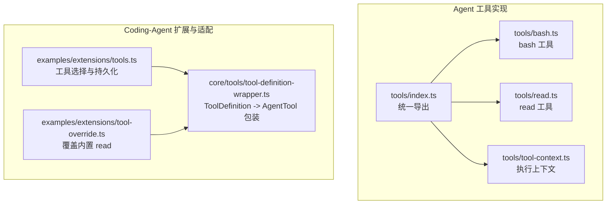
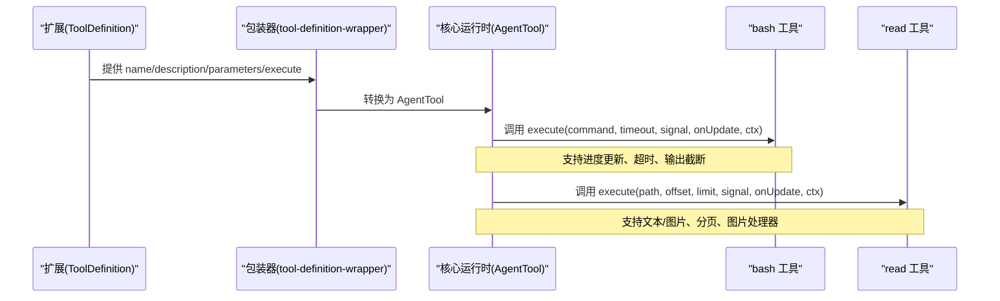
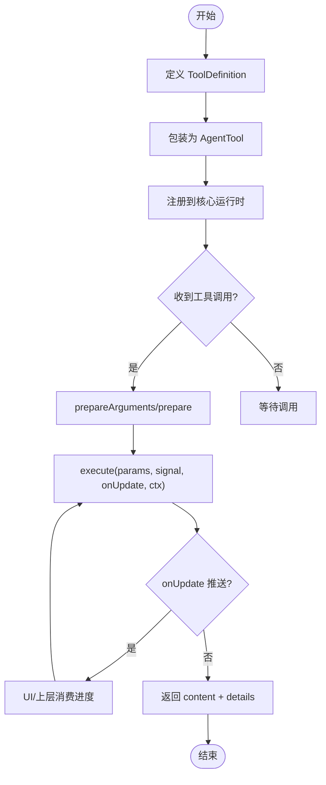
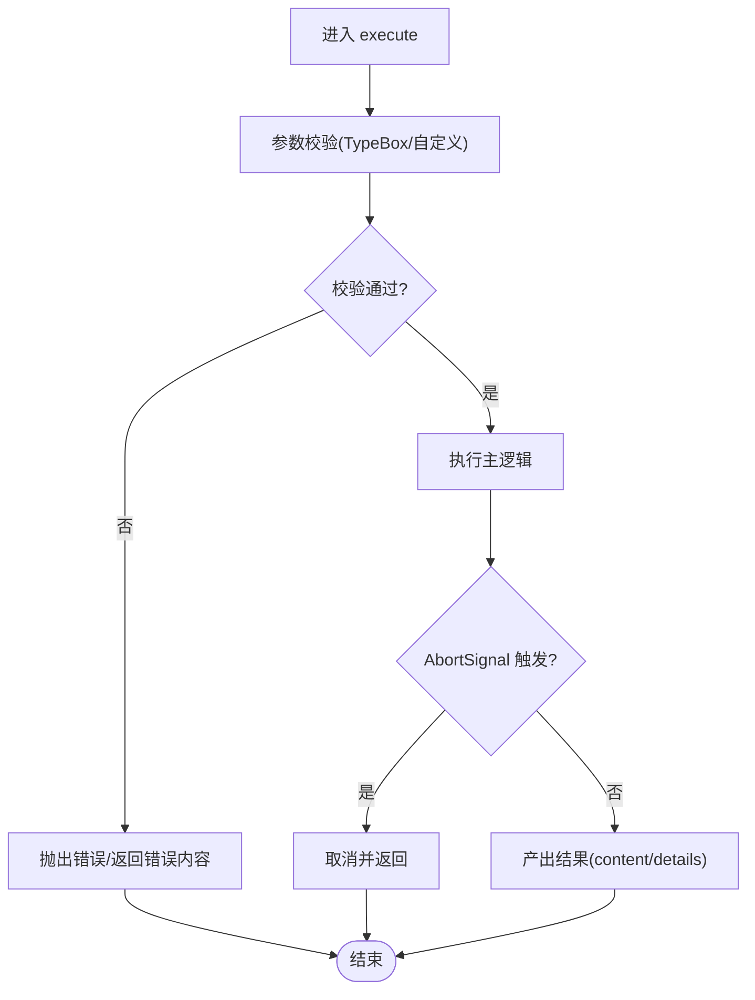
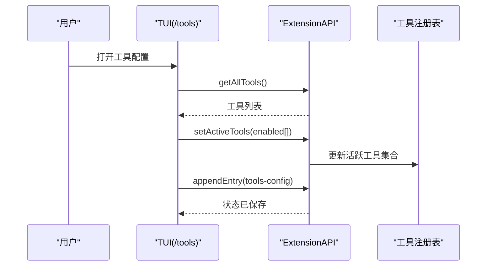
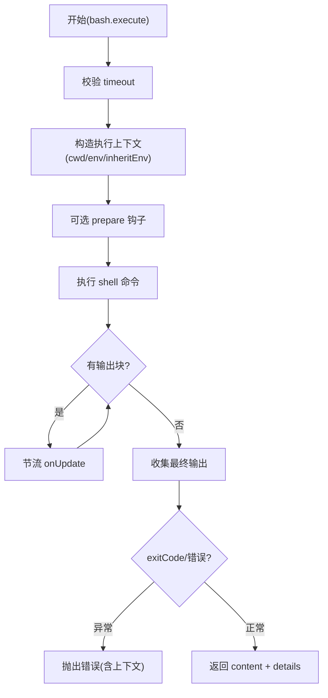
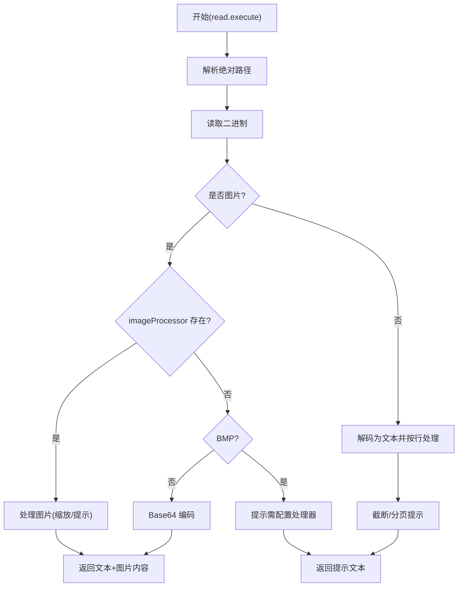
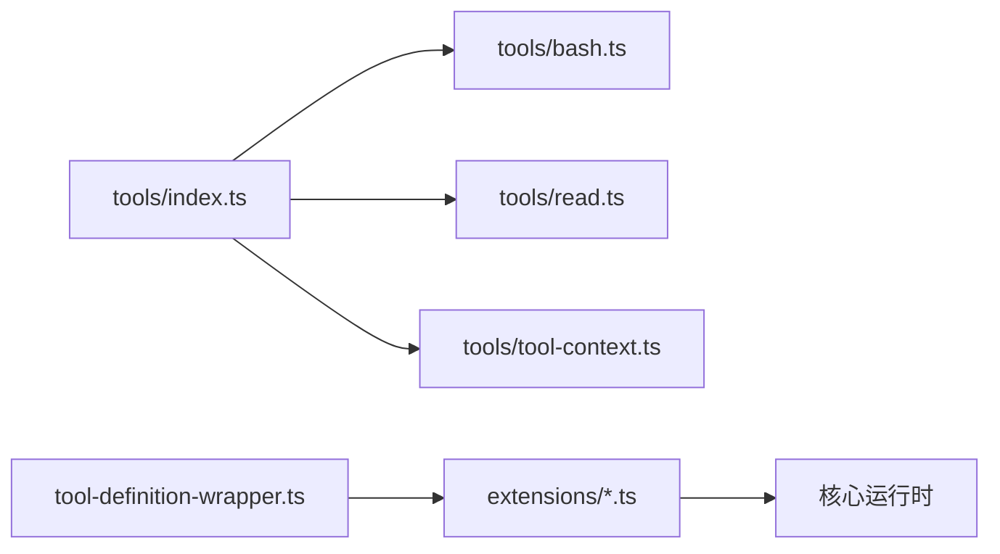

# 自定义工具开发

<cite>
**本文引用的文件**
- [packages/agent/src/harness/tools/index.ts](file://packages/agent/src/harness/tools/index.ts)
- [packages/agent/src/harness/tools/tool-context.ts](file://packages/agent/src/harness/tools/tool-context.ts)
- [packages/agent/src/harness/tools/bash.ts](file://packages/agent/src/harness/tools/bash.ts)
- [packages/agent/src/harness/tools/read.ts](file://packages/agent/src/harness/tools/read.ts)
- [packages/coding-agent/examples/extensions/tools.ts](file://packages/coding-agent/examples/extensions/tools.ts)
- [packages/coding-agent/examples/extensions/tool-override.ts](file://packages/coding-agent/examples/extensions/tool-override.ts)
- [packages/coding-agent/src/core/tools/tool-definition-wrapper.ts](file://packages/coding-agent/src/core/tools/tool-definition-wrapper.ts)
</cite>

## 目录
1. [简介](#简介)
2. [项目结构](#项目结构)
3. [核心组件](#核心组件)
4. [架构总览](#架构总览)
5. [详细组件分析](#详细组件分析)
6. [依赖关系分析](#依赖关系分析)
7. [性能考虑](#性能考虑)
8. [故障排查指南](#故障排查指南)
9. [结论](#结论)
10. [附录：开发与集成示例](#附录：开发与集成示例)

## 简介
本文件面向希望在本仓库中开发“自定义工具”的工程师，系统阐述工具开发框架的架构设计、接口规范、生命周期管理、错误处理机制，以及如何实现参数校验、异步处理与资源管理。同时说明工具的注册与发现机制、如何集成到系统中，并提供从简单函数到复杂业务逻辑的完整示例路径，以及测试、调试、发布与分发的最佳实践建议。

## 项目结构
围绕“工具”的核心代码主要分布在两个子包：
- agent 包的 harness/tools：提供内置工具（如 bash、read、write、edit）的实现与导出，定义执行上下文与工具类型契约。
- coding-agent 包的 examples/extensions：提供扩展点，演示如何注册命令、启用/禁用工具、覆盖内置工具等。
- coding-agent 包的 core/tools：提供将扩展定义的 ToolDefinition 包装为 AgentTool 的适配层，使扩展工具可被核心运行时调度。

**图表来源**
- [packages/agent/src/harness/tools/index.ts:1-24](file://packages/agent/src/harness/tools/index.ts#L1-L24)
- [packages/agent/src/harness/tools/bash.ts:1-162](file://packages/agent/src/harness/tools/bash.ts#L1-L162)
- [packages/agent/src/harness/tools/read.ts:1-145](file://packages/agent/src/harness/tools/read.ts#L1-L145)
- [packages/agent/src/harness/tools/tool-context.ts:1-7](file://packages/agent/src/harness/tools/tool-context.ts#L1-L7)
- [packages/coding-agent/examples/extensions/tools.ts:1-147](file://packages/coding-agent/examples/extensions/tools.ts#L1-L147)
- [packages/coding-agent/examples/extensions/tool-override.ts:1-145](file://packages/coding-agent/examples/extensions/tool-override.ts#L1-L145)
- [packages/coding-agent/src/core/tools/tool-definition-wrapper.ts:1-48](file://packages/coding-agent/src/core/tools/tool-definition-wrapper.ts#L1-L48)

**章节来源**
- [packages/agent/src/harness/tools/index.ts:1-24](file://packages/agent/src/harness/tools/index.ts#L1-L24)
- [packages/agent/src/harness/tools/tool-context.ts:1-7](file://packages/agent/src/harness/tools/tool-context.ts#L1-L7)
- [packages/coding-agent/examples/extensions/tools.ts:1-147](file://packages/coding-agent/examples/extensions/tools.ts#L1-L147)
- [packages/coding-agent/examples/extensions/tool-override.ts:1-145](file://packages/coding-agent/examples/extensions/tool-override.ts#L1-L145)
- [packages/coding-agent/src/core/tools/tool-definition-wrapper.ts:1-48](file://packages/coding-agent/src/core/tools/tool-definition-wrapper.ts#L1-L48)

## 核心组件
- 工具上下文 ExecutionToolContext：为内置执行类工具提供运行环境（如工作目录、环境变量）。
- 工具定义与包装：
  - 扩展侧通过 ToolDefinition 描述工具元数据与执行逻辑。
  - 核心侧通过 wrapToolDefinition/wrapToolDefinitions 将其转换为 AgentTool，供运行时调度。
- 内置工具：
  - bash：在沙箱环境中执行 shell 命令，支持超时、输出截断、进度更新。
  - read：读取文本或图片文件，支持分页 offset/limit、图片自动处理与裁剪提示。
- 扩展能力：
  - tools.ts：提供 /tools 命令，动态启用/禁用工具并持久化状态。
  - tool-override.ts：演示如何以同名覆盖内置 read，增加审计与访问控制。

**章节来源**
- [packages/agent/src/harness/tools/tool-context.ts:1-7](file://packages/agent/src/harness/tools/tool-context.ts#L1-L7)
- [packages/coding-agent/src/core/tools/tool-definition-wrapper.ts:1-48](file://packages/coding-agent/src/core/tools/tool-definition-wrapper.ts#L1-L48)
- [packages/agent/src/harness/tools/bash.ts:1-162](file://packages/agent/src/harness/tools/bash.ts#L1-L162)
- [packages/agent/src/harness/tools/read.ts:1-145](file://packages/agent/src/harness/tools/read.ts#L1-L145)
- [packages/coding-agent/examples/extensions/tools.ts:1-147](file://packages/coding-agent/examples/extensions/tools.ts#L1-L147)
- [packages/coding-agent/examples/extensions/tool-override.ts:1-145](file://packages/coding-agent/examples/extensions/tool-override.ts#L1-L145)

## 架构总览
下图展示了“扩展定义 -> 适配包装 -> 核心调度 -> 工具执行”的端到端流程，以及内置工具的执行细节。

**图表来源**
- [packages/coding-agent/src/core/tools/tool-definition-wrapper.ts:1-48](file://packages/coding-agent/src/core/tools/tool-definition-wrapper.ts#L1-L48)
- [packages/agent/src/harness/tools/bash.ts:1-162](file://packages/agent/src/harness/tools/bash.ts#L1-L162)
- [packages/agent/src/harness/tools/read.ts:1-145](file://packages/agent/src/harness/tools/read.ts#L1-L145)

## 详细组件分析

### 工具接口规范与生命周期
- 工具定义字段（由扩展提供）：
  - name/label/description：标识与展示信息
  - parameters：使用 TypeBox Schema 声明的参数结构
  - constrainedSampling/prepareArguments/executionMode：采样与参数预处理、执行模式
  - execute：核心执行函数，接收 toolCallId、params、signal、onUpdate、ctx
- 生命周期要点：
  - 初始化：扩展定义 ToolDefinition，并通过包装器转为 AgentTool 注册到核心。
  - 准备阶段：可选 prepareArguments 对输入进行预处理；bash 工具支持 prepare 钩子在命令执行前注入执行上下文。
  - 执行阶段：execute 内可异步处理，通过 onUpdate 推送中间结果；支持 AbortSignal 取消。
  - 完成阶段：返回 content 与 details，用于渲染与后续处理。

**图表来源**
- [packages/coding-agent/src/core/tools/tool-definition-wrapper.ts:1-48](file://packages/coding-agent/src/core/tools/tool-definition-wrapper.ts#L1-L48)
- [packages/agent/src/harness/tools/bash.ts:1-162](file://packages/agent/src/harness/tools/bash.ts#L1-L162)

**章节来源**
- [packages/coding-agent/src/core/tools/tool-definition-wrapper.ts:1-48](file://packages/coding-agent/src/core/tools/tool-definition-wrapper.ts#L1-L48)
- [packages/agent/src/harness/tools/bash.ts:1-162](file://packages/agent/src/harness/tools/bash.ts#L1-L162)

### 参数验证与错误处理
- 参数验证：
  - 使用 TypeBox Schema 声明参数结构，确保类型安全与自描述。
  - 例如 bash 工具定义了 command 与可选 timeout；read 工具定义了 path、offset、limit。
- 错误处理：
  - 超时：validateTimeout 校验并抛出异常；bash 执行时捕获超时并转化为带上下文的错误。
  - 取消：通过 AbortSignal 中断执行。
  - 退出码：非零退出码会转换为错误并附带输出片段。
  - 文件读取：偏移越界、权限不足等场景返回明确错误信息。

**图表来源**
- [packages/agent/src/harness/tools/bash.ts:1-162](file://packages/agent/src/harness/tools/bash.ts#L1-L162)
- [packages/agent/src/harness/tools/read.ts:1-145](file://packages/agent/src/harness/tools/read.ts#L1-L145)

**章节来源**
- [packages/agent/src/harness/tools/bash.ts:1-162](file://packages/agent/src/harness/tools/bash.ts#L1-L162)
- [packages/agent/src/harness/tools/read.ts:1-145](file://packages/agent/src/harness/tools/read.ts#L1-L145)

### 异步处理与资源管理
- 异步流式更新：
  - bash 工具通过 onUpdate 周期性推送输出片段，避免阻塞 UI。
  - 节流策略限制更新频率，减少渲染压力。
- 资源清理：
  - 定时器在 finally 中清理，防止内存泄漏。
  - 文件读取完成后释放缓冲与句柄。
- 并发与安全：
  - 通过 AbortSignal 支持外部取消。
  - 沙箱执行环境隔离命令执行上下文。

**章节来源**
- [packages/agent/src/harness/tools/bash.ts:1-162](file://packages/agent/src/harness/tools/bash.ts#L1-L162)
- [packages/agent/src/harness/tools/read.ts:1-145](file://packages/agent/src/harness/tools/read.ts#L1-L145)

### 工具注册与发现机制
- 注册：
  - 扩展通过 pi.registerTool 注册 ToolDefinition，同名工具可覆盖内置实现。
  - 包装器将 ToolDefinition 转换为 AgentTool 供核心调度。
- 发现与选择：
  - 扩展提供 /tools 命令，列出所有可用工具，允许用户启用/禁用，并将选择持久化到会话分支。
  - 启动或切换分支时恢复上次选择。

**图表来源**
- [packages/coding-agent/examples/extensions/tools.ts:1-147](file://packages/coding-agent/examples/extensions/tools.ts#L1-L147)
- [packages/coding-agent/examples/extensions/tool-override.ts:1-145](file://packages/coding-agent/examples/extensions/tool-override.ts#L1-L145)
- [packages/coding-agent/src/core/tools/tool-definition-wrapper.ts:1-48](file://packages/coding-agent/src/core/tools/tool-definition-wrapper.ts#L1-L48)

**章节来源**
- [packages/coding-agent/examples/extensions/tools.ts:1-147](file://packages/coding-agent/examples/extensions/tools.ts#L1-L147)
- [packages/coding-agent/examples/extensions/tool-override.ts:1-145](file://packages/coding-agent/examples/extensions/tool-override.ts#L1-L145)
- [packages/coding-agent/src/core/tools/tool-definition-wrapper.ts:1-48](file://packages/coding-agent/src/core/tools/tool-definition-wrapper.ts#L1-L48)

### 内置工具深度解析

#### bash 工具
- 功能：在当前工作目录下执行 bash 命令，支持超时、输出截断、进度更新。
- 关键点：
  - 参数：command、timeout（可选）。
  - 执行：通过 Shell 捕获器执行，支持 onChunk 回调与节流更新。
  - 错误：超时、取消、非零退出码均会转换为错误并附带上下文。
  - 输出：大输出会被截断，并提供完整输出路径以便下载查看。

**图表来源**
- [packages/agent/src/harness/tools/bash.ts:1-162](file://packages/agent/src/harness/tools/bash.ts#L1-L162)

**章节来源**
- [packages/agent/src/harness/tools/bash.ts:1-162](file://packages/agent/src/harness/tools/bash.ts#L1-L162)

#### read 工具
- 功能：读取文本或图片文件，支持分页 offset/limit、图片自动处理与裁剪提示。
- 关键点：
  - 参数：path、offset（可选）、limit（可选）。
  - 图片：检测 MIME 类型，可选择 imageProcessor 进行转换/缩放；未配置时对 BMP 给出提示，其他格式直接编码。
  - 文本：按行分割，支持截断与继续读取提示。
  - 错误：偏移越界、文件不可读等场景返回明确错误。

**图表来源**
- [packages/agent/src/harness/tools/read.ts:1-145](file://packages/agent/src/harness/tools/read.ts#L1-L145)

**章节来源**
- [packages/agent/src/harness/tools/read.ts:1-145](file://packages/agent/src/harness/tools/read.ts#L1-L145)

### 扩展与覆盖示例
- 工具选择与持久化：
  - 通过 /tools 命令列出全部工具，支持启用/禁用，并保存到当前会话分支。
  - 会话启动或树导航时恢复上次选择。
- 覆盖内置工具：
  - 以同名注册新 read 工具，增加审计日志与敏感路径拦截，保留默认渲染。

**章节来源**
- [packages/coding-agent/examples/extensions/tools.ts:1-147](file://packages/coding-agent/examples/extensions/tools.ts#L1-L147)
- [packages/coding-agent/examples/extensions/tool-override.ts:1-145](file://packages/coding-agent/examples/extensions/tool-override.ts#L1-L145)

## 依赖关系分析
- 模块耦合：
  - tools/index.ts 作为统一出口，聚合各工具实现，便于按需引入。
  - tool-context.ts 提供共享上下文类型，降低工具间耦合。
  - tool-definition-wrapper.ts 解耦扩展定义与核心运行时，提升可插拔性。
- 外部依赖：
  - TypeBox 用于参数 Schema 定义与校验。
  - fs/fs/promises 用于文件读写（在扩展示例中）。
  - 文件系统队列 withFileMutationQueue 用于并发安全的日志写入。

**图表来源**
- [packages/agent/src/harness/tools/index.ts:1-24](file://packages/agent/src/harness/tools/index.ts#L1-L24)
- [packages/coding-agent/src/core/tools/tool-definition-wrapper.ts:1-48](file://packages/coding-agent/src/core/tools/tool-definition-wrapper.ts#L1-L48)
- [packages/coding-agent/examples/extensions/tool-override.ts:1-145](file://packages/coding-agent/examples/extensions/tool-override.ts#L1-L145)

**章节来源**
- [packages/agent/src/harness/tools/index.ts:1-24](file://packages/agent/src/harness/tools/index.ts#L1-L24)
- [packages/coding-agent/src/core/tools/tool-definition-wrapper.ts:1-48](file://packages/coding-agent/src/core/tools/tool-definition-wrapper.ts#L1-L48)

## 性能考虑
- 输出节流：bash 工具对 onUpdate 进行节流，避免频繁 UI 刷新导致卡顿。
- 输出截断：文本与命令输出采用行数与字节数双重限制，保证响应速度。
- 图片处理：可选 imageProcessor 支持自动缩放，减少传输体积。
- 资源清理：定时器与临时对象在 finally 中清理，防止内存泄漏。
- 并发安全：日志写入使用文件队列，避免竞争条件。

[本节为通用性能建议，不直接分析具体文件]

## 故障排查指南
- 常见错误定位：
  - 超时：检查 timeout 设置与命令耗时，必要时拆分任务或调整阈值。
  - 取消：确认上游是否发送了 AbortSignal，检查信号传播链。
  - 权限/路径：read 工具报错多为路径不存在或无权限，核对 cwd 与相对路径解析。
  - 非零退出码：bash 工具会将退出码封装为错误，结合输出片段定位问题。
- 调试建议：
  - 使用 onUpdate 观察中间输出，逐步缩小范围。
  - 在覆盖 read 的示例中，查看访问日志了解实际访问路径与拦截原因。
  - 利用 TypeBox Schema 快速定位参数错误。

**章节来源**
- [packages/agent/src/harness/tools/bash.ts:1-162](file://packages/agent/src/harness/tools/bash.ts#L1-L162)
- [packages/agent/src/harness/tools/read.ts:1-145](file://packages/agent/src/harness/tools/read.ts#L1-L145)
- [packages/coding-agent/examples/extensions/tool-override.ts:1-145](file://packages/coding-agent/examples/extensions/tool-override.ts#L1-L145)

## 结论
本框架通过清晰的 ToolDefinition 接口与包装适配层，实现了可扩展的工具生态。内置工具提供了稳健的异步执行、参数校验与错误处理范式；扩展机制允许灵活覆盖与增强行为，满足审计、访问控制、远程路由等需求。遵循本文档的规范与实践，可高效开发、测试与发布高质量自定义工具。

[本节为总结性内容，不直接分析具体文件]

## 附录：开发与集成示例
- 从零开始开发工具：
  - 定义参数 Schema（TypeBox），实现 execute 函数，处理异步与错误。
  - 通过 pi.registerTool 注册，或使用包装器转为 AgentTool。
  - 参考路径：
    - [packages/coding-agent/examples/extensions/tool-override.ts:62-129](file://packages/coding-agent/examples/extensions/tool-override.ts#L62-L129)
    - [packages/coding-agent/src/core/tools/tool-definition-wrapper.ts:1-48](file://packages/coding-agent/src/core/tools/tool-definition-wrapper.ts#L1-L48)
- 集成到系统：
  - 使用 /tools 命令启用/禁用工具，状态持久化到会话分支。
  - 参考路径：
    - [packages/coding-agent/examples/extensions/tools.ts:21-145](file://packages/coding-agent/examples/extensions/tools.ts#L21-L145)
- 测试与调试：
  - 单元测试：针对参数校验与边界条件（如 offset 越界、空输出）。
  - 集成测试：模拟 shell 执行与文件 I/O，验证 onUpdate 与错误路径。
  - 性能测试：压测大文件读取与长输出命令，评估截断与节流效果。
  - 调试技巧：开启 onUpdate 观察中间态；在覆盖 read 的示例中查看访问日志。
- 发布与分发：
  - 将扩展放入 ~/.pi/agent/extensions 或项目 .pi/extensions。
  - 保持 Schema 稳定，提供清晰的 label/description，便于用户理解。
  - 版本化变更，记录覆盖行为与兼容性说明。

**章节来源**
- [packages/coding-agent/examples/extensions/tool-override.ts:1-145](file://packages/coding-agent/examples/extensions/tool-override.ts#L1-L145)
- [packages/coding-agent/examples/extensions/tools.ts:1-147](file://packages/coding-agent/examples/extensions/tools.ts#L1-L147)
- [packages/coding-agent/src/core/tools/tool-definition-wrapper.ts:1-48](file://packages/coding-agent/src/core/tools/tool-definition-wrapper.ts#L1-L48)