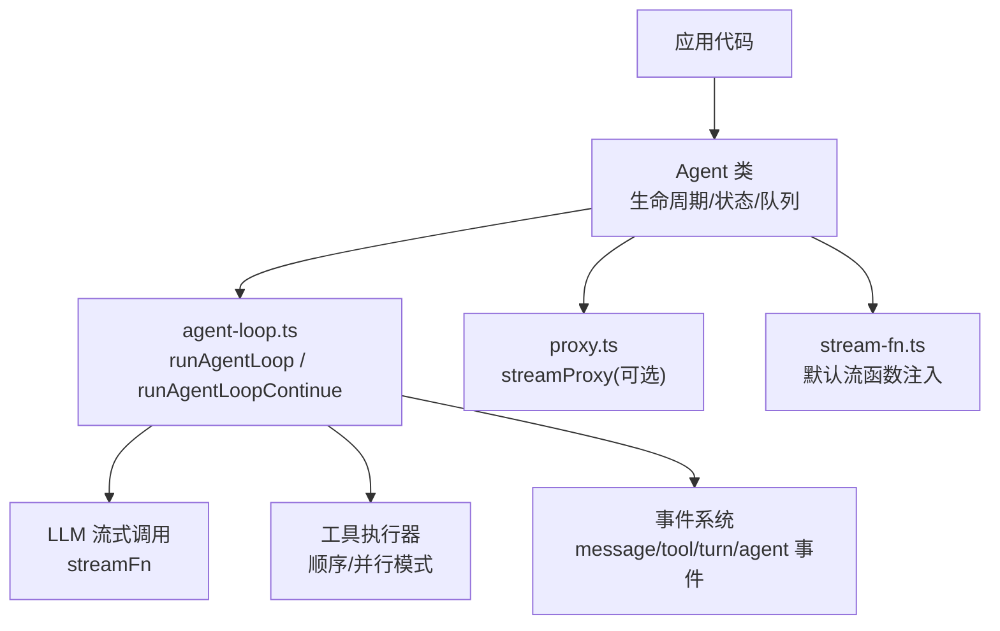
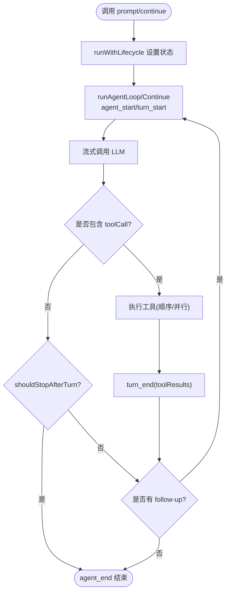
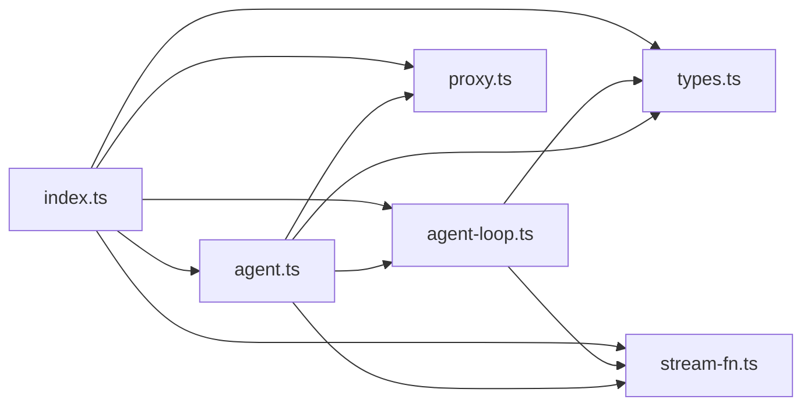

# 运行时管理

<cite>
**本文引用的文件**
- [packages/agent/src/agent.ts](file://packages/agent/src/agent.ts)
- [packages/agent/src/agent-loop.ts](file://packages/agent/src/agent-loop.ts)
- [packages/agent/src/types.ts](file://packages/agent/src/types.ts)
- [packages/agent/src/proxy.ts](file://packages/agent/src/proxy.ts)
- [packages/agent/src/stream-fn.ts](file://packages/agent/src/stream-fn.ts)
- [packages/agent/src/index.ts](file://packages/agent/src/index.ts)
- [packages/agent/README.md](file://packages/agent/README.md)
</cite>

## 目录
1. [简介](#简介)
2. [项目结构](#项目结构)
3. [核心组件](#核心组件)
4. [架构总览](#架构总览)
5. [详细组件分析](#详细组件分析)
6. [依赖关系分析](#依赖关系分析)
7. [性能考虑](#性能考虑)
8. [故障排除指南](#故障排除指南)
9. [结论](#结论)
10. [附录：配置与示例路径](#附录配置与示例路径)

## 简介
本文件面向代理运行时的管理与编排，聚焦于代理实例的生命周期（初始化、启动、执行、销毁）、状态管理（持久化、同步、并发控制）、消息处理器、事件系统、错误处理机制、代理配置选项与参数设置、性能优化策略与资源管理最佳实践，以及故障排除与调试技巧。内容基于仓库中 @earendil-works/pi-agent-core 的实现进行系统化梳理。

## 项目结构
- 包定位：@earendil-works/pi-agent-core 提供“有状态的代理运行时”，包含工具调用、事件流、会话上下文、压缩与提示模板等能力。
- 关键入口：index.ts 统一导出 Agent、低层循环函数、代理流、类型与工具集。
- 核心模块：
  - agent.ts：Agent 类封装生命周期、状态、队列（引导/后续）与事件分发。
  - agent-loop.ts：低层循环实现，负责 LLM 调用、工具执行、事件发射与轮次推进。
  - types.ts：类型定义（AgentMessage、AgentTool、AgentEvent、AgentLoopConfig 等）。
  - proxy.ts：浏览器/前端通过后端代理转发 LLM 流式请求的 streamProxy。
  - stream-fn.ts：默认流函数注入点，供宿主环境提供默认模型运行时。
  - README.md：快速开始、事件序列、选项与用法说明。



图表来源
- [packages/agent/src/agent.ts:173-238](file://packages/agent/src/agent.ts#L173-L238)
- [packages/agent/src/agent-loop.ts:95-143](file://packages/agent/src/agent-loop.ts#L95-L143)
- [packages/agent/src/proxy.ts:118-235](file://packages/agent/src/proxy.ts#L118-L235)
- [packages/agent/src/stream-fn.ts:11-20](file://packages/agent/src/stream-fn.ts#L11-L20)

章节来源
- [packages/agent/src/index.ts:1-146](file://packages/agent/src/index.ts#L1-L146)
- [packages/agent/README.md:15-514](file://packages/agent/README.md#L15-L514)

## 核心组件
- Agent 类：维护当前对话上下文、工具集、流式响应、引导/后续消息队列；提供 prompt/continue/reset/abort/waitForIdle 等方法；订阅事件并更新内部状态。
- 低层循环（agent-loop）：实现一轮或多轮对话的主循环，负责将 AgentMessage 转换为 LLM Message、调用流式接口、执行工具、发射事件、处理终止条件与转向/后续消息。
- 工具执行：支持顺序与并行两种模式；支持 beforeToolCall/afterToolCall 钩子；支持 per-tool executionMode 覆盖。
- 事件系统：标准化事件（agent_start/end、turn_start/end、message_*、tool_execution_*），用于 UI 更新与外部集成。
- 代理流（streamProxy）：在浏览器端通过后端代理转发流式请求，客户端重建部分消息以节省带宽。
- 默认流函数注入：允许宿主环境在不引入具体提供商的情况下提供默认流函数。

章节来源
- [packages/agent/src/agent.ts:173-593](file://packages/agent/src/agent.ts#L173-L593)
- [packages/agent/src/agent-loop.ts:155-275](file://packages/agent/src/agent-loop.ts#L155-L275)
- [packages/agent/src/types.ts:149-293](file://packages/agent/src/types.ts#L149-L293)
- [packages/agent/src/proxy.ts:118-235](file://packages/agent/src/proxy.ts#L118-L235)
- [packages/agent/src/stream-fn.ts:11-20](file://packages/agent/src/stream-fn.ts#L11-L20)

## 架构总览
下图展示从应用调用到 LLM 返回、再到工具执行与事件回传的完整流程。

```mermaid
sequenceDiagram
participant App as "应用"
participant Agent as "Agent"
participant Loop as "agent-loop"
participant Stream as "streamFn/Provider"
participant Tools as "工具执行"
App->>Agent : prompt()/continue()
Agent->>Loop : runAgentLoop / runAgentLoopContinue
Loop->>Stream : 流式调用 LLM
Stream-->>Loop : message_start/update/end
Loop->>Tools : 解析 toolCall 并执行
Tools-->>Loop : tool_execution_update/end
Loop-->>Agent : turn_end/agent_end
Agent-->>App : 事件回调/状态更新
```

图表来源
- [packages/agent/src/agent.ts:347-435](file://packages/agent/src/agent.ts#L347-L435)
- [packages/agent/src/agent-loop.ts:95-275](file://packages/agent/src/agent-loop.ts#L95-L275)
- [packages/agent/src/agent-loop.ts:281-372](file://packages/agent/src/agent-loop.ts#L281-L372)
- [packages/agent/src/agent-loop.ts:411-554](file://packages/agent/src/agent-loop.ts#L411-L554)

## 详细组件分析

### 代理实例生命周期管理
- 初始化
  - 构造 AgentOptions：初始状态、convertToLlm、transformContext、streamFn、getApiKey、before/afterToolCall、shouldStopAfterTurn、prepareNextTurn、steering/followUp 模式、sessionId、thinkingBudgets、transport、maxRetryDelayMs、toolExecution。
  - 创建可变状态：systemPrompt、model、thinkingLevel、tools、messages、isStreaming、streamingMessage、pendingToolCalls、errorMessage。
  - 初始化两个队列：steeringQueue、followUpQueue，支持 all 或 one-at-a-time 模式。
- 启动
  - prompt(input, images?) 或 prompt(messages)：归一化为 AgentMessage[]，进入 runWithLifecycle -> runAgentLoop。
  - continue()：从现有上下文继续，要求最后一条为 user 或 toolResult。
- 执行
  - 主循环：发射 agent_start/turn_start，注入引导消息，流式获取助手响应，若含 toolCall 则执行工具（顺序/并行），收集 toolResult，发射 turn_end。
  - 每轮结束可触发 shouldStopAfterTurn 提前退出；否则检查 follow-up 队列决定是否继续。
- 销毁/收尾
  - finishRun：重置 isStreaming/streamingMessage/pendingToolCalls，resolve activeRun promise，清理 activeRun 引用。
  - abort：中断当前运行的 AbortController，工具与流式调用会收到信号。



图表来源
- [packages/agent/src/agent.ts:486-535](file://packages/agent/src/agent.ts#L486-L535)
- [packages/agent/src/agent-loop.ts:155-275](file://packages/agent/src/agent-loop.ts#L155-L275)

章节来源
- [packages/agent/src/agent.ts:97-238](file://packages/agent/src/agent.ts#L97-L238)
- [packages/agent/src/agent.ts:347-435](file://packages/agent/src/agent.ts#L347-L435)
- [packages/agent/src/agent.ts:486-535](file://packages/agent/src/agent.ts#L486-L535)
- [packages/agent/src/agent-loop.ts:95-143](file://packages/agent/src/agent-loop.ts#L95-L143)

### 状态管理机制
- 状态快照与同步
  - createContextSnapshot：每次调用循环前复制 systemPrompt/messages/tools，避免共享引用导致竞态。
  - processEvents：根据事件类型更新 streamingMessage、messages、pendingToolCalls、errorMessage，确保状态与事件一致。
- 并发控制
  - activeRun：保证同一时间只有一个运行中的 prompt/continue；重复调用抛错。
  - AbortSignal：贯穿 runWithLifecycle、工具执行、流式调用，支持取消。
- 持久化
  - 会话 ID 透传：sessionId 传递给 provider，便于缓存/会话感知后端。
  - 外部持久化：建议在 agent_end 事件中落盘 messages 与必要元数据（如 usage、stopReason）。
- 思考预算与上下文变换
  - thinkingBudgets：按级别传递至流函数，影响推理成本。
  - transformContext：在进入 convertToLlm 前对消息做裁剪/注入，控制上下文窗口。

章节来源
- [packages/agent/src/agent.ts:437-484](file://packages/agent/src/agent.ts#L437-L484)
- [packages/agent/src/agent.ts:544-591](file://packages/agent/src/agent.ts#L544-L591)
- [packages/agent/src/types.ts:149-200](file://packages/agent/src/types.ts#L149-L200)
- [packages/agent/README.md:176-243](file://packages/agent/README.md#L176-L243)

### 消息处理器与事件系统
- 消息流
  - AgentMessage → transformContext → convertToLlm → Message[] → LLM。
  - 流式事件：start/text_start/delta/end、thinking_*、toolcall_*、done/error。
- 事件类型
  - agent_start/end、turn_start/end、message_start/update/end、tool_execution_start/update/end。
- 事件消费
  - subscribe(listener)：按注册顺序 await 监听器；agent_end 后仍等待其 settle。
  - 低层循环为观测型，不等待异步处理完成即推进生产者阶段；需要屏障时使用 Agent 类。

```mermaid
sequenceDiagram
participant Loop as "agent-loop"
participant Provider as "Provider/流"
participant Agent as "Agent"
participant UI as "UI/订阅者"
Loop->>Provider : 流式请求
Provider-->>Loop : start/text_delta/toolcall_delta...
Loop-->>Agent : message_start/update
Agent-->>UI : 事件分发
Provider-->>Loop : done/error
Loop-->>Agent : message_end/turn_end/agent_end
Agent-->>UI : 最终状态/结果
```

图表来源
- [packages/agent/src/agent-loop.ts:281-372](file://packages/agent/src/agent-loop.ts#L281-L372)
- [packages/agent/src/agent.ts:250-253](file://packages/agent/src/agent.ts#L250-L253)
- [packages/agent/src/types.ts:421-444](file://packages/agent/src/types.ts#L421-L444)

章节来源
- [packages/agent/README.md:55-174](file://packages/agent/README.md#L55-L174)
- [packages/agent/src/types.ts:421-444](file://packages/agent/src/types.ts#L421-L444)

### 错误处理机制
- 运行期失败
  - handleRunFailure：将错误包装为 assistant 消息，附带 stopReason=error/aborted 与 errorMessage，依次发射 message_start/end、turn_end、agent_end。
- 工具错误
  - beforeToolCall 可 block 并返回 terminate 提示；execute 抛出异常会被捕获并转为 isError=true 的工具结果。
  - 输出 token 限制导致的截断：工具调用全部失败，提示重新发起。
- 代理错误
  - streamProxy 在网络错误或中止时，构造 error 事件并回填 partial 消息。

章节来源
- [packages/agent/src/agent.ts:511-527](file://packages/agent/src/agent.ts#L511-L527)
- [packages/agent/src/agent-loop.ts:381-406](file://packages/agent/src/agent-loop.ts#L381-L406)
- [packages/agent/src/agent-loop.ts:600-668](file://packages/agent/src/agent-loop.ts#L600-L668)
- [packages/agent/src/proxy.ts:168-231](file://packages/agent/src/proxy.ts#L168-L231)

### 代理配置选项与参数设置
- AgentOptions 关键项
  - initialState：systemPrompt、model、thinkingLevel、tools、messages。
  - convertToLlm：自定义消息转换。
  - transformContext：上下文裁剪/注入。
  - streamFn：必须提供；可通过 setDefaultStreamFn 注入默认值。
  - getApiKey：动态密钥解析（适合短期 OAuth）。
  - beforeToolCall/afterToolCall：工具前后钩子，支持阻断、覆盖结果、终止提示。
  - shouldStopAfterTurn：优雅停止（在 turn_end 之后、下一轮之前）。
  - prepareNextTurn/prepareNextTurnWithContext：轮次间替换 context/model/thinkingLevel。
  - steeringMode/followUpMode：队列模式 all 或 one-at-a-time。
  - sessionId：会话标识，透传给 provider。
  - thinkingBudgets：按级别预算。
  - transport：传输偏好。
  - maxRetryDelayMs：重试延迟上限。
  - toolExecution：parallel（默认）或 sequential。
- 代理流选项（streamProxy）
  - authToken、proxyUrl、signal、temperature、maxTokens、reasoning、cacheRetention、headers、metadata、thinkingBudgets、maxRetryDelayMs。

章节来源
- [packages/agent/src/agent.ts:97-123](file://packages/agent/src/agent.ts#L97-L123)
- [packages/agent/src/types.ts:149-293](file://packages/agent/src/types.ts#L149-L293)
- [packages/agent/src/proxy.ts:74-116](file://packages/agent/src/proxy.ts#L74-L116)
- [packages/agent/README.md:176-243](file://packages/agent/README.md#L176-L243)

### 代码示例（路径指引）
- 快速创建与配置 Agent（含事件订阅、prompt、continue、工具、代理流）：
  - [快速开始与事件序列:15-174](file://packages/agent/README.md#L15-L174)
  - [Agent 选项与状态操作:176-323](file://packages/agent/README.md#L176-L323)
  - [工具定义与错误处理:403-457](file://packages/agent/README.md#L403-L457)
  - [代理使用示例:458-473](file://packages/agent/README.md#L458-L473)
  - [低层 API 示例:475-507](file://packages/agent/README.md#L475-L507)

## 依赖关系分析
- Agent 依赖：
  - agent-loop：主循环与工具执行。
  - stream-fn：默认流函数注入。
  - types：类型契约。
  - proxy：可选的代理流。
- 低层循环依赖：
  - pi-ai：消息类型、工具校验、事件流、工具调用协议。
  - stream-fn：默认流函数。
- 导出边界：
  - index.ts 统一暴露 Agent、循环函数、harness、工具、类型与代理能力。



图表来源
- [packages/agent/src/agent.ts:1-31](file://packages/agent/src/agent.ts#L1-L31)
- [packages/agent/src/agent-loop.ts:1-24](file://packages/agent/src/agent-loop.ts#L1-L24)
- [packages/agent/src/index.ts:1-146](file://packages/agent/src/index.ts#L1-L146)

章节来源
- [packages/agent/src/index.ts:1-146](file://packages/agent/src/index.ts#L1-L146)

## 性能考虑
- 工具执行模式
  - parallel：预检顺序执行，实际工具并行执行，提升吞吐；注意工具幂等性与副作用。
  - sequential：严格串行，适合有状态或互斥工具。
- 上下文管理
  - transformContext：按需裁剪旧消息，控制上下文窗口，减少 LLM 输入成本。
  - thinkingBudgets：合理设置推理预算，平衡质量与成本。
- 流式与背压
  - 使用 streamFn 的 onPayload/onResponse 监控流量与耗时。
  - 订阅者需尽快处理事件，避免阻塞后续事件。
- 资源释放
  - 及时 unsubscribe 事件监听器。
  - 使用 abort 取消长时间任务。
  - 在 agent_end 中落盘会话，避免内存泄漏。

[本节为通用指导，不直接分析具体文件]

## 故障排除指南
- 常见错误与定位
  - “Agent is already processing”：重复调用 prompt/continue；等待 waitForIdle 或使用 steer/followUp。
  - “Cannot continue from message role: assistant”：上下文末尾必须是 user 或 toolResult。
  - “No default stream function configured”：未提供 streamFn 且未设置默认流函数。
  - 工具未找到/参数校验失败：检查工具名与 schema，必要时使用 prepareArguments 兼容旧参数。
  - 输出 token 限制导致工具调用失败：让模型重新发起完整参数。
- 调试技巧
  - 订阅所有事件，打印 message_start/update/end、tool_execution_*、turn_end、agent_end。
  - 在 beforeToolCall/afterToolCall 中记录入参与结果，便于追踪问题。
  - 使用 shouldStopAfterTurn 在上下文过大时主动停止，配合日志分析。
  - 代理场景：检查网络状态、authToken、proxyUrl，确认服务端返回 data: JSON 行格式。

章节来源
- [packages/agent/src/agent.ts:332-388](file://packages/agent/src/agent.ts#L332-L388)
- [packages/agent/src/stream-fn.ts:15-20](file://packages/agent/src/stream-fn.ts#L15-L20)
- [packages/agent/src/agent-loop.ts:600-668](file://packages/agent/src/agent-loop.ts#L600-L668)
- [packages/agent/src/agent-loop.ts:381-406](file://packages/agent/src/agent-loop.ts#L381-L406)
- [packages/agent/src/proxy.ts:153-231](file://packages/agent/src/proxy.ts#L153-L231)

## 结论
该运行时以 Agent 为核心，结合低层循环实现了稳定的生命周期管理、灵活的消息与工具执行策略、完善的事件系统与错误处理。通过 transformContext、thinkingBudgets、toolExecution 等配置，可在不同场景下取得质量、成本与性能的平衡。建议在生产环境中结合事件落盘、上下文裁剪、合理的工具执行模式与完善的错误恢复策略，以获得高可用的代理服务。

## 附录：配置与示例路径
- 快速开始与事件序列
  - [快速开始:15-43](file://packages/agent/README.md#L15-L43)
  - [事件序列（prompt/工具）:65-174](file://packages/agent/README.md#L65-L174)
- Agent 选项与状态
  - [AgentOptions:176-243](file://packages/agent/README.md#L176-L243)
  - [AgentState 与操作方法:245-323](file://packages/agent/README.md#L245-L323)
- 工具与错误处理
  - [工具定义与 execute:403-457](file://packages/agent/README.md#L403-L457)
- 代理与低层 API
  - [streamProxy 使用:458-473](file://packages/agent/README.md#L458-L473)
  - [低层循环示例:475-507](file://packages/agent/README.md#L475-L507)
- 源码参考
  - [Agent 类:173-593](file://packages/agent/src/agent.ts#L173-L593)
  - [低层循环:95-275](file://packages/agent/src/agent-loop.ts#L95-L275)
  - [类型定义:149-293](file://packages/agent/src/types.ts#L149-L293)
  - [代理流:118-235](file://packages/agent/src/proxy.ts#L118-L235)
  - [默认流函数注入:11-20](file://packages/agent/src/stream-fn.ts#L11-L20)
  - [统一导出:1-146](file://packages/agent/src/index.ts#L1-L146)