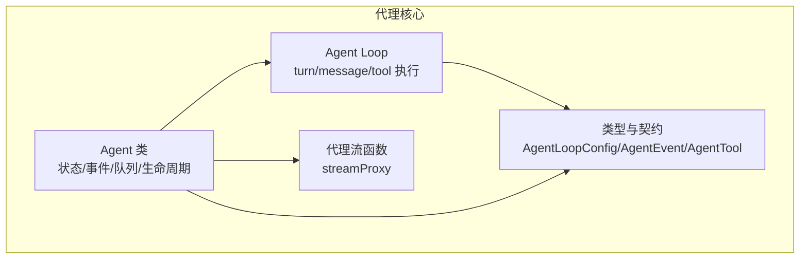
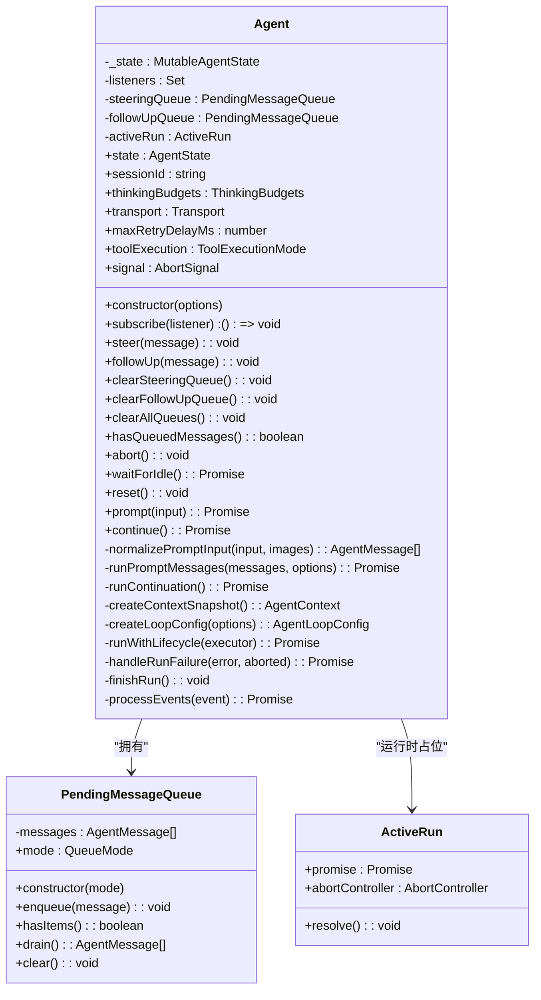
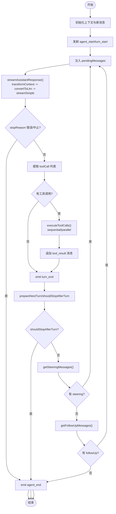
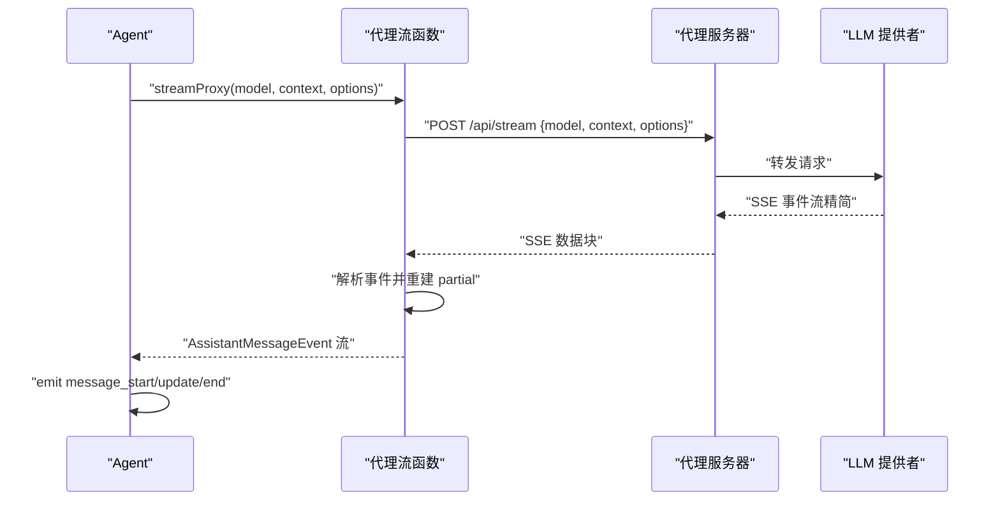
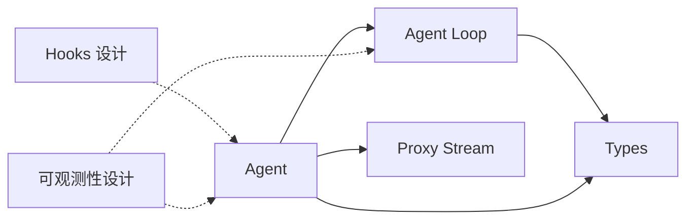

# 代理核心机制

<cite>
**本文引用的文件**
- [agent.ts](file://packages/agent/src/agent.ts)
- [agent-loop.ts](file://packages/agent/src/agent-loop.ts)
- [types.ts](file://packages/agent/src/types.ts)
- [index.ts](file://packages/agent/src/index.ts)
- [proxy.ts](file://packages/agent/src/proxy.ts)
- [README.md](file://README.md)
- [hooks.md](file://packages/agent/docs/hooks.md)
- [observability.md](file://packages/agent/docs/observability.md)
</cite>

## 目录
1. [简介](#简介)
2. [项目结构](#项目结构)
3. [核心组件](#核心组件)
4. [架构总览](#架构总览)
5. [详细组件分析](#详细组件分析)
6. [依赖关系分析](#依赖关系分析)
7. [性能考量](#性能考量)
8. [故障排查指南](#故障排查指南)
9. [结论](#结论)
10. [附录](#附录)

## 简介
本文件面向Pi代理核心机制，围绕Agent类的设计与实现进行系统化技术文档编写。内容涵盖：
- Agent类的架构设计：状态管理、生命周期、事件驱动模型
- 代理循环（Agent Loop）核心算法：消息处理、工具调用协调、错误处理
- 初始化流程、配置项与运行时行为
- 与AI提供者交互模式与数据流
- 典型使用场景与最佳实践

## 项目结构
Pi代理位于packages/agent包中，核心由以下模块组成：
- agent.ts：对外暴露的Agent类，负责状态、事件、队列与生命周期控制
- agent-loop.ts：低层代理循环实现，定义turn/message/tool生命周期与执行逻辑
- types.ts：类型定义与接口契约，包括AgentLoopConfig、AgentEvent、AgentTool等
- proxy.ts：代理流函数，支持通过服务端代理LLM请求
- index.ts：导出入口，统一暴露Agent、Loop、Harness、Proxy等能力
- 文档：hooks.md（钩子与扩展）、observability.md（可观测性）



图表来源
- [agent.ts:166-558](file://packages/agent/src/agent.ts#L166-L558)
- [agent-loop.ts:95-743](file://packages/agent/src/agent-loop.ts#L95-L743)
- [types.ts:135-419](file://packages/agent/src/types.ts#L135-L419)
- [proxy.ts:116-233](file://packages/agent/src/proxy.ts#L116-L233)

章节来源
- [README.md:19-58](file://README.md#L19-L58)
- [index.ts:1-45](file://packages/agent/src/index.ts#L1-L45)

## 核心组件
- Agent类：状态化包装器，持有会话转录、发出生命周期事件、执行工具、提供队列API用于“引导”和“后续”消息注入
- Agent Loop：在单次运行内循环处理turn，从LLM获取响应、解析工具调用、执行工具、注入结果、决定是否继续或结束
- 类型系统：定义了AgentLoopConfig、AgentEvent、AgentTool、AgentContext等契约，确保可插拔与可扩展
- 代理流函数：支持通过服务端代理LLM请求，客户端重建增量消息

章节来源
- [agent.ts:166-558](file://packages/agent/src/agent.ts#L166-L558)
- [agent-loop.ts:95-743](file://packages/agent/src/agent-loop.ts#L95-L743)
- [types.ts:135-419](file://packages/agent/src/types.ts#L135-L419)
- [proxy.ts:116-233](file://packages/agent/src/proxy.ts#L116-L233)

## 架构总览
下图展示了Agent与Agent Loop之间的协作关系，以及与AI提供者的交互路径。

```mermaid
sequenceDiagram
participant App as "应用"
participant Agent as "Agent"
participant Loop as "Agent Loop"
participant Provider as "AI 提供者(streamSimple)"
participant Tools as "工具集合"
App->>Agent : "prompt()/continue()"
Agent->>Agent : "runWithLifecycle()"
Agent->>Loop : "runAgentLoop/runAgentLoopContinue"
Loop->>Loop : "turn_start"
Loop->>Provider : "streamAssistantResponse()<br/>transformContext + convertToLlm"
Provider-->>Loop : "assistant 增量事件(start/text/toolcall/done)"
Loop->>Agent : "message_start/message_update/message_end"
alt 包含工具调用
Loop->>Tools : "executeToolCalls()<br/>sequential/parallel"
Tools-->>Loop : "tool_result 消息"
Loop->>Agent : "tool_execution_start/end + message_start/end"
end
Loop->>Agent : "turn_end"
Loop->>Loop : "prepareNextTurn/shouldStopAfterTurn/getSteering/getFollowUp"
Loop-->>Agent : "agent_end"
Agent->>App : "事件监听器完成，Agent空闲"
```

图表来源
- [agent.ts:386-474](file://packages/agent/src/agent.ts#L386-L474)
- [agent-loop.ts:155-269](file://packages/agent/src/agent-loop.ts#L155-L269)
- [agent-loop.ts:275-368](file://packages/agent/src/agent-loop.ts#L275-L368)
- [agent-loop.ts:373-516](file://packages/agent/src/agent-loop.ts#L373-L516)

## 详细组件分析

### Agent类：状态、生命周期与事件驱动
- 状态建模
  - 可变状态：系统提示、当前模型、思考级别、工具数组、消息数组、是否正在流式、当前流式消息、待执行工具集合、错误信息
  - 不可变只读视图：通过访问器暴露，避免外部直接修改内部数组引用
- 生命周期
  - runWithLifecycle：启动一次运行，设置isStreaming、清空错误、捕获异常、最终finishRun清理运行时状态
  - handleRunFailure：在失败时生成“错误/中止”的assistant消息并触发agent_end
  - finishRun：重置流式状态，解除运行占位
- 事件驱动
  - processEvents：根据事件类型更新内部状态，并按订阅顺序调用监听器；监听器在当前运行的AbortSignal作用域内执行
  - 订阅：subscribe返回取消订阅函数；agent_end是最后一次事件，但需等待所有已订阅监听器完成
- 队列与消息注入
  - Steering/Follow-up队列：PendingMessageQueue支持“全部注入(all)”或“逐条注入(one-at-a-time)”
  - steer/followUp：向对应队列追加消息
  - clear*：清空队列
  - hasQueuedMessages/waitForIdle/abort/reset：查询/等待/中止/重置
- 运行入口
  - prompt：规范化输入（字符串/AgentMessage/数组），校验无并发运行后启动runPromptMessages
  - continue：校验最后一条消息角色，支持从steering/followUp队列恢复
- 上下文与配置
  - createContextSnapshot/createLoopConfig：快照当前上下文与配置，注入getSteering/getFollowUp回调
  - 支持自定义convertToLlm/transformContext/streamFn/getApiKey/onPayload/onResponse/beforeToolCall/afterToolCall/prepareNextTurn等



图表来源
- [agent.ts:166-558](file://packages/agent/src/agent.ts#L166-L558)
- [agent.ts:118-152](file://packages/agent/src/agent.ts#L118-L152)
- [agent.ts:154-159](file://packages/agent/src/agent.ts#L154-L159)

章节来源
- [agent.ts:166-558](file://packages/agent/src/agent.ts#L166-L558)

### Agent Loop：消息处理、工具调用与错误处理
- 入口
  - runAgentLoop：添加初始prompt，发射agent_start/turn_start/message_start/end，进入主循环
  - runAgentLoopContinue：从现有上下文继续，不添加新prompt
- 主循环
  - 外层：当无更多工具调用且无待注入消息时，检查followUp队列；若有则注入并继续
  - 内层：先注入pendingMessages，再调用streamAssistantResponse获取assistant响应
  - 工具调用：根据配置选择sequential/parallel执行策略，emit tool_execution_*与message_start/end
  - 结束：emit turn_end，调用prepareNextTurn/shouldStopAfterTurn，决定是否继续或agent_end
- 流式助手响应
  - transformContext：在转LLM前对AgentMessage[]做上下文变换（如截断）
  - convertToLlm：将AgentMessage[]转换为Message[]（过滤/转换非LLM消息）
  - streamSimple：消费流事件，emit message_start/update/end
- 工具调用执行
  - prepareToolCall：查找工具、参数准备、schema校验、beforeToolCall拦截
  - executePreparedToolCall：调用工具.execute，支持onUpdate分片回传
  - finalizeExecutedToolCall：afterToolCall覆盖（content/details/isError/terminate）
  - 并发策略：sequential严格串行；parallel预检后并发执行，按完成顺序emit tool_execution_end，按源顺序产出tool_result消息



图表来源
- [agent-loop.ts:155-269](file://packages/agent/src/agent-loop.ts#L155-L269)
- [agent-loop.ts:275-368](file://packages/agent/src/agent-loop.ts#L275-L368)
- [agent-loop.ts:373-516](file://packages/agent/src/agent-loop.ts#L373-L516)

章节来源
- [agent-loop.ts:95-743](file://packages/agent/src/agent-loop.ts#L95-L743)

### 类型系统与契约
- AgentLoopConfig：定义模型、思考级别、上下文转换、API Key解析、工具执行模式、前后钩子、队列回调、流函数等
- AgentEvent：agent_start/agent_end、turn_start/turn_end、message_start/message_update/message_end、tool_execution_*等
- AgentTool：label、prepareArguments、execute、executionMode
- QueueMode/ToolExecutionMode：控制消息注入粒度与工具执行并发策略
- 代理流函数契约：必须返回事件流，失败以协议事件与带stopReason/errorMessage的最终消息表达

章节来源
- [types.ts:135-419](file://packages/agent/src/types.ts#L135-L419)

### 代理流函数与AI提供者交互
- 默认流函数：streamSimple，Agent通过streamFn注入到Loop
- 代理流函数：streamProxy
  - 客户端向代理服务器发起POST请求，携带model/context/options
  - 服务器以SSE形式发送精简事件（去除partial字段），客户端重建assistant消息
  - 支持AbortSignal，用户中止时取消网络读取
  - 错误时在error事件中携带stopReason与usage



图表来源
- [proxy.ts:116-233](file://packages/agent/src/proxy.ts#L116-L233)
- [proxy.ts:238-367](file://packages/agent/src/proxy.ts#L238-L367)

章节来源
- [proxy.ts:116-233](file://packages/agent/src/proxy.ts#L116-L233)

### 使用示例与最佳实践（基于类型与实现）
- 创建Agent实例
  - 通过构造函数传入initialState、convertToLlm、transformContext、streamFn、getApiKey、onPayload/onResponse、beforeToolCall/afterToolCall、prepareNextTurn、steeringMode/followUpMode、sessionId、thinkingBudgets、transport、maxRetryDelayMs、toolExecution等
  - 参考：[agent.ts:201-219](file://packages/agent/src/agent.ts#L201-L219)
- 配置回调函数
  - convertToLlm：将AgentMessage[]转换为Message[]（过滤/转换）
  - transformContext：在转LLM前做上下文变换（如截断）
  - beforeToolCall/afterToolCall：工具执行前后拦截与结果覆盖
  - prepareNextTurn：每轮turn后替换上下文/模型/思考级别
  - 参考：[types.ts:135-277](file://packages/agent/src/types.ts#L135-L277)
- 处理异步事件
  - subscribe接收事件与AbortSignal，监听器在当前运行期间按订阅顺序执行
  - agent_end为最后一次事件，但需等待监听器完成Agent才真正空闲
  - 参考：[agent.ts:231-234](file://packages/agent/src/agent.ts#L231-L234)，[agent.ts:509-556](file://packages/agent/src/agent.ts#L509-L556)
- 异步中止
  - abort()触发当前运行的AbortSignal，工具执行与流式过程应尊重该信号
  - 参考：[agent.ts:299-302](file://packages/agent/src/agent.ts#L299-L302)，[agent-loop.ts:562-626](file://packages/agent/src/agent-loop.ts#L562-L626)
- 队列与消息注入
  - steer/followUp分别注入“引导”和“后续”消息；支持“全部注入(all)”或“逐条注入(one-at-a-time)”
  - 参考：[agent.ts:264-287](file://packages/agent/src/agent.ts#L264-L287)，[agent.ts:118-152](file://packages/agent/src/agent.ts#L118-L152)

章节来源
- [agent.ts:201-219](file://packages/agent/src/agent.ts#L201-L219)
- [agent.ts:231-234](file://packages/agent/src/agent.ts#L231-L234)
- [agent.ts:264-287](file://packages/agent/src/agent.ts#L264-L287)
- [agent.ts:299-302](file://packages/agent/src/agent.ts#L299-L302)
- [agent-loop.ts:562-626](file://packages/agent/src/agent-loop.ts#L562-L626)

## 依赖关系分析
- Agent依赖Agent Loop与类型系统，通过createLoopConfig注入回调与队列
- Agent Loop依赖AI库的streamSimple与工具验证，负责turn/message/tool生命周期
- Proxy作为可选流函数，封装HTTP代理与SSE事件重建
- 文档hooks.md与observability.md描述了扩展与可观测性设计，与Agent/Loop形成松耦合



图表来源
- [agent.ts:166-558](file://packages/agent/src/agent.ts#L166-L558)
- [agent-loop.ts:95-743](file://packages/agent/src/agent-loop.ts#L95-L743)
- [types.ts:135-419](file://packages/agent/src/types.ts#L135-L419)
- [proxy.ts:116-233](file://packages/agent/src/proxy.ts#L116-L233)
- [hooks.md:56-81](file://packages/agent/docs/hooks.md#L56-L81)
- [observability.md:81-87](file://packages/agent/docs/observability.md#L81-L87)

章节来源
- [hooks.md:56-81](file://packages/agent/docs/hooks.md#L56-L81)
- [observability.md:81-87](file://packages/agent/docs/observability.md#L81-L87)

## 性能考量
- 工具执行并发：parallel模式可提升吞吐，但需注意工具间资源竞争与顺序一致性需求
- 上下文截断：transformContext中基于token估算与截断策略可降低上下文长度，提高响应速度
- 代理流：减少SSE传输负载（服务器端移除partial），客户端重建partial，平衡带宽与CPU
- 中止与超时：AbortSignal可快速中断长耗时工具或网络请求，避免资源浪费

## 故障排查指南
- 常见错误
  - 并发运行：Agent已在处理prompt/continue时再次调用会抛错；使用steer/followUp或waitForIdle
  - 继续条件：最后消息为assistant时无法继续；检查消息角色或使用steering/followUp
  - 工具缺失：工具名未注册将被立即标记为错误工具结果；确认tools配置
  - 参数校验：工具参数schema校验失败将产生错误工具结果；检查参数准备与校验
- 诊断手段
  - 订阅Agent事件：观察message_start/update/end、tool_execution_*、turn_end、agent_end
  - 观测性：结合observability事件（pi.agent.* / pi.ai.*）定位瓶颈与异常
  - 代理流：关注proxy error事件与usage统计，核对代理URL、认证与网络状况

章节来源
- [agent.ts:327-365](file://packages/agent/src/agent.ts#L327-L365)
- [agent-loop.ts:562-626](file://packages/agent/src/agent-loop.ts#L562-L626)
- [observability.md:155-265](file://packages/agent/docs/observability.md#L155-L265)

## 结论
Agent类通过清晰的状态建模、事件驱动与队列机制，将复杂的多轮对话与工具调用流程抽象为可插拔、可扩展的运行时。Agent Loop在turn/message/tool三个维度上提供了稳健的生命周期管理与错误处理策略。配合代理流函数与可观测性设计，Pi代理能够在多提供者、多场景下保持一致的交互体验与可控的运行成本。

## 附录
- 相关文档
  - hooks.md：钩子与扩展设计，强调observe/on语义与清理
  - observability.md：可观测性事件命名与traceOperation模式
- 导出入口
  - index.ts：统一导出Agent、Loop、Harness、Proxy、Types等

章节来源
- [hooks.md:56-81](file://packages/agent/docs/hooks.md#L56-L81)
- [hooks.md:124-149](file://packages/agent/docs/hooks.md#L124-L149)
- [observability.md:81-96](file://packages/agent/docs/observability.md#L81-L96)
- [index.ts:1-45](file://packages/agent/src/index.ts#L1-L45)